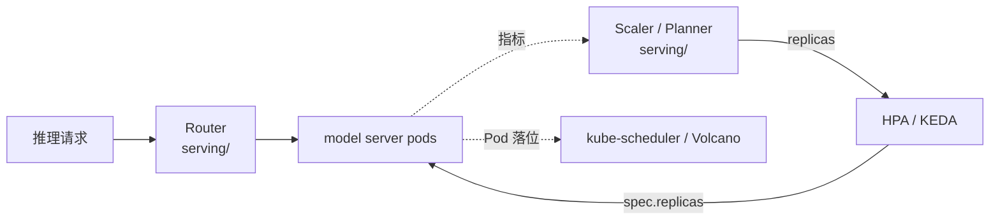

# 弹性扩缩容（Autoscaling）

大模型推理服务的**弹性扩缩容**学习资料。聚焦「这个模型现在到底该开几个副本、加在哪个机型上」这一核心问题。

LLM 语义的扩缩容正文按**项目**收在 [`serving/`](../serving/)（和同项目的 Router 放在一起）。本目录是问题域索引，也留给将来的通用方案（HPA / KEDA / Knative）。

## 目录

| 项目 | 正文位置 | 源码基线 | 定位 |
|------|---------|---------|------|
| llm-d WVA | [`serving/llm-d/autoscaling/`](../serving/llm-d/autoscaling/) | `release-0.9 @ d5d5864` | token 供需双阈值、异构机型、P/D 联合扩容；产出 `wva_desired_replicas` 给 HPA/KEDA |
| NVIDIA Dynamo Planner | [算式：`serving/dynamo/03`](../serving/dynamo/03-核心代码分析-SLA-Planner.md) ｜ [流水线：`serving/dynamo/07`](../serving/dynamo/07-弹性扩缩容实现逻辑.md) | `main @ 946acce` | SLA（TTFT / ITL）作为**容量搜索的约束**而非阈值：在 batch size 上搜满足 SLA 且 rps 最大的配置，再 `ceil(需求 rps ÷ 单副本 rps)`。慢环给下界 + 快环按在线回归估延迟做细调，经五阶段插件管道合并约束后落到 DGDSA 的 scale 子资源 |

**两者的方法论差异**：完整对比见 [Dynamo 08 篇](../serving/dynamo/08-扩缩容方法对比-与llm-d-WVA.md)，摘要如下。

| | llm-d WVA | Dynamo Planner |
|---|---|---|
| 方法论 | **倒推**：供需比 → 缺口 | **正推**：单副本容量 → 副本数 |
| 核心量 | KV token 供需比 | 单副本容量（rps） |
| 单副本容量来源 | 当前观测（免前置，含义随工况变） | 性能模型（需前置 profile，**可外推**） |
| SLA 怎么进入 | 间接（0.85/0.70 阈值隐含延迟） | **直接**（TTFT/ITL 是搜索约束）；但默认档是静态阈值 |
| 防抖动 | **静态死区** + pending 的刻意不对称 | **模型预演**（`N/(N-1)`）+ ready 门禁，无死区无 cooldown |
| 多信号融合 | analyzer 投票（any-up / all-down） | 类型化合并（SET / AT_LEAST / AT_MOST） |
| 异构机型 | **一等公民**（cost-aware 择优） | 无此概念 |
| 谁改 replicas | 不改，出指标给 HPA/KEDA | 自己改，但改的是 **DGDSA 的 scale 子资源**（HPA 也能改的同一入口） |
| 0 副本唤醒 | 内建一等公民（能看到网关队列） | 允许配 0，但零副本时无 FPM 信号，唤醒靠外部组件 |

> 更多扩缩容方案（HPA/KEDA 自身机制、Knative、各家 serverless 推理）将持续补充，笔记会直接落在本分类下。

## 为什么扩缩容仍是一个独立分类

扩缩容和[调度](../scheduling/)常被混在一起说，但它们回答的是**两个不同的问题**：

> **扩缩容决定「该有几个副本」（改 `spec.replicas`）；调度决定「这些 Pod 落到哪个节点」（写 `pod.spec.nodeName`）。**

WVA 一度被归在 `scheduling/` 下，是因为它和 llm-d Router 同属一个项目。按问题域看，它和 kube-scheduler / Volcano / Kueue **没有重叠**：后三者只在「副本数已经定了」之后才开始工作。真正与 WVA / Planner 同域的是 HPA、KEDA、Knative。

现在的落盘规则是 **项目正文在 `serving/`，问题域索引在这里**——避免再把同一个服务栈拆到三个顶级目录。详见 [`serving/README`](../serving/README.md)。

一句话区分三层：

> **Scaler 决定「该有几个副本」，[Router](../serving/llm-d/router/) 决定「这个请求发给哪个副本」，[kube-scheduler / Volcano](../scheduling/) 决定「副本落到哪个节点」。**



## 为什么 LLM 推理需要专门的扩缩容

通用 HPA 在 LLM 推理上有四个实质失效点，也正是 WVA / Planner 存在的理由：

| 能力 | HPA 做不到的原因 |
|------|-----------------|
| **按 KV token 衡量负载** | CPU/内存对 LLM 无意义（vLLM 启动就把显存占满，CPU 恒定 10%） |
| **异构机型成本选择** | HPA 一次只看一个 Deployment，看不到同模型还有更便宜的变体 |
| **P/D 联合扩容** | 两个独立 HPA 各看自己指标，必然扩成不匹配的比例 |
| **0 副本唤醒** | 0 副本时没有 pod 暴露指标，HPA 的反馈环是断的 |

> **HPA 是「一个指标 → 一个 Deployment」的局部反馈环；WVA / Planner 是带 LLM 语义的全局决策器。** 它们通常不取代 HPA，而是把算好的目标副本数喂给它（或直接改 replicas）。

## llm-d WVA 学习路线

正文在 [`serving/llm-d/autoscaling/`](../serving/llm-d/autoscaling/)。统一示例：模型 `llama-8b` 的两个变体（`llama-8b-a100` cost 10.0 / `llama-8b-l40s` cost 4.0）+ 一组 P/D 分离变体。

| 篇 | 主题 | 核心问题 |
|----|------|---------|
| [00](../serving/llm-d/autoscaling/00-WVA总览与架构.md) | 总览与架构 | 什么是「变体」、**变体从注解合成为内存对象**、Reconciler 不做决策、三个 leader-only 轮询循环、V1/V2 与 QM 拒绝路径 |
| [01](../serving/llm-d/autoscaling/01-核心原理-轮询引擎与双阈值容量模型.md) | **双阈值容量模型** | `RC = max(0, demand/0.85 − anticipated)`、`SC = max(0, supply − demand/0.70)`；结构性死区；扩容/缩容的刻意不对称 |
| [02](../serving/llm-d/autoscaling/02-核心代码分析-指标采集与Analyzer.md) | 采集与 Analyzer | 16 条逻辑查询、pod→变体映射、**k2 四级链**、throughput `T-sfz`、QM 保留设计 |
| [03](../serving/llm-d/autoscaling/03-核心代码分析-Optimizer与Limiter.md) | Optimizer 与 Limiter | cost-aware vs greedy-by-score、P/D 联合提交、quota/inventory 限流器、rescale |
| [04](../serving/llm-d/autoscaling/04-面向大模型推理的能力地图.md) | 能力地图 | 能做/做不到、三种落地形态、坑清单 |
| [05](../serving/llm-d/autoscaling/05-实战Demo.md) | 实战 Demo | kind + 模拟 GPU 跑通全链路 |
| 📄 [`wva-autoscaling-logic.html`](../serving/llm-d/autoscaling/wva-autoscaling-logic.html) | 计算逻辑可视化速查 | 公式字典、指标来源表、数值 Demo |

**建议顺序**：00 → 01（必读）→ 打开 html 速查 → 按需读 02/03 → 04 决定用不用 → 05 动手。

WVA 按 **`release-0.9 @ d5d5864`** 分析（与 `v0.9.0` tag 相差 3 个提交），详见 [该系列 README](../serving/llm-d/autoscaling/README.md#版本对照与复现)。

## 与其他分类的关系

```
inference-engine/    ← 推理引擎：单个副本内部怎么算（算）
       │
kvcache/             ← KV 怎么跨实例搬、跨介质存（存 + 搬）
       │
serving/             ← 服务栈正文：路由 + 伸缩 + P/D 编排
       │
autoscaling/         ← 本分类：问题域索引（伸缩）
scheduling/          ← 问题域索引（Pod 落位 + 作业准入）
```

**建议先读** [`serving/llm-d/router/`](../serving/llm-d/router/)：它处理的「一个请求发给谁」更贴近日常排障，而 WVA 的容量模型建立在对 KV token 供需的理解上。
