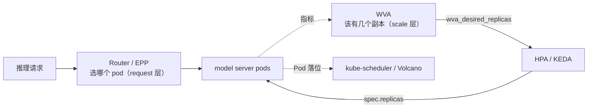

# 弹性扩缩容（Autoscaling）

大模型推理服务的**弹性扩缩容**学习资料。聚焦「这个模型现在到底该开几个副本、加在哪个机型上」这一核心问题。

## 目录

| 项目 | 目录 | 源码基线 | 定位 | 说明 |
|------|------|---------|------|------|
| llm-d WVA | [`llm-d-autoscaling/`](llm-d-autoscaling/) | `release-0.9 @ d5d5864` | **推理副本数决策器（scale 层）** | 带 LLM 语义（KV token / TTFT-ITL SLO）的自动扩缩容大脑：token 供需双阈值、异构机型成本优化、P/D 联合扩容、缩容到零。产出 `wva_desired_replicas` 指标供 HPA/KEDA 消费 |

> 更多扩缩容方案（HPA/KEDA 自身机制、Knative、各家 serverless 推理）将持续补充。

> WVA 按 **`release-0.9 @ d5d5864`** 分析（与 `v0.9.0` tag 相差 3 个提交）。源码片段包含省略和教学注释，请按 [该系列 README](llm-d-autoscaling/README.md#版本对照与复现) 的基线检出后对照对应函数。

## 为什么单独开一个分类

扩缩容和[调度](../scheduling/)常被混在一起说，但它们回答的是**两个不同的问题**：

> **扩缩容决定「该有几个副本」（改 `spec.replicas`）；调度决定「这些 Pod 落到哪个节点」（写 `pod.spec.nodeName`）。**

WVA 一度被归在 `scheduling/` 下，是因为它和 llm-d Router 同属 llm-d 项目。但按问题域分，它和 kube-scheduler / Volcano / Kueue 之间**没有任何重叠**：后三者只在「副本数已经定了」之后才开始工作。真正与 WVA 同域的是 HPA、KEDA、Knative 这类东西 —— 所以单独成类。

一句话区分三层：

> **WVA 决定「该有几个副本」，[Router](../scheduling/llm-d/) 决定「这个请求发给哪个副本」，[kube-scheduler / Volcano](../scheduling/) 决定「副本落到哪个节点」。**



## 为什么 LLM 推理需要专门的扩缩容

通用 HPA 在 LLM 推理上有四个实质失效点，也正是 WVA 存在的理由：

| 能力 | HPA 做不到的原因 |
|------|-----------------|
| **按 KV token 衡量负载** | CPU/内存对 LLM 无意义（vLLM 启动就把显存占满，CPU 恒定 10%） |
| **异构机型成本选择** | HPA 一次只看一个 Deployment，看不到同模型还有更便宜的变体 |
| **P/D 联合扩容** | 两个独立 HPA 各看自己指标，必然扩成不匹配的比例 |
| **0 副本唤醒** | 0 副本时没有 pod 暴露指标，HPA 的反馈环是断的 |

> **HPA 是「一个指标 → 一个 Deployment」的局部反馈环；WVA 是「所有变体一起看」的全局优化器。** WVA 不取代 HPA，而是把算好的目标副本数以指标形式喂给它。

## llm-d WVA 学习路线

统一示例：模型 `llama-8b` 的两个变体（`llama-8b-a100` cost 10.0 / `llama-8b-l40s` cost 4.0）+ 一组 P/D 分离变体（`llama-70b-prefill` / `llama-70b-decode`）。

| 篇 | 主题 | 核心问题 |
|----|------|---------|
| [00](llm-d-autoscaling/00-WVA总览与架构.md) | 总览与架构 | 什么是「变体」、**变体从注解合成为内存对象**、Reconciler 不做决策、三个 leader-only 轮询循环、V1/V2 与 QM 拒绝路径 |
| [01](llm-d-autoscaling/01-核心原理-轮询引擎与双阈值容量模型.md) | **双阈值容量模型** | `RC = max(0, demand/0.85 − anticipated)`、`SC = max(0, supply − demand/0.70)`；结构性死区；扩容/缩容的刻意不对称；any-up / all-down 与 liveness 门；**完整数值演算** |
| [02](llm-d-autoscaling/02-核心代码分析-指标采集与Analyzer.md) | 采集与 Analyzer | 16 条逻辑查询（含 12 条 per-replica，vLLM/SGLang 双后端）、pod→变体映射、**k2 四级链**、throughput `T-sfz`、QM 保留设计 |
| [03](llm-d-autoscaling/03-核心代码分析-Optimizer与Limiter.md) | Optimizer 与 Limiter | cost-aware vs greedy-by-score、**bindingAnchor / Enabled 投票与 P/D 联合提交**、quota/inventory 限流器、**rescale 优先级水填充**、Enforcer |
| [04](llm-d-autoscaling/04-面向大模型推理的能力地图.md) | 能力地图 | 能做/做不到、三种落地形态、坑清单、上线检查清单 |
| [05](llm-d-autoscaling/05-实战Demo.md) | 实战 Demo | kind + 模拟 GPU 跑通全链路，9 个 Demo（含 throughput-only、QM 拒绝与恢复）核对机制，排障决策树 |
| 📄 [`wva-autoscaling-logic.html`](llm-d-autoscaling/wva-autoscaling-logic.html) | 计算逻辑可视化速查 | 公式字典、指标来源表、数值 Demo、风险清单（浏览器打开） |

**建议顺序**：00 → 01（必读，公式是全篇基础）→ 打开 html 速查一遍 → 按需读 02/03 → 04 决定用不用 → 05 动手。

## 与其他分类的关系

```
inference-engine/    ← 推理引擎：单个副本内部怎么算（算）
       │
kvcache/             ← KV 怎么跨实例搬、跨介质存（存 + 搬）
       │
autoscaling/         ← 本分类：该开几个副本（伸缩）
       │
scheduling/          ← 请求发给哪个副本、副本落到哪个节点（路由 + 调度）
```

**建议先读** [`scheduling/llm-d/`](../scheduling/llm-d/)（Router）：它处理的「一个请求发给谁」是更贴近日常排障的问题，而 WVA 的容量模型建立在对 KV token 供需的理解上，读过 Router 的 Data Layer（03 篇）会更顺。两者互不依赖，也可以直接从这里开始。
