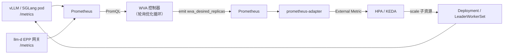
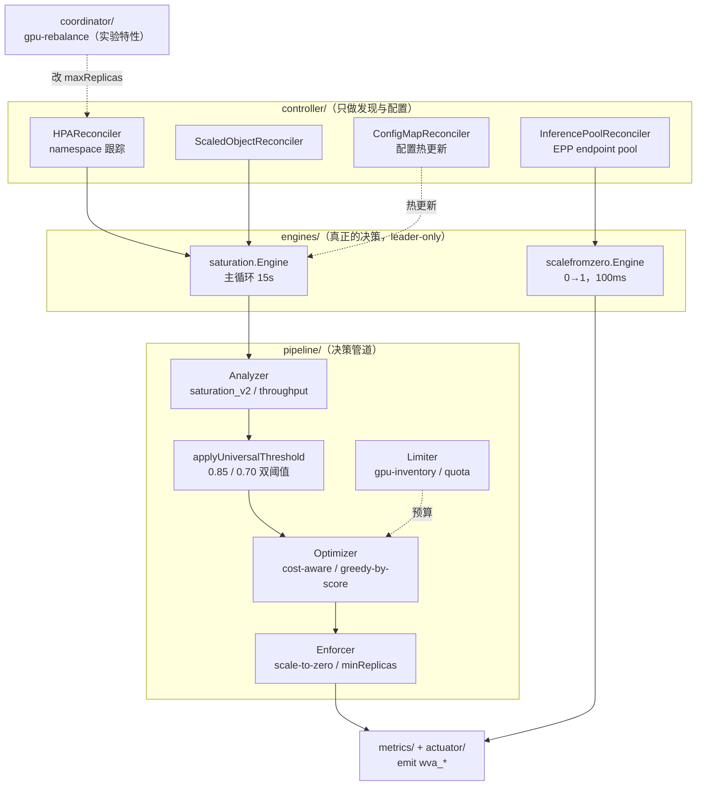

# 00 · WVA 总览与架构

> **源码基线**：[`release-0.9 @ d5d5864`](https://github.com/llm-d/llm-d-autoscaling/tree/d5d586408420fbe0545f827a6ff5dc2f818b16de)（2026-08-07；2026-09-07 核对）。分支与 `v0.9.0` tag 相差 3 个提交，详见 [版本对照](README.md#版本对照与复现)。
> 本地路径：`sources/llm-d-autoscaling`（Go module 名为 `github.com/llm-d/llm-d-workload-variant-autoscaler`，与仓库名不同，代码里统一用 `wva` 缩写）

## 0. 一句话定位

**WVA（Workload Variant Autoscaler）是给 HPA/KEDA 喂目标副本数的"全局大脑"。**

它工作在 **scale 层**，唯一的输出是一个 Prometheus 指标 `wva_desired_replicas`：

| | 谁来做 | 写什么字段 |
|---|-------|-----------|
| 副本数**应该**是多少、该加在哪个变体上 | **WVA** | 只 emit `wva_desired_replicas` 指标，**从不直接改 replicas**（唯一例外见 §5 scale-from-zero） |
| 副本数**实际**改成多少 | HPA / KEDA | `deployment.spec.replicas`（scale 子资源） |

一句话区分它和 HPA：

> **HPA 是"一个指标 → 一个 Deployment"的局部反馈环；WVA 是"整个集群的 token 供需 + GPU 预算 + 成本 + SLO → 所有变体的副本分配"的全局优化器。**
> WVA 把优化结果写成一个 External Metric，HPA/KEDA 读它、再套上自己的 behavior 策略（稳定窗口、每周期步长），最终动手改副本。



注意这是一个**绕了一圈的闭环**：WVA 的输出要先落到 Prometheus，再经 prometheus-adapter 变成 External Metric，才被 HPA 读到。代价是多了两跳延迟（scrape 间隔 + adapter 缓存），收益是 WVA 完全不需要 `patch deployments` 权限，也不与 HPA 抢写 `spec.replicas`。

## 1. 什么是"变体"（Variant）

这是理解 WVA 的第一把钥匙。

> **变体 = 服务同一个 base model、但硬件配置或服务配置不同的一组模型服务副本。**

`README.md:12-18` 给了三类用法：

| 用法 | 变体的含义 |
|------|-----------|
| **P/D 分离** | prefill 是一个变体，decode 是另一个变体 —— 变体 = 分离流水线中的角色 |
| **batch-gateway** | 变体区分「批处理 vs 交互式」两类共享同一 pool 的工作负载 |
| **自动扩缩容**（本系列重点） | 变体 = 一个「带成本的服务配置」，优化器在其中做选择 |

对比一下就明白 WVA 补了 HPA 什么缺口：

```
HPA 的世界：            llama-8b Deployment → replicas = f(单个指标)
WVA 的世界：  模型 llama-8b ┬─ 变体 llama-8b-a100  （1×A100，cost 10.0，每副本容量 90k token）
                          └─ 变体 llama-8b-l40s  （1×L40S，cost  4.0，每副本容量 60k token）
              → 需要再吃 60k token 的缺口时，加哪个？加几个？
```

HPA 无法回答最后那个问题 —— 它一次只看一个 Deployment，看不到「同一个模型还有另一个更便宜的变体」。

## 2. 统一示例（贯穿 00~05 篇）

后面所有篇章都用这一组对象，方便串起来读：

```
集群：node-a（8×A100）、node-b（8×L40S）
命名空间：llm-d

模型 M = "meta-llama/Llama-3.1-8B-Instruct"
  ├── 变体 V1 = llama-8b-a100 （Deployment，1×A100/副本，cost 10.0，role=both）
  └── 变体 V2 = llama-8b-l40s （Deployment，1×L40S/副本，cost  4.0，role=both）

模型 D = "meta-llama/Llama-3.1-70B-Instruct"（P/D 分离）
  ├── 变体 P = llama-70b-prefill （role=prefill）
  └── 变体 Q = llama-70b-decode  （role=decode）

每个变体一个 HPA，HPA 上打 llm-d.ai/managed: "true"
```

## 3. 三个影响代码走向的关键设计

读源码前先建立这三点认知，否则会在错误的地方找逻辑。

### 3.1 变体曾经是 CRD，现在是内存对象

**这一节要防的是：你拿到的大部分 WVA 资料是过时的。**

WVA 的决策单元叫 `VariantAutoscaling`。它**曾经是一个真的 CRD**（`llmd.ai/v1alpha1`），在当前版本已被移除，改为每个优化周期从**带 `llm-d.ai/managed` 注解的 HPA / KEDA ScaledObject 现场合成**，只存在于内存。

```go
// internal/variant/types.go:1-8
// Package variant defines the in-memory VariantAutoscaling representation ...
//
// It was previously the llmd.ai/v1alpha1 VariantAutoscaling CRD API. The CRD has
// been removed; discovery now happens by synthesizing these structs from annotated
// HPAs and KEDA ScaledObjects ... The types are kept as plain in-memory structs —
// they are never registered in a scheme or written to the Kubernetes API server.
```

迁移前后的形态差别（`docs/developer-guide/migrating-from-va-crd.md`）：

| | 对象数 | 写法 |
|---|---|---|
| 旧（CRD 时代） | **2 个** | 一个 `VariantAutoscaling` CR + 一个 HPA |
| 新（当前） | **1 个** | 一个 HPA，加三个 `llm-d.ai/*` 注解 |

#### 为什么必须先知道这件事

**仓库自己的文档还没清理干净**，照着做会直接失败：

| 位置 | 内容 | 后果 |
|------|------|------|
| `docs/developer-guide/metrics-health-monitoring.md:44,59` | `kubectl get variantautoscaling -A` | `error: the server doesn't have a resource type` |
| `docs/user-guide/sglang-backend.md:30` | `kind: VariantAutoscaling` 的 YAML | `no matches for kind "VariantAutoscaling"` |
| `migrating-from-va-crd.md:3` | 说 CRD "**will be** removed in a future release" | 与 `types.go` 的 "**has been** removed" 矛盾，文档比代码旧 |

网上的旧 blog、旧版本 README 同理。**判断一份 WVA 资料是否过时，最快的方法就是看它有没有让你 apply 一个 `VariantAutoscaling` 对象。**

#### 读源码时的两个坑

1. **那些 `v1alpha1` 风格的 import 别名会骗人。** 源码里到处是 `llmdVariantAutoscalingV1alpha1.VariantAutoscaling{}` 这类写法，看起来像标准的 CRD API 包引用，实际全都指向 `internal/variant`。而且**同一个包被起了 5 个不同的别名**，grep 时很容易只捞到一部分：

   | 别名 | 引用它的文件数（非测试 / 全部） |
   |------|------------------------------|
   | `llmdVariantAutoscalingV1alpha1` | 5 / 16 ← 主力 |
   | `llmdOptv1alpha1` | 3 / 5 |
   | `vav1alpha1` | 3 / 5 |
   | `wvav1alpha1` | 3 / 4 |
   | `llmdv1alpha1` | 0 / 1 |

   ```go
   // 5 个别名，同一个 import 路径
   llmdVariantAutoscalingV1alpha1 "github.com/llm-d/llm-d-workload-variant-autoscaler/internal/variant"
   ```

   要找全所有使用点，按 **import 路径** 而不是别名去搜：
   `grep -rl 'llm-d-workload-variant-autoscaler/internal/variant"' --include='*.go'`（非测试 14 个文件）。

   **仓库里没有 `api/` 目录，也没有 `config/crd/`。** 别去找。

2. **`internal/variant/scheme.go` 里还留着 `GroupVersion` 和 `AddToScheme`**，但注释写明了用途：

   > retained **solely so unit tests can register the type with a controller-runtime fake client** ... The production manager scheme (cmd/main.go) does NOT register these types.

   即 `cmd/main.go:87-93` 注册了 client-go / prometheus-operator / KEDA / LWS 的 scheme，**唯独没有 WVA 自己的类型**。

#### 排障影响

- `kubectl get variantautoscaling` —— 没有这个资源类型
- `kubectl describe hpa` —— 看不到 WVA 写的 status
- **WVA 的全部状态只在内存 + 日志 + `wva_*` 指标里**。要看它在想什么，只能看 `analyzer-result` / `scaling-decision` 日志（05 篇 §11）和 Prometheus

**【Go】** 这个结构体仍实现 `runtime.Object`（`types.go:78-95` 嵌了 `metav1.TypeMeta`/`ObjectMeta`），是为了复用 `EventRecorder` 对它记录 K8s Event，以及让下游统一读 `Name`/`Namespace`/`Labels`。

#### 合成时读哪些注解

合成逻辑在 `internal/annotations/variant_fromannotations.go`，变体名直接取 **HPA / ScaledObject 的 `metadata.name`**（这一点在排障时很关键：日志里的 `variant` 字段就是 HPA 名）。

| 注解 | 必填 | 含义 |
|------|------|------|
| `llm-d.ai/managed` | ✅ 值必须为 `"true"` | 把这个 HPA/ScaledObject 纳入 WVA 管理 |
| `llm-d.ai/model-id` | ✅ | 模型标识，**多变体分组的依据**（同 modelID + 同 namespace = 同一模型的多个变体） |
| `llm-d.ai/variant-cost` | ❌ 默认 `"10.0"` | 每副本成本，cost-aware 优化器的输入 |
| `llm-d.ai/synthetic` | 由代码写入 | 标记"内存态、禁止写回 API server" |
| `llm-d.ai/epp-inference-pool` | ❌ | 仅 Coordinator 的 gpu-rebalance 插件用（见 §6） |

> ⚠️ **KEDA 与 HPA 的一个关键差异**：HPA 的 `minReplicas` 不能为 0，代码里 nil 时兜底成 1；而 KEDA `ScaledObject` 直接读 `so.Spec.MinReplicaCount`（`variant_fromannotations.go:58`），**能取到真正的 0** —— 所以 scale-to-zero 在 KEDA 路径上才是原生可用的。

完整的可运行 YAML 见 05 篇，或仓库的 `config/samples/hpa/annotations/`。

### 3.2 Reconciler 不做扩缩容决策

WVA 用了 controller-runtime，但**四个 Reconciler 全都不做决策**：

| Reconciler | 唯一职责 | 源码 |
|-----------|---------|------|
| `HPAReconciler` | 把带注解的 HPA 所在 namespace 加入/移出跟踪列表 | `internal/controller/hpa_reconciler.go:46-62` |
| `ScaledObjectReconciler` | 同上，针对 KEDA ScaledObject（仅 KEDA CRD 存在时注册） | `internal/controller/scaledobject_reconciler.go:47-63` |
| `InferencePoolReconciler` | 维护 datastore 里的 EPP endpoint pool（v1 + v1alpha2 双 API 组） | `internal/controller/inferencepool_reconciler.go:47-100` |
| `ConfigMapReconciler` | 配置热更新（saturation-scaling / queueing-model / manager） | `internal/controller/configmap_reconciler.go` |

`HPAReconciler` 全文只有这么点内容：

```go
// internal/controller/hpa_reconciler.go:46-62
func (r *HPAReconciler) Reconcile(ctx context.Context, req ctrl.Request) (ctrl.Result, error) {
	hpa := &autoscalingv2.HorizontalPodAutoscaler{}
	if err := r.Get(ctx, req.NamespacedName, hpa); err != nil {
		if apierrors.IsNotFound(err) {
			r.Datastore.NamespaceUntrack("AnnotatedScaler", req.Name, req.Namespace)
			return ctrl.Result{}, nil
		}
		return ctrl.Result{}, err
	}

	if !hpa.DeletionTimestamp.IsZero() || !annotations.IsManaged(hpa) {
		r.Datastore.NamespaceUntrack("AnnotatedScaler", req.Name, req.Namespace)
	} else {
		r.Datastore.NamespaceTrack("AnnotatedScaler", req.Name, req.Namespace)
	}
	return ctrl.Result{}, nil
}
```

**【逻辑】** 为什么要单独跟踪 namespace？因为 K8s RBAC **不支持按 annotation 做 selector**，WVA 只能 cluster-wide `list/watch` 全部 HPA，然后自己在内存里维护"哪些 namespace 里有我管的东西"，把后续轮询的 List 范围缩小。这个取舍在 `hpa_reconciler.go:40-43` 有注释说明。

### 3.3 真正的决策跑在两个独立的定时轮询循环里

`cmd/main.go` 用 `mgr.Add(manager.RunnableFunc(...))` 注册了两个引擎，**只在 leader 上启动**：

```go
// cmd/main.go:516-541（摘录，去掉了 limiter 构造的日志）
		engine := saturation.NewEngine(
			mgr.GetClient(), mgr.GetAPIReader(), mgr.GetScheme(),
			mgr.GetEventRecorderFor("workload-variant-autoscaler-saturation-engine"),
			sourceRegistry, cfg, gpuLimiter,
		)
		// 限流器随 ConfigMap 热重建，不用重启
		engine.SetLimiterBuilder(func() (pipeline.Limiter, error) {
			return pipeline.NewLimiterFromConfig(cfg, mgr.GetClient())
		})
		if taRegistered {
			registration.RegisterThroughputAnalyzerQueries(sourceRegistry)
			if err := engine.RegisterAnalyzer(throughput.AnalyzerName, throughput.NewThroughputAnalyzer()); err != nil {
				return err
			}
		}
		go engine.StartOptimizeLoop(ctx)
		return nil
```

```go
// cmd/main.go:551-558
	err = mgr.Add(manager.RunnableFunc(func(ctx context.Context) error {
		engine, err := scalefromzero.NewEngine(mgr.GetClient(), ..., ds, cfg)
		if err != nil { return err }
		go engine.StartOptimizeLoop(ctx)
		return nil
	}))
```

| 引擎 | 轮询间隔 | 作用 |
|------|---------|------|
| `saturation.Engine` | `OptimizationInterval`（默认 15s，ConfigMap `GLOBAL_OPT_INTERVAL`） | 主扩缩容引擎，本系列重点 |
| `scalefromzero.Engine` | **固定 100ms**（`scalefromzero/engine.go`） | 专门做 0→1 冷启动，**直接改 replicas** |

两者都由 `executor.PollingExecutor` 驱动。

> **fail-fast 设计**：Prometheus 连不上时 `main.go:455-458` 直接 `os.Exit(1)` —— autoscaling 强依赖 metrics，宁可不启动也不要"瞎猜副本数"。同理 `NewEngine` 在 `cfg == nil` 或 `gpuLimiter == nil` 时直接 `panic`（`engine.go`）。

## 4. 组件全景



代码规模（`internal/` + `cmd/`，不含测试，29333 行）：

| 模块 | 行数 | 说明 |
|------|------|------|
| `engines/saturation/engine.go` | 1983 | 主引擎（V1/V2 调度，QM 显式拒绝） |
| `collector/replica_metrics.go` | 1223 | 12 个 PromQL 查询 → `[]ReplicaMetrics` |
| `metrics/metrics.go` | 939 | 27 个 `wva_*` 指标 |
| `engines/analyzers/throughput/analyzer.go` | 949 | 吞吐分析器（ITL 模型 + OLS 拟合 + `T-sfz`） |
| `engines/analyzers/queueingmodel/analyzer.go` | 860 | 排队模型保留实现（当前不调度） |
| `engines/analyzers/saturation_v2/analyzer.go` | 833 | **V2 token 供需模型（默认）** |
| `engines/saturation/engine_v2.go` | 750 | V2 路径 + 双阈值后处理 + enablement |
| `engines/pipeline/*` | 4282 | 优化器、限流器、rescale、enforcer |

## 5. 一次扩缩容决策的一生

以统一示例的模型 M 为例，走一遍 `saturation.Engine` 的一个 tick：

```
定时器 tick（间隔 OptimizationInterval，默认 15s）
   │
   ├─ 0. refreshLimiter：ConfigMap 的 limiters: 变了就热重建 GPU 限流器
   │
   ├─ 1. ActiveVariantAutoscaling：扫描跟踪 namespace 内带注解的 HPA/ScaledObject
   │       → 合成 [V1, V2, P, Q] 四个内存态 VariantAutoscaling
   │
   ├─ 2. GroupVariantAutoscalingByModel：按 (modelID, namespace) 分组
   │       → { M: [V1,V2], D: [P,Q] }
   │
   ├─ 3. 选路（optimize，engine.go）
   │       QM 配置含 default？→ refuseQueueingModel → 保持副本并 emit
   │       否则看 saturation config 的 analyzerName：
   │         "saturation"  → V2 路径（默认）
   │         ""            → V1 路径（deprecated，未来移除）
   │       同时按 enableLimiter 选优化器：
   │         true  → GreedyByScoreOptimizer（吃 GPU 约束）
   │         false → CostAwareOptimizer（unlimited）
   │
   ├─ 4. 每个模型：prepareModelData → 12 条 per-replica PromQL → []ReplicaMetrics
   │       （调度器队列、模型级到达率各走独立 Refresh，见 02 篇 §1.1）
   │
   ├─ 5. 每个模型：runAnalyzersAndScore
   │       ├─ saturation_v2.Analyze → TotalSupply / TotalDemand / TotalAnticipatedSupply
   │       ├─ applyUniversalThreshold（0.85/0.70）→ RequiredCapacity / SpareCapacity
   │       ├─ saturation 始终提供身份，Enabled 决定是否投票
   │       ├─ 其它已注册且 enabled 的 analyzer 同样跑一遍 + 同样过双阈值
   │       └─ updateLivenessAndSetLive：3 个周期没出过有效结果 → 该 analyzer 非 live
   │
   ├─ 6. 一次性调用 Optimizer.Optimize(所有模型的请求)
   │       token 缺口 ÷ 每副本容量 → 副本增量；成本/优先级决定加在哪个变体
   │
   ├─ 7. Enforcer：scale-to-zero 与 minReplicas 兜底修正
   │
   ├─ 8. applySaturationDecisions：写内存 status + DecisionCache + emit wva_desired_replicas
   │
   └─ 外部：Prometheus scrape → prometheus-adapter → HPA/KEDA 改 replicas
```

### scale-from-zero 是唯一的例外

`scalefromzero.Engine` 每 100ms 扫一遍"当前 0 副本"的变体，若 EPP 的 flow-control 队列里有该模型的请求，就**直接调 scale 子资源**拉到 1：

```go
// internal/engines/scalefromzero/engine.go
	result := results["all_metrics"]
	pendingRequestExist := false
	for _, value := range result.Values {
		metricName := value.Labels["__name__"]
		if metricName == targetEPPMetricName && value.Value > 0 {   // inference_extension_flow_control_queue_size
			if value.Labels[targetEPPMetricLabel] == va.Spec.ModelID { // target_model_name
				pendingRequestExist = true
				break
			}
		}
	}
```

```go
// internal/engines/scalefromzero/engine.go
	// 1.  Scale up from zero to one
	// TODO: Right now we are scaling all the VA for the same target model. We need to scale only the VA that has the lowest cost.
	err = e.Actuator.ScaleTargetObject(ctx, unstructuredObj, int32(targetWorkloadReplicas))
```

**【逻辑】** 为什么这里必须绕开 HPA？因为 0 副本时**没有任何 vLLM pod 在暴露指标**，HPA 的 External Metric 没有数据点，反馈环是断的。所以只能由 WVA 直接捅一下 scale 子资源，把第一个 pod 拉起来，之后再交回常规环路。100ms 的轮询间隔就是为了把冷启动延迟压到最低。

注意那个 TODO —— 当前实现会把**同一模型的所有 0 副本变体都拉到 1**，还没做"只拉最便宜的那个"。

## 6. Coordinator：实验性的 GPU 配额再平衡

`cmd/main.go:613-638`，默认关闭（`EXPERIMENTAL_COORDINATOR_ENABLED: "true"` 开启）。它是**第三个** leader-only 循环，做的事情和主引擎正交：

> 主引擎调 **replicas**（在 maxReplicas 天花板以下）；Coordinator 调 **maxReplicas 这个天花板本身**。

`gpurebalance` 插件的算法（`internal/coordinator/plugins/gpurebalance/plugin.go:125-223`）：

```go
	// 权重：按 EPP 队列深度成比例，全为 0 时均分
	totalQueue := 0.0
	for _, q := range queues { totalQueue += q }
	weights := make([]float64, len(entries))
	if totalQueue == 0 {
		for i := range weights { weights[i] = 1.0 / float64(len(entries)) }
	} else {
		for i, q := range queues { weights[i] = q / totalQueue }
	}

	// 先给每个 scaler 留够 effectiveMin，剩下的按权重分；余数给权重最大的
	remaining := quota - minimumTotal
	for i := range entries {
		t := entries[i].effectiveMin + int32(math.Floor(float64(remaining)*weights[i]))
		targets[i] = t
		allocated += int64(t)
		if weights[i] > weights[maxWeightIdx] { maxWeightIdx = i }
	}
	if rem := quota - allocated; rem > 0 { targets[maxWeightIdx] += int32(rem) }
```

配额来源是 namespace 的 `ResourceQuota` 里的 `requests.nvidia.com/gpu`。

⚠️ 源码里自带三个明写的 TODO，说明它确实还不能上生产：
1. **抖动**：每 tick 都 patch，瞬时队列深度噪声（q=270 vs q=286）会让 floor 边界每 15s 翻一次，引发副本反复 ±1（`plugin.go:198-208`）。修法：最小 delta 门槛 + per-HPA 冷却 / EWMA 平滑。
2. **多 ResourceQuota**：只取第一个匹配的，正确做法是取所有 quota 的最小值（`plugin.go:228-235`）。
3. **跨 namespace 聚合**：EPP 队列查询只按 `inference_pool` 名过滤，同名 pool 在不同 namespace 会被求和（`plugin.go:250-254`）。

## 7. Analyzer 选路与当前可用状态

当前可执行的主路径是 V1 或 V2；V2 内可让 saturation、throughput 单独或共同投票。QM 保留了算法实现，但不再被主循环调度：

| Analyzer | 选择方式 | 核心思想 | 状态 |
|----------|---------|---------|------|
| **saturation V2**（token 供需） | 非空 `analyzers:` 或 `analyzerName: saturation` | 每副本容量 = min(k1 显存受限, k2 计算受限)；需求 = 已驻留 token + 排队 token | ✅ **默认路径** |
| saturation V1（百分比） | 删掉 `analyzers:` 且不设置 `analyzerName: saturation` | 直接看 KV 利用率/队列长度是否超阈值，输出 0/1 信号 | ⚠️ deprecated，未来移除 |
| **throughput**（吞吐） | `analyzers:` 里加 `- name: throughput` | 拟合 `ITL(k)=A·k+B`，算 decode token/s 的供给 μ_dec 与需求 λ_dec | ✅ 可单独投票；首次注册需重启 |
| **queueing-model**（SLO 排队论） | 部署 `wva-queueing-model-config` ConfigMap | 用扩展卡尔曼滤波在线学 (α,β,γ)，二分搜索满足 TTFT/ITL SLO 的最大到达率 λ* | ❌ 选路优先级仍最高，但进入拒绝路径 |

选路代码（`engine.go`）：

```go
	qmConfigMap := e.Config.QMAnalyzerConfig()
	_, hasQMAnalyzerConfig := qmConfigMap["default"]
	...
	// Queueing model ConfigMap takes priority over saturation analyzerName.
	if hasQMAnalyzerConfig {
		analyzerName = domain.QueueingModelAnalyzerName
	}
```

选路后还要看执行分派（`engine.go` 的 `optimize`）：

```go
case domain.QueueingModelAnalyzerName:
    e.refuseQueueingModel(ctx, modelGroups)
    optimizationRefused = true
case domain.SaturationAnalyzerName:
    allDecisions = e.optimizeV2(ctx, modelGroups, currentAllocations)
```

QM 分支不会退回 saturation。主循环仍调用 `applySaturationDecisions`：没有历史目标时读取当前 scale target 的副本数，继续发布指标；写入临时 `OptimizationReady=False/OptimizationRefused` 并尝试发送 Warning Event。该 condition 不持久化，应查日志和 Events。

三种模型的思路仍可对照，但 QM 只作为保留设计阅读：

> - **saturation V2 是"反应式"的**：看观测到的容量是否即将耗尽。
> - **throughput 是"预测式"的**：用性能模型算「以当前副本数能撑多少 token/s」，在需求超过供给前扩。
> - **queueing-model 的保留实现是"SLO 式"的**：直接以 TTFT/ITL 目标反推「一个副本最多能吃多少 QPS」。

## 附录：版本与源码阅读提示

### Analyzer 的选择完全由配置驱动

V1 与 V2 两个 saturation analyzer 都在二进制里，**切换不需要改代码或换镜像**，判据是合并后的配置 `IsV2()`：**非空 `analyzers` 列表或显式 `analyzerName: saturation`**：

```yaml
# V2（默认路径）
default: |
  analyzers:
    - name: saturation
      score: 1.0
  scaleUpThreshold: 0.85      # V2 专属
  scaleDownBoundary: 0.70     # V2 专属
  kvCacheThreshold: 0.80      # V1/V2 共用
  queueLengthThreshold: 5     # V1/V2 共用
  kvSpareTrigger: 0.1         # V1 专属（V2 忽略）
  queueSpareTrigger: 3        # V1 专属（V2 忽略）

# 切到 V1：删掉 analyzers:、analyzerName: saturation 和两个 V2 专属阈值
```

⚠️ **两条路径的输出单位不同**，切换时 dashboard 与告警阈值必须同步复查：

| 指标 | V1 | V2 |
|------|----|----|
| `wva_required_capacity` | 0/1 二值信号（`unit="binary"`） | 绝对 token 数（`unit="continuous"`） |
| `wva_spare_capacity` | 0..1 的阈值相对分数（`unit=""`） | 绝对 token 数（`unit="continuous"`） |

两个指标都带 `unit` label 用来区分（`metrics/metrics.go:175-183`），写 PromQL 时可以直接按它过滤。

### 源码阅读提示

- **module 路径与仓库名不一致**：GitHub 仓库是 `llm-d-autoscaling`，`go.mod` 的 module 是 `github.com/llm-d/llm-d-workload-variant-autoscaler`，import 路径与代码里的 `wva` 缩写都沿用后者。
- **`docs/` 与代码存在不一致，以代码为准**。典型例子：`docs/design/modeling-optimization.md:92-107` 写着 "WVA currently operates exclusively in unlimited mode / Limited mode 是 future work"，但 `enableLimiter` + `limiters:` 已经把 limited 模式实现了（见 03 篇）。
- **注释的信息量常常大于代码**。这个仓库大量注释在主动说明「当前实现哪里有偏差、为什么现在不改」（例如 fallback 路径的单位不一致、throughput 的 SC 安全门缺失），这些是理解设计取舍和排障的第一手线索。

### 追溯演进的方法

```bash
cd sources/llm-d-autoscaling
git log --oneline v0.8.0..d5d5864 -- internal/engines/analyzers/saturation_v2   # V2 分析器演进
git diff v0.8.0..d5d5864 -- deploy/configmap-saturation-scaling.yaml            # 默认配置变化
git log --oneline -- internal/engines/pipeline/rescale.go                      # rescale 的引入过程
git show wva-engine-eol --stat                                                 # 早期引擎下线时删了什么
```

---

**下一篇**：[01 · 核心原理：轮询引擎与双阈值容量模型](01-核心原理-轮询引擎与双阈值容量模型.md) —— 把 `applyUniversalThreshold` 那 8 行公式讲透，它是所有 analyzer 结果汇入的最终决策点。
