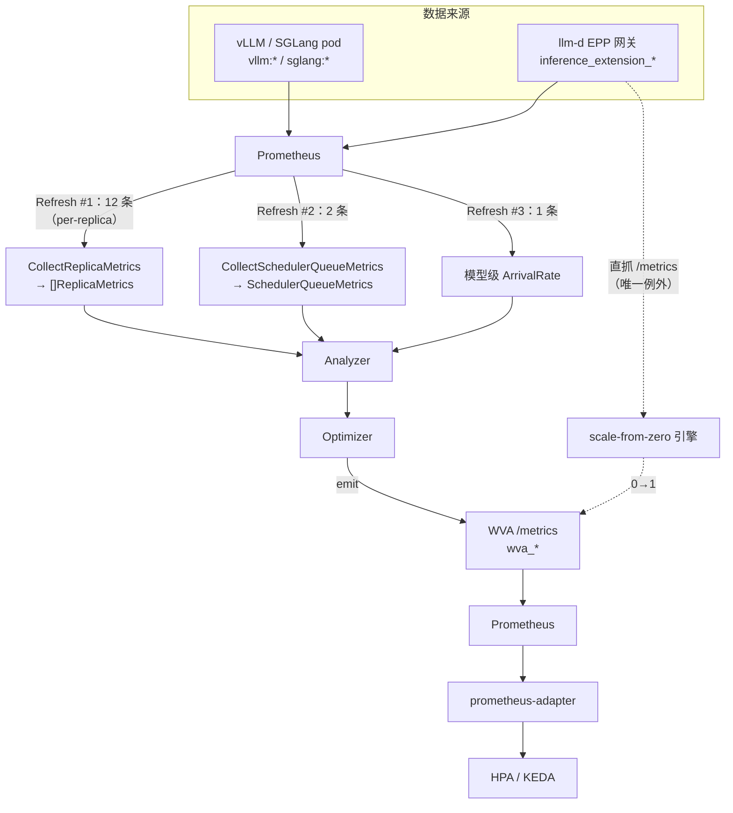

# 02 · 核心代码分析：指标采集与 Analyzer（含 QM 保留设计）

> **源码基线**：[`release-0.9 @ d5d5864`](https://github.com/llm-d/llm-d-autoscaling/tree/d5d586408420fbe0545f827a6ff5dc2f818b16de)（2026-08-07；2026-09-07 核对）。分支与 `v0.9.0` tag 相差 3 个提交，详见 [版本对照](README.md#版本对照与复现)。

> 承接 [01 篇](01-核心原理-轮询引擎与双阈值容量模型.md)。本篇回答两个问题：
> **① 那些 `TotalSupply` / `TotalDemand` 的原始数据到底从哪来（哪条 PromQL）？**
> **② saturation / throughput 如何把物理指标变成容量数字，以及已禁用 QM 的设计思路？**

## 1. 采集架构

**WVA 不直接访问推理引擎 pod 的 `/metrics`。** vLLM / SGLang 的指标由 Prometheus（通过 ServiceMonitor / PodMonitor）scrape 汇聚，WVA 用 **PromQL 向 Prometheus 查询**。WVA 自己的 `/metrics` 只暴露它**产出**的 `wva_*` 指标。

**但有一个例外：scale-from-zero 直接抓 EPP pod。** `internal/collector/source/pod/` 的 `PodScrapingSource` 会绕过 Prometheus，直连 EPP pod 的 `/metrics`（Bearer token 读自挂载的 `/var/run/secrets/epp-metrics/token`）。它由 `datastore.PoolSet` 在 InferencePool reconcile 时按 `namespace/poolName` 注册（`datastore.go:116-146`），非测试代码中**只有 `scalefromzero/engine.go` 消费它**。

**【逻辑】** 为什么 0→1 不能走 Prometheus：0 副本时要靠"网关上有没有排队请求"来决策，而这个信号经 Prometheus 会引入 scrape interval + rule evaluation 的延迟（数十秒量级）。冷启动本身已经要几分钟，再叠加采集延迟不可接受，所以这条路径**牺牲了架构一致性换取时延**。



### 1.1 查询不是一次发完的

主循环一共注册 **16 条逻辑查询**，分四批发出，混为一谈会导致排障找错方向：

| 批次 | 查询数 | 入口 | 时机 |
|------|-------|------|------|
| **per-replica** | **12** | `CollectReplicaMetrics`（`replica_metrics.go:363-370`） | 每周期，一次 `Refresh` |
| 调度器队列 | 2 | `CollectSchedulerQueueMetrics`（`:1095`） | 每周期，**独立 Refresh** |
| 模型级到达率 | 1 | `CollectModelArrivalRate`（`:1162`） | 每周期，独立 Refresh |
| scale-to-zero 请求数 | 1 | `CollectModelRequestCount` | **按需**，由 Enforcer 调用 |

> 表内 4 批全部走 Prometheus。上面提到的 scale-**from**-zero EPP 直抓不在其中 —— 它发的是 `Refresh(source.RefreshSpec{})`（空 spec = 拉全部指标，结果键为 `"all_metrics"`），不属于这 16 条注册查询。**注意 scale-to-zero（缩到 0）和 scale-from-zero（从 0 起）是两条独立链路，数据来源都不同。**

per-replica 的 12 条由 `buildEngineQueryList` 拼出（`engine_queries.go:21-40`）：

```go
// 11 条 engine-specific：按"present 的引擎种类"各展开一份，再合并回逻辑名
var engineSpecificReplicaQueries = []string{
	registration.QueryKvCacheUsage,       registration.QueryQueueLength,
	registration.QueryCacheConfigInfo,    registration.QueryAvgOutputTokens,
	registration.QueryAvgInputTokens,     registration.QueryPrefixCacheHitRate,
	registration.QueryAvgTTFT,            registration.QueryAvgITL,
	registration.QueryGenerationTokenRate, registration.QueryKvUsageInstant,
	registration.QueryRequestRate,
}

// 1 条 engine-agnostic：来自 EPP，与引擎无关，只发一次
var agnosticReplicaQueries = []string{
	registration.QuerySchedulerDispatchRate,
}
```

**【逻辑】** engine-specific 的含义是"同一个逻辑指标，vLLM 和 SGLang 的底层指标名不同"。混合引擎的模型会**为每种引擎各发一份**，再由 `mergeEngineResults` 按逻辑名合并（`replica_metrics.go:389`）。所以实际发往 Prometheus 的查询条数是 `1 + 11 × 引擎种类数`。

### 1.2 三类来源的性质

| 来源 | 粒度 | 谁暴露 | 作用 |
|------|------|--------|------|
| **A · 推理引擎** `vllm:` / `sglang:` | per-pod / per-instance | 每个模型服务 pod | 容量与需求分析的主力数据 |
| **B · EPP 网关** `inference_extension_` | **两种粒度并存**（见下） | gateway-api-inference-extension | 覆盖"尚未路由到任何 pod"的请求 |
| **C · WVA 自己** `wva_` | per-variant | WVA 控制器 | 出口，不是入口 |

来源 B 的粒度不统一，这一点容易搞混：

- `inference_extension_flow_control_queue_size` / `_bytes` → **模型级**（查询里是裸 `sum(...)`，不分组）
- `inference_extension_scheduler_attempts_total` → **per-pod**（`sum by (pod_name, port, namespace)`）或**模型级**（`sum by (namespace)`），取决于用哪条查询 —— 详见 §3.2

## 2. 来源 A：推理引擎指标

### 2.1 完整查询清单（按注册函数分组）

三个注册函数各管一部分，**不是全在 `saturation.go` 里**：

| 逻辑查询名 | 注册于 | vLLM 模板核心 | 聚合与窗口 | 消费者 |
|-----------|-------|--------------|-----------|-------|
| `kv_cache_usage` | `saturation.go` | `vllm:kv_cache_usage_perc` | `max by(...)（max_over_time[1m]）` | → `TokensInUse` |
| `queue_length` | `saturation.go` | `vllm:num_requests_waiting` | `max by(...)（max_over_time[1m]）` | 本地队列需求 + k2 的 P1 判据 |
| `cache_config_info` | `saturation.go` | `vllm:cache_config_info` 的 `num_gpu_blocks`/`block_size` **label** | `max by(...)`，瞬时 | → `TotalKvCapacityTokens` → k1 |
| `avg_output_tokens` (O) | `saturation.go` | `rate(request_generation_tokens_sum[5m]) / rate(..._count[5m])` | `max by(...)`，5m | k2 推导、需求计费 |
| `avg_input_tokens` (I) | `saturation.go` | `rate(request_prompt_tokens_sum[5m]) / rate(..._count[5m])` | `max by(...)`，5m | 同上 |
| `prefix_cache_hit_rate` | `saturation.go` | `rate(prefix_cache_hits[5m]) / rate(prefix_cache_queries[5m])` | `max by(...)`，5m | 调度器队列需求折减 |
| `avg_ttft` | **`queueing_model.go`** | `rate(time_to_first_token_seconds_sum[1m]) / rate(..._count[1m])` | `max by(...)`，1m | QM 的 EKF 观测量 |
| `avg_itl` | **`queueing_model.go`** | `rate(inter_token_latency_seconds_sum[1m]) / rate(..._count[1m])` | `max by(...)`，1m | QM 的 EKF 观测量；TA 的 ITL 拟合样本 |
| `generation_token_rate` | **`throughput_analyzer.go`** | `rate(request_generation_tokens_sum[1m])` | **`sum by(...)`**，1m | TA 的 μ_dec^obs（tokens/s） |
| `kv_usage_instant` | **`throughput_analyzer.go`** | `vllm:kv_cache_usage_perc`（**不套 max_over_time**） | `max by(...)`，瞬时 | TA 的工作点 k* |
| `request_rate` | **`throughput_analyzer.go`** | `rate(request_generation_tokens_count[1m])` | **`sum by(...)`**，1m | TA 的 λ 回退（**req/s**，完成率） |

`max by(...)` / `sum by(...)` 的分组键统一是 `(instance, pod, llm_d_ai_variant)`。

**【PromQL】两处聚合函数的选择是有讲究的，不能随手换：**

- `max by(...)` 用于**每 pod 只应有一条序列**的指标（gauge、histogram 比值）。这里的 `max` 纯粹是**去重** —— 同一个 pod 被 PodMonitor 和 ServiceMonitor 双重 scrape 时会出现重复序列，值相同，所以 `max = avg`，选哪个不影响正确性（`throughput_analyzer.go:49-54` 明确说明了这一点）。
- `sum by(...)` 用于**可加的速率**（`generation_token_rate`、`request_rate`、`scheduler_dispatch_rate`）。同一实例的多条序列应当相加而非取最大。

### 2.2 `KvCacheUsage` 到 `TokensInUse` 的换算

表里写"→ `TokensInUse`"，实际换算在采集器里（`replica_metrics.go:1005-1023`）：

```go
	// Compute V2 derived fields (zero-valued when unavailable, backward compatible)
	var totalKvCapacityTokens int64
	var tokensInUse int64
	if data.hasCacheConfig {
		// Overflow-safe multiplication: check before computing
		if data.numGpuBlocks > 0 && data.blockSize > math.MaxInt64/data.numGpuBlocks {
			totalKvCapacityTokens = math.MaxInt64
		} else {
			totalKvCapacityTokens = data.numGpuBlocks * data.blockSize
		}
		// Use math.Round for accurate float-to-int conversion and clamp to valid range
		rounded := math.Round(kvUsage * float64(totalKvCapacityTokens))
		if rounded < 0 {
			rounded = 0
		} else if rounded > float64(totalKvCapacityTokens) {
			rounded = float64(totalKvCapacityTokens)
		}
		tokensInUse = int64(rounded)
	}
```

```
TotalKvCapacityTokens = num_gpu_blocks × block_size
TokensInUse           = clamp(round(KvCacheUsage × TotalKvCapacityTokens), 0, TotalKvCapacityTokens)
```

**【关键】** 整段包在 `if data.hasCacheConfig` 里。**`cache_config_info` 采不到 ⇒ 两个字段都是 0**，而 `TotalKvCapacityTokens == 0` 正是 §6.4 那条 fallback 路径的触发条件。这条因果链是排障时最常用的一环：`analyzer-result` 里 `supply=0` 往往就是 `cache_config_info` 没采到。

**【逻辑】为什么 KV 用量有两条查询（1m 峰值 + 瞬时）？**

`throughput_analyzer.go:41-48` 解释了这一对：

> `QueryKvCacheUsage` 把 gauge 包在 `max_over_time[1m]` 里，给 saturation analyzer 一个保守的峰值。这条查询读原始 gauge，让 throughput analyzer 看到**当前工作点**，而不是一个 1 分钟高水位 —— 后者会高估负载，在一次瞬时尖峰消退后触发不必要的扩容。

两个字段在 `ReplicaMetrics` 上并存（`KvCacheUsage` 与 `KvUsageInstant`），各服务各自的目的。

### 2.3 `vllm:cache_config_info` 的例外处理

```go
// internal/collector/registration/saturation.go:57-72
	// NOTE: vllm:cache_config_info is an info-style metric. Unlike vLLM's regular
	// gauges/counters, it is NOT labeled with model_name — its label set is derived
	// from CacheConfig fields (num_gpu_blocks, block_size, cache_dtype, ...) plus
	// "engine". Filtering it by model_name would match nothing, so it is queried
	// namespace-wide and the collector correlates the results to this model's pods
	// by instance key (see CollectReplicaMetrics, which attaches cache config only
	// to instances already discovered by the model-scoped KV/queue queries).
	// Do not add a model_name matcher here.
	registry.MustRegister(source.QueryTemplate{
		Name:        QueryCacheConfigInfo,
		Template:    `max by (instance, pod, llm_d_ai_variant, num_gpu_blocks, block_size) (vllm:cache_config_info{namespace="{{.namespace}}"})`,
		Params:      []string{source.ParamNamespace},
	})
```

**【逻辑】** info 型指标的 label 集来自 `CacheConfig` 字段本身，**没有 `model_name`**。所以只能按 namespace 全量查，再由采集器按 `instance` key 关联回本模型的 pod —— 而且只关联那些**已经被模型级 KV/队列查询发现过的** instance，避免把别的模型的 pod 拉进来。

这也是唯一一个不带 `model_name` 过滤的引擎侧查询，注释里加了 "Do not add a model_name matcher here" 的显式警告，说明这里被踩过。

### 2.4 SGLang 后端的差异

`registerSGLangSaturationQueries`（`saturation.go:144-218`）为 SGLang 注册同名逻辑查询的另一套模板。差异分两类：

| 逻辑查询 | vLLM 底层指标 | SGLang 底层指标 | 差异性质 |
|---------|-------------|----------------|---------|
| `kv_cache_usage` | `vllm:kv_cache_usage_perc` | `sglang:token_usage` | 仅指标名不同，查询结构一致 |
| `queue_length` | `vllm:num_requests_waiting` | `sglang:num_queue_reqs` | 同上 |
| `avg_output_tokens` | `request_generation_tokens_{sum,count}` | `generation_tokens_histogram_{sum,count}` | 同上 |
| `avg_input_tokens` | `request_prompt_tokens_{sum,count}` | `prompt_tokens_histogram_{sum,count}` | 同上 |
| `cache_config_info` | 读 **label**（`num_gpu_blocks` × `block_size`） | 读 **value**（`sglang:max_total_num_tokens`） | ⚠️ **查询结构不同** |
| `prefix_cache_hit_rate` | `prefix_cache_hits / prefix_cache_queries` | `cached_tokens_total / prompt_tokens_total` | ⚠️ **计算方式不同** |

> `sglang:token_usage` 与 `vllm:kv_cache_usage_perc` 都是 0.0–1.0 的占用率，源码注释称前者是后者的 "fraction equivalent"（`saturation.go:145-146`），因此下游按同一个字段消费。

后两行的差异值得细看。

**容量的暴露方式不同**（`saturation.go:164-177`）：

```go
	// Total KV-cache token capacity per instance.
	//
	// Structural difference from vLLM: SGLang exposes capacity directly via
	// sglang:max_total_num_tokens (a model-labeled gauge), so this query can
	// filter by model_name and returns the capacity as the value — there are no
	// num_gpu_blocks/block_size labels. The collector converts this value into
	// TotalKvCapacityTokens directly (see CollectReplicaMetrics).
	registerForEngine(registry, inferenceengine.EngineSGLang, source.QueryTemplate{
		Name:     QueryCacheConfigInfo,
		Template: `max by (instance, pod, llm_d_ai_variant) (sglang:max_total_num_tokens{namespace="{{.namespace}}",model_name="{{.modelID}}"})`,
	})
```

vLLM 要「读 label 再相乘」，SGLang 直接「读 value」。因为 `sglang:max_total_num_tokens` 带 `model_name` label，这条能按模型过滤，不需要 §2.3 那套 instance 关联的绕行。

**前缀命中率的除法陷阱**（`saturation.go:198-217`）：

```go
	// Each counter is aggregated with sum by(...) BEFORE the division. The two
	// counters do not share an identical label set — sglang:cached_tokens_total
	// carries an extra cache_source label — so dividing the raw rates would leave
	// the operator with no one-to-one matches and yield an empty vector. Summing
	// each side down to the (instance, pod, llm_d_ai_variant) key first drops the
	// differing labels and makes the division well-defined.
	registerForEngine(registry, inferenceengine.EngineSGLang, source.QueryTemplate{
		Name:     QueryPrefixCacheHitRate,
		Template: `sum by (instance, pod, llm_d_ai_variant) (rate(sglang:cached_tokens_total{...}[5m])) / sum by (instance, pod, llm_d_ai_variant) (rate(sglang:prompt_tokens_total{...}[5m]))`,
	})
```

**【PromQL】** 二元运算符默认要求两侧序列的 label 集**完全一致**才能一对一匹配。`cached_tokens_total` 多了个 `cache_source` label，直接 `rate(a)/rate(b)` 匹配不上，返回**空向量**（不报错，静默为空）。解法是先各自 `sum by(共同键)` 把多余 label 降掉再除。

注释还说明了为什么不用 SGLang 自带的 `sglang:cache_hit_rate`：**它的取值范围随版本变（0–1 或 0–100）**，用两个 counter 的比值更稳定。

## 3. 来源 B：EPP 网关指标

EPP（gateway-api-inference-extension 的 Endpoint Picker）提供的是**引擎侧看不到的信息**：还排在调度器 flow-control 层、尚未路由到任何后端 pod 的请求。

它贡献两组指标，**底层来源不同、粒度不同、缺陷也不同**，需要分开讨论。

### 3.1 flow-control 队列（模型级）

```go
// internal/collector/registration/saturation.go:108-136
	// --- Scheduler flow control queries (model-level) ---
	// These come from the llm-d inference scheduler, not engine pods.
	// They use target_model_name when available, falling back to model_name.
	//
	// TODO(#2309): These metrics currently lack a namespace label in the upstream
	// gateway-api-inference-extension EPP. If the same model name exists in
	// different namespaces, these queries will aggregate across all of them.
	// Once the upstream adds a namespace label, these queries should filter by it.

	registry.MustRegister(source.QueryTemplate{
		Name: QuerySchedulerQueueSize,
		Template: `sum(inference_extension_flow_control_queue_size{target_model_name="{{.modelID}}"})` +
			` or sum(inference_extension_flow_control_queue_size{model_name="{{.modelID}}",target_model_name=""})`,
	})
	registry.MustRegister(source.QueryTemplate{
		Name: QuerySchedulerQueueBytes,
		Template: `sum(inference_extension_flow_control_queue_bytes{target_model_name="{{.modelID}}"})` +
			` or sum(inference_extension_flow_control_queue_bytes{model_name="{{.modelID}}",target_model_name=""})`,
	})
```

| 逻辑查询 | 底层指标 | 粒度 | 消费者 |
|---------|---------|------|-------|
| `scheduler_queue_size` | `inference_extension_flow_control_queue_size` | 模型级（裸 `sum`） | saturation V2 的调度器队列需求；**scale-from-zero 的触发信号** |
| `scheduler_queue_bytes` | `inference_extension_flow_control_queue_bytes` | 模型级（裸 `sum`） | 按字节估 token（`/ BytesPerToken`，常量为 4） |

**【PromQL】** `A or B` 是**向量并集**：左侧有序列就用左侧，左侧为空才取右侧。这里实现 `target_model_name` → `model_name` 的降级匹配（EPP 未做模型改写时 `target_model_name` 为空）。

⚠️ **这两条查询没有 namespace 过滤**（上游 issue #2309）—— 底层指标不带 `namespace` label，模板里也就无从过滤。若 `llm-d-prod` 与 `llm-d-staging` 跑同名模型，两边的队列深度会被**跨命名空间求和**。

### 3.2 调度器到达率（两条不同粒度的查询）

`inference_extension_scheduler_attempts_total` 被**两条查询**分别消费，很容易混淆：

```go
// internal/collector/registration/queueing_model.go:39-48 —— per-pod
	registry.MustRegister(source.QueryTemplate{
		Name: QuerySchedulerDispatchRate,
		Template: `sum by (pod_name, port, namespace) (rate(inference_extension_scheduler_attempts_total{status="success",namespace="{{.namespace}}",target_model_name="{{.modelID}}"}[1m]))` +
			` or sum by (pod_name, port, namespace) (rate(inference_extension_scheduler_attempts_total{status="success",namespace="{{.namespace}}",model_name="{{.modelID}}",target_model_name=""}[1m]))`,
	})
```

```go
// internal/collector/registration/throughput_analyzer.go:166-172 —— 模型级
	registry.MustRegister(source.QueryTemplate{
		Name:        QueryModelArrivalRate,
		Template:    `sum by (namespace) (rate(inference_extension_scheduler_attempts_total{status="success",namespace="{{.namespace}}",target_model_name="{{.modelID}}"}[1m]))`,
		Description: "Model-level request arrival rate (requests/sec) from scheduler, summed across the whole model with no per-pod labels to reconcile",
	})
```

| | `scheduler_dispatch_rate` | `model_arrival_rate` |
|---|---|---|
| 注册于 | `queueing_model.go` | `throughput_analyzer.go` |
| 分组 | `by (pod_name, port, namespace)` → **per-pod** | `by (namespace)` → **模型级** |
| namespace 过滤 | ✅ 有 | ✅ 有 |
| `model_name` 降级 | ✅ 有 | ❌ **没有** |
| 落到哪个字段 | `ReplicaMetrics.ArrivalRate`（每副本） | `AnalyzerInput.ArrivalRate`（模型级） |
| 谁消费 | QM 保留实现的负载聚合；TA 的**每变体** λ（仅用于观测） | TA 的**模型级** `TotalDemand` |

两处设计差异都有源码依据：

- **没有 `model_name` 降级**（`throughput_analyzer.go:79-82`）：注释说明 `inference_extension_scheduler_attempts_total` 在已考察的所有 EPP 版本上**从来没有 `model_name` label**（只有 `target_model_name`），不像 flow-control 队列指标那样两个都有。所以这里加降级分支没有意义。
- **`sum` 而非 `max`**（`queueing_model.go:36-38`）：dispatch rate 是**可加的计数器速率**，同一实例的多条序列应当相加。

⚠️ 注意区分：**`inference_extension_scheduler_attempts_total` 是带 `namespace` label 的**，两条查询都做了 namespace 过滤。§3.1 的跨命名空间污染问题**只影响 flow-control 队列那两条**，不要把它当成"所有 EPP 指标"的通病。

### 3.3 TA 拿不到调度器队列

`engine_v2.go` 在构造 `AnalyzerInput` 时**从不调用 `CollectSchedulerQueueMetrics`**（`throughput-analyzer.md:563-566`），因此 TA 收到的 `SchedulerQueue` 恒为 nil，它的队列需求项恒为 0。这是一个已被记录、待单独修复的 bug。

saturation V2 不受影响 —— 它的 `SchedulerQueue` 由另一条代码路径填充（`engine.go` 的 `prepareModelData`）。

## 4. 来源 C：WVA 自己产出的指标

`internal/constants/metrics.go` 定义了 27 个 `wva_*` 指标名。**label 集不是统一的**，写 PromQL 前先看清 —— 这是 join 类查询最容易出错的地方。

label 集在 `metrics.go:104-129` 集中定义：

```go
	baseLabels := []string{constants.LabelVariantName, constants.LabelNamespace, constants.LabelAcceleratorType}
	scalingLabels := []string{constants.LabelVariantName, constants.LabelNamespace, constants.LabelDirection, constants.LabelReason}
	// satAccelLabels: per-variant per-accelerator saturation metrics.
	satAccelLabels := []string{constants.LabelVariantName, constants.LabelNamespace, constants.LabelModelName, constants.LabelAcceleratorType}
	// satModelLabels: per-variant model-level saturation metrics (no accelerator_type).
	satModelLabels := []string{constants.LabelVariantName, constants.LabelNamespace, constants.LabelModelName}
	// requiredCapacityLabels: satModelLabels + "unit" to disambiguate V1 (binary 0/1)
	// vs V2 (continuous token demand) values of the wva_required_capacity gauge.
	requiredCapacityLabels := []string{constants.LabelVariantName, constants.LabelNamespace, constants.LabelModelName, constants.LabelUnit}
	// ...
	// Freshness is a per-VA property, so model_name / accelerator_type / unit
	// don't need to be on this series.
	satFreshnessLabels := []string{constants.LabelVariantName, constants.LabelNamespace}

	if controllerInstance != "" {
		// 每个集合都追加 controller_instance
	}
```

### 4.1 出口指标（HPA/KEDA 消费）

| 指标 | 类型 | label 集 | 含义 |
|------|------|---------|------|
| **`wva_desired_replicas`** | Gauge | `baseLabels`：`variant_name`, `namespace`, `accelerator_type` | **优化器算出的目标副本数 —— 唯一的下发通道** |
| `wva_current_replicas` | Gauge | `baseLabels` | 当前副本数 |
| `wva_desired_ratio` | Gauge | `baseLabels` | desired / current；**`current == 0` 时直接取 desired**（见下） |
| `wva_replica_scaling_total` | Counter | `scalingLabels`：`variant_name`, `namespace`, `direction`, `reason` | 扩缩容操作累计次数 |

⚠️ 两个容易写错的点：

1. **这四个指标没有 `model_name` label**。要按模型聚合只能用容量类指标（`satModelLabels` 系列）或先 join。
2. `wva_desired_ratio` 在 `current == 0` 时**不是除零，也不是 0**（`metrics.go:588-592`）：

```go
	// Avoid division by 0 if current replicas is zero: set the ratio to the desired replicas.
	// Going 0 -> N is treated by using `desired_ratio = N`.
	if current == 0 {
		desiredRatio.With(baseLabels).Set(float64(desired))
	} else {
		desiredRatio.With(baseLabels).Set(float64(desired) / float64(current))
	}
```

所以在 scale-from-zero 场景下这个指标的量纲会从"比值"变成"绝对副本数"，别拿它直接做告警阈值。

### 4.2 容量信号（可观测 + 限流器排序输入）

| 指标 | label 集 | 含义 |
|------|---------|------|
| `wva_saturation_utilization` | `satAccelLabels`（含 `accelerator_type`） | 每变体利用率 0..1。V1 = 各副本 KV 用量分数的均值；V2 = `TotalDemand / TotalCapacity`（容量加权，仅在副本容量不一致时与 V1 有差别） |
| `wva_required_capacity` | `requiredCapacityLabels`（含 **`unit`**） | RC，`>0` 表示需扩容 |
| `wva_spare_capacity` | `requiredCapacityLabels`（含 **`unit`**） | SC，`>0` 表示可安全缩容 |
| `wva_kv_cache_tokens_used` / `_capacity` | `satModelLabels`（**无** `accelerator_type`） | 变体级 KV token 用量 / 容量（各副本求和） |
| `wva_saturation_metrics_up` | `satFreshnessLabels`（只有 `variant_name` + `namespace`） | 新鲜度门，见下 |

`unit` label 的取值区分了两条 analyzer 路径的量纲（`metrics.go:175-183`）：`continuous` = V2 的绝对 token 数；`binary` = V1 的 0/1 信号；空值 = V1 的 0..1 阈值相对分数。

**【设计】`wva_saturation_metrics_up` 的确切语义**（`metrics.go:203-204` Help 原文）：

> **1.0** = 本周期优化器为该变体产出了新决策；
> **0.0** = 本周期 analyzer 知道这个变体存在，但**没有刷新**上述几个 gauge。
> 它与 `wva_saturation_utilization`、`wva_spare_capacity`、`wva_required_capacity`、`wva_kv_cache_tokens_used/_capacity` 配对，让 dashboard 能基于这个 gauge 做告警门控，而不是依赖 Prometheus 隐式的 staleness marker。

解决的是 gauge 的经典问题：analyzer 这一轮没刷新时，Prometheus 在 staleness 窗口内仍会返回上一次的旧值，告警看不出"数据是陈的"。显式暴露新鲜度信号后就能做门控 —— 但注意它的 label 集比被门控的指标**少**，join 时要用 `on(variant_name, namespace)` 而不是全 label 匹配（见 §10）。

### 4.3 引擎自身健康

| 指标 | 含义 |
|------|------|
| `wva_optimization_duration_seconds` | Histogram，带 `status` = success/error |
| `wva_models_processed` | 上一周期处理的模型数 |
| `wva_optimizer_active` | 哪个优化器在跑。`greedy-by-score` / `cost-aware` **两条 series 恒存在**，非活跃那条显式写 0（`engine.go`），所以不能用 `absent()` 判断，要比较值 |
| `wva_decisions_limited_total` | 被限流器裁剪的决策数 |
| `wva_enforcer_modifications_total` | 被 enforcer 修正的决策数 |
| `wva_errors_total` | 按 component 分的错误数 |
| `wva_available_gpus` / `wva_gpu_discovery_up` | GPU 发现结果与发现器状态 |

`wva_available_gpus` 的 Help 有个细节：`wva_gpu_discovery_up == 0` 时，它显示的是**最后一次成功发现时的值**（不是 0）—— 避免发现失败被误读为"没有 GPU"。

### 4.4 采集侧健康

`wva_metrics_collection_duration_seconds`、`wva_metrics_collection_errors_total`、`wva_metrics_pods_discovered`、`wva_metrics_freshness_status`、`wva_pod_mapping_miss_total`。

最后一个专用于排障：**pod 的指标无法归属到任何被管理的 scaler 时计数**。它 >0 基本就意味着 pod→变体映射出了问题（见 §5）。

### 4.5 配置回显

`wva_config_info`（value 恒为 1，配置写在 label 上：`analyzer_name` / `limiter_enabled` / `scale_to_zero_enabled`）、`wva_config_kv_spare_threshold`、`wva_config_queue_spare_threshold`、`wva_config_optimization_interval_seconds`。

**【设计模式】** "配置回显指标"很实用：ConfigMap 热更新后，直接在 Grafana 上就能确认控制器**实际读到了什么**，不用翻日志或 exec 进容器。

两处限制（`engine.go` 的 `recordDefaultConfigMetrics`）：

```go
func (e *Engine) recordDefaultConfigMetrics() {
	metrics.SetConfigOptimizationInterval(float64(e.Config.OptimizationInterval().Seconds()))

	globalSatCfgMap := e.Config.SaturationConfig()
	// record global default config
	if cfg, ok := globalSatCfgMap["default"]; ok {
		metrics.SetConfigKvSpareThreshold(cfg.KvSpareTrigger)
		metrics.SetConfigQueueSpareThreshold(cfg.QueueSpareTrigger)
		metrics.SetConfigInfo(cfg.GetAnalyzerName(), cfg.EnableLimiter, e.Config.ScaleToZeroEnabled())
	}
}
```

1. **只回显全局 `default` 条目**，不含 per-model override，也不含 namespace-local 配置。
2. **`kv_spare_threshold` / `queue_spare_threshold` 对应的是 V1 专属字段**（`KvSpareTrigger` / `QueueSpareTrigger`）。走 V2 路径时这两个值照样被回显，但 analyzer 根本不读它们 —— 不要据此判断 V2 的行为。V2 的两个阈值（`scaleUpThreshold` / `scaleDownBoundary`）**没有对应的回显指标**，只能从 `analyzer-result` 日志里看。

## 5. pod → 变体映射

这是运维上最常出问题的一环。**分流点不在 `PodLocator` 内部，而在 `replica_metrics.go` 的 `buildInstanceKey`（`:237-265`）** —— 它对每条时间序列决定 `vaName` 怎么来：

```go
vaName = labels[constants.VariantLabelPrometheusKey]   // ① 指标自带 llm_d_ai_variant label
if vaName == "" && podName != "" && c.locator != nil {
	ms, err := c.locator.Locate(ctx, namespace, podName)  // ② 回退：owner-walk
	...
	case ms.HPA != nil:          vaName = ms.HPA.Name
	case ms.ScaledObject != nil: vaName = ms.ScaledObject.Name
}
```

源码注释把 ① 称作 **"the legacy / shadow-pod fast path"**：

| 路径 | 条件 | 代价 |
|------|------|------|
| ① label 直取 | series 上有 `llm_d_ai_variant` | 零 API 调用 |
| ② owner-walk | ① 缺失且有 `pod`/`pod_name` label | 走 `Locate()`，见下 |
| 都失败 | — | `vaName=""`，调用方**静默 skip 这条 series** |

### 5.1 `Locate` 的两步与两级缓存策略

`Locate`（`locator.go:115-129`）内部固定两步，**两步都走 ownerReferences**，但缓存策略刻意不同：

```go
// Step 1: pod → top-level scale target. Immutable per Kubernetes'
// ownerReference rules, so the result is cacheable indefinitely.
target, err := l.resolveTarget(ctx, namespace, podName)
...
// Step 2: scale target → managed scaler. NOT cached; field-index reads
// are cheap and reflect the current annotation / scaleTargetRef state.
return l.resolveScaler(ctx, target)
```

**【逻辑】** 这个不对称是有意的：`ownerReferences` 一旦建立就不可变，所以 Step 1 的 `pod → Deployment/LWS` 结果可以**无限期缓存**（`resolutionCache`）；而 Step 2 依赖 `llm-d.ai/managed` 注解和 `scaleTargetRef`，运维随时可能改，所以**每次都读**（走 field index，成本低）。

实践含义：**给 HPA 加/摘 `llm-d.ai/managed=true` 注解会在下一个周期立即生效，不需要重启 WVA 或等缓存过期。**

Step 1 的链路：`Pod → ReplicaSet → Deployment`，或 `Pod → LeaderWorkerSet`，受 `maxDepth` 限制。

### 5.2 接口的三个方法

`PodLocator`（`locator.go:50-72`）有三个方法，用途不重叠：

| 方法 | 用途 | 调用点 |
|------|------|--------|
| `Locate(ns, podName)` | 主链路。pod → 被管理的 scaler | `replica_metrics.go:250` |
| `LocateByVariant(ns, variantName)` | shadow-pod 布局：pod 的 owner 链**到不了** scaler 的 `scaleTargetRef` 时按变体名反查 | 非测试代码中暂无调用点 |
| `ResolveScaleTarget(ns, podName)` | 归因给**非托管** scaler 接管的 scale target（如 KServe 创建的、没有 `llm-d.ai/managed=true` 的 HPA），此时 `Locate` 返回 `(nil, nil)`。复用 Step 1 缓存，不产生额外 API 读 | — |

错误语义要分清：

- `(nil, nil)` = **pod 未被管理**（正常情况，skip 掉）
- `err != nil` = **仅限**基础设施故障或不变式违反：owner 链有环、超过 `maxDepth`、或**同一个 scale target 同时被一个 HPA 和一个 ScaledObject 管理**

### 5.3 什么时候必须打 label

`docs/design/controller-behavior.md:250-261` 明确了边界：

> **只有 shadow-pod 布局才需要这个 label。** 对普通的 `Deployment` 与 `LeaderWorkerSet` scale target，WVA 的 `PodLocator` 通过遍历 ownerReferences（从 vLLM pod 一直走到被管理 scaler 的 `scaleTargetRef`）来推导 pod → 变体关系，指标层不需要运维做任何动作。

所谓 shadow-pod 布局 = **vLLM pod 不在 HPA 所缩目标的 ownerReferences 链上**。这种情况下 label 是唯一可行的关联方式，且需要两件事同时成立：

1. pod template 上有 `llm-d.ai/variant: <HPA 名>`；
2. ServiceMonitor/PodMonitor 里有 relabeling 把这个 pod label 传进指标：

```yaml
spec:
  endpoints:
  - relabelings:
    - sourceLabels: [__meta_kubernetes_pod_label_llm_d_ai_variant]
      targetLabel: llm_d_ai_variant
      action: replace
```

> ⚠️ **必须放在 `relabelings`（target relabeling），不能放 `metricRelabelings`。** `__meta_kubernetes_pod_label_*` 只在 target relabeling 阶段可用，metric relabeling 跑之前就被剥掉了（`controller-behavior.md:324`）。

这是最常见的配置错误 —— 症状是 `wva_desired_replicas` 对某个变体完全没有序列，而 `wva_pod_mapping_miss_total` 在涨。

另一个独立的诊断信号：`CollectReplicaMetrics` 会检查「某个变体 `status.readyReplicas > 0` 但本周期一条 series 都没归因到它」，命中时发 K8s Warning 事件 `UnattributedReadyPods`（`replica_metrics.go:215-228`，每变体每周期最多一条）。**这条事件专门抓"pod 活着但指标关联断了"。**

## 6. saturation V2：token 供需模型（默认）

`internal/engines/analyzers/saturation_v2/analyzer.go`。01 篇已经走过数值链路，这里补齐机制细节。

### 6.1 五个阶段

```go
// internal/engines/analyzers/saturation_v2/analyzer.go:80-140（骨架）
	// Phase 1: Per-replica capacity computation
	for _, rm := range input.ReplicaMetrics {
		rc := a.computeReplicaCapacity(rm, satConfig, input.ModelID, input.Namespace, gpuCount, rolesByVariant[rm.VariantName])
		if rc != nil { replicaCapacities = append(replicaCapacities, *rc) }
	}

	// Phase 2: Per-variant aggregation
	variantCapacities := a.aggregateByVariant(...)

	// Phase 3: Model-level aggregation via shared helpers (enforces linearity invariant).
	totalSupply := aggregation.SumTotalSupply(variantCapacities)
	totalAnticipatedSupply := aggregation.SumTotalAnticipatedSupply(variantCapacities)
	totalDemand := aggregation.SumTotalDemand(variantCapacities)

	// Add scheduler queue demand (requests queued upstream in llm-d flow control).
	queueDemand := estimateSchedulerQueueDemand(input.SchedulerQueue, input.ReplicaMetrics, activeRoles)
	totalDemand += queueDemand.total

	// Phase 4: Per-role aggregation (P/D disaggregation).
	roleCapacities := a.aggregateByRole(variantCapacities, queueDemand.byRole)

	// Phase 5: Build result. RequiredCapacity and SpareCapacity left zero
```

### 6.2 k2 的四级优先级链（本篇重点）

k1（显存受限）是一行乘法，k2（计算受限）才是难点 —— **"计算能同时供养多少 token"没有任何指标直接给出**，只能推。

```go
// internal/engines/analyzers/saturation_v2/analyzer.go:284-335
// computeK2 determines the compute-bound capacity using a priority chain:
// 1. Observed (queue saturated) → use tokensInUse as k2
// 2. Historical → rolling average from previous observations
// 3. Derived (from deployment args) → formula-based estimate
// 4. Fallback → k1 (memory-bound only)
func (a *SaturationAnalyzer) computeK2(...) (int64, k2Source) {
	outputBucket := classifyOutputLength(avgOutput)
	historyKey := fmt.Sprintf("%s|%s|%d|%s", modelID, accelerator, gpuCount, outputBucket)

	// Priority 1: Observed (queue saturated)
	if queueLen >= int(queueThreshold) && tokensInUse > 0 {
		k2Observed := tokensInUse
		a.mu.Lock()
		ra, ok := a.computeCapacityHistory[historyKey]
		if !ok {
			ra = newRollingAverage(RollingAverageWindowSize)   // 窗口 = 10
			a.computeCapacityHistory[historyKey] = ra
		}
		ra.Add(float64(k2Observed))
		a.mu.Unlock()
		return k2Observed, k2SrcObserved
	}

	// Priority 2: Historical — lock must cover Average() since Add() mutates
	// the same slice from Priority 1 under the same lock.
	a.mu.Lock()
	var histAvg float64
	if ra, ok := a.computeCapacityHistory[historyKey]; ok {
		histAvg = ra.Average()
	}
	a.mu.Unlock()
	if histAvg > 0 {
		return int64(histAvg), k2SrcHistorical
	}

	// Priority 3: Derived from deployment args
	if k2Derived := estimateCapacityFromParams(engineParams, avgInput, avgOutput); k2Derived > 0 {
		return k2Derived, k2SrcDerived
	}

	// Priority 4: Fallback to k1
	return k1, k2SrcFallback
}
```

**【逻辑】P1 的推理链**：

> 队列长度已达到 `queueLengthThreshold`（默认 5，可配）—— 说明有请求在等；
> 而 KV 里只装下了 `TokensInUse` 个 token —— 说明装不下更多。
> ⇒ **`TokensInUse` 就是这台机器在当前负载形状下的计算受限容量。**

这相当于一次**在线标定**：不需要 offline benchmark，让生产负载自己把机器压到饱和点，再读那个点的值。队列没到阈值（压不到饱和）就退到历史均值。

**历史 key 的设计**：`modelID | accelerator | gpuCount | outputBucket`。为什么要按输出长度分桶（`types.go:65-74`，阈值在 `constants.go:34-40`）？

```go
func classifyOutputLength(avgOutputTokens float64) string {
	switch {
	case avgOutputTokens < ShortOutputThreshold:  return "short"    // < 100
	case avgOutputTokens < MediumOutputThreshold: return "medium"   // < 500
	default:                                     return "long"     // ≥ 500
	}
}
```

因为「一台 A100 能同时供养多少 token」依赖负载形状：短输出高并发与长输出低并发的饱和点不同。分桶避免两种形状互相污染同一份历史均值。

**P3 的推导公式**（`analyzer.go:573-592`）：

```go
// estimateCapacityFromParams computes a capacity estimate using the k2 derivation
// formula: N_steady = min(B * O / (I + O), S), capacity = N_steady * (I + O/2).
func estimateCapacityFromParams(params *EngineParams, avgInput, avgOutput float64) int64 {
	if params == nil || params.EffectiveMaxBatchedTokens <= 0 || avgOutput <= 0 {
		return 0
	}

	B := float64(params.EffectiveMaxBatchedTokens)   // --max-num-batched-tokens
	S := float64(params.MaxNumSeqs)                  // --max-num-seqs（默认 256）
	I := avgInput
	O := avgOutput

	nSteady := B * O / (I + O)
	if nSteady > S {
		nSteady = S
	}
	k2Derived := int64(nSteady * (I + O/2))
	...
}
```

**公式解读**：
- `B` 是每 step 的 token 预算。稳态下每个请求平均每 step 消耗 `(I+O)/O` 个 token 预算（prefill 的 I 摊到 O 个 decode step 上），所以并发数 `N_steady = B / ((I+O)/O) = B·O/(I+O)`。
- 再被 `--max-num-seqs`（S）夹住 —— 引擎的硬并发上限。
- 每个**并发中**的请求按 `I + O/2` 计价（**时间平均**的 KV 占用，因为 decode 过程中 KV 从 I 线性长到 I+O）。

⚠️ 注意这里的 `I + O/2` 与需求侧的 `I + O` **口径不同**，01 篇 §4.3 已解释：需求侧用峰值（无抢占规划），容量侧用时均。这个不对称是刻意的，且两者都朝扩容方向偏。

`EngineParams` 从 Deployment 的 container args 解析（`deployment_parser.go:18-38`），vLLM 与 SGLang 各有一个 parser 映射到同一组字段，并记录 `Engine` 字段，防止一个引擎学到的容量记录被复用给另一个引擎。

### 6.3 CapacityKnowledgeStore：零副本变体的容量从哪来

死结：**0 副本的变体没有任何指标，怎么知道它每副本能吃多少 token？** 但优化器必须知道这个数才能决定"加 1 个 L40S 够不够"。

`aggregateByVariant` 里的取值分支（`analyzer.go:421-437`）—— 代码是**三个分支**，但第一个分支内部会再按 `LearnedFrom` 分两种情况处理：

```go
		} else if rec := a.capacityStore.Get(namespace, modelID, vs.VariantName); rec != nil && rec.EffectiveCapacity > 0 {
			// No ready replicas — use stored capacity, enhanced with k2 derivation
			// for deployment-derived records when workload data is available.
			perReplicaCapacity = a.estimateStoredCapacity(rec, modelID, kvCacheThreshold, modelAvgInput, modelAvgOutput)
			capacityLabel = satReasonP0Store
		} else if rec := a.lookupCompatibleCapacity(namespace, modelID, vs.VariantName, accelerator, vs.GPUsPerReplica); rec != nil {
			// No own record — try cross-variant estimation from a compatible variant
			perReplicaCapacity = float64(rec.EffectiveCapacity)
			capacityLabel = satReasonP0Store
		} else {
			capacityLabel = satReasonNoData
		}
```

展开后是四种取值来源：

| 顺序 | 条件 | 取值 | `Reason` |
|----|------|------|---------|
| 1 | 自己有记录且 `LearnedFrom == live`（之前跑过） | 直接用存储的 `EffectiveCapacity` | `P0-store` |
| 2 | 自己有记录但 `LearnedFrom == deployment` | 用 deployment 参数重新推导 k2，再夹上界（见下） | `P0-store` |
| 3 | 自己没记录 → **跨变体借用**：同 model + 同 accelerator + 同 gpuCount + 兼容 `EngineParams` 的另一变体的实测容量 | 该变体的 `EffectiveCapacity` | `P0-store` |
| 4 | 都没有 | `PerReplicaCapacity = 0` | `no-data` → `ResultIsInformative` 为 false → 该 analyzer 对该模型非 live |

> 前三种在日志里都显示为 `P0-store`，**无法从 `reason` 区分**是哪一种。要进一步定位得看 DEBUG 日志或 capacity store 的内容。

第 1 与第 2 种的分流在 `estimateStoredCapacity` 内部（`analyzer.go:536-538`）：`LearnedFrom == live` 的记录是实测值，直接返回；`deployment` 记录才走推导 + 夹上界。

`estimateStoredCapacity` 里的**双重上界**（`analyzer.go:541-560`）分两层，各防一种失真：

```go
	// For deployment-derived records, try k2 derivation with workload data
	if rec.EngineParams != nil && modelAvgOutput > 0 {
		if derived := estimateCapacityFromParams(rec.EngineParams, modelAvgInput, modelAvgOutput); derived > 0 {
			bounded := derived

			// Bound by own k1 if TotalKvCapacityTokens is known (num_gpu_blocks_override)
			if rec.TotalKvCapacityTokens > 0 && kvCacheThreshold > 0 {
				k1 := int64(float64(rec.TotalKvCapacityTokens) * kvCacheThreshold)
				if k1 > 0 && k1 < bounded { bounded = k1 }
			}

			// Bound by compatible variant's live EffectiveCapacity (already min(k1,k2))
			if compatible := a.capacityStore.FindCompatible(...); compatible != nil &&
				compatible.LearnedFrom == learnedFromLive && compatible.EffectiveCapacity > 0 {
				if compatible.EffectiveCapacity < bounded { bounded = compatible.EffectiveCapacity }
			}
			return float64(bounded)
		}
	}
```

**【逻辑】** 从参数推导出的容量是"理论上界"，容易乐观。所以要用两个现实约束往下压：① 自己的 k1（如果知道 KV 总量）；② 一个"兼容变体"的**实测**容量（那是真的 `min(k1,k2)`）。这个"理论值 + 现实上界"的组合，比单纯信任任一方都稳。

跨变体借用是 cross-namespace 的（`analyzer.go:506-518`）—— 因为容量只取决于硬件+配置，与 namespace 无关。

### 6.4 fallback 路径与它坦白的单位不一致

有些模型服务不暴露 `cache_config_info`（比如 `llm-d-inference-sim` 模拟器），`TotalKvCapacityTokens == 0`。此时走 `computeReplicaCapacityFallback`（`analyzer.go:229-282`），用 store 里的容量 × `KvCacheUsage` 百分比估需求。

注释里主动坦白了一个**单位缺陷**（`analyzer.go:255-264`）：

> 对 deployment-derived 记录，`EffectiveCapacity` 是 `EffectiveMaxBatchedTokens` —— store 自己称之为"安全下界"的**每 step token 预算**；而 `waitingQueueDemand` 这个加数是**绝对 KV token**。**两者单位不同**，所以在这类记录上，一个深队列能把 `replicaDemand` 推过 `effectiveCapacity`、报出副本实际 KV 占用并不支持的饱和。
> 修法是**成对修改需求与容量的单位**，不是调这一行。

这种"明写自己哪里不对、以及为什么现在不改"的注释风格，在这个仓库里很常见，读的时候要留意 —— 它往往比代码本身信息量更大。

## 7. throughput analyzer：预测式的吞吐模型

`internal/engines/analyzers/throughput/`，默认关闭，`analyzers:` 里加 `- name: throughput` 开启（**需重启控制器**）。

与 saturation 的哲学差异：

> saturation 反应**已观测到的容量耗尽**；throughput **预测**当前副本队能撑多少 decode 吞吐，在需求超过供给之前就扩。

### 7.1 核心模型：`ITL(k) = A·k + B`

`k` 是 KV 利用率，`ITL` 是 inter-token latency。这个线性关系的实验依据在 `docs/design/modeling-optimization.md:67-84`（多篇论文的交叉验证）。

供给估算（`throughput-analyzer.md:455-461`）：

```
IL_eff    = AvgInputTokens × (1 − PrefixCacheHitRate)     # 前缀缓存折减后的有效输入
KVreq     = IL_eff + AvgOutputTokens / 2                  # 每请求的时均 KV 占用
N_dec_sat = DefaultKSat × KV_max / KVreq                  # k_sat=0.85 时的在飞请求数
μ_dec_sat = N_dec_sat / ITL(k_sat)                        # 饱和工作点的 decode token/s
```

需求估算（`throughput-analyzer.md:480-485, 548-551`）：

```
avgOL               = Σ_v (nKV_v × shape_v.AvgOutputTokens) / Σ_v nKV_v
                      # 对非 prefill 变体，按各自的 KV-capable 副本数 nKV 加权
arrivalDecodeDemand = AnalyzerInput.ArrivalRate × avgOL       # 模型级到达率（§3.2 的 model_arrival_rate）
avgDecodeITLSat     = mean(ITL(k_sat))                        # 对 decode/both 变体取均值
queueDemand         = QueueSize / (DefaultQueueDrainFactor × avgDecodeITLSat)   # factor = 2.0
TotalDemand         = arrivalDecodeDemand + queueDemand
```

两处细节容易被简化掉：

- `avgOL` 用的是各变体**已跟踪的** `WorkloadShape.AvgOutputTokens`，不是当轮实时均值。原因是 EPP 预热期内副本可能 `ArrivalRate > 0` 但 `AvgOutputTokens == 0`（还没有请求完成），用实时值会把 `avgOL` 和 `TotalDemand` 一起归零，引发虚假缩容。
- `queueDemand` 的分母是**跨 decode/both 变体取均值后**的 `ITL(k_sat)`，不是某一个变体的。

⚠️ 由 §3.3，`QueueSize` 目前恒为 0（引擎不给 TA 传 `SchedulerQueue`），所以 `queueDemand` 这一项实际不生效。

⚠️ **`DefaultKSat = 0.85` 是 TA 包内的硬编码常量，不读 ConfigMap。** 源码注释说它"镜像 saturation 配置里的 `DefaultScaleUpThreshold`，好让两个 analyzer 对『满』的定义一致"，并留了 TODO：

> `TODO: unify with the system-wide k_sat used by the EPP and saturation analyzer.`

**含义：你把 ConfigMap 里的 `scaleUpThreshold` 调成 0.75，saturation analyzer 会跟着变，但 TA 仍然在 0.85 上估容量** —— 两个 analyzer 会对同一个变体给出基于不同"满"定义的供给数字，然后进同一个 any-up/all-down 组合逻辑。同时开这两个 analyzer 又改过阈值的话，这是一个隐藏的不一致源。

然后交给引擎的双阈值后处理 —— **和 saturation 走完全同一套 RC/SC 公式**。这里统一的是阈值语义，原始 RC/SC 仍不能跨量纲直接比较。

### 7.2 两级 ITL 拟合

#### 观测样本的准入门槛

拟合之前，样本先要能进 `ObservationWindow`。这道门经常被忽略，却直接解释了"低负载压测时窗口永远 not ready"这个现象（`throughput/constants.go`）：

| 常量 | 值 | 含义 |
|------|----|----|
| `DefaultMinObservableK` | **0.15** | **k 低于此不收样本** —— 并发请求少、ITL 方差大，不可靠 |
| `DefaultMaxObservableK` | **0.85** | k 高于此不收 —— 已接近饱和，线性模型可能失效 |
| `DefaultMinTokensPerRequest` | 1.0 | `AvgInputTokens` / `AvgOutputTokens` ≤ 此值 → 判定指标不可用或被零填充，标记 sanity issue |
| `DefaultWindowMaxSize` | 20 | 窗口容量（满了淘汰最旧） |
| `DefaultObservationMaxAge` | 30 min | 超龄样本无条件剪除，避免上一个负载模式污染当前拟合 |
| `DefaultShapeChangeTolerance` | 0.20 | 负载形状（IL/OL）变化超 20% → **重置窗口** |

**【坑】** 只有落在 **k ∈ [0.15, 0.85]** 的观测才计入。如果压测始终跑在低 KV 用量（比如 k ≈ 0.05），窗口会永远攒不满 10 个样本，TA 永远停在 tier-2。这不是 bug，但排障时很容易误判为"采集坏了"。

#### 两层拟合

| 层 | 条件 | 方法 | `reason` |
|----|------|------|---------|
| tier-1 | `ObservationWindow.Ready()`：≥10 个准入样本（`DefaultMinSamples`）+ k 跨度 ≥0.30（`DefaultMinKSpread`） | 完整 OLS 拟合 A、B | `T1-ols` |
| tier-2 | 窗口未 ready | **固定 B、只拟合 A**：`A = Σ((ITL_i − B)·k_i) / Σ(k_i²)` | `T2-default`（用默认 B 时） |

k 跨度这道门的作用：保证线性拟合**横跨了一段有意义的 KV 区间**，而不是在单个工作点上外推。

tier-2 的 B 来源：上一次成功 tier-1 拟合的 `lastFittedB`（B 反映硬件/模型特性，不随负载形状变，能跨越"形状变化导致的窗口重置"存活）；从来没拟合成功过就用 `DefaultBaselineITLSec = 0.006`（H100 SXM5 近零负载实测基线，workload-independent），此时 reason 打成 `T2-default`。

**【设计】** tier-2 对单副本退化成单点公式 `A = (ITL − B)/k*`；多副本时它严格更好 —— **同一个 OLS 准则，少一个自由度**。而且两层用**同一个 `validITLModel` 谓词**校验，所以 tier-2 不可能接受 tier-1 会拒绝的模型：降级路径不比主路径宽松。

### 7.3 GPS 验证：模型自查

**GPS = Generation Per Second**，即直接观测到的 decode token 生成速率，来自 `generation_token_rate` 查询（`rate(vllm:request_generation_tokens_sum[1m])`）。它是 μ_dec 的**直接可观测代理**，用来反过来校验 ITL 模型算得对不对：

```
μ_model(k*) = N_dec(k*) / ITL(k*) = (k* × KV_max / KVreq) / (A·k* + B)
gpsErrPct   = |μ_model(k*) − GPS_obs| / GPS_obs × 100
```

当任一副本在 `k* ≥ 0.30` 时 `gpsErrPct > 15%`，记一次 mismatch；连续 3 次（`DefaultGPSMismatchClearThreshold`）就**清空观测窗口强制重新标定**。

`k* ≥ 0.30`（`DefaultGPSMinKForVerification`）这道门是防低负载下 GPS 噪声导致的误判 —— 此时 `N_dec` 很小，相对误差天然偏大。

`k* ≥ k_sat − 0.10`（`DefaultNearKSatMargin`，即 ≥ 0.75，近饱和）时 GPS 接近 oracle 质量，会额外打根因诊断：

| 现象 | 判据 | 指向 |
|------|------|------|
| ITL 残差大 | `\|AvgITL − ITL(k*)\| / AvgITL > 20%` | 观测窗口里有坏点，或负载已漂移、模型尚未重标定 |
| ITL 残差小但 N_dec 对不上 | `\|N_dec_model − GPS_obs × AvgITL\| / N_dec_model > 20%` | `KVreq` 用的负载形状（IL / OL / 前缀命中率）不对 |

⚠️ **TA 不抑制 SpareCapacity**（`throughput-analyzer.md:598-612`）：即使 EPP 未部署、或 GPS mismatch 已把 ITL 模型标记为不可靠，TA 依然把 SC 留空交给引擎无条件计算。后果是这两种情形下 TA 的 `SC > 0` 会照常转发给优化器，可能基于一个不可靠的供给估计触发缩容。要恢复这层保护，需要 analyzer→engine 契约支持 `SuppressSpareCapacity` 之类的退出信号，目前还没有。

**这条对生产很重要**：如果你开了 throughput analyzer 但没部署 EPP，可能会看到意外的缩容。

### 7.4 零副本历史容量：`T-sfz`

`ThroughputAnalyzer.Analyze` 在处理有指标的变体后，再遍历完整 `input.VariantStates`。若某变体当轮不在 `byVariant`，但其内存状态有 `lastPerReplicaSupply > 0`，就追加一个只带 `VariantName`、历史 `Role`、`PerReplicaCapacity`、`Reason="T-sfz"` 的容量条目。

它使此前测得过容量、随后缩到零的变体仍能被优化器主动选中。`Role` 不能省略，否则 P/D 模型会凭空出现 `both` 桶，破坏需求分配。Cost、AcceleratorName 和副本数由 `bindingAnchor` 从 saturation 身份载体合并，TA 不伪造这些字段。

没有历史供给的变体不补容量，throughput-only 下 PRC 为 0；真正冷启动交给 100ms scale-from-zero 引擎。该历史值不是持久存储，会随状态清理或进程重启消失。注意这段补充判断的是“当轮无指标分组”，代码没有另外要求 `CurrentReplicas == 0`。

## 8. queueing-model analyzer：保留的 SLO 排队论实现（当前禁用）

`internal/engines/analyzers/queueingmodel/` 的算法仍在仓库中，但 **`release-0.9` 不执行这条路径**。QM 配置含 `default` 仍覆盖 saturation 的选路，随后 `refuseQueueingModel` 报错、发出 `OptimizationRefused` Warning，并保持目标副本继续 emit。`optimizeQueueingModel` 仅由空白引用保留，不是可启用的优化器入口。

以下 §8.1–8.5 只解释这份保留实现；不能通过 apply ConfigMap 复现它的在线收敛或 SLO 扩缩容。

### 8.1 与前两者的根本差别

前两者回答"容量够不够"，它回答**"在 TTFT/ITL 的 SLO 约束下，一个副本最多能吃多少 QPS"**。

三个参数、两个观测：

```
隐状态（EKF 学习）： (α, β, γ)   —— 硬件/模型特性
观测：              (AvgTTFT, AvgITL)
```

SLO 推导（`slo-queuemodel.md:142-145`）：

```
TargetTTFT = k×α + (β + γ) × avg_input_len
TargetITL  = k×α + β + γ × (avg_input_len + (avg_output_len + 1) / 2)
```

其中 `k = sloMultiplier`（默认 3.0）。原理：利用率 ρ 下平均迭代时间 = `α/(1−ρ)`，把 SLO 设在 `T_iter = k×α` 就等价于目标利用率 `ρ = 1 − 1/k`：

| k | 目标 ρ | 取向 |
|---|-------|------|
| 2.0 | 0.50 | 保守，尾延迟低 |
| **3.0** | **0.67** | **默认，平衡** |
| 5.0 | 0.80 | 激进，最大化吞吐 |

**【逻辑】** `sloMultiplier` 这一个直觉性参数（"我愿意让延迟涨到空载的几倍"），通过排队论直接换算成了目标利用率。比让用户直接填"目标利用率 0.67"要好得多 —— 后者没有物理含义，前者可以对着 SLA 说话。

### 8.2 扩展卡尔曼滤波（EKF）

每个周期（`slo-queuemodel.md:198-212`）：

1. **恢复**上周期的状态估计与误差协方差（或冷启动引导）
2. **预测**：恒等转移（假设参数缓变）
3. **更新**：用当前参数估计预测的 TTFT/ITL 对比新观测
4. **校验**：Normalized Innovation Squared，**源码采用 NIS 门限 7.378，达到门限就拒绝更新、回滚状态**（该数值并非 χ²₂ 的 95% 分位，不应沿用原文中的统计学解释）
5. **存储**接受的 (α,β,γ) 与协方差

**【设计】** 第 4 步的 NIS 门是关键 —— "滤波器从不接受一次坏更新"。没有这个门，一次指标抖动就能把学到的参数带偏，之后要好几个周期才能拉回。

### 8.3 容量定标

```
λ* = QueueAnalyzer.Size(SLOTarget)          # 二分搜索：TTFT 与 ITL 都不越界的最大到达率
required_replicas = ceil(total_arrival_rate / λ*)
```

λ* 落到 `VariantCapacity.PerReplicaCapacity`，`total_arrival_rate` 落到 `TotalDemand`（`queueingmodel/analyzer.go`），**单位都是 req/s**。QM 保留路径中有双阈值后处理，但当前不执行；不同 analyzer 的 RC/SC 仍有各自单位，只能在除以各自 PRC 转成副本数后比较，不能直接比较原始容量值。

工作负载聚合按**到达率加权**（`slo-queuemodel.md:184-189`）：

```
avg_input_len  = Σ(arrival_rate_i × input_len_i)  / Σ(arrival_rate_i)
avg_output_len = Σ(arrival_rate_i × output_len_i) / Σ(arrival_rate_i)
avg_TTFT       = Σ(arrival_rate_i × TTFT_i)       / Σ(arrival_rate_i)
avg_ITL        = Σ(arrival_rate_i × ITL_i)        / Σ(arrival_rate_i)
```

文档明确只有 `arrival_rate > 0` 的 pod 参与聚合（"Only pods with active traffic contribute"）。这一约束同时也是加权公式的自然结果 —— 权重为 0 的 pod 本就不贡献分子。

### 8.4 SLO 三级解析

| 优先级 | 来源 | 备注 |
|-------|------|------|
| 1 | per-model ConfigMap 里显式的 `targetTTFT` + `targetITL` | **必须成对给，只给一个是校验错误** |
| 2 | 从学到的 (α,β,γ) + `sloMultiplier` 推导 | 需要 tuner 收敛（3~10 个周期） |
| 3 | 冷启动：`min(观测均值 × 1.5, 上限)` | TTFT 上限 10000ms，ITL 上限 500ms |

第 3 级的 1.5 倍余量是刻意保守的：**宁可多扩，不要在学习期欠配**。

### 8.5 单变体失败不丢弃

```
PerReplicaCapacity = 0,  TotalCapacity = 0,  TotalDemand = 0,  Utilization = 0
```

**【逻辑】** 变体分析失败（无指标 / 无流量 / 参数还没学到）时**不从结果里剔除**，而是塞一个零容量占位符，副本数照实上报。这样优化器能看到完整的变体名单、做 safe-hold；如果直接丢掉，优化器会误以为这个变体不存在，可能把它的副本当成"多余的"砍掉。只有**所有**变体都失败才在模型级返回错误。

## 9. 三套 Analyzer 对照表

| 维度 | saturation V2 | throughput | queueing-model |
|------|--------------|-----------|----------------|
| 哲学 | 反应式（容量将耗尽） | 预测式（吞吐将不足） | SLO 式（延迟将越界） |
| `PerReplicaCapacity` 单位 | KV token | decode token/s | **req/s**（λ*） |
| `TotalDemand` 单位 | KV token | decode token/s | **req/s**（总到达率） |
| 核心公式 | `min(k1, k2)` | `μ_dec = N_dec(k_sat)/ITL(k_sat)` | `λ* = Size(SLO)` 二分搜索 |
| 参数来源 | 在线标定（P1 观测态） | 在线 OLS 拟合 `ITL(k)=A·k+B` | 在线 EKF 学 (α,β,γ) |
| 零副本 / 冷启动取值 | capacity store 的四种来源（§6.3） | 跑过且有历史容量：`T-sfz`；从未跑过：无容量 | 保留实现：观测值 × 1.5 的 SLO 兜底 |
| 需不需要 EPP | 不需要（队列需求项可选，且当前恒为 0） | **强依赖**（λ 的主源；缺失时 SC 不被抑制，有误缩容风险） | 需要（到达率是加权与定标的基础） |
| 跨周期状态 | k2 滚动均值（窗口 10）+ capacity store | ObservationWindow（≤20 对 (k*,ITL)） | ParameterStore（α,β,γ + 协方差） |
| 状态持久化 | ❌ 纯内存 | ❌ 纯内存 | ❌ 纯内存 |
| 运行状态 / 配置 | V2 始终运行；saturation 条目决定投票 | 可独立投票；首次注册需重启 | 禁用；QM 配置含 `default` 会触发拒绝 |
| 参与阈值后处理 | ✅ 统一 RC/SC | ✅ 统一 RC/SC | ❌ 主循环不执行 |

**量纲在换算为副本数后才能比较**：`PerReplicaCapacity` 与 `TotalDemand` 的单位各不相同（token / token/s / req/s），但每套 analyzer 的供给与需求**在自己内部量纲自洽**，再由 `applyUniversalThreshold` 得到同单位的 RC/SC（QM 仅保留这段设计）。优化器只做 `缺口 ÷ 每副本容量` 这一步除法，量纲在除法里约掉 —— 这是多 analyzer 能并存的数学前提（01 篇 §3.1 的线性性不变式）。

**关于 HA 与 leader 切换**（`throughput-analyzer.md:292-309`）：三者的状态**全在内存**，没有 etcd/CRD 持久化。leader 切换后新 leader 从空状态起步：
- throughput：OLS 窗口未 ready 时仍可走 Tier-2，不能一概认为供需都为 0；历史 `T-sfz` 容量随进程重启丢失。saturation 只有仍参与投票且容量可用时才提供保障；throughput-only 没有有效容量来源时保持副本。
- queueing-model：当前不运行；观测值 ×1.5 是保留实现中的冷启动 SLO。
- saturation V2：capacity store 空 → 走 deployment 参数推导。

文档明确论证了为什么不引入外部状态存储：**状态丢失等价于一次"负载形状变化"（那本来就会清空窗口），缺口有界且短暂**，加 ConfigMap 或 lease annotation 持久化不值当。这是一个很好的"什么时候可以不做持久化"的判断范例。

## 10. 本篇速查表

### 关键 PromQL

采集侧（模板变量已替换为实际值）：

```promql
# KV 用量 1 分钟峰值（saturation 用）
max by (instance, pod, llm_d_ai_variant) (max_over_time(vllm:kv_cache_usage_perc{namespace="llm-d",model_name="..."}[1m]))

# KV 用量瞬时值（throughput 的工作点 k*）
max by (instance, pod, llm_d_ai_variant) (vllm:kv_cache_usage_perc{namespace="llm-d",model_name="..."})

# KV 总容量：vLLM 读 label 相乘，SGLang 直接读 value
max by (instance, pod, llm_d_ai_variant, num_gpu_blocks, block_size) (vllm:cache_config_info{namespace="llm-d"})
max by (instance, pod, llm_d_ai_variant) (sglang:max_total_num_tokens{namespace="llm-d",model_name="..."})

# 调度器队列（scale-from-zero 的触发信号；注意无 namespace 过滤）
sum(inference_extension_flow_control_queue_size{target_model_name="..."})

# 到达率：per-pod 与 模型级 是两条不同的查询
sum by (pod_name, port, namespace) (rate(inference_extension_scheduler_attempts_total{status="success",namespace="llm-d",target_model_name="..."}[1m]))
sum by (namespace)                 (rate(inference_extension_scheduler_attempts_total{status="success",namespace="llm-d",target_model_name="..."}[1m]))
```

出口侧：

```promql
# WVA 的输出（HPA 读的就是这个）
wva_desired_replicas{variant_name="llama-8b-l40s", namespace="llm-d"}

# 只看 V2 路径的容量信号（用 unit label 区分量纲）
wva_required_capacity{unit="continuous"}

# 用新鲜度门过滤陈旧 gauge
# 注意：wva_saturation_metrics_up 的 label 集只有 (variant_name, namespace)，
# 比 wva_required_capacity 少 model_name / unit，必须显式指定匹配键
wva_required_capacity{unit="continuous"} > 0
  and on (variant_name, namespace) wva_saturation_metrics_up == 1
```

> **`namespace` 还是 `exported_namespace`？** 取决于 Prometheus 的 `honor_labels` 配置。WVA 自己发出的 label 名是 `namespace`；当 scrape 配置把目标所在命名空间也注入为 `namespace` 时会冲突，Prometheus 会把指标自带的那个重命名为 `exported_namespace`。仓库示例 HPA 里用的是 `exported_namespace`，先用 `/api/v1/query` 实测确认再写进 selector。

### 必记要点

1. **引擎指标不直抓，走 Prometheus PromQL**；自己的 `/metrics` 只是出口。**唯一例外：scale-from-zero 直连 EPP pod 的 `/metrics`**（绕过 Prometheus 以降低 0→1 的感知延迟）。
2. **16 条逻辑查询分四批发**：12 条 per-replica 一次 Refresh，调度器队列 2 条、模型级到达率 1 条各自独立，scale-to-zero 的 1 条按需。混淆批次会找错排障方向。
3. **混合引擎会放大查询数**：实际发出 `1 + 11 × 引擎种类数` 条。
4. **`max by` 是去重，`sum by` 是求和** —— 前者用于每 pod 单序列的 gauge/比值，后者用于可加的速率，不能互换。
5. **`TokensInUse = round(KvCacheUsage × num_gpu_blocks × block_size)`，且只在 `cache_config_info` 采到时才算** —— 采不到则为 0，触发 fallback 路径。
6. **`vllm:cache_config_info` 没有 `model_name` label** —— 唯一按 namespace 全量查、再按 instance 关联回本模型的查询。
7. **SGLang 的前缀命中率必须先 `sum by(...)` 再除**，否则 label 集不匹配、静默返回空向量。
8. **缺 namespace label 的只有 flow-control 队列那两条**（上游 #2309）；`scheduler_attempts_total` 的两条查询都有 namespace 过滤，别混为一谈。
9. **到达率有两条查询**：`scheduler_dispatch_rate`（per-pod，有 `model_name` 降级）与 `model_arrival_rate`（模型级，无降级）。
10. **TA 拿不到调度器队列**（引擎不传 `SchedulerQueue`），它的 `queueDemand` 恒为 0。
11. **`wva_desired_replicas` 等四个出口指标没有 `model_name` label**；容量类指标才有。join 前先核对 label 集。
12. **`wva_desired_ratio` 在 `current == 0` 时等于 desired 本身**，量纲会从比值变成绝对副本数。
13. **pod→变体映射的分流点在 `buildInstanceKey`**：指标自带 `llm_d_ai_variant` label 时直取（源码称 fast path），否则回退到 `Locate()` 走 ownerReferences。只有 shadow-pod 布局才必须打 `llm-d.ai/variant` label + ServiceMonitor relabeling（且必须在 `relabelings`，不是 `metricRelabelings`）。
14. **`Locate` 内部两步的缓存策略刻意不同**：pod→scale target 无限期缓存（ownerReference 不可变），scale target→scaler 每次重读（注解随时可改）。所以加摘 `llm-d.ai/managed` 注解下一周期即生效，无需重启。
15. **k2 的 P1 是一次在线标定**：队列达到阈值 + KV 装不下 ⇒ `TokensInUse` 就是计算受限容量。
16. **历史 k2 按 `model|accel|gpuCount|输出长度桶` 分键**（桶界 100 / 500 token），避免不同负载形状互相污染。
17. **需求侧按 `I+O`（峰值），容量侧按 `I+O/2`（时均）** —— 刻意不对称，都朝扩容偏。
18. **零副本变体的容量有四种来源**，但前三种在日志里都显示 `P0-store`，无法从 `reason` 区分。
19. **容量量纲不同**（token / token/s；QM 设计为 req/s），RC/SC 除以各自 PRC 后才能比较副本数；QM 当前禁用。
20. **状态全在内存**；throughput-only 的历史容量在 leader 切换后丢失，只有参与投票的 saturation 才能提供保障。
21. **开了 throughput 但没 EPP**：TA 不抑制 SC，可能基于不可靠的供给估计触发缩容。
22. **TA 只收 k ∈ [0.15, 0.85] 的观测样本**，且需 ≥10 个、k 跨度 ≥0.30 才做完整 OLS。长期低负载会让窗口永远攒不满，TA 停在 tier-2 —— 这不是采集故障。
23. **`DefaultKSat = 0.85` 是 TA 包内硬编码，不读 ConfigMap**（源码留了 TODO）。改 `scaleUpThreshold` 只影响 saturation analyzer，两者会对「满」产生不同定义。

---

**下一篇**：[03 · 核心代码分析：Optimizer 与 Limiter](03-核心代码分析-Optimizer与Limiter.md)
