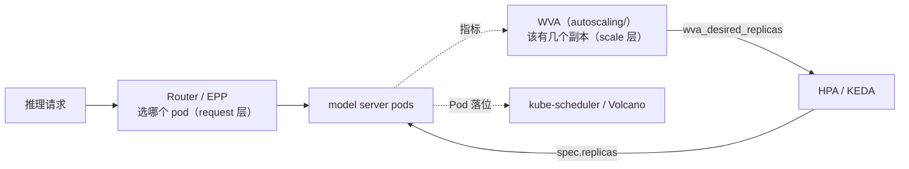
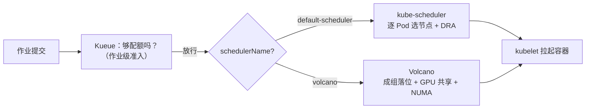

# 调度与编排（Scheduling & Orchestration）

大模型训练 / 推理的**资源调度与作业编排**学习资料。聚焦「一堆 GPU、一堆队列、一堆作业，怎么在 Kubernetes 上被公平且高效地分配」这一核心问题。

## 目录

### 调度器（决定 Pod 落在哪 / 作业何时开始）

| 项目 | 目录 | 源码基线 | 定位 | 说明 |
|------|------|---------|------|------|
| kube-scheduler | [`kube-scheduler/`](kube-scheduler/) | `v1.36.3` | **K8s 原生 Pod 级调度器** | 一切的地基：调度框架、扩展点、队列与缓存、过滤打分、抢占、DRA，以及 v1.36 新增的原生 gang / 拓扑感知（Alpha） |
| Volcano | [`volcano/`](volcano/) | `v1.15.1` | **Pod 级批调度器** | CNCF 项目，替代 kube-scheduler：Gang 调度、队列配额、拓扑感知、GPU 共享 |
| Kueue | [`kueue/`](kueue/) | `v0.19.1` | **作业级准入控制器** | Kubernetes SIG 项目：ClusterQueue/Cohort 配额借用、ResourceFlavor、TAS、MultiKueue |

三者在同一个问题域（**资源怎么分给作业**）内互相可比，下面的分工图与能力矩阵只针对它们。

### 推理请求路由（llm-d，不做 Pod 落位）

| 项目 | 目录 | 源码基线 | 定位 | 说明 |
|------|------|---------|------|------|
| llm-d Router | [`llm-d/`](llm-d/) | `main @ 90a28bc` | **推理请求路由器（request 层）** | 懂 LLM 成本结构的 L7 路由：插件化的过滤/打分/选择框架、KV Cache 前缀亲和路由、多租户流控准入、P/D 分离编排。以 Envoy ext-proc 形式给出每个请求的目标 pod |

它**不做 Pod 落位、不做作业准入**，与上面三个调度器不在同一个问题域，可以完全独立阅读。

> **副本数该是多少**不在本分类里，那是弹性扩缩容的问题域，见 [`autoscaling/`](../autoscaling/)（llm-d WVA）。三者的分工：**WVA 决定「该有几个副本」，Router 决定「这个请求发给哪个副本」，kube-scheduler / Volcano 决定「副本落到哪个节点」。**



> 调度器系列固定到表中 release tag；Router 按 **`main @ 90a28bc`** 分析（`v0.9.0` tag 缺 `pkg/kvcache` 与 `pkg/coordinator`，不可用作基线）。源码片段包含省略和教学注释，请按各系列 README 的基线检出后对照对应函数。

## 建议阅读顺序

```
kube-scheduler 00~01   ← 先建立"调度器到底在做什么"的基础
      ↓
Volcano 00  +  Kueue 00   ← 各读一遍总览，理解它们分别补了什么缺口
      ↓
按需深入 02~03（源码细节）与 04~05（落地）
```

**为什么先读 kube-scheduler**：Volcano 直接复用了它的插件实现（`predicates`/`nodeorder` 插件 import 了 `k8s.io/kubernetes/pkg/scheduler/framework/plugins`），Kueue 则把 Pod 交还给它调度。不了解 `Filter`/`Score`/`Permit`/`PreEnqueue` 这套框架，读另外两个会缺一层地基。

**Router 独立成篇**，与上面的顺序无关。想连着看扩缩容，读完 Router 的 Data Layer（03 篇）再去 [`autoscaling/`](../autoscaling/) 读 WVA 会更顺 —— WVA 的容量模型建立在对 KV token 供需的理解上。

## 三者的分工

一句话概括：

> **Kueue 决定「作业什么时候可以开始」**（改 `suspend` / 摘 scheduling gate）
> **kube-scheduler 与 Volcano 决定「Pod 落到哪个节点」**（写 `pod.spec.nodeName`，二者按 `schedulerName` 分流，互斥）



### 能力矩阵

| 能力 | kube-scheduler v1.36 | Volcano v1.15.1 | Kueue v0.19.1 |
|------|---------------------|-----------------|---------------|
| 层次 | Pod 级调度 | Pod 级调度 | 作业级准入 |
| 调度单元 | 一个 Pod（v1.36 Alpha 可为 PodGroup） | PodGroup | Workload |
| 是否替换 kube-scheduler | — | ✅ 替换 | ❌ 不替换 |
| Gang | ⚠️ Alpha（Permit 型，**等待占资源**） | ✅ 事务型（Discard 立即释放） | ✅ 结构性（Pod 根本不创建） |
| 多租户配额 | ❌ 仅 `ResourceQuota`（硬上限不可借） | ✅ Queue（deserved/capability/guarantee） | ✅ ClusterQueue + Cohort 树 |
| 闲时借用 / 忙时抢回 | ❌ | ✅ | ✅ borrowingLimit / lendingLimit |
| 网络拓扑感知 | ⚠️ Alpha（Placement 机制） | ✅ HyperNode | ✅ TAS |
| GPU 显存/算力共享 | ❌ | ✅ deviceshare vGPU | ❌ |
| NUMA 感知 | ❌（kubelet 侧 TopologyManager） | ✅ numaaware | ❌ |
| DRA | ✅ **GA（v1.35 锁定）** | 配额侧对接 | 配额侧对接 |
| 多集群 | ❌ | ❌ | ✅ MultiKueue |
| 弹性作业 | ❌ | ✅ minAvailable<replicas | ✅ workload slice |
| 节点打分插件生态 | ✅ **标准来源** | ✅ 复用 + 自有 | ❌ 不做 |
| 抢占「白杀」风险 | ⚠️ 存在（单 Pod 视角） | ✅ 无（JobPipelined 才 Commit） | ✅ 无 |
| 生产成熟度 | ✅✅✅ | ✅✅ | ✅✅ |

### 选型建议

| 场景 | 方案 |
|------|------|
| 小规模、单租户、作业不大 | kube-scheduler + 装箱 profile + `ImageLocality` 加权 |
| 多租户配额 + 作业排队 + 异构机型 + 多集群 | **Kueue**（+ 开 TAS 规避碎片） |
| 节点级精细调度：GPU 共享、NUMA、自定义打分 | **Volcano** |
| 大型 MaaS 平台 | **Kueue（准入）+ Volcano（落位）** 叠加 |

叠加时的三个注意事项（详见 [Kueue 04 篇 §4.3](kueue/04-面向大模型训练与推理的能力地图.md)）：抢占只在一边做、拓扑只用一套、gang 叠加正好互补。

## kube-scheduler 学习路线

| 篇 | 主题 | 核心问题 |
|----|------|---------|
| [00](kube-scheduler/00-kube-scheduler总览与架构.md) | 总览与架构 | 定位、三方对比、组件、Pod 的一生、**v1.36 原生 gang / 拓扑感知** |
| [01](kube-scheduler/01-核心原理-调度周期与扩展点.md) | 调度周期与扩展点 | 15 个扩展点何时跑、七种 Status 语义、CycleState、MultiPoint，**完整 trace 一个 vLLM Pod（含逐项分数计算）** |
| [02](kube-scheduler/02-核心代码分析-调度队列与缓存.md) | 调度队列与缓存 | 三队列流转、QueueingHint（GA）、增量快照、assume/forget/expire |
| [03](kube-scheduler/03-核心代码分析-过滤打分与抢占.md) | 过滤打分与抢占 | 节点采样公式、打分归一化、抢占五步与六轮打分 |
| [04](kube-scheduler/04-面向大模型场景的能力与局限.md) | 大模型场景 | 能做好什么（装箱/DRA/打散）、做不到什么、三种落地形态 |
| [05](kube-scheduler/05-实战Demo.md) | 实战 Demo | kind 集群 + 假 GPU：装箱、多 profile、抢占、拓扑打散、**开 gang gate 实测** |
| [06](kube-scheduler/06-扩展实战-自定义调度插件开发.md) | 扩展实战 | **每个扩展点一个可编译 demo**：out-of-tree 注册、CycleState、QueueingHint、Permit-gang、参数解析、部署与验证 |
| [07](kube-scheduler/07-免编译扩展-Extender与外部扩展点.md) | 免编译扩展 | **用官方镜像零编译**：Extender(HTTP 四动作)、配置层多 profile、SchedulingGates 配额控制器、Mutating Webhook、DRA Driver、Descheduler，各含部署 Demo 与排障 |

## Volcano 学习路线

沿用统一示例（64 卡 GPU 集群 + `train`/`serve` 两队列 + 训练作业 T / 推理服务 S / 调试 Pod D）：

| 篇 | 主题 | 核心问题 |
|----|------|---------|
| [00](volcano/00-Volcano总览与架构.md) | 总览与架构 | 为什么 kube-scheduler 不够用，组件与 CRD 模型，作业的一生 |
| [01](volcano/01-核心原理-Session与Action-Plugin框架.md) | Session / Action / Plugin | 每秒的调度循环、37 个扩展点、Gang 的事务机制 |
| [02](volcano/02-核心代码分析-Actions.md) | Actions | enqueue / allocate / preempt / reclaim / backfill / gangpreempt |
| [03](volcano/03-核心代码分析-关键插件.md) | 关键插件 | gang / capacity / proportion / deviceshare / network-topology-aware |
| [04](volcano/04-面向大模型训练与推理的能力地图.md) | 大模型能力地图 | 训练/推理/训推混部配置，坑与取舍 |
| [05](volcano/05-实战Demo.md) | 实战 Demo | 队列 → PyTorch 训练 → vLLM 推理 → vGPU 共享 → 抢占回收 |

## Kueue 学习路线

沿用与 Volcano **刻意一致**的示例（on-demand / spot 两种机型，`team-a`/`team-b` 共享一个 Cohort）：

| 篇 | 主题 | 核心问题 |
|----|------|---------|
| [00](kueue/00-Kueue总览与架构.md) | 总览与架构 | Kueue 是什么、与 Volcano 的边界、CRD 模型、作业的一生 |
| [01](kueue/01-核心原理-Workload生命周期与配额模型.md) | Workload 与配额模型 | 借用/借出账本、抢占策略矩阵、FlavorFungibility、公平共享 |
| [02](kueue/02-核心代码分析-调度器与准入.md) | 调度器与准入 | `schedule()` 六步、flavorassigner、preemption |
| [03](kueue/03-核心代码分析-缓存快照与控制器.md) | 缓存与控制器 | 资源账本树、等待队列、jobframework、TAS / MultiKueue / Elastic Jobs |
| [04](kueue/04-面向大模型训练与推理的能力地图.md) | 大模型能力地图 | 训练/推理/混部，与 Volcano 的三种组合形态 |
| [05](kueue/05-实战Demo.md) | 实战 Demo | 配额 → JobSet+TAS 训练 → LWS 推理 → 借用回收 → 部分准入 |

## llm-d Router 学习路线

统一示例：P/D 分离部署（prefill `P1/P2` + decode `D1/D2/D3`），请求 A 与 B 共享一段 2000 token 的系统提示前缀 —— 追问「A 走完之后 B 该去哪」。

| 篇 | 主题 | 核心问题 |
|----|------|---------|
| [00](llm-d/00-总览与架构.md) | 总览与架构 | Router 在 llm-d 里的位置、**术语变迁与项目边界**（仓库刚改名、KV Indexer 与 sidecar 刚合并进来）、代码地图、四条设计哲学、部署模式对照 |
| [01](llm-d/01-请求的一生-主控制流.md) | **请求的一生** | 从 Envoy ext-proc 到选出 pod 的 14 步；**429 与 503 的分界线**（池子忙 vs 池子空）；profile 的迭代执行；三层状态传递；反直觉行为清单 |
| [02](llm-d/02-核心代码分析-调度框架与插件体系.md) | **调度框架与插件体系** | 8 类扩展点、YAML 到运行时实例的两阶段实例化与依赖 DAG、打分机制（`[0,1]`、加权求和**不归一化**）、**全部内置插件清单**、默认注入与自动补全、feature gates、写自定义插件 |
| [03](llm-d/03-核心代码分析-DataLayer与指标采集.md) | Data Layer 与指标采集 | 每 endpoint 一个 goroutine、每 50ms 抓一次 `/metrics`；按 `engine-type` label 适配 vLLM/SGLang 的指标名差异；`atomic.Pointer` 快照；**指标过期对不同消费者的不同后果** |
| [04](llm-d/04-核心代码分析-KVCache索引与前缀缓存路由.md) | **KV 索引与前缀缓存路由** | 近似 vs 精确两条路线；ZMQ 事件摄取与按 pod 分片保序；`kvblock.Index` 结构；EPP 的 block key 为何不必与 vLLM 内部 hash 一致；**64 token 硬下限与静默退化的坑**；replay 恢复 |
| [05](llm-d/05-核心代码分析-FlowControl流控与准入.md) | Flow Control 流控与准入 | **默认关闭**；单 Processor goroutine 的 actor 模型；`EnqueueAndWait`；内部错误到 429/503 的精确映射；`FlowKey` 与 priority band；**`utilization-detector` 的 fail-closed 行为**；驱逐机制 |
| [06](llm-d/06-核心代码分析-PD分离与Sidecar.md) | **P/D 分离与 Sidecar** | sidecar 跑在 decode pod 里（不是 prefill）；四路分支；NIXLv2 默认协议下 prefill 请求如何改写与 `kv_transfer_params` 如何协调；**6 种 KV connector 对照**；E/P/D 多模态扇出；sidecar vs Coordinator |
| [07](llm-d/07-部署配方与排障.md) | **部署配方与排障** | 三个官方配方逐行讲；调优决策表；**完整 sizing 数据**（EPP 空闲 CPU 随 pod 数增长）；HA 三模式与 Active-Active 的状态分区；**20 条静默失效模式总表**；排障决策树；上线检查清单 |

---

> 各系列内部：00~01 建立框架直觉；中间几篇是源码细节，可按需查阅；最后一篇面向落地。
