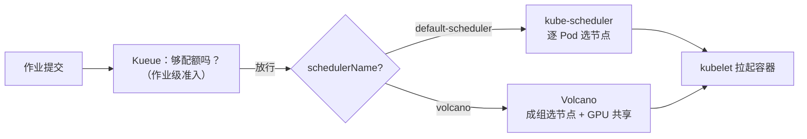
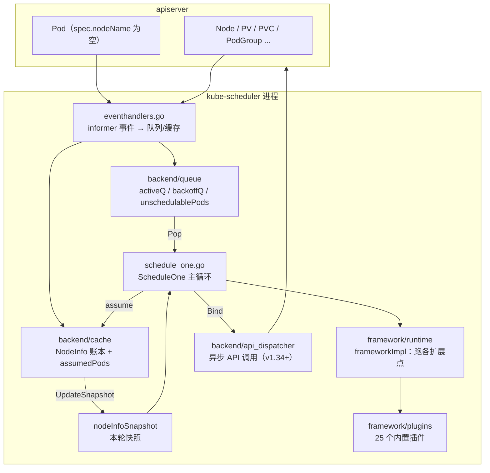
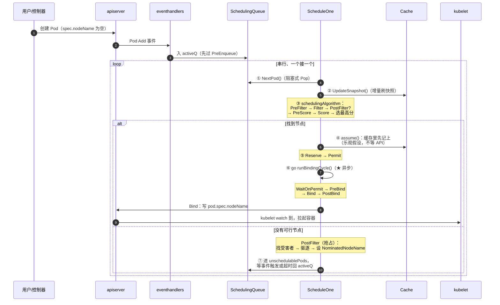
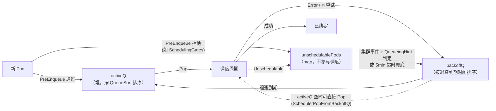

# kube-scheduler 总览与架构

> 本篇回答：**K8s 原生调度器做什么、由哪些部分组成、一个 Pod 从创建到落到节点上经过了什么**，以及一个很多人还不知道的重大变化 —— **v1.36 已经把 gang 调度和拓扑感知调度做进了主干**。
>
> **源码基线：`kubernetes/kubernetes` v1.36.3**（最新稳定 release）
>
> ```bash
> cd $GOPATH/src/k8s.io/kubernetes
> git checkout v1.36.3
> git describe --tags        # v1.36.3
> ```
>
> 与本仓库 Volcano / Kueue 系列沿用同一示例，便于三方横向对比。版本差异见 [附录：版本说明](#附录版本说明)。

---

## 1. 定位：一句话与一个反直觉

> kube-scheduler 是一个**为单个 Pod 选择节点**的控制器：从调度队列取出一个 Pod，过滤出可行节点，打分选最优，然后把 `pod.spec.nodeName` 写回 apiserver。

它的经典设计假设是「**Pod 之间彼此独立**」。这个假设让它极其可扩展（能撑 5000 节点 / 15 万 Pod），也是 Volcano、Kueue 这类项目存在的理由。

**但从 v1.36 开始，这个假设不再是全部事实**：

```go
// pkg/scheduler/schedule_one.go
func (sched *Scheduler) ScheduleOne(ctx context.Context) {
    podInfo, err := sched.NextPod(logger)
    ...
    if sched.genericWorkloadEnabled && podInfo.Pod.Spec.SchedulingGroup != nil {
        podGroupInfo, err := sched.podGroupInfoForPod(ctx, podInfo)
        ...
        sched.scheduleOnePodGroup(ctx, podGroupInfo)     // ★ 成组调度分支
    } else {
        sched.scheduleOnePod(ctx, podInfo)               // 经典的逐 Pod 分支
    }
}
```

主干里已经有了 `pkg/scheduler/schedule_one_podgroup.go`（600+ 行）、`gangscheduling` 插件、`topologyaware` 插件、`PodGroup` API（`scheduling.k8s.io/v1alpha2`）、以及 workload 级抢占。

**不过全部是 Alpha 且默认关闭**，所以「默认行为」仍然是逐 Pod 调度。这个区分非常重要，本篇 §6 专门讲。

### 1.1 统一示例（三系列共用）

8 台机器、每台 8 卡 A100（共 64 卡），跑三类负载：

- **作业 T**（训练）：8 个 Pod、每个 8 卡，**必须同时起来**（NCCL 通信域）。
- **作业 S**（推理）：vLLM，TP=4，2 个副本，希望每副本 4 卡同机。
- **作业 D**（调试）：1 个 4 卡 Pod，随时提交。

用**默认配置的 kube-scheduler** 跑这三个负载，会发生什么：

| 负载 | 结果 | 根因 |
|------|------|------|
| 作业 T | 起了 5 个 Pod 占 40 卡空转，3 个 Pending 等资源 → **资源死锁** | 逐 Pod 调度，没有「整体」概念 |
| 作业 S | 4 个 rank 被打散到 4 台机器，跨机 TCP 通信，吞吐掉几倍 | `PodAffinity` 只能表达亲和倾向，不能表达「这 4 个必须同机且整组同机」 |
| 作业 D | 正常 | 单 Pod 场景本来就是它的主场 |

这就是为什么 GPU 集群几乎都要在 kube-scheduler 之外再加一层。

---

## 2. 与 Volcano / Kueue 的三方定位

| 维度 | **kube-scheduler** | **Kueue** | **Volcano** |
|------|-------------------|-----------|-------------|
| 层次 | Pod 级**调度**（选节点 + Bind） | 作业级**准入** | Pod 级**调度**（替代 kube-scheduler） |
| 调度单元 | 一个 Pod（v1.36 Alpha 起可为 PodGroup） | Workload（PodGroup 的申请单） | PodGroup |
| 执行手段 | 写 `pod.spec.nodeName` | 改 `job.spec.suspend` / 摘 scheduling gate | 写 `pod.spec.nodeName` |
| 多租户配额 | ❌（只有 namespace `ResourceQuota`，硬上限不可借） | ✅ ClusterQueue + Cohort 借用 | ✅ Queue + deserved/capability |
| Gang | v1.36 Alpha（`GangScheduling` gate） | ✅ 结构性保证 | ✅ Statement 事务 |
| 拓扑感知 | v1.36 Alpha（`TopologyAwareWorkloadScheduling`） | ✅ TAS | ✅ HyperNode |
| 节点级打分/过滤 | ✅ **它就是标准** | ❌ 不做 | ✅（复用 kube-scheduler 的插件代码） |
| GPU 共享 | ❌（整卡整数分配；DRA 提供了更细的设备模型但不做显存切分） | ❌ | ✅ deviceshare vGPU |
| 抢占 | ✅ 优先级抢占（单 Pod 视角） | ✅ 配额回收 | ✅ 队列内 + 跨队列 |
| 是否可共存 | — | Kueue 放行后由它调度 | 与它并存（按 `schedulerName` 分流） |

**三者的关系可以这样理解**：



> kube-scheduler 是**地基**：Volcano 复用了它的插件代码（`predicates`/`nodeorder` 插件 import 了 `k8s.io/kubernetes/pkg/scheduler/framework/plugins`），Kueue 则把 Pod 交还给它调度。**读懂 kube-scheduler 是读懂另外两个的前提。**

---

## 3. 组件与源码结构

kube-scheduler 是**单一进程**（`kube-scheduler` 二进制），多副本时靠 leader election 选主。



### 3.1 源码导航（v1.36 路径，注意与老版本不同）

```
cmd/kube-scheduler/                    # 入口：Setup() / Run()
pkg/scheduler/
├── scheduler.go                       # Scheduler 结构体、New()、Run()
├── schedule_one.go                    # ★ ScheduleOne：调度周期 + 绑定周期
├── schedule_one_podgroup.go           # ★ v1.36 新增：PodGroup 成组调度
├── eventhandlers.go                   # informer 事件处理
├── extender.go                        # HTTP Extender（老机制，仍保留）
├── backend/                           # ★ v1.31+ 从 pkg/scheduler 拆出来
│   ├── queue/                         #   调度队列（三个队列）
│   ├── cache/                         #   集群状态缓存 + Snapshot
│   ├── heap/                          #   带索引的堆
│   ├── api_cache/                     #   v1.34+ 异步 API 的本地视图
│   └── api_dispatcher/                #   v1.34+ 异步 API 调用
├── framework/
│   ├── runtime/framework.go           # ★ frameworkImpl：扩展点编排
│   ├── preemption/preemption.go       # ★ 抢占通用逻辑（Evaluator）
│   ├── plugins/                       # ★ 内置插件
│   │   ├── noderesources/ nodeaffinity/ interpodaffinity/
│   │   ├── podtopologyspread/ tainttoleration/ volumebinding/
│   │   ├── defaultpreemption/ defaultbinder/ schedulinggates/
│   │   ├── dynamicresources/          #   DRA
│   │   ├── gangscheduling/            #   ★ v1.36 新增
│   │   ├── topologyaware/             #   ★ v1.36 新增（Placement）
│   │   ├── podgrouppodscount/         #   ★ v1.36 新增（Placement 打分）
│   │   └── nodedeclaredfeatures/      #   ★ 新增
│   └── types.go / cycle_state.go ...
├── apis/config/                       # KubeSchedulerConfiguration
├── metrics/                           # Prometheus 指标
└── profile/                           # 多 profile（多 schedulerName）

staging/src/k8s.io/kube-scheduler/
└── framework/interface.go             # ★ 所有扩展点接口定义（对外 API）
```

> **两个路径陷阱**：① 队列和缓存在 `pkg/scheduler/backend/` 下（老版本在 `pkg/scheduler/internal/`）；② 扩展点接口定义在 **staging** 的 `k8s.io/kube-scheduler/framework/interface.go`，不在 `pkg/scheduler/framework/interface.go`。写自定义插件时 import 的是前者。

---

## 4. 一个 Pod 的一生



**这张图里有四个必须理解的设计**：

### 4.1 调度周期串行，绑定周期并行

```go
// schedule_one.go
scheduleResult, assumedPodInfo, status := sched.schedulingCycle(...)   // 同步、串行
if !status.IsSuccess() { ... ; return }
// bind the pod to its host asynchronously (we can do this b/c of the assumption step above).
go sched.runBindingCycle(ctx, state, fwk, scheduleResult, assumedPodInfo, start, podsToActivate)
```

**调度周期（选节点）必须串行** —— 否则两个 Pod 会同时看到同一份空闲资源。**绑定周期（写 API、等 PV 绑定）可以并行** —— 因为 `assume` 已经把资源在缓存里扣掉了。

这是 kube-scheduler 吞吐的关键：慢操作（PVC 绑定、DRA 分配、apiserver 往返）都在异步的绑定周期里。

### 4.2 assume：乐观并发

```go
// assumeAndReserve
assumedPodInfo := podInfo.DeepCopy()
// assume modifies `assumedPod` by setting NodeName=scheduleResult.SuggestedHost
err := sched.assume(logger, state, assumedPodInfo, scheduleResult.SuggestedHost)
```

在 apiserver 确认之前，缓存里就认为「这个 Pod 已经在这个节点上了」。绑定失败则 `ForgetPod` 回滚。这让调度器不必等 API 往返就能处理下一个 Pod。

> 三个系列里都有 assume 的身影：Volcano 是 `Statement` + `Commit`，Kueue 是 `cache.AddOrUpdateWorkload` + 异步 patch，kube-scheduler 是 `assume` + `ForgetPod`。**「先在内存记账，再异步落 API，失败回滚」是调度器的共同范式。**

### 4.3 抢占不是当轮生效

`PostFilter`（`DefaultPreemption`）做的事是：找到受害者 → 发起驱逐 → 给抢占者设 `pod.status.nominatedNodeName` → **本轮结束，Pod 回队列**。下一轮它才可能真正调度成功。

### 4.4 队列有三个，不是一个

Pod 调度失败后不会立刻重试，而是进入退避体系（§5）。

---

## 5. 三个队列



源码注释写得很清楚（`backend/queue/scheduling_queue.go`）：

```go
// PriorityQueue implements a scheduling queue.
// The head of PriorityQueue is the highest priority pending pod. This structure
// has two sub queues and a additional data structure, namely: activeQ,
// backoffQ and unschedulablePods.
//   - activeQ holds pods that are being considered for scheduling.
//   - backoffQ holds pods that moved from unschedulablePods and will move to
//     activeQ when their backoff periods complete.
//   - unschedulablePods holds pods that were already attempted for scheduling and
//     are currently determined to be unschedulable.
type PriorityQueue struct {
    *nominator
    ...
}
```

### 5.1 QueueingHint —— v1.34 已 GA 的重要优化

老版本的问题：一个 Pod 因为「CPU 不够」进了 `unschedulablePods`，那么**任何** Pod 删除事件都会把它拉回 activeQ 重试 —— 大量无效调度。

QueueingHint 让插件对「这个事件对我这个失败原因有意义吗」表态。以 gang 插件为例：

```go
// plugins/gangscheduling/gangscheduling.go
func (pl *GangScheduling) isSchedulableAfterPodAdded(logger klog.Logger, pod *v1.Pod, oldObj, newObj interface{}) (fwk.QueueingHint, error) {
    _, addedPod, err := util.As[*v1.Pod](oldObj, newObj)
    if err != nil { return fwk.Queue, err }

    if !helper.MatchingSchedulingGroup(pod, addedPod) {
        return fwk.QueueSkip, nil       // ★ 新增的 Pod 不是我的同伴 → 别叫我
    }
    return fwk.Queue, nil               // 是同伴 → 可能凑够 gang 了，重试
}
```

`SchedulerQueueingHints` 在 **v1.34 已 GA 并 LockToDefault**，也就是说这个机制现在是不可关闭的标准行为。

### 5.2 nominator：抢占的跨轮记忆

`PriorityQueue` 内嵌了 `*nominator`，记录「哪个 Pod 被提名到哪个节点」（对应 `pod.status.nominatedNodeName`）。作用有两个：

1. 抢占者下一轮优先尝试被提名的节点；
2. 其他 Pod 在 Filter 时会把「被提名到这个节点的高优 Pod」算作已占资源（`podsWithAffinity` 之外的另一类虚拟占用），避免资源被低优 Pod 抢走。

---

## 6. v1.36 的重大变化：workload-aware scheduling

**这是本系列最值得关注的部分**，也是很多资料还没覆盖的。

### 6.1 涉及的 feature gates（全部 Alpha，默认关闭）

```go
// pkg/features/kube_features.go
GangScheduling: {
    {Version: version.MustParse("1.35"), Default: false, PreRelease: featuregate.Alpha},
},
GenericWorkload: {
    {Version: version.MustParse("1.35"), Default: false, PreRelease: featuregate.Alpha},
},
TopologyAwareWorkloadScheduling: {
    {Version: version.MustParse("1.36"), Default: false, PreRelease: featuregate.Alpha},
},
WorkloadAwarePreemption: {
    {Version: version.MustParse("1.36"), Default: false, PreRelease: featuregate.Alpha},
},
WorkloadWithJob: {
    {Version: version.MustParse("1.36"), Default: false, PreRelease: featuregate.Alpha},
},
```

依赖关系（`pkg/features/kube_features.go` 的依赖表）：

```text
GenericWorkload（基础：Workload / PodGroup API）
├── GangScheduling
│   └── WorkloadAwarePreemption
├── TopologyAwareWorkloadScheduling
└── WorkloadWithJob（Job controller 自动建 Workload + PodGroup）
```

### 6.2 新增的 API 与插件

| 新增物 | 位置 | 作用 |
|--------|------|------|
| `PodGroup`（`scheduling.k8s.io/v1alpha2`） | `pkg/apis/scheduling` | `spec.schedulingPolicy.gang.minCount`、`spec.schedulingConstraints.topology` |
| `pod.spec.schedulingGroup.podGroupName` | core/v1 | Pod 声明自己属于哪个 PodGroup（**不可变**） |
| `GangScheduling` 插件 | `plugins/gangscheduling/` | `PreEnqueue` + `Permit` 实现 all-or-nothing |
| `TopologyPlacementGenerator` 插件 | `plugins/topologyaware/` | 生成候选 **Placement**（一组节点） |
| `PodGroupPodsCount` 插件 | `plugins/podgrouppodscount/` | 给 Placement 打分（权重 1） |
| `PlacementGenerate` / `PlacementScore` 扩展点 | `staging/.../framework/interface.go` | 全新的两个扩展点 |
| `scheduleOnePodGroup` | `schedule_one_podgroup.go` | PodGroup 调度周期 |

### 6.3 gang 是怎么实现的

`GangScheduling` 插件只用了两个扩展点：

**① `PreEnqueue`：人没到齐就不进队列**

```go
func (pl *GangScheduling) PreEnqueue(ctx context.Context, pod *v1.Pod) *fwk.Status {
    if pod.Spec.SchedulingGroup == nil { return nil }
    podGroup, err := pl.podGroupLister.PodGroups(namespace).Get(*schedulingGroup.PodGroupName)
    if err != nil {
        if apierrors.IsNotFound(err) {
            return fwk.NewStatus(fwk.UnschedulableAndUnresolvable,
                fmt.Sprintf("waiting for pods's pod group %q to appear in scheduling queue", ...))
        }
        ...
    }
    policy := podGroup.Spec.SchedulingPolicy
    if policy.Gang == nil { return nil }        // 不是 gang 策略，放过

    podGroupState, err := pl.podGroupManager.PodGroupStates().Get(namespace, *schedulingGroup.PodGroupName)
    allPodsCount := podGroupState.AllPodsCount()
    if allPodsCount < int(policy.Gang.MinCount) {
        return fwk.NewStatus(fwk.UnschedulableAndUnresolvable,
            "waiting for minCount pods from a gang to appear in scheduling queue")
    }
    return nil                                  // 达到 quorum，允许入队
}
```

**② `Permit`：凑够 minCount 才一起放行**

```go
func (pl *GangScheduling) Permit(ctx context.Context, state fwk.CycleState, pod *v1.Pod, nodeName string) (*fwk.Status, time.Duration) {
    ...
    scheduledPodsCount := podGroupState.ScheduledPodsCount()
    if scheduledPodsCount < int(policy.Gang.MinCount) {
        // 顺手把同组还没调度的 Pod 激活，加速凑齐
        unscheduledPods := podGroupState.UnscheduledPods()
        pl.handle.Activate(klog.FromContext(ctx), unscheduledPods)
        return fwk.NewStatus(fwk.Wait, "waiting for minCount pods from a gang to be scheduled"),
            permitTimeoutDuration                          // ★ 5 分钟超时
    }

    // quorum 达成：放行所有在 Permit 上等待的同组 Pod
    assumedPods := podGroupState.AssumedPods()
    for podUID := range assumedPods {
        waitingPod := pl.handle.GetWaitingPod(podUID)
        if waitingPod != nil {
            waitingPod.Allow(Name)
        }
    }
    return nil, 0
}
```

`permitTimeoutDuration = 5 * time.Minute`。这就是经典的 coscheduling 实现套路（与社区 `scheduler-plugins` 的 coscheduling 同源），现在进了主干。

**与 Volcano 的 gang 对比**：

| | kube-scheduler v1.36 | Volcano |
|--|---------------------|---------|
| 机制 | `Permit` 让先到的 Pod **挂起等待**，凑够 minCount 一起 `Allow` | `Statement` 累积后 `JobReady` 才 `Commit`，否则整体 `Discard` |
| 等待期间 | Pod 已 assume（**占着缓存里的资源**），在 Permit 阶段挂起 | Pod 未 Bind，资源在快照里被回滚释放 |
| 超时 | 5 分钟硬编码 | 无（每轮重算） |
| 死锁风险 | Permit 挂起期间占资源，多个 gang 互等可能死锁（靠超时解） | Discard 立即释放，无死锁 |

> 这解释了为什么 Volcano 的事务式设计更适合大规模：**Permit 等待期间是占着资源的**，而 Volcano 的 Discard 是真正释放。

### 6.4 拓扑感知：Placement 机制

`TopologyAwareWorkloadScheduling` 引入了一套全新流程（`schedule_one_podgroup.go`）：

```go
func (sched *Scheduler) podGroupSchedulingPlacementAlgorithm(...) podGroupAlgorithmResult {
    // ① 插件生成候选 Placement（每个 Placement 是一组节点，如一个 rack）
    placements, status := schedFwk.RunPlacementGeneratePlugins(ctx, podGroupCycleState, podGroupInfo.PodGroupInfo, allNodes)

    for _, placement := range placements {
        // ② 把这个 Placement "假设"进快照
        err := sched.nodeInfoSnapshot.AssumePlacement(placement)
        // ③ 在这个 Placement 内跑完整的成组调度
        result := sched.podGroupSchedulingDefaultAlgorithm(ctx, schedFwk, podGroupCycleState, podGroupInfo, postFilterMode)
        sched.nodeInfoSnapshot.ForgetPlacement()          // ★ 回滚
        if result.status.IsSuccess() || result.waitingOnPreemption {
            successfulResults[placement] = &result
        }
    }
    // ④ 用 PlacementScore 插件挑最优 Placement
    bestPlacement, status := sched.findBestPlacement(ctx, schedFwk, podGroupCycleState, podGroupInfo, successfulResults)
    return *successfulResults[bestPlacement]
}
```

**这个「逐候选域 dry-run + 回滚 + 选最优」的模式，和 Volcano 的 HyperNode 梯度搜索（`allocateForJob` 里 `stmtBackup` / `RecoverOperations`）在思想上完全一致。** 社区显然吸收了 Volcano/Kueue 的经验。

### 6.5 workload 级抢占

```go
func (sched *Scheduler) runWorkloadAwarePreemption(...) *fwk.Status {
    plugins := schedFwk.PodGroupPostFilterPlugins()
    ...
    if pg.Spec.SchedulingConstraints != nil && len(pg.Spec.SchedulingConstraints.Topology) > 0 {
        return fwk.NewStatus(fwk.Unschedulable, "workload aware preemption is not supported for pod groups with scheduling constraints")
    }
    restoreFn, err := sched.nodeInfoSnapshot.BackupSnapshot()
    defer restoreFn()                                     // ★ 快照备份 + 恢复

    return plugins[0].PodGroupPostFilter(ctx, pg, podGroupInfo.UnscheduledPods, func(ctx context.Context) *fwk.Status {
        res := sched.podGroupSchedulingAlgorithm(ctx, schedFwk, podGroupCycleState, podGroupInfo, runWithoutPostFilters)
        return res.status
    })
}
```

注意那个限制：**带拓扑约束的 PodGroup 暂不支持 workload 抢占** —— 与 Volcano「带 `networkTopology` 的作业不走 preempt」的限制惊人地一致。同一个难题。

### 6.6 该不该现在用？

| | 说明 |
|--|------|
| ✅ 值得关注 | 方向明确：社区在把 gang / 拓扑 / workload 抢占标准化 |
| ⚠️ 暂不适合生产 | Alpha 默认关闭、API `v1alpha2`、5 分钟硬编码超时、无多租户配额 |
| 🔧 现在的选择 | 配额 → Kueue；节点级成组与 GPU 共享 → Volcano |

---

## 7. 默认插件与权重

`pkg/scheduler/apis/config/v1/default_plugins.go`（v1.36 用 `MultiPoint` 统一声明）：

```go
MultiPoint: v1.PluginSet{
    Enabled: []v1.Plugin{
        {Name: names.SchedulingGates},
        {Name: names.PrioritySort},
        {Name: names.NodeUnschedulable},
        {Name: names.NodeName},
        {Name: names.TaintToleration, Weight: ptr.To[int32](3)},      // ★ 权重最高
        {Name: names.NodeAffinity, Weight: ptr.To[int32](2)},
        {Name: names.NodePorts},
        {Name: names.NodeResourcesFit, Weight: ptr.To[int32](1)},
        {Name: names.VolumeRestrictions},
        {Name: names.NodeVolumeLimits},
        {Name: names.VolumeBinding},
        {Name: names.VolumeZone},
        {Name: names.PodTopologySpread, Weight: ptr.To[int32](2)},
        {Name: names.InterPodAffinity, Weight: ptr.To[int32](2)},
        {Name: names.DefaultPreemption},
        {Name: names.NodeResourcesBalancedAllocation, Weight: ptr.To[int32](1)},
        {Name: names.ImageLocality, Weight: ptr.To[int32](1)},
        {Name: names.DefaultBinder},
    },
},
```

按 feature gate 追加：

```go
func applyFeatureGates(config *v1.Plugins) {
    if utilfeature.DefaultFeatureGate.Enabled(features.NodeDeclaredFeatures) { ... }
    if utilfeature.DefaultFeatureGate.Enabled(features.DynamicResourceAllocation) {
        applyDynamicResources(config)     // DynamicResources 插到 DefaultPreemption 之前，weight 2
    }
    if utilfeature.DefaultFeatureGate.Enabled(features.GangScheduling) {
        applyGangScheduling(config)       // 追加 GangScheduling
    }
    if utilfeature.DefaultFeatureGate.Enabled(features.TopologyAwareWorkloadScheduling) {
        applyTopologyAwareWorkloadScheduling(config)   // 追加 TopologyPlacementGenerator + PodGroupPodsCount(w=1)
    }
}
```

`DynamicResources` 插在 `DefaultPreemption` **之前**，注释解释了原因：

> *"This plugin should come before DefaultPreemption because if there is a problem with a Pod and PostFilter gets called to resolve the problem, it is better to first deallocate an idle ResourceClaim than it is to evict some Pod that might be doing useful work."*

**GPU 场景要记住的两个权重问题**：

- 默认 `NodeResourcesFit` 权重只有 1，且默认策略是 `LeastAllocated`（打散）。GPU 集群通常想要**装箱**（`MostAllocated`），需要显式配置。
- 没有任何插件理解「GPU 卡间 NVLink 拓扑」—— 这是 DRA 和 v1.36 拓扑感知要解决的事。

---

## 8. 系列导航

| 篇 | 主题 | 核心问题 |
|----|------|---------|
| 00（本篇） | 总览与架构 | 定位、三方对比、组件、Pod 的一生、v1.36 的 workload-aware 新特性 |
| [01](01-核心原理-调度周期与扩展点.md) | 调度周期与扩展点 | 15 个扩展点各在什么时候跑、Status 语义、CycleState，**并用统一示例完整 trace 一遍（含逐项分数计算）** |
| [02](02-核心代码分析-调度队列与缓存.md) | 调度队列与缓存 | 三队列流转、QueueingHint、Cache 增量快照、assume/forget |
| [03](03-核心代码分析-过滤打分与抢占.md) | 过滤打分与抢占 | findNodesThatFitPod 的采样与并行、打分归一化、抢占五步 |
| [04](04-面向大模型场景的能力与局限.md) | 大模型场景 | 默认调度器能做什么、做不到什么、DRA、怎么和 Volcano/Kueue 配合 |
| [05](05-实战Demo.md) | 实战 Demo | 改配置、装箱策略、拓扑打散、抢占、开 gang gate 实测、排障 |

---

## 附录：版本说明

### A.1 为什么钉 v1.36.3

本系列所有源码引用均以 **`v1.36.3`** 为准（编写时最新稳定 release）。

```bash
cd $GOPATH/src/k8s.io/kubernetes
git checkout v1.36.3
```

kube-scheduler 的目录结构近几个版本变动很大，用错版本会完全找不到文件：

| 内容 | 老路径（≤ v1.30） | v1.36 路径 |
|------|-----------------|-----------|
| 调度队列 | `pkg/scheduler/internal/queue/` | `pkg/scheduler/backend/queue/` |
| 缓存 | `pkg/scheduler/internal/cache/` | `pkg/scheduler/backend/cache/` |
| 扩展点接口 | `pkg/scheduler/framework/interface.go` | `staging/src/k8s.io/kube-scheduler/framework/interface.go` |
| 异步 API 调用 | — | `pkg/scheduler/backend/api_dispatcher/`（v1.34+） |

### A.2 v1.36 相比常见资料的关键差异

大量中文资料基于 v1.18~v1.25，以下内容已经不同：

| 项 | 老资料说法 | v1.36 事实 |
|----|-----------|-----------|
| 「kube-scheduler 没有 gang」 | 正确（当时） | **已有**（`GangScheduling` Alpha，`schedule_one_podgroup.go`） |
| 「不理解网络拓扑」 | 正确（当时） | **已有**（`TopologyAwareWorkloadScheduling` Alpha，Placement 机制） |
| 「`percentageOfNodesToScore` 默认 50%」 | 老版本 | 默认 0 = **自适应**（`numFeasibleNodesToFind` 按集群规模算，下限 100 节点） |
| 「DRA 还是 Alpha 实验特性」 | ≤ v1.31 | **v1.34 GA、v1.35 GA + LockToDefault**（不可关闭） |
| 「失败 Pod 靠周期性重试」 | 老版本 | **QueueingHint**（v1.34 GA + LockToDefault），事件驱动精准重试 |
| 「抢占是同步的」 | 老版本 | `SchedulerAsyncPreemption` v1.33 Beta **默认开** |
| 「Bind 是同步 API 调用」 | 老版本 | `SchedulerAsyncAPICalls` v1.34 Beta（默认关），可异步化 |
| 「插件按 Filter/Score 分别配置」 | 老版本 | 默认配置统一用 **`MultiPoint`** |

### A.3 调度相关 feature gate 状态（v1.36.3）

| Gate | 状态 | 说明 |
|------|------|------|
| `SchedulerQueueingHints` | **GA + LockToDefault**（1.34） | 不可关闭 |
| `SchedulerAsyncPreemption` | Beta 默认 **开**（1.33） | 抢占异步化 |
| `SchedulerPopFromBackoffQ` | Beta 默认 **开**（1.33） | activeQ 空时直接从 backoffQ 取 |
| `SchedulerAsyncAPICalls` | Beta 默认 **关**（1.34） | 异步 API 调用 |
| `DynamicResourceAllocation` | **GA + LockToDefault**（1.35） | DRA，不可关闭（见 04 篇） |
| `NodeDeclaredFeatures` | Beta 默认 **开**（1.36） | 节点能力声明 |
| `OpportunisticBatching` | Beta 默认 **开**（1.35） | 相同签名 Pod 复用调度结果 |
| `GenericWorkload` | Alpha 默认关（1.35） | Workload / PodGroup API 基础 |
| `GangScheduling` | Alpha 默认关（1.35） | 依赖 `GenericWorkload` |
| `TopologyAwareWorkloadScheduling` | Alpha 默认关（1.36） | 依赖 `GenericWorkload` |
| `WorkloadAwarePreemption` | Alpha 默认关（1.36） | 依赖 `GangScheduling` |
| `WorkloadWithJob` | Alpha 默认关（1.36） | Job controller 自动建 Workload+PodGroup |

### A.4 升级复查

```bash
cd $GOPATH/src/k8s.io/kubernetes
git diff --stat v1.36.3..<新tag> -- \
  pkg/scheduler/ staging/src/k8s.io/kube-scheduler/ \
  pkg/features/kube_features.go
```
