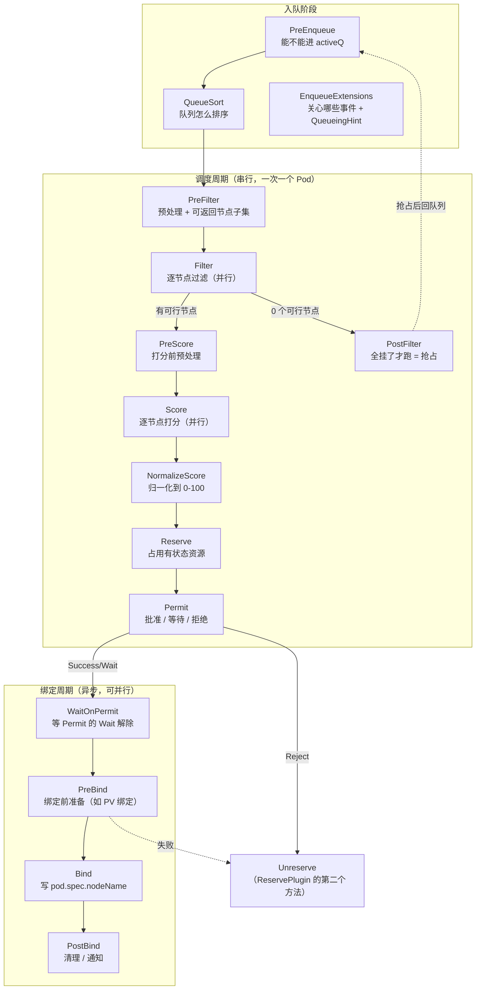
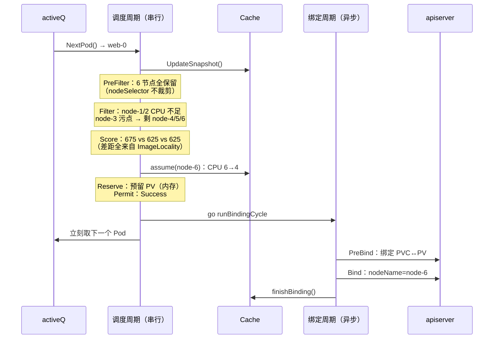

# 核心原理：调度周期与扩展点

> 本篇讲清 kube-scheduler 的**调度框架（Scheduling Framework）**：13+2 个扩展点分别在什么时候跑、`Status` 七种返回码各代表什么、`CycleState` 怎么跨扩展点传状态。这是写自定义调度插件的基础，也是读懂 Volcano 插件体系的前提。
>
> **§6 是一个完整 trace** —— 用一个普通 Pod 走完全部扩展点，手工算出每个插件的分数。如果你只想快速建立直觉，可以先跳到 §6 再回头看前面的定义。
>
> 涉及源码：`staging/src/k8s.io/kube-scheduler/framework/interface.go`、`pkg/scheduler/framework/runtime/framework.go`、`pkg/scheduler/schedule_one.go`
>
> 源码基线：**v1.36.3**

---

## 1. 两个周期与全部扩展点



`staging/src/k8s.io/kube-scheduler/framework/interface.go` 中的接口清单（v1.36 共 15 个）：

```go
type Plugin interface { Name() string }

type PreEnqueuePlugin interface        // 入队门禁
type QueueSortPlugin interface         // 队列排序（★ 全局只能有一个）
type EnqueueExtensions interface       // 声明关心的事件 + QueueingHint
type PreFilterPlugin interface         // 预过滤
type PreFilterExtensions interface     // AddPod / RemovePod（抢占模拟用）
type FilterPlugin interface            // 过滤
type PostFilterPlugin interface        // 过滤全失败后的补救（抢占）
type PreScorePlugin interface          // 预打分
type ScorePlugin interface             // 打分
type ScoreExtensions interface         // NormalizeScore
type ReservePlugin interface           // Reserve / Unreserve
type PermitPlugin interface            // 批准
type PreBindPlugin interface           // 绑定前
type BindPlugin interface              // 绑定
type PostBindPlugin interface          // 绑定后

// ★ v1.36 新增（workload-aware scheduling，Alpha）
type PlacementGeneratePlugin interface // 生成候选 Placement（一组节点）
type PlacementScorePlugin interface    // 给 Placement 打分
type PlacementScoreExtensions interface
type SignPlugin interface              // OpportunisticBatching 相关
```

### 1.1 逐个扩展点的用途与代表插件

| 扩展点 | 何时跑 | 能做什么 | 代表插件 |
|--------|--------|---------|---------|
| `PreEnqueue` | Pod 进 activeQ 前 | **挡住不该被调度的 Pod** | `SchedulingGates`（默认启用） |
| `QueueSort` | 队列比较两个 Pod | 决定谁先被调度 | `PrioritySort`（唯一，按优先级+创建时间） |
| `EnqueueExtensions` | 注册期 | 声明「哪些事件可能让我失败的 Pod 变可调度」 | 几乎所有插件 |
| `PreFilter` | 每轮开始 | 预计算写入 CycleState；**可返回节点子集** | `NodeAffinity`、`InterPodAffinity`、`PodTopologySpread`、`NodeResourcesFit` |
| `Filter` | 每个节点 | 硬约束判定（并行执行） | `NodeResourcesFit`、`NodeUnschedulable`、`TaintToleration`、`NodeName`、`NodePorts`、`VolumeBinding` |
| `PostFilter` | **仅当 0 个可行节点** | 补救措施 | `DefaultPreemption`、`DynamicResources` |
| `PreScore` | Filter 之后 | 打分前预计算 | 同 PreFilter 的那批 |
| `Score` | 每个可行节点 | 返回 0~100 分（并行执行） | `NodeResourcesFit`、`NodeResourcesBalancedAllocation`、`ImageLocality`、`InterPodAffinity`、`PodTopologySpread`、`TaintToleration`、`NodeAffinity` |
| `NormalizeScore` | Score 之后 | 把插件自定义分值域归一化到 0~100 | `ImageLocality`、`PodTopologySpread` 等 |
| `Reserve` | 选定节点后 | 占用**有状态**资源（防并发冲突） | `VolumeBinding`、`DynamicResources` |
| `Unreserve` | 失败回滚 | 释放 Reserve 占的东西 | 同上 |
| `Permit` | Reserve 之后 | **Success / Wait / Reject**，可延迟绑定 | **默认无插件**（需自行实现，见 [06 篇 §10.2](06-扩展实战-自定义调度插件开发.md)） |
| `PreBind` | 绑定周期 | 真正做慢操作（PV 绑定、DRA 分配） | `VolumeBinding`、`DynamicResources` |
| `Bind` | 绑定周期 | 写 `pod.spec.nodeName`；返回 `Skip` 交给下一个 | `DefaultBinder` |
| `PostBind` | 绑定成功后 | 清理、通知，**无法影响结果** | — |

**几个容易忽略的要点**：

1. **`QueueSort` 全局唯一**。多 profile 场景下每个 profile 各一个，但一个 profile 内只能有一个（`frameworkImpl` 构造时会校验）。
2. **`PostFilter` 只在 0 个可行节点时才跑**。这就是「抢占是兜底路径」的实现方式。
3. **`Bind` 是短路的**：多个 Bind 插件按顺序跑，返回 `Skip` 表示「我不管」，第一个不返回 `Skip` 的插件负责绑定。
4. **`Reserve` 与 `PreBind` 的分工**：`Reserve` 在串行的调度周期里，必须**快**（只改内存）；`PreBind` 在并行的绑定周期里，可以慢（可以调 API）。

### 1.2 MultiPoint：一次声明多个扩展点

v1.36 的默认配置全部走 `MultiPoint`：

```go
// pkg/scheduler/apis/config/v1/default_plugins.go
MultiPoint: v1.PluginSet{
    Enabled: []v1.Plugin{
        {Name: names.NodeResourcesFit, Weight: ptr.To[int32](1)},
        ...
    },
}
```

一个插件实现了哪些接口，`MultiPoint` 就把它注册到对应的所有扩展点。`NodeResourcesFit` 同时是 `PreFilter` + `Filter` + `Score`，写一行就够。

想只启用其中一部分，用 `disabled` 精确关掉：

```yaml
profiles:
- schedulerName: default-scheduler
  plugins:
    score:
      disabled:
      - name: NodeResourcesBalancedAllocation   # 只关它的 Score，Filter 仍生效
```

---

## 2. Status：七种返回码

这是插件与框架之间的**唯一通信协议**，语义差异直接决定 Pod 的命运（`interface.go`）：

| Code | 含义 | 后续行为 |
|------|------|---------|
| `Success`（nil 也算） | 通过 | 继续下一个扩展点 |
| `Error` | **插件内部错误**（非预期） | Pod 重新入队，**不记录 unschedulablePlugins**，很快重试 |
| `Unschedulable` | 不可调度，但**抢占可能有用** | 继续跑 `PostFilter`（抢占）；退避后重试 |
| `UnschedulableAndUnresolvable` | 不可调度，且**抢占也没用** | **跳过其他 PostFilter**；退避后重试 |
| `Wait` | 仅 `Permit` 用：需要等待 | Pod 进 `waitingPods`，等 `Allow()` 或超时 |
| `Skip` | ①Bind 插件不接管 ②PreFilter 返回则跳过配对的 Filter ③PreScore 返回则跳过配对的 Score | 优化路径 |
| `Pending` | 调度**成功**了，但插件要求先停一下（等外部组件） | **不退避**，直接回 activeQ |

**`Unschedulable` vs `UnschedulableAndUnresolvable` 是最重要的区分**：

```go
// Unschedulable is one of the failures, used when a plugin finds a pod unschedulable.
// If it's returned from PreFilter or Filter, the scheduler might attempt to
// run other postFilter plugins like preemption to get this pod scheduled.
// Use UnschedulableAndUnresolvable to make the scheduler skipping other postFilter plugins.
```

举例：

- 「CPU 不够」→ `Unschedulable`（杀掉低优 Pod 就有 CPU 了，抢占有意义）
- 「节点标签不匹配 nodeSelector」→ `UnschedulableAndUnresolvable`（杀谁都没用）

写插件时搞错这个，会导致大量无意义的抢占尝试，或者本该抢占却不抢。

**`Pending` 是较新加入的**，注释解释了它的独特之处：

```go
// Pending means that the scheduling process is finished successfully,
// but the plugin wants to stop the scheduling cycle/binding cycle here.
// ...
// So, Pods rejected by such reasons don't need to suffer a penalty (backoff).
// When the scheduling queue requeues Pods, which was rejected with Pending in the last scheduling,
// the Pod goes to activeQ directly ignoring backoff.
```

「调度结果算出来了，只是还不能立刻用」—— 不算浪费调度周期，所以**免退避**。

---

## 3. CycleState：跨扩展点传状态

一次调度周期一个 `CycleState`，插件用它把 `PreFilter` 算的东西传给 `Filter`：

```go
// schedule_one.go
state := framework.NewCycleState()
// 采样：只有一部分调度周期记录 plugin 级指标（性能考虑）
state.SetRecordPluginMetrics(rand.Intn(100) < pluginMetricsSamplePercent)

podsToActivate := framework.NewPodsToActivate()
state.Write(framework.PodsToActivateKey, podsToActivate)
```

典型用法（以 `InterPodAffinity` 为例）：`PreFilter` 时**一次性**扫描全集群 Pod 算出拓扑分布，写进 CycleState；`Filter` 时每个节点直接读，避免 N 次全量扫描。这是 O(N×M) 降到 O(N+M) 的关键。

### 3.1 PodsToActivate：插件可以「唤醒」别的 Pod

```go
// prepareForBindingCycle
if len(podsToActivate.Map) != 0 {
    sched.SchedulingQueue.Activate(logger, podsToActivate.Map)
    podsToActivate.Map = make(map[string]*v1.Pod)
}
```

这个机制的用途是「**我在处理 Pod A 时，发现 Pod B、C 的处境也变了**」，于是主动把它们从 unschedulable 挪回 activeQ，而不必等下一次事件触发。v1.36 的成组调度插件就用它加速唤醒同组 Pod：

```go
// plugins/gangscheduling/gangscheduling.go：Permit 里
unscheduledPods := podGroupState.UnscheduledPods()
pl.handle.Activate(klog.FromContext(ctx), unscheduledPods)
```

### 3.2 v1.36 新增：PodGroupCycleState

对应 [00 篇 §6](00-kube-scheduler总览与架构.md) 的成组调度路径（Alpha 默认关闭），`CycleState` 多了一层嵌套：

```go
// schedule_one_podgroup.go
state.SetPodGroupSchedulingCycle(podGroupState)   // 标记这是成组调度周期
...
// 绑定前必须清掉，否则插件会读快照而不是实时缓存
podCtx.state.SetPodGroupSchedulingCycle(nil)
```

插件据此选择数据来源 —— **成组周期读快照（保证一组 Pod 看到一致视图），普通周期读实时缓存**：

```go
var podGroupStateLister fwk.PodGroupStateLister
if state.IsPodGroupSchedulingCycle() {
    podGroupStateLister = pl.snapshotLister.PodGroupStates()     // 成组周期：读快照
} else {
    podGroupStateLister = pl.podGroupManager.PodGroupStates()    // 普通周期：读实时缓存
}
```

> 默认路径不会用到它，了解即可。

---

## 4. 调度周期源码逐段

`schedule_one.go` 的调用链非常清晰：

```text
ScheduleOne
├── NextPod()                                  ← 队列 Pop（阻塞）
├── frameworkForPod() / skipPodSchedule()
├── [v1.36] SchedulingGroup != nil ? scheduleOnePodGroup : scheduleOnePod
└── scheduleOnePod
    ├── schedulingCycle                        ← 同步、串行
    │   ├── Cache.UpdateSnapshot()
    │   ├── schedulingAlgorithm
    │   │   ├── SchedulePod (= schedulePod)
    │   │   │   ├── findNodesThatFitPod         ← PreFilter + Filter
    │   │   │   ├── prioritizeNodes             ← PreScore + Score + Normalize
    │   │   │   └── newSortedNodeScores().Pop() ← 选最高分
    │   │   └── RunPostFilterPlugins            ← 仅失败时（抢占）
    │   └── prepareForBindingCycle
    │       ├── assumeAndReserve                ← assume + Reserve
    │       └── RunPermitPlugins                ← Permit
    └── go runBindingCycle                      ← 异步
        └── bindingCycle
            ├── WaitOnPermit
            ├── RunPreBindPlugins
            ├── bind → RunBindPlugins
            └── RunPostBindPlugins
```

### 4.1 schedulingCycle

```go
func (sched *Scheduler) schedulingCycle(...) (ScheduleResult, *framework.QueuedPodInfo, *fwk.Status) {
    if err := sched.Cache.UpdateSnapshot(klog.FromContext(ctx), sched.nodeInfoSnapshot); err != nil {
        return ScheduleResult{nominatingInfo: clearNominatedNode}, podInfo, fwk.AsStatus(err)
    }

    scheduleResult, status := sched.schedulingAlgorithm(ctx, state, schedFramework, podInfo, start)
    if !status.IsSuccess() {
        return scheduleResult, podInfo, status
    }

    assumedPodInfo, status := sched.prepareForBindingCycle(ctx, state, schedFramework, podInfo, podsToActivate, scheduleResult)
    if !status.IsSuccess() {
        return ScheduleResult{nominatingInfo: clearNominatedNode}, assumedPodInfo, status
    }
    return scheduleResult, assumedPodInfo, nil
}
```

**每轮都 `UpdateSnapshot`**，但它是增量的（见 02 篇）—— 只处理上次快照之后变化的节点。

### 4.2 抢占的触发点

```go
// schedulingAlgorithm
scheduleResult, err := sched.SchedulePod(ctx, schedFramework, state, podInfo)
if err != nil {
    if err == ErrNoNodesAvailable { ... }
    fitError, ok := err.(*framework.FitError)
    if !ok { ... }

    // SchedulePod() may have failed because the pod would not fit on any host, so we try to
    // preempt, with the expectation that the next time the pod is tried for scheduling it
    // will fit due to the preemption. It is also possible that a different pod will schedule
    // into the resources that were preempted, but this is harmless.
    if !schedFramework.HasPostFilterPlugins() {
        logger.V(3).Info("No PostFilter plugins are registered, so no preemption will be performed")
        return ScheduleResult{nominatingInfo: clearNominatedNode}, fwk.NewStatus(fwk.Unschedulable).WithError(err)
    }
    result, status := schedFramework.RunPostFilterPlugins(ctx, state, pod, fitError.Diagnosis.NodeToStatus)
    ...
    return ScheduleResult{nominatingInfo: nominatingInfo}, fwk.NewStatus(fwk.Unschedulable).WithError(err)
}
```

注意那句注释：*"It is also possible that a different pod will schedule into the resources that were preempted, but this is harmless."* —— **kube-scheduler 承认抢占的资源可能被别人捡走**，这是它「乐观、无预留」设计的代价。

> 对比：Volcano 用 `Pipelined` 状态 + `NominatedNodeName` 双重占位；Kueue 用 `reserveCapacityForUnreclaimablePreempt` 主动占配额。两者都比 kube-scheduler 更严格地保护抢占者。

### 4.3 Permit 与 WaitingPod

```go
// prepareForBindingCycle
pluginsWaitTime, runPermitStatus := schedFramework.RunPermitPlugins(ctx, state, assumedPod, scheduleResult.SuggestedHost)
if runPermitStatus.IsWait() {
    schedFramework.AddWaitingPod(assumedPod, pluginsWaitTime)      // ★ 挂起，但资源已 assume
} else if !runPermitStatus.IsSuccess() {
    err := sched.unreserveAndForget(ctx, state, schedFramework, assumedPodInfo, scheduleResult.SuggestedHost)
    ...
}
```

**关键点：`Wait` 期间 Pod 已经 `assume` 过了，也就是占着缓存里的资源。** 这一点很容易误解 —— `Permit` 的「等待」不是「先放回队列、以后再来」，而是「**已经选好节点、资源已记账，只是暂不下发绑定**」。

因此实现 Permit 插件时必须提供超时（返回值第二个参数），否则一旦等待条件永不满足，这份资源就被无限期占用。默认配置中**没有任何 Permit 插件**，所以这条路径平时不会走到。

---

## 5. framework runtime：扩展点怎么被跑起来

`pkg/scheduler/framework/runtime/framework.go` 的 `frameworkImpl` 持有每个扩展点的插件切片。三种执行模式：

### 5.1 串行 + 短路：Filter

```go
// 伪代码，实际为 RunFilterPlugins
for _, pl := range f.filterPlugins {
    if status := pl.Filter(ctx, state, pod, nodeInfo); !status.IsSuccess() {
        if !status.IsRejected() { return AsStatus(...) }   // Error：包装成错误
        status.SetPlugin(pl.Name())
        return status                                      // ★ 第一个失败就返回
    }
}
```

一个节点被任一 Filter 拒绝就立刻放弃该节点，不跑剩下的插件。

### 5.2 交集：PreFilter 的 PreFilterResult

```go
// RunPreFilterPlugins
var result *fwk.PreFilterResult
for _, pl := range f.preFilterPlugins {
    r, s := pl.PreFilter(ctx, state, pod, nodes)
    if s.IsSkip() { skipPlugins.Insert(pl.Name()); continue }
    if !s.IsSuccess() { ... }
    result = result.Merge(r)                    // ★ 多个插件的节点子集取交集
    if !result.AllNodes() && len(result.NodeNames) == 0 {
        return nil, NewStatus(Unschedulable, ...), ...   // 交集为空，直接失败
    }
}
```

`PreFilterResult` 是一个重要优化：`NodeAffinity` 如果发现 Pod 用了 `nodeSelector`，可以直接返回「只有这 3 个节点符合」，后续 Filter 就只跑这 3 个节点而不是全集群。多个插件返回的子集取**交集**。

### 5.3 并行 + 归一化：Score

```go
// RunScorePlugins
f.Parallelizer().Until(ctx, len(nodes), func(index int) {
    for _, pl := range f.scorePlugins {
        s, status := pl.Score(ctx, state, pod, nodeInfo)
        pluginToNodeScores[pl.Name()][index] = fwk.NodeScore{Name: nodeName, Score: s}
    }
}, metrics.Score)

// NormalizeScore
for _, pl := range f.scorePlugins {
    if pl.ScoreExtensions() == nil { continue }
    status := pl.ScoreExtensions().NormalizeScore(ctx, state, pod, nodeScoreList)
}

// 加权求和
for i := range nodes {
    for j := range pluginToNodeScores {
        result[i].TotalScore += nodeScoreList[i].Score * int64(weight)
    }
}
```

三个约束：

1. `Score` 返回值必须在 `[MinNodeScore, MaxNodeScore]` = `[0, 100]`，否则框架报错；
2. 想用自定义分值域，就实现 `ScoreExtensions().NormalizeScore()` 把它压回 0~100；
3. 并行度由 `KubeSchedulerConfiguration.parallelism` 控制（默认 16）。

**权重的实际效果**：`TaintToleration` 权重 3、`NodeAffinity` / `PodTopologySpread` / `InterPodAffinity` 权重 2、`NodeResourcesFit` / `BalancedAllocation` / `ImageLocality` 权重 1。最高总分 = (3+2+2+2+1+1+1)×100 = 1200。

---

## 6. 完整 trace：一个 Pod 走完全部扩展点

前面五节是「零件说明书」，这一节把零件装起来跑一遍 —— 用 [00 篇 §1.1 的示例](00-kube-scheduler总览与架构.md#11-贯穿全篇的示例)，**手工推演每个扩展点的输入、输出、以及具体分数**。

这一节的价值不只是串联流程，还会暴露四个**违反直觉但真实存在**的默认行为（§6.11 汇总）。

### 6.1 场景设定

集群（沿用 00 篇的 6 节点示例，每台 8 核 16 Gi）：

| 节点 | CPU 空闲 | 内存空闲 | 备注 |
|------|---------|---------|------|
| node-1 | 0.5 / 8 | 1 / 16 Gi | 已被占满 |
| node-2 | 1 / 8 | 2 / 16 Gi | 快满了 |
| node-3 | 8 / 8 | 16 / 16 Gi | 空闲，但有污点 `maintenance=true:NoSchedule` |
| node-4 | 6 / 8 | 12 / 16 Gi | 空闲 |
| node-5 | 6 / 8 | 12 / 16 Gi | 空闲 |
| node-6 | 6 / 8 | 12 / 16 Gi | 空闲，**已缓存应用镜像（3 GiB）** |

全部节点带 label `tier=app`。现在提交 `web` Deployment 的**第一个副本**：

```yaml
apiVersion: v1
kind: Pod
metadata:
  name: web-0
  labels:
    app: web
spec:
  nodeSelector:
    tier: app                          # ← 注意：这不会裁剪节点集，见 §6.3
  priorityClassName: high-priority
  topologySpreadConstraints:
  - maxSkew: 1
    topologyKey: kubernetes.io/hostname
    whenUnsatisfiable: ScheduleAnyway  # 软约束 → 只参与打分，不参与过滤
    labelSelector:
      matchLabels: {app: web}
  volumes:
  - name: data
    persistentVolumeClaim:
      claimName: web-data-0            # StorageClass: WaitForFirstConsumer
  containers:
  - name: app
    image: registry.example.com/web:v1  # ~3 GiB
    resources:
      requests:
        cpu: "2"
        memory: 4Gi
```

### 6.2 入队阶段

| 扩展点 | 插件 | 结果 |
|--------|------|------|
| `PreEnqueue` | `SchedulingGates` | Pod 无 `spec.schedulingGates` → `Success`，放行进 activeQ |
| `QueueSort` | `PrioritySort` | 按 `high-priority` 的数值排在普通 Pod 之前 |

Pod 进入 `activeQ`，等待被 `NextPod()` 取出。此后进入**串行**的调度周期 —— 全集群同一时刻只有这一个 Pod 在被决策。

### 6.3 PreFilter：预处理与节点裁剪

`RunPreFilterPlugins` 按顺序跑，结果取交集（§5.2）：

| 插件 | 返回 | 说明 |
|------|------|------|
| `NodeAffinity` | `nil, Success` | ⚠️ **`nodeSelector` 不产生节点子集** |
| `NodeResourcesFit` | `nil, Success` | 把 `{cpu: 2, memory: 4Gi}` 算好写入 CycleState |
| `PodTopologySpread` | `nil, Success` | 统计 `app=web` 在各 hostname 的现有数量（全为 0） |
| `InterPodAffinity` | `nil, Skip` | Pod 无 affinity 配置 → **跳过**，后续 Filter/Score 也不跑它 |
| `VolumeBinding` | `nil, Success` | 发现 `web-data-0` 是 WaitForFirstConsumer，标记「待绑定」 |

**第一个反直觉点**：很多人以为 `nodeSelector: tier=app` 会让框架只考虑带该标签的节点。**不会。** `NodeAffinity` 的 `PreFilter` 只在一种情况下返回节点子集 —— Pod 用了 `matchFields: metadata.name`：

```go
// pkg/scheduler/framework/plugins/nodeaffinity/node_affinity.go
if termNodeNames == nil {
    // If this term has no node.Name field affinity,
    // then all nodes are eligible because the terms are ORed.
    return nil, nil                                        // ★ 走这里
}
...
if nodeNames != nil && len(nodeNames) == 0 {
    return nil, fwk.NewStatus(fwk.UnschedulableAndUnresolvable, errReasonConflict)
} else if len(nodeNames) > 0 {
    return &fwk.PreFilterResult{NodeNames: nodeNames}, nil  // ★ 仅 matchFields 走这里
}
```

而且 v1.36 全部内置插件中，**只有 `nodeaffinity` 一处**会构造 `PreFilterResult`：

```bash
$ grep -rn "PreFilterResult{" pkg/scheduler/framework/plugins/ --include="*.go" | grep -v _test
pkg/scheduler/framework/plugins/nodeaffinity/node_affinity.go:205
```

所以 label 型 `nodeSelector` 是靠 `Filter` 阶段**逐节点**淘汰的。在万节点集群里，这意味着即使 Pod 只能跑在 10 台机器上，框架仍会对采样到的节点逐个跑一遍 Filter。

**候选节点 = 全部 6 个。**

### 6.4 Filter：并行过滤

6 个节点并行跑（`parallelism` 默认 16，节点数不足则按节点数），每个节点内部串行短路（§5.1）：

| 节点 | 结果 | 拒绝插件 | Status Code | 原因 |
|------|------|---------|-------------|------|
| node-1 | ❌ | `NodeResourcesFit` | `Unschedulable` | `Insufficient cpu`（空闲 0.5 < 需求 2） |
| node-2 | ❌ | `NodeResourcesFit` | `Unschedulable` | `Insufficient cpu`（空闲 1 < 需求 2） |
| node-3 | ❌ | `TaintToleration` | `UnschedulableAndUnresolvable` | 不容忍 `maintenance=true` |
| node-4 | ✅ | — | — | — |
| node-5 | ✅ | — | — | — |
| node-6 | ✅ | — | — | — |

两种失败码的区别在这里体现得很清楚（§2）：

- node-1 / node-2 是 `Unschedulable` —— **资源不够，抢占也许有用**，会作为抢占候选；
- node-3 是 `UnschedulableAndUnresolvable` —— **杀谁都没用**（污点不会因为驱逐 Pod 而消失），抢占阶段直接排除。

**可行节点 = [node-4, node-5, node-6]。**

### 6.5 PostFilter：本例不跑

`RunPostFilterPlugins` 只在**可行节点数为 0** 时触发（§4.2）。本例有 3 个可行节点，直接跳过。

> 假如 node-4/5/6 也都被占满，这里就会进 `DefaultPreemption`：把 node-1/2/4/5/6 作为候选（node-3 因 `UnschedulableAndUnresolvable` 被排除），模拟驱逐低优先级 Pod。详见 [03 篇 §4](03-核心代码分析-过滤打分与抢占.md)。

### 6.6 PreScore + Score：算出具体分数

只对 3 个可行节点打分。先看**每个插件的原始分（0~100）**是怎么算出来的。

#### NodeResourcesFit（默认 `LeastAllocated`）

```go
// pkg/scheduler/framework/plugins/noderesources/least_allocated.go
func leastRequestedScore(requested, capacity int64) int64 {
    if capacity == 0 { return 0 }
    if requested > capacity { return 0 }
    return ((capacity - requested) * fwk.MaxNodeScore) / capacity
}
// nodeScore = Σ(resourceScore × weight) / Σweight
```

注意 `requested` **已包含待调度 Pod 的请求**。三个节点状态相同（各已用 2 核 4 Gi），算式一致：

```text
requested = 已用 2核4Gi + 本 Pod 2核4Gi = 4核8Gi
cpu    : (8000 - 4000) × 100 / 8000 = 50
memory : (16Gi - 8Gi)  × 100 / 16Gi = 50
nodeScore = (50×1 + 50×1) / 2       = 50
```

**第二个反直觉点：默认只有 CPU 和内存参与打分。**

```go
// pkg/scheduler/apis/config/v1/defaults.go
var defaultResourceSpec = []configv1.ResourceSpec{
    {Name: string(v1.ResourceCPU), Weight: 1},
    {Name: string(v1.ResourceMemory), Weight: 1},
}
```

也就是说**任何扩展资源都不参与节点打分** —— 无论是 `nvidia.com/gpu`、`example.com/fpga` 还是自定义资源。它们只在 `Filter` 阶段被检查「够不够」，但「哪个节点剩得多/剩得少」完全不影响选择。

要让扩展资源参与打分，必须显式配 `scoringStrategy.resources`：

```yaml
pluginConfig:
- name: NodeResourcesFit
  args:
    scoringStrategy:
      type: LeastAllocated
      resources:                            # ★ 整体替换默认值，不是追加
      - {name: example.com/fpga, weight: 10}
      - {name: cpu, weight: 1}
      - {name: memory, weight: 1}
```

> 这条对「以扩展资源为主要成本」的集群影响很大 —— 节点选择实际上是被 CPU / 内存牵着走的。具体后果见 [04 篇 §2.1](04-面向大模型场景的能力与局限.md)。

#### NodeResourcesBalancedAllocation

⚠️ **这个插件在新版本换了公式**，网上绝大多数资料写的还是老的「1 - 方差」：

```go
// pkg/scheduler/framework/plugins/noderesources/balanced_allocation.go
func balancedResourceScorer(requested, allocated, allocatable []int64) int64 {
    scoreWithPod := balancedResourceScore(requested, allocatable)      // 放了 Pod 之后
    scoreWithoutPod := balancedResourceScore(allocated, allocatable)   // 放之前
    // If the difference to the balance is small, the score will be around 75.
    // If the balance is improved, the score will move towards 100.
    // If the balance is decreased, the score will move towards 50.
    return fwk.MaxNodeScore/2 + (fwk.MaxNodeScore/2+scoreWithPod-scoreWithoutPod)/2
}

func balancedResourceScore(requested, allocatable []int64) int64 {
    // 2 个资源时：std = |f1 - f2| / 2；更多资源时用标准差公式
    return int64((1 - std) * float64(fwk.MaxNodeScore))
}
```

**它现在衡量的是「这个 Pod 让节点变得更均衡还是更不均衡」（差值），而不是「放完之后有多均衡」（绝对值）。** 本例：

```text
放之后：f_cpu = 4/8 = 0.5,   f_mem = 8/16 = 0.5
        std = |0.5 - 0.5| / 2 = 0        → scoreWithPod    = 100
放之前：f_cpu = 2/8 = 0.25,  f_mem = 4/16 = 0.25
        std = 0                          → scoreWithoutPod = 100
score = 50 + (50 + 100 - 100) / 2 = 75
```

得 75 —— 正好命中源码注释里说的「均衡度没变化就是 75 左右」。这个 Pod 的 CPU:内存 比例（2 : 4Gi = 1:2）与节点比例（8 : 16Gi = 1:2）完全一致，所以不改变均衡度。

> 反过来说：**一个「偏科」的 Pod（比如 1 核 12 Gi）会拉低节点均衡度，得分向 50 靠。** 这就是该插件的实际作用 —— 让资源比例失衡的节点少接同类 Pod。

#### ImageLocality

```go
// pkg/scheduler/framework/plugins/imagelocality/image_locality.go
const (
    minThreshold          int64 = 23 * mb
    maxContainerThreshold int64 = 1000 * mb
)

func scaledImageScore(imageState *fwk.ImageStateSummary, totalNumNodes int) int64 {
    spread := float64(imageState.NumNodes) / float64(totalNumNodes)
    return int64(float64(imageState.Size) * spread)      // ★ 按「多少节点有这镜像」打折
}

func calculatePriority(sumScores int64, numContainers int) int64 {
    maxThreshold := maxContainerThreshold * int64(numContainers)
    if sumScores < minThreshold { sumScores = minThreshold }
    else if sumScores > maxThreshold { sumScores = maxThreshold }
    return fwk.MaxNodeScore * (sumScores - minThreshold) / (maxThreshold - minThreshold)
}
```

`spread` 折扣的用意：如果一个镜像**所有节点都有**，它就不该再产生偏好；只有少数节点有时，偏好才有意义。

```text
node-6（有 3 GiB 镜像，6 个节点中只有 1 个有）：
    spread = 1/6 = 0.1667
    scaled = 3072 MiB × 0.1667 = 512 MiB
    512 < maxThreshold(1000×1) → 不截断
    score = 100 × (512 - 23) / (1000 - 23) = 50

node-4 / node-5（无镜像）：
    sumScores = 0 < minThreshold(23) → 提升到 23
    score = 100 × (23 - 23) / 977 = 0
```

> 注意 `maxContainerThreshold = 1000 MB` 的截断：**镜像超过约 1 GB 后，再大也不会有更高分**。所以超大镜像（几 GB 以上）在这个插件眼里是「有就接近满分，没有就 0 分」的二元效果。

#### TaintToleration 与 NodeAffinity：都走 `DefaultNormalizeScore`，但方向相反

三个节点都没有 `PreferNoSchedule` 污点，也都没有 `preferredDuringSchedulingIgnoredDuringExecution`，所以两个插件的**原始分都是 0**。但归一化后结果完全不同：

```go
// pkg/scheduler/framework/plugins/helper/normalize_score.go
func DefaultNormalizeScore(maxPriority int64, reverse bool, scores fwk.NodeScoreList) *fwk.Status {
    var maxCount int64
    for i := range scores { if scores[i].Score > maxCount { maxCount = scores[i].Score } }

    if maxCount == 0 {
        if reverse {
            for i := range scores { scores[i].Score = maxPriority }   // ★ 全给满分
        }
        return nil                                                     // ★ 非 reverse：保持 0
    }
    ...
}
```

| 插件 | 调用 | 原始分含义 | max==0 时 |
|------|------|-----------|----------|
| `TaintToleration` | `DefaultNormalizeScore(100, true, ...)` | 不可容忍的 `PreferNoSchedule` 污点数（越少越好） | **全为 100** |
| `NodeAffinity` | `DefaultNormalizeScore(100, false, ...)` | 匹配的 preferred 权重和（越多越好） | **全为 0** |

`TaintToleration` 权重是 3（最高），所以它在「没有任何污点的集群」里给每个节点固定贡献 300 分 —— **纯粹的常数项，不产生任何区分度**。

#### PodTopologySpread

`app=web` 目前一个 Pod 都没有，所有节点原始分相同，走它自己的 `NormalizeScore` 的特殊分支：

```go
// pkg/scheduler/framework/plugins/podtopologyspread/scoring.go
if maxScore == 0 { scores[i].Score = fwk.MaxNodeScore; continue }   // ★ 全给 100
...
scores[i].Score = fwk.MaxNodeScore * (maxScore + minScore - s) / maxScore   // 反转：skew 越小分越高
```

三个节点都是 100。**副本 1 提交时才会真正起作用** —— 那时 node-6 已有 1 个同标签 Pod，它的 skew 更大、得分更低，副本 1 就会被推向 node-4 或 node-5，实现「副本分散在不同机器」。

#### 加权汇总

权重来自默认配置（§5.3）：

| 插件 | 权重 | node-4 原始 | node-5 原始 | node-6 原始 | node-4/5 加权 | node-6 加权 |
|------|-----|------------|------------|------------|--------------|------------|
| `TaintToleration` | 3 | 100 | 100 | 100 | 300 | 300 |
| `NodeAffinity` | 2 | 0 | 0 | 0 | 0 | 0 |
| `PodTopologySpread` | 2 | 100 | 100 | 100 | 200 | 200 |
| `InterPodAffinity` | 2 | *Skip* | *Skip* | *Skip* | — | — |
| `NodeResourcesFit` | 1 | 50 | 50 | 50 | 50 | 50 |
| `NodeResourcesBalancedAllocation` | 1 | 75 | 75 | 75 | 75 | 75 |
| `ImageLocality` | 1 | 0 | 0 | **50** | 0 | **50** |
| **总分** | | | | | **625** | **675** |

**结论：50 分的差距全部来自 ImageLocality。** 七项打分中有六项对三个节点给出完全相同的分数 —— 在同规格节点组成的集群里，**真正做决定的往往是「谁提前拉过镜像」**。

这个现象值得记住：`TaintToleration`（权重 3）和 `PodTopologySpread`（权重 2）虽然权重最高，但在「没有污点、没有同类 Pod」的常见情况下都退化为常数项，反而是权重仅 1 的 `ImageLocality` 成了决胜项。**打分插件的实际影响力 = 权重 × 区分度**，光看权重会误判。

### 6.7 选节点：堆 + Randomizer

v1.36 已经用堆替代了老版本 `selectHost()` 里的 reservoir sampling：

```go
// pkg/scheduler/schedule_one.go
sortedPrioritizedNodes := newSortedNodeScores(priorityList)
node := sortedPrioritizedNodes.Pop()

if utilfeature.DefaultFeatureGate.Enabled(features.OpportunisticBatching) {
    fwk.StoreScheduleResults(ctx, podInfo.PodSignature, nodeHint, node, sortedPrioritizedNodes, sched.CurrentCycle())
}
```

```go
func (h nodeScoreHeap) Less(i, j int) bool {
    return (h[i].TotalScore > h[j].TotalScore ||
        (h[i].TotalScore == h[j].TotalScore && h[i].Randomizer > h[j].Randomizer))
}
```

`Pop()` 得到 **node-6**（675 > 625）。

**第三个反直觉点：`Randomizer` 只在 Extender 路径被赋值。**

```go
if len(extenders) != 0 && nodes != nil {
    ...
    for i := range nodesScores {
        if score, ok := allNodeExtendersScores[nodes[i].Node().Name]; ok {
            ...
            nodesScores[i].Randomizer = rand.Int()      // ★ 仅此一处
        }
    }
}
```

没有配置 Extender 时（绝大多数集群），所有节点的 `Randomizer` 都是 0，`Less` 退化为纯分数比较 —— **同分节点的选择结果由 `heap.Init` 的堆化顺序决定，是确定性的，而不是随机的**。老版本 reservoir sampling 是真随机。

这个差异的实际影响：本例中 node-4 与 node-5 完全同分（625），如果批量提交大量相同规格的 Pod，它们**可能倾向于挤向同一个节点**，而不是均匀铺开。如果需要打散，别指望这层随机性，应该用 `PodTopologySpread`（本例就配了）。

> 顺带说明 `StoreScheduleResults` 存的是**整个排序好的堆**而不只是选中的节点。这是 `OpportunisticBatching`（v1.36 Beta 默认开启）的实现基础：后续相同 `PodSignature` 的 Pod 可以直接从堆里 `Pop` 下一个节点，跳过整轮 Filter + Score。

### 6.8 Reserve 与 Permit

```go
// prepareForBindingCycle → assumeAndReserve
```

| 步骤 | 动作 |
|------|------|
| `assume` | 缓存中把 Pod 记为「已在 node-6 上」，node-6 的 CPU 空闲从 6 变 4、内存从 12 Gi 变 8 Gi。**下一个 Pod 立刻看到这个变化** |
| `Reserve` | `VolumeBinding` 在内存里预留 `web-data-0` 与 node-6 上 PV 的配对；`DynamicResources` 无 claim 则跳过 |
| `Permit` | 默认无 Permit 插件 → 直接 `Success`，`pluginsWaitTime = 0` |

**Reserve 必须快**（只改内存）—— 它还在串行的调度周期里，慢一毫秒全集群吞吐就掉一毫秒。真正的慢操作留给 `PreBind`。

> `assume` 是「乐观并发」的关键：调度器不等 apiserver 确认就先在本地缓存记账，从而让下一个 Pod 立刻看到更新后的资源视图。如果绑定最终失败，靠 `ForgetPod` 回滚（[02 篇 §5](02-核心代码分析-调度队列与缓存.md)）。

### 6.9 绑定周期（异步）

`go runBindingCycle(...)` —— 从这里开始**并行**，主循环立刻回去取下一个 Pod。

| 扩展点 | 插件 | 动作 |
|--------|------|------|
| `WaitOnPermit` | — | `Permit` 返回 Success，不阻塞 |
| `PreBind` | `VolumeBinding` | **调用 apiserver**，真正把 PVC 与 node-6 的 PV 绑定（慢操作，可能几百 ms） |
| `Bind` | `DefaultBinder` | 创建 `Binding` 对象，写 `pod.spec.nodeName = node-6` |
| `PostBind` | — | 默认无插件；清理 CycleState |

绑定成功后调 `Cache.finishBinding()`，Pod 从 `assumedPods` 转为正常记账。之后 kubelet watch 到 `nodeName` 变化，开始拉镜像、启动容器 —— **调度器的工作到此结束，它不关心容器是否真的起来了**。

失败的话：`Unreserve` 回滚（释放 PV 预留）+ `Cache.ForgetPod()`（释放 assume 的 2 核 4 Gi）+ Pod 回到队列。

### 6.10 全景表



一次完整调度中每个扩展点的实际参与情况：

| # | 扩展点 | 本例执行者 | 结果 |
|---|--------|-----------|------|
| 1 | `PreEnqueue` | `SchedulingGates` | Success |
| 2 | `QueueSort` | `PrioritySort` | 按 high-priority 排前 |
| 3 | `PreFilter` | 4 个插件 + `InterPodAffinity` Skip | 无节点裁剪 |
| 4 | `Filter` | `NodeResourcesFit`、`TaintToleration` | 6 → 3 |
| 5 | `PostFilter` | — | **跳过**（有可行节点） |
| 6 | `PreScore` | 同 PreFilter 那批 | — |
| 7 | `Score` | 6 个插件 | 675 / 625 / 625 |
| 8 | `NormalizeScore` | `ImageLocality`、`PodTopologySpread`、`TaintToleration`、`NodeAffinity` | — |
| 9 | `Reserve` | `VolumeBinding` | 内存预留 |
| 10 | `Permit` | — | Success（默认无 Permit 插件） |
| 11 | `WaitOnPermit` | — | 不阻塞 |
| 12 | `PreBind` | `VolumeBinding` | 调 API 绑 PV |
| 13 | `Bind` | `DefaultBinder` | 写 nodeName |
| 14 | `PostBind` | — | 无 |
| — | `Unreserve` | 未触发 | — |

### 6.11 这个 trace 暴露的四件事

| 发现 | 影响 | 应对 |
|------|------|------|
| **`nodeSelector` 不裁剪节点集**（只有 `matchFields: metadata.name` 会） | 大集群里 Filter 白跑很多节点 | 无法直接优化；靠 `percentageOfNodesToScore` 采样缓解（[03 篇 §1](03-核心代码分析-过滤打分与抢占.md)） |
| **扩展资源默认不参与打分**（`defaultResourceSpec` 只有 cpu/memory） | 以扩展资源为主要成本的集群，节点选择被 CPU/内存牵着走 → 资源碎片化 | 显式配 `scoringStrategy.resources`（[04 篇 §2.1](04-面向大模型场景的能力与局限.md)） |
| **同分不随机**（`Randomizer` 仅 Extender 路径赋值） | 相同 Pod 批量创建可能挤向同一节点 | 用 `PodTopologySpread` 显式打散 |
| **`BalancedAllocation` 换了公式** | 老资料的「1 − 方差」已过时；现在算的是**均衡度变化量**，比例匹配的 Pod 恒得约 75 分 | 理解它是「反偏科」而非「反饱和」 |

还有一个贯穿性的结论：**打分插件的实际影响力 = 权重 × 区分度**。权重最高的 `TaintToleration`（3）在无污点集群里是常数项，反而权重 1 的 `ImageLocality` 决定了结果。看默认权重表时要带上这个视角。

---

## 7. 与 Volcano 扩展点体系的对照

> 这一节是给「之后要读 Volcano 源码」的读者做铺垫，与本篇原理无关，可跳过。

Volcano 的插件体系明显借鉴了这套设计，但有几个结构性差异：

| | kube-scheduler | Volcano |
|--|---------------|---------|
| 扩展点数量 | 15（含 v1.36 新增） | 37（`ssn.AddXxxFn`） |
| 注册方式 | 实现接口，框架反射注册 | `OnSessionOpen` 里主动 `ssn.AddXxxFn(name, fn)` |
| 插件生命周期 | 进程级单例 | **每轮 Session 重建** |
| 聚合语义 | Filter 串行短路；Score 加权求和 | 有 tier 分层短路语义 |
| 作业级扩展点 | 无（v1.36 Alpha 才有 PodGroup 相关） | `JobOrderFn`/`JobReadyFn`/`JobEnqueueableFn` 等一大批 |
| 队列级扩展点 | 无 | `QueueOrderFn`/`OverusedFn`/`AllocatableFn` |

**Volcano 复用了 kube-scheduler 的插件实现**：

```go
// volcano: pkg/scheduler/plugins/predicates/predicates.go 会 import
// k8s.io/kubernetes/pkg/scheduler/framework/plugins/{nodeaffinity,podtopologyspread,...}
```

所以「NodeAffinity 怎么判定」「PodTopologySpread 怎么算 skew」这些细节，两边完全一致 —— **读一遍 kube-scheduler 的插件，等于同时读懂了 Volcano 的 predicates/nodeorder。**

---

## 8. 小结与常见误区

| 误区 | 事实 |
|------|------|
| 「所有扩展点都在调度周期里」 | `PreBind`/`Bind`/`PostBind`/`WaitOnPermit` 在**异步的绑定周期** |
| 「Filter 失败会跑完所有插件收集原因」 | 单节点上**第一个失败就短路**；跨节点才是并行全跑 |
| 「PostFilter 每轮都跑」 | 只在**0 个可行节点**时跑 |
| 「Score 可以返回任意分值」 | 必须 0~100，否则要实现 `NormalizeScore` |
| 「Reserve 里可以调 API」 | Reserve 在串行周期内，必须快；慢操作放 `PreBind` |
| 「`Error` 和 `Unschedulable` 差不多」 | `Error` 不记 unschedulablePlugins、很快重试；`Unschedulable` 要退避 |
| 「`UnschedulableAndUnresolvable` 只是更严重的 Unschedulable」 | 它会**跳过其他 PostFilter**，即放弃抢占 |
| 「QueueSort 可以配多个」 | 一个 profile 内**唯一** |
| 「Permit 的 Wait 不占资源」 | **占**（已 assume），必须给超时兜底 |
| 「`nodeSelector` 会让框架只看匹配的节点」 | ❌ 只有 `matchFields: metadata.name` 才裁剪节点集；label 匹配靠 Filter 逐节点淘汰（§6.3） |
| 「所有资源维度都参与节点打分」 | ❌ `defaultResourceSpec` 只有 cpu / memory，**扩展资源默认完全不参与**（§6.6） |
| 「同分节点会随机选一个」 | ❌ `Randomizer` **仅在 Extender 路径**赋值，默认配置下由堆化顺序决定（§6.7） |
| 「`BalancedAllocation` 算的是 1 − 方差」 | 老公式。现在算的是**均衡度的变化量**，不变即约 75 分（§6.6） |
| 「`TaintToleration` 权重 3 影响很大」 | 无 `PreferNoSchedule` 污点时它给所有节点固定 300 分，**零区分度**（§6.6） |

下一篇 [02 调度队列与缓存](02-核心代码分析-调度队列与缓存.md)：三队列流转、QueueingHint、Cache 的增量快照与 assume/forget。

> 想动手写插件的，可以直接跳到 [06 自定义调度插件开发](06-扩展实战-自定义调度插件开发.md) —— 本篇讲的每个扩展点，那里都有一个可编译的 demo。
