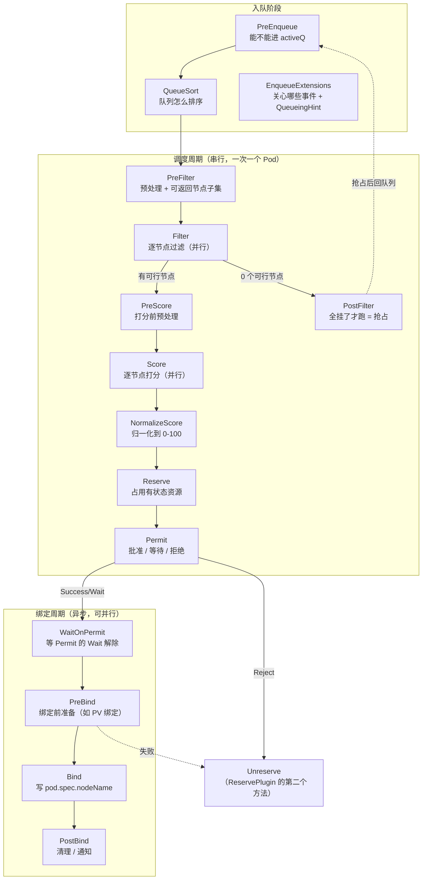

# 核心原理：调度周期与扩展点

> 本篇讲清 kube-scheduler 的**调度框架（Scheduling Framework）**：13+2 个扩展点分别在什么时候跑、`Status` 七种返回码各代表什么、`CycleState` 怎么跨扩展点传状态。这是写自定义调度插件的基础，也是读懂 Volcano 插件体系的前提。
>
> 涉及源码：`staging/src/k8s.io/kube-scheduler/framework/interface.go`、`pkg/scheduler/framework/runtime/framework.go`、`pkg/scheduler/schedule_one.go`
>
> 源码基线：**v1.36.3**

---

## 1. 两个周期与全部扩展点



`staging/src/k8s.io/kube-scheduler/framework/interface.go` 中的接口清单（v1.36 共 15 个）：

```go
type Plugin interface { Name() string }

type PreEnqueuePlugin interface        // 入队门禁
type QueueSortPlugin interface         // 队列排序（★ 全局只能有一个）
type EnqueueExtensions interface       // 声明关心的事件 + QueueingHint
type PreFilterPlugin interface         // 预过滤
type PreFilterExtensions interface     // AddPod / RemovePod（抢占模拟用）
type FilterPlugin interface            // 过滤
type PostFilterPlugin interface        // 过滤全失败后的补救（抢占）
type PreScorePlugin interface          // 预打分
type ScorePlugin interface             // 打分
type ScoreExtensions interface         // NormalizeScore
type ReservePlugin interface           // Reserve / Unreserve
type PermitPlugin interface            // 批准
type PreBindPlugin interface           // 绑定前
type BindPlugin interface              // 绑定
type PostBindPlugin interface          // 绑定后

// ★ v1.36 新增（workload-aware scheduling，Alpha）
type PlacementGeneratePlugin interface // 生成候选 Placement（一组节点）
type PlacementScorePlugin interface    // 给 Placement 打分
type PlacementScoreExtensions interface
type SignPlugin interface              // OpportunisticBatching 相关
```

### 1.1 逐个扩展点的用途与代表插件

| 扩展点 | 何时跑 | 能做什么 | 代表插件 |
|--------|--------|---------|---------|
| `PreEnqueue` | Pod 进 activeQ 前 | **挡住不该被调度的 Pod** | `SchedulingGates`、`GangScheduling`(Alpha) |
| `QueueSort` | 队列比较两个 Pod | 决定谁先被调度 | `PrioritySort`（唯一，按优先级+创建时间） |
| `EnqueueExtensions` | 注册期 | 声明「哪些事件可能让我失败的 Pod 变可调度」 | 几乎所有插件 |
| `PreFilter` | 每轮开始 | 预计算写入 CycleState；**可返回节点子集** | `NodeAffinity`、`InterPodAffinity`、`PodTopologySpread`、`NodeResourcesFit` |
| `Filter` | 每个节点 | 硬约束判定（并行执行） | `NodeResourcesFit`、`NodeUnschedulable`、`TaintToleration`、`NodeName`、`NodePorts`、`VolumeBinding` |
| `PostFilter` | **仅当 0 个可行节点** | 补救措施 | `DefaultPreemption`、`DynamicResources` |
| `PreScore` | Filter 之后 | 打分前预计算 | 同 PreFilter 的那批 |
| `Score` | 每个可行节点 | 返回 0~100 分（并行执行） | `NodeResourcesFit`、`NodeResourcesBalancedAllocation`、`ImageLocality`、`InterPodAffinity`、`PodTopologySpread`、`TaintToleration`、`NodeAffinity` |
| `NormalizeScore` | Score 之后 | 把插件自定义分值域归一化到 0~100 | `ImageLocality`、`PodTopologySpread` 等 |
| `Reserve` | 选定节点后 | 占用**有状态**资源（防并发冲突） | `VolumeBinding`、`DynamicResources` |
| `Unreserve` | 失败回滚 | 释放 Reserve 占的东西 | 同上 |
| `Permit` | Reserve 之后 | **Success / Wait / Reject** | `GangScheduling`(Alpha) |
| `PreBind` | 绑定周期 | 真正做慢操作（PV 绑定、DRA 分配） | `VolumeBinding`、`DynamicResources` |
| `Bind` | 绑定周期 | 写 `pod.spec.nodeName`；返回 `Skip` 交给下一个 | `DefaultBinder` |
| `PostBind` | 绑定成功后 | 清理、通知，**无法影响结果** | — |

**几个容易忽略的要点**：

1. **`QueueSort` 全局唯一**。多 profile 场景下每个 profile 各一个，但一个 profile 内只能有一个（`frameworkImpl` 构造时会校验）。
2. **`PostFilter` 只在 0 个可行节点时才跑**。这就是「抢占是兜底路径」的实现方式。
3. **`Bind` 是短路的**：多个 Bind 插件按顺序跑，返回 `Skip` 表示「我不管」，第一个不返回 `Skip` 的插件负责绑定。
4. **`Reserve` 与 `PreBind` 的分工**：`Reserve` 在串行的调度周期里，必须**快**（只改内存）；`PreBind` 在并行的绑定周期里，可以慢（可以调 API）。

### 1.2 MultiPoint：一次声明多个扩展点

v1.36 的默认配置全部走 `MultiPoint`：

```go
// pkg/scheduler/apis/config/v1/default_plugins.go
MultiPoint: v1.PluginSet{
    Enabled: []v1.Plugin{
        {Name: names.NodeResourcesFit, Weight: ptr.To[int32](1)},
        ...
    },
}
```

一个插件实现了哪些接口，`MultiPoint` 就把它注册到对应的所有扩展点。`NodeResourcesFit` 同时是 `PreFilter` + `Filter` + `Score`，写一行就够。

想只启用其中一部分，用 `disabled` 精确关掉：

```yaml
profiles:
- schedulerName: default-scheduler
  plugins:
    score:
      disabled:
      - name: NodeResourcesBalancedAllocation   # 只关它的 Score，Filter 仍生效
```

---

## 2. Status：七种返回码

这是插件与框架之间的**唯一通信协议**，语义差异直接决定 Pod 的命运（`interface.go`）：

| Code | 含义 | 后续行为 |
|------|------|---------|
| `Success`（nil 也算） | 通过 | 继续下一个扩展点 |
| `Error` | **插件内部错误**（非预期） | Pod 重新入队，**不记录 unschedulablePlugins**，很快重试 |
| `Unschedulable` | 不可调度，但**抢占可能有用** | 继续跑 `PostFilter`（抢占）；退避后重试 |
| `UnschedulableAndUnresolvable` | 不可调度，且**抢占也没用** | **跳过其他 PostFilter**；退避后重试 |
| `Wait` | 仅 `Permit` 用：需要等待 | Pod 进 `waitingPods`，等 `Allow()` 或超时 |
| `Skip` | ①Bind 插件不接管 ②PreFilter 返回则跳过配对的 Filter ③PreScore 返回则跳过配对的 Score | 优化路径 |
| `Pending` | 调度**成功**了，但插件要求先停一下（等外部组件） | **不退避**，直接回 activeQ |

**`Unschedulable` vs `UnschedulableAndUnresolvable` 是最重要的区分**：

```go
// Unschedulable is one of the failures, used when a plugin finds a pod unschedulable.
// If it's returned from PreFilter or Filter, the scheduler might attempt to
// run other postFilter plugins like preemption to get this pod scheduled.
// Use UnschedulableAndUnresolvable to make the scheduler skipping other postFilter plugins.
```

举例：

- 「CPU 不够」→ `Unschedulable`（杀掉低优 Pod 就有 CPU 了，抢占有意义）
- 「节点标签不匹配 nodeSelector」→ `UnschedulableAndUnresolvable`（杀谁都没用）

写插件时搞错这个，会导致大量无意义的抢占尝试，或者本该抢占却不抢。

**`Pending` 是较新加入的**，注释解释了它的独特之处：

```go
// Pending means that the scheduling process is finished successfully,
// but the plugin wants to stop the scheduling cycle/binding cycle here.
// ...
// So, Pods rejected by such reasons don't need to suffer a penalty (backoff).
// When the scheduling queue requeues Pods, which was rejected with Pending in the last scheduling,
// the Pod goes to activeQ directly ignoring backoff.
```

「调度结果算出来了，只是还不能立刻用」—— 不算浪费调度周期，所以**免退避**。

---

## 3. CycleState：跨扩展点传状态

一次调度周期一个 `CycleState`，插件用它把 `PreFilter` 算的东西传给 `Filter`：

```go
// schedule_one.go
state := framework.NewCycleState()
// 采样：只有一部分调度周期记录 plugin 级指标（性能考虑）
state.SetRecordPluginMetrics(rand.Intn(100) < pluginMetricsSamplePercent)

podsToActivate := framework.NewPodsToActivate()
state.Write(framework.PodsToActivateKey, podsToActivate)
```

典型用法（以 `InterPodAffinity` 为例）：`PreFilter` 时**一次性**扫描全集群 Pod 算出拓扑分布，写进 CycleState；`Filter` 时每个节点直接读，避免 N 次全量扫描。这是 O(N×M) 降到 O(N+M) 的关键。

### 3.1 PodsToActivate：插件可以「唤醒」别的 Pod

```go
// prepareForBindingCycle
if len(podsToActivate.Map) != 0 {
    sched.SchedulingQueue.Activate(logger, podsToActivate.Map)
    podsToActivate.Map = make(map[string]*v1.Pod)
}
```

gang 插件正是用这个机制加速凑齐同伴：

```go
// plugins/gangscheduling/gangscheduling.go：Permit 里
unscheduledPods := podGroupState.UnscheduledPods()
pl.handle.Activate(klog.FromContext(ctx), unscheduledPods)
```

### 3.2 v1.36 新增：PodGroupCycleState

成组调度引入了「两层 CycleState」：

```go
// schedule_one_podgroup.go
state.SetPodGroupSchedulingCycle(podGroupState)   // 标记这是成组调度周期
...
// 绑定前必须清掉，否则 Permit 会读快照而不是实时缓存
podCtx.state.SetPodGroupSchedulingCycle(nil)
```

gang 插件据此选择数据来源：

```go
var podGroupStateLister fwk.PodGroupStateLister
if state.IsPodGroupSchedulingCycle() {
    podGroupStateLister = pl.snapshotLister.PodGroupStates()     // 成组周期：读快照
} else {
    podGroupStateLister = pl.podGroupManager.PodGroupStates()    // 普通周期：读实时缓存
}
```

---

## 4. 调度周期源码逐段

`schedule_one.go` 的调用链非常清晰：

```text
ScheduleOne
├── NextPod()                                  ← 队列 Pop（阻塞）
├── frameworkForPod() / skipPodSchedule()
├── [v1.36] SchedulingGroup != nil ? scheduleOnePodGroup : scheduleOnePod
└── scheduleOnePod
    ├── schedulingCycle                        ← 同步、串行
    │   ├── Cache.UpdateSnapshot()
    │   ├── schedulingAlgorithm
    │   │   ├── SchedulePod (= schedulePod)
    │   │   │   ├── findNodesThatFitPod         ← PreFilter + Filter
    │   │   │   ├── prioritizeNodes             ← PreScore + Score + Normalize
    │   │   │   └── newSortedNodeScores().Pop() ← 选最高分
    │   │   └── RunPostFilterPlugins            ← 仅失败时（抢占）
    │   └── prepareForBindingCycle
    │       ├── assumeAndReserve                ← assume + Reserve
    │       └── RunPermitPlugins                ← Permit
    └── go runBindingCycle                      ← 异步
        └── bindingCycle
            ├── WaitOnPermit
            ├── RunPreBindPlugins
            ├── bind → RunBindPlugins
            └── RunPostBindPlugins
```

### 4.1 schedulingCycle

```go
func (sched *Scheduler) schedulingCycle(...) (ScheduleResult, *framework.QueuedPodInfo, *fwk.Status) {
    if err := sched.Cache.UpdateSnapshot(klog.FromContext(ctx), sched.nodeInfoSnapshot); err != nil {
        return ScheduleResult{nominatingInfo: clearNominatedNode}, podInfo, fwk.AsStatus(err)
    }

    scheduleResult, status := sched.schedulingAlgorithm(ctx, state, schedFramework, podInfo, start)
    if !status.IsSuccess() {
        return scheduleResult, podInfo, status
    }

    assumedPodInfo, status := sched.prepareForBindingCycle(ctx, state, schedFramework, podInfo, podsToActivate, scheduleResult)
    if !status.IsSuccess() {
        return ScheduleResult{nominatingInfo: clearNominatedNode}, assumedPodInfo, status
    }
    return scheduleResult, assumedPodInfo, nil
}
```

**每轮都 `UpdateSnapshot`**，但它是增量的（见 02 篇）—— 只处理上次快照之后变化的节点。

### 4.2 抢占的触发点

```go
// schedulingAlgorithm
scheduleResult, err := sched.SchedulePod(ctx, schedFramework, state, podInfo)
if err != nil {
    if err == ErrNoNodesAvailable { ... }
    fitError, ok := err.(*framework.FitError)
    if !ok { ... }

    // SchedulePod() may have failed because the pod would not fit on any host, so we try to
    // preempt, with the expectation that the next time the pod is tried for scheduling it
    // will fit due to the preemption. It is also possible that a different pod will schedule
    // into the resources that were preempted, but this is harmless.
    if !schedFramework.HasPostFilterPlugins() {
        logger.V(3).Info("No PostFilter plugins are registered, so no preemption will be performed")
        return ScheduleResult{nominatingInfo: clearNominatedNode}, fwk.NewStatus(fwk.Unschedulable).WithError(err)
    }
    result, status := schedFramework.RunPostFilterPlugins(ctx, state, pod, fitError.Diagnosis.NodeToStatus)
    ...
    return ScheduleResult{nominatingInfo: nominatingInfo}, fwk.NewStatus(fwk.Unschedulable).WithError(err)
}
```

注意那句注释：*"It is also possible that a different pod will schedule into the resources that were preempted, but this is harmless."* —— **kube-scheduler 承认抢占的资源可能被别人捡走**，这是它「乐观、无预留」设计的代价。

> 对比：Volcano 用 `Pipelined` 状态 + `NominatedNodeName` 双重占位；Kueue 用 `reserveCapacityForUnreclaimablePreempt` 主动占配额。两者都比 kube-scheduler 更严格地保护抢占者。

### 4.3 Permit 与 WaitingPod

```go
// prepareForBindingCycle
pluginsWaitTime, runPermitStatus := schedFramework.RunPermitPlugins(ctx, state, assumedPod, scheduleResult.SuggestedHost)
if runPermitStatus.IsWait() {
    schedFramework.AddWaitingPod(assumedPod, pluginsWaitTime)      // ★ 挂起，但资源已 assume
} else if !runPermitStatus.IsSuccess() {
    err := sched.unreserveAndForget(ctx, state, schedFramework, assumedPodInfo, scheduleResult.SuggestedHost)
    ...
}
```

**关键点：`Wait` 期间 Pod 已经 `assume` 过了，也就是占着缓存里的资源。** 这是 v1.36 原生 gang 与 Volcano 事务式 gang 的本质差异（00 篇 §6.3）—— Permit 等待不释放资源，多个 gang 互等会死锁，只能靠 5 分钟超时解开。

---

## 5. framework runtime：扩展点怎么被跑起来

`pkg/scheduler/framework/runtime/framework.go` 的 `frameworkImpl` 持有每个扩展点的插件切片。三种执行模式：

### 5.1 串行 + 短路：Filter

```go
// 伪代码，实际为 RunFilterPlugins
for _, pl := range f.filterPlugins {
    if status := pl.Filter(ctx, state, pod, nodeInfo); !status.IsSuccess() {
        if !status.IsRejected() { return AsStatus(...) }   // Error：包装成错误
        status.SetPlugin(pl.Name())
        return status                                      // ★ 第一个失败就返回
    }
}
```

一个节点被任一 Filter 拒绝就立刻放弃该节点，不跑剩下的插件。

### 5.2 交集：PreFilter 的 PreFilterResult

```go
// RunPreFilterPlugins
var result *fwk.PreFilterResult
for _, pl := range f.preFilterPlugins {
    r, s := pl.PreFilter(ctx, state, pod, nodes)
    if s.IsSkip() { skipPlugins.Insert(pl.Name()); continue }
    if !s.IsSuccess() { ... }
    result = result.Merge(r)                    // ★ 多个插件的节点子集取交集
    if !result.AllNodes() && len(result.NodeNames) == 0 {
        return nil, NewStatus(Unschedulable, ...), ...   // 交集为空，直接失败
    }
}
```

`PreFilterResult` 是一个重要优化：`NodeAffinity` 如果发现 Pod 用了 `nodeSelector`，可以直接返回「只有这 3 个节点符合」，后续 Filter 就只跑这 3 个节点而不是全集群。多个插件返回的子集取**交集**。

### 5.3 并行 + 归一化：Score

```go
// RunScorePlugins
f.Parallelizer().Until(ctx, len(nodes), func(index int) {
    for _, pl := range f.scorePlugins {
        s, status := pl.Score(ctx, state, pod, nodeInfo)
        pluginToNodeScores[pl.Name()][index] = fwk.NodeScore{Name: nodeName, Score: s}
    }
}, metrics.Score)

// NormalizeScore
for _, pl := range f.scorePlugins {
    if pl.ScoreExtensions() == nil { continue }
    status := pl.ScoreExtensions().NormalizeScore(ctx, state, pod, nodeScoreList)
}

// 加权求和
for i := range nodes {
    for j := range pluginToNodeScores {
        result[i].TotalScore += nodeScoreList[i].Score * int64(weight)
    }
}
```

三个约束：

1. `Score` 返回值必须在 `[MinNodeScore, MaxNodeScore]` = `[0, 100]`，否则框架报错；
2. 想用自定义分值域，就实现 `ScoreExtensions().NormalizeScore()` 把它压回 0~100；
3. 并行度由 `KubeSchedulerConfiguration.parallelism` 控制（默认 16）。

**权重的实际效果**：`TaintToleration` 权重 3、`NodeAffinity` / `PodTopologySpread` / `InterPodAffinity` 权重 2、`NodeResourcesFit` / `BalancedAllocation` / `ImageLocality` 权重 1。最高总分 = (3+2+2+2+1+1+1)×100 = 1200。

---

## 6. 与 Volcano 扩展点体系的对照

Volcano 的插件体系明显借鉴了这套设计，但有几个结构性差异：

| | kube-scheduler | Volcano |
|--|---------------|---------|
| 扩展点数量 | 15（含 v1.36 新增） | 37（`ssn.AddXxxFn`） |
| 注册方式 | 实现接口，框架反射注册 | `OnSessionOpen` 里主动 `ssn.AddXxxFn(name, fn)` |
| 插件生命周期 | 进程级单例 | **每轮 Session 重建** |
| 聚合语义 | Filter 串行短路；Score 加权求和 | 有 tier 分层短路语义 |
| 作业级扩展点 | 无（v1.36 Alpha 才有 PodGroup 相关） | `JobOrderFn`/`JobReadyFn`/`JobEnqueueableFn` 等一大批 |
| 队列级扩展点 | 无 | `QueueOrderFn`/`OverusedFn`/`AllocatableFn` |

**Volcano 复用了 kube-scheduler 的插件实现**：

```go
// volcano: pkg/scheduler/plugins/predicates/predicates.go 会 import
// k8s.io/kubernetes/pkg/scheduler/framework/plugins/{nodeaffinity,podtopologyspread,...}
```

所以「NodeAffinity 怎么判定」「PodTopologySpread 怎么算 skew」这些细节，两边完全一致 —— **读一遍 kube-scheduler 的插件，等于同时读懂了 Volcano 的 predicates/nodeorder。**

---

## 7. 小结与常见误区

| 误区 | 事实 |
|------|------|
| 「所有扩展点都在调度周期里」 | `PreBind`/`Bind`/`PostBind`/`WaitOnPermit` 在**异步的绑定周期** |
| 「Filter 失败会跑完所有插件收集原因」 | 单节点上**第一个失败就短路**；跨节点才是并行全跑 |
| 「PostFilter 每轮都跑」 | 只在**0 个可行节点**时跑 |
| 「Score 可以返回任意分值」 | 必须 0~100，否则要实现 `NormalizeScore` |
| 「Reserve 里可以调 API」 | Reserve 在串行周期内，必须快；慢操作放 `PreBind` |
| 「`Error` 和 `Unschedulable` 差不多」 | `Error` 不记 unschedulablePlugins、很快重试；`Unschedulable` 要退避 |
| 「`UnschedulableAndUnresolvable` 只是更严重的 Unschedulable」 | 它会**跳过其他 PostFilter**，即放弃抢占 |
| 「QueueSort 可以配多个」 | 一个 profile 内**唯一** |
| 「Permit 的 Wait 不占资源」 | **占**（已 assume），这是原生 gang 可能死锁的原因 |

下一篇 [02 调度队列与缓存](02-核心代码分析-调度队列与缓存.md)：三队列流转、QueueingHint、Cache 的增量快照与 assume/forget。
