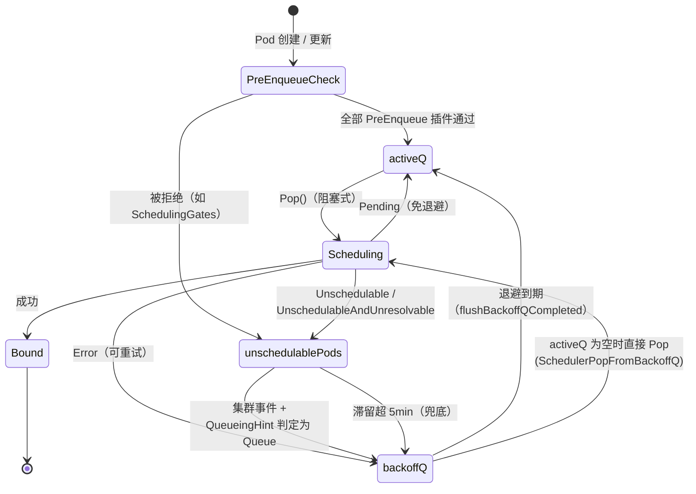
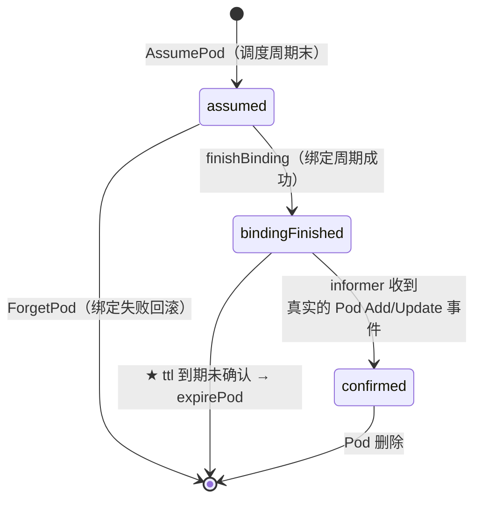

# 核心代码分析（一）：调度队列与缓存

> 本篇拆解 kube-scheduler 的两个「后端」：**调度队列**（谁下一个被调度）和**集群缓存**（调度决策依据哪份数据）。这两块决定了调度器的吞吐上限与正确性。
>
> 源码目录：`pkg/scheduler/backend/{queue,cache,heap,api_dispatcher}`
>
> 源码基线：**v1.36.3**

---

## 1. 调度队列：三个容器

```go
// pkg/scheduler/backend/queue/scheduling_queue.go
// PriorityQueue implements a scheduling queue.
// The head of PriorityQueue is the highest priority pending pod. This structure
// has two sub queues and a additional data structure, namely: activeQ,
// backoffQ and unschedulablePods.
//   - activeQ holds pods that are being considered for scheduling.
//   - backoffQ holds pods that moved from unschedulablePods and will move to
//     activeQ when their backoff periods complete.
//   - unschedulablePods holds pods that were already attempted for scheduling and
//     are currently determined to be unschedulable.
type PriorityQueue struct {
    *nominator                    // ★ 内嵌：抢占提名记录

    stop  chan struct{}
    clock clock.WithTicker

    // lock takes precedence and should be taken first,
    // before any other locks in the queue (activeQueue.lock or backoffQueue.lock or nominator.nLock).
    // Correct locking order is: lock > activeQueue.lock > backoffQueue.lock > nominator.nLock.
    lock sync.RWMutex
    ...
}
```

> 那段锁顺序注释值得留意 —— 队列内部有 4 把锁，顺序错了就死锁。这也侧面说明这个组件的并发复杂度。

### 1.1 默认时间参数

```go
const (
    // DefaultPodMaxInUnschedulablePodsDuration is the default value for the maximum
    // time a pod can stay in unschedulablePods. If a pod stays in unschedulablePods
    // for longer than this value, the pod will be moved from unschedulablePods to
    // backoffQ or activeQ. If this value is empty, the default value (5min) will be used.
    DefaultPodMaxInUnschedulablePodsDuration time.Duration = 5 * time.Minute

    activeQ        = "Active"
    backoffQ       = "Backoff"
    unschedulableQ = "Unschedulable"
    preEnqueue     = "PreEnqueue"
)

const (
    DefaultPodInitialBackoffDuration time.Duration = 1 * time.Second
    DefaultPodMaxBackoffDuration     time.Duration = 10 * time.Second
)
```

三个数字要记住：

| 参数 | 默认值 | 可配置项 |
|------|--------|---------|
| 初始退避 | **1s**（指数增长：1s → 2s → 4s → 8s → 10s） | `podInitialBackoffSeconds` |
| 最大退避 | **10s** | `podMaxBackoffSeconds` |
| unschedulablePods 最长滞留 | **5min** | `podMaxInUnschedulablePodsDuration`（仅代码内，非 API） |

> **退避上限只有 10 秒**，比很多人想的短得多。所以一个 Pending Pod 在最坏情况下每 10 秒就会被重试一次 —— 这在大集群里是可观的开销，也正是 QueueingHint 要解决的问题。

### 1.2 流转全图



### 1.3 5 分钟兜底

```go
func (p *PriorityQueue) flushUnschedulablePodsLeftover(logger klog.Logger) {
    var podsToMove []*framework.QueuedPodInfo
    currentTime := p.clock.Now()
    for _, pInfo := range p.unschedulablePods.podInfoMap {
        lastScheduleTime := pInfo.Timestamp
        if currentTime.Sub(lastScheduleTime) > p.podMaxInUnschedulablePodsDuration {
            // Mark this pod as flushed so we can detect if it schedules soon after
            pInfo.WasFlushedFromUnschedulable = true
            podsToMove = append(podsToMove, pInfo)
        }
    }
    if len(podsToMove) > 0 {
        p.movePodsToActiveOrBackoffQueue(logger, podsToMove, framework.EventUnschedulableTimeout, nil, nil)
    }
}
```

这是**安全网**：万一某个插件的 QueueingHint 写错了（该 `Queue` 却返回了 `QueueSkip`），Pod 也不会永久卡死，最多 5 分钟后被强制重试。

`WasFlushedFromUnschedulable` 标记用于**检测这种 bug**：如果一个 Pod 被兜底刷出来后很快就调度成功了，说明本该更早被唤醒 —— 对应指标可以发现 QueueingHint 实现缺陷。

### 1.4 SchedulerPopFromBackoffQ（v1.33 Beta 默认开）

```text
老行为：activeQ 空 → 调度器空转等待，即使 backoffQ 里有 Pod 快到期了
新行为：activeQ 空 → 直接从 backoffQ 取最早到期的 Pod
```

KEP-5142 的动机：退避本是「浪费调度周期的惩罚」，但集群空闲时这个惩罚毫无意义。

---

## 2. QueueingHint：精准唤醒

### 2.1 要解决的问题

老版本（≤ v1.31）的行为：

```text
Pod-A 因「CPU 不够」进 unschedulablePods
  → 集群里任何一个 Pod 被删除
  → MoveAllToActiveOrBackoffQueue：把所有 unschedulablePods 全部拉回
  → Pod-A 重试，发现删的是别的节点上的 Pod，CPU 还是不够
  → 再次失败
```

在有大量 Pending Pod 的集群里，这会造成调度器持续满载做无用功。

### 2.2 机制

插件通过 `EnqueueExtensions` 声明「我关心哪些事件」，并为每个事件提供一个 **hint 函数**判断「这个具体的事件对当前这个 Pod 有意义吗」：

```go
// plugins/gangscheduling/gangscheduling.go
func (pl *GangScheduling) EventsToRegister(_ context.Context) ([]fwk.ClusterEventWithHint, error) {
    return []fwk.ClusterEventWithHint{
        // A new pod being added might be the one that completes a gang, meeting its MinCount requirement.
        // PodSchedulingGroup field is immutable, so there is no need to subscribe on Pod/Update event.
        {Event: fwk.ClusterEvent{Resource: fwk.Pod, ActionType: fwk.Add}, QueueingHintFn: pl.isSchedulableAfterPodAdded},
        // A PodGroup being added can be making a waiting gang schedulable.
        // PodGroups are immutable, so there's no need to handle PodGroup/Update event.
        {Event: fwk.ClusterEvent{Resource: fwk.PodGroup, ActionType: fwk.Add}, QueueingHintFn: pl.isSchedulableAfterPodGroupAdded},
    }, nil
}

func (pl *GangScheduling) isSchedulableAfterPodAdded(logger klog.Logger, pod *v1.Pod, oldObj, newObj interface{}) (fwk.QueueingHint, error) {
    _, addedPod, err := util.As[*v1.Pod](oldObj, newObj)
    if err != nil { return fwk.Queue, err }

    if !helper.MatchingSchedulingGroup(pod, addedPod) {
        logger.V(5).Info("another pod was added but it doesn't match the target pod's scheduling group", ...)
        return fwk.QueueSkip, nil       // ★ 不是我的同伴，别唤醒我
    }
    return fwk.Queue, nil               // ★ 是同伴，可能凑够 gang 了
}
```

三个返回值：

| QueueingHint | 含义 |
|-------------|------|
| `Queue` | 这个事件可能让我变可调度 → 把 Pod 移到 backoffQ |
| `QueueSkip` | 与我无关 → 留在 unschedulablePods |
| （返回 error 时） | 保守起见按 `Queue` 处理 |

**判定逻辑**：只对「上次导致这个 Pod 失败的插件」（`QueuedPodInfo.UnschedulablePlugins`）询问 hint。任一插件说 `Queue`，Pod 就被唤醒。

### 2.3 状态：v1.34 已 GA 且锁定

```go
SchedulerQueueingHints: {
    {Version: version.MustParse("1.28"), Default: false, PreRelease: featuregate.Beta},
    {Version: version.MustParse("1.32"), Default: true, PreRelease: featuregate.Beta},
    {Version: version.MustParse("1.34"), Default: true, PreRelease: featuregate.GA, LockToDefault: true},
},
```

**`LockToDefault: true` 意味着不能关闭**。所以在 v1.34+ 上，「Pod 删除会唤醒所有 Pending Pod」这个老知识已经彻底过时。

写自定义插件时，**必须正确实现 `EventsToRegister`**，否则你的插件导致失败的 Pod 只能靠 5 分钟兜底被唤醒。

---

## 3. nominator：抢占的跨轮记忆

`PriorityQueue` 内嵌 `*nominator`，维护 `nominatedNodeName` 映射（对应 `pod.status.nominatedNodeName`）。

它的两个作用：

**① 抢占者下轮优先试这个节点**

```go
// findNodesThatFitPod 里会优先评估 nominatedNode
```

**② 让其他 Pod「看见」被提名的高优 Pod**

在 Filter 阶段，`addNominatedPods` 会把「提名到该节点、优先级 ≥ 当前 Pod」的 Pod 也算作已占用资源。否则会出现：

```text
高优 Pod-H 抢占 node-1，杀掉 Pod-L，设 nominatedNodeName=node-1
  → 但 Pod-L 还在优雅退出（30s）
  → 低优 Pod-X 这时来调度，看到 node-1 即将空出资源，直接抢先占了
  → Pod-H 下一轮又没资源，白杀了 Pod-L
```

这就是 `schedulingAlgorithm` 那句注释说的「harmless」的场景 —— nominator 缓解但不能完全消除它。

> **对比**：Volcano 用 `Pipelined` 状态在快照里把资源真正预留（`FutureIdle = Idle + Releasing - Pipelined`），Kueue 用 `reserveCapacityForUnreclaimablePreempt` 直接占配额。两者都比 nominator 更强。

---

## 4. 缓存：cacheImpl

`pkg/scheduler/backend/cache/cache.go`。它维护调度器对集群的**内存视图**。

### 4.1 核心结构

```go
type cacheImpl struct {
    stop   <-chan struct{}
    ttl    time.Duration
    period time.Duration

    mu sync.RWMutex
    // a set of assumed pod keys.
    // The key could further be used to get an entry in podStates.
    assumedPods sets.Set[string]
    // a map from pod key to podState.
    podStates map[string]*podState
    nodes     map[string]*nodeInfoListItem
    // headNode points to the most recently updated NodeInfo in "nodes". It is the
    // head of the linked list.
    headNode *nodeInfoListItem
    nodeTree *nodeTree
    // A map from image name to its ImageStateSummary.
    imageStates map[string]*fwk.ImageStateSummary
    ...
}
```

**`headNode` + 双向链表是这里最巧妙的设计**：每次某个节点信息变化，就把它移到链表头部并递增 `Generation`。这让 `UpdateSnapshot` 可以只处理变化的部分。

### 4.2 增量快照

```go
func (cache *cacheImpl) UpdateSnapshot(logger klog.Logger, nodeSnapshot *Snapshot) error {
    cache.mu.Lock()
    defer cache.mu.Unlock()
    ...
    // Get the last generation of the snapshot.
    snapshotGeneration := nodeSnapshot.generation

    updateAllLists := false
    updateNodesHavePodsWithAffinity := false
    updateNodesHavePodsWithRequiredAntiAffinity := false
    updateUsedPVCSet := false

    // Forget all assumed pods from a previous snapshot version.
    // This is a safety check in case any pod wasn't forgotten in the previous scheduling cycle.
    nodeSnapshot.forgetAllAssumedPods(logger)

    // Start from the head of the NodeInfo doubly linked list and update snapshot
    // of NodeInfos updated after the last snapshot.
    for node := cache.headNode; node != nil; node = node.next {
        if node.info.Generation <= snapshotGeneration {
            // all the nodes are updated before the existing snapshot. We are done.
            break                                  // ★ 提前退出：后面的都没变
        }
        ...
        clone := node.info.SnapshotConcrete()
        ...
    }
}
```

**算法**：从链表头往后遍历，遇到第一个 `Generation <= snapshotGeneration` 的节点就停 —— 因为链表按更新时间倒序，后面的都是更旧的。

所以 5000 节点集群里，如果一轮只有 3 个节点变化，`UpdateSnapshot` 只克隆 3 个 NodeInfo。**这是每轮都能拍快照而不崩的原因。**

四个 `updateXxx` 标志用于决定哪些**派生列表**需要重建：

| 标志 | 触发条件 | 重建什么 |
|------|---------|---------|
| `updateAllLists` | 节点增删 | `NodeInfoList` |
| `updateNodesHavePodsWithAffinity` | 节点上「有亲和性 Pod」状态翻转 | `HavePodsWithAffinityNodeInfoList` |
| `updateNodesHavePodsWithRequiredAntiAffinity` | 「有必需反亲和 Pod」状态翻转 | `HavePodsWithRequiredAntiAffinityNodeInfoList` |
| `updateUsedPVCSet` | head 节点 generation 变化 | `usedPVCSet` |

这些子列表是给 `InterPodAffinity` 用的：它只需要扫「有亲和性 Pod 的节点」而不是全部节点，这是又一个数量级的优化。

### 4.3 assume / forget / expire

```go
func (cache *cacheImpl) AssumePod(logger klog.Logger, pod *v1.Pod) error {
    key, err := framework.GetPodKey(pod)
    if err != nil { return err }

    cache.mu.Lock()
    defer cache.mu.Unlock()
    if _, ok := cache.podStates[key]; ok {
        return fmt.Errorf("pod %v(%v) is in the cache, so can't be assumed", key, klog.KObj(pod))
    }
    return cache.addPod(logger, pod, true)      // ★ assumePod=true
}

func (cache *cacheImpl) ForgetPod(logger klog.Logger, pod *v1.Pod) error {
    ...
    if currState.pod.Spec.NodeName != pod.Spec.NodeName {
        return fmt.Errorf("pod %v(%v) was assumed on %v but assigned to %v", ...)
    }
    // Only assumed pod can be forgotten.
    if cache.assumedPods.Has(key) {
        return cache.removePod(logger, pod, true)
    }
    return fmt.Errorf("pod %v(%v) wasn't assumed so cannot be forgotten", key, klog.KObj(pod))
}
```

完整的 assume 生命周期：



**`expirePod` 是一道重要的自愈机制**：如果 Bind 成功了但 informer 一直没收到确认（网络分区、apiserver 异常），缓存里的 assumed pod 会在 `ttl` 后被清理，避免资源被永久虚占。

### 4.4 NodeInfo：资源账本

`framework.NodeInfo` 是所有 Filter/Score 插件的数据来源，关键字段：

| 字段 | 含义 |
|------|------|
| `Requested` | 该节点上所有 Pod 的 requests 之和 |
| `NonZeroRequested` | 同上，但对未设 request 的容器按默认值计（CPU 100m / 内存 200Mi） |
| `Allocatable` | 节点可分配总量 |
| `Pods` | Pod 列表 |
| `PodsWithAffinity` / `PodsWithRequiredAntiAffinity` | 带亲和性的 Pod 子集（性能优化） |
| `Generation` | 版本号，增量快照的依据 |
| `ImageStates` | 镜像状态（`ImageLocality` 用） |

**`NonZeroRequested` 的存在很有意思**：如果所有 Pod 都不写 request，`Requested` 会是 0，`LeastAllocated` 打分就失去意义。所以打分时用 `NonZeroRequested`，过滤时用 `Requested`。

---

## 5. v1.34+ 异步 API 调用

`pkg/scheduler/backend/api_dispatcher/` + `api_cache/` 是新增的一层：

```go
SchedulerAsyncAPICalls: {
    {Version: version.MustParse("1.34"), Default: false, PreRelease: featuregate.Beta},
},
```

动机：调度器有很多 API 写操作（Bind、更新 `nominatedNodeName`、写 Pod condition），同步调用会阻塞调度周期。`api_dispatcher` 把它们排队异步执行，并用 `api_cache` 维护「已发出但未确认」的本地视图，保证后续调度看到的是最新意图。

**默认关闭**，但值得知道它的存在 —— 这是社区在把「先内存后 API」的范式推得更彻底。

---

## 6. 三方对照：缓存与队列

| | kube-scheduler | Volcano | Kueue |
|--|---------------|---------|-------|
| 队列结构 | activeQ / backoffQ / unschedulablePods（三容器） | 每轮从 Cache 重建优先级队列 | 每 CQ 一个 heap + inadmissible + secondPass |
| 取任务方式 | `Pop()` 阻塞取**一个 Pod** | 每轮取**全部作业**建队列 | `Heads()` 阻塞取**每个 CQ 一个队头** |
| 驱动方式 | 事件驱动 + 退避 | 定时（默认 1s） | 阻塞驱动（`cond.Wait`） |
| 快照 | `UpdateSnapshot` 增量（链表 + Generation） | `OpenSession` 全量快照 | `Snapshot()` 只深拷 Usage |
| 乐观记账 | `AssumePod` / `ForgetPod` / `expirePod`(ttl) | `Statement.Commit` / `Discard` | `AddOrUpdateWorkload` + 异步 patch + 回滚 |
| 精准唤醒 | **QueueingHint**（GA） | 无（每轮全量重算） | 事件触发 `QueueInadmissibleWorkloads` + hash 批量下沉 |
| 防抢占者被插队 | `nominator`（弱） | `Pipelined` + FutureIdle（强） | `reserveCapacityForUnreclaimablePreempt`（强） |

**三者的取舍很清楚**：

- kube-scheduler 追求**极致吞吐与规模**（增量快照、异步绑定、精准唤醒），代价是没有作业级语义。
- Volcano 追求**决策正确性**（全量快照 + 事务），代价是每轮开销大。
- Kueue 追求**配额准确性**，只在准入层做决策，把节点问题交出去。

下一篇 [03 过滤打分与抢占](03-核心代码分析-过滤打分与抢占.md)。
