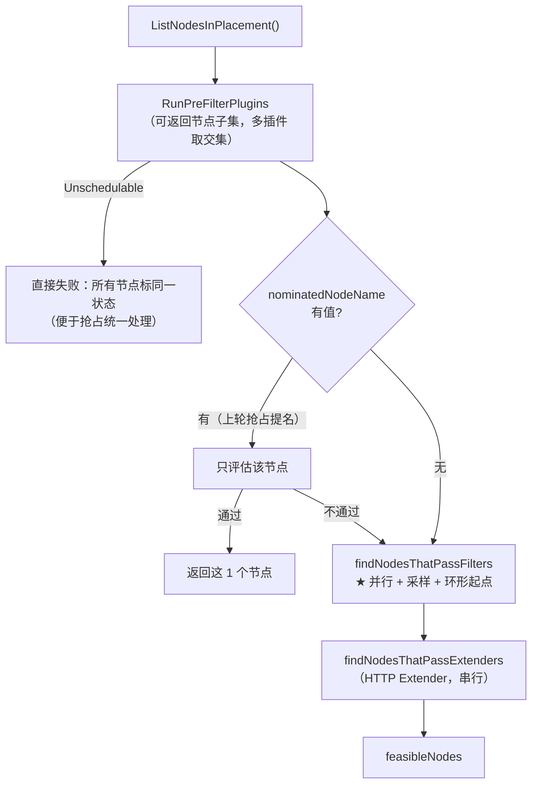
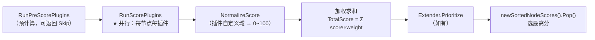
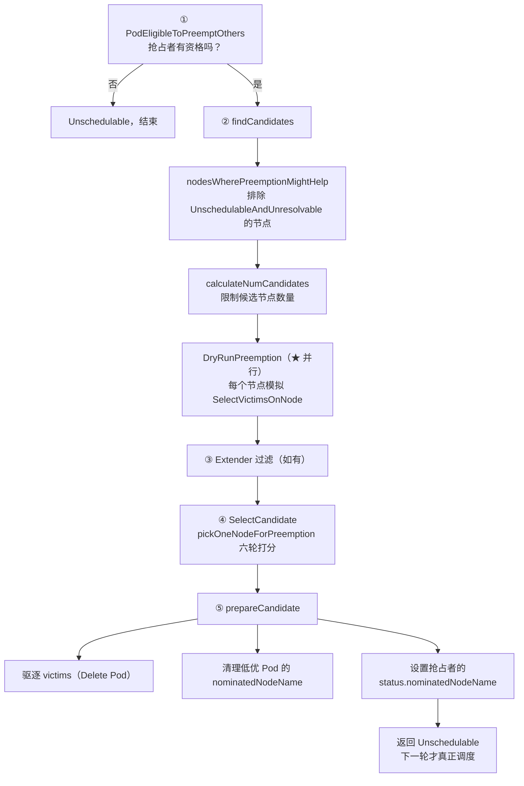

# 核心代码分析（二）：过滤、打分与抢占

> 本篇是「选节点」的核心：`findNodesThatFitPod` 怎么用采样+并行把 5000 节点压到可接受开销、打分怎么归一化与选优、以及抢占的完整流程。
>
> 涉及源码：`pkg/scheduler/schedule_one.go`、`pkg/scheduler/framework/preemption/preemption.go`、`pkg/scheduler/framework/plugins/defaultpreemption/`
>
> 源码基线：**v1.36.3**

---

## 1. schedulePod：选节点主流程

```go
func (sched *Scheduler) schedulePod(ctx context.Context, fwk framework.Framework, state fwk.CycleState, podInfo *framework.QueuedPodInfo) (result ScheduleResult, err error) {
    pod := podInfo.Pod
    trace := utiltrace.New("Scheduling", ...)
    defer trace.LogIfLong(100 * time.Millisecond)      // ★ 超 100ms 打分阶段耗时

    if sched.nodeInfoSnapshot.NumNodesInPlacement() == 0 {
        return result, ErrNoNodesAvailable
    }

    feasibleNodes, diagnosis, nodeHint, err := sched.findNodesThatFitPod(ctx, fwk, state, podInfo)
    if err != nil { return result, err }
    trace.Step("Computing predicates done")

    if len(feasibleNodes) == 0 {
        return result, &framework.FitError{
            Pod: pod, NumAllNodes: sched.nodeInfoSnapshot.NumNodesInPlacement(), Diagnosis: diagnosis,
        }
    }

    // When only one node after predicate, just use it.
    if len(feasibleNodes) == 1 {
        node := feasibleNodes[0].Node().Name
        ...
        return ScheduleResult{SuggestedHost: node, EvaluatedNodes: 1 + diagnosis.NodeToStatus.Len(), FeasibleNodes: 1}, nil
    }

    priorityList, err := prioritizeNodes(ctx, sched.Extenders, fwk, state, pod, feasibleNodes)
    if err != nil { return result, err }

    sortedPrioritizedNodes := newSortedNodeScores(priorityList)
    node := sortedPrioritizedNodes.Pop()
    trace.Step("Prioritizing done")
    ...
}
```

三个实用细节：

1. **`trace.LogIfLong(100ms)`**：单 Pod 调度超 100ms 会打印分阶段耗时，是排查「调度慢」的第一手工具（日志搜 `Computing predicates done`）。
2. **只有 1 个可行节点时跳过整个 Score 阶段**。
3. **`FitError.Diagnosis`** 是「每个节点被哪个插件拒绝」的明细，最终变成 Pod 事件里的 `0/8 nodes are available: 3 Insufficient nvidia.com/gpu, 5 node(s) didn't match Pod's node affinity`。

---

## 2. 过滤：findNodesThatFitPod



### 2.1 采样：numFeasibleNodesToFind

大集群不评估所有节点，而是「**凑够足够多的可行节点就停**」：

```go
func (sched *Scheduler) numFeasibleNodesToFind(percentageOfNodesToScore *int32, numAllNodes int32) (numNodes int32) {
    if numAllNodes < minFeasibleNodesToFind {          // minFeasibleNodesToFind = 100
        return numAllNodes
    }
    var percentage int32
    if percentageOfNodesToScore != nil {
        percentage = *percentageOfNodesToScore          // profile 级配置优先
    } else {
        percentage = sched.percentageOfNodesToScore     // 全局配置
    }
    if percentage == 0 {                                // ★ 默认 0 = 自适应
        percentage = int32(50) - numAllNodes/125
        if percentage < minFeasibleNodesPercentageToFind {   // = 5
            percentage = minFeasibleNodesPercentageToFind
        }
    }
    numNodes = numAllNodes * percentage / 100
    if numNodes < minFeasibleNodesToFind {
        return minFeasibleNodesToFind                   // 下限 100
    }
    return numNodes
}
```

自适应公式 `50 - numAllNodes/125` 代入几个规模：

| 集群规模 | 百分比 | 实际评估上限 |
|---------|-------|------------|
| < 100 | — | 全部 |
| 100 | 50% | 100（下限兜底） |
| 500 | 46% | 230 |
| 1000 | 42% | 420 |
| 3000 | 26% | 780 |
| 5000 | 10% | 500 |
| ≥ 5625 | 5%（触底） | 5% |

**这是「调度质量 vs 调度延迟」的显式取舍**：只看了一部分节点，选出的「最优」只是局部最优。

配合**环形起点**（`nextStartNodeIndex`）：每轮从上次结束的位置继续扫，保证长期上所有节点都有机会被评估，避免总是命中前几个节点。

> **GPU 集群的实践建议**：GPU 节点通常只有几十到几百台，`numAllNodes < 100` 时会全量评估，采样不影响。但如果 GPU 节点和 CPU 节点在同一集群且总数上千，建议用 `PreFilterResult`（`NodeAffinity` 靠 `nodeSelector` 生效）先把候选压到 GPU 节点，而不是依赖采样。

### 2.2 并行执行

```go
// findNodesThatPassFilters 内
sched.Parallelizer().Until(ctx, numAllNodes, checkNode, metrics.Filter)
```

并行度由 `KubeSchedulerConfiguration.parallelism` 控制（默认 16）。`checkNode` 里凑够 `numNodesToFind` 就 `cancel()` 提前终止所有 worker。

### 2.3 Extender：老机制

```go
// Extenders are called sequentially.
// Nodes in original feasibleNodes can be excluded in one extender, and pass on to the next
```

HTTP 外部扩展，串行调用。**在 Framework 出现前这是唯一的扩展方式**，现在只在少数场景（如某些云厂商的 GPU 调度扩展）还在用。Volcano 的 `extender` 插件是同类设计。

---

## 3. 打分：prioritizeNodes



三个硬约束（`framework/runtime/framework.go`）：

1. `Score()` 返回值必须在 `[MinNodeScore, MaxNodeScore] = [0, 100]`，越界框架直接报错；
2. 自定义分值域必须实现 `ScoreExtensions().NormalizeScore()` 压回 0~100；
3. 默认权重下最高总分 = `(3+2+2+2+1+1+1) × 100 = 1200`。

### 3.1 并列最高分怎么办

老版本 `selectHost()` 用 reservoir sampling 在同分节点中真随机选一个。v1.36 换成了堆：

```go
// pkg/scheduler/schedule_one.go
func (h nodeScoreHeap) Less(i, j int) bool {
    return (h[i].TotalScore > h[j].TotalScore ||
        (h[i].TotalScore == h[j].TotalScore && h[i].Randomizer > h[j].Randomizer))
}
```

⚠️ **但 `Randomizer` 只在 Extender 路径被赋值**：

```go
if len(extenders) != 0 && nodes != nil {
    ...
    nodesScores[i].Randomizer = rand.Int()      // ★ 全文件仅此一处
}
```

所以**没配 Extender 的集群（绝大多数）里，所有节点的 `Randomizer` 恒为 0**，`Less` 退化成纯分数比较，同分节点的胜者由 `heap.Init` 的堆化顺序决定 —— 确定性的，不是随机的。

实际影响：批量扩容相同规格的 Pod 时，别指望这层随机性把它们铺开，要用 `PodTopologySpread` 显式打散。详见 [01 篇 §6.7](01-核心原理-调度周期与扩展点.md)。

### 3.2 GPU 集群最该关注的打分插件

| 插件 | 默认权重 | 默认行为 | GPU 场景问题 |
|------|---------|---------|-------------|
| `NodeResourcesFit` | 1 | `LeastAllocated`（**打散**），且 `defaultResourceSpec` **只算 cpu/memory** | ★ **GPU 默认完全不参与打分**；要装箱得同时改 `type: MostAllocated` 并把 `nvidia.com/gpu` 加进 `resources` |
| `NodeResourcesBalancedAllocation` | 1 | 衡量「Pod 让节点变得更均衡还是更不均衡」（**差值**，不变约 75 分；不是老资料里的 1−方差） | 可能与 GPU 装箱目标冲突 |
| `ImageLocality` | 1 | 有镜像的节点加分，并按「多少节点有该镜像」打折（`spread = NumNodes/totalNumNodes`） | **对大模型镜像很有用**（几十 GB 镜像拉取耗时长）；也常成为同规格节点间的唯一决胜项 |
| `PodTopologySpread` | 2 | 按拓扑域打散 | 推理副本打散有用，训练要同域则相反 |
| `InterPodAffinity` | 2 | 亲和加分/反亲和减分 | 表达「TP 组同机」的唯一原生手段（但不是硬性成组） |
| `TaintToleration` | 3 | 不可容忍的 `PreferNoSchedule` 污点越少分越高 | 无此类污点时**给所有节点固定 100 分，零区分度** |

> [01 篇 §6.6](01-核心原理-调度周期与扩展点.md) 用统一示例把这几个插件的分数逐项算了一遍，结论是：两台空闲的同规格 8 卡机器之间，758 : 658 的差距**全部来自 ImageLocality**，GPU 一项都没参与。

改成装箱的配置（05 篇会实操）：

```yaml
profiles:
- schedulerName: default-scheduler
  pluginConfig:
  - name: NodeResourcesFit
    args:
      scoringStrategy:
        type: MostAllocated              # ★ 装箱
        resources:
        - name: nvidia.com/gpu
          weight: 10                     # GPU 权重给高
        - name: cpu
          weight: 1
        - name: memory
          weight: 1
  plugins:
    score:
      enabled:
      - name: NodeResourcesFit
        weight: 10                       # 提高该插件整体权重
```

`NodeResourcesFit` 支持三种 `scoringStrategy`：

| 策略 | 语义 | 适用 |
|------|------|------|
| `LeastAllocated`（默认） | 剩余资源越多分越高 → 打散 | 通用服务，抗节点故障 |
| `MostAllocated` | 已用越多分越高 → 装箱 | **GPU 集群，减少碎片** |
| `RequestedToCapacityRatio` | 自定义「利用率 → 分数」折线 | 精细控制（如 80% 利用率最优） |

---

## 4. 抢占：DefaultPreemption

抢占逻辑分两层：通用框架 `framework/preemption/preemption.go`（`Evaluator`），插件实现 `plugins/defaultpreemption/`。入口是 `PostFilter`。

### 4.1 五步流程

```go
func (ev *Evaluator) Preempt(ctx context.Context, state fwk.CycleState, pod *v1.Pod, m fwk.NodeToStatusReader) (*fwk.PostFilterResult, *fwk.Status) {
    // 0) Fetch the latest version of <pod>.
    pod, err := ev.PodLister.Pods(pod.Namespace).Get(pod.Name)
    ...
    // 1) Ensure the preemptor is eligible to preempt other pods.
    nominatedNodeStatus := m.Get(pod.Status.NominatedNodeName)
    if ok, msg := ev.PodEligibleToPreemptOthers(ctx, pod, nominatedNodeStatus); !ok {
        return nil, fwk.NewStatus(fwk.Unschedulable, msg)
    }
    // 2) Find all preemption candidates.
    allNodes, err := ev.Handler.SnapshotSharedLister().NodeInfos().List()
    candidates, nodeToStatusMap, err := ev.findCandidates(ctx, state, allNodes, pod, m)
    // 3) Interact with registered Extenders to filter out some candidates if needed.
    // 4) Find the best candidate.
    // 5) Perform preparation work before nominating the selected candidate.
}
```



### 4.2 ① 谁有资格抢占

`PodEligibleToPreemptOthers` 的判定：

- `pod.spec.preemptionPolicy == Never` → 不允许（这是 `PriorityClass` 上的字段）；
- 已经有 `nominatedNodeName` 且该节点状态是 `UnschedulableAndUnresolvable` → 说明上次抢占的成果已失效，允许重新抢；
- 已经有 `nominatedNodeName` 且该节点上有正在被删除（`DeletionTimestamp != nil`）且优先级更低的 Pod → **正在等受害者退出，不要重复抢占**。

最后一条很关键：它避免了「受害者优雅退出的 30 秒里，抢占者每轮都再杀一批」的雪崩。

### 4.3 ② SelectVictimsOnNode：单节点选受害者

算法（`defaultpreemption` 实现 + 通用框架驱动）：

```text
1. 把该节点上「优先级低于抢占者」的 Pod 全部虚拟移除（RemovePod）
2. 检查抢占者现在能否放下（RunFilterPlugins）
   - 不能 → 这个节点没救，返回失败
3. 能 → 说明"全杀"可行，现在尝试少杀一些：
   a. 按 PDB 把候选分成两组：violating（会破坏 PDB）/ non-violating
   b. 各组内按优先级从高到低排序
   c. 先尝试把 non-violating 的 Pod 一个个"加回来"（AddPod），
      加回后仍能放下抢占者就保留它（即不杀它）
   d. 再对 violating 组做同样操作
4. 返回最终必须杀掉的 victims + NumPDBViolations
```

**「先全移除再逐个加回」**是这里的精髓：它保证找到的是**近似最小**的受害者集合，且优先保留高优先级和不破坏 PDB 的 Pod。

`PreFilterExtensions` 接口（`AddPod` / `RemovePod`）就是专为这个模拟过程设计的 —— 插件需要支持增量更新自己在 CycleState 里的状态。

### 4.4 ④ pickOneNodeForPreemption：六轮打分

源码注释直接给出了规则：

```go
// pickOneNodeForPreemption chooses one node among the given nodes.
// It assumes pods in each map entry are ordered by decreasing priority.
// If the scoreFuns is not empty, It picks a node based on score scoreFuns returns.
// If the scoreFuns is empty,
// It picks a node based on the following criteria:
// 1. A node with minimum number of PDB violations.
// 2. A node with minimum highest priority victim is picked.
// 3. Ties are broken by sum of priorities of all victims.
// 4. If there are still ties, node with the minimum number of victims is picked.
// 5. If there are still ties, node with the latest start time of all highest priority victims is picked.
// 6. If there are still ties, the first such node is picked (sort of randomly).
```

| 轮次 | 规则 | 目的 |
|------|------|------|
| 1 | PDB 违反数最少 | 优先保护可用性 |
| 2 | 最高优先级受害者的优先级最低 | 别动高优 Pod |
| 3 | 受害者优先级之和最小 | 整体损失最小 |
| 4 | 受害者数量最少 | 影响面最小 |
| 5 | 最高优受害者启动时间最晚 | 杀新起的（损失的计算量少） |
| 6 | 取第一个 | 兜底确定性 |

第 3 条有个实现细节：

```go
sumPriorities += int64(corev1helpers.PodPriority(pod)) + int64(math.MaxInt32+1)
// We add MaxInt32+1 to all priorities to make all of them >= 0. This is
// needed so that a node with a few pods with negative priority is not
// picked over a node with a smaller number of pods with the same negative priority
```

优先级可以是负数，直接求和会让「少量负优先级 Pod」的节点看起来比「更少量同优先级 Pod」的节点更差。加偏移量修正。

### 4.5 候选节点数量限制

`calculateNumCandidates` 用两个参数控制 DryRun 的规模（`DefaultPreemptionArgs`）：

```yaml
pluginConfig:
- name: DefaultPreemption
  args:
    minCandidateNodesPercentage: 10      # 默认 10%
    minCandidateNodesAbsolute: 100       # 默认 100
```

`numCandidates = max(numNodes × pct / 100, absolute)`，再夹到 `numNodes` 以内。因为 `DryRunPreemption` 要对每个候选节点跑一遍完整的「移除+加回」模拟，**开销很大**，必须限规模。

### 4.6 异步抢占（v1.33 Beta 默认开）

```go
SchedulerAsyncPreemption: {
    {Version: version.MustParse("1.32"), Default: false, PreRelease: featuregate.Alpha},
    {Version: version.MustParse("1.33"), Default: true, PreRelease: featuregate.Beta},
},
```

把 `prepareCandidate`（驱逐 Pod、更新 status 这些 API 操作）放到后台 goroutine，不阻塞调度周期。KEP-4832。

---

## 5. 三方抢占机制对照

| 维度 | kube-scheduler | Volcano | Kueue |
|------|---------------|---------|-------|
| 触发点 | `PostFilter`（0 可行节点时） | `preempt` / `reclaim` action | flavorassigner 返回 `Preempt` |
| 视角 | **单个 Pod** | 作业（gang 感知） | Workload（作业级） |
| 范围 | 全集群（同节点上低优 Pod） | 同队列 / 跨队列 | 同 CQ / 跨 CQ（Cohort 层级优势） |
| 受害者选择 | 六轮打分 + PDB 分组 | 插件投票取交集（`ssn.Preemptable`） | `CandidatesOrdering` 六条规则 |
| 保护机制 | PDB、`preemptionPolicy: Never`、`conformance` 概念 | `gang` 不打破 minAvailable、`cdp` 冷却、`pdb` | `gang` 结构性 + PDB |
| 抢占后占位 | `nominatedNodeName`（弱，可能被插队） | `Pipelined` + FutureIdle（强） | 主动占配额（强） |
| 「白杀」风险 | **存在**（注释承认 harmless） | 无（`JobPipelined` 才 Commit） | 无（`JobPipelined` 才 Commit） |
| 生效轮次 | 下一轮 | 下一轮 | 下一轮 |

**最值得记的差异**：kube-scheduler 的抢占是**单 Pod 视角**的。它会为了一个 Pod 杀掉受害者，但如果这个 Pod 属于一个 8 Pod 的训练作业，杀完之后作业照样起不来 —— 资源白浪费了。这正是 Volcano `JobPipelined` 判定和 Kueue「抢占后能否 Admitted」判定要解决的问题。

---

## 6. 排障：从事件反推源码

Pod 事件里的调度失败信息，与源码的对应关系：

```text
0/8 nodes are available:
  3 Insufficient nvidia.com/gpu,                    ← NodeResourcesFit.Filter
  2 node(s) didn't match Pod's node affinity,       ← NodeAffinity.Filter
  1 node(s) had untolerated taint {...},            ← TaintToleration.Filter
  2 node(s) didn't find available persistent volumes ← VolumeBinding.Filter
preemption: 0/8 nodes are available:
  8 No preemption victims found for incoming pod.   ← SelectVictimsOnNode 全部失败
```

| 事件片段 | 来源 | 含义 |
|---------|------|------|
| `0/N nodes are available` | `FitError.Diagnosis` | 分插件统计的拒绝原因 |
| `preemption: ...` | `Diagnosis.PostFilterMsg` | `RunPostFilterPlugins` 的返回消息 |
| `No preemption victims found` | `SelectVictimsOnNode` | 每个节点都找不到可杀的（都是同等或更高优先级） |
| `Preemption is not helpful for scheduling` | `nodesWherePreemptionMightHelp` | 所有节点都是 `UnschedulableAndUnresolvable`，杀谁都没用 |
| `pod ... is not eligible for preemption` | `PodEligibleToPreemptOthers` | `preemptionPolicy: Never` 或正在等受害者退出 |
| `Pod is gated by ...` | `SchedulingGates.PreEnqueue` | 有 scheduling gate 没摘 |

下一篇 [04 面向大模型场景的能力与局限](04-面向大模型场景的能力与局限.md)。
