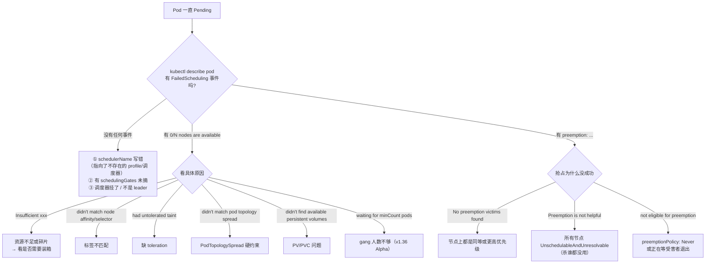

# 实战 Demo

> 从零验证：查看默认配置 → 改装箱策略 → 多 profile → 抢占实测 → 拓扑打散 → **开启 v1.36 原生 gang 实测** → 排障。
>
> **版本基线：v1.36.3**。大部分实验用 kind 集群 + 假 GPU 即可完成（无需真实 GPU）。

---

## 0. 准备环境

### 0.1 用 kind 起一个多节点集群

```bash
cat > kind-cluster.yaml <<'EOF'
kind: Cluster
apiVersion: kind.x-k8s.io/v1alpha4
nodes:
- role: control-plane
- role: worker
- role: worker
- role: worker
- role: worker
EOF

kind create cluster --name sched-lab --image kindest/node:v1.36.3 --config kind-cluster.yaml
kubectl get nodes
```

### 0.2 没有 GPU？用扩展资源模拟

调度器只认 `node.status.capacity` 里的数字，可以直接 patch 假 GPU：

```bash
for n in $(kubectl get nodes -o name | grep worker | sed 's|node/||'); do
  kubectl proxy --port=8001 >/dev/null 2>&1 &
  PROXY=$!
  sleep 1
  curl -s --header "Content-Type: application/json-patch+json" \
    --request PATCH \
    --data '[{"op":"add","path":"/status/capacity/nvidia.com~1gpu","value":"8"}]' \
    "http://localhost:8001/api/v1/nodes/$n/status" >/dev/null
  kill $PROXY
  echo "patched $n"
done

kubectl get nodes -o custom-columns=NAME:.metadata.name,GPU:.status.capacity.'nvidia\.com/gpu'
# NAME                     GPU
# sched-lab-worker         8
# sched-lab-worker2        8
# ...
```

> 这样 kube-scheduler 会把它当真 GPU 参与 Filter/Score，行为与真实集群一致（只是 Pod 里没有真设备，用 `sleep` 占位即可）。

### 0.3 看当前生效的调度器配置

```bash
# kind / kubeadm 集群：调度器是静态 Pod
kubectl -n kube-system get pod -l component=kube-scheduler
docker exec sched-lab-control-plane cat /etc/kubernetes/manifests/kube-scheduler.yaml

# 查看默认插件与权重（不改配置的情况下）
kubectl -n kube-system logs -l component=kube-scheduler --tail=100 | head -40
```

**验证默认插件列表**最直接的方式是把日志级别提到 `--v=4`，启动时会打印每个扩展点启用的插件。

---

## 1. Demo A：改成 GPU 装箱

### 1.1 问题复现（默认打散）

```bash
# 提交 8 个单卡 Pod
for i in $(seq 1 8); do
kubectl apply -f - <<EOF
apiVersion: v1
kind: Pod
metadata: {name: single-gpu-$i}
spec:
  containers:
  - name: c
    image: registry.k8s.io/pause:3.10
    resources: {limits: {nvidia.com/gpu: 1}}
EOF
done

# 观察分布
kubectl get pod -o custom-columns=NAME:.metadata.name,NODE:.spec.nodeName | sort -k2
# 预期：4 台机器各 2 个 → 每台剩 6 卡
```

现在提交一个需要**整机 8 卡**的 Pod：

```bash
kubectl apply -f - <<'EOF'
apiVersion: v1
kind: Pod
metadata: {name: full-node-gpu}
spec:
  containers:
  - name: c
    image: registry.k8s.io/pause:3.10
    resources: {limits: {nvidia.com/gpu: 8}}
EOF

kubectl describe pod full-node-gpu | tail -6
# Events:
#   Warning  FailedScheduling  ...  0/5 nodes are available:
#     1 node(s) had untolerated taint {node-role.kubernetes.io/control-plane: },
#     4 Insufficient nvidia.com/gpu.        ← ★ 碎片导致装不下
```

**这就是 04 篇 §2.1 说的碎片问题**：8 卡的资源明明还剩 24 张，但没有任何一台机器能凑出 8 卡。

### 1.2 改配置

```bash
kubectl delete pod --all
```

在控制面节点上写调度器配置：

```bash
docker exec sched-lab-control-plane bash -c 'cat > /etc/kubernetes/sched-config.yaml <<EOF
apiVersion: kubescheduler.config.k8s.io/v1
kind: KubeSchedulerConfiguration
clientConnection:
  kubeconfig: /etc/kubernetes/scheduler.conf
profiles:
- schedulerName: default-scheduler
  pluginConfig:
  - name: NodeResourcesFit
    args:
      scoringStrategy:
        type: MostAllocated              # ★ 装箱
        resources:
        - name: nvidia.com/gpu
          weight: 10                     # GPU 主导打分
        - name: cpu
          weight: 1
        - name: memory
          weight: 1
  plugins:
    score:
      enabled:
      - name: NodeResourcesFit
        weight: 10                       # ★ 提高插件整体权重
      disabled:
      - name: NodeResourcesBalancedAllocation   # ★ 与装箱冲突，关掉
EOF'
```

修改静态 Pod 清单挂载这个配置：

```bash
docker exec sched-lab-control-plane bash -c '
  sed -i "s|- --authentication-kubeconfig=|- --config=/etc/kubernetes/sched-config.yaml\n    - --authentication-kubeconfig=|" \
    /etc/kubernetes/manifests/kube-scheduler.yaml'

# 等 kubelet 重启静态 Pod
sleep 20
kubectl -n kube-system get pod -l component=kube-scheduler
kubectl -n kube-system logs -l component=kube-scheduler | grep -i "MostAllocated\|scoringStrategy" | head
```

> `--config` 与 `--policy-config-file` 互斥，且用了 `--config` 后命令行上的 `--percentage-of-nodes-to-score` 等参数会失效，都要写进配置文件。

### 1.3 验证装箱生效

```bash
for i in $(seq 1 8); do
kubectl apply -f - <<EOF
apiVersion: v1
kind: Pod
metadata: {name: bp-gpu-$i}
spec:
  containers:
  - name: c
    image: registry.k8s.io/pause:3.10
    resources: {limits: {nvidia.com/gpu: 1}}
EOF
sleep 1     # 串行提交，让每个 Pod 看到前一个的结果
done

kubectl get pod -o custom-columns=NAME:.metadata.name,NODE:.spec.nodeName | sort -k2
# 预期：前 8 个全在同一台机器上 → 其余 3 台完整空闲

# 现在整机 8 卡 Pod 能调度成功
kubectl apply -f - <<'EOF'
apiVersion: v1
kind: Pod
metadata: {name: full-node-gpu}
spec:
  containers:
  - name: c
    image: registry.k8s.io/pause:3.10
    resources: {limits: {nvidia.com/gpu: 8}}
EOF
kubectl get pod full-node-gpu -o wide     # Running ✅
```

> 提交时 `sleep 1` 是必要的：调度周期串行但绑定异步，批量瞬时提交时后面的 Pod 可能在前面的 Pod 还没 assume 完就开始调度。生产上无需担心（Pod 创建本身有间隔），但实验里要控制。

---

## 2. Demo B：多 profile 分流

不改全局策略，只给 GPU 负载一套装箱策略：

```yaml
# sched-config.yaml
apiVersion: kubescheduler.config.k8s.io/v1
kind: KubeSchedulerConfiguration
clientConnection:
  kubeconfig: /etc/kubernetes/scheduler.conf
profiles:
- schedulerName: default-scheduler        # 普通负载：默认打散
- schedulerName: gpu-binpack              # ★ GPU 负载：装箱
  pluginConfig:
  - name: NodeResourcesFit
    args:
      scoringStrategy:
        type: MostAllocated
        resources:
        - {name: nvidia.com/gpu, weight: 10}
  plugins:
    score:
      disabled:
      - name: NodeResourcesBalancedAllocation
```

> 这里**故意只列 `nvidia.com/gpu`**：`resources` 是整体替换默认值（`{cpu:1, memory:1}`）而非追加，所以这个 profile 的打分完全由 GPU 主导，CPU / 内存不参与。GPU 专用池通常正是想要这个效果 —— 但如果这批节点还要混跑 CPU 负载，就要把 cpu / memory 一并列出来。

使用：

```yaml
apiVersion: v1
kind: Pod
metadata: {name: gpu-job}
spec:
  schedulerName: gpu-binpack             # ★ 选 profile
  containers:
  - name: c
    image: registry.k8s.io/pause:3.10
    resources: {limits: {nvidia.com/gpu: 2}}
```

验证归属：

```bash
kubectl -n kube-system logs -l component=kube-scheduler | grep gpu-binpack
# 指标里也能按 profile 区分
kubectl get --raw /metrics 2>/dev/null | grep 'scheduler_schedule_attempts_total' | head
# scheduler_schedule_attempts_total{profile="gpu-binpack",result="scheduled"} 3
```

> **同一个进程、同一份 Cache 和队列**，只是插件配置不同。比部署第二个调度器省资源，也不会有双调度器竞争同一 Pod 的问题。

---

## 3. Demo C：抢占实测

### 3.1 准备优先级

```yaml
apiVersion: scheduling.k8s.io/v1
kind: PriorityClass
metadata: {name: low-prio}
value: 100
globalDefault: false
---
apiVersion: scheduling.k8s.io/v1
kind: PriorityClass
metadata: {name: high-prio}
value: 100000
globalDefault: false
---
apiVersion: scheduling.k8s.io/v1
kind: PriorityClass
metadata: {name: never-preempt}
value: 90000
preemptionPolicy: Never                  # ★ 我优先级高，但我不抢别人
globalDefault: false
```

### 3.2 填满集群

```bash
kubectl delete pod --all
for i in $(seq 1 4); do
kubectl apply -f - <<EOF
apiVersion: v1
kind: Pod
metadata: {name: victim-$i, labels: {role: victim}}
spec:
  priorityClassName: low-prio
  terminationGracePeriodSeconds: 30      # 便于观察优雅退出
  containers:
  - name: c
    image: registry.k8s.io/pause:3.10
    resources: {limits: {nvidia.com/gpu: 8}}
EOF
done
kubectl get pod -l role=victim -o wide   # 4 台 worker 各占满 8 卡
```

### 3.3 触发抢占

```bash
kubectl apply -f - <<'EOF'
apiVersion: v1
kind: Pod
metadata: {name: preemptor}
spec:
  priorityClassName: high-prio
  containers:
  - name: c
    image: registry.k8s.io/pause:3.10
    resources: {limits: {nvidia.com/gpu: 8}}
EOF

# 立刻观察（抢占是跨轮的，动作很快）
kubectl get events --sort-by=.lastTimestamp | grep -iE 'preempt|Killing' | tail -6
# Normal   Preempted   pod/victim-2   Preempted by preemptor on node sched-lab-worker2
# Normal   Killing     pod/victim-2   Stopping container c

# ★ 关键：抢占者会先拿到 nominatedNodeName，但此时还没 Running
kubectl get pod preemptor -o jsonpath='{.status.nominatedNodeName}{"\n"}{.status.phase}{"\n"}'
# sched-lab-worker2
# Pending                              ← ★ 本轮还没调度成功（03 篇 §4.1 第 ⑤ 步）

sleep 35    # 等受害者优雅退出
kubectl get pod preemptor -o wide       # Running ✅
kubectl get pod -l role=victim          # 少了一个
```

**观察到的行为完全对应 03 篇 §4.1 的五步**：受害者被 Delete → 抢占者拿到 `nominatedNodeName` → 本轮返回 `Unschedulable` → 下一轮（受害者真正退出后）才 Bind。

### 3.4 验证 preemptionPolicy: Never

```bash
kubectl delete pod preemptor
kubectl apply -f - <<'EOF'
apiVersion: v1
kind: Pod
metadata: {name: no-preempt-pod}
spec:
  priorityClassName: never-preempt       # 优先级 90000 > victim 的 100
  containers:
  - name: c
    image: registry.k8s.io/pause:3.10
    resources: {limits: {nvidia.com/gpu: 8}}
EOF

kubectl describe pod no-preempt-pod | tail -5
# Warning  FailedScheduling  ...  0/5 nodes are available: 4 Insufficient nvidia.com/gpu.
#   ★ 注意：没有 "preemption: ..." 那一段 —— PodEligibleToPreemptOthers 直接否决了
```

### 3.5 验证 PDB 影响受害者选择

```bash
kubectl delete pod --all
# 起两个 Deployment，一个有 PDB 保护
kubectl create deployment protected --image=registry.k8s.io/pause:3.10 --replicas=2
kubectl create deployment unprotected --image=registry.k8s.io/pause:3.10 --replicas=2
kubectl patch deploy protected --type=json -p='[{"op":"add","path":"/spec/template/spec/containers/0/resources","value":{"limits":{"nvidia.com/gpu":"8"}}}]'
kubectl patch deploy unprotected --type=json -p='[{"op":"add","path":"/spec/template/spec/containers/0/resources","value":{"limits":{"nvidia.com/gpu":"8"}}}]'

kubectl create poddisruptionbudget protected-pdb --selector=app=protected --min-available=2
sleep 10

# 抢占时优先杀 unprotected（pickOneNodeForPreemption 规则 1：PDB 违反数最少）
kubectl apply -f - <<'EOF'
apiVersion: v1
kind: Pod
metadata: {name: pdb-preemptor}
spec:
  priorityClassName: high-prio
  containers:
  - name: c
    image: registry.k8s.io/pause:3.10
    resources: {limits: {nvidia.com/gpu: 8}}
EOF

kubectl get events --sort-by=.lastTimestamp | grep -i preempted | tail -3
# 预期：被抢的是 unprotected-xxx
```

---

## 4. Demo D：拓扑打散（推理副本）

```bash
# 给节点打 zone 标签
kubectl label node sched-lab-worker  sched-lab-worker2 topology.kubernetes.io/zone=zone-a --overwrite
kubectl label node sched-lab-worker3 sched-lab-worker4 topology.kubernetes.io/zone=zone-b --overwrite
kubectl delete pod --all; kubectl delete deploy --all
```

```yaml
apiVersion: apps/v1
kind: Deployment
metadata: {name: vllm-serve}
spec:
  replicas: 4
  selector: {matchLabels: {app: vllm}}
  template:
    metadata: {labels: {app: vllm}}
    spec:
      topologySpreadConstraints:
      - maxSkew: 1
        topologyKey: topology.kubernetes.io/zone
        whenUnsatisfiable: DoNotSchedule       # ★ 硬约束：zone 间必须均衡
        labelSelector: {matchLabels: {app: vllm}}
      - maxSkew: 1
        topologyKey: kubernetes.io/hostname
        whenUnsatisfiable: ScheduleAnyway      # 软约束：尽量每台一个
        labelSelector: {matchLabels: {app: vllm}}
      containers:
      - name: vllm
        image: registry.k8s.io/pause:3.10
        resources: {limits: {nvidia.com/gpu: 2}}
```

```bash
kubectl apply -f serve.yaml
kubectl get pod -l app=vllm -o custom-columns=\
NAME:.metadata.name,NODE:.spec.nodeName --no-headers | \
while read n node; do echo "$n $node $(kubectl get node $node -o jsonpath='{.metadata.labels.topology\.kubernetes\.io/zone}')"; done
# 预期：zone-a 2 个，zone-b 2 个，且尽量分散在 4 台机器
```

**验证硬约束会拒绝调度**：

```bash
kubectl scale deploy vllm-serve --replicas=5
kubectl get pod -l app=vllm | grep Pending
kubectl describe pod $(kubectl get pod -l app=vllm -o name | tail -1) | tail -4
# Warning  FailedScheduling  ...  didn't match pod topology spread constraints
#   ★ 第 5 个副本会让某个 zone 的 skew 变成 2 > maxSkew=1
```

---

## 5. Demo E：开启 v1.36 原生 gang（实验）

⚠️ **Alpha 特性，仅用于学习验证，不要在生产开启。**

### 5.1 开 feature gates

需要同时开 `GenericWorkload`（基础 API）和 `GangScheduling`，且要在 **apiserver 和 scheduler 两侧**都开：

```bash
docker exec sched-lab-control-plane bash -c '
  # apiserver：开 API + 启用 v1alpha2
  sed -i "s|- --allow-privileged=true|- --allow-privileged=true\n    - --feature-gates=GenericWorkload=true,GangScheduling=true\n    - --runtime-config=scheduling.k8s.io/v1alpha2=true|" \
    /etc/kubernetes/manifests/kube-apiserver.yaml'

docker exec sched-lab-control-plane bash -c '
  sed -i "s|- --leader-elect=true|- --leader-elect=true\n    - --feature-gates=GenericWorkload=true,GangScheduling=true|" \
    /etc/kubernetes/manifests/kube-scheduler.yaml'

sleep 60
kubectl api-resources | grep -i podgroup
# podgroups   pg   scheduling.k8s.io/v1alpha2   true   PodGroup
```

验证插件被启用（对应 00 篇 §7 的 `applyGangScheduling`）：

```bash
kubectl -n kube-system logs -l component=kube-scheduler | grep -i gangscheduling | head -3
```

### 5.2 提交一个 gang

```yaml
apiVersion: scheduling.k8s.io/v1alpha2
kind: PodGroup
metadata: {name: pretrain-t}
spec:
  schedulingPolicy:
    gang:
      minCount: 4                      # ★ 4 个 Pod 必须一起
```

```bash
kubectl apply -f podgroup.yaml

# 先只创建 2 个 Pod（不够 minCount）
for i in 1 2; do
kubectl apply -f - <<EOF
apiVersion: v1
kind: Pod
metadata: {name: gang-pod-$i, labels: {group: pretrain-t}}
spec:
  schedulingGroup:
    podGroupName: pretrain-t           # ★ 声明归属（不可变）
  containers:
  - name: c
    image: registry.k8s.io/pause:3.10
    resources: {limits: {nvidia.com/gpu: 2}}
EOF
done

kubectl get pod -l group=pretrain-t
# 预期：都是 Pending

kubectl describe pod gang-pod-1 | tail -4
# Warning  FailedScheduling  ...  waiting for minCount pods from a gang to appear in scheduling queue
#   ★ 这条消息来自 GangScheduling.PreEnqueue（00 篇 §6.3）
```

### 5.3 补齐后一起放行

```bash
for i in 3 4; do
kubectl apply -f - <<EOF
apiVersion: v1
kind: Pod
metadata: {name: gang-pod-$i, labels: {group: pretrain-t}}
spec:
  schedulingGroup: {podGroupName: pretrain-t}
  containers:
  - name: c
    image: registry.k8s.io/pause:3.10
    resources: {limits: {nvidia.com/gpu: 2}}
EOF
done

kubectl get pod -l group=pretrain-t -w
# 预期：4 个几乎同时变 Running（Permit 达到 quorum 后一起 Allow）

# PodGroup 状态
kubectl get pg pretrain-t -o jsonpath='{.status.conditions}' | jq
# [{"type":"Scheduled","status":"True","reason":"Scheduled",...}]
#   ★ 由 updatePodGroupCondition 写入（00 篇 §6.2）
```

### 5.4 验证 Permit 会占资源（重要）

这是 04 篇 §4.3 说的架构性短板，可以实测：

```bash
kubectl delete pod -l group=pretrain-t; kubectl delete pg --all
sleep 5

# 建一个永远凑不齐的 gang（minCount=10，但集群只放得下 4 个 8 卡 Pod）
kubectl apply -f - <<'EOF'
apiVersion: scheduling.k8s.io/v1alpha2
kind: PodGroup
metadata: {name: too-big}
spec:
  schedulingPolicy: {gang: {minCount: 10}}
EOF

for i in $(seq 1 10); do
kubectl apply -f - <<EOF
apiVersion: v1
kind: Pod
metadata: {name: big-$i, labels: {group: too-big}}
spec:
  schedulingGroup: {podGroupName: too-big}
  containers:
  - name: c
    image: registry.k8s.io/pause:3.10
    resources: {limits: {nvidia.com/gpu: 4}}
EOF
done

# 观察：部分 Pod 会进入 Permit Wait 状态，占着缓存里的资源
kubectl -n kube-system logs -l component=kube-scheduler | grep -i "Quorum is not met" | tail -3
# "Quorum is not met for a gang. Waiting for another pod to allow" activatedPods=...

# ★ 这期间提交一个普通 Pod，会发现资源被"隐形"占用
kubectl apply -f - <<'EOF'
apiVersion: v1
kind: Pod
metadata: {name: innocent}
spec:
  containers:
  - name: c
    image: registry.k8s.io/pause:3.10
    resources: {limits: {nvidia.com/gpu: 4}}
EOF
kubectl describe pod innocent | tail -3
# 可能 Insufficient nvidia.com/gpu —— 卡被挂起等待的 gang Pod 占着

# 5 分钟后 permitTimeoutDuration 到期才释放
```

**对比 Volcano**：同样场景下 Volcano 会 `stmt.Discard()` 立即回滚，资源马上可用。这就是「Permit 型 gang」与「事务型 gang」的实质差别。

清理：

```bash
kubectl delete pod --all; kubectl delete pg --all
```

---

## 6. 排障手册

### 6.1 分层定位



### 6.2 常用命令

```bash
# —— Pod 视角（90% 的问题）——
kubectl describe pod <pod> | tail -20              # ★ 首选
kubectl get pod <pod> -o jsonpath='{.status.nominatedNodeName}'   # 抢占提名
kubectl get pod <pod> -o jsonpath='{.spec.schedulingGates}'       # 门控
kubectl get pod <pod> -o jsonpath='{.spec.schedulerName}'         # 归属调度器

# —— 事件（按时间）——
kubectl get events --sort-by=.lastTimestamp -A | grep -iE 'FailedScheduling|Preempted|Scheduled'

# —— 调度器日志 ——
kubectl -n kube-system logs -l component=kube-scheduler --tail=200
# 单个 Pod 的完整决策链
kubectl -n kube-system logs -l component=kube-scheduler | grep <pod-name>
# 慢调度（>100ms 的 trace，对应 03 篇 §1）
kubectl -n kube-system logs -l component=kube-scheduler | grep -A6 '"Scheduling" '

# —— 日志级别 ——
# --v=2  基本决策
# --v=4  每个扩展点启用的插件、每个 Pod 的尝试
# --v=5  节点级过滤/打分明细（★ 排障主力，但很吵）
# --v=10 Placement 打分明细（v1.36 workload-aware）

# —— 指标 ——
kubectl -n kube-system port-forward pod/<scheduler-pod> 10259:10259 &
curl -sk https://localhost:10259/metrics | grep -E '^scheduler_(pending_pods|schedule_attempts|unschedulable)'
```

### 6.3 日志关键行对照

`--v=5` 下能看到与 01~03 篇对应的完整链路：

```text
"About to try and schedule pod"                        ← scheduleOnePod 入口
"Attempting to schedule pod"
"Scheduling" ... Computing predicates done ... Prioritizing done   ← trace（>100ms）
"Plugin scored node for pod" plugin=... score=...      ← Score 明细（V(10)）
"Calculated node's final score for pod" score=...      ← 加权求和结果
"Attempting to bind pod to node"
"Successfully bound pod to node"

# 失败路径
"Unable to schedule pod; no fit; waiting"
"No PostFilter plugins are registered, so no preemption will be performed"
"Status after running PostFilter plugins for pod"      ← 抢占结果
"Pod is not eligible for preemption" reason=...        ← PodEligibleToPreemptOthers

# v1.36 workload-aware
"Attempting to schedule pod group"
"Running a pod group scheduling algorithm" unscheduledPodsCount=...
"Quorum is not met for a gang. Waiting for another pod to allow"
"Quorum is met for a gang. Allowing other pods from a gang waiting on permit"
"Successfully scheduled a pod group" scheduledPods=... unschedulablePods=...
"Assuming placement in snapshot" placement=...          ← Placement 机制
```

### 6.4 高频问题速查

| 现象 | 原因 | 处理 |
|------|------|------|
| Pod Pending 且**无任何事件** | `schedulerName` 指向不存在的调度器；或有 scheduling gate | 检查 `spec.schedulerName` / `spec.schedulingGates` |
| `Insufficient nvidia.com/gpu` 但总量够 | **碎片**（默认 LeastAllocated 打散） | 改 `MostAllocated`（Demo A） |
| 大作业总是起不来，小作业能起 | 无 gang，被小作业蚕食 | 上 Volcano / Kueue |
| `scheduler_pod_scheduling_attempts` p99 很高 | 反复重试（通常是 gang 缺失） | 同上 |
| 抢占杀了 Pod 但抢占者还是没起来 | 单 Pod 视角抢占 / 被别人插队 | 上 Volcano（Pipelined）或 Kueue |
| 改了配置没生效 | 静态 Pod 没重启；或用了 `--config` 后命令行参数失效 | 检查 Pod 重启时间与配置挂载 |
| 调度延迟高（p99 > 1s） | 节点多 + 插件重（如 InterPodAffinity 全量扫） | 调 `percentageOfNodesToScore`、`parallelism`；减少反亲和 |
| 自定义插件的 Pod 长期不重试 | 没实现 `EventsToRegister`，只能靠 5min 兜底 | 实现 QueueingHint（02 篇 §2） |
| `PodTopologySpread` 导致大量 Pending | `whenUnsatisfiable: DoNotSchedule` 太严 | 改 `ScheduleAnyway` 或放宽 `maxSkew` |
| DRA Pod 卡在 Pending | ResourceSlice 未上报 / DeviceClass 不存在 | `kubectl get resourceslices,deviceclasses` |
| gang Pod 挂起占资源不放 | Permit 型 gang 的固有问题 | 等 5min 超时；生产用 Volcano |

### 6.5 性能观测（PromQL）

```promql
# 调度延迟 p99
histogram_quantile(0.99, sum(rate(scheduler_scheduling_attempt_duration_seconds_bucket[5m])) by (le, profile))

# 各队列深度
scheduler_pending_pods

# 调度成功率
sum(rate(scheduler_schedule_attempts_total{result="scheduled"}[5m]))
  / sum(rate(scheduler_schedule_attempts_total[5m]))

# 单 Pod 平均尝试次数（★ gang 缺失的信号）
histogram_quantile(0.99, sum(rate(scheduler_pod_scheduling_attempts_bucket[10m])) by (le))

# 最慢的插件
topk(5, sum(rate(scheduler_plugin_execution_duration_seconds_sum[5m])) by (plugin, extension_point)
       / sum(rate(scheduler_plugin_execution_duration_seconds_count[5m])) by (plugin, extension_point))

# QueueingHint 是否有效（兜底唤醒占比越低越好）
sum(rate(scheduler_queue_incoming_pods_total{event="UnschedulableTimeout"}[10m]))
  / sum(rate(scheduler_queue_incoming_pods_total[10m]))

# 抢占规模
rate(scheduler_preemption_attempts_total[5m])
histogram_quantile(0.9, rate(scheduler_preemption_victims_bucket[10m]))
```

---

## 7. 一页速查表

```text
# —— 配置文件骨架（KubeSchedulerConfiguration v1）——
apiVersion: kubescheduler.config.k8s.io/v1
kind: KubeSchedulerConfiguration
parallelism: 16                       # Filter/Score 并行度
percentageOfNodesToScore: 0           # 0 = 自适应（50 - N/125，下限 5%，节点下限 100）
podInitialBackoffSeconds: 1           # 初始退避
podMaxBackoffSeconds: 10              # 最大退避（★ 只有 10s）
profiles:
- schedulerName: default-scheduler
  plugins:
    <extensionPoint>:
      enabled:  [{name: X, weight: N}]
      disabled: [{name: Y}]           # "*" = 全关
  pluginConfig:
  - name: NodeResourcesFit
    args:
      scoringStrategy:
        type: LeastAllocated|MostAllocated|RequestedToCapacityRatio
        resources: [{name: nvidia.com/gpu, weight: 10}]
  - name: DefaultPreemption
    args:
      minCandidateNodesPercentage: 10
      minCandidateNodesAbsolute: 100
  - name: PodTopologySpread
    args:
      defaultingType: System|List

# —— 默认 Score 权重 ——
TaintToleration 3 | NodeAffinity 2 | PodTopologySpread 2 | InterPodAffinity 2
NodeResourcesFit 1 | NodeResourcesBalancedAllocation 1 | ImageLocality 1
（DynamicResources 2，开 DRA 时插在 DefaultPreemption 之前）

# —— Pod 侧可用旋钮 ——
spec.schedulerName                    # 选 profile / 选调度器（volcano 等）
spec.priorityClassName                # 优先级 + preemptionPolicy
spec.nodeSelector / affinity          # 硬/软亲和
spec.tolerations                      # 污点容忍
spec.topologySpreadConstraints        # 拓扑打散
spec.schedulingGates                  # 门控（PreEnqueue 拦截）
spec.resourceClaims                   # DRA（v1.35 GA）
spec.schedulingGroup.podGroupName     # ★ v1.36 Alpha：gang

# —— 三个 Status 语义（写插件必记）——
Unschedulable                  → 还会跑 PostFilter（抢占可能有用）
UnschedulableAndUnresolvable   → 跳过 PostFilter（抢占没用）
Pending                        → 调度成功但暂停，免退避直接回 activeQ

# —— 排障三连 ——
kubectl describe pod <pod> | tail -20
kubectl -n kube-system logs -l component=kube-scheduler | grep <pod>
curl -sk https://localhost:10259/metrics | grep scheduler_pending_pods
```

---

回到 [00 总览](00-kube-scheduler总览与架构.md) ｜ 上一篇 [04 能力与局限](04-面向大模型场景的能力与局限.md) ｜ 下一篇 [06 自定义调度插件开发](06-扩展实战-自定义调度插件开发.md)
｜ 对比阅读 [Volcano 系列](../volcano/00-Volcano总览与架构.md) · [Kueue 系列](../kueue/00-Kueue总览与架构.md)
