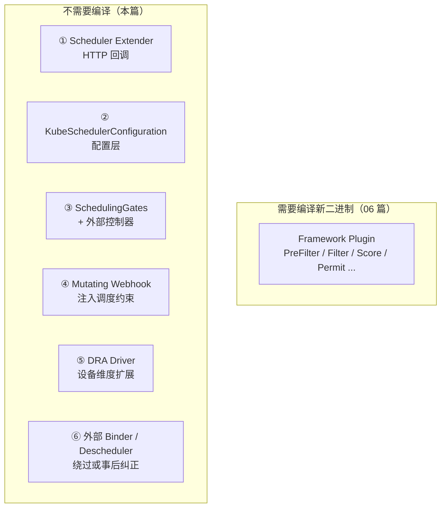
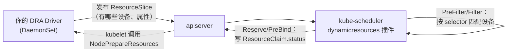
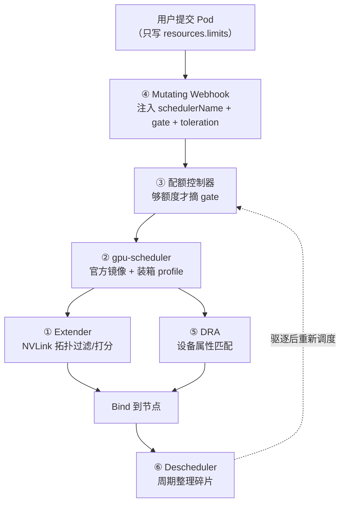
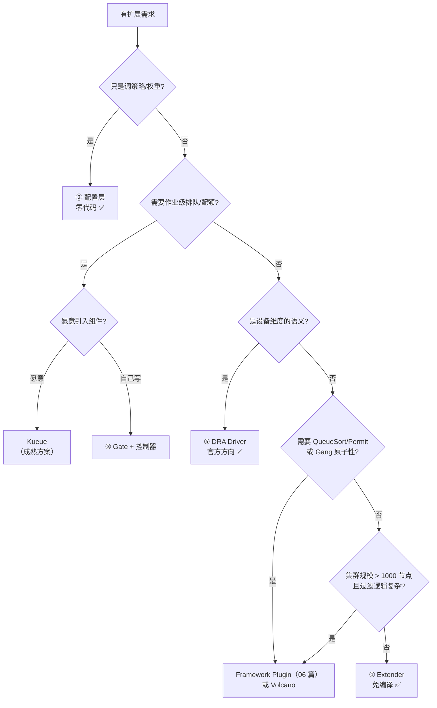

# 免编译扩展：不改 kube-scheduler 二进制的六种扩展方式

> [06 篇](06-扩展实战-自定义调度插件开发.md) 讲的是 **Framework 插件** —— 虽然是 out-of-tree（自己的仓库、自己的 `main.go`），但本质上**你要编译出一个新的 scheduler 二进制并替换/并存部署**。
>
> 本篇讲另一条路：**完全不碰调度器二进制**，用官方发布的 `registry.k8s.io/kube-scheduler:v1.36.3` 原封不动跑，靠外部手段扩展。
>
> 这是很多团队真正需要的方式 —— 不接管调度器的运维责任、不跟随 K8s 版本重新编译、出问题可独立回滚。
>
> 源码基线：**v1.36.3**

---

## 1. 先把两条路分清楚



| | Framework Plugin（06 篇） | 免编译扩展（本篇） |
|--|--------------------------|-------------------|
| 交付物 | 新的 scheduler 二进制 + 镜像 | Deployment / Webhook / 配置文件 |
| 跟随 K8s 升级 | **每次都要重编译、对齐依赖** | 无感（Extender 协议极稳定） |
| 运维责任 | 你负责整个调度器的可用性 | 官方镜像照常，你只管自己的组件 |
| 能力上限 | 完整（15 个扩展点） | **有限**（见 §2 对照表） |
| 性能 | 进程内调用，微秒级 | Extender 有 HTTP 往返开销 |
| 故障影响 | 调度器崩了全集群不调度 | `ignorable: true` 时可降级 |
| 调试难度 | 要复现整个调度器环境 | 独立服务，可单独 curl 测试 |

**一句话选择建议**：

- 只是想调策略（装箱/打散/权重）→ **② 配置层**，不用写代码
- 需要「作业级排队 / 配额」→ **③ SchedulingGates**（这就是 Kueue 的做法）
- 需要自定义节点过滤/打分，且能接受 HTTP 延迟 → **① Extender**
- 需要新设备类型（GPU/FPGA/NIC）的调度语义 → **⑤ DRA Driver**
- 需要极致性能或复杂状态（gang、拓扑树）→ 回到 **Framework Plugin**

---

## 2. 能力对照：免编译方式的天花板

| 我想做 | Extender | 配置层 | SchedulingGates | Webhook | DRA | 需要 Plugin |
|--------|:--------:|:-----:|:---------------:|:-------:|:---:|:----------:|
| 过滤节点 | ✅ | 部分（启停插件） | ❌ | 间接（注入 affinity） | ✅（设备维度） | |
| 给节点打分 | ✅ | ✅（改权重/策略） | ❌ | ❌ | ❌ | |
| 改调度顺序 | ❌ | ❌ | 部分（控制放行顺序） | ❌ | ❌ | ✅ QueueSort |
| 阻止 Pod 被调度 | ❌ | ❌ | ✅ | ✅（注入 gate） | ❌ | |
| 作业级配额/排队 | ❌ | ❌ | ✅ | ✅（配合） | ❌ | |
| Gang 调度 | ❌ | ❌ | 近似（见 §5.3） | ❌ | ❌ | ✅ Permit |
| 自定义抢占 | ✅（`preemptVerb`） | ❌ | ❌ | ❌ | ❌ | |
| 接管绑定 | ✅（`bindVerb`） | ❌ | ❌ | ❌ | ❌ | ✅ Bind |
| 预计算跨节点复用 | ❌（每次全量传） | ❌ | ❌ | ❌ | ❌ | ✅ PreFilter |
| 新设备类型语义 | 勉强 | ❌ | ❌ | ❌ | ✅ | |
| 事后纠正放置 | ❌ | ❌ | ❌ | ❌ | ❌ | ⑥ Descheduler |

**两个硬性限制**要提前知道：

1. **Extender 没有 `QueueSort` / `Permit` / `Reserve` 等价物**。所以「排序」和「成组等待」这两类需求，免编译方案做不了（只能用 ③ 近似）。
2. **Extender 每次调用都传完整节点列表**（除非开 `nodeCacheCapable`），没有 `CycleState` 那样的跨阶段缓存。大集群下这是主要瓶颈。

---

## 3. 扩展点 ①：Scheduler Extender（HTTP 回调）

这是**唯一真正意义上的「原生调度器插件」** —— kube-scheduler 通过 HTTP 回调你的服务。

### 3.1 四个可扩展的动作

`pkg/scheduler/apis/config/types.go`：

```go
type Extender struct {
    URLPrefix      string          // 你的服务地址
    FilterVerb     string          // 过滤：URLPrefix + "/" + FilterVerb
    PrioritizeVerb string          // 打分
    PreemptVerb    string          // 抢占
    BindVerb       string          // 绑定（★ 全局只能有一个 extender 实现）
    Weight         int64           // 打分权重
    EnableHTTPS    bool
    TLSConfig      *ExtenderTLSConfig
    HTTPTimeout    metav1.Duration // ★ Filter 超时 = 调度失败；Prioritize 超时被忽略
    NodeCacheCapable bool          // 你自己缓存节点信息，调度器只传节点名
    ManagedResources []ExtenderManagedResource  // ★ 只有请求这些资源的 Pod 才回调
    Ignorable      bool            // ★ 你挂了要不要影响调度
}
```

**四个字段决定生产可用性**，逐个说清：

| 字段 | 不配的后果 | 建议 |
|------|-----------|------|
| `managedResources` | **每个 Pod 都回调你**，包括系统组件 —— 调度吞吐直接腰斩 | 必配。声明你关心的扩展资源 |
| `ignorable` | 你的服务挂了/超时 → **全集群 Pod 调度失败** | 非核心逻辑一律 `true` |
| `httpTimeout` | 默认可能过长，Filter 阶段串行阻塞调度周期 | 建议 100~500ms |
| `nodeCacheCapable` | 每次传全量 `v1.NodeList`，5000 节点约几十 MB JSON | 大集群必开 |

`managedResources` 的过滤逻辑（`IsInterested`）：

```go
// findNodesThatPassExtenders
for _, extender := range extenders {
    if len(feasibleNodes) == 0 { break }
    if !extender.IsInterested(pod) { continue }   // ★ 不请求 managedResources 就跳过
    ...
}
```

配套的 `ignoredByScheduler` 很有用：

```yaml
managedResources:
- name: example.com/foo
  ignoredByScheduler: true    # kube-scheduler 不检查这个资源的容量，完全交给你
```

这让你可以定义**调度器根本不认识的资源维度**（比如「模型副本槽位」「许可证数量」），由 extender 自己算。

### 3.2 HTTP 协议

请求/响应类型在 `staging/src/k8s.io/kube-scheduler/extender/v1/types.go`（这个包很稳定，多年没大改）：

```go
// 请求（Filter 与 Prioritize 共用）
type ExtenderArgs struct {
    Pod       *v1.Pod
    Nodes     *v1.NodeList   // nodeCacheCapable=false 时填这个
    NodeNames *[]string      // nodeCacheCapable=true  时填这个
}

// Filter 响应
type ExtenderFilterResult struct {
    Nodes                      *v1.NodeList
    NodeNames                  *[]string
    FailedNodes                FailedNodesMap   // → Unschedulable（可抢占）
    FailedAndUnresolvableNodes FailedNodesMap   // → UnschedulableAndUnresolvable（不抢占）
    Error                      string
}

// Prioritize 响应
type HostPriority struct {
    Host  string
    Score int64            // ★ 值域 0~10，不是 0~100
}
type HostPriorityList []HostPriority
```

**两个必须记住的细节**：

**① 打分值域是 0~10，框架会自己换算**：

```go
// pkg/scheduler/schedule_one.go
// MaxExtenderPriority may diverge from the max priority used in the scheduler and defined by MaxNodeScore,
// therefore we need to scale the score returned by extenders to the score range used by the scheduler.
finalscore := score * weight * (fwk.MaxNodeScore / extenderv1.MaxExtenderPriority)
```

`MaxExtenderPriority = 10`，`MaxNodeScore = 100`，所以 **实际贡献 = 你的分 × weight × 10**。返回 8 分 + `weight: 5` → 贡献 400 分，比所有内置插件加起来（最高 1200）的三分之一还多。**权重要谨慎给。**

**② 两个失败 map 的区别就是抢占语义**（对应 [01 篇 §2](01-核心原理-调度周期与扩展点.md) 的 Status Code）：

```go
for failedNodeName, failedMsg := range failedAndUnresolvableMap {
    statuses.Set(failedNodeName, fwk.NewStatus(fwk.UnschedulableAndUnresolvable, failedMsg))
}
for failedNodeName, failedMsg := range failedMap {
    if _, found := failedAndUnresolvableMap[failedNodeName]; found {
        continue      // failedAndUnresolvableMap 优先
    }
    statuses.Set(failedNodeName, fwk.NewStatus(fwk.Unschedulable, failedMsg))
}
```

源码注释还给了一条配置建议：*"users are recommended to configure the extenders that may return UnschedulableAndUnresolvable status ahead of others"* —— 会返回不可解决状态的 extender 配在前面，让后面的 extender 少做无用功。

### 3.3 Demo：GPU 拓扑感知 Extender

**需求**：Pod 请求 4 卡时，要求这 4 卡在同一 NVLink 域内（否则 TP 通信走 PCIe，吞吐掉一半）。这个信息 kube-scheduler 不懂，但我们的 GPU 管理系统知道。

**服务端**（完整可运行）：

```go
// main.go
package main

import (
    "encoding/json"
    "fmt"
    "net/http"
    "os"
    "strings"

    v1 "k8s.io/api/core/v1"
    extenderv1 "k8s.io/kube-scheduler/extender/v1"
    "k8s.io/klog/v2"
)

const (
    gpuResource   = "nvidia.com/gpu"
    // 节点上由 GPU agent 维护的注解：每个 NVLink 域的空闲卡数，如 "0:4,1:2"
    nvlinkFreeAnn = "ai.example.com/nvlink-free"
    topologyLabel = "ai.example.com/require-nvlink"
)

func main() {
    http.HandleFunc("/healthz", func(w http.ResponseWriter, r *http.Request) {
        w.WriteHeader(http.StatusOK)
    })
    http.HandleFunc("/filter", handleFilter)
    http.HandleFunc("/prioritize", handlePrioritize)

    addr := ":8888"
    klog.InfoS("starting gpu-topology extender", "addr", addr)
    if err := http.ListenAndServe(addr, nil); err != nil {
        klog.ErrorS(err, "server exited")
        os.Exit(1)
    }
}

func handleFilter(w http.ResponseWriter, r *http.Request) {
    var args extenderv1.ExtenderArgs
    if err := json.NewDecoder(r.Body).Decode(&args); err != nil {
        writeJSON(w, &extenderv1.ExtenderFilterResult{Error: err.Error()})
        return
    }

    want := gpuRequestOf(args.Pod)
    needNVLink := args.Pod.Labels[topologyLabel] == "true"

    result := &extenderv1.ExtenderFilterResult{
        Nodes:                      &v1.NodeList{},
        FailedNodes:                extenderv1.FailedNodesMap{},
        FailedAndUnresolvableNodes: extenderv1.FailedNodesMap{},
    }

    for _, node := range args.Nodes.Items {
        if !needNVLink {
            result.Nodes.Items = append(result.Nodes.Items, node)
            continue
        }

        domains, ok := parseNVLinkFree(node.Annotations[nvlinkFreeAnn])
        if !ok {
            // 节点没上报拓扑信息 → 驱逐任何 Pod 都不会改变 → 不可解决
            result.FailedAndUnresolvableNodes[node.Name] =
                "node does not report NVLink topology"
            continue
        }

        if !fitsInOneDomain(domains, want) {
            // 当前碎片装不下，但驱逐别的 Pod 后可能可以 → 可解决，允许抢占
            result.FailedNodes[node.Name] = fmt.Sprintf(
                "no single NVLink domain has %d free GPUs (domains: %v)", want, domains)
            continue
        }
        result.Nodes.Items = append(result.Nodes.Items, node)
    }
    writeJSON(w, result)
}

func handlePrioritize(w http.ResponseWriter, r *http.Request) {
    var args extenderv1.ExtenderArgs
    if err := json.NewDecoder(r.Body).Decode(&args); err != nil {
        writeJSON(w, &extenderv1.HostPriorityList{})
        return
    }

    want := gpuRequestOf(args.Pod)
    var out extenderv1.HostPriorityList

    for _, node := range args.Nodes.Items {
        domains, _ := parseNVLinkFree(node.Annotations[nvlinkFreeAnn])
        // 找「装完后剩余最少」的域 → 减少碎片
        best := int64(-1)
        for _, free := range domains {
            if free >= want {
                remain := free - want
                if best == -1 || remain < best {
                    best = remain
                }
            }
        }
        // ★ 值域必须是 0~10
        var score int64
        switch {
        case best == 0:
            score = 10                  // 完美装满
        case best > 0 && best <= 10:
            score = 10 - best
        default:
            score = 0
        }
        out = append(out, extenderv1.HostPriority{Host: node.Name, Score: score})
    }
    writeJSON(w, &out)
}

// ---------- helpers ----------

func gpuRequestOf(pod *v1.Pod) int64 {
    var total int64
    for _, c := range pod.Spec.Containers {
        if q, ok := c.Resources.Limits[gpuResource]; ok {
            total += q.Value()
        }
    }
    return total
}

// "0:4,1:2" → {0:4, 1:2}
func parseNVLinkFree(s string) (map[int]int64, bool) {
    if s == "" {
        return nil, false
    }
    out := map[int]int64{}
    for _, part := range strings.Split(s, ",") {
        var domain int
        var free int64
        if _, err := fmt.Sscanf(part, "%d:%d", &domain, &free); err != nil {
            return nil, false
        }
        out[domain] = free
    }
    return out, true
}

func fitsInOneDomain(domains map[int]int64, want int64) bool {
    for _, free := range domains {
        if free >= want {
            return true
        }
    }
    return false
}

func writeJSON(w http.ResponseWriter, v interface{}) {
    w.Header().Set("Content-Type", "application/json")
    if err := json.NewEncoder(w).Encode(v); err != nil {
        klog.ErrorS(err, "failed to encode response")
    }
}
```

### 3.4 部署 Demo

**这是关键区别**：kube-scheduler 用官方镜像，只改它的配置文件。

**Step 1｜部署 extender 服务**

```yaml
# extender.yaml
apiVersion: apps/v1
kind: Deployment
metadata:
  name: gpu-topology-extender
  namespace: kube-system
spec:
  replicas: 2                            # 多副本，避免单点
  selector:
    matchLabels: {app: gpu-topology-extender}
  template:
    metadata:
      labels: {app: gpu-topology-extender}
    spec:
      containers:
      - name: extender
        image: registry.example.com/gpu-topology-extender:v0.1.0
        ports:
        - containerPort: 8888
        resources:
          requests: {cpu: 200m, memory: 256Mi}
          limits:   {cpu: "1",  memory: 512Mi}
        readinessProbe:
          httpGet: {path: /healthz, port: 8888}
          periodSeconds: 5
        livenessProbe:
          httpGet: {path: /healthz, port: 8888}
          periodSeconds: 10
---
apiVersion: v1
kind: Service
metadata:
  name: gpu-topology-extender
  namespace: kube-system
spec:
  selector: {app: gpu-topology-extender}
  ports:
  - port: 80
    targetPort: 8888
```

**Step 2｜改 scheduler 配置**

配置文件的挂载方式取决于你的集群类型：

<details>
<summary><b>方式 A：静态 Pod（kubeadm / 自建集群）</b></summary>

```bash
# 1. 写配置
sudo tee /etc/kubernetes/scheduler-extender-config.yaml <<'EOF'
apiVersion: kubescheduler.config.k8s.io/v1
kind: KubeSchedulerConfiguration
clientConnection:
  kubeconfig: /etc/kubernetes/scheduler.conf
extenders:
- urlPrefix: "http://gpu-topology-extender.kube-system.svc.cluster.local:80"
  filterVerb: "filter"
  prioritizeVerb: "prioritize"
  weight: 3
  enableHTTPS: false
  httpTimeout: 300ms                  # ★ Filter 超时会导致调度失败，给紧一点
  nodeCacheCapable: false             # 小集群可以 false；大集群务必 true
  ignorable: true                     # ★ extender 挂了不影响其他 Pod 调度
  managedResources:
  - name: nvidia.com/gpu              # ★ 只有请求 GPU 的 Pod 才回调
    ignoredByScheduler: false         # GPU 容量仍由 kube-scheduler 检查
EOF

# 2. 改静态 Pod manifest
sudo cp /etc/kubernetes/manifests/kube-scheduler.yaml /root/kube-scheduler.yaml.bak
```

在 `/etc/kubernetes/manifests/kube-scheduler.yaml` 中：

```yaml
spec:
  containers:
  - name: kube-scheduler
    image: registry.k8s.io/kube-scheduler:v1.36.3     # ★ 官方镜像，不动
    command:
    - kube-scheduler
    - --config=/etc/kubernetes/scheduler-extender-config.yaml   # ★ 新增
    - --authentication-kubeconfig=/etc/kubernetes/scheduler.conf
    - --authorization-kubeconfig=/etc/kubernetes/scheduler.conf
    - --leader-elect=true
    volumeMounts:
    - name: kubeconfig
      mountPath: /etc/kubernetes
      readOnly: true
  volumes:
  - name: kubeconfig
    hostPath:
      path: /etc/kubernetes
      type: DirectoryOrCreate
```

kubelet 检测到 manifest 变化会自动重启 scheduler：

```bash
# 观察重启
sudo crictl ps | grep kube-scheduler
kubectl -n kube-system logs -l component=kube-scheduler --tail=50 | grep -i extender
```

> ⚠️ **鸡生蛋问题**：`urlPrefix` 用 Service DNS 时，如果整个集群刚启动、CoreDNS 还没调度起来，scheduler 会解析失败。因为配了 `ignorable: true` 所以不会阻塞（会打日志跳过），但更稳的做法是**用 Service 的 ClusterIP 或 extender Pod 的 hostNetwork + 节点 IP**。
>
> 另一个坑：改坏了 `kube-scheduler.yaml` 会导致 scheduler 起不来、整个集群无法调度。**务必先备份**，并且先在测试集群验证。

</details>

<details>
<summary><b>方式 B：托管集群（EKS / GKE / ACK，无法改控制面）</b></summary>

托管集群改不了 kube-scheduler 的启动参数。做法是**部署第二个调度器**（用官方镜像，仍然不需要编译）：

```yaml
apiVersion: v1
kind: ConfigMap
metadata:
  name: gpu-scheduler-config
  namespace: kube-system
data:
  config.yaml: |
    apiVersion: kubescheduler.config.k8s.io/v1
    kind: KubeSchedulerConfiguration
    leaderElection:
      leaderElect: true
      resourceName: gpu-scheduler          # ★ 与默认调度器不同，避免抢锁
      resourceNamespace: kube-system
    profiles:
    - schedulerName: gpu-scheduler         # ★ Pod 通过 schedulerName 选择
      pluginConfig:
      - name: NodeResourcesFit
        args:
          scoringStrategy:
            type: MostAllocated
            resources:
            - {name: nvidia.com/gpu, weight: 10}
            - {name: cpu, weight: 1}
            - {name: memory, weight: 1}
    extenders:
    - urlPrefix: "http://gpu-topology-extender.kube-system.svc.cluster.local:80"
      filterVerb: "filter"
      prioritizeVerb: "prioritize"
      weight: 3
      httpTimeout: 300ms
      ignorable: true
      managedResources:
      - name: nvidia.com/gpu
        ignoredByScheduler: false
---
apiVersion: apps/v1
kind: Deployment
metadata:
  name: gpu-scheduler
  namespace: kube-system
spec:
  replicas: 2
  selector:
    matchLabels: {component: gpu-scheduler}
  template:
    metadata:
      labels: {component: gpu-scheduler}
    spec:
      serviceAccountName: gpu-scheduler
      priorityClassName: system-cluster-critical
      containers:
      - name: kube-scheduler
        image: registry.k8s.io/kube-scheduler:v1.36.3    # ★★ 官方镜像，零编译
        command:
        - kube-scheduler
        - --config=/etc/kubernetes/config.yaml
        - --v=2
        volumeMounts:
        - name: config
          mountPath: /etc/kubernetes
          readOnly: true
        resources:
          requests: {cpu: 200m, memory: 512Mi}
        livenessProbe:
          httpGet:
            path: /livez
            port: 10259
            scheme: HTTPS
          initialDelaySeconds: 15
      volumes:
      - name: config
        configMap: {name: gpu-scheduler-config}
```

RBAC：

```yaml
apiVersion: v1
kind: ServiceAccount
metadata:
  name: gpu-scheduler
  namespace: kube-system
---
apiVersion: rbac.authorization.k8s.io/v1
kind: ClusterRoleBinding
metadata: {name: gpu-scheduler}
roleRef:
  apiGroup: rbac.authorization.k8s.io
  kind: ClusterRole
  name: system:kube-scheduler
subjects:
- kind: ServiceAccount
  name: gpu-scheduler
  namespace: kube-system
---
# ★ 额外授权：leader election 用的 lease
apiVersion: rbac.authorization.k8s.io/v1
kind: Role
metadata:
  name: gpu-scheduler-lease
  namespace: kube-system
rules:
- apiGroups: ["coordination.k8s.io"]
  resources: ["leases"]
  verbs: ["create", "get", "update"]
---
apiVersion: rbac.authorization.k8s.io/v1
kind: RoleBinding
metadata:
  name: gpu-scheduler-lease
  namespace: kube-system
roleRef:
  apiGroup: rbac.authorization.k8s.io
  kind: Role
  name: gpu-scheduler-lease
subjects:
- kind: ServiceAccount
  name: gpu-scheduler
  namespace: kube-system
```

> 这个方式**推荐用于所有场景**，不只是托管集群 —— 默认调度器完全不受影响，GPU 负载走新调度器，风险隔离。

</details>

**Step 3｜验证**

```bash
# 1. extender 是否被调用（看它自己的日志）
kubectl -n kube-system logs -l app=gpu-topology-extender -f &

# 2. 提交一个需要 NVLink 的 Pod
kubectl apply -f - <<'EOF'
apiVersion: v1
kind: Pod
metadata:
  name: vllm-tp4
  labels:
    ai.example.com/require-nvlink: "true"      # 触发 extender 逻辑
spec:
  schedulerName: gpu-scheduler                  # 方式 B 时需要
  containers:
  - name: vllm
    image: vllm/vllm-openai:latest
    command: ["sleep", "infinity"]
    resources:
      limits:
        nvidia.com/gpu: 4                       # ★ 命中 managedResources，才会回调
EOF

# 3. 看调度结果与拒绝原因
kubectl describe pod vllm-tp4 | tail -20
# Events 里能看到 extender 返回的 message，例如：
#   0/8 nodes are available: 5 no single NVLink domain has 4 free GPUs (domains: map[0:2 1:1]),
#   3 node does not report NVLink topology.

# 4. 验证不请求 GPU 的 Pod 不会触发回调（managedResources 生效）
kubectl run nginx --image=nginx --overrides='{"spec":{"schedulerName":"gpu-scheduler"}}'
# extender 日志中不应出现 nginx
```

**验证降级行为**（`ignorable: true` 是否真的生效）：

```bash
# 故意把 extender 缩到 0
kubectl -n kube-system scale deploy/gpu-topology-extender --replicas=0

# 再提交 Pod：应该仍能调度成功（只是没有拓扑感知）
kubectl apply -f vllm-tp4.yaml
kubectl -n kube-system logs -l component=gpu-scheduler | grep -i "ignorable"
# Skipping extender as it returned error and has ignorable flag set

kubectl -n kube-system scale deploy/gpu-topology-extender --replicas=2
```

### 3.5 Extender 的性能真相

这是 Extender 被 Framework 取代的根本原因，必须量化认识：

| 问题 | 细节 |
|------|------|
| **串行调用** | 多个 extender 依次调用，延迟累加；且在**串行的调度周期内**，直接拖慢全集群吞吐 |
| **全量传输** | `nodeCacheCapable: false` 时每次传完整 `v1.NodeList`。5000 节点 ≈ 数十 MB JSON 序列化 + 传输 + 反序列化 |
| **无缓存** | 没有 `CycleState`，`filter` 和 `prioritize` 是两次独立请求，预计算无法复用 |
| **无法参与队列** | 拿不到 `QueueSort` / `Permit` / `EnqueueExtensions` |

**优化手段**：

```yaml
nodeCacheCapable: true      # ① 只传节点名，自己用 informer 缓存节点详情
managedResources: [...]     # ② 缩小回调范围
httpTimeout: 200ms          # ③ 快速失败
ignorable: true             # ④ 降级而非阻塞
```

开 `nodeCacheCapable: true` 后服务端要改成读 `NodeNames`，并自建 informer：

```go
if args.NodeNames != nil {
    for _, name := range *args.NodeNames {
        node, err := s.nodeLister.Get(name)   // 自己的 informer 缓存
        if err != nil {
            continue
        }
        // ... 同样的判定逻辑
    }
    result.NodeNames = &passedNames           // ★ 响应也要用 NodeNames
}
```

> **经验值**：千节点以内、`managedResources` 收得住、`httpTimeout` 给 200~300ms，Extender 在生产上是可用的。超过这个规模就该考虑 Framework Plugin 或直接上 Volcano。

---

## 4. 扩展点 ②：配置层（零代码）

很多需求根本不用写代码。`KubeSchedulerConfiguration` 顶层可调的全部字段：

```go
type KubeSchedulerConfiguration struct {
    Parallelism              int32     // 并行度，默认 16
    LeaderElection           ...
    ClientConnection         ...       // QPS / Burst
    PercentageOfNodesToScore *int32    // 节点采样比例，默认 0 = 自适应
    PodInitialBackoffSeconds int64     // 默认 1
    PodMaxBackoffSeconds     int64     // 默认 10
    Profiles                 []KubeSchedulerProfile
    Extenders                []Extender
    DelayCacheUntilActive    bool
}
```

### 4.1 四类零代码扩展

| 手段 | 例子 |
|------|------|
| **换打分策略** | `NodeResourcesFit.scoringStrategy: MostAllocated` + 把 `nvidia.com/gpu` 加进 `resources`（[04 篇 §2.1](04-面向大模型场景的能力与局限.md)） |
| **调权重** | `ImageLocality` 从 1 提到 5（大模型镜像几十 GB，命中本地缓存能省几分钟） |
| **启停插件** | GPU profile 里 `disabled: NodeResourcesBalancedAllocation`（与装箱冲突） |
| **多 profile 分流** | 训练走装箱、推理走打散、系统组件走默认 |

**完整的多 profile 示例**（一个二进制、三套策略）：

```yaml
apiVersion: kubescheduler.config.k8s.io/v1
kind: KubeSchedulerConfiguration
percentageOfNodesToScore: 30          # 大集群降低采样比，提升吞吐
podMaxBackoffSeconds: 30              # 默认 10s 太激进，Pending 多时烧 CPU
profiles:

# ① 默认：系统组件、普通业务
- schedulerName: default-scheduler

# ② 训练：装箱省整机
- schedulerName: train-scheduler
  pluginConfig:
  - name: NodeResourcesFit
    args:
      scoringStrategy:
        type: MostAllocated
        resources:
        - {name: nvidia.com/gpu, weight: 10}
        - {name: cpu, weight: 1}
        - {name: memory, weight: 1}
  plugins:
    score:
      disabled:
      - name: NodeResourcesBalancedAllocation   # 与装箱目标冲突
      enabled:
      - name: ImageLocality
        weight: 5                                # 大镜像优先复用

# ③ 推理：打散 + 镜像亲和
- schedulerName: serve-scheduler
  pluginConfig:
  - name: NodeResourcesFit
    args:
      scoringStrategy:
        type: LeastAllocated                     # 打散，降低故障域集中度
        resources:
        - {name: nvidia.com/gpu, weight: 5}
        - {name: cpu, weight: 1}
        - {name: memory, weight: 1}
  plugins:
    score:
      enabled:
      - name: ImageLocality
        weight: 5
      - name: PodTopologySpread
        weight: 4                                # 副本跨节点打散
```

> ⚠️ **多 profile 共享同一份 Cache 和调度队列** —— profile 只切换插件与参数，不隔离资源视图，也不是「两个独立调度器」。

### 4.2 验证配置真的生效

```bash
# 实际生效的 action / plugin 列表（--v=2）
kubectl -n kube-system logs -l component=kube-scheduler | grep -i "profile\|plugin"

# 确认某个 Pod 走的是哪个 profile
kubectl get pod <pod> -o jsonpath='{.spec.schedulerName}'
```

---

## 5. 扩展点 ③：SchedulingGates + 外部控制器

这是**免编译方案里能力最强的一个** —— Kueue 就是用它实现全套配额与排队的。

### 5.1 原理

`SchedulingGates` 是 Pod spec 字段，配套的内置插件极其简单：

```go
// pkg/scheduler/framework/plugins/schedulinggates/scheduling_gates.go
func (pl *SchedulingGates) PreEnqueue(ctx context.Context, p *v1.Pod) *fwk.Status {
    if len(p.Spec.SchedulingGates) == 0 {
        return nil
    }
    gates := make([]string, 0, len(p.Spec.SchedulingGates))
    for _, gate := range p.Spec.SchedulingGates {
        gates = append(gates, gate.Name)
    }
    return fwk.NewStatus(fwk.UnschedulableAndUnresolvable,
        fmt.Sprintf("waiting for scheduling gates: %v", gates))
}
```

**Pod 有 gate → 连调度队列都不进**（`PreEnqueue` 拦截，[01 篇 §6.2](01-核心原理-调度周期与扩展点.md)）。你的控制器摘掉 gate，Pod 才开始被调度。

API 的关键约束（`staging/src/k8s.io/api/core/v1/types.go`）：

> SchedulingGates can only be **set at pod creation time**, and be **removed only** afterwards.

也就是：**只能创建时加、之后只能减**。这个单向性保证了不会有人中途给已放行的 Pod 重新上锁。

配套的事件是专用的：

```go
{Event: fwk.ClusterEvent{Resource: fwk.Pod, ActionType: fwk.UpdatePodSchedulingGatesEliminated},
 QueueingHintFn: pl.isSchedulableAfterUpdatePodSchedulingGatesEliminated}
```

`UpdatePodSchedulingGatesEliminated` 是一个独立的 ActionType，摘 gate 会精准唤醒该 Pod，不会误伤别的 Pod。

### 5.2 Demo：GPU 配额准入控制器

**需求**：每个团队最多同时使用 16 张卡，超出的作业排队等待。

**Step 1｜Webhook 给 Pod 打 gate**（见 §6，两者通常配合使用）

**Step 2｜控制器按配额摘 gate**

```go
package main

import (
    "context"
    "fmt"

    v1 "k8s.io/api/core/v1"
    "k8s.io/apimachinery/pkg/types"
    ctrl "sigs.k8s.io/controller-runtime"
    "sigs.k8s.io/controller-runtime/pkg/client"
    "sigs.k8s.io/controller-runtime/pkg/log"
)

const (
    gateName    = "ai.example.com/gpu-quota"
    teamLabel   = "ai.example.com/team"
    gpuResource = "nvidia.com/gpu"
)

type QuotaReconciler struct {
    client.Client
    quotas map[string]int64      // team → 卡数上限
}

func (r *QuotaReconciler) Reconcile(ctx context.Context, req ctrl.Request) (ctrl.Result, error) {
    logger := log.FromContext(ctx)

    var pod v1.Pod
    if err := r.Get(ctx, req.NamespacedName, &pod); err != nil {
        return ctrl.Result{}, client.IgnoreNotFound(err)
    }

    // 只处理带我们 gate 的 Pod
    if !hasGate(&pod, gateName) {
        return ctrl.Result{}, nil
    }

    team := pod.Labels[teamLabel]
    want := gpuRequestOf(&pod)

    used, err := r.usedGPUs(ctx, team)
    if err != nil {
        return ctrl.Result{}, err
    }

    limit := r.quotas[team]
    if used+want > limit {
        logger.Info("quota exceeded, keep gated",
            "team", team, "used", used, "want", want, "limit", limit)
        // ★ 不摘 gate，Pod 继续排队。等下次 Pod 状态变化时重新评估
        return ctrl.Result{}, nil
    }

    // 配额够 → 摘 gate 放行
    patch := client.MergeFrom(pod.DeepCopy())
    pod.Spec.SchedulingGates = removeGate(pod.Spec.SchedulingGates, gateName)
    if err := r.Patch(ctx, &pod, patch); err != nil {
        return ctrl.Result{}, fmt.Errorf("removing gate: %w", err)
    }
    logger.Info("admitted", "team", team, "used", used, "want", want, "limit", limit)
    return ctrl.Result{}, nil
}

// 统计该 team 已占用的卡数（只算已放行的 Pod）
func (r *QuotaReconciler) usedGPUs(ctx context.Context, team string) (int64, error) {
    var pods v1.PodList
    if err := r.List(ctx, &pods, client.MatchingLabels{teamLabel: team}); err != nil {
        return 0, err
    }
    var total int64
    for i := range pods.Items {
        p := &pods.Items[i]
        if p.Status.Phase == v1.PodSucceeded || p.Status.Phase == v1.PodFailed {
            continue
        }
        if hasGate(p, gateName) {
            continue                  // 还在排队的不算
        }
        total += gpuRequestOf(p)
    }
    return total, nil
}

func (r *QuotaReconciler) SetupWithManager(mgr ctrl.Manager) error {
    return ctrl.NewControllerManagedBy(mgr).
        For(&v1.Pod{}).                // ★ 任何 Pod 变化都会触发重新评估
        Complete(r)
}

// ---------- helpers ----------

func hasGate(pod *v1.Pod, name string) bool {
    for _, g := range pod.Spec.SchedulingGates {
        if g.Name == name {
            return true
        }
    }
    return false
}

func removeGate(gates []v1.PodSchedulingGate, name string) []v1.PodSchedulingGate {
    out := gates[:0]
    for _, g := range gates {
        if g.Name != name {
            out = append(out, g)
        }
    }
    return out
}

func gpuRequestOf(pod *v1.Pod) int64 {
    var total int64
    for _, c := range pod.Spec.Containers {
        if q, ok := c.Resources.Limits[gpuResource]; ok {
            total += q.Value()
        }
    }
    return total
}
```

**Step 3｜验证**

```bash
# 提交超配额的作业
for i in 1 2 3; do
kubectl apply -f - <<EOF
apiVersion: v1
kind: Pod
metadata:
  name: train-$i
  labels: {ai.example.com/team: team-a}
spec:
  schedulingGates:
  - name: ai.example.com/gpu-quota        # ★ 创建时就带 gate
  containers:
  - name: t
    image: pytorch/pytorch:2.3.0-cuda12.1-cudnn8-runtime
    command: ["sleep", "infinity"]
    resources: {limits: {nvidia.com/gpu: 8}}
EOF
done

# 前两个放行（16 卡），第三个继续 gated
kubectl get pods -l ai.example.com/team=team-a \
  -o custom-columns=NAME:.metadata.name,STATUS:.status.phase,GATES:.spec.schedulingGates[*].name

# NAME      STATUS            GATES
# train-1   Running           <none>
# train-2   Running           <none>
# train-3   SchedulingGated   ai.example.com/gpu-quota    ← ★ 特有的 Pending Reason

kubectl describe pod train-3 | grep -A3 Events
#   Warning  FailedScheduling  ... waiting for scheduling gates: [ai.example.com/gpu-quota]

# 删掉一个 → 控制器自动放行 train-3
kubectl delete pod train-1
kubectl get pod train-3 -w
```

### 5.3 能做 gang 吗？只能近似

用 gate 实现「凑齐才放行」：**统计同 gang 的 Pod 数量，齐了一次性摘掉所有 gate**。

```go
// 伪代码
if countGatedSiblings(gang) == gangSize && quotaEnough(gang) {
    for _, p := range siblings {
        removeGate(p)      // 一次性全部放行
    }
}
```

**它与真 gang 的差距**（这是 Kueue 的已知短板，[Kueue 04 篇](../kueue/04-面向大模型训练与推理的能力地图.md) 有详述）：

```text
gate 摘除只保证「同时进入调度队列」
    ↓
kube-scheduler 仍然逐个 Pod 调度
    ↓
可能 6 个成功、2 个因节点碎片失败 → 6 个 Pod 占着卡空转
```

**这是根本性的**：gate 控制的是「闸门①：能不能开始调度」，而 gang 需要的是「闸门②：落位的原子性」。免编译方案碰不到闸门②。

三条缓解手段：
1. 上层框架（Ray / torchrun）自带超时重启
2. 配合 `PodTopologySpread` 或 nodeSelector 缩小落位不确定性
3. 真需要原子性 → Volcano（`Statement` 事务）

---

## 6. 扩展点 ④：Mutating Admission Webhook

不改调度器、不改用户 YAML，在 Pod **创建时**注入调度约束。

### 6.1 能注入什么

| 注入内容 | 效果 |
|---------|------|
| `schedulerName` | 把 GPU 负载自动路由到 `gpu-scheduler`（用户无感） |
| `schedulingGates` | 强制走配额准入（配合 §5） |
| `nodeSelector` / `affinity` | 按机型代次自动选池 |
| `tolerations` | 自动容忍 GPU 专用污点 |
| `topologySpreadConstraints` | 强制推理副本打散 |
| `priorityClassName` | 按 namespace 自动定优先级 |

### 6.2 Demo：GPU 负载自动路由 + 打 gate

```go
func (h *Handler) Mutate(ctx context.Context, req admission.Request) admission.Response {
    pod := &v1.Pod{}
    if err := h.decoder.Decode(req, pod); err != nil {
        return admission.Errored(http.StatusBadRequest, err)
    }
    orig := pod.DeepCopy()

    if gpuRequestOf(pod) == 0 {
        return admission.Allowed("not a GPU pod")     // ★ 快速放过，别拖慢无关 Pod
    }

    // ① 路由到专用调度器
    if pod.Spec.SchedulerName == "" || pod.Spec.SchedulerName == "default-scheduler" {
        pod.Spec.SchedulerName = "gpu-scheduler"
    }

    // ② 打配额 gate（★ 只能在创建时加，所以必须在 webhook 里做）
    if req.Operation == admissionv1.Create && !hasGate(pod, gateName) {
        pod.Spec.SchedulingGates = append(pod.Spec.SchedulingGates,
            v1.PodSchedulingGate{Name: gateName})
    }

    // ③ 自动容忍 GPU 污点
    pod.Spec.Tolerations = append(pod.Spec.Tolerations, v1.Toleration{
        Key:      "nvidia.com/gpu",
        Operator: v1.TolerationOpExists,
        Effect:   v1.TaintEffectNoSchedule,
    })

    // ④ 按机型代次选池
    if pod.Spec.NodeSelector == nil {
        pod.Spec.NodeSelector = map[string]string{}
    }
    if _, ok := pod.Spec.NodeSelector["accelerator"]; !ok {
        pod.Spec.NodeSelector["accelerator"] = h.defaultAccelerator
    }

    marshaled, err := json.Marshal(pod)
    if err != nil {
        return admission.Errored(http.StatusInternalServerError, err)
    }
    _ = orig
    return admission.PatchResponseFromRaw(req.Object.Raw, marshaled)
}
```

### 6.3 部署要点

```yaml
apiVersion: admissionregistration.k8s.io/v1
kind: MutatingWebhookConfiguration
metadata:
  name: gpu-scheduling-injector
webhooks:
- name: inject.gpu.example.com
  clientConfig:
    service:
      name: gpu-injector
      namespace: kube-system
      path: /mutate
    caBundle: <base64-ca>
  rules:
  - operations: ["CREATE"]              # ★ gate 只能创建时加
    apiGroups: [""]
    apiVersions: ["v1"]
    resources: ["pods"]
  failurePolicy: Ignore                 # ★★ 关键：Fail 会导致 Pod 创建全挂
  sideEffects: None
  admissionReviewVersions: ["v1"]
  timeoutSeconds: 5
  namespaceSelector:                    # ★ 别拦 kube-system，会死锁
    matchExpressions:
    - key: kubernetes.io/metadata.name
      operator: NotIn
      values: [kube-system, kube-node-lease, kube-public]
  objectSelector:                       # ★ 进一步缩小范围
    matchLabels:
      ai.example.com/managed: "true"
```

**三个必须注意的点**：

1. **`failurePolicy: Ignore`** —— 用 `Fail` 时 webhook 一挂，**整个集群创建不了 Pod**（包括你的 webhook 自己的 Pod，形成死锁）。
2. **排除 `kube-system`** —— 否则 CoreDNS / CNI 等关键组件也被注入 gate，集群起不来。
3. **只在 `CREATE` 生效** —— `schedulingGates` 的 API 约束是「只能创建时加」，`UPDATE` 里加会被 apiserver 拒绝。

---

## 7. 扩展点 ⑤：DRA Driver（设备维度）

**DRA 在 v1.34 GA、v1.35 起 `LockToDefault`（不可关闭）**，是 K8s 官方给「复杂设备调度」的答案。

关键在于：**写一个 DRA driver 不需要改调度器**。调度器内置的 `dynamicresources` 插件负责通用流程，你的 driver 只需上报设备与做节点侧分配。

### 7.1 分工



你要做的：

| 组件 | 职责 |
|------|------|
| **ResourceSlice 发布** | 上报本节点有哪些设备、每个设备的属性（型号、显存、NVLink 域、拓扑位置） |
| **kubelet plugin** | 实现 `NodePrepareResources` / `NodeUnprepareResources`，做真正的设备挂载 |
| **DeviceClass**（集群级 CR） | 定义一类设备的选择器与配置 |

`DeviceClassSpec`（`staging/src/k8s.io/api/resource/v1/types.go`，v1.36 有 `v1`/`v1beta1`/`v1beta2`/`v1alpha3` 多版本）：

```go
type DeviceClassSpec struct {
    // Each selector must be satisfied by a device which is claimed via this class.
    Selectors []DeviceSelector
    // Config defines configuration parameters that apply to each device that is claimed via this class.
    // They are passed to the driver, but are not considered while allocating the claim.
    Config []DeviceClassConfiguration
}
```

### 7.2 Demo：按 NVLink 域声明 GPU

```yaml
# ① 管理员定义设备类（DeviceClass）
apiVersion: resource.k8s.io/v1
kind: DeviceClass
metadata:
  name: a100-nvlink
spec:
  selectors:
  - cel:
      expression: |
        device.driver == "gpu.example.com" &&
        device.attributes["gpu.example.com"].model == "A100" &&
        device.attributes["gpu.example.com"].nvlinkCapable == true
---
# ② 用户声明需求：4 张卡且必须在同一 NVLink 域
apiVersion: resource.k8s.io/v1
kind: ResourceClaimTemplate
metadata:
  name: tp4-nvlink
spec:
  spec:
    devices:
      requests:
      - name: gpus
        exactly:
          deviceClassName: a100-nvlink
          count: 4
      constraints:
      - requests: [gpus]
        matchAttribute: "gpu.example.com/nvlinkDomain"   # ★ 4 张卡的该属性必须相同
---
# ③ Pod 引用
apiVersion: v1
kind: Pod
metadata:
  name: vllm-tp4-dra
spec:
  resourceClaims:
  - name: gpus
    resourceClaimTemplateName: tp4-nvlink
  containers:
  - name: vllm
    image: vllm/vllm-openai:latest
    resources:
      claims:
      - name: gpus
```

**注意 `matchAttribute` 这个能力** —— 它表达的正是 §3.3 里我们用 Extender 费劲实现的「同 NVLink 域」约束，而 DRA **原生支持、无需任何自定义调度逻辑**。

### 7.3 什么时候用 DRA

| 场景 | DRA 合适吗 |
|------|-----------|
| 设备有丰富属性、需要按属性匹配（型号/拓扑/固件版本） | ✅ 这就是 DRA 的设计目标 |
| 一组设备之间有约束（同域、同 NUMA） | ✅ `constraints.matchAttribute` |
| 设备需要初始化参数（MIG 切分规格、时钟频率） | ✅ `DeviceClass.config` 传给 driver |
| 显存维度的细粒度共享（一张卡切给 3 个 Pod） | ⚠️ DRA 的设备模型不做显存切分，仍需 HAMi / Volcano deviceshare |
| 只是要整数张卡 | ❌ 传统 `nvidia.com/gpu` extended resource 更简单 |

> DRA 是**免编译扩展里唯一能触达「设备拓扑约束」的手段**，而且是官方长期方向。GPU 集群值得投入了解。

---

## 8. 扩展点 ⑥：绕过与事后纠正

### 8.1 直接写 nodeName（完全绕过调度器）

```yaml
spec:
  nodeName: node-6        # ★ 跳过调度器，kubelet 直接接管
```

或者自己写一个 controller 调 Binding API：

```go
binding := &v1.Binding{
    ObjectMeta: metav1.ObjectMeta{Namespace: pod.Namespace, Name: pod.Name, UID: pod.UID},
    Target:     v1.ObjectReference{Kind: "Node", Name: chosenNode},
}
clientset.CoreV1().Pods(pod.Namespace).Bind(ctx, binding, metav1.CreateOptions{})
```

**代价极大**，基本只适合特殊场景（专用硬件独占、裸金属固定编排）：

- ❌ 不做任何资源检查 → 可能超卖，Pod 卡在 `OutOfmemory` / `OutOfcpu`
- ❌ 不看污点、亲和、拓扑
- ❌ 不参与抢占、不被抢占
- ❌ 你要自己实现全部调度逻辑

### 8.2 Descheduler（事后纠正）

调度器是「一次性决策」—— Pod 落下去之后集群状况变了，它不会主动纠正。Descheduler 是官方 sig-scheduling 的独立组件，周期性驱逐「放错位置」的 Pod，让它们被重新调度。

```yaml
apiVersion: descheduler/v1alpha2
kind: DeschedulerPolicy
profiles:
- name: gpu-defrag
  pluginConfig:
  - name: RemovePodsViolatingNodeAffinity
    args:
      nodeAffinityType: ["requiredDuringSchedulingIgnoredDuringExecution"]
  - name: HighNodeUtilization          # ★ 配合装箱：把低利用率节点腾空
    args:
      thresholds: {cpu: 20, memory: 20, "nvidia.com/gpu": 20}
  - name: RemoveDuplicates             # 同副本集的 Pod 挤在一台机器上
  plugins:
    balance:
      enabled: [HighNodeUtilization, RemoveDuplicates]
    deschedule:
      enabled: [RemovePodsViolatingNodeAffinity]
```

**对 GPU 场景的价值**：装箱策略只在「调度那一刻」有效，随着 Pod 生死，碎片会重新累积。`HighNodeUtilization` 能把零散占用的节点腾空，恢复出完整的 8 卡机器。

> ⚠️ 驱逐是**真的杀 Pod**。务必配好 PDB，且训练作业要能从 checkpoint 恢复。

---

## 9. 组合方案：一个完整的 GPU 平台

实际生产上这些手段是**叠加**的。免编译栈可以做到相当完整：



| 层 | 手段 | 解决 |
|----|------|------|
| 准入 | ④ Webhook | 用户无感、策略集中 |
| 排队 | ③ Gate + 控制器 | 多租户配额 |
| 选节点 | ② 配置 profile | GPU 装箱 |
| 拓扑 | ① Extender 或 ⑤ DRA | NVLink 域约束 |
| 维护 | ⑥ Descheduler | 碎片整理 |

**全部使用官方 `registry.k8s.io/kube-scheduler:v1.36.3`，零编译。**

**这套方案仍然做不到的**（必须上 Volcano/Kueue 或写 Plugin）：

| 缺口 | 为什么 | 出路 |
|------|--------|------|
| 真正的 gang（落位原子性） | gate 只管闸门①，管不到闸门② | Volcano `Statement` 事务 |
| 队列间配额借用/回收 | 需要持久化配额账本 + 抢占联动 | Kueue Cohort |
| 调度顺序控制 | Extender 没有 `QueueSort` 等价物 | Framework Plugin |
| GPU 显存切分 | 需要节点侧运行时隔离 | HAMi / Volcano deviceshare |
| 大规模下的低延迟自定义过滤 | HTTP 往返 + 全量传输 | Framework Plugin |

---

## 10. 排障

### 10.1 Extender

```bash
# ① 到底有没有被调用？（先看 extender 自己的日志）
kubectl -n kube-system logs -l app=gpu-topology-extender --tail=100

# ② 调度器侧的错误
kubectl -n kube-system logs -l component=kube-scheduler | grep -iE "extender|Skipping"

# ③ Pod 事件里能看到 extender 返回的 message
kubectl describe pod <pod> | grep -A5 Events
```

| 症状 | 原因 |
|------|------|
| extender 完全不被调用 | `managedResources` 与 Pod 请求不匹配（`IsInterested` 返回 false）；或 Pod 走的是别的 profile/调度器 |
| 所有 Pod 调度变慢 | 没配 `managedResources` → 每个 Pod 都回调；或 `httpTimeout` 太长 |
| Pod 全部无法调度 | extender 返回错误 + `ignorable: false`；或 Filter 超时 |
| 打分完全不起作用 | 返回值超出 0~10；或 `weight` 为 0；或 `prioritizeVerb` 拼错 |
| 打分影响过大 | 记住实际贡献 = 分 × weight × 10 |
| 大集群 OOM / 延迟高 | `nodeCacheCapable: false` 传全量 NodeList |
| scheduler 启动报 DNS 解析失败 | `urlPrefix` 用了 Service DNS 但 CoreDNS 还没起 → 改用 ClusterIP |

### 10.2 SchedulingGates

```bash
# 查所有 gated 的 Pod
kubectl get pods -A --field-selector=status.phase=Pending \
  -o json | jq -r '.items[] | select(.spec.schedulingGates != null) |
  "\(.metadata.namespace)/\(.metadata.name): \(.spec.schedulingGates[].name)"'
```

| 症状 | 原因 |
|------|------|
| Pod 永远 `SchedulingGated` | 控制器挂了 / 逻辑判定永假 / 控制器没监听到触发事件 |
| gate 加不上（apiserver 拒绝） | 在 `UPDATE` 时加 —— 只能创建时加 |
| 摘了 gate 但 Pod 不动 | 摘除方式不对（要用 patch 正确更新 `spec.schedulingGates`）；确认 `SchedulingGates` 插件已启用 |
| 系统组件起不来 | Webhook 把 `kube-system` 的 Pod 也打了 gate |

### 10.3 Webhook

| 症状 | 原因 |
|------|------|
| 集群完全创建不了 Pod | `failurePolicy: Fail` + webhook 不可用 → **改 Ignore 或删掉 webhook 配置救急** |
| 新集群 / 重启后死锁 | webhook 拦了自己所在 namespace → 加 `namespaceSelector` 排除 |
| 注入不生效 | `rules` 没覆盖对应操作；`objectSelector` 过滤掉了；Pod 由 controller 创建时 label 不在 Pod 上 |

**救急命令**（webhook 导致集群不可用时）：

```bash
kubectl delete mutatingwebhookconfiguration gpu-scheduling-injector
```

---

## 11. 选择决策树



## 12. 两篇对照总结

| | 06 篇（Framework Plugin） | 07 篇（免编译扩展） |
|--|--------------------------|-------------------|
| 是否编译 scheduler | ✅ 需要 | ❌ 用官方镜像 |
| 扩展点数量 | 15 + 4 Alpha | Extender 4 个动作 + 配置 + Gate + Webhook + DRA |
| 性能 | 进程内，微秒级 | Extender 有 HTTP 往返 |
| Gang / 队列排序 | ✅ `Permit` / `QueueSort` | ❌ 只能近似 |
| 升级成本 | 每个 K8s 版本重新编译对齐 | 几乎为零 |
| 出故障影响面 | 整个调度器 | 可 `ignorable` 降级 |
| 适合 | 深度定制、大规模、复杂状态 | 快速落地、风险隔离、团队无 K8s 源码经验 |

**务实建议**：**先用免编译方案顶上去**（配置 + Gate + Webhook 能覆盖大部分需求），确认瓶颈真的在调度逻辑本身、且规模大到 Extender 撑不住时，再考虑 Framework Plugin 或直接采用 Volcano / Kueue —— 别一上来就自己维护一个调度器二进制。

---

回到 [00 总览](00-kube-scheduler总览与架构.md) ｜ 上一篇 [06 自定义调度插件开发](06-扩展实战-自定义调度插件开发.md)
｜ 对比阅读 [Volcano 系列](../volcano/00-Volcano总览与架构.md) · [Kueue 系列](../kueue/00-Kueue总览与架构.md)
