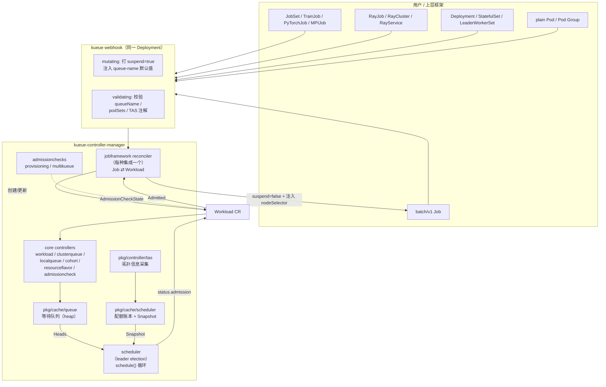
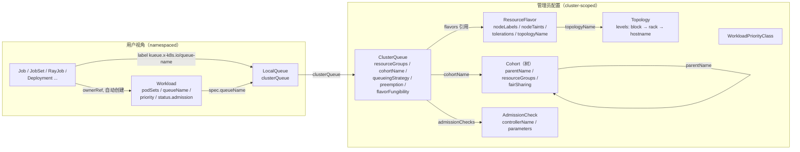
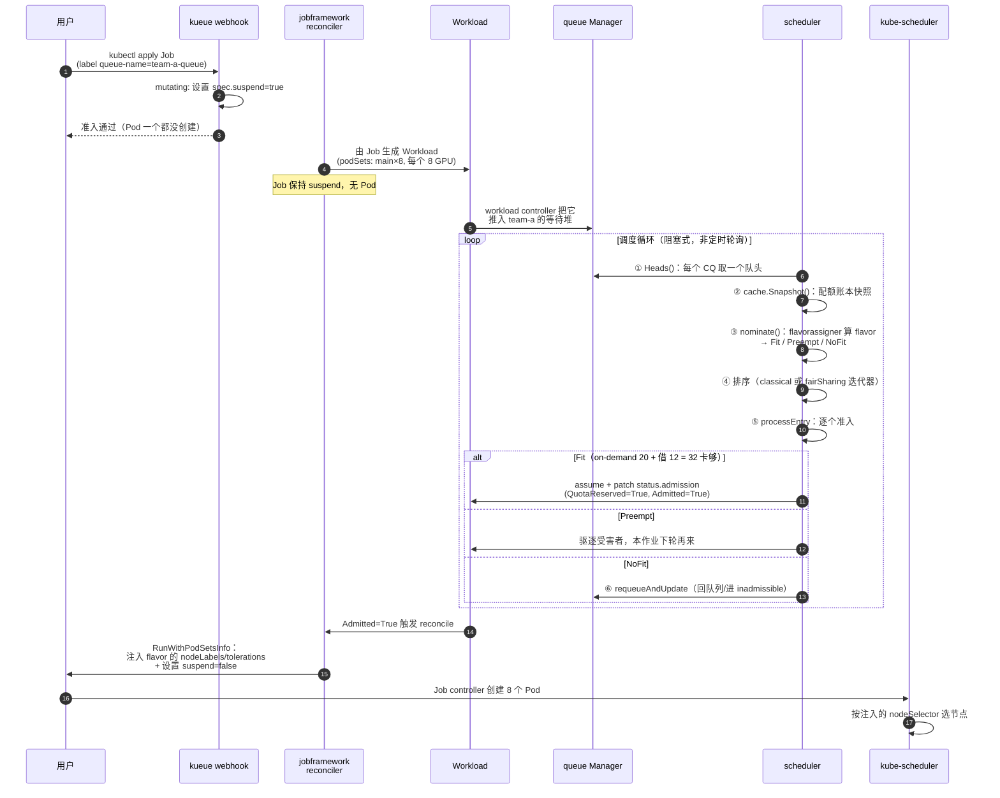

# Kueue 总览与架构

> 本篇回答三个问题：**Kueue 解决什么问题**、**它和 kube-scheduler / Volcano 的边界在哪**、**一个作业从提交到 Pod 跑起来经过了什么**。
>
> **源码基线：`sigs.k8s.io/kueue` v0.19.1**（最新稳定 release，API 存储版本 `v1beta2`，含 TAS 多层切片、MultiKueue、Elastic Jobs 等特性）。
>
> ```bash
> git clone https://github.com/kubernetes-sigs/kueue.git && cd kueue
> git checkout v0.19.1
> ```
>
> 与 Volcano 系列一样钉住 tag 而不用 master，保证文档里的函数名、字段名与你 checkout 出来的代码逐字一致。版本差异见 [附录：版本说明](#附录版本说明)。

---

## 1. 一句话定位

> Kueue 是一个**作业级（job-level）准入控制器**：它决定「**一个作业什么时候可以开始**（Pod 可以被创建）」和「**什么时候必须停下**（Pod 应该被删除）」。它**不负责把 Pod 放到哪个节点上**——那仍然是 `kube-scheduler` 的工作。

这句话来自官方 README 的原话（*"It is a job-level manager that decides when a job should be admitted to start (as in pods can be created) and when it should stop (as in active pods should be deleted)"*），也是理解 Kueue 一切设计的钥匙。

Kueue 的核心机制简单到有点反直觉：

```text
作业提交（suspend=true，不产生 Pod）
   ↓  Kueue 为它创建一个 Workload 对象（配额账本上的"申请单"）
   ↓  Kueue 调度器判断：配额够不够？该用哪个 flavor？要不要抢占？
   ↓  够 → 写 Workload.status.admission（QuotaReserved）
   ↓  jobframework 把 flavor 的 nodeLabels/tolerations 注入 Job，并把 suspend 改成 false
   ↓  Job controller 创建 Pod → kube-scheduler 选节点 → kubelet 拉起容器
```

**「挂起 / 取消挂起」（suspend / unsuspend）就是 Kueue 的执行器。** 它不需要自定义调度器、不接管 Bind、不改 kubelet。

### 1.1 统一示例（后续各篇沿用）

为了建立贯穿全局的直觉，整个系列沿用同一个场景（与本仓库 Volcano 系列刻意保持一致，便于横向对比）：

一个共享 GPU 集群，8 台机器，每台 8 卡 A100（共 64 卡），其中 5 台是包年包月（on-demand），3 台是竞价实例（spot）。两个团队：

| 对象 | 配置 |
|------|------|
| `ResourceFlavor: a100-ondemand` | `nodeLabels: {instance-type: on-demand}` |
| `ResourceFlavor: a100-spot` | `nodeLabels: {instance-type: spot}` + `nodeTaints` |
| `Cohort: llm-pool` | 两个队列可互相借用 |
| `ClusterQueue: team-a` | on-demand 20 卡 + spot 12 卡 |
| `ClusterQueue: team-b` | on-demand 20 卡 + spot 12 卡 |

三类负载：

- **作业 T**（训练）：8 机 64 卡 PyTorch 预训练，**必须 8 个 Pod 全起**（NCCL 通信域），且希望落在同一个网络 block。
- **作业 S**（推理）：vLLM 服务，TP=4，2 个副本，用 Deployment / LeaderWorkerSet 部署。
- **作业 D**（调试）：一个 4 卡的小 Job，随时提交、可被抢占。

---

## 2. 为什么需要它：kube-scheduler 的三个缺口

| 缺口 | 现象（放到示例上） | Kueue 的答案 |
|------|------------------|-------------|
| **没有作业级排队** | 作业 T 的 8 个 Pod 直接创建，5 个调度成功占着 40 卡空转等同伴 | Job `suspend=true` 排队，配额齐了才一次性放行 |
| **没有可借用的多租户配额** | `ResourceQuota` 是硬上限，team-b 闲着 team-a 也借不到 | ClusterQueue + Cohort：`nominalQuota` 自己的、`borrowingLimit` 能借多少、`lendingLimit` 愿借出多少 |
| **没有异构资源的"口味"选择** | 想「优先用包年机器，不够就用竞价机器」只能靠人肉拆两份 YAML | ResourceFlavor + FlavorFungibility：一个作业按顺序尝试多个 flavor |

再加上三个 AI 场景专属能力：

- **网络拓扑感知（TAS）**：把 block / rack / host 的层级告诉 Kueue，让一个作业的 Pod 尽量挤在同一个域里。
- **AdmissionCheck**：把「等集群扩容完成」「等远端集群确认」这类外部条件插进准入流程。
- **MultiKueue**：单集群配额不够时，把作业派发到其他集群去跑。

---

## 3. 与 Volcano 的边界（重要）

这是最常被问的问题。两者**不是同一层的东西**，可以共存：

| 维度 | **Kueue** | **Volcano** |
|------|-----------|-------------|
| 层次 | 作业级**准入**（admission） | Pod 级**调度**（scheduling） |
| 执行手段 | 改 `job.spec.suspend`，不碰 Pod 绑定 | 自己实现调度器，直接 `Bind` Pod |
| 是否替换 kube-scheduler | **不替换**，Pod 仍由 kube-scheduler 调度 | 替换（`schedulerName: volcano`） |
| Gang 语义 | 全量准入：Pod 要么全不创建，要么全创建 | 事务式：`Statement` 累积后 `JobReady` 才 Commit |
| 配额模型 | ClusterQueue（`nominalQuota` / `borrowingLimit` / `lendingLimit`）+ Cohort 树 | Queue（`deserved` / `capability` / `guarantee`）+ 层级队列 |
| 异构资源 | **ResourceFlavor**（一等公民，可 fallback） | 用多队列 + nodegroup / 节点标签间接实现 |
| 节点级能力 | 无（不做 predicates/打分/GPU 共享） | 有（predicates、binpack、NUMA、GPU 共享 vGPU） |
| 拓扑感知 | TAS：算出 `topologyAssignment` 后**注入 nodeSelector**，交给 kube-scheduler 落位 | HyperNode + 自己直接选节点 |
| 多集群 | **MultiKueue** 原生支持 | 无（需配合 Karmada 等） |
| 生态集成 | 内置 14 类 workload 集成（JobSet/RayJob/LWS/TrainJob/Deployment…） | 主要围绕 vcjob + PodGroup |

一句话选型：

- 要**多租户配额 + 作业排队 + 异构资源 fallback + 多集群**，用 Kueue；
- 要**节点级精细调度**（GPU 共享、NUMA、binpack、自定义打分插件），用 Volcano；
- 两者**可以叠加**：Kueue 管准入，放行后的 Pod 交给 Volcano 调度（把 `schedulerName` 设成 volcano 即可）。

---

## 4. 组件架构



**注意：所有组件都在同一个 Deployment（`kueue-controller-manager`，namespace `kueue-system`）里**，scheduler 只是其中一个 `Runnable`，并且实现了 `NeedLeaderElection() bool { return true }`，所以多副本时只有 leader 在调度。

### 4.1 源码目录导航

```
apis/kueue/v1beta2/            # CRD 类型定义（storage version）
apis/config/v1beta2/           # Configuration（组件配置文件）
pkg/
├── scheduler/                 # ★ 调度器
│   ├── scheduler.go           #   schedule() 主循环、entry、admit
│   ├── flavorassigner/        #   给 PodSet 选 flavor，产出 Fit/Preempt/NoFit
│   └── preemption/            #   抢占目标选择（经典 + Fair Sharing）
│       └── fairsharing/
├── cache/
│   ├── scheduler/             # ★ 配额账本 + Snapshot（原 pkg/cache）
│   │   ├── clusterqueue.go / cohort.go / snapshot.go / resource_node.go
│   │   └── tas_*.go           #   TAS 拓扑快照与分配算法
│   ├── queue/                 # ★ 等待队列（原 pkg/queue）
│   │   ├── manager.go         #   Heads()：每个 CQ 取队头
│   │   └── cluster_queue.go   #   StrictFIFO / BestEffortFIFO
│   └── hierarchy/             #   CQ/Cohort 的通用层级树
├── controller/
│   ├── core/                  # Workload / ClusterQueue / LocalQueue / Cohort ... 控制器
│   ├── jobframework/          # ★ GenericJob 接口 + 通用 reconciler
│   ├── jobs/                  # 14 类集成的具体实现
│   ├── tas/                   # 拓扑信息采集与 Pod 门控
│   └── admissionchecks/       # provisioning（扩容）/ multikueue（多集群）
├── workload/                  # Workload 的工具函数（条件、优先级、Usage）
├── workloadslicing/           # Elastic Jobs（workload slice）
├── dra/                       # Dynamic Resource Allocation 支持
├── podset/                    # PodSetInfo：注入 nodeSelector/tolerations/count
├── resources/                 # FlavorResource / Amount（饱和算术）
├── features/                  # feature gates
├── metrics/                   # Prometheus 指标
└── visibility/                # pending workloads 可见性 API
```

---

## 5. CRD 数据模型



### 5.1 ResourceFlavor —— 异构资源的"口味"

`apis/kueue/v1beta2/resourceflavor_types.go`：

| 字段 | 作用 |
|------|------|
| `nodeLabels` | 该 flavor 对应哪些节点（最多 8 项）。**准入时会注入到 Pod 的 nodeSelector** |
| `nodeTaints` | 这些节点上有什么污点；PodSet 必须有对应 toleration 才能用这个 flavor（只看 `NoSchedule` / `NoExecute`） |
| `tolerations` | Kueue **额外给** 该 flavor 的 Pod 加上的 toleration（配了这个，`nodeTaints` 就不再拦） |
| `topologyName` | 指向一个 `Topology` 对象 → 该 flavor 启用 TAS |

示例中 `a100-spot` 就是「有污点 + 有 toleration」的典型组合：只有显式选择这个 flavor 的作业才会落到竞价机器上。

### 5.2 ClusterQueue —— 配额的载体

关键字段（`clusterqueue_types.go`）：

```yaml
spec:
  namespaceSelector: {}          # ★ 默认 null = 不允许任何 namespace！必须显式设置
  cohortName: llm-pool           # 属于哪个 cohort（可借用）
  queueingStrategy: BestEffortFIFO   # 默认；另一个是 StrictFIFO
  resourceGroups:
  - coveredResources: ["cpu", "memory", "nvidia.com/gpu"]
    flavors:                     # ★ 顺序即优先级
    - name: a100-ondemand
      resources:
      - name: nvidia.com/gpu
        nominalQuota: 20         # 应得量
        borrowingLimit: 12       # 最多再从 cohort 借 12
        lendingLimit: 8          # 最多借出 8（自留 12 不外借）
    - name: a100-spot
      resources:
      - name: nvidia.com/gpu
        nominalQuota: 12
  flavorFungibility:
    whenCanBorrow: MayStopSearch   # 默认
    whenCanPreempt: TryNextFlavor  # 默认
  preemption:
    reclaimWithinCohort: Never     # 默认
    withinClusterQueue: Never      # 默认
    borrowWithinCohort:
      policy: Never                # 默认
  stopPolicy: None                 # None / Hold / HoldAndDrain
  fairSharing:
    weight: 1
```

三个配额旋钮的语义务必记牢（后续每一篇都会用到）：

```text
nominalQuota    我"应得"的量
borrowingLimit  我最多能超出 nominalQuota 多少（向 cohort 借）；null = 无限
                ⚠️ cohortName 为空时必须为 null（CEL 校验强制）
lendingLimit    我最多愿意借出多少；null = 全部可借出
                ⇒ 自留不可借出的部分 = nominalQuota − lendingLimit
```

**⚠️ 最容易踩的坑**：`namespaceSelector` 默认是 `null`，语义是「**没有任何 namespace 可以提交**」。要全放开必须显式写 `namespaceSelector: {}`。

### 5.3 Cohort —— 可借用的资源池（一棵树）

`cohort_types.go`：

| 字段 | 作用 |
|------|------|
| `parentName` | 父 Cohort。未设置 = 自己是树根；指向不存在的 Cohort = 用默认 Cohort（无借贷限制） |
| `resourceGroups` | **Cohort 自己也可以有配额**，语义是「在子节点配额之上额外提供的资源」 |
| `fairSharing.weight` | 参与公平共享时的权重 |

> Cohort 是从 v0.11 开始显式建对象的（早期只是 ClusterQueue 上的一个字符串）。有了 Cohort 树，就能表达「公司 → 事业部 → 团队」的多级配额，并在每一级设置借贷限制。源码里有明确的**环检测**（`updateCohortTreeResources` 返回 error），成环期间该子树停止准入。

### 5.4 Workload —— Kueue 的真正调度单元

这是理解 Kueue 的核心对象。**用户一般不手写它，由 jobframework 从 Job 自动生成。**

```yaml
apiVersion: kueue.x-k8s.io/v1beta2
kind: Workload
metadata:
  name: job-pretrain-t-abc12          # 由 Job 名 + hash 生成
  ownerReferences: [{kind: Job, name: pretrain-t, ...}]
spec:
  queueName: team-a-queue             # → LocalQueue
  priority: 100
  priorityClassRef:
    group: kueue.x-k8s.io             # 或 scheduling.k8s.io
    kind: WorkloadPriorityClass       # 或 PriorityClass
    name: high
  active: true                        # ★ 改成 false 会驱逐正在运行的作业
  maximumExecutionTimeSeconds: 86400  # 超时自动 deactivate
  podSets:                            # ★ 最多 18 个
  - name: main
    count: 8
    minCount: 4                       # 部分准入（PartialAdmission，alpha）
    template: {...}                   # 标准 PodTemplateSpec
    topologyRequest:
      required: cloud.provider.com/topology-block
status:
  admission:                          # ★ 调度结果写在这里
    clusterQueue: team-a
    podSetAssignments:
    - name: main
      count: 8
      flavors: {nvidia.com/gpu: a100-ondemand, cpu: a100-ondemand}
      resourceUsage: {nvidia.com/gpu: "8", cpu: "64"}
      topologyAssignment: {...}
  conditions:
  - type: QuotaReserved              # 已占住配额
  - type: Admitted                   # 配额 + 所有 AdmissionCheck 都 OK
  - type: PodsReady
  admissionChecks: [{name: prov, state: Ready, ...}]
```

**`spec.podSets` 一旦创建就不可变**（`podSets cannot be changed`）。这是 Kueue 保证配额账本一致性的基础：作业形状变了，就得换一个新 Workload（这正是 Elastic Jobs 用 workload **slice** 实现弹性扩缩的原因，见 04 篇）。

### 5.5 Workload 的条件（状态机）

`workload_types.go` 里定义的条件类型：

| 条件 | 语义 |
|------|------|
| `QuotaReserved` | **已在某个 ClusterQueue 占住配额**（可能还没 Admitted） |
| `Admitted` | QuotaReserved 且**所有 AdmissionCheck 都 Ready** → Job 可以 unsuspend |
| `PodsReady` | 至少 `podSets[*].count` 个 Pod ready 或成功 |
| `Evicted` | 被驱逐（原因见下） |
| `Preempted` | 被抢占（`Evicted` 的伴生条件，带更细的原因） |
| `Requeued` | 因驱逐后重新排队 |
| `Finished` | 作业结束（成功/失败） |
| `BlockedOnPreemptionGates` | 本可通过抢占拿到配额，但被抢占门控挡住 |
| `WaitingForReplacementPods` | Pod group 的 Pod 数不够，等替补 |
| `DeactivationTarget` | 临时条件，标记「应该被 deactivate」 |

`QuotaReserved=False` 的**原因码**非常有用（排障第一现场）：

| Reason | 含义 |
|--------|------|
| `NoMatchingFlavor` | 没有 flavor 的 nodeLabels/taints 与 PodSet 匹配 |
| `WaitingForQuota` | 配额被占着，等别人释放 |
| `ExceedsMaxQuota` | 请求量超过 CQ/Cohort 的**上限**（`nominal + borrowingLimit`），**等也没用** |
| `TopologyPlacementFailed` | TAS 拓扑约束无法满足 |
| `WaitingForPreemptedWorkloads` | 已发起抢占，等受害者退出 |
| `Misconfigured` | LocalQueue/ClusterQueue 不存在、namespace 不匹配 |
| `Suspended` | CQ/LQ 的 `stopPolicy` 生效 |
| `PendingEvaluation` | 还在排队等评估 |
| `WaitingForPodsReady` | `waitForPodsReady.blockAdmission` 生效，在等前面的作业就绪 |

> `ExceedsMaxQuota` 和 `WaitingForQuota` 的区别值得单独记：前者是**结构性**问题（配额天花板不够，改 YAML 才行），后者是**时序**问题（等就行）。

`Evicted` 的原因码：`Preempted`、`PodsReadyTimeout`、`AdmissionCheck`、`ClusterQueueStopped`、`LocalQueueStopped`、`Deactivated`、`NodeFailures`、`WorkloadSliceReplaced`、`FlavorMigration`、`EvictedOnManagerCluster`。

`Preempted` 的原因码：`InClusterQueue`、`InCohortReclamation`、`InCohortFairSharing`、`InCohortReclaimWhileBorrowing`。

### 5.6 Topology —— 网络拓扑（TAS）

```yaml
apiVersion: kueue.x-k8s.io/v1beta2
kind: Topology
metadata: {name: gpu-topology}
spec:
  levels:                                    # 从高到低，最多 16 层
  - nodeLabel: cloud.provider.com/topology-block
  - nodeLabel: cloud.provider.com/topology-rack
  - nodeLabel: kubernetes.io/hostname        # ★ 只能出现在最低层
```

CEL 校验强制了两件事：`kubernetes.io/hostname` **只能是最低层**；levels 一旦包含 hostname 作为最低层，后续修改也必须保持（否则不可变）。

---

## 6. 一个训练作业的一生

以示例中的作业 T（8 机 64 卡）为例：



**三个关键设计**（后续篇章展开）：

1. **调度是阻塞驱动而不是定时轮询**：`Manager.Heads(ctx)` 在队列全空时用 `cond.Wait()` 阻塞，有新 Workload 才唤醒。所以 Kueue 空闲时几乎不消耗 CPU。
2. **一轮只处理"每个 ClusterQueue 的队头"**：不是把所有 pending workload 都算一遍。这是 Kueue 能扩展到大量 pending 作业的关键，也是 `StrictFIFO` 会「队头阻塞」的根源。
3. **assume 机制**：`admit()` 里先 `cache.AddOrUpdateWorkload()` 把配额记进缓存（假设成功），再**异步** patch apiserver；失败则回滚 `cache.DeleteWorkload()`。这让一轮内的多个准入决策不会重复用同一份配额。

---

## 7. 推理服务怎么接入（不用 Job 也能用）

Kueue 内置 14 类集成（`pkg/controller/jobs/jobs.go`）：

| 类别 | 集成 |
|------|------|
| 原生 | `batch/v1 Job`、`Pod`（含 Pod Group）、`Deployment`、`StatefulSet` |
| 批处理编排 | `JobSet`、`AppWrapper`、`SparkApplication` |
| 训练框架 | `TrainJob`（Kubeflow Trainer v2）、`MPIJob`、Kubeflow `PyTorchJob` / `TFJob` / `JAXJob` / `PaddleJob` / `XGBoostJob` |
| 推理 / 长服务 | `LeaderWorkerSet`、`RayService` |
| Ray | `RayJob`、`RayCluster` |

推理服务（Deployment / StatefulSet / LeaderWorkerSet）的接入方式：

```yaml
metadata:
  labels:
    kueue.x-k8s.io/queue-name: team-a-queue   # ★ 就这一行
```

对 `Deployment` / `StatefulSet` 这类**长服务**，Kueue 的做法与 Job 不同：它没有 `suspend` 字段，所以走的是 **Pod 集成 + scheduling gate**（webhook 给 Pod 加门控，准入后摘掉）。`LeaderWorkerSet` 则天然按「leader + workers 一组」映射成一个 Workload，正好对上多机 TP 的语义。

> 这意味着「训练用 Job/JobSet、推理用 LWS/Deployment」可以**共享同一套 ClusterQueue 配额与抢占体系** —— 这正是 Kueue 在 MaaS 平台里的核心价值。

---

## 8. 系列导航

| 篇 | 主题 | 核心问题 |
|----|------|---------|
| 00（本篇） | 总览与架构 | Kueue 是什么、与 Volcano 的边界、CRD 模型、作业的一生 |
| [01](01-核心原理-Workload生命周期与配额模型.md) | Workload 生命周期与配额模型 | 借用/借出怎么算、抢占策略矩阵、FlavorFungibility、公平共享 |
| [02](02-核心代码分析-调度器与准入.md) | 调度器与准入 | `schedule()` 六步、flavorassigner、preemption 的实现 |
| [03](03-核心代码分析-缓存快照与控制器.md) | 缓存/快照与控制器 | 资源账本树、等待队列、jobframework、TAS/MultiKueue |
| [04](04-面向大模型训练与推理的能力地图.md) | 大模型能力地图 | 训练要什么、推理要什么、坑与取舍 |
| [05](05-实战Demo.md) | 实战 Demo | 安装 → 配额 → 训练 → 推理 → 借用抢占 → TAS → 排障 |

---

## 附录：版本说明

### A.1 为什么钉 v0.19.1

本系列所有源码引用均以 **`v0.19.1`** 为准（编写时最新稳定 release；`v0.20.0-devel` 是开发分支标记，不是发布版）。

```bash
git clone https://github.com/kubernetes-sigs/kueue.git && cd kueue
git checkout v0.19.1
git describe --tags        # v0.19.1
```

Kueue 迭代很快（约 6~8 周一个 minor），API 从 `v1beta1` 到 `v1beta2`、缓存包从 `pkg/{cache,queue}` 重构到 `pkg/cache/{scheduler,queue}` 都发生在最近几个版本。**读 Kueue 资料时第一件事就是确认版本**，否则路径和字段名都对不上。

### A.2 v0.19.1 已包含的关键特性

| 特性 | 位置 / 标识 |
|------|-----------|
| `v1beta2` 作为存储版本 | `apis/kueue/v1beta2/`（`v1beta1` / `v1alpha1` 仍在，仅作转换） |
| 缓存分包 | `pkg/cache/scheduler`（配额账本）、`pkg/cache/queue`（等待队列）、`pkg/cache/hierarchy` |
| `DeferredFit` 模式 | `pkg/scheduler/flavorassigner/` |
| 抢占目标重叠重算 | `RecomputeAssignmentUponPreemptionTargetsOverlap` |
| sticky workload / 按 hash 批量下沉 | `pkg/cache/queue/cluster_queue.go` |
| Elastic Jobs（workload slice） | `pkg/workloadslicing/` |
| TAS 快照与 what-if 推演 | `SimulateWorkloadRemoval` / `tas_flavor_snapshot.go` |
| `kueue_admission_cycle_preemption_skips` 指标 | `pkg/metrics/` |

验证方式：

```bash
git ls-tree --name-only v0.19.1 apis/kueue/ pkg/cache/
git grep -l "DeferredFit" v0.19.1 -- 'pkg/**/*.go'
```

### A.3 与 master / v0.20 的已知差异

| 位置 | v0.19.1（文档基线） | master / v0.20+ |
|------|-------------------|-----------------|
| `preemptionCtx.workloadUsage`（02 篇 §6.1） | `Quota: assignment.TotalRequestsFor(log, &wl)` | `Quota` 拆出子字段：`Quota.Assigned` |
| 抢占重算指标（03 篇 §9） | 只有 `kueue_admission_cycle_preemption_skips` | 新增 `kueue_preemption_target_recomputations_total{result}`（DeferredFit / NewTargets / Skipped） |
| AFS 用量账本 | `WithAfsEntryPenalties` + `WithAfsConsumedResources` | 合并为 `WithAfsUsageLedger`（`pkg/cache/queue/afs`） |
| Fair Sharing 抢占日志 | 无 | 新增 `pkg/scheduler/preemption/fair_sharing_log.go` |

这些都是增量演进，不改变本系列描述的准入流程与配额语义。

### A.4 升级时怎么复查

```bash
cd /path/to/kueue
git diff --stat v0.19.1..<新tag> -- \
  apis/kueue/v1beta2/ pkg/scheduler/ pkg/cache/ \
  pkg/controller/jobframework/ pkg/features/ pkg/metrics/ pkg/workloadslicing/
```

另外每次升级务必对一遍 feature gate 默认值（04 篇 §5）—— Kueue 的 gate 毕业节奏很快，`TopologyAwareScheduling`、`MultiKueue`、`ElasticJobsViaWorkloadSlices` 都是近几个版本才转 Beta 默认开启的。
