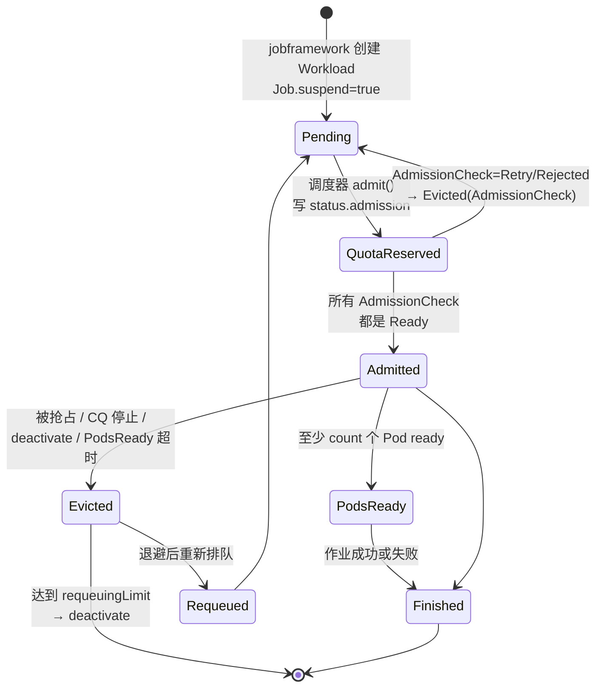
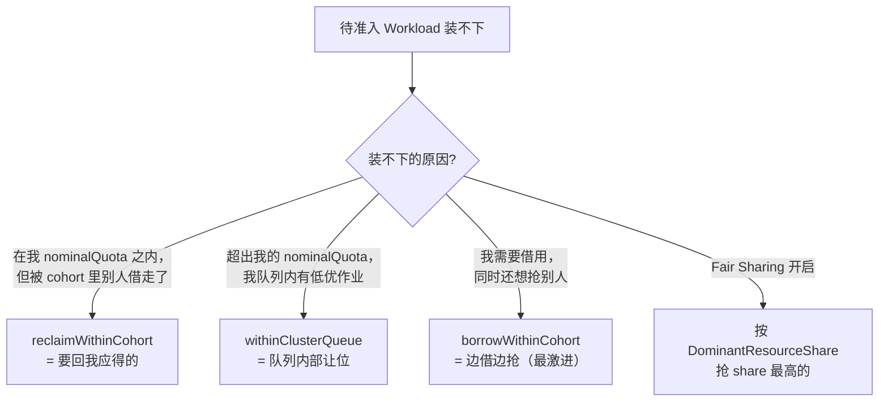

# 核心原理：Workload 生命周期与配额模型

> 本篇讲 Kueue 的两条主线：**一个 Workload 的状态机怎么流转**，以及 **配额（借用 / 借出 / 抢占 / 公平共享）到底怎么算**。这两件事想清楚了，Kueue 的行为就没有意外了。
>
> 涉及源码：`pkg/cache/scheduler/{resource_node,clusterqueue,cohort,fair_sharing}.go`、`pkg/cache/queue/cluster_queue.go`、`pkg/scheduler/flavorassigner/`、`pkg/scheduler/preemption/`

---

## 1. Workload 生命周期

### 1.1 状态机



**两个"准入"的区别是 Kueue 最容易混淆的点**：

| 条件 | 含义 | 副作用 |
|------|------|--------|
| `QuotaReserved=True` | **配额已经被这个 Workload 占住了**（记进 ClusterQueue 账本） | Job 仍然 suspend，Pod 还没创建 |
| `Admitted=True` | QuotaReserved **且** 所有 AdmissionCheck 都 `Ready` | jobframework 才会 `suspend=false`，Pod 才被创建 |

源码依据（`pkg/scheduler/scheduler.go`）：

```go
func (s *Scheduler) prepareWorkload(log logr.Logger, wl *kueue.Workload, cq *schdcache.ClusterQueueSnapshot, admission *kueue.Admission) {
    workload.SetQuotaReservation(wl, admission, s.clock)
    if workload.HasAllRequiredChecks(log, wl, cq.AdmissionChecks) {
        // sync Admitted, ignore the result since an API update is always done.
        _ = workload.SyncAdmittedCondition(wl, s.clock.Now())
    }
}
```

所以「配了 ProvisioningRequest 的作业卡在 `QuotaReserved=True, Admitted=False`」是**正常状态** —— 配额已经为它预留，正在等集群扩容。

### 1.2 驱逐与退避

驱逐路径统一走 `pkg/workload/evict`，会同时写 `Evicted` 条件和 `SchedulingStats.Evictions`（按 `reason` + `underlyingCause` 计数，方便统计「这个作业被抢了几次」）。

驱逐后的重排队受 `Configuration.waitForPodsReady.requeuingStrategy` 控制：

```yaml
waitForPodsReady:
  enable: true
  timeout: 5m
  blockAdmission: true
  recoveryTimeout: 3m
  requeuingStrategy:
    timestamp: Eviction          # 或 Creation
    backoffLimitCount: 5         # 超过则 deactivate（spec.active=false）
    backoffBaseSeconds: 60
    backoffMaxSeconds: 3600
```

`status.requeueState.{count, requeueAt}` 记录退避进度。达到 `backoffLimitCount` 后 Workload 被 **deactivate**（`Evicted` reason=`RequeuingLimitExceeded`），需要人工把 `spec.active` 改回 `true` 才会重新参与调度。

> **训练场景实践**：`blockAdmission: true` 会让「已准入但 Pod 还没全 ready」的作业阻塞后续所有准入。这对保证大作业能起来有帮助（避免小作业插队把资源蚕食），但会拖慢整体吞吐。GPU 集群一般开着，并把 `timeout` 设得够长（镜像大、模型加载慢）。

---

## 2. 配额模型：一棵会向上冒泡的树

这是 Kueue 最精妙的部分。核心数据结构只有三个字段（`pkg/cache/scheduler/resource_node.go`）：

```go
// resourceNode is the shared representation of Quotas and Usage, used
// by ClusterQueues and Cohorts.
type resourceNode struct {
    // Quotas are the ResourceQuotas specified for the current node.
    Quotas map[resources.FlavorResource]ResourceQuota
    // SubtreeQuota is the sum of the node's quota, as well as
    // resources available from its children, constrained by LendingLimits.
    SubtreeQuota resources.FlavorResourceQuantities
    // Usage is the quantity which counts against this node's SubtreeQuota.
    // For ClusterQueues, this is simply its usage. For Cohorts, this is
    // the sum of childrens' usages past childrens' localQuota.
    Usage resources.FlavorResourceQuantities
}
```

**ClusterQueue 和 Cohort 共用同一个结构**，构成一棵树。`FlavorResource` 是 `(flavor, resource)` 二元组 —— 所以配额是**按 flavor 分别记账**的，这点很关键。

### 2.1 localQuota：不外借的自留部分

```go
func (r resourceNode) localQuota(fr resources.FlavorResource) resources.Amount {
    if lendingLimit := r.Quotas[fr].LendingLimit; lendingLimit != nil {
        return resources.MaxAmount(resources.NewAmount(0), r.SubtreeQuota[fr].Sub(*lendingLimit))
    }
    return resources.NewAmount(0)
}
```

即：

```text
localQuota = max(0, SubtreeQuota − lendingLimit)     （配了 lendingLimit）
localQuota = 0                                       （没配 = 全部可外借）
```

「localQuota」的含义是「**存在我自己这里、不上交给 Cohort 的量**」。

### 2.2 向上冒泡：usage 与 quota 的双向累加

**配额向上汇总**（`accumulateFromChild`）：

```go
for fr, childQuota := range child.getResourceNode().SubtreeQuota {
    delta := childQuota.Sub(child.getResourceNode().localQuota(fr))
    parent.resourceNode.SubtreeQuota[fr] = parent.resourceNode.SubtreeQuota[fr].Add(delta)
}
for fr, childUsage := range child.getResourceNode().Usage {
    delta := resources.MaxAmount(resources.NewAmount(0), childUsage.Sub(child.getResourceNode().localQuota(fr)))
    parent.resourceNode.Usage[fr] = parent.resourceNode.Usage[fr].Add(delta)
}
```

翻译：

- 子节点**上交给父节点**的配额 = `SubtreeQuota − localQuota`（即可外借的部分）；
- 子节点**记在父节点头上**的用量 = `max(0, Usage − localQuota)`（即超出自留部分才算「借了 Cohort 的」）。

**用量向上冒泡**（`addUsage`）：

```go
func addUsage(node hierarchicalResourceNode, fr resources.FlavorResource, val resources.Amount) {
    r := node.getResourceNode()
    localAvailable := ...            // 自留部分还剩多少
    r.Usage[fr] = r.Usage[fr].Add(val)
    if node.HasParent() && val.Cmp(localAvailable) > 0 {
        deltaParentUsage := val.Sub(localAvailable)
        addUsage(node.parentHRN(), fr, deltaParentUsage)   // 递归往上加
    }
}
```

**这就是「借用」的实现**：先花自己的自留额度，花完了才向 Cohort 记账。

### 2.3 available()：还能用多少

```go
func available(node hierarchicalResourceNode, fr resources.FlavorResource) resources.Amount {
    r := node.getResourceNode()
    if !node.HasParent() {
        return r.SubtreeQuota[fr].Sub(r.Usage[fr])       // 根节点：简单相减
    }
    parentAvailable := available(node.parentHRN(), fr)   // 递归问父节点
    if borrowingLimit := r.Quotas[fr].BorrowingLimit; borrowingLimit != nil {
        lq := r.localQuota(fr)
        storedInParent := r.SubtreeQuota[fr].Sub(lq)
        usedInParent := resources.MaxAmount(resources.NewAmount(0), r.Usage[fr].Sub(lq))
        withMaxFromParent := storedInParent.Sub(usedInParent).Add(*borrowingLimit)
        parentAvailable = resources.MinAmount(parentAvailable, withMaxFromParent)
    }
    return localAvailable + parentAvailable              // （简化表达）
}
```

要点：

1. **递归向上**：一个 ClusterQueue 的可用量 = 自留剩余 + 父 Cohort 可用（再往上递归）；
2. **borrowingLimit 在这里生效**：夹住「从父节点能拿多少」；
3. 代码注释明确说 available **可能返回负数**（配额被删、节点换 Cohort 等场景），调用方要能处理。

另有 `potentialAvailable()`：忽略当前 usage，只看「结构上最多能拿多少」。这是判定 `ExceedsMaxQuota`（等也没用）与 `WaitingForQuota`（等就有）的依据。

### 2.4 用示例算一遍

```yaml
Cohort: llm-pool（无自身配额）
├── ClusterQueue team-a: a100-ondemand nominalQuota=20, borrowingLimit=12, lendingLimit=8
└── ClusterQueue team-b: a100-ondemand nominalQuota=20, borrowingLimit=12, lendingLimit=8
```

推导：

```text
team-a.localQuota        = 20 − 8 = 12          （自留 12 卡，不外借）
team-a 上交给 cohort      = 20 − 12 = 8
cohort.SubtreeQuota      = 8 + 8 = 16          （两个队列各交 8）

team-a 空载时可用          = 12（自留）+ 16（cohort 全空）= 28
                           但 borrowingLimit=12 夹住从父拿的量
                         = 12 + min(16, (20−12) − 0 + 12) = 12 + min(16, 20) = 28
                           再受 nominal+borrowingLimit=32 的上限约束 → 实际上限 32

team-a 用了 12 卡后        Usage=12，localAvailable=0，之后每一卡都记到 cohort 头上
team-a 用到 24 卡时        cohort.Usage = 24 − 12 = 12（借了 12）
                         已达 borrowingLimit=12 → 停止
```

结论：**team-a 最多能用 24 卡**（12 自留 + 12 借来），即使 team-b 完全空闲。同时 team-b 永远保有 12 卡的自留额度不被借走。

> 想让 team-a 在 team-b 空闲时吃满 32 卡，就把 `lendingLimit` 去掉（全部可外借）或调大 `borrowingLimit`。**`lendingLimit` 是"保底"，`borrowingLimit` 是"上限"** —— 这一对旋钮的组合就是 Kueue 表达 SLA 的方式。

对比 Volcano：Volcano 用 `guarantee`（保底）/ `deserved`（应得）/ `capability`（硬上限）三元组；Kueue 用 `nominalQuota` + `lendingLimit`（等价于保底）+ `borrowingLimit`（等价于上限）。**语义可以互相翻译**，但 Kueue 是按 (flavor, resource) 逐维配置的，粒度更细。

---

## 3. FlavorFungibility：flavor 之间怎么取舍

一个 ClusterQueue 的 `resourceGroups[].flavors[]` 是**有序列表，顺序即优先级**。示例中 `a100-ondemand` 在前、`a100-spot` 在后，表示「优先用包年机器」。

问题是：当第一个 flavor **需要借用**或**需要抢占**才能满足时，应该「就地解决」还是「换下一个 flavor」？

```yaml
flavorFungibility:
  whenCanBorrow: MayStopSearch      # 默认：能借到就用，停止搜索
  whenCanPreempt: TryNextFlavor     # 默认：需要抢占就先试下一个 flavor
  preference: BorrowingOverPreemption   # 仅当上面两个都是 TryNextFlavor 时可设
```

| 组合 | 行为 | 适用 |
|------|------|------|
| `MayStopSearch` + `TryNextFlavor`（默认） | 能借就地借；要抢占则先看下一个 flavor 有没有空位 | 通用。避免为了用贵资源去杀别人 |
| `MayStopSearch` + `MayStopSearch` | 第一个 flavor 能解决（借或抢）就立刻解决 | 强 flavor 偏好（必须优先用 on-demand） |
| `TryNextFlavor` + `TryNextFlavor` | 把所有 flavor 都扫一遍，再按 `preference` 挑最优 | 需要全局最优，可配 `preference` |

`preference` 的语义（`clusterqueue_types.go` 注释）：

- `BorrowingOverPreemption`（默认）：**宁可借用也不抢占**。技术上是最小化「cohort 树中的借用距离」，平局时优先更好的抢占模式（reclaim 优于 CQ 内抢占）。
- `PreemptionOverBorrowing`：反过来，优先抢占。

对应的模式枚举（`flavorassigner.go`）：

```go
// The flavor assignment modes below are ordered from lowest to highest preference.
const (
    NoFit FlavorAssignmentMode = iota  // 配额不够，或需要抢占但已在借用且策略不允许
    Preempt                            // 配额上可行，但要抢占（抢占本身可能因策略/优先级失败）
    DeferredFit                        // 能装下，但要等本轮其他抢占完成
    Fit                                // 有现成未用配额（可能含借用）
)
```

以及更细的内部粒度（用于 flavor 之间比较）：

```go
const (
    noFit preemptionMode = iota
    noPreemptionCandidates   // 理论可抢，但模拟后找不到受害者
    preempt                  // CQ 内抢占
    reclaim                  // 跨 CQ 回收（更"温和"，优先级更高）
    fit
)
```

> **`reclaim > preempt` 这个排序值得注意**：Kueue 认为「把自己应得但被别人借走的配额要回来」比「在自己队列内部杀低优作业」更可接受。

---

## 4. 抢占：三种场景 + 策略矩阵

`ClusterQueuePreemption` 有三个旋钮，对应三种**互不相同**的场景（`clusterqueue_types.go` 的类型注释写得很清楚）：



### 4.1 策略取值

| 字段 | 取值 | 语义 |
|------|------|------|
| `reclaimWithinCohort` | `Never`(默认) / `LowerPriority` / `Any` | 能否抢 cohort 中**超用**（超过自己 nominalQuota）的队列 |
| `withinClusterQueue` | `Never`(默认) / `LowerPriority` / `LowerOrNewerEqualPriority` | 能否抢**同队列**内的作业 |
| `borrowWithinCohort.policy` | `Never`(默认) / `LowerPriority` | 借用的同时能否抢 cohort 里别人 |
| `borrowWithinCohort.maxPriorityThreshold` | int32 | 只有优先级 ≤ 该阈值的作业可被"借用型抢占"抢走 |

CEL 校验强制：`reclaimWithinCohort=Never` 时 `borrowWithinCohort.policy` 必须也是 `Never`。另外 `borrowWithinCohort` **只能用于经典抢占，不能与 Fair Sharing 同时用**。

### 4.2 三类候选者与"层级优势"

`preemption.go` 的 `classicalPreemptions` 里有一段关键注释，把候选者分成三类：

```go
// We have three types of candidates:
// 1. Hierarchy candidates. Candidates over which the incoming workload has a
//    hierarchical advantage (it is closer to the quota used by the candidate).
//    We can preempt such candidates regardless of their priority.
// 2. Priority candidates. Candidates over which there is no hierarchical advantage
//    but the possibility to preempt is determined based on priorities.
//    We respect the BorrowWithinCohort configuration only for these candidates.
// 3. Same queue candidates.
```

**「层级优势」（hierarchical advantage）**是 Cohort 树带来的概念：如果受害者用的配额「本来属于我这一侧」，那我**不看优先级也能抢回来**。这就是 `reclaim` 语义 —— 它是「产权」而不是「优先级」。

### 4.3 受害者排序

`pkg/scheduler/preemption/common/ordering.go` 的 `CandidatesOrdering`，按优先级从高到低（越靠前越先被抢）：

```go
1. 已经被驱逐的（IsEvicted）优先 —— 反正要走了
2. 不在 preemptor 自己队列里的优先 —— 先抢外面的，再抢自己人
3. AdmissionFairSharing 开启时：LocalQueue 用量高的优先
4. EffectivePriority 低的优先
5. quotaReservationTime 晚的优先（后来的先走）
6. UID 比较（保证确定性）
```

> 第 2 条很有实践意义：跨队列回收会**优先动别人的作业**，只有不够时才动自己队列的。

### 4.4 抢占的执行

`processEntry` 中（`scheduler.go`）：

```go
if mode == flavorassigner.Preempt {
    if len(e.preemptionTargets) == 0 {
        e.requeueReason = qcache.RequeueReasonPreemptionNoCandidates
        e.quotaReservedReason = kueue.WorkloadQuotaReservedReasonWaitingForQuota
        s.reserveCapacityForUnreclaimablePreempt(log, e, cq)   // ★ 占位保护
        return
    }
    ...
    s.issuePreemptions(ctx, log, e, preemptionTargets)
    return                        // ★ 本轮不 admit，下一轮再来
}
```

两个细节：

1. **抢占和准入分两轮**：本轮只发驱逐，`Pending the preemption of N workload(s)`，下一轮才真正 admit。
2. **`reserveCapacityForUnreclaimablePreempt`**：即使找不到受害者，如果这个 CQ 「不能总是拿回自己的 nominal 配额」（`!preemption.CanAlwaysReclaim(cq)`），也会先把配额「占住」，防止低优作业趁机溜进来。这是防饥饿的重要保护。

对比 Volcano：Volcano 用 `Statement.Commit/Discard` 保证「抢了就一定能起来」；Kueue 是「乐观抢占 + 下轮重算」。Kueue 的 gang 语义由「Workload 整体准入」天然保证，不需要事务回滚。

---

## 5. 公平共享（Fair Sharing）

启用方式（Configuration，不是 CQ 级）：

```yaml
fairSharing:
  enable: true
  preemptionStrategies: [LessThanOrEqualToFinalShare, LessThanInitialShare]
```

### 5.1 DominantResourceShare 怎么算

`pkg/cache/scheduler/fair_sharing.go`：

```go
func dominantResourceShare(node dominantResourceShareNode, wlReq resources.FlavorResourceQuantities) DRS {
    drs := DRS{fairWeight: node.fairWeight(), unweightedRatio: 0, ...}
    if !node.HasParent() { return drs }        // 根节点没有"借用"概念

    borrowing := ...
    for fr, quota := range node.getResourceNode().SubtreeQuota {
        amountBorrowed := wlReq[fr].Add(node.getResourceNode().Usage[fr]).Sub(quota)
        if amountBorrowed.CmpInt64(0) > 0 {
            borrowing[fr.Resource] = borrowing[fr.Resource].Add(amountBorrowed)
        }
    }
    if len(borrowing) == 0 { return drs }      // ★ 没有借用 → share = 0

    lendable := calculateLendable(node.parentHRN())
    for rName, b := range borrowing {
        if lr := lendable[rName]; lr.CmpInt64(0) > 0 {
            ratio := float64(b.Int64()) * 1000.0 / float64(lr.Int64())
            // 取所有资源里最大的比例（dominant resource）
        }
    }
    // 最终 weightedShare = 最大 ratio / weight
}
```

关键结论：

1. **只有「超出自己 nominalQuota 的部分」才计入 share**。用量在自己配额内 → `share = 0`，享受最高优先。
2. **分母是 cohort 的可借出总量（lendable）**，不是集群总量。
3. **取所有资源维度里比例最大的那个**（dominant resource），所以叫 DRS。
4. `weight = 0` 表示 share 为 `int64` 最大值（`9223372036854775807`）—— 永远排最后、永远最先被抢。

调度侧的用法（`scheduler.go`）：

```go
func makeIterator(ctx context.Context, entries []entry, workloadOrdering workload.Ordering, enableFairSharing bool) entryIterator {
    if enableFairSharing {
        return makeFairSharingIterator(ctx, entries, workloadOrdering)   // 按 DRS 升序
    }
    return makeClassicalIterator(ctrl.LoggerFrom(ctx), entries, workloadOrdering)
}
```

**准入时优先 share 最低的，抢占时优先抢 share 最高的** —— 一个对称的机制。

### 5.2 AdmissionFairSharing（AFS）—— LocalQueue 级的历史用量公平

这是另一个维度的公平：在**同一个 ClusterQueue 内部**，让「历史上用得少的 LocalQueue」优先。

```yaml
# Configuration
admissionFairSharing:
  usageHalfLifeTime: 168h        # 用量的半衰期（一周）
  usageSamplingInterval: 5m
  resourceWeights:
    nvidia.com/gpu: 1
---
# ClusterQueue
spec:
  admissionScope:
    admissionMode: UsageBasedAdmissionFairSharing   # 或 NoAdmissionFairSharing
```

实现上是一个**带指数衰减的用量账本**（`pkg/cache/queue/afs`），`LocalQueue.status.fairSharing` 里能看到累积用量。它同时影响：

- 队列内 Workload 的出队顺序；
- 抢占受害者排序（`CandidatesOrdering` 的第 3 条）。

> 场景价值：一个团队的 ClusterQueue 下有多个成员的 LocalQueue，AFS 能防止「某个人一直提交大作业把队列吃满」。

---

## 6. 排队策略：StrictFIFO vs BestEffortFIFO

```yaml
spec:
  queueingStrategy: BestEffortFIFO   # 默认
```

| | `StrictFIFO` | `BestEffortFIFO`（默认） |
|--|-------------|------------------------|
| 语义 | 严格按创建时间；**队头装不下就阻塞后面所有作业** | 队头装不下就挪到 `inadmissibleWorkloads`，让后面的作业试 |
| 优点 | 无饥饿，大作业一定能排到 | 吞吐高，资源不闲置 |
| 缺点 | 一个大作业会阻塞整个队列 | 大作业可能被小作业持续插队饿死 |
| 适用 | 需要严格公平的批处理队列 | 通用；配合 `waitForPodsReady` / 抢占防饥饿 |

源码里的差异（`pkg/cache/queue/cluster_queue.go`）：

```go
func (c *ClusterQueue) RequeueIfNotPresent(ctx context.Context, wInfo *workload.Info, reason RequeueReason, quotaReservedReason QuotaReservedReason) bool {
    var immediate bool
    if c.queueingStrategy == kueue.StrictFIFO {
        immediate = reason != RequeueReasonNamespaceMismatch      // ★ 几乎总是立刻回队头
    } else {
        immediate = reason == RequeueReasonFailedAfterNomination || ...
    }
    ...
}
```

`BestEffortFIFO` 独有的两个优化：

**① sticky workload**（防止抢占者被自己挤掉）：

```go
// stickyWorkload is the workload at the ClusterQueue head which is
// currently preempting workloads. It is only enabled for BestEffortFIFO
// policy, and prevents skipped over ineligible workloads from going back
// to the head of the queue. A workload is considered sticky until it is
// admitted, unschedulable, or deleted.
```

因为抢占要跨轮完成，如果抢占者每轮都被挪到 inadmissible，受害者被杀了却让别人捡了便宜。sticky 让它牢牢待在队头。

**② 按 scheduling hash 批量下沉**：

```go
// When SchedulingEquivalenceHashing is enabled and the reason is NoFit or
// PreemptionNoCandidates, equivalent workloads in the heap are bulk-moved
// to inadmissible.
func (c *ClusterQueue) handleInadmissibleHash(hash workload.EquivalenceHash, reason QuotaReservedReason) int {
    if c.queueingStrategy != kueue.BestEffortFIFO {
        return 0    // StrictFIFO 保持严格顺序，不做批量下沉
    }
    ...
}
```

同形状（同 hash）的 Workload 一个失败，其余必然失败，直接批量挪走 —— 大规模同质作业（例如 1000 个一样的评测任务）场景下能省掉大量无效计算。

---

## 7. AdmissionCheck：把外部条件插进准入流程

```yaml
apiVersion: kueue.x-k8s.io/v1beta2
kind: AdmissionCheck
metadata: {name: gpu-provisioning}
spec:
  controllerName: kueue.x-k8s.io/provisioning-request
  retryDelayMinutes: 5
  parameters:
    apiGroup: kueue.x-k8s.io
    kind: ProvisioningRequestConfig
    name: gpu-prov-config
```

`Workload.status.admissionChecks[]` 记录每个 check 的状态：

| `state` | 效果 |
|---------|------|
| `Pending` | 卡在 `Admitted=False`，配额已保留 |
| `Ready` | 全部 Ready 后 → `Admitted=True` |
| `Retry` | 触发 `Evicted(AdmissionCheck)`，释放配额并重排队；可用 `requeueAfterSeconds` 控制退避 |
| `Rejected` | 作业被 deactivate |

内置两个控制器：

- **`provisioning`**：创建 `ProvisioningRequest`（cluster-autoscaler 接口），等节点扩出来。这解决了「配额有但机器没有」的问题。
- **`multikueue`**：把 Workload 复制到 worker 集群，由远端集群实际执行。

CQ 上有两种绑定方式：`admissionChecksStrategy`（可按 flavor 生效，推荐）。ClusterQueue 有一系列 `Active=False` 的原因码专门覆盖这类误配：`MultipleMultiKueueAdmissionChecks`、`MultiKueueAdmissionCheckAppliedPerFlavor`、`MultiKueueWithProvisioningRequest`、`AdmissionCheckNotFound`、`TopologyNotFound` 等。

---

## 8. 小结与常见误区

| 误区 | 事实 |
|------|------|
| 「Kueue 是调度器，会选节点」 | 它只做**准入**；节点选择仍是 kube-scheduler（TAS 只是注入 nodeSelector） |
| 「`Admitted=False` 就是没配额」 | 也可能配额已保留（`QuotaReserved=True`），只是 AdmissionCheck 没通过 |
| 「`namespaceSelector` 不填就是全放开」 | 默认 `null` = **一个 namespace 都不允许**，必须写 `{}` |
| 「`borrowingLimit` 不填就是不能借」 | 不填 = **无限借**（受 cohort 总量约束）；`cohortName` 为空时才必须为 null |
| 「`lendingLimit` 是能借多少」 | 是**能借出**多少；自留 = `nominalQuota − lendingLimit` |
| 「一轮会评估所有 pending 作业」 | 一轮只取**每个 CQ 的队头**（+ second pass 队列） |
| 「Fair Sharing 按总用量算」 | 只算**超出 nominalQuota 的借用部分**；配额内用量 share=0 |
| 「抢占当轮就能起来」 | 抢占和准入分两轮：本轮驱逐，下一轮 admit |
| 「`podSets` 可以改」 | **不可变**。弹性扩缩要靠 workload slice（Elastic Jobs） |
| 「Kueue 和 Volcano 冲突」 | 可叠加：Kueue 管准入，Pod 交给 `schedulerName: volcano` |

下一篇 [02 调度器与准入源码分析](02-核心代码分析-调度器与准入.md)：逐行拆 `schedule()`、`flavorassigner`、`preemption`。
