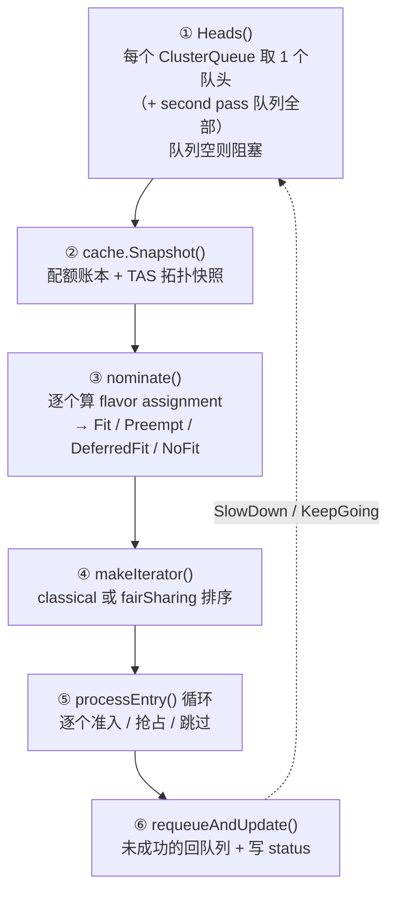
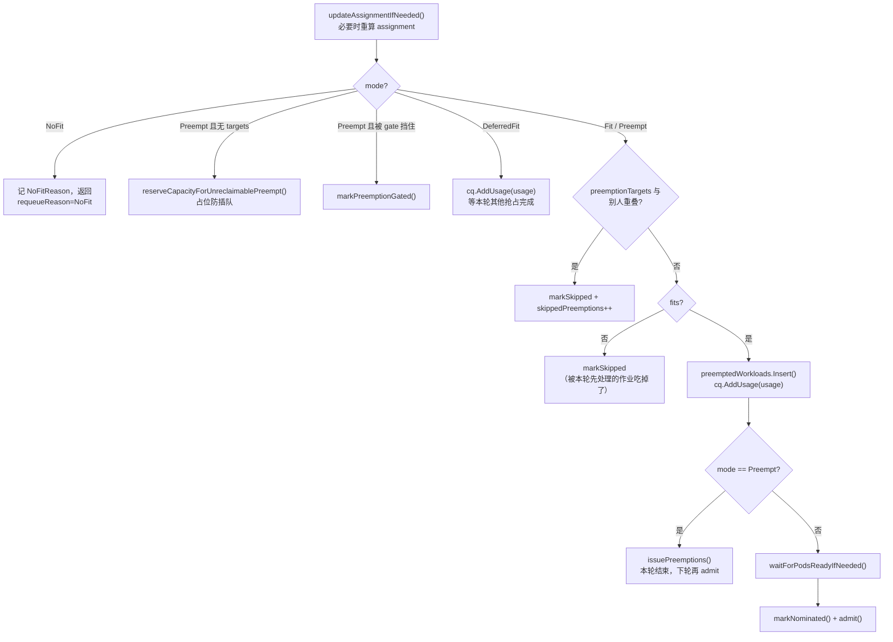

# 核心代码分析（一）：调度器与准入

> 本篇逐层拆解 `pkg/scheduler/`：`schedule()` 主循环、`flavorassigner`（选 flavor）、`preemption`（选受害者）。这是 Kueue 全部准入决策的发生地。
>
> 源码基线：**v0.19.1**

---

## 1. 调度循环：阻塞驱动而非定时轮询

`pkg/scheduler/scheduler.go`：

```go
func (s *Scheduler) Start(ctx context.Context) error {
    log := ctrl.LoggerFrom(ctx).WithName("scheduler")
    ctx = ctrl.LoggerInto(ctx, log)
    go wait.UntilWithBackoff(ctx, s.schedule)
    return nil
}

// 多副本时只有 leader 调度
func (s *Scheduler) NeedLeaderElection() bool { return true }
```

`wait.UntilWithBackoff` 的语义由 `schedule()` 的返回值控制：

```go
func (s *Scheduler) schedule(ctx context.Context) wait.SpeedSignal {
    ...
    if result != metrics.AdmissionResultSuccess {
        return wait.SlowDown      // 本轮什么都没准入 → 退避，避免忙等
    }
    return wait.KeepGoing         // 有准入 → 立刻再来一轮
}
```

> **这是 Kueue 与 Volcano 在"节奏"上的根本差异**：Volcano 是固定 `schedulePeriod`（默认 1s）的定时轮询；Kueue 是「有活就干、干成了继续、干不成退避」的自适应循环，队列全空时在 `Heads()` 里阻塞。

### 1.1 schedule() 六步

代码里就是编号注释，非常清晰：

```go
func (s *Scheduler) schedule(ctx context.Context) wait.SpeedSignal {
    s.schedulingCycle++
    cycleStartTime := s.clock.Now()

    // 1. Get the heads from the queues, including their desired clusterQueue.
    //    This operation blocks while the queues are empty.
    headWorkloads := s.queues.Heads(ctx)
    if len(headWorkloads) == 0 { return wait.KeepGoing }

    // 2. Take a snapshot of the cache.
    snapshot, err := s.cache.Snapshot(ctx, snapshotOpts...)
    if err != nil { return wait.SlowDown }

    // 3. Calculate requirements (resource flavors, borrowing) for admitting workloads.
    entries, inadmissibleEntries := s.nominate(ctx, headWorkloads, snapshot)

    // 4. Create iterator which returns ordered entries.
    iterator := makeIterator(ctx, entries, s.workloadOrdering, fairsharing.Enabled(s.fairSharing))

    // 5. Admit entries, ensuring that no more than one workload gets
    //    admitted by a cohort (if borrowing).
    preemptedWorkloads := make(preemption.PreemptedWorkloads)
    skippedPreemptions := make(map[kueue.ClusterQueueReference]int)
    for iterator.hasNext() {
        s.processEntry(ctx, iterator.pop(), snapshot, preemptedWorkloads, skippedPreemptions)
    }

    // 6. Requeue the heads that were not scheduled.
    result := metrics.AdmissionResultInadmissible
    for _, e := range entries {
        if e.status != assumed && e.status != evicted {
            s.requeueAndUpdate(ctx, e)
        } else {
            result = metrics.AdmissionResultSuccess
        }
    }
    for _, e := range inadmissibleEntries {
        s.requeueAndUpdate(ctx, e)
    }
    ...
}
```



**「一轮只取每个 CQ 的队头」是 Kueue 可扩展性的核心设计**（`pkg/cache/queue/manager.go`）：

```go
func (m *Manager) heads() []workload.Info {
    workloads := m.secondPassQueue.takeAllReady()      // ★ second pass 优先，全部取
    for cqName, cq := range m.hm.ClusterQueues() {
        if m.statusChecker != nil && !m.statusChecker.ClusterQueueActive(cqName) {
            continue                                    // Inactive CQ 跳过
        }
        wl := cq.Pop()                                  // ★ 每个 CQ 只取一个
        if wl == nil { continue }
        wlCopy := *wl
        wlCopy.ClusterQueue = cqName
        workloads = append(workloads, wlCopy)
        ...
    }
    return workloads
}
```

代价是 `StrictFIFO` 下队头装不下会阻塞整个队列（因为下一轮还是它当队头）。

> **second pass 是什么**：某些 Workload 需要「第二遍调度」—— 典型是配了 ProvisioningRequest 的 TAS 作业：第一遍只保留配额（`delayedTopologyRequest: Pending`），等节点扩出来后第二遍才算拓扑分配。`workload.NeedsSecondPass()` 判定，`secondPassQueue` 单独维护。

---

## 2. nominate：谁有资格参与本轮

```go
func (s *Scheduler) nominate(ctx context.Context, workloads []workload.Info, snap *schdcache.Snapshot) ([]entry, []entry) {
    entries := make([]entry, 0, len(workloads))
    var inadmissibleEntries []entry
    for _, w := range workloads {
        e := entry{Info: w}
        e.clusterQueueSnapshot = snap.ClusterQueue(w.ClusterQueue)

        if !workload.NeedsSecondPass(w.Obj) && s.cache.IsAdded(w) {
            continue                              // 已在缓存里记账过，跳过
        } else if workload.HasRetryChecks(w.Obj) || workload.HasRejectedChecks(w.Obj) {
            e.inadmissibleMsg = "The workload has failed admission checks"
            e.quotaReservedReason = kueue.WorkloadQuotaReservedReasonPendingEvaluation
        } else if snap.InactiveClusterQueueSets.Has(w.ClusterQueue) {
            e.inadmissibleMsg = fmt.Sprintf("ClusterQueue %s is inactive", w.ClusterQueue)
            e.quotaReservedReason = kueue.WorkloadQuotaReservedReasonSuspended
        } else if e.clusterQueueSnapshot == nil {
            e.inadmissibleMsg = fmt.Sprintf("ClusterQueue %s not found", w.ClusterQueue)
            e.quotaReservedReason = kueue.WorkloadQuotaReservedReasonMisconfigured
        } else if err := workload.ValidateAdmissibility(ctx, s.client, &w, e.clusterQueueSnapshot.NamespaceSelector); err != nil {
            e.inadmissibleMsg = err.Error()
            ...                                    // 含 namespaceSelector 不匹配
        } else {
            assignment, targets := s.getAssignments(ctx, &e.Info, snap)   // ★ 核心
            e.recordAssignment(assignment, targets)
            entries = append(entries, e)
            continue
        }
        inadmissibleEntries = append(inadmissibleEntries, e)
    }
    return entries, inadmissibleEntries
}
```

这段代码是 `QuotaReserved=False` 各种 Reason 的**产地**，排障时直接对照。

### 2.1 entry：一轮内的工作单元

```go
type entryStatus string

const (
    nominated       entryStatus = "nominated"        // 被提名，准备 admit
    skipped         entryStatus = "skipped"          // 本轮跳过（冲突）
    preemptionGated entryStatus = "preemptionGated"  // 能抢但被门控挡住
    evicted         entryStatus = "evicted"          // 本轮被驱逐（TAS 节点故障）
    assumed         entryStatus = "assumed"          // 已假定准入（成功）
    notNominated    entryStatus = ""                 // 从未提名
)

type entry struct {
    workload.Info                                     // 内嵌：Obj + TotalRequests + LastAssignment
    assignment           flavorassigner.Assignment
    status               entryStatus
    inadmissibleMsg      string
    requeueReason        qcache.RequeueReason
    preemptionTargets    []*preemption.Target
    clusterQueueSnapshot *schdcache.ClusterQueueSnapshot
    quotaReservedReason  string
    skipStatusUpdate     bool
}
```

### 2.2 LastAssignment：跨轮记住"扫到第几个 flavor"

`getAssignments` 里有一段值得注意的优化：

```go
if wl.LastAssignment != nil && lastAssignmentOutdated(wl.LastAssignment, cq.AllocatableResourceGeneration, s.schedulingCycle, wl.SchedulingHash) {
    wl.LastAssignment = nil          // 过期了，从第一个 flavor 重新扫
}

func lastAssignmentOutdated(last *workload.AssignmentClusterQueueState, currentCQGeneration, currentSchedulingCycle int64, currentSchedulingHash workload.EquivalenceHash) bool {
    if features.Enabled(features.FlavorFungibilityPreserveScanProgress) {
        if !last.MatchesSchedulingShape(currentSchedulingHash) {
            return true              // 作业形状变了 → 重扫
        }
        if currentSchedulingCycle-last.SchedulingCycle <= 1 {
            return false             // 本轮或上一轮算的，仍然有效
        }
    }
    return currentCQGeneration > last.ClusterQueueGeneration
}
```

`AllocatableResourceGeneration` 在 cohort 内任何准入/驱逐时都会 +1（见 `updateClusterQueueResourceNode`）。原始逻辑是「generation 变了就重扫所有 flavor」，但繁忙集群里 generation 每轮都在变，导致「上一轮扫到第 5 个 flavor」的进度总被丢弃。`FlavorFungibilityPreserveScanProgress` 这个 gate 就是为此加的：**相邻一轮内的进度不算过期**。

---

## 3. flavorassigner：给每个 PodSet 挑 flavor

`pkg/scheduler/flavorassigner/flavorassigner.go`。

### 3.1 输出结构

```go
type Assignment struct {
    PodSets []PodSetAssignment
    // Borrowing is the height of the smallest cohort tree that fits
    // the additional Usage. It equals to 0 if no borrowing is required.
    Borrowing int
    LastState workload.AssignmentClusterQueueState
    Usage     workload.Usage
    representativeMode *FlavorAssignmentMode
    ...
    NoFitReason string
}

func (a *Assignment) RepresentativeMode() FlavorAssignmentMode {
    if len(a.PodSets) == 0 { return NoFit }
    mode := Fit
    for _, ps := range a.PodSets {
        psMode := ps.RepresentativeMode()
        if psMode < mode { mode = psMode }     // ★ 取所有 PodSet 中最差的
    }
    return mode
}
```

**`RepresentativeMode` 取所有 PodSet 的最小值** —— 这就是 Kueue 的 **gang 语义**：一个 PodSet 装不下，整个 Workload 就装不下。

> 对比 Volcano：Volcano 需要 `Statement` 事务 + `JobReady` 判定来实现 gang；Kueue 因为「Workload 是一个整体、要么全准入要么不准入」，gang 是**结构性保证**，不需要回滚机制。这是「作业级准入」相比「Pod 级调度」的天然优势。

### 3.2 Borrowing 的含义

注释说得很准确：`Borrowing` 是「能装下这份增量用量的**最小 cohort 子树的高度**」。

```text
Borrowing = 0   我自己的配额就够（不借）
Borrowing = 1   要借到父 Cohort
Borrowing = 2   要借到祖父 Cohort
...
```

这个「借用距离」是 `BorrowingOverPreemption` 偏好的优化目标 —— **尽量在离自己近的地方找资源**。

### 3.3 assignFlavors 主流程

```go
func (a *FlavorAssigner) assignFlavors(ctx context.Context, log logr.Logger, counts []int32) Assignment {
    requests := make([]workload.PodSetResources, len(a.wl.TotalRequests))
    if len(counts) == 0 {
        // 全量：直接用 TotalRequests
    } else {
        for i := range a.wl.TotalRequests {
            requests[i] = *a.wl.TotalRequests[i].ScaledTo(counts[i])   // 部分准入：按缩减后的 count
        }
    }
    assignment := Assignment{
        LastState: workload.AssignmentClusterQueueState{
            LastTriedFlavorIdx:     make([]map[corev1.ResourceName]int, 0, len(requests)),
            ClusterQueueGeneration: a.cq.AllocatableResourceGeneration,
            SchedulingCycle:        a.schedulingCycle,
            SchedulingHash:         a.wl.SchedulingHash,
        },
        ...
    }
    groupedRequests := orderedgroups.NewOrderedGroups[string, indexedPodSet]()
    // 按 PodSetGroupName 分组：同组的 PodSet 必须分到同一个 flavor
    ...
}
```

三个要点：

1. **`counts` 参数支持部分准入**：`PodSetReducer` 会用二分法反复调用 `Assign(ctx, nextCounts)` 找到最大可行的 count。
2. **`LastTriedFlavorIdx`**：逐 PodSet、逐 resource 记住「上次扫到第几个 flavor」，这是 FlavorFungibility 跨轮续扫的载体。
3. **PodSetGroupName 分组**：`kueue.x-k8s.io/podset-group-name` 注解让多个 PodSet 强制用同一个 flavor（例如 JobSet 里 leader 和 worker 必须同 flavor），也是 TAS 域拟合的单位。

### 3.4 部分准入（PartialAdmission）

`getInitialAssignments` 里的降级链：

```go
fullAssignment := flvAssigner.Assign(ctx, nil)
arm := fullAssignment.RepresentativeMode()
if arm == flavorassigner.Fit {
    return fullAssignment, preemptionTargets          // ① 直接装下
}
if arm == flavorassigner.Preempt {
    faPreemptionTargets := s.preemptor.GetTargets(ctx, *wl, fullAssignment, snap)
    if len(faPreemptionTargets) > 0 {
        return fullAssignment, append(preemptionTargets, faPreemptionTargets...)   // ② 抢占可行
    }
}
if features.Enabled(features.PartialAdmission) && wl.CanBePartiallyAdmitted() {
    reducer := flavorassigner.NewPodSetReducer(wl.Obj.Spec.PodSets, func(nextCounts []int32) (*partialAssignment, bool) {
        assignment := flvAssigner.Assign(ctx, nextCounts)      // ③ 缩小并重试
        ...
    })
    if pa, found := reducer.Search(); found {
        return pa.assignment, append(preemptionTargets, pa.preemptionTargets...)
    }
}
return fullAssignment, nil                            // ④ 彻底不行
```

`CanBePartiallyAdmitted()` 要求某个 PodSet 设了 `minCount`。**弹性训练（能起多少先起多少）在 Kueue 里就是这条路**。

---

## 4. processEntry：单个 entry 的准入流水线

这是全文最值得逐行读的函数，代码注释已经给出了流水线概览：

> *"processEntry runs the admission pipeline for a single entry: TAS replacement, preempt-mode pre-checks, fits/overlap checks, preemption issuance, pods-ready gating, workload-slice replacement, and admission."*



### 4.1 为什么要"重算 assignment"

```go
// The assignment was computed during nomination, but it may need to be refreshed.
// For example, TAS nominations for workloads from different CQs are computed
// independently, making them likely to choose conflicting topology domains.
// We may also recompute in case of overlapping preemption targets with another workload.
usage, fits := s.updateAssignmentIfNeeded(ctx, log, e, snapshot, cq, preemptedWorkloads)
```

`nominate` 阶段各 CQ 的队头是**独立计算**的，彼此看不到对方的决策。到了 `processEntry` 串行处理时才会发现冲突：

```go
needsTASRecompute := fitsCheck == schdcache.FitsCheckNoTAS && features.Enabled(features.TASRecomputeAssignmentWithinSchedulingCycle)
needsOverlapRecompute := preemptedWorkloads.HasAny(e.preemptionTargets) && features.Enabled(features.RecomputeAssignmentUponPreemptionTargetsOverlap)

switch {
case needsOverlapRecompute:
    // To get the projected cluster state after other preemptions complete,
    // we simulate the removal of their victims.
    victimsOfOtherPreemptions := slices.Collect(maps.Values(preemptedWorkloads))
    revertRemoval = snapshot.SimulateWorkloadRemoval(victimsOfOtherPreemptions)
case needsTASRecompute:
    log.V(2).Info("Re-computing the assignment as it doesn't fit for TAS")
default:
    return usage, schdcache.FitsCheckOk == fitsCheck        // 短路
}
```

**`SimulateWorkloadRemoval` + `revertRemoval` 是快照上的 what-if 推演**：假设别人的抢占已经完成，我还能不能装下？如果能，就标成 `DeferredFit`：

```go
if needsOverlapRecompute {
    if revertRemoval != nil { revertRemoval() }
    if e.assignment.RepresentativeMode() == flavorassigner.Fit {
        e.assignment.SetRepresentativeMode(flavorassigner.DeferredFit)
    }
}
```

`DeferredFit` 的处理是「**占住配额但不 admit**」：

```go
if mode == flavorassigner.DeferredFit {
    e.inadmissibleMsg = "Workload has overlapping preemption targets with another workload, but will fit after these preemptions complete"
    e.quotaReservedReason = kueue.WorkloadQuotaReservedReasonWaitingForPreemptedWorkloads
    e.requeueReason = qcache.RequeueReasonPendingPreemption
    e.LastAssignment = nil        // 下轮全 flavor 重扫，避免锁死在次优 flavor
    cq.AddUsage(usage)            // ★ 先占住，防止别人抢先
    return
}
```

### 4.2 一个 cohort 一轮只准入一个借用者

这是 `schedule()` 第 5 步注释的原话：

> *"Admit entries, ensuring that no more than one workload gets admitted by a cohort (if borrowing). This is because there can be other workloads deeper in a clusterQueue whose head got admitted that should be scheduled in the cohort before the heads of other clusterQueues."*

实现方式是 `fits()`：

```go
func fits(snapshot *schdcache.Snapshot, cq *schdcache.ClusterQueueSnapshot, usage *workload.Usage,
    preemptedWorkloads preemption.PreemptedWorkloads, newTargets []*preemption.Target) schdcache.FitsCheck {
    merged := preemptedWorkloads.MergeWithTargets(newTargets)
    revertUsage := snapshot.SimulateWorkloadUsageRemoval(merged.Workloads())
    defer revertUsage()
    return cq.Fits(*usage)
}
```

每处理完一个 entry 就 `cq.AddUsage(usage)` 更新快照，后面的 entry 看到的是已扣减的配额。所以「借用资源」在一轮里天然是串行竞争的，先来先得。

### 4.3 assume：先记账后写 API

```go
func (s *Scheduler) admit(ctx context.Context, e *entry, cq *schdcache.ClusterQueueSnapshot, oldWorkloadSlice *preemption.Target) error {
    admission := &kueue.Admission{
        ClusterQueue:      e.ClusterQueue,
        PodSetAssignments: e.assignment.ToAPI(log),
    }
    cacheWl, err := s.assumeWorkload(log, e, cq, admission)   // ★ 先写缓存
    if err != nil { return err }

    newWorkload := e.Obj.DeepCopy()
    s.admissionRoutineWrapper.Run(func() {                     // ★ 异步 patch apiserver
        err := workloadpatching.PatchAdmissionStatus(ctx, s.client, newWorkload, s.clock, func(wl *kueue.Workload) (bool, error) {
            s.prepareWorkload(log, wl, cq, admission)          // SetQuotaReservation + 可能的 SyncAdmitted
            ...
        }, ...)
        if err == nil {
            s.preemptor.SatisfyPreemptionExpectation(log, newWorkload)
            s.recordWorkloadAdmissionMetrics(log, newWorkload, e.Obj, admission, consideredStr)
            if features.Enabled(features.ElasticJobsViaWorkloadSlices) && oldWorkloadSlice != nil {
                s.replaceOldWorkloadSlice(ctx, log, e, oldWorkloadSlice)
            }
            return
        }
        // 失败 → 回滚缓存
        _ = s.cache.DeleteWorkload(log, workload.Key(cacheWl))
        s.queues.NotifyWorkloadUpdateWatchers(cacheWl, nil)
        ...
        s.requeueAndUpdate(ctx, *e)
    })
    return nil
}

func (s *Scheduler) assumeWorkload(...) (*kueue.Workload, error) {
    cacheWl := e.Obj.DeepCopy()
    s.prepareWorkload(log, cacheWl, cq, admission)
    if added := s.cache.AddOrUpdateWorkload(log, cacheWl); !added {
        return nil, fmt.Errorf("workload %s/%s could not be added to the cache", ...)
    }
    e.markAssumed()
    return cacheWl, nil
}
```

**「assume + 异步 patch + 失败回滚」**是这里的关键设计：调度决策立刻在内存账本生效（下一个 entry 就能看到），API 写入放到后台，失败才回滚。这让调度吞吐不受 apiserver 延迟拖累。

### 4.4 waitForPodsReady 的一个精妙例外

```go
func (s *Scheduler) waitForPodsReadyIfNeeded(ctx context.Context, log logr.Logger, e *entry) {
    if workload.NeedsSecondPass(e.Obj) {
        return          // ★ second pass 豁免
    }
    if s.cache.PodsReadyForAllAdmittedWorkloads(log) { return }
    ...
    s.cache.WaitForPodsReady(ctx)      // 阻塞等待
}
```

注释解释了为什么 second pass 要豁免：这类 Workload **已经持有配额预留、不消耗新配额**，而且它本身就是「已准入但未 ready」的作业之一 —— 如果不豁免，它会**卡在等自己**，甚至把自己的配额预留给取消掉。

---

## 5. 排序：两个迭代器

```go
func makeIterator(ctx context.Context, entries []entry, workloadOrdering workload.Ordering, enableFairSharing bool) entryIterator {
    if enableFairSharing {
        return makeFairSharingIterator(ctx, entries, workloadOrdering)
    }
    return makeClassicalIterator(ctrl.LoggerFrom(ctx), entries, workloadOrdering)
}
```

### 5.1 classicalIterator

```go
// classicalIterator returns entries ordered on:
// 1. entries with quota already reserved first, as such workloads may
//    be considered for a second pass.
// 2. request under nominal quota before borrowing.
// 3. higher priority first, when PrioritySortingWithinCohort is enabled.
// 4. FIFO on eviction or creation timestamp.
slices.SortFunc(entries, func(a, b entry) int {
    aHasQuota := workload.HasQuotaReservation(a.Obj)
    bHasQuota := workload.HasQuotaReservation(b.Obj)
    if aHasQuota != bHasQuota { ... }                    // ① 已有配额的先处理

    aBorrows := a.assignment.Borrows()
    bBorrows := b.assignment.Borrows()
    if aBorrows != bBorrows { return cmp.Compare(aBorrows, bBorrows) }   // ② 不借的先来

    if features.Enabled(features.PrioritySortingWithinCohort) {
        p1 := priority.EffectivePriority(log, a.Obj)
        p2 := priority.EffectivePriority(log, b.Obj)
        if p1 != p2 { return cmp.Compare(p2, p1) }       // ③ 高优先
    }

    // ④ FIFO
    aComparisonTimestamp := workloadOrdering.GetQueueOrderTimestamp(a.Obj)
    ...
})
```

**第 ② 条「不借的排前面」很重要**：它保证「在自己配额内的作业」优先于「需要借用的作业」，从而避免借用者把本地作业挤出去。

### 5.2 fairSharingIterator

按 `DominantResourceShare` 升序（share 最低的先准入），实现在 `pkg/scheduler/preemption/fairsharing`。注意它是**动态的**：每次 pop 后其他 entry 的 share 会因快照变化而改变，所以不是一次排序而是每次取最小。

---

## 6. preemption：选受害者

`pkg/scheduler/preemption/preemption.go`。

### 6.1 入口

```go
func (p *Preemptor) GetTargets(ctx context.Context, wl workload.Info, assignment flavorassigner.Assignment, snapshot *schdcache.Snapshot) []*Target {
    cq := snapshot.ClusterQueue(wl.ClusterQueue)
    var tasRequests schdcache.WorkloadTASRequests
    if features.Enabled(features.TopologyAwareScheduling) {
        tasRequests = assignment.WorkloadsTopologyRequests(log, &wl, cq)
    }
    return p.getTargets(&preemptionCtx{
        preemptor:         wl,
        preemptorCQ:       cq,
        snapshot:          snapshot,
        tasRequests:       tasRequests,
        frsNeedPreemption: flavorResourcesNeedPreemption(assignment),   // ★ 只针对缺口 (flavor,resource)
        workloadUsage: workload.Usage{
            Quota: assignment.TotalRequestsFor(log, &wl),
            TAS:   wl.TASUsage(),
        },
    })
}

func (p *Preemptor) getTargets(preemptionCtx *preemptionCtx) []*Target {
    if p.enableFairSharing {
        return p.fairPreemptions(preemptionCtx, p.fsStrategies)
    }
    return p.classicalPreemptions(preemptionCtx)
}
```

`frsNeedPreemption` 只包含**真正有缺口的 (flavor, resource) 组合** —— 抢占是按维度精确进行的，不会因为 CPU 不够就去抢别人的 GPU。

### 6.2 经典抢占：三类候选者

```go
func (p *Preemptor) classicalPreemptions(preemptionCtx *preemptionCtx) []*Target {
    hierarchicalReclaimCtx := &classical.HierarchicalPreemptionCtx{
        Wl: preemptionCtx.preemptor.Obj, Cq: preemptionCtx.preemptorCQ,
        FrsNeedPreemption: preemptionCtx.frsNeedPreemption,
        Requests: preemptionCtx.workloadUsage.Quota.Assigned,
        WorkloadOrdering: p.workloadOrdering,
    }
    candidatesGenerator := classical.NewCandidateIterator(
        hierarchicalReclaimCtx, p.enabledAfs, preemptionCtx.frsNeedPreemption,
        preemptionCtx.snapshot, p.clock, preemptioncommon.CandidatesOrdering)

    borrowWithinCohortForbidden, _ := classical.IsBorrowingWithinCohortForbidden(preemptionCtx.preemptorCQ)
    // 1. Hierarchy candidates —— 有"层级优势"，不看优先级也能抢
    // 2. Priority candidates —— 无层级优势，靠优先级决定；只对这类尊重 BorrowWithinCohort
    // 3. Same queue candidates
    switch {
    case candidatesGenerator.NoCandidateFromOtherQueues || (borrowWithinCohortForbidden && !queueUnderNominalInResourcesNeedingPreemption(preemptionCtx)):
        attemptPossibleOpts = []preemptionAttemptOpts{{true}}     // 只试 allowBorrowing=true
    case borrowWithinCohortForbidden && candidatesGenerator.NoCandidateForHierarchicalReclaim:
        ...                                                        // 先试 false 再试 true
    }
}
```

**「层级优势」（hierarchical advantage）**：受害者用的配额「本来属于我这一侧的子树」，我离这份配额更近，所以可以无条件要回来。这就是 `reclaimWithinCohort` 的本质 —— **产权而非优先级**。

`allowBorrowing` 两个选项都要试的原因：`allowBorrowing=false` 时候选者更多（不受 `maxPriorityThreshold` 限制），但抢完之后不能借用；`true` 反之。代码注释直言顺序「是任意的」，保持 `false` 先试只为兼容旧版本行为。

### 6.3 受害者排序

`pkg/scheduler/preemption/common/ordering.go`：

```go
func CandidatesOrdering(log logr.Logger, afsEnabled bool, a, b *workload.Info, cq kueue.ClusterQueueReference, now time.Time) int {
    return cmputil.LazyOr(
        // ① 已经在被驱逐的优先（反正要走）
        func() int { return cmputil.CompareBool(workloadevict.IsEvicted(a.Obj), workloadevict.IsEvicted(b.Obj)) },
        // ② 不在 preemptor 队列里的优先（先抢外人）
        func() int { return cmputil.CompareBool(b.ClusterQueue == cq, a.ClusterQueue == cq) },
        // ③ AFS 开启时：LocalQueue 历史用量高的优先
        func() int { if afsEnabled && ... { return cmp.Compare(*b.LocalQueueFSUsage, *a.LocalQueueFSUsage) }; return 0 },
        // ④ EffectivePriority 低的优先
        func() int { return cmp.Compare(priority.EffectivePriority(log, a.Obj), priority.EffectivePriority(log, b.Obj)) },
        // ⑤ 拿到配额晚的优先（后来的先走）
        func() int { return quotaReservationTime(b.Obj, now).Compare(quotaReservationTime(a.Obj, now)) },
        // ⑥ UID 兜底（确定性）
        func() int { return cmp.Compare(a.Obj.UID, b.Obj.UID) },
    )
}
```

### 6.4 驱逐消息

抢占产生的事件消息格式（排障时可直接 grep）：

```go
return fmt.Sprintf(
    "Preempted to accommodate a workload (UID: %s, JobUID: %s) due to %s; preemptor path: %s; preemptee path: %s",
    wUID, jUID, HumanReadablePreemptionReasons[reason], preemptorMsgPath, preempteeMsgPath)

var HumanReadablePreemptionReasons = map[string]string{
    kueue.InClusterQueueReason:                "prioritization in the ClusterQueue",
    kueue.InCohortReclamationReason:           "reclamation within the cohort",
    kueue.InCohortFairSharingReason:           "Fair Sharing within the cohort",
    kueue.InCohortReclaimWhileBorrowingReason: "reclamation within the cohort while borrowing",
}
```

`preemptor path` / `preemptee path` 是 cohort 树上的路径，能直接看出「谁从哪一层抢了谁」。

---

## 7. requeueAndUpdate：把结论写回 API

```go
func (s *Scheduler) requeueAndUpdate(ctx context.Context, e entry) {
    if e.status != notNominated && e.requeueReason == qcache.RequeueReasonGeneric {
        e.requeueReason = qcache.RequeueReasonFailedAfterNomination
    }
    if s.queues.QueueSecondPassIfNeeded(ctx, e.Obj, e.SecondPassIteration) {
        s.recorder.Eventf(e.Obj, nil, corev1.EventTypeWarning, "SecondPassFailed", ...)
        return
    }
    added := s.queues.RequeueWorkload(ctx, &e.Info, e.requeueReason, qcache.QuotaReservedReason(e.quotaReservedReason))

    if e.status == notNominated || e.status == skipped || e.status == preemptionGated {
        if e.skipStatusUpdate { return }
        wl := e.Obj.DeepCopy()
        condReason := workload.UnadmittedWorkloadReasonWithFallback(e.quotaReservedReason, "Pending")
        if err := workloadpatching.PatchAdmissionStatus(ctx, s.client, wl, s.clock, func(wl *kueue.Workload) (bool, error) {
            updated := workload.UnsetQuotaReservationWithCondition(wl, condReason, e.inadmissibleMsg, s.clock.Now())
            if workload.PropagateResourceRequests(wl, &e.Info, s.resourceFormatter) { updated = true }
            if e.status == preemptionGated {
                updated = workload.SetBlockedOnPreemptionGatesCondition(wl, s.clock.Now(), kueue.PreemptionGated, e.inadmissibleMsg)
            }
            return updated, nil
        }, ...); err != nil { ... }
    }
}
```

两个观察点：

1. **`UnadmittedWorkloadReasonWithFallback`**：`UnadmittedWorkloadsObservability` feature gate 开启时用细粒度 Reason（`WaitingForQuota` / `ExceedsMaxQuota` / …），否则回退到笼统的 `Pending`。所以看不到细分原因时先检查这个 gate。
2. **`PropagateResourceRequests`**：把「这个未准入作业到底请求了多少」写进 `status.resourceRequests`，方便 `kubectl describe workload` 直接看。

---

## 8. 小结：一张对照表

| Kueue 概念 | Volcano 对应物 | 差异 |
|-----------|---------------|------|
| `schedule()` 循环 | `runOnce()` | Kueue 阻塞驱动，Volcano 定时轮询 |
| `Snapshot` | `Session` | 都是快照；Volcano 的 Session 还是扩展点注册表 |
| `entry` | `JobInfo` + `Statement` | Kueue 无需事务回滚（gang 是结构性的） |
| `flavorassigner` | `predicates` + `nodeorder` | Kueue 只选 flavor（不选节点） |
| `RepresentativeMode` 取最小 | `JobReady()` | 同样是「有一个不行就全不行」 |
| `preemption.GetTargets` | `ssn.Preemptable/Reclaimable` | Volcano 是插件投票；Kueue 是内置算法 + Cohort 层级优势 |
| `assume + 异步 patch` | `stmt.Commit()` | 都是「先内存后 API」 |
| `requeueAndUpdate` | `CloseSession` 写 PodGroup Condition | 都在这里落状态给用户看 |

下一篇 [03 缓存/快照与控制器](03-核心代码分析-缓存快照与控制器.md)：资源账本树、等待队列、jobframework、TAS 与 MultiKueue。
