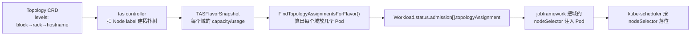
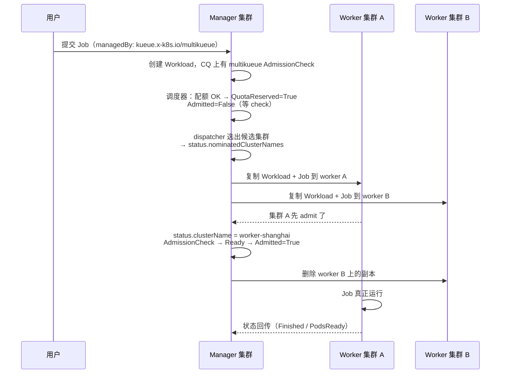
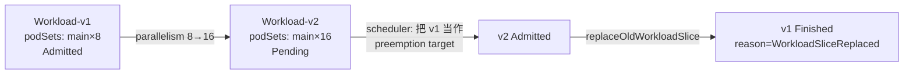

# 核心代码分析（二）：缓存 / 快照与控制器

> 上一篇讲「调度器怎么决策」，本篇讲「决策依据从哪来、决策结果怎么落地」：
>
> - **`pkg/cache/scheduler`**：配额账本树 + Snapshot
> - **`pkg/cache/queue`**：等待队列
> - **`pkg/controller/jobframework`**：Job ⇄ Workload 的桥梁
> - **`pkg/controller/tas`** / **`admissionchecks/multikueue`** / **`workloadslicing`**：三个大特性
>
> 源码基线：**v0.19.1**

---

## 1. 两个 Cache 的分工

Kueue 有**两套独立的缓存**，很容易搞混：

| 包 | 别名 | 存什么 | 谁读 |
|----|------|--------|------|
| `pkg/cache/scheduler` | `schdcache` | **配额账本**：CQ/Cohort 树、每个 (flavor,resource) 的 Quota/Usage、已准入 Workload、TAS 拓扑 | 调度器（通过 `Snapshot()`） |
| `pkg/cache/queue` | `qcache` | **等待队列**：每个 CQ 一个 heap + inadmissible map + second pass 队列 | 调度器（通过 `Heads()`） |
| `pkg/cache/hierarchy` | — | 通用层级树实现（CQ 挂 Cohort、Cohort 挂 Cohort、环检测） | 上面两者共用 |

> 历史上它们分别是 `pkg/cache` 和 `pkg/queue`，现在收拢到 `pkg/cache/` 下。看老资料时注意路径差异。

一个 Workload 在两个缓存里的位置是**互斥**的：

```text
未准入 → 在 qcache 的 heap / inadmissible 里
已准入 → 在 schdcache 的账本里（Usage 已计入）
```

`nominate()` 里那句 `if !workload.NeedsSecondPass(w.Obj) && s.cache.IsAdded(w) { continue }` 就是在防止「已经记账过的 Workload 被重复处理」。

---

## 2. Snapshot：一致性视图

```go
func (c *Cache) Snapshot(ctx context.Context, options ...SnapshotOption) (*Snapshot, error) {
    c.RLock()
    defer c.RUnlock()

    snap := Snapshot{
        Manager:                  hierarchy.NewManager(newCohortSnapshot),
        ResourceFlavors:          make(map[kueue.ResourceFlavorReference]*kueue.ResourceFlavor, len(c.resourceFlavors)),
        InactiveClusterQueueSets: sets.New[kueue.ClusterQueueReference](),
    }
    for _, cohort := range c.hm.Cohorts() {
        if hierarchy.HasCycle(cohort) {
            continue                                    // ★ 成环的 Cohort 整棵跳过
        }
        snap.AddCohort(cohort.Name)
        snap.Cohort(cohort.Name).ResourceNode = cohort.resourceNode.Clone()
        snap.Cohort(cohort.Name).FairWeight = cohort.FairWeight
        if cohort.HasParent() {
            snap.UpdateCohortEdge(cohort.Name, cohort.Parent().Name)
        }
    }
    for _, cq := range c.hm.ClusterQueues() {
        if reason := skipInactiveCQReason(cq); reason != "" {
            snap.InactiveClusterQueueSets.Insert(cq.Name)   // ★ 不活跃 CQ 记下来，nominate 会用
            continue
        }
        ...
    }
    if features.Enabled(features.TopologyAwareScheduling) {
        flvTASCache := c.tasCache.Clone()                  // TAS 拓扑也要快照
        ...
    }
}
```

`resourceNode.Clone()` 只深拷 `Usage`：

```go
// Clone clones the mutable field Usage, while returning copies to
// Quota and SubtreeQuota (these are replaced with new maps upon update).
func (r resourceNode) Clone() resourceNode {
    return resourceNode{
        Quotas:       r.Quotas,          // 共享（不可变）
        SubtreeQuota: r.SubtreeQuota,    // 共享（整体替换而非原地改）
        Usage:        maps.Clone(r.Usage),  // ★ 深拷，调度过程要改
    }
}
```

**只有 `Usage` 是可变的**，这让 Snapshot 非常轻量 —— 大集群里每轮调度都拍快照才不至于成为瓶颈。

### 2.1 快照上的 what-if 推演

调度器在快照上做了大量「假设性修改 + 回滚」，这是 Kueue 一个很好的工程实践：

| 方法 | 用途 | 返回值 |
|------|------|--------|
| `snapshot.SimulateWorkloadRemoval(wls)` | 假设这些 Workload 已被抢占移除 | `revert func()` |
| `snapshot.SimulateWorkloadUsageRemoval(wls)` | 只移除用量（不动 TAS 结构） | `revert func()` |
| `cq.AddUsage(usage)` | 把本轮已决定的准入计入 | — |
| `cq.Fits(usage)` | 判定是否装得下 | `FitsCheck`（`Ok` / `NoTAS` / …） |

用法（`scheduler.go` 的 `fits()`）：

```go
merged := preemptedWorkloads.MergeWithTargets(newTargets)
revertUsage := snapshot.SimulateWorkloadUsageRemoval(merged.Workloads())
defer revertUsage()                        // ★ defer 回滚，保证快照干净
return cq.Fits(*usage)
```

> 对比 Volcano 的 `Statement.Commit/Discard`：思路一致（都是「先试后定」），但 Volcano 的事务面向「多个 Pod 的绑定操作」，Kueue 的推演面向「配额账本的加减」。

---

## 3. 等待队列：Manager 与 ClusterQueue

### 3.1 阻塞式取队头

```go
func (m *Manager) Heads(ctx context.Context) []workload.Info {
    m.Lock()
    defer m.Unlock()
    for {
        workloads := m.heads()
        if len(workloads) != 0 {
            return workloads
        }
        select {
        case <-ctx.Done():
            return nil
        default:
            m.cond.Wait()        // ★ 队列全空 → 阻塞，等新 Workload 唤醒
        }
    }
}
```

`sync.Cond` 是 Kueue 空闲时零 CPU 的原因。任何 Workload 入队（`PushOrUpdate`）都会 `m.cond.Broadcast()`。

### 3.2 每个 CQ 的三个容器

```
ClusterQueue（qcache）
├── heap（可调度的，按 queueingStrategy 排序）
├── inadmissibleWorkloads（本轮判定装不下的，等条件变化再回 heap）
└── stickyWorkload（BestEffortFIFO 专用：正在抢占的队头，锁定不放）
```

什么时候 inadmissible 里的 Workload 会被放回 heap？由 `QueueInadmissibleWorkloads` 触发，条件包括：

- ClusterQueue 的配额/flavor 变更；
- Cohort 里有 Workload 完成（配额释放）；
- ResourceFlavor / AdmissionCheck 变化；
- 定时兜底。

### 3.3 sticky workload 解决什么问题

```go
// stickyWorkload is the workload at the ClusterQueue head which is
// currently preempting workloads. It is only enabled for
// BestEffortFIFO policy, and prevents skipped over ineligible
// workloads from going back to the head of the queue. A workload is
// considered sticky until it is admitted, unschedulable, or deleted.
// See Kueue#6929 and Kueue#7101 for motivation.
```

场景推演（`BestEffortFIFO`，没有 sticky 时）：

```text
轮 1: 作业 T（64卡）当队头 → 需要抢占 → 发起驱逐 → T 被挪到 inadmissible
轮 2: 队头变成作业 D（4卡）→ 受害者刚退出，D 捡到 4 卡直接准入
轮 3: T 回到队头 → 又不够 → 再抢一次
      → T 永远起不来，还白杀了一堆 Pod
```

sticky 让 T 在「admitted / unschedulable / deleted」之前一直占着队头，抢占的收益归它自己。

### 3.4 按 scheduling hash 批量下沉

```go
// handleInadmissibleHash bulk-moves all heap workloads matching the given
// scheduling hash to inadmissibleWorkloads. Returns the number moved.
// Only applies to BestEffortFIFO queues; in StrictFIFO the head workload
// stays in the heap and must not cause equivalent workloads to be skipped.
func (c *ClusterQueue) handleInadmissibleHash(hash workload.EquivalenceHash, reason QuotaReservedReason) int {
    if c.queueingStrategy != kueue.BestEffortFIFO {
        return 0
    }
    c.hashToBulkMoveReason[hash] = reason
    ...
}
```

`workload.SchedulingHash` 是「作业形状」的指纹（PodSet 数量/资源请求/拓扑要求等）。同形状的作业一个 `NoFit`，其余必然 `NoFit`，一次性全部挪走。

配套的入队短路（`PushOrUpdate`）：

```go
// Skip to inadmissible if the workload's equivalence class was already bulk-moved to inadmissible
// (only for BestEffortFIFO; StrictFIFO preserves strict ordering).
if c.queueingStrategy == kueue.BestEffortFIFO && c.workloads.GetActive(key) == nil && wInfo.SchedulingHash != workload.SchedulingHashUnknown {
    if _, has := c.hashToBulkMoveReason[wInfo.SchedulingHash]; has {
        c.workloads.InsertInadmissible(key, wInfo)
        return
    }
}
```

> 这是 Kueue 应对「一次提交 5000 个同质评测任务」的关键优化，指标 `kueue_pending_scheduling_hashes` 可以观察去重后的形状数。

---

## 4. jobframework：Job ⇄ Workload 的桥梁

### 4.1 GenericJob 接口

`pkg/controller/jobframework/interface.go` —— 想接入一种新 workload，只需实现这 10 个方法：

```go
type GenericJob interface {
    Object() client.Object
    IsSuspended() bool
    Suspend()
    // RunWithPodSetsInfo injects node affinity and pod set counts extracted
    // from the workload into the job and unsuspends it.
    RunWithPodSetsInfo(ctx context.Context, c client.Client, podSetsInfo []podset.PodSetInfo) error
    RestorePodSetsInfo(ctx context.Context, podSetsInfo []podset.PodSetInfo) bool
    Finished(ctx context.Context) (message string, success, finished bool)
    PodSets(ctx context.Context, c client.Client) ([]kueue.PodSet, error)
    IsActive() bool
    PodsReady(ctx context.Context, c client.Client) bool
    GVK() schema.GroupVersionKind
}
```

**核心三件套是 `Suspend()` / `RunWithPodSetsInfo()` / `PodSets()`**：前两个是执行器，第三个是「把 Job 翻译成配额申请单」。

另有 20+ 个可选接口按需实现：

| 可选接口 | 用途 |
|---------|------|
| `JobWithReclaimablePods` | 动态归还配额（部分 Pod 完成后释放其配额） |
| `JobWithCustomStop` | 自定义停止逻辑（如 RayJob 要先停 cluster） |
| `JobWithPriorityClass` | 从 Job 读优先级 |
| `JobWithManagedBy` | MultiKueue 的 `managedBy` 协议 |
| `ComposableJob` | 由多个 API 对象组成的作业（如 Pod Group、LWS） |
| `JobWithFinalize` / `JobWithSkip` / `JobWithOnHold` | 生命周期钩子 |
| `TopLevelJob` | 声明「我自己管 Workload，不用往上找 owner」 |
| `ElasticWorkloadNameProvider` | 弹性作业的 Workload 命名 |
| `JobWithCustomValidation` / `JobWithCustomWorkloadConditions` | webhook / 条件定制 |

### 4.2 reconcile 主流程

`ReconcileGenericJob` 的编号注释就是最好的文档：

```go
func (r *JobReconciler) ReconcileGenericJob(ctx context.Context, req ctrl.Request, job GenericJob) (ctrl.Result, error) {
    // 前置：loadJob / Skip / finalize / namespace selector 校验 /
    //       FindAncestorJobManagedByKueue（子 Job 由祖先管时挂起自己）

    // 1. Attempt to retrieve an existing workload (if any) for this job.
    wl, err := r.ensureOneWorkload(ctx, job, object)

    // 2. handle job is on hold.
    // 3. handle job is finished.
    // 3. handle workload is nil.            ← 编号重复（源码如此），此处 = 创建 Workload
    // 4. update reclaimable counts if implemented by the job
    // 5. handle WaitForPodsReady only for a standalone job.
    // 6. handle eviction
    // 7. handle job is suspended.
    if job.IsSuspended() {
        // start the job if the workload has been admitted, and the job is still suspended
        ...
    }
    // 8. handle job is unsuspended.
    if !workload.IsAdmitted(wl) {
        // The job must be suspended if the workload is not yet admitted,
        ...
    }
}
```

两个方向的动作：

**放行（第 7 步 → `startJob`）**：

```go
if err := clientutil.Patch(ctx, r.client, object, func() (bool, error) {
    return true, job.RunWithPodSetsInfo(ctx, r.client, info)
}); err != nil { return err }
r.record.Eventf(object, nil, corev1.EventTypeNormal, ReasonStarted, "Started", msg)
```

`info []podset.PodSetInfo` 里装的是「从 `status.admission` 提取出来的 flavor nodeLabels + tolerations + count（可能被部分准入缩减过）+ TAS nodeSelector」。

**收回（第 8 步 → `stopJob`）**：

```go
if err := clientutil.Patch(ctx, r.client, object, func() (bool, error) {
    job.Suspend()
    if info != nil {
        job.RestorePodSetsInfo(ctx, info)      // ★ 把注入的 nodeSelector/count 还原
    }
    return true, nil
}); err != nil { ... }
```

**`RestorePodSetsInfo` 是必须的**：否则下次准入到另一个 flavor 时，Job 上还残留着上一个 flavor 的 nodeSelector。

### 4.3 `manageJobsWithoutQueueName` 与 namespace 选择器

```go
if r.managedJobsNamespaceSelector == nil {
    log.V(2).Info("ManagedJobsNamespaceSelector is nil; skipping selector enforcement")
} else if !r.managedJobsNamespaceSelector.Matches(labels.Set(ns.GetLabels())) {
    log.V(2).Info("Namespace not opted in for Kueue management", "namespace", ns.Name)
    return ctrl.Result{}, nil
}
```

配合 Configuration：

```yaml
manageJobsWithoutQueueName: true        # 没打 queue-name label 的作业也纳管
managedJobsNamespaceSelector:           # 但只在这些 namespace 生效
  matchLabels:
    kueue.x-k8s.io/managed: "true"
```

> **`manageJobsWithoutQueueName: true` 是个危险开关**：开了之后所有 Job 都会被挂起等配额，包括系统组件的 Job。务必配合 `managedJobsNamespaceSelector` 做白名单。

### 4.4 祖先查找（嵌套作业）

```go
ancestorJob, err = r.integrationManager.FindAncestorJobManagedByKueue(ctx, r.client, object, r.manageJobsWithoutQueueName)
if err != nil {
    if errors.Is(err, ErrManagedOwnersChainLimitReached) { ... }
}
```

场景：`JobSet → Job → Pod`、`RayJob → RayCluster → Pod`、`AppWrapper → PyTorchJob → Job`。只有**最顶层**的对象才生成 Workload，下层对象通过 `shouldSuspendChildJob` 保持挂起：

```go
// For none workload slicing, suspend the job if workload not admitted
return !workload.IsAdmitted(ancestorNotFinishedWorkload), nil
```

`TopLevelJob` 接口用于打断这条向上查找链（声明「我就是顶层」）。

---

## 5. TAS：拓扑感知调度

### 5.1 整体思路

Kueue 的 TAS 和 Volcano 的 HyperNode 目标相同，**手段完全不同**：



**关键差异**：Kueue 只负责「算出每个拓扑域放几个 Pod」，最终的节点选择仍交给 kube-scheduler（通过注入 nodeSelector + `kueue.x-k8s.io/topology` scheduling gate 保证顺序）。Volcano 则是自己直接选节点并 Bind。

### 5.2 注解（PodSet 级）

`apis/kueue/v1beta2/topology_types.go`：

| 注解 | 语义 |
|------|------|
| `kueue.x-k8s.io/podset-required-topology` | **硬约束**：所有 Pod 必须在同一个该层级的域内，否则不准入 |
| `kueue.x-k8s.io/podset-preferred-topology` | **软约束**：先试该层级，装不下逐级向上放宽，最差可分散 |
| `kueue.x-k8s.io/podset-unconstrained-topology` | 无拓扑要求，但仍走 TAS 记账（提高准入准确性） |
| `kueue.x-k8s.io/podset-slice-required-topology` | **子组硬约束**：每个 slice 必须在同一个域内 |
| `kueue.x-k8s.io/podset-slice-size` | slice 大小（配 slice-required-topology 时必填） |
| `kueue.x-k8s.io/podset-slice-required-topology-constraints` | JSON 数组，**多层 slice 约束**（最多 3 层，`TASMultiLayerTopology` gate） |
| `kueue.x-k8s.io/podset-group-name` | 多个 PodSet 归为一组，同 flavor + 同域拟合 |
| `kueue.x-k8s.io/topology` | **scheduling gate**：Pod 创建时加上，注入完 nodeSelector 才摘掉 |

**`slice` 就是大模型推理最需要的语义**：`slice-size: 4` + `slice-required-topology: hostname` 表达「每 4 个 rank 必须同机」（TP=4），而 slice 之间可以跨机。

### 5.3 topologyAssignment 的编码

`Workload.status.admission[].topologyAssignment` 的结构做了大量压缩优化：

```yaml
topologyAssignment:
  levels: [kubernetes.io/hostname]     # 若最低层是 hostname，只需这一层
  slices:
  - domainCount: 4
    valuesPerLevel:
    - individual:
        prefix: block-1-rack-1-node-   # ★ 公共前缀提取
        roots: ["1", "2", "3", "4"]
    podCounts:
      universal: 1                     # ★ 所有域 Pod 数相同则用 universal
```

三种压缩手段（`workload_types.go` 的长注释里有 4 个完整示例）：

1. **prefix / suffix 提取**：节点名有共同前缀时只存差异部分；
2. **universal**：某层所有域取值相同、或所有域 Pod 数相同时，只存一个值；
3. **多 slice 分片**：拆成多个 slice 以获得更长的公共前缀。

> 为什么这么拼命压缩？因为一个 10000 Pod 的作业如果每个 Pod 一个节点名，`Workload` 对象会膨胀到 MB 级，直接冲击 etcd。上限约束是 `slices` ≤ 1000、每个 slice 的 `roots` ≤ 100000。

### 5.4 分配算法

`pkg/cache/scheduler/tas_flavor_snapshot.go`：

```go
func (s *TASFlavorSnapshot) FindTopologyAssignmentsForFlavor(ctx context.Context, flavorTASRequests FlavorTASRequests, options ...FindTopologyAssignmentsOption) TASAssignmentsResult {
    // ① 按 PodSetGroupName 分组（同组必须一起拟合）
    groupedTASRequests := make(map[string]FlavorTASRequests)
    for idx, tr := range flavorTASRequests {
        groupKey := strconv.Itoa(idx)
        if tr.PodSetGroupName != nil { groupKey = *tr.PodSetGroupName }
        groupedTASRequests[groupKey] = append(groupedTASRequests[groupKey], tr)
    }
    // ② 逐组调用 findTopologyAssignment（自底向上贪心 + 域内平衡）
    for _, groupKey := range groupsOrder { ... }
}
```

`findTopologyAssignment` 的核心是「**自底向上聚合每个域的可容纳 Pod 数，再自顶向下挑最紧凑的域**」。相关的 feature gate：

| gate | 作用 |
|------|------|
| `TASProfileMixed` | 混合放置策略 |
| `TASBalancedPlacement` | 域内平衡而非塞满 |
| `TASFailedNodeReplacement` | 节点故障时找替补域（`status.unhealthyNodes`） |
| `TASFailedNodeReplacementFailFast` | 找不到替补就直接驱逐 |
| `TASReplaceNodeOnPodTermination` | Pod 异常终止即触发替换 |
| `TASRecomputeAssignmentWithinSchedulingCycle` | 本轮内冲突时重算（见 02 篇 §4.1） |
| `TASHandleOverlappingFlavors` | 多个 flavor 覆盖同一批节点时的用量聚合 |
| `TASMultiLayerTopology` | 多层 slice 约束 |
| `TASAssignmentsEncodingByHostnamePrefix` | 上面说的前缀压缩 |

### 5.5 节点故障处理

```go
if features.Enabled(features.TASFailedNodeReplacementFailFast) && workload.HasTopologyAssignmentWithUnhealthyNode(e.Obj) && mode != flavorassigner.Fit {
    s.handleFailedTASReplacement(ctx, log, e)     // 找不到替补 → 直接驱逐
    return
}
```

驱逐消息：

```go
msg := fmt.Sprintf("Workload was evicted as there was no replacement for unhealthy node(s): %s", unhealthyNodesCsv)
// Evicted reason = kueue.WorkloadEvictedDueToNodeFailures ("NodeFailures")
```

> **这是大规模训练非常实用的能力**：一个 512 卡作业跑着，某台机器网卡挂了，Kueue 会尝试在同一拓扑域找替补节点，只重排受影响的 Pod；找不到才整体驱逐重排。

---

## 6. MultiKueue：多集群派发

`pkg/controller/admissionchecks/multikueue/`。

### 6.1 组件

| 文件 | 职责 |
|------|------|
| `multikueuecluster.go` | 管理 `MultiKueueCluster`：建远端 client、watch 远端 Workload、维护 `Active` 条件 |
| `remote_client.go` | 远端集群客户端（kubeconfig from Secret / Path / ClusterProfile） |
| `workload.go` | 核心：把 Workload 复制到 worker、同步状态、回收 |
| `admissioncheck.go` | `controllerName: kueue.x-k8s.io/multikueue` 的 AdmissionCheck 控制器 |
| `clusterqueue.go` | manager 侧 CQ 的配额自动化（`MultiKueueManagerQuotaAutomation` 条件） |
| `fswatch.go` | kubeconfig 文件变更监听 |
| `externalframeworks/` | 自定义作业类型适配（`MultiKueueAdaptersForCustomJobs`） |

### 6.2 CRD

```yaml
apiVersion: kueue.x-k8s.io/v1beta2
kind: MultiKueueCluster
metadata: {name: worker-shanghai}
spec:
  clusterSource:
    kubeConfig:
      location: worker-shanghai-secret    # Secret 名，key 固定为 "kubeconfig"
      locationType: Secret                # 或 Path；也可用 clusterProfileRef
---
apiVersion: kueue.x-k8s.io/v1beta2
kind: MultiKueueConfig
metadata: {name: gpu-clusters}
spec:
  clusters:                               # ★ 顺序有意义
  - worker-shanghai
  - worker-beijing
```

`MultiKueueConfigSpec.Clusters` 的注释明确说明：

> *"The order of the list is significant: the Incremental dispatcher nominates clusters following this order, so the most preferred clusters should be listed first."*

### 6.3 工作流程



关键字段：

- `Workload.status.nominatedClusterNames`（最多 20 个）：候选集群；
- `Workload.status.clusterName`：最终落地的集群，**一旦设置不可变**（CEL 校验），与 `nominatedClusterNames` 互斥；
- `managedBy` 字段（`JobWithManagedBy` 接口）：告诉 manager 集群的原生控制器「这个 Job 不由你执行」，避免双跑。

指标：`multikueue_workloads_dispatched_total`、`multikueue_workloads_admitted_total`（按 `cluster_queue` + `cluster` 维度）。

---

## 7. Elastic Jobs：workload slicing

`pkg/workloadslicing/`。这是 Kueue 处理「运行中改并行度」的方案。

**背景**：`Workload.spec.podSets` **不可变**。那怎么支持 `parallelism` 从 8 调到 16？

**答案**：创建一个新的 Workload（slice），准入成功后再结束旧的。



调度器侧的三处配合（`scheduler.go`）：

```go
// ① flavor assignment 阶段：把旧 slice 当作可抢占目标，只计算增量用量
preemptionTargets, replaceableWorkloadSlice := workloadslicing.ReplacedWorkloadSlice(wl, snap)
flvAssigner := flavorassigner.New(wl, cq, snap.ResourceFlavors, ..., replaceableWorkloadSlice, ...)

// ② processEntry：把旧 slice 从抢占目标里分离出来（它应该被"结束"而不是"抢占"）
// The old workload slice is initially included in the preemption targets because it is treated
// as a preemptible target during flavor assignment. However, it should be evicted rather than preempted.
preemptionTargets, oldWorkloadSlice := workloadslicing.FindReplacedSliceTarget(e.Obj, e.preemptionTargets)

// ③ admit 成功后：结束旧 slice
if features.Enabled(features.ElasticJobsViaWorkloadSlices) && oldWorkloadSlice != nil {
    s.replaceOldWorkloadSlice(ctx, log, e, oldWorkloadSlice)
}
```

配套：

- 注解 `kueue.x-k8s.io/workload-slice-name` 串起整条 slice 链；
- `ElasticJobSchedulingGate`（`constants.go`）让新增 Pod 等准入；
- `Assignment.Usage` 只算 **delta**（新 − 旧），避免配额重复计数；
- feature gates：`ElasticJobsViaWorkloadSlices`、`ElasticJobsViaWorkloadSlicesWithTAS`。

> 与 Volcano 对比：Volcano 的弹性靠 `minAvailable < replicas`（超出部分可被抢），是「同一个 PodGroup 内的伸缩」；Kueue 是「换一张申请单」。Kueue 的方式配额账本更严格，但对象数会增长（需要 GC）。

---

## 8. 其他控制器速览

| 控制器 | 路径 | 职责 |
|--------|------|------|
| workload | `pkg/controller/core/workload_controller.go` | Workload 生命周期：入队/出队、条件同步、`maximumExecutionTimeSeconds` 超时、驱逐后重排队与退避 |
| clusterqueue | `pkg/controller/core/clusterqueue_controller.go` | 维护 `Active` 条件（flavor/check/topology 存在性）、`status.flavorsUsage`、`stopPolicy` |
| localqueue | `pkg/controller/core/localqueue_controller.go` | LocalQueue 状态、AFS 用量账本 |
| cohort | `pkg/controller/core/cohort_controller.go` | Cohort 树维护 + 环检测 |
| resourceflavor / topology | 同目录 | flavor 与拓扑对象变更时刷新缓存、唤醒 inadmissible |
| provisioning | `pkg/controller/admissionchecks/provisioning/` | 创建 `ProvisioningRequest`，把扩容结果映射成 `AdmissionCheckState` |
| tas | `pkg/controller/tas/` | 扫 Node 建拓扑树、给 Pod 注入域 nodeSelector、摘 scheduling gate、节点故障检测 |
| dra | `pkg/dra/` | Dynamic Resource Allocation：把 DeviceClass 请求折算进配额 |
| visibility | `pkg/visibility/` | 聚合 API：`kubectl get --raw /apis/visibility.kueue.x-k8s.io/...` 查 pending 队列位次 |

---

## 9. 关键指标

`pkg/metrics/metrics.go`（前缀 `kueue_`，MultiKueue 相关前缀 `multikueue_`）：

| 指标 | 用途 |
|------|------|
| `kueue_admission_attempts_total{result}` | 准入尝试次数，`result` = success / inadmissible |
| `kueue_admission_attempt_duration_seconds` | **一轮 `schedule()` 的耗时**（调优基线） |
| `kueue_pending_workloads{cluster_queue,status}` | 各 CQ 的 pending 数（`status` = active / inadmissible） |
| `kueue_pending_scheduling_hashes` | 去重后的待调度「作业形状」数 |
| `kueue_quota_reserved_wait_time_seconds` | 从创建/重排到拿到配额的等待时间 |
| `kueue_admission_wait_time_seconds` | 从创建/重排到 Admitted 的时间 |
| `kueue_admission_checks_wait_time_seconds` | **拿到配额后等 AdmissionCheck 的时间**（诊断扩容慢） |
| `kueue_ready_wait_time_seconds` / `kueue_admitted_until_ready_wait_time_seconds` | 到 PodsReady 的时间 |
| `kueue_execution_time_seconds` | 作业总执行时长（含 evict/readmit 循环） |
| `kueue_pods_ready_to_evicted_time_seconds` | Pod ready 到被驱逐的时间（抢占影响评估） |
| `kueue_admission_cycle_preemption_skips` | 因抢占目标重叠而被跳过的次数（**争抢激烈的信号**） |
| `kueue_preemption_target_recomputations_total` | 目标重叠触发的重算结果分布（**v0.20+ 新增**，v0.19.1 无此指标） |
| `kueue_admitted_workloads_total` / `kueue_finished_workloads_total` | 吞吐 |
| `multikueue_workloads_dispatched_total` / `_admitted_total` | 多集群派发 |
| 另有全套 `kueue_local_queue_*` 对应指标 | 需开 `LocalQueueMetrics` gate |

下一篇 [04 面向大模型训练与推理的能力地图](04-面向大模型训练与推理的能力地图.md)。
