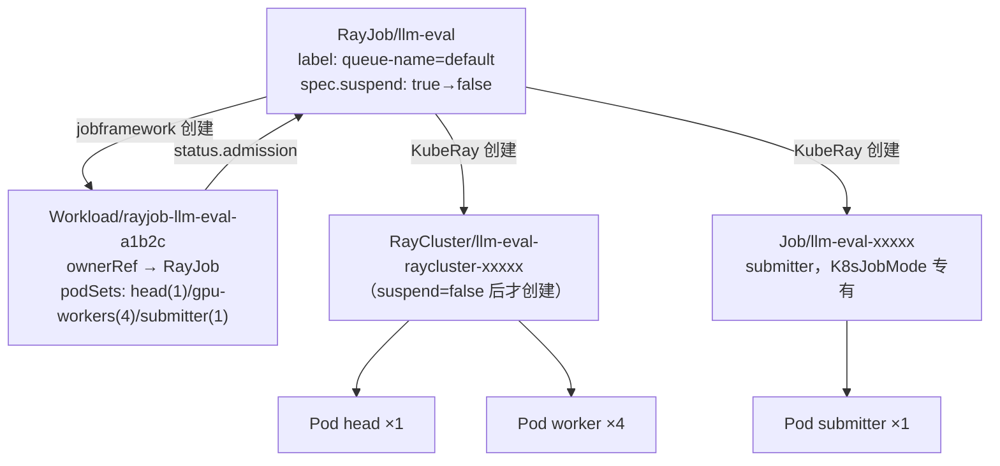
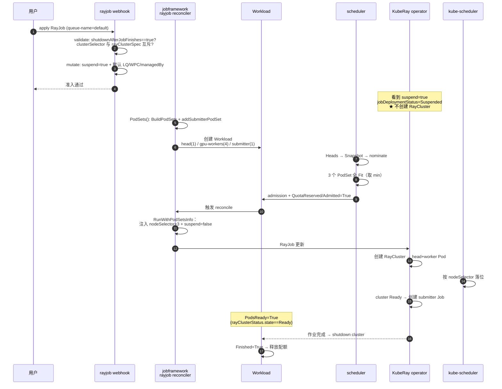
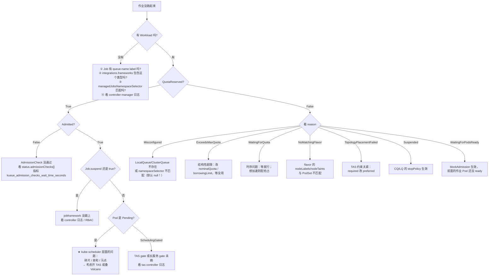

# 实战 Demo

> 从零跑通：安装 → 配额体系 → 批作业 → 分布式训练（JobSet + TAS）→ 推理服务（LWS）→ RayJob 嵌套对象链 → 跨队列借用与回收 → 部分准入 → 排障。
>
> 所有 YAML 使用 `kueue.x-k8s.io/v1beta2`，**版本基线 v0.19.1**。GPU 部分需要集群已装 NVIDIA device plugin；没有 GPU 时把 `nvidia.com/gpu` 换成 `cpu` 也能完整验证配额逻辑。

---

## 0. 安装与验证

### 0.1 安装

```bash
# 官方支持 Kubernetes 1.34+
kubectl apply --server-side -f https://github.com/kubernetes-sigs/kueue/releases/download/v0.19.1/manifests.yaml

# 或用 Helm
helm install kueue oci://registry.k8s.io/kueue/charts/kueue \
  --version 0.19.1 --namespace kueue-system --create-namespace
```

验证：

```bash
kubectl get pods -n kueue-system
# NAME                                        READY   STATUS
# kueue-controller-manager-xxxxxxxxx-xxxxx    1/1     Running   ← 只有一个 Deployment

kubectl get crd | grep kueue
# clusterqueues.kueue.x-k8s.io
# localqueues.kueue.x-k8s.io
# workloads.kueue.x-k8s.io
# cohorts.kueue.x-k8s.io
# resourceflavors.kueue.x-k8s.io
# topologies.kueue.x-k8s.io
# admissionchecks.kueue.x-k8s.io
# workloadpriorityclasses.kueue.x-k8s.io
# provisioningrequestconfigs.kueue.x-k8s.io
# multikueueclusters.kueue.x-k8s.io / multikueueconfigs.kueue.x-k8s.io
```

### 0.2 装 CLI（强烈建议）

```bash
# kueuectl（也可作为 kubectl 插件：kubectl kueue ...）
# 从 release 页面下载对应平台二进制，或：
go install sigs.k8s.io/kueue/cmd/kueuectl@latest

kueuectl list clusterqueue
kueuectl list workload
kueuectl list pods --for job/my-job
```

### 0.3 配置组件（Configuration）

配置在 ConfigMap `kueue-manager-config`（namespace `kueue-system`）：

```bash
kubectl -n kueue-system edit cm kueue-manager-config
```

本篇 Demo 使用的配置：

```yaml
apiVersion: config.kueue.x-k8s.io/v1beta2
kind: Configuration
namespace: kueue-system
manageJobsWithoutQueueName: false      # ★ 保持 false，避免误挂起系统 Job
integrations:
  frameworks:
  - batch/job
  - jobset.x-k8s.io/jobset
  - leaderworkerset.x-k8s.io/leaderworkerset
  - kubeflow.org/pytorchjob
  - ray.io/rayjob
  # - ray.io/raycluster                # ★ 只管 RayJob 时不要开，见第 5 节 §5.9
  - pod
waitForPodsReady:
  enable: true
  timeout: 15m
  blockAdmission: true
  recoveryTimeout: 5m
  requeuingStrategy:
    timestamp: Eviction
    backoffLimitCount: 10
    backoffBaseSeconds: 120
    backoffMaxSeconds: 1800
fairSharing:
  enable: false                        # 先用经典抢占，第 7 节再开
featureGates:
  TopologyAwareScheduling: true        # 0.14+ 已默认开，这里显式声明
```

改完需要重启（Configuration 不支持热加载）：

```bash
kubectl -n kueue-system rollout restart deploy/kueue-controller-manager
kubectl -n kueue-system logs deploy/kueue-controller-manager | head -50
```

---

## 1. 建立配额体系

沿用系列统一示例：8 节点 × 8 A100 = 64 卡，5 台 on-demand（40 卡）+ 3 台 spot（24 卡），两个团队共享。

### 1.1 给节点打标签（模拟异构与拓扑）

```bash
# 机型
for i in 0 1 2 3 4; do kubectl label node gpu-node-$i instance-type=on-demand --overwrite; done
for i in 5 6 7;     do kubectl label node gpu-node-$i instance-type=spot --overwrite; done

# 网络拓扑：两个 block，每 block 两个 rack
kubectl label node gpu-node-0 gpu-node-1 gpu-node-2 gpu-node-3 \
  cloud.provider.com/topology-block=block-1 --overwrite
kubectl label node gpu-node-4 gpu-node-5 gpu-node-6 gpu-node-7 \
  cloud.provider.com/topology-block=block-2 --overwrite
kubectl label node gpu-node-0 gpu-node-1 cloud.provider.com/topology-rack=rack-1 --overwrite
kubectl label node gpu-node-2 gpu-node-3 cloud.provider.com/topology-rack=rack-2 --overwrite
kubectl label node gpu-node-4 gpu-node-5 cloud.provider.com/topology-rack=rack-3 --overwrite
kubectl label node gpu-node-6 gpu-node-7 cloud.provider.com/topology-rack=rack-4 --overwrite
```

### 1.2 apply 配额对象

```yaml
# quota.yaml
apiVersion: kueue.x-k8s.io/v1beta2
kind: Topology
metadata: {name: gpu-topology}
spec:
  levels:
  - nodeLabel: cloud.provider.com/topology-block
  - nodeLabel: cloud.provider.com/topology-rack
  - nodeLabel: kubernetes.io/hostname       # ★ 只能在最低层
---
apiVersion: kueue.x-k8s.io/v1beta2
kind: ResourceFlavor
metadata: {name: a100-ondemand}
spec:
  nodeLabels: {instance-type: on-demand}
  topologyName: gpu-topology                # ★ 启用 TAS
---
apiVersion: kueue.x-k8s.io/v1beta2
kind: ResourceFlavor
metadata: {name: a100-spot}
spec:
  nodeLabels: {instance-type: spot}
  topologyName: gpu-topology
---
apiVersion: kueue.x-k8s.io/v1beta2
kind: Cohort
metadata: {name: llm-pool}
---
apiVersion: kueue.x-k8s.io/v1beta2
kind: ClusterQueue
metadata: {name: team-a}
spec:
  namespaceSelector: {}                     # ★ 必须显式，默认 null 全拒绝
  cohortName: llm-pool
  queueingStrategy: BestEffortFIFO
  resourceGroups:
  - coveredResources: ["cpu", "memory", "nvidia.com/gpu"]
    flavors:
    - name: a100-ondemand                   # ★ 顺序即优先级
      resources:
      - {name: cpu,            nominalQuota: 160}
      - {name: memory,         nominalQuota: 1280Gi}
      - {name: nvidia.com/gpu, nominalQuota: 20, borrowingLimit: 12, lendingLimit: 8}
    - name: a100-spot
      resources:
      - {name: cpu,            nominalQuota: 96}
      - {name: memory,         nominalQuota: 768Gi}
      - {name: nvidia.com/gpu, nominalQuota: 12, borrowingLimit: 12}
  preemption:
    reclaimWithinCohort: LowerPriority
    withinClusterQueue: LowerPriority
---
apiVersion: kueue.x-k8s.io/v1beta2
kind: ClusterQueue
metadata: {name: team-b}
spec:
  namespaceSelector: {}
  cohortName: llm-pool
  queueingStrategy: BestEffortFIFO
  resourceGroups:
  - coveredResources: ["cpu", "memory", "nvidia.com/gpu"]
    flavors:
    - name: a100-ondemand
      resources:
      - {name: cpu,            nominalQuota: 160}
      - {name: memory,         nominalQuota: 1280Gi}
      - {name: nvidia.com/gpu, nominalQuota: 20, borrowingLimit: 12, lendingLimit: 8}
    - name: a100-spot
      resources:
      - {name: cpu,            nominalQuota: 96}
      - {name: memory,         nominalQuota: 768Gi}
      - {name: nvidia.com/gpu, nominalQuota: 12, borrowingLimit: 12}
  preemption:
    reclaimWithinCohort: LowerPriority
    withinClusterQueue: LowerPriority
---
apiVersion: v1
kind: Namespace
metadata: {name: team-a}
---
apiVersion: v1
kind: Namespace
metadata: {name: team-b}
---
apiVersion: kueue.x-k8s.io/v1beta2
kind: LocalQueue
metadata: {namespace: team-a, name: default}
spec: {clusterQueue: team-a}
---
apiVersion: kueue.x-k8s.io/v1beta2
kind: LocalQueue
metadata: {namespace: team-b, name: default}
spec: {clusterQueue: team-b}
---
apiVersion: kueue.x-k8s.io/v1beta2
kind: WorkloadPriorityClass
metadata: {name: high}
value: 100000
description: "high priority (serving / urgent training)"
---
apiVersion: kueue.x-k8s.io/v1beta2
kind: WorkloadPriorityClass
metadata: {name: low}
value: 100
description: "low priority (best-effort training)"
```

```bash
kubectl apply -f quota.yaml
```

### 1.3 验证配额生效

```bash
kueuectl list clusterqueue
# NAME     COHORT     PENDING WORKLOADS   ADMITTED WORKLOADS
# team-a   llm-pool   0                   0
# team-b   llm-pool   0                   0

# ★ 第一件要检查的事：Active 条件
kubectl get cq team-a -o jsonpath='{.status.conditions}' | jq
# [{"type":"Active","status":"True","reason":"Ready","message":"Can admit new workloads"}]
```

`Active=False` 时看 `reason`，对照 00 篇 §5.2：`FlavorNotFound` / `TopologyNotFound` / `AdmissionCheckNotFound` / `Stopped` / `MultiKueueWithProvisioningRequest` 等。

**手算一遍配额上限**（对应 01 篇 §2.4）：

```text
team-a.a100-ondemand:
  localQuota   = 20 − 8 = 12          自留 12 卡不外借
  上交 cohort  = 20 − 12 = 8
cohort.SubtreeQuota(ondemand) = 8 + 8 = 16
team-a 实际可用上限 = min(nominal + borrowingLimit, 12 + cohort可用)
                    = min(20 + 12, 12 + 16) = 28  →  受 borrowingLimit 约束为 32? 
                    实测以 status.flavorsUsage 为准
```

> 不用死记公式，直接跑第 6 节的借用 Demo 观察 `status.flavorsUsage[].resources[].borrowed` 就能验证。

---

## 2. Demo A：最简批作业（理解 suspend 机制）

```yaml
# sample-job.yaml
apiVersion: batch/v1
kind: Job
metadata:
  generateName: sample-job-
  namespace: team-a
  labels:
    kueue.x-k8s.io/queue-name: default      # ★ 接入 Kueue
spec:
  parallelism: 3
  completions: 3
  suspend: true                             # 也可不写，webhook 会自动设
  template:
    spec:
      restartPolicy: Never
      containers:
      - name: dummy
        image: registry.k8s.io/e2e-test-images/agnhost:2.53
        args: ["pause"]
        resources:
          requests: {cpu: "1", memory: 200Mi}
```

```bash
kubectl create -f sample-job.yaml
```

观察三个对象的联动：

```bash
# ① Job 从 suspend 变 running
kubectl -n team-a get job -w
# NAME              SUSPEND   COMPLETIONS
# sample-job-abcde  true      0/3          ← Pod 一个都没有
# sample-job-abcde  false     0/3          ← 被 admit，Pod 开始创建

# ② Workload 的条件流转（★ 最重要）
kueuectl -n team-a list workload
# NAME                     JOB TYPE   JOB NAME           LOCALQUEUE   CLUSTERQUEUE   STATUS     AGE
# job-sample-job-abcde-x   Job        sample-job-abcde   default      team-a         ADMITTED   3s

kubectl -n team-a get workload -o yaml | yq '.items[0].status'
# conditions:
#   - type: QuotaReserved   status: "True"   reason: QuotaReserved
#   - type: Admitted        status: "True"   reason: Admitted
# admission:
#   clusterQueue: team-a
#   podSetAssignments:
#   - name: main
#     count: 3
#     flavors: {cpu: a100-ondemand, memory: a100-ondemand}
#     resourceUsage: {cpu: "3", memory: 600Mi}

# ③ Pod 上被注入了 flavor 的 nodeLabels
kubectl -n team-a get pod -o jsonpath='{.items[0].spec.nodeSelector}' | jq
# {"instance-type":"on-demand"}      ← ★ 这是 RunWithPodSetsInfo 注入的
```

### 2.1 验证「装不下就不创建 Pod」

```bash
# 提交一个远超配额的作业
kubectl -n team-a create -f - <<'EOF'
apiVersion: batch/v1
kind: Job
metadata:
  generateName: too-big-
  labels: {kueue.x-k8s.io/queue-name: default}
spec:
  parallelism: 1
  template:
    spec:
      restartPolicy: Never
      containers:
      - name: c
        image: registry.k8s.io/e2e-test-images/agnhost:2.53
        args: ["pause"]
        resources: {requests: {cpu: "10000"}}
EOF

kubectl -n team-a get pod            # ← 一个 Pod 都没有
kubectl -n team-a describe workload | tail -20
# Conditions:
#   Type            Status  Reason            Message
#   QuotaReserved   False   ExceedsMaxQuota   couldn't assign flavors to pod set main:
#                                             insufficient quota for cpu in flavor a100-ondemand
```

**`ExceedsMaxQuota` 意味着「等也没用」**（01 篇 §1.1）—— 请求量超过了 CQ + Cohort 的结构性上限。删掉它：

```bash
kubectl -n team-a delete job -l 'job-name' --field-selector=status.successful=0 2>/dev/null
kubectl -n team-a delete job --all
```

---

## 3. Demo B：分布式训练（JobSet + TAS）

前置：安装 JobSet（`kubectl apply --server-side -f https://github.com/kubernetes-sigs/jobset/releases/download/v0.9.2/manifests.yaml`），并确保 Configuration 的 `integrations.frameworks` 含 `jobset.x-k8s.io/jobset`。

### 3.1 硬拓扑约束：8 个 Pod 必须同 block

```yaml
# train-jobset.yaml
apiVersion: jobset.x-k8s.io/v1alpha2
kind: JobSet
metadata:
  name: pretrain-t
  namespace: team-a
  labels:
    kueue.x-k8s.io/queue-name: default
    kueue.x-k8s.io/priority-class: high
spec:
  replicatedJobs:
  - name: worker
    replicas: 4                      # 4 个 Pod（示例缩小规模）
    template:
      spec:
        parallelism: 1
        completions: 1
        backoffLimit: 0
        template:
          metadata:
            annotations:
              # ★ 硬约束：所有 Pod 必须落在同一个 block
              kueue.x-k8s.io/podset-required-topology: cloud.provider.com/topology-block
          spec:
            restartPolicy: Never
            containers:
            - name: trainer
              image: pytorch/pytorch:2.3.0-cuda12.1-cudnn8-runtime
              command: ["sleep", "600"]
              resources:
                limits: {nvidia.com/gpu: 2, cpu: 8, memory: 64Gi}
```

```bash
kubectl apply -f train-jobset.yaml
```

观察 TAS 分配结果：

```bash
kubectl -n team-a get workload -o yaml | yq '.items[0].status.admission.podSetAssignments[0].topologyAssignment'
# levels:
#   - kubernetes.io/hostname
# slices:
#   - domainCount: 4
#     valuesPerLevel:
#       - individual:
#           prefix: gpu-node-
#           roots: ["0", "1", "2", "3"]      ← ★ 前缀压缩（03 篇 §5.3）
#     podCounts:
#       universal: 1

# 验证 Pod 真的落在同一个 block
kubectl -n team-a get pod -o custom-columns=\
NAME:.metadata.name,NODE:.spec.nodeName,SELECTOR:.spec.nodeSelector | column -t
```

### 3.2 观察 scheduling gate

TAS 作业的 Pod 会先带一个门控，等 nodeSelector 注入完才摘掉：

```bash
kubectl -n team-a get pod -o jsonpath='{.items[0].spec.schedulingGates}'
# 准入前：[{"name":"kueue.x-k8s.io/topology"}]
# 准入后：（空）
```

### 3.3 制造拓扑不满足，验证硬约束

把 `replicas` 提到 6（超过单个 block 的 4 台机器可提供的量），重新 apply：

```bash
kubectl -n team-a describe workload | tail -15
# Conditions:
#   Type            Status  Reason                     Message
#   QuotaReserved   False   TopologyPlacementFailed    topology "cloud.provider.com/topology-block"
#                                                      allows to fit only 4 out of 6 pod(s)
```

改成软约束 `kueue.x-k8s.io/podset-preferred-topology` 再试 —— 会看到它逐级放宽到 rack 之上、最终跨 block 分散并成功准入。

### 3.4 slice 约束：TP 组同机

```yaml
metadata:
  annotations:
    kueue.x-k8s.io/podset-slice-required-topology: kubernetes.io/hostname
    kueue.x-k8s.io/podset-slice-size: "2"     # 每 2 个 Pod 必须同机
```

`topologyAssignment.podCounts` 会变成每个 hostname 域 2 个 Pod。

---

## 4. Demo C：推理服务（LeaderWorkerSet 多机 TP）

前置：安装 LWS（`kubectl apply --server-side -f https://github.com/kubernetes-sigs/lws/releases/download/v0.7.0/manifests.yaml`），Configuration 的 `integrations.frameworks` 含 `leaderworkerset.x-k8s.io/leaderworkerset`。

```yaml
# serve-lws.yaml
apiVersion: leaderworkerset.x-k8s.io/v1
kind: LeaderWorkerSet
metadata:
  name: vllm-tp2
  namespace: team-b
  labels:
    kueue.x-k8s.io/queue-name: default
    kueue.x-k8s.io/priority-class: high        # ★ 推理高优
spec:
  replicas: 2
  leaderWorkerTemplate:
    size: 2                                    # 每副本 2 个 Pod（TP=2）
    leaderTemplate:
      metadata:
        annotations:
          kueue.x-k8s.io/podset-slice-required-topology: kubernetes.io/hostname
          kueue.x-k8s.io/podset-slice-size: "2"
      spec:
        containers:
        - name: vllm-leader
          image: vllm/vllm-openai:latest
          args: ["--model=Qwen/Qwen2.5-1.5B-Instruct", "--tensor-parallel-size=2"]
          ports: [{containerPort: 8000}]
          resources: {limits: {nvidia.com/gpu: 1, cpu: 8, memory: 32Gi}}
    workerTemplate:
      metadata:
        annotations:
          kueue.x-k8s.io/podset-slice-required-topology: kubernetes.io/hostname
          kueue.x-k8s.io/podset-slice-size: "2"
      spec:
        containers:
        - name: vllm-worker
          image: vllm/vllm-openai:latest
          resources: {limits: {nvidia.com/gpu: 1, cpu: 8, memory: 32Gi}}
```

```bash
kubectl apply -f serve-lws.yaml

# LWS 自己创建 Workload（Kueue 识别它是顶层对象）
kueuectl -n team-b list workload
# NAME                    JOB TYPE            JOB NAME    ...   STATUS
# leaderworkerset-...     LeaderWorkerSet     vllm-tp2          ADMITTED

# Workload 有多个 PodSet（leader + workers）
kubectl -n team-b get workload -o yaml | yq '.items[0].spec.podSets[].name'
```

### 4.1 长服务的 gated Pod

```bash
# 把 replicas 提到很大，超出配额
kubectl -n team-b patch lws vllm-tp2 --type=merge -p '{"spec":{"replicas":20}}'

kubectl -n team-b get pod | head
# NAME            READY   STATUS             
# vllm-tp2-5-0    0/1     SchedulingGated    ← ★ Pod 已创建但被门控挡住
```

这是长服务与批作业的差异（04 篇 §2.2）：Deployment / StatefulSet / LWS 没有 `suspend`，Kueue 用 scheduling gate 实现等待。

---

## 5. Demo D：RayJob（多 PodSet 与嵌套对象链）

> 前三个 Demo 里对象与 Pod 基本是一层关系。RayJob 不同：它是 `RayJob → RayCluster → Pod` 再加一个旁路 submitter Job 的**嵌套对象链**，而且 Kueue 会为它生成**三个 PodSet**（其中一个用户在 YAML 里根本看不见）。
>
> 这是验证 **jobframework 祖先查找**（03 篇 §4.4）、**多 PodSet 的 gang 语义**（02 篇 §3.1）、**中间产物全链路**最好的例子。
>
> 涉及源码：`pkg/controller/jobs/rayjob/{rayjob_controller,rayjob_webhook}.go`、`pkg/controller/jobs/raycluster/`

前置：

```bash
# 安装 KubeRay operator
helm repo add kuberay https://ray-project.github.io/kuberay-helm/
helm install kuberay-operator kuberay/kuberay-operator --version 1.2.2
```

并确保 Configuration 的 `integrations.frameworks` 含 `ray.io/rayjob`（§0.3 已配）。

### 5.1 提交对象

```yaml
# rayjob-demo.yaml
apiVersion: ray.io/v1
kind: RayJob
metadata:
  name: llm-eval
  namespace: team-a
  labels:
    kueue.x-k8s.io/queue-name: default          # ★ 接入 Kueue，唯一必填
    kueue.x-k8s.io/priority-class: low
spec:
  shutdownAfterJobFinishes: true                # ★ Kueue 强制要求 true，否则 webhook 拒绝
  submissionMode: K8sJobMode                    # 默认值，会额外产生一个 submitter PodSet
  entrypoint: python /home/ray/samples/eval.py
  # clusterSelector: {}                         # ★ 绝对不能填，与 rayClusterSpec 互斥
  rayClusterSpec:
    rayVersion: '2.9.0'
    headGroupSpec:
      rayStartParams: {dashboard-host: '0.0.0.0'}
      template:
        metadata:
          annotations:
            kueue.x-k8s.io/podset-preferred-topology: cloud.provider.com/topology-rack
        spec:
          containers:
          - name: ray-head
            image: rayproject/ray:2.9.0
            resources:
              requests: {cpu: "4", memory: 16Gi}
              limits:   {cpu: "4", memory: 16Gi}
    workerGroupSpecs:
    - groupName: gpu-workers                    # ★ 这个名字会直接变成 PodSet 名
      replicas: 4
      minReplicas: 4                            # ★ 必须 = replicas = maxReplicas，见 §5.9
      maxReplicas: 4
      numOfHosts: 1                             # >1 时 count = replicas × numOfHosts
      template:
        metadata:
          annotations:
            kueue.x-k8s.io/podset-preferred-topology: cloud.provider.com/topology-rack
        spec:
          containers:
          - name: ray-worker
            image: rayproject/ray:2.9.0
            resources:
              limits: {nvidia.com/gpu: 2, cpu: "8", memory: 64Gi}
```

```bash
kubectl apply -f rayjob-demo.yaml
```

### 5.2 阶段①：webhook

Webhook 路径 `/mutate-ray-io-v1-rayjob`（create）与 `/validate-ray-io-v1-rayjob`（create + update），`failurePolicy: fail`。

**Defaulting 四步**（`rayjob_webhook.go` → `Default()`）：

| 步骤 | 函数 | 产物 |
|------|------|------|
| 1 | `ApplyDefaultLocalQueueWithManagedJobsNamespaceSelector` | 补 `kueue.x-k8s.io/queue-name` 标签（命名空间受管且存在默认 LocalQueue 时） |
| 2 | `ApplyDefaultWorkloadPriorityClass` | 补默认 WorkloadPriorityClass |
| 3 | `ApplyDefaultForSuspend` | **`spec.suspend = true`** ← 执行开关 |
| 4 | `ApplyDefaultForManagedBy` | MultiKueue 开启时设 `spec.managedBy` |

**RayJob 专属校验**（`validateCreate`，仅在受 Kueue 管理时执行）：

| 组合 | 结果 |
|------|------|
| `clusterSelector` 非空 + `rayClusterSpec` 非空 | ❌ `a kueue managed job should not use an existing cluster` |
| `clusterSelector` 非空 + `rayClusterSpec` nil | ✅ 合法，但 `Skip()` 返回 true → **完全脱离 Kueue 管理** |
| `clusterSelector` 空 + `rayClusterSpec` nil | ❌ `rayClusterSpec is required for Kueue-managed jobs...` |
| `clusterSelector` 空 + `rayClusterSpec` 非空 | ✅ 继续 `raycluster.ValidateCreate` + TAS 注解校验 |
| `shutdownAfterJobFinishes != true` | ❌ `a kueue managed job should delete the cluster after finishing` |

最后一条是 RayJob 独有的硬约束：集群不销毁 = Pod 不退出 = Workload 不 Finished = **配额永不释放**。

```bash
# 此刻只有 RayJob，下游对象一个都没有
kubectl -n team-a get rayjob,raycluster,job,pod
# NAME                       JOB STATUS   DEPLOYMENT STATUS
# rayjob.ray.io/llm-eval                  Suspended      ← KubeRay 看到 suspend=true 就停手
```

### 5.3 阶段②：PodSets() 翻译成三个 PodSet

`RayJob.PodSets()` 走四步（`rayjob_controller.go`）：

```go
1. raycluster.BuildPodSets(spec.RayClusterSpec, annotations)   // head + 各 worker group
2. addSubmitterPodSet(podSets)         // 仅 K8sJobMode，追加名为 "submitter" 的 PodSet
3. addSidecarSubmitterToHeadPodSet()   // 仅 SidecarMode，往 head PodSet 塞一个容器
4. raycluster.UpdatePodSets(...)       // 按 autoscaling / 已存在集群状态修正
```

命名与计数规则：

| 索引 | 名称 | count | 来源 |
|------|------|-------|------|
| 0 | `head` | 固定 1 | `headGroupPodSetName` 常量 |
| 1..n | `<groupName>`，本例 `gpu-workers` | `replicas × max(1, numOfHosts)` = 4 | `workerGroupSpecs[i].GroupName` |
| **末位** | `submitter` | 1 | 仅 `K8sJobMode`。**顺序约定：submitter 恒在最后**，`RunWithPodSetsInfo` / `RestorePodSetsInfo` 都依赖它 |

`submitter` 的默认资源（用户未提供 `submitterPodTemplate` 时，镜像同 head、`restartPolicy: Never`）：

| | requests | limits |
|--|---------|--------|
| cpu | 500m | 1 |
| memory | 200Mi | 1Gi |

生成的 Workload：

```yaml
apiVersion: kueue.x-k8s.io/v1beta2
kind: Workload
metadata:
  name: rayjob-llm-eval-a1b2c            # GetWorkloadNameForOwnerWithGVK：<kind小写>-<name>-<hash>
  namespace: team-a
  ownerReferences:
  - {apiVersion: ray.io/v1, kind: RayJob, name: llm-eval, controller: true}
  labels: {kueue.x-k8s.io/job-uid: <RayJob UID>}
  finalizers: [kueue.x-k8s.io/resource-in-use]
spec:
  queueName: default
  priority: 100
  priorityClassRef: {group: kueue.x-k8s.io, kind: WorkloadPriorityClass, name: low}
  active: true
  podSets:                                # ★ 创建后不可变
  - {name: head,        count: 1, topologyRequest: {preferred: .../topology-rack}, template: {...}}
  - {name: gpu-workers, count: 4, topologyRequest: {preferred: .../topology-rack}, template: {...}}
  - {name: submitter,   count: 1, template: {...}}      # ★ 用户 YAML 里看不见的一份配额
```

聚合出的 `TotalRequests`：

```text
nvidia.com/gpu : 0    + 4×2    + 0      = 8
cpu            : 4    + 4×8    + 0.5    = 36.5
memory         : 16Gi + 4×64Gi + 200Mi ≈ 272.2Gi
```

### 5.4 阶段③④⑤：入队 → 调度 → 准入

```text
③ workload controller → qcache：workload.Info（3 个 PodSetResources）推进 team-a 的 heap
④ scheduler 一轮 schedule()（02 篇 §1.1 六步）：
     nominate() 对 3 个 PodSet 分别选 flavor
       head        → a100-ondemand  Fit
       gpu-workers → a100-ondemand  Fit（TAS 软约束：先试 rack，装不下逐级放宽）
       submitter   → a100-ondemand  Fit
     RepresentativeMode = min(Fit, Fit, Fit) = Fit     ← ★ gang 语义
⑤ admit()：同步写 schdcache 账本 → 异步 patch apiserver
```

**3 个 PodSet 只要 1 个装不下，整个 RayJob 就不准入** —— 所以 submitter 那 500m CPU 也可能成为压垮骆驼的最后一根稻草（§5.9）。

准入后的 `status`：

```yaml
status:
  admission:
    clusterQueue: team-a
    podSetAssignments:
    - name: head
      count: 1
      flavors: {cpu: a100-ondemand, memory: a100-ondemand}
      resourceUsage: {cpu: "4", memory: 16Gi}
      topologyAssignment:
        levels: [kubernetes.io/hostname]
        slices: [{domainCount: 1,
                  valuesPerLevel: [{individual: {prefix: "gpu-node-", roots: ["0"]}}],
                  podCounts: {universal: 1}}]
    - name: gpu-workers
      count: 4
      flavors: {cpu: a100-ondemand, memory: a100-ondemand, nvidia.com/gpu: a100-ondemand}
      resourceUsage: {cpu: "32", memory: 256Gi, nvidia.com/gpu: "8"}
      topologyAssignment:
        slices: [{domainCount: 4,
                  valuesPerLevel: [{individual: {prefix: "gpu-node-", roots: ["0","1","2","3"]}}],
                  podCounts: {universal: 1}}]
    - name: submitter
      count: 1
      flavors: {cpu: a100-ondemand, memory: a100-ondemand}
      resourceUsage: {cpu: 500m, memory: 200Mi}
  conditions:
  - {type: QuotaReserved, status: "True", reason: QuotaReserved}
  - {type: Admitted,      status: "True", reason: Admitted}
```

### 5.5 阶段⑥⑦：放行与对象链展开

```go
func (j *RayJob) RunWithPodSetsInfo(ctx, c, podSetsInfo []podset.PodSetInfo) error {
    expectedLen := j.expectedPodSetsCount()          // 1(head) + 1(workerGroup) + 1(submitter) = 3
    if len(podSetsInfo) != expectedLen {
        return podset.BadPodSetsInfoLenError(expectedLen, len(podSetsInfo))
    }
    j.Spec.Suspend = ptr.To(false)                   // ★ 放行
    raycluster.UpdateRayClusterSpecToRunWithPodSetsInfo(log, &j.Spec.RayClusterSpec, podSetsInfo)
    if j.Spec.SubmissionMode == rayv1.K8sJobMode {
        info := podSetsInfo[expectedLen-1]           // ★ submitter 恒在末位
        podset.Merge(&template.ObjectMeta, &template.Spec, info)
        if j.Spec.SubmitterPodTemplate == nil {      // 用户已提供模板时 Merge 已就地改
            j.Spec.SubmitterPodTemplate = template
        }
    }
}
```

回写到 RayJob 对象的字段：

| 路径 | 变更 |
|------|------|
| `spec.suspend` | `true` → **`false`** |
| `spec.rayClusterSpec.headGroupSpec.template.spec.nodeSelector` | 注入 `{instance-type: on-demand}` + TAS 域标签 |
| `spec.rayClusterSpec.workerGroupSpecs[0].template.spec.{nodeSelector,tolerations}` | 同上 |
| `spec.submitterPodTemplate.spec.nodeSelector` | 注入（K8sJobMode） |

之后 KubeRay 接管，对象链依次展开：

```text
RayJob(suspend=false)
   ↓ KubeRay rayjob controller
RayCluster/llm-eval-raycluster-xxxxx              ← ★ 此刻才被创建
   ↓ KubeRay raycluster controller
Pod  llm-eval-raycluster-xxxxx-head-xxxxx           (label ray.io/cluster=...)
Pod  llm-eval-raycluster-xxxxx-worker-gpu-workers-xxxxx × 4
   ↓ RayCluster 变 Ready 后
Job/llm-eval-xxxxx (submitter)  →  Pod llm-eval-xxxxx-xxxxx
   ↓
kube-scheduler 按注入的 nodeSelector 落位
```

Kueue 侧的三点配合：

- reconciler 额外 `Watches(&rayv1.RayCluster{}, EnqueueRequestForOwner(&rayv1.RayJob{}, OnlyControllerOwner()))`，RayCluster 状态变化回灌 RayJob 的 reconcile；
- `PodsReady()` 判据是 `status.rayClusterStatus.state == Ready`（**不是数 Pod**）；
- 若同时开了 `ray.io/raycluster` 集成，子 RayCluster 会被 `FindAncestorJobManagedByKueue`（03 篇 §4.4）识别为「祖先 RayJob 已管」而**不再单独生成 Workload**。

### 5.6 对象关系与时序





### 5.7 观测命令

```bash
# ① Workload 的三个 PodSet（★ 确认 submitter 在，且在末位）
kubectl -n team-a get workload -o yaml | yq '.items[0].spec.podSets[] | {name, count}'
# {name: head, count: 1}
# {name: gpu-workers, count: 4}
# {name: submitter, count: 1}

# ② 准入结果
kubectl -n team-a get workload -o yaml | yq '.items[0].status.admission.podSetAssignments'

# ③ 下游对象依次出现
kubectl -n team-a get rayjob,raycluster,job,pod -w

# ④ 注入痕迹
kubectl -n team-a get raycluster -o jsonpath='{.items[0].spec.workerGroupSpecs[0].template.spec.nodeSelector}'
# {"instance-type":"on-demand","kubernetes.io/hostname":"gpu-node-1"}

# ⑤ 配额账本
kubectl get cq team-a -o yaml | yq '.status.flavorsUsage'

# ⑥ 不准入时
kubectl -n team-a describe workload | tail -20
kueuectl list pods --for rayjob/llm-eval
```

### 5.8 结束与配额释放

```go
Finished() -> finished = JobDeploymentStatus ∈ {Failed, Complete}
              success  = JobStatus == Succeeded
IsActive() -> JobDeploymentStatus ∉ {Suspended, New}
IsOnHold() -> JobDeploymentStatus == ValidationFailed     // KubeRay 校验失败 → 挂起等待
```

`shutdownAfterJobFinishes: true` → KubeRay 删 RayCluster → Pod 消失 → Workload 打 `Finished=True` → 摘 finalizer → schdcache 释放 8 卡 → `QueueInadmissibleWorkloads()` 唤醒队列里等着的作业。

### 5.9 RayJob 特有的六个坑

| # | 坑 | 现象 | 处理 |
|---|----|------|------|
| 1 | **同时开 `ray.io/raycluster` 集成** | 排障时要同时看两层对象，容易误判 | 只提交 RayJob 时别开；只有独立提交长期 RayCluster 才需要 |
| 2 | **submitter 的隐形配额** | GPU 明明够，却卡在 `WaitingForQuota` / `NoMatchingFlavor` | `K8sJobMode` 凭空多一个 PodSet（500m CPU / 200Mi）。改 `submissionMode: SidecarMode`（并进 head PodSet，PodSet 数回到 2），或显式给小的 `submitterPodTemplate`。另需确认 CQ 的 `coveredResources` 含 `cpu` |
| 3 | **`shutdownAfterJobFinishes` 必须 true** | webhook 直接拒绝 | 集群不销毁 = 配额永不释放，这是硬约束 |
| 4 | **`clusterSelector` 一填就脱管** | RayJob 提交后**没有任何 Workload**，也无报错 | `Skip()` 直接返回 true。看到「没生成 Workload」先查这个字段 |
| 5 | **autoscaling 与静态配额冲突** | Ray autoscaler 自行增删 worker，账本对不上 | 固定 `replicas == minReplicas == maxReplicas`；要弹性走 Elastic Jobs（03 篇 §7） |
| 6 | **驱逐还原静默失败** | 换 flavor 后 Pod 上残留旧 nodeSelector | RayJob 未实现 `JobWithCustomStop`，走通用 `Suspend()` + `RestorePodSetsInfo()`；后者数量不匹配时**只打 `V(2)` 日志**「Skipping pod set info restore」并返回 false。运行中改过 `workerGroupSpecs` 数量就会踩到，需 `-v=2` 才看得见 |

---

## 6. Demo E：跨队列借用与回收

### 6.1 让 team-a 借用 team-b 的配额

```bash
# team-b 完全空闲，team-a 提交一个超出自己 nominalQuota 的作业
kubectl -n team-a create -f - <<'EOF'
apiVersion: batch/v1
kind: Job
metadata:
  generateName: borrow-
  labels:
    kueue.x-k8s.io/queue-name: default
    kueue.x-k8s.io/priority-class: low        # ★ 低优，方便后面被抢
spec:
  parallelism: 13                             # 13 卡 > nominalQuota 的 12 卡自留
  completions: 13
  template:
    spec:
      restartPolicy: Never
      containers:
      - name: c
        image: registry.k8s.io/e2e-test-images/agnhost:2.53
        args: ["pause"]
        resources: {limits: {nvidia.com/gpu: 1}}
EOF
```

观察借用量：

```bash
kubectl get cq team-a -o yaml | yq '.status.flavorsUsage'
# - name: a100-ondemand
#   resources:
#     - name: nvidia.com/gpu
#       total: "13"
#       borrowed: "1"          ← ★ 超出 localQuota(12) 的部分记为 borrowed
```

**这就验证了 01 篇 §2.2 的冒泡逻辑**：前 12 卡花自留额度，第 13 卡才向 cohort 记账。

### 6.2 team-b 回收自己的配额

```bash
# team-b 提交高优作业，需要 20 卡（它的 nominalQuota）
kubectl -n team-b create -f - <<'EOF'
apiVersion: batch/v1
kind: Job
metadata:
  generateName: reclaim-
  labels:
    kueue.x-k8s.io/queue-name: default
    kueue.x-k8s.io/priority-class: high       # ★ 高优
spec:
  parallelism: 20
  completions: 20
  template:
    spec:
      restartPolicy: Never
      containers:
      - name: c
        image: registry.k8s.io/e2e-test-images/agnhost:2.53
        args: ["pause"]
        resources: {limits: {nvidia.com/gpu: 1}}
EOF
```

观察抢占过程：

```bash
# ① 抢占事件
kubectl -n team-a get events --sort-by=.lastTimestamp | grep -i preempt
# Warning  Preempted  workload/job-borrow-xxx
#   Preempted to accommodate a workload (UID: ..., JobUID: ...) due to reclamation within the cohort;
#   preemptor path: llm-pool/team-b; preemptee path: llm-pool/team-a
#   ↑ ★ preemptor path / preemptee path 直接指出 cohort 树上的抢占关系

# ② 受害者 Workload 的条件
kubectl -n team-a get workload -o yaml | yq '.items[0].status.conditions'
# - type: Evicted     status: "True"   reason: Preempted
# - type: Preempted   status: "True"   reason: InCohortReclamation     ← ★
# - type: Requeued    status: "True"   reason: ...

# ③ 抢占者的中间状态（可能一闪而过）
kubectl -n team-b describe workload | grep -A3 QuotaReserved
# QuotaReserved  False  WaitingForPreemptedWorkloads
#   ... Pending the preemption of 1 workload(s)
#   ↑ ★ 抢占跨两轮：本轮驱逐，下轮 admit（02 篇 §4）

# ④ 退避状态
kubectl -n team-a get workload -o yaml | yq '.items[0].status.requeueState'
# count: 1
# requeueAt: "2026-08-17T..."

# ⑤ 驱逐统计
kubectl -n team-a get workload -o yaml | yq '.items[0].status.schedulingStats'
# evictions:
#   - reason: Preempted
#     underlyingCause: ""
#     count: 1
```

### 6.3 验证「保底」：lendingLimit 生效

```bash
# 清理，然后让 team-b 尝试借光 team-a 的配额
kubectl -n team-a delete job --all; kubectl -n team-b delete job --all
sleep 10

kubectl -n team-b create -f - <<'EOF'
apiVersion: batch/v1
kind: Job
metadata:
  generateName: greedy-
  labels: {kueue.x-k8s.io/queue-name: default}
spec:
  parallelism: 40
  completions: 40
  template:
    spec:
      restartPolicy: Never
      containers:
      - name: c
        image: registry.k8s.io/e2e-test-images/agnhost:2.53
        args: ["pause"]
        resources: {limits: {nvidia.com/gpu: 1}}
EOF

kubectl get cq team-b -o yaml | yq '.status.flavorsUsage'
# total 最多到 20（nominal）+ 8（team-a 愿借出的 lendingLimit）= 28
# 而不是 40 —— team-a 的 12 卡自留额度被保护住了
```

**这就是 Kueue 表达 SLA 的方式**（04 篇 §3）：`lendingLimit` 是保底，`borrowingLimit` 是上限。

---

## 7. Demo F：部分准入与公平共享

### 7.1 PartialAdmission（弹性训练）

```yaml
apiVersion: batch/v1
kind: Job
metadata:
  generateName: elastic-
  namespace: team-a
  labels: {kueue.x-k8s.io/queue-name: default}
  annotations:
    # ★ 允许缩到最少 4 个 Pod
    kueue.x-k8s.io/job-min-parallelism: "4"
spec:
  parallelism: 20
  completions: 20
  template:
    spec:
      restartPolicy: Never
      containers:
      - name: c
        image: registry.k8s.io/e2e-test-images/agnhost:2.53
        args: ["pause"]
        resources: {limits: {nvidia.com/gpu: 1}}
```

```bash
kubectl -n team-a get job -o jsonpath='{.items[0].spec.parallelism}'
# 12        ← ★ 被缩减到当前可用配额（不是 20），Job 的 parallelism 被改写

kubectl -n team-a get workload -o yaml | yq '.items[0].status.admission.podSetAssignments[0].count'
# 12
```

这条路径对应 02 篇 §3.4 的 `PodSetReducer.Search()`。

### 7.2 打开 Fair Sharing

```yaml
# Configuration
fairSharing:
  enable: true
  preemptionStrategies: [LessThanOrEqualToFinalShare, LessThanInitialShare]
---
# ClusterQueue 上加权重
spec:
  fairSharing:
    weight: 2        # team-a 权重 2，team-b 权重 1 → team-a 借用时更"便宜"
```

```bash
kubectl -n kueue-system rollout restart deploy/kueue-controller-manager

# 观察 share
kubectl get cq team-a -o jsonpath='{.status.fairSharing}'
# {"weightedShare":0}       ← 用量在 nominalQuota 内 → share = 0（01 篇 §5.1）

# 让它借用后再看
kubectl get cq team-a -o jsonpath='{.status.fairSharing.weightedShare}'
# 62                        ← 借用量 / cohort可借出量 × 1000 / weight
```

⚠️ 开 Fair Sharing 后 `preemption.borrowWithinCohort` **必须是 `Never`**（两者互斥）。

---

## 8. 排障手册

### 8.1 分层定位法



### 8.2 常用命令

```bash
# —— Workload 视角（90% 的问题看这里）——
kueuectl -n <ns> list workload
kubectl -n <ns> describe workload <wl>              # ★ 首选
kubectl -n <ns> get workload <wl> -o yaml | yq '.status'

# —— 队列视角 ——
kueuectl list clusterqueue
kubectl get cq -o custom-columns=\
NAME:.metadata.name,COHORT:.spec.cohortName,\
PENDING:.status.pendingWorkloads,ADMITTED:.status.admittedWorkloads,\
ACTIVE:'.status.conditions[?(@.type=="Active")].status'
kubectl get cq <cq> -o yaml | yq '.status.flavorsUsage'      # 借用对账
kubectl get cq <cq> -o yaml | yq '.status.fairSharing'

kueuectl list localqueue -n <ns>

# —— pending 队列位次（需 VisibilityOnDemand，Beta 默认开）——
kubectl get --raw "/apis/visibility.kueue.x-k8s.io/v1beta2/namespaces/<ns>/localqueues/default/pendingworkloads" | jq

# —— 控制器日志 ——
kubectl -n kueue-system logs deploy/kueue-controller-manager --tail=200
kubectl -n kueue-system logs deploy/kueue-controller-manager | grep -E \
 'Scheduling cycle|Obtained heads|Nomination done|Attempting to schedule|Workload assumed|Skipping workload'

# 提高日志级别（改 Deployment 的 --zap-log-level 或 Configuration）
# V(2) 能看到每轮 cycle 的阶段耗时；V(3)/V(5) 能看到单个 Workload 的决策细节

# —— 队列快照 dump（调试用）——
kubectl -n kueue-system logs deploy/kueue-controller-manager | grep -i 'Dump\|snapshot'
```

### 8.3 日志关键行对照

调度器 `V(2)` 日志能直接对上 02 篇的六步：

```text
"Scheduling cycle starts"                                     ← schedule() 入口
"Obtained heads" headCount=3 waitDuration=1.2s                ← ① Heads()
"Snapshot taken" duration=8ms                                 ← ② Snapshot()
"Nomination done" entries=2 inadmissibleEntries=1 duration=15ms ← ③ nominate()
"Attempting to schedule workload"                             ← ⑤ processEntry()
"Skipping workload as FlavorAssigner assigned NoFit mode"     ←   mode == NoFit
"Workload requires preemption, but there are no candidate..."  ←   Preempt 无受害者
"Re-computing the assignment as preemption targets overlap"    ←   目标重叠重算
"Workload assumed in the cache"                               ←   assume 成功
"Workload successfully admitted and assigned flavors"          ←   patch 成功
"Workload re-queued" requeueReason=NoFit status=              ← ⑥ requeueAndUpdate()
"Scheduling cycle complete" duration=45ms
```

### 8.4 高频问题速查

| 现象 | 原因 | 处理 |
|------|------|------|
| Job 提交后没有 Workload | 没打 `kueue.x-k8s.io/queue-name` label；或该类型不在 `integrations.frameworks` | 补 label / 加 integration 后重启 |
| **RayJob 提交后没有 Workload 且无报错** | 填了 `spec.clusterSelector` → `Skip()` 返回 true，完全脱管 | 删掉 `clusterSelector`，改用 `rayClusterSpec`（§5.9） |
| **RayJob 的 GPU 够却卡 `WaitingForQuota`** | `K8sJobMode` 的 submitter PodSet 额外占 500m CPU / 200Mi | 改 `SidecarMode`，或给小的 `submitterPodTemplate`；确认 CQ `coveredResources` 含 `cpu`（§5.9） |
| `QuotaReserved=False, reason=Misconfigured` | `namespaceSelector` 默认 `null` | CQ 写 `namespaceSelector: {}` |
| `ExceedsMaxQuota` 但集群明显有空闲 | 空闲资源在别的 flavor 上，或 `borrowingLimit` 太小 | 检查 flavor nodeLabels 是否匹配；调 `borrowingLimit` |
| `NoMatchingFlavor` | Pod 的 nodeSelector/亲和与所有 flavor 都冲突；或 flavor 有 taint 而 Pod 无 toleration | 对齐 label；或给 flavor 配 `tolerations` |
| `Admitted=False` 但配额已保留 | AdmissionCheck 卡住（扩容中 / MultiKueue 派发中） | 看 `status.admissionChecks[].message` |
| 一直卡在 `WaitingForPodsReady` | 前面某作业的 Pod 起不来，`blockAdmission` 阻塞全局 | 查那个作业；或调大 `timeout` / 关 `blockAdmission` |
| Pod 是 `Pending`（已 Admitted） | **kube-scheduler 层面**：碎片 / 亲和 / 资源不足 | 开 TAS；或 Pod 用 `schedulerName: volcano` |
| Pod 长期 `SchedulingGated` | TAS gate 没摘（tas controller 异常）或长服务未准入 | 看 controller 日志与 Workload 状态 |
| 大作业永远排不上 | `BestEffortFIFO` 下被小作业持续插队 | 改 `StrictFIFO`；或配 `reclaimWithinCohort` + 高优先级 |
| 整个队列卡住 | `StrictFIFO` 队头装不下 | 改 `BestEffortFIFO`；或拆队列 |
| Workload 被 deactivate | 退避次数超 `backoffLimitCount`，或超 `maximumExecutionTimeSeconds` | 看 `Evicted` reason；改 `spec.active=true` 重启 |
| CQ `Active=False` | flavor / topology / admissionCheck 不存在，或 MultiKueue 误配 | 看 `status.conditions[].reason` |
| Cohort 里所有队列都不调度了 | Cohort 树成环 | `Snapshot()` 会静默跳过，检查 `parentName` |
| 改了 Configuration 没生效 | Configuration 不热加载 | `rollout restart deploy/kueue-controller-manager` |

### 8.5 性能观测

```promql
# 一轮调度耗时（p99）
histogram_quantile(0.99, rate(kueue_admission_attempt_duration_seconds_bucket[5m]))

# 准入成功率
rate(kueue_admission_attempts_total{result="success"}[5m])
  / rate(kueue_admission_attempts_total[5m])

# 各队列 pending 深度
kueue_pending_workloads

# 抢占争抢激烈程度（重叠导致的跳过）
rate(kueue_admission_cycle_preemption_skips[5m])

# 等 AdmissionCheck 的时间（诊断扩容慢）
histogram_quantile(0.9, rate(kueue_admission_checks_wait_time_seconds_bucket[10m]))

# 作业从提交到拿到配额的等待
histogram_quantile(0.5, rate(kueue_quota_reserved_wait_time_seconds_bucket[10m]))
```

---

## 9. 一页速查表

```text
# —— 用户侧（Job / JobSet / LWS / RayJob / Deployment ...）——
labels:
  kueue.x-k8s.io/queue-name: <localqueue>        # ★ 接入 Kueue（必须）
  kueue.x-k8s.io/priority-class: <wpc>           # WorkloadPriorityClass（推荐）
  kueue.x-k8s.io/max-exec-time-seconds: "86400"  # 超时自动 deactivate
annotations:
  kueue.x-k8s.io/job-min-parallelism: "4"        # 部分准入（batch/Job）
  # PodTemplate 级（TAS）：
  kueue.x-k8s.io/podset-required-topology: <label>       # 硬约束
  kueue.x-k8s.io/podset-preferred-topology: <label>      # 软约束
  kueue.x-k8s.io/podset-unconstrained-topology: "true"   # 仅记账
  kueue.x-k8s.io/podset-slice-required-topology: <label> # 子组硬约束（TP）
  kueue.x-k8s.io/podset-slice-size: "4"
  kueue.x-k8s.io/podset-group-name: <group>              # 多 PodSet 同 flavor/域

# —— RayJob 专属（第 5 节）——
spec.shutdownAfterJobFinishes: true    # ★ 必须，否则 webhook 拒绝
spec.clusterSelector:                  # ★ 不能填，一填就脱离 Kueue 管理
spec.submissionMode: K8sJobMode        # 默认，多一个 submitter PodSet（500m CPU/200Mi）
                     SidecarMode       # submitter 并入 head PodSet
PodSet 命名：head / <workerGroupSpecs[i].groupName> / submitter（恒在末位）
PodSet count：head=1，worker=replicas × max(1,numOfHosts)，submitter=1
replicas == minReplicas == maxReplicas # 否则 autoscaler 与静态配额打架

# —— 管理员侧 ——
ResourceFlavor: nodeLabels / nodeTaints / tolerations / topologyName
Topology:       levels（hostname 只能最低层）
Cohort:         parentName / resourceGroups / fairSharing.weight
ClusterQueue:
  namespaceSelector: {}                # ★ 默认 null = 全拒绝
  cohortName / queueingStrategy(BestEffortFIFO|StrictFIFO)
  resourceGroups[].flavors[]           # ★ 顺序 = 优先级
    nominalQuota   我应得的
    borrowingLimit 最多超出多少（null=无限；无 cohort 时必须 null）
    lendingLimit   最多借出多少（自留 = nominal − lending）★ 保底
  flavorFungibility: whenCanBorrow / whenCanPreempt / preference
  preemption: reclaimWithinCohort / withinClusterQueue / borrowWithinCohort
  stopPolicy: None|Hold|HoldAndDrain
  fairSharing.weight / admissionScope.admissionMode
LocalQueue:     clusterQueue
AdmissionCheck: controllerName（provisioning-request | multikueue）

# —— 排障三连 ——
kubectl -n <ns> describe workload <wl>            # 看 conditions + reason
kubectl get cq <cq> -o yaml | yq '.status'        # 看 Active + flavorsUsage
kubectl -n kueue-system logs deploy/kueue-controller-manager | grep <workload-name>
```

---

回到 [00 总览](00-Kueue总览与架构.md) ｜ 上一篇 [04 能力地图](04-面向大模型训练与推理的能力地图.md) ｜ 对比阅读 [Volcano 系列](../volcano/00-Volcano总览与架构.md)
