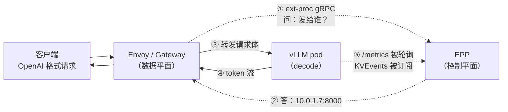
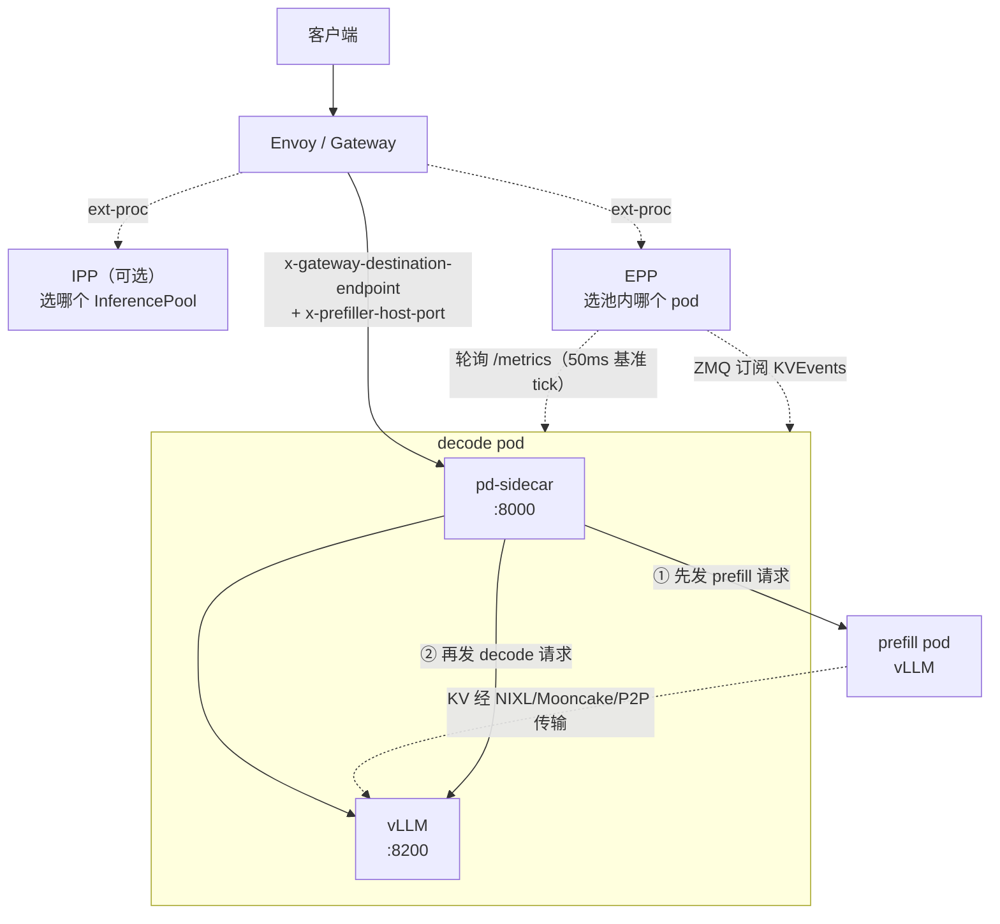

# 00 · llm-d Router 总览与架构

> **源码基线**：[`main @ 90a28bc`](https://github.com/llm-d/llm-d-router/tree/90a28bc66f1d96f84f8f18f11dcd6ed15f34e830)（2026-09-07 提交，2026-09-08 核对）。选 `main` 而非 `v0.9.0` tag 的原因见 [版本对照](README.md#版本对照与复现)——tag 里还没有 `pkg/kvcache`。
> 本地路径：`sources/llm-d-router`（`./scripts/sync-sources.sh llm-d-router`）
> 仓库原名 `llm-d-inference-scheduler`，Go module 已随仓库改名为 `github.com/llm-d/llm-d-router`。

## 0. 一句话定位

**llm-d Router 是推理流量的智能入口：它不处理 token，只决定「这个请求该发给哪个 pod」。**

它由两个进程组成，一个不聪明但很快，一个很聪明但不碰数据：

| | 组件 | 职责 | 实现 |
|---|------|------|------|
| 数据平面 | **Proxy** | 真正转发字节流的 L7 代理 | Envoy（或 Istio / AgentGateway / GKE ALB），不是本仓库代码 |
| 控制平面 | **Endpoint Picker（EPP）** | 每个请求问一次「发给谁」 | **本仓库，7.9 万行 Go** |

两者通过 Envoy 的 **ext-proc**（External Processing）gRPC 协议对话。这个分工是整个架构的地基：

> **EPP 从不接触响应的 token 流，它只在请求头/体阶段被问一次，回答一个 `ip:port`。**

这解释了为什么 EPP 能用 Go 写、能承受高 QPS、能跑复杂的打分算法——它的工作量与「请求数」成正比，而不是与「token 数」成正比。



第 ⑤ 步是这个闭环的关键：EPP 的决策质量完全取决于它对后端状态的了解程度，而这份了解来自它自己后台不断轮询 `/metrics` 和订阅 KV 事件。**04 篇和 03 篇讲的就是这一步。**

## 1. 先弄清项目边界：llm-d 到底有多少个仓库

这一节要防的是：**你搜到的大部分 llm-d 资料都在用已经不存在的组件名。**

llm-d 组织下有 22 个仓库，2026 年做过一轮大重构。按上游 `docs/architecture/README.md` 自己的划分：

### Core：三个基本概念

| 概念 | 在哪 | 说明 |
|------|------|------|
| **llm-d Router** | `llm-d/llm-d-router` | 本系列的分析对象。Proxy + EPP |
| **InferencePool** | `kubernetes-sigs/gateway-api-inference-extension`（GIE） | 用 label selector 把服务同一 base model 的 pod 归成一组，是 Router 的服务发现目标。可理解为「LLM 优化过的 Service」 |
| **Model Server** | 不在 llm-d | vLLM / SGLang 本身 |

**Variant（变体）** 是 InferencePool 内部用 pod label 表达的逻辑子分组（如 `role=prefill` / `role=decode`），**不是独立的 K8s 资源**——这点和 WVA 笔记里的「变体」是同一个概念，见 [llm-d WVA 系列](../../autoscaling/llm-d-autoscaling/README.md)。

### 最近这轮改名与合并（判断资料新旧的依据）

| 你可能搜到的 | 现在的实际情况 |
|--------------|----------------|
| `llm-d-inference-scheduler` | **已改名 `llm-d-router`**，"Inference Scheduler" 这个词被弃用 |
| GIE 里的 EPP 代码 | **已整体合并进 `llm-d-router`**。GIE 现在只留 `InferencePool` API 和 Endpoint Picker Protocol |
| `InferenceObjective` / `InferenceModelRewrite` API | 也从 GIE 搬到了 `llm-d-router`（`apix/`） |
| `llm-d-kv-cache` 的 KV-Cache Indexer | **已迁入 `llm-d-router`** 的 `pkg/kvcache` + `pkg/kvevents`（上游 PR #1886） |
| `llm-d-routing-sidecar` | **仓库已归档**，代码成为本仓库的 `pkg/sidecar` |
| `llm-d-deployer`、`llm-d-model-service` | **均已归档** |

**一句话判据**：让你去 `llm-d-inference-scheduler` 仓库、或让你从 GIE 装 EPP 的资料，都是旧的。

### Advanced：可选叠加的模式

| 模式 | 仓库 | 与本系列的关系 |
|------|------|----------------|
| KV Cache 管理 | `llm-d-kv-cache` | 已被掏空，Indexer 迁走，剩 PVC Evictor；`llmd-fs-backend` 已上游进 vLLM（`0.23` 为最终版）。**索引逻辑在本仓库，见 04 篇** |
| 载荷层处理 | `llm-d-inference-payload-processor`（IPP） | 也走 ext-proc，但读写完整 body。**IPP 决定「哪个池」，EPP 决定「池里哪个 pod」** |
| 延迟预测 | `llm-d-latency-predictor` | 在线训练 XGBoost，供 EPP 的 `latency-scorer` 打分 |
| 批处理 / 异步 | `llm-d-batch-gateway`、`llm-d-async` | 都把请求打到 Router 上，是 Router 的客户端 |
| 自动扩缩容 | `llm-d-autoscaling`（WVA） | 消费 EPP 暴露的池级指标。**已有完整笔记** |

## 2. 统一示例（贯穿 00~07 篇）

沿用 vLLM / SGLang / Mooncake 三套笔记里的 **A/B 共享前缀请求**，加上 K8s 侧的拓扑：

```
命名空间 llm-d
InferencePool: llama-8b-pool（selector: app=llama-8b）
  ├── decode  pod  D1..D4   label: llm-d.ai/role=decode
  └── prefill pod  P1..P2   label: llm-d.ai/role=prefill
所有 pod 都打 llm-d.ai/engine-type=vllm

Gateway（Envoy）+ 一个 EPP Deployment

请求 A: "你是一个资深 Go 工程师。请解释 sync.Map 的适用场景。"
请求 B: "你是一个资深 Go 工程师。请解释 channel 的关闭语义。"
        ↑ A 与 B 共享前 12 个 token 的系统提示前缀
```

这套示例要回答的核心问题，每篇各负责一段：

1. A 请求进来后，EPP 走了哪些函数才吐出 `D3:8000`？（01 篇）
2. 为什么选中 D3 而不是 D1？打分是怎么算的？（02 篇）
3. EPP 凭什么知道 D3 队列短？这个数据多久前采的？（03 篇）
4. B 请求进来时，EPP 怎么知道 D3 上已经有那 12 个 token 的 KV？（04 篇）
5. 如果 D1..D4 全忙，A 请求是被拒绝、还是在 EPP 里排队？（05 篇）
6. 如果开了 P/D 分离，A 请求怎么先经过 P1 再回到 D3？（06 篇）

## 3. 代码地图

`main @ 90a28bc` 的非测试 Go 代码分布（`find pkg cmd internal -name '*.go' ! -name '*_test.go' | xargs wc -l`，共 78923 行）：

| 目录 | 行数 | 文件 | 是什么 | 哪篇讲 |
|------|------|------|--------|--------|
| `pkg/epp/framework` | 38090 | 234 | **所有插件**：filter / scorer / picker / profile handler / producer / parser / 各类策略 | 02 |
| `pkg/sidecar` | 6870 | 26 | P/D sidecar（原 `llm-d-routing-sidecar`），跑在 decode pod 里 | 06 |
| `pkg/epp/flowcontrol` | 6182 | 31 | 多租户排队、公平性、准入、驱逐（默认关闭） | 05 |
| `pkg/coordinator` | 4982 | 36 | E/P/D 流水线的独立协调服务（实验特性） | 06 |
| `pkg/kvcache` | 3621 | 19 | KV block 索引（block hash → pod 集合） | 04 |
| `pkg/kvevents` | 2642 | 11 | ZMQ 订阅 vLLM 的 KV 事件 | 04 |
| `pkg/epp/datalayer` | 2488 | 15 | 指标采集运行时（Source → Extract → Attribute） | 03 |
| `apix` | 1979 | 10 | `EndpointPickerConfig`、`InferenceObjective` 等 API 类型 | 02 |
| `pkg/epp/metrics` | 1867 | 5 | EPP 自己对外暴露的 Prometheus 指标 | 03 |
| `cmd` | 1952 | 7 | 各 binary 入口（`epp`、`pd-sidecar`、`coordinator`） | 01 / 06 |
| `pkg/epp/requestcontrol` | 1660 | 5 | **Director**，请求编排主流程 | 01 |
| `pkg/epp/handlers` | 1326 | 4 | ext-proc 消息循环 | 01 |
| `pkg/epp/config` | 1314 | 5 | YAML 配置 → 运行时插件实例 | 02 |
| `pkg/epp/server` | 1200 | 6 | gRPC server、CLI flag | 01 |
| `pkg/epp/scheduling` | 706 | 5 | **Scheduler**，跑 profile / filter / scorer / picker | 01 / 02 |
| `pkg/epp/datastore` | 727 | 2 | pod 列表与池信息的共享存储 | 03 |
| `pkg/epp/controller` | 404 | 4 | K8s controller，watch Pod / InferencePool | 03 |

值得注意的比例关系：**编排主流程只有约 3700 行（`requestcontrol` + `handlers` + `scheduling`），插件却有 38090 行。** 这不是偶然，是这个项目最重要的设计取舍——见下一节。

## 4. 四个影响代码走向的关键设计

### 4.1 一切皆插件，核心只是编排

EPP 的核心代码不做任何路由决策。它只负责：按顺序调用插件、把结果传给下一个插件。所有实际逻辑（怎么过滤、怎么打分、怎么选）都在插件里。

八类扩展点（完整接口见 02 篇）：

```
请求路径上：RequestHeader → Screener → DataProducer → Admission
                                                          ↓
调度路径上：            ProfileHandler ⇄ [Filter → Scorer → Picker]
                                                          ↓
响应路径上：            PreRequest → ResponseHeader/Body 处理
```

配套的一层是 **Data Layer**（DataSource / Extractor）和 **Parser**（请求格式解析）。

代价是：**读这个仓库时，看核心代码看不出任何行为**，必须结合 `EndpointPickerConfig` YAML 才知道实际跑了什么。排障时也一样——第一件事是把生效的配置 dump 出来。

### 4.2 路由决策在「请求体收完」之后才发出

这点反直觉。ext-proc 有 RequestHeaders 和 RequestBody 两个阶段，直觉上应该在 headers 阶段就选好 pod（越早越好），但 EPP 不是：

```go
// pkg/epp/handlers/request.go:39-49
func (s *StreamingServer) HandleRequestHeaders(ctx context.Context, reqCtx *RequestContext, req *extProcPb.ProcessingRequest_RequestHeaders) error {
	reqCtx.RequestReceivedTimestamp = time.Now()

	// an EoS in the request headers means this request has no body or trailers.
	if req.RequestHeaders.EndOfStream {
		// We will route this request to a random endpoint as this is assumed to just be a GET
		// More context: https://github.com/kubernetes-sigs/gateway-api-inference-extension/pull/526
		// The above PR will address endpoint admission, but currently any request without a body will be
		// routed to a random upstream endpoint.
		return s.fallbackToRandomEndpoint(ctx, reqCtx, 0)
	}
```

**原因**：EPP 最重要的两个信号——prompt 的 token 数、prompt 的前缀 hash——都只能从 body 里拿到。没有 body 就没有前缀缓存感知路由，也没有 token 预算。所以 headers 阶段只缓存元数据，真正的 `director.HandleRequest` 在 RequestBody 收到 EoS 时才调用。

**顺带的坑**：注释里那句 "any request without a body will be routed to a random upstream endpoint" 是真的。没有 body 的请求（比如某些健康检查、GET 类接口）**完全绕过调度器**，随机选一个 pod。

### 4.3 Filter 与 Scorer 是硬约束与软偏好，语义完全不同

| | Filter | Scorer |
|---|--------|--------|
| 语义 | 硬约束，不满足就剔除 | 软偏好，打分 |
| 返回 | `[]Endpoint`（子集） | `map[Endpoint]float64`，约定值域 `[0,1]` |
| 组合 | **顺序 pipeline**，上一个的输出是下一个的输入 | **加权求和**，`Σ(score × weight)` |
| 全剔除了 | 返回 429（`ResourceExhausted`） | 不会发生 |

还有第三个容易和 Filter 混淆的东西：**Screener**。它也是过滤，但跑在 Director 层（所有 profile 之前），而且组合语义是**交集**而不是 pipeline：

```go
// pkg/epp/framework/interface/requestcontrol/plugins.go:47-53（节选）
// Screener performs preliminary filtering of located endpoints before data
// production, admission, and scheduling profiles run. Every screener sees the
// same input set, and the framework intersects their results.
type Screener interface {
	plugin.Plugin
	Screen(ctx context.Context, request *fwksched.InferenceRequest, endpoints []fwksched.Endpoint) []fwksched.Endpoint
}
```

**什么时候用哪个**：接口注释明确说了「大多数 endpoint 选择插件应该实现 scheduling `Filter`，而不是 `Screener`」。Screener 只用于「必须对每个 scheduling profile 都生效」的强制约束——因为 P/D 场景下 prefill 和 decode 是两个 profile，各自有独立的 Filter 链，但 Screener 只跑一次、对两者都生效。

### 4.4 Primary Profile 决定 Envoy 的转发目标，其余 profile 只写 header

P/D 分离时，一个请求要选两个 pod（一个 prefill、一个 decode），但 Envoy 的 `x-gateway-destination-endpoint` 只能有一个值。llm-d 的解法：

```go
// pkg/epp/framework/interface/scheduling/types.go:166-179（节选）
type ProfileRunResult struct {
	TargetEndpoints  []Endpoint
	ScoredCandidates []ScoredEndpoint
}

type SchedulingResult struct {
	ProfileResults     map[string]*ProfileRunResult   // key: "decode" / "prefill" / "encode"
	PrimaryProfileName string                         // P/D 场景下默认是 "decode"
}
```

- `PrimaryProfileName` 指向的 profile（decode）→ 写入 Envoy 的 destination，请求实际发到 decode pod
- prefill 的地址 → 由 `disagg-profile-handler` 的 **PreRequest** 钩子写进请求头 `x-prefiller-host-port`
- decode pod 里的 **pd-sidecar** 读这个 header，先去 prefill 算 KV，再让本地 vLLM 出 token

所以数据流是 `Envoy → decode pod 的 sidecar → prefill pod → 回到本地 vLLM`，而不是 `Envoy → prefill → decode`。**Envoy 全程只知道 decode 那一个地址。** 06 篇会完整拆这条链路。

## 5. 部署形态：Standalone 与 Gateway 两种模式

| | Standalone Mode | Gateway Mode（推荐生产用） |
|---|-----------------|---------------------------|
| Envoy 在哪 | 与 EPP **同 pod**，自管 | 共享的 Gateway（Istio / GKE ALB / AgentGateway 等） |
| 服务发现 | EPP 直接按 selector 列 pod | `InferencePool` 被 `HTTPRoute` 引用 |
| 适用 | 集群没装 Gateway API、本地评估 | 生产。可与普通业务流量共享网关 |
| 别名 | — | 「Inference Gateway」 |

两种模式下 EPP 的代码路径完全一致，区别只在谁来跑 Envoy、配置从哪来。

`pkg/epp/server/options.go` 里有一组互斥的 flag 体现这点（`options.go:388-391` 校验）：`--pool-name`（从 InferencePool CR 读）与 `--endpoint-selector`（直接给 selector）**必须二选一**。

## 6. 一个请求要经过多少个进程

把 P/D 分离 + 精确前缀缓存全开时的完整拓扑摊开，看清楚有多少个跳：



数一下：客户端到 token 之间有 **Envoy、（IPP）、EPP、sidecar、vLLM** 五个进程参与，其中 EPP 和 IPP 是旁路（ext-proc 咨询），不在数据通路上。sidecar 在数据通路上——这是它的成本，也是 `pkg/coordinator` 想要改掉的东西（06 篇 §7）。

## 7. 这套笔记与其他系列的接口

llm-learning 里已有的四套笔记正好各管一层，llm-d Router 补的是「入口到 pod 选择」这一段：

| 层 | 问题域 | 笔记 |
|---|--------|------|
| 引擎内部 | 单卡显存怎么省、连续批处理怎么调度 | [vLLM](../../inference-engine/vllm/)、[SGLang](../../inference-engine/sglang/) |
| KV 搬运与存储 | KV 怎么跨节点传、跨介质分层 | [Mooncake](../../kvcache/mooncake/) |
| **请求入口** | **请求发给哪个 pod** | **本系列** |
| 副本数 | 该开几个 pod | [llm-d WVA](../../autoscaling/llm-d-autoscaling/) |
| Pod 放置 | pod 落到哪个节点 | [kube-scheduler](../kube-scheduler/)、[Volcano](../volcano/)、[Kueue](../kueue/) |

几个具体的衔接点，读到时可以对照：

- **04 篇的 KV block hash** ↔ vLLM 笔记的 [PagedAttention 与 KVCache](../../inference-engine/vllm/03-PagedAttention与KVCache.md)：EPP 算的 block hash 要和 vLLM 内部的 block 划分对齐（但**不必相等**，原因见 04 篇 §4）
- **04 篇的近似前缀索引** ↔ SGLang 笔记的 [RadixCache](../../inference-engine/sglang/06-RadixCache深度剖析.md)：一个是网关侧猜「谁有这个前缀」，一个是引擎侧精确管理前缀树
- **06 篇的 `connector_mooncake.go`** ↔ [Mooncake TransferEngine](../../kvcache/mooncake/01-TransferEngine传输引擎.md)：sidecar 如何通过 bootstrap 端口拿到 engine ID
- **03 篇的池级聚合指标** ↔ [WVA 的指标采集](../../autoscaling/llm-d-autoscaling/02-核心代码分析-指标采集与Analyzer.md)：WVA 消费的正是 EPP 暴露的这些指标

## 8. 速查

### 三个进程 / 三个 binary

| binary | 入口 | 跑在哪 | 干什么 |
|--------|------|--------|--------|
| `epp` | `cmd/epp/main.go` | 独立 Deployment | 选 pod |
| `pd-sidecar` | `cmd/pd-sidecar/main.go` | decode pod 内 | 编排 P/D |
| `coordinator` | `cmd/coordinator/` | 独立 Deployment（实验） | 替代 sidecar 编排 E/P/D |

### 必记的 label / annotation

| 键 | 值 | 作用 | 代码 |
|----|----|------|------|
| `llm-d.ai/role` | `prefill` / `decode` / `encode` / `prefill-decode` | 角色过滤（`decode-filter` 等） | `framework/plugins/scheduling/filter/bylabel/roles.go` |
| `llm-d.ai/engine-type` | `vllm` / `sglang` / … | 决定用哪套指标名映射 | `extractor/metrics/mapping_registry.go:28-34` |
| `llm-d.ai/active-ports` | 端口列表（annotation） | DP 多端口场景下哪些端口在服务 | `pkg/epp/datastore/datastore.go:55-63` |

三者都有 `inference.networking.k8s.io/*` 的 legacy 别名作为 fallback。

### 三个必记的 header

| Header | 方向 | 含义 |
|--------|------|------|
| `x-gateway-destination-endpoint` | EPP → Envoy（dynamic metadata，namespace `envoy.lb`） | 转发目标 `ip:port` |
| `x-prefiller-host-port` | EPP → sidecar | P/D 的 prefill 地址，sidecar 读后即删 |
| `x-encoder-hosts-ports` | EPP → sidecar | E/P/D 的 encode 地址列表 |

### 阅读源码的三个提示

1. **看核心代码看不出行为，必须配着 YAML 看**。`deploy/config/` 下有 19 个现成的 `EndpointPickerConfig` 示例，`deploy/config/pd-epp-config.yaml` 是最有代表性的一个（07 篇会逐行讲）。
2. **注释的信息量常常大于代码**。这个仓库大量注释在主动说明「当前实现哪里有偏差、为什么现在不改」——比如 `load-aware-scorer` 承认自己信息不足（`load_aware.go:77-80`）、`AttributeMap.Put` 上挂着 `// TODO: Clone into map to ensure isolation`。这些是理解设计取舍与排障的第一手线索，各篇会大量摘录。
3. **`docs/` 与代码不一致时以代码为准**。典型例子：`docs/architecture.md` 引用的多个「canonical」文档已搬到 `llm-d/llm-d` 主仓库的 `docs/architecture/core/router/`，本仓库的副本可能滞后。

```bash
cd sources/llm-d-router
git log --oneline --all --grep='1886'                        # KV Indexer 迁入的那次合并
git diff v0.9.0..90a28bc --stat -- pkg/kvcache pkg/kvevents  # tag 之后才有的东西
git log --oneline -- pkg/epp/scheduling/scheduler.go         # 调度主循环的演进
```

---

**下一篇**：[01 · 请求的一生：从 ext-proc 到选中 pod](01-请求的一生-主控制流.md)
