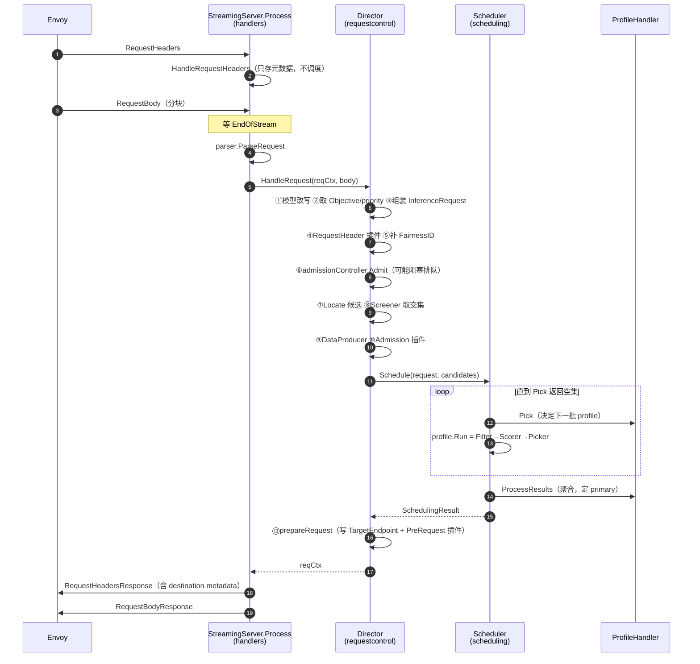

# 01 · 请求的一生：从 ext-proc 到选中 pod

> **源码基线**：[`main @ 90a28bc`](https://github.com/llm-d/llm-d-router/tree/90a28bc66f1d96f84f8f18f11dcd6ed15f34e830)
> 本篇追踪 [00 篇](00-总览与架构.md#2-统一示例贯穿-0007-篇) 的请求 A 走完 EPP 的每一行主流程。只讲**编排骨架**，不展开单个插件的算法——那是 02 篇的事。

## 0. 全景：三层四段

EPP 的主控制流分三层，每层一个文件目录：

| 层 | 目录 | 主体 | 职责 |
|---|------|------|------|
| ext-proc 协议层 | `pkg/epp/handlers` | `StreamingServer.Process` | 收 gRPC 双向流，按阶段分发，回写响应 |
| 编排层 | `pkg/epp/requestcontrol` | `Director.HandleRequest` | 准入、候选集、跑各类插件、准备转发 |
| 调度层 | `pkg/epp/scheduling` | `Scheduler.Schedule` | 跑 profile，profile 里跑 Filter→Scorer→Picker |



## 1. 启动：EPP 是怎么装起来的

### 1.1 main 极简

```go
// cmd/epp/main.go:35-49
func main() {
	os.Exit(run())
}

func run() int {
	ctx := ctrl.SetupSignalHandler()

	// Note: GIE built-in plugins are automatically registered by the runner
	// when it processes configuration in runner.parsePluginsConfiguration()

	if err := runner.NewRunner().
		Run(ctx); err != nil {
		return 1
	}
	return 0
}
```

所有装配在 `cmd/epp/runner/runner.go` 的 `Run()`（`runner.go:213`）里。

### 1.2 两阶段配置解析

这是一个值得注意的设计：配置**解析两次**。

| 阶段 | 函数 | 做什么 | 为什么分开 |
|------|------|--------|-----------|
| Phase One | `parseConfigurationPhaseOne`（`runner.go:738-776`） | 读配置文本、**注册所有 in-tree 插件**、合并 feature gates | 插件注册必须先于实例化；且要先知道用 file discovery 还是 K8s 模式 |
| Phase Two | `parseConfigurationPhaseTwo`（`runner.go:792-841`） | 按依赖 DAG **实例化**插件、注入默认插件、组装 scheduler | 实例化需要 `datastore` 已就绪（插件构造函数要能列 pod） |

```go
// cmd/epp/runner/runner.go:792-841（节选）
func (r *Runner) parseConfigurationPhaseTwo(ctx context.Context, rawConfig *configapi.EndpointPickerConfig, ds datastore.Datastore) (*config.Config, error) {
	handle := fwkplugin.NewEppHandle(ctx, makePodListFunc(ds), fwkplugin.WithMetricsRecorder(ctrlmetrics.Registry))
	cfg, err := loader.InstantiateAndConfigure(rawConfig, handle, logger)
	// ...
	r.schedulerConfig = cfg.SchedulerConfig
	// Auto-create missing DataProducers...
	r.requestControlConfig.AddPlugins(handle.GetAllPlugins()...)
	// RegisterDependencies → ValidateAndOrderDataDependencies → OrderPlugins
	r.parserRegistry = cfg.ParserRegistry
	return cfg, nil
}
```

**`makePodListFunc(ds)` 这个闭包是关键**：插件在构造时就拿到了「列出当前所有 pod」的能力，所以像 `inflight-load-producer` 这类需要跟踪 endpoint 生命周期的插件可以在构造期就注册好 watch。

### 1.3 关键 CLI flag

全部定义在 `pkg/epp/server/options.go`。排障最常用的一批：

| Flag | 默认值 | 含义 | 定义行 |
|------|--------|------|--------|
| `--grpc-port` | `9002` | ext-proc gRPC 端口 | `options.go:179` |
| `--pool-name` / `--pool-namespace` | `""` | 从 InferencePool CR 读服务发现配置 | `options.go:190-192` |
| `--endpoint-selector` | `""` | 直接给 label selector（与 `--pool-name` **互斥**） | `options.go:193-196` |
| `--endpoint-target-ports` | `[]` | pod 上的推理端口（多个 = DP rank） | `options.go:197-198` |
| **`--refresh-metrics-interval`** | **`50ms`** | Data Layer 的**基准 tick**，03 篇详解 | `options.go:204` |
| **`--metrics-staleness-threshold`** | **`2s`** | 指标多久算过期，直接影响 flow control | `options.go:207-208` |
| `--config-file` / `--config-text` | `""` | `EndpointPickerConfig` 的来源 | `options.go:259-260` |
| `--feature-gates` | `[]` | 覆盖配置里的 `featureGates` | `options.go:261-264` |
| `--allow-experimental-plugins` | `false` | 不开则 Alpha 插件**启动直接失败** | `options.go:265-266` |
| `--emit-endpoint-scores` | `false` | 把打分写进 Envoy metadata（排障利器） | `options.go:201-203` |
| `--drain-timeout` | `30s` | SIGTERM 后继续服务多久 | `options.go:182-185` |
| `--metrics-port` | `9090` | EPP 自身 Prometheus 端口 | `options.go:232` |

**校验约束**（`options.go:388-391`）：`--pool-name` 与 `--endpoint-selector` 必须**恰好给一个**，都不给或都给都会启动失败。

**优雅退出**（`runner.go:286-292`）：收到 SIGTERM 后，gRPC health 立即变 `NOT_SERVING`（让 Envoy 摘掉这个 EPP），但 ext-proc 服务继续跑 `--drain-timeout`，让在途请求走完。

## 2. ext-proc 消息循环

### 2.1 双 goroutine + select

`StreamingServer.Process`（`pkg/epp/handlers/server.go:298`）是 ext-proc 的实现入口。它没有简单地 `for { srv.Recv() }`，而是拆成两个 goroutine：

```
reader goroutine:  持续 srv.Recv() → 结果写入 recvCh    （server.go:363-379）
主 goroutine:      select { recvCh, evictCh, ctx.Done() } （server.go:424-455）
```

**为什么要拆**：`evictCh` 是 flow control 的驱逐通道（05 篇）。如果主循环阻塞在 `Recv()` 上，那么「这个请求被判定该驱逐了」这个事件就没法及时处理——客户端不发新数据，`Recv()` 就一直不返回。拆开后主循环能同时响应「新消息到了」和「这个请求该终止了」。

### 2.2 各阶段做什么

| ext-proc 阶段 | 处理 | 位置 |
|---------------|------|------|
| **RequestHeaders** | `HandleRequestHeaders`：存时间戳、提取 `ObjectiveKey` / `TargetModelName` 等 header。**不调度**；若 headers 就带 EoS（无 body）则走 `fallbackToRandomEndpoint` | `server.go:490` → `request.go:39-49` |
| **RequestBody**（非 EoS） | 累积到缓冲区 | `server.go:491+` |
| **RequestBody**（EoS） | `parser.ParseRequest` → **`director.HandleRequest`** → 生成 header/body 响应 | `server.go:491-541` |
| RequestTrailers | **空操作**，注释写着 "currently unused" | `server.go:552-553` |
| ResponseHeaders | `HandleResponseHeaders` → `director.HandleResponseHeader` | `server.go:554-582` |
| ResponseBody | 流式：逐 chunk 处理并回写；非流式：缓冲后 `finishResponse` | `server.go:584-605` |
| ResponseTrailers | `finishResponse` + 空响应 | `server.go:606-619` |

调度触发点就这四行：

```go
// pkg/epp/handlers/server.go:522-541（节选）
reqCtx, err = s.director.HandleRequest(ctx, reqCtx, parseResult.Body)
// ...
reqCtx.reqHeaderResp = s.generateRequestHeaderResponse(ctx, reqCtx)
reqCtx.reqBodyResp = envoy.GenerateRequestBodyResponses(reqCtx.Request.RawBody)
```

### 2.3 回写顺序由状态机保证

ext-proc 要求响应严格按 Header → Body → Trailer 顺序发。`updateStateAndSendIfNeeded`（`server.go:711`，发送逻辑在 `761-785`）维护这个状态机：每次处理完一条消息就检查「现在能发什么了」，攒够了就发。

这解释了一个现象：**EPP 是在 RequestBody 阶段做决策的，但决策结果通过 RequestHeadersResponse 返回。** 因为 ext-proc 的 header 响应此时还没发出去，正好可以塞进 destination。

## 3. Director：14 步编排

`Director.HandleRequest`（`pkg/epp/requestcontrol/director.go:193`）是整个 EPP 最该精读的函数。按顺序：

| # | 步骤 | 函数 / 行号 | 说明 |
|---|------|------------|------|
| 1 | 模型名改写 | `modelRewriteIfNeeded`（`209-211`） | `InferenceModelRewrite` CRD 或 header 驱动，用于 A/B 与灰度 |
| 2 | 取 Objective | `getInferenceObjective`（`212-216`） | 拿 `priority`；没有 CRD 时默认 0 |
| 3 | 组装 `InferenceRequest` | `226-234` | 调度层看到的唯一入参对象 |
| 4 | RequestHeader 插件 | `runRequestHeaderProcessors`（`240-242`） | 如 `agent-identity` 提取调用方身份 |
| 5 | 补 `FairnessID` | `244-250` | header 没给 → 用 agent 身份 → 再退到 `DefaultFairnessID` |
| 6 | **准入** | `admissionController.Admit`（`252-255`） | **可能长时间阻塞**（05 篇） |
| 7 | 定位候选 | `endpointCandidates.Locate`（`257-264`） | 空集 → 503 |
| 8 | **Screener 交集** | `runScreeners`（`266-274`） | 空集 → 503 |
| 9 | DataProducer | `runDataProducerPlugins`（`276-280`） | 准备 per-request 数据；**失败不阻断** |
| 10 | Admission 插件 | `runAdmissionPlugins`（`282-285`） | 如 `latency-slo-admitter` |
| 11 | **调度** | `scheduler.Schedule`（`287-299`） | 见 §4 |
| 12 | 记录结果 | `301` | `SchedulingResult` 挂回 request |
| 13 | 准备转发 | `prepareRequest`（`306-309`） | 写 `TargetEndpoint` + 跑 PreRequest 插件 |
| 14 | 重打包 body | `repackage`（`310-312`） | 只在 body 被 mutate 时才 re-marshal |

核心那一段代码（我裁掉了 tracing 与日志）：

```go
// pkg/epp/requestcontrol/director.go:252-313（节选）
	// Admit may block until flow control admits the request.
	if err := d.admissionController.Admit(ctx, reqCtx, priority); err != nil {
		return reqCtx, err
	}

	endpointCandidates := d.endpointCandidates.Locate(ctx, reqCtx.Request.Metadata)
	if len(endpointCandidates) == 0 {
		return reqCtx, errcommon.Error{
			Code:    errcommon.ServiceUnavailable,     // 503：池子是空的
			Msg:     "failed to find endpoint candidates for serving the request",
			Headers: map[string]string{errcommon.RequestDroppedReasonHeaderKey: string(errcommon.RequestDroppedReasonNoEndpoints)},
		}
	}

	snapshotOfCandidatePods := d.toSchedulerEndpoints(endpointCandidates)
	snapshotOfCandidatePods = d.runScreeners(ctx, reqCtx.SchedulingRequest, snapshotOfCandidatePods)
	if len(snapshotOfCandidatePods) == 0 {
		return reqCtx, errcommon.Error{
			Code:    errcommon.ServiceUnavailable,     // 503：screener 把候选全砍了
			Msg:     "screeners eliminated all endpoint candidates",
			Headers: map[string]string{errcommon.RequestDroppedReasonHeaderKey: string(errcommon.RequestDroppedReasonNoEndpoints)},
		}
	}
	// Prepare per request data by running DataProducer plugins.
	err = d.runDataProducerPlugins(ctx, reqCtx.SchedulingRequest, snapshotOfCandidatePods)
	if err != nil {
		// Don't fail the request if DataProducer plugins fail.
		logger.Error(err, "failed to prepare per request data")
	}

	// Run admit request plugins
	if denyReason := d.runAdmissionPlugins(ctx, reqCtx.SchedulingRequest, snapshotOfCandidatePods); denyReason != nil {
		return reqCtx, errcommon.Error{Code: errcommon.Internal, Msg: fmt.Errorf("request cannot be admitted: %w", denyReason).Error()}
	}

	result, err := d.scheduler.Schedule(ctx, reqCtx.SchedulingRequest, snapshotOfCandidatePods)
	if err != nil {
		// Preserve typed errcommon.Error from the scheduler so its status code
		// (e.g. PreconditionFailed) reaches Envoy intact, even if the error
		// has been wrapped (fmt.Errorf("...: %w", err)) on its way up.
		var e errcommon.Error
		if errors.As(err, &e) {
			return reqCtx, e
		}
		return reqCtx, errcommon.Error{Code: errcommon.ResourceExhausted, Msg: ...}
	}
```

### 3.1 三个必须记住的语义细节

**① 503 与 429 的分界线严格对应「池子空」与「池子忙」**

| 情况 | 错误码 | HTTP | 在哪判定 |
|------|--------|------|---------|
| `Locate` 返回空（没有 ready 的 pod） | `ServiceUnavailable` | 503 | `director.go:258-264` |
| Screener 砍空 | `ServiceUnavailable` | 503 | `director.go:268-274` |
| **Filter 砍空**（有 pod，但都不满足约束） | `ResourceExhausted` | **429** | `scheduler_profile.go:134-139` |
| Flow control 队列满 | `ResourceExhausted` | 429 | 05 篇 |

Filter 砍空为什么是 429 而不是 503，注释解释得很清楚：

```go
// pkg/epp/scheduling/scheduler_profile.go:129-139
	if len(endpoints) == 0 {
		// Filters draining a non-empty candidate set means the pool is busy, not
		// broken: an empty pool is rejected in the director before scheduling
		// runs. Report it with the same status and drop-reason vocabulary as a
		// flow control capacity rejection.
		return nil, errcommon.Error{
			Code:    errcommon.ResourceExhausted,
			Msg:     "no endpoints available for the given request",
			Headers: map[string]string{errcommon.RequestDroppedReasonHeaderKey: string(errcommon.RequestDroppedReasonSaturated)},
		}
	}
```

**排障价值**：看到 429 就去查 Filter 配置和后端负载；看到 503 就去查 pod ready 状态和 selector。这个区分是刻意维持的，别混。

**② DataProducer 失败不阻断请求**

`director.go:276-280` 里那句 `// Don't fail the request if DataProducer plugins fail.` 意味着：如果 tokenizer 挂了、前缀索引查询超时了，请求**照样往下走**，只是少了前缀缓存信号，退化成纯负载均衡。

这是刻意的可用性取舍，但排障时是个坑：**前缀缓存命中率突然掉到 0，日志里只有一行 `failed to prepare per request data` 的 error，请求全部成功。** 不看日志会以为一切正常。

**③ 调度器的 typed error 被刻意保留**

`director.go:288-299` 用 `errors.As` 从包装过的 error 里挖出 `errcommon.Error`。这是为了让 profile 内部产生的具体状态码（比如 `PreconditionFailed` = 412）能原样传到 Envoy，而不是被统一降级成 429。

## 4. Scheduler：迭代式 profile 执行

### 4.1 主循环不是「跑一遍所有 profile」

```go
// pkg/epp/scheduling/scheduler.go:78-115（节选）
	for { // get the next set of profiles to run iteratively based on the request and the previous execution results
		before := time.Now()
		profiles := s.profileHandler.Pick(ctx, request, s.profiles, profileRunResults)
		metrics.RecordPluginProcessingLatency(profilePickerExtensionPoint, handlerName.Type, handlerName.Name, time.Since(before))
		if len(profiles) == 0 { // profile picker didn't pick any profile to run
			break
		}

		for name, profile := range profiles {
			// run the selected profiles and collect results (current code runs all profiles)
			profileRunResult, err := runSchedulerProfile(ctx, name, profile, request, candidateEndpoints)
			if err != nil {
				if profileRunErrors == nil {
					profileRunErrors = map[string]error{}
				}
				profileRunErrors[name] = fmt.Errorf("profile %q: %w", name, err)
			} else {
				delete(profileRunErrors, name)
			}

			profileRunResults[name] = profileRunResult // if profile failed to run, the run result is nil
		}
	}
```

关键在于这是个**迭代循环**：`Pick` 每轮拿到「到目前为止的所有结果」，据此决定下一批跑哪些 profile，返回空集才退出。

P/D 场景下的实际迭代（`disagg-profile-handler` 的 `pickDecodeFirst`，`disagg_profile_handler.go:301-363`）：

```
第 1 轮 Pick → {"decode"}           跑 decode profile，选出 D3
第 2 轮 Pick → {"prefill"} 或 {}    ← 由 PD decider 根据「decode 已选中谁」决定要不要 prefill
第 3 轮 Pick → {}                   退出
ProcessResults → PrimaryProfileName = "decode"
```

**为什么 decode 先选**：prefill 的选择可以依赖 decode 的结果（比如让 prefill 尽量靠近 decode），反之不成立。profile 间通过 request attribute 传递：

```go
// pkg/epp/framework/plugins/scheduling/profilehandler/disagg/disagg_profile_handler.go:341-343（节选）
request.PutAttribute(PeerEndpointAttributeKey, decodeRes.TargetEndpoints[0])
```

### 4.2 `nil` 结果有两种含义

`profileRunResults[name] = profileRunResult` 这行在失败时存的是 `nil`。于是 `ProcessResults` 拿到 `profileResults["prefill"] == nil` 时无法区分：

- PD decider **主动决定不做 prefill**（prompt 太短，直接 decode 更快）
- prefill profile **被选中跑了但失败了**（没有可用的 prefill pod）

代码用一个额外的 attribute 区分：

```go
// pkg/epp/framework/plugins/scheduling/profilehandler/disagg/disagg_profile_handler.go:71-76（节选）
// ProcessResults reads this to tell that intentional skip apart from a prefill
// profile that was picked to run and then failed...
```

（`prefillDeclinedAttributeKey`）。这是个值得记住的模式：**map 里的 nil 表达不了「为什么 nil」，需要旁路标记。**

### 4.3 没有 CycleState，用三层状态传递

熟悉 kube-scheduler 的人会找 `CycleState`（见 [kube-scheduler 01 篇](../kube-scheduler/01-核心原理-调度周期与扩展点.md)）。EPP 里**没有这个东西**，插件间共享状态靠三个机制：

| 机制 | 类型 | 作用域 | 定义 |
|------|------|--------|------|
| `InferenceRequest.attributes` | `sync.Map` | 单个请求 | `interface/scheduling/types.go:64-67` |
| `Endpoint.AttributeMap` | 每 endpoint 一份 | 跨请求（datalayer 写入） | `interface/scheduling/types.go:109-124` |
| `PluginState` | 按 RequestID 索引 | 跨请求、跨阶段 | `interface/plugin/shared_state.go:28+` |

第一个用于 DataProducer → Filter/Scorer 的单请求传值（比如前缀匹配结果）；第二个是 03 篇的 Data Layer 产物；第三个用于需要跨请求记账的插件（比如 in-flight 负载统计）。

### 4.4 profile 内部：Filter → Scorer → Picker

```go
// pkg/epp/scheduling/scheduler_profile.go:126-146
// Run runs a SchedulerProfile. It invokes all the SchedulerProfile plugins for the given request in this
// order - Filters, Scorers, Picker. After completing all, it returns the result.
func (p *SchedulerProfile) Run(ctx context.Context, request *fwksched.InferenceRequest, candidateEndpoints []fwksched.Endpoint) (*fwksched.ProfileRunResult, error) {
	endpoints := p.runFilterPlugins(ctx, request, candidateEndpoints)
	if len(endpoints) == 0 {
		// ...（上面 §3.1 引过的 429 分支）
	}
	// if we got here, there is at least one endpoint to score
	weightedScorePerEndpoint := p.runScorerPlugins(ctx, request, endpoints)

	result := p.runPickerPlugin(ctx, request, weightedScorePerEndpoint)

	return result, nil
}
```

三步的实现细节留给 02 篇，这里只标出两个骨架层面的事实：

**Filter 是顺序 pipeline，中途清空就 break**：

```go
// pkg/epp/scheduling/scheduler_profile.go:169-192（节选）
	for _, filter := range p.filters {
		// ...
		filteredEndpoints = datalayer.Unscope(filter.Filter(ctx, request, scoped))
		// ...
		if len(filteredEndpoints) == 0 {
			verbose.Info("Filter eliminated all endpoints", "plugin", typedName, "endpointsBefore", len(endpoints))
			break
		}
	}
```

那行 `Filter eliminated all endpoints` 日志会告诉你**是哪个 filter 砍空的**——排 429 时第一个要 grep 的东西。

**Scorer 串行执行、加权累加，没有全局归一化**：

```go
// pkg/epp/scheduling/scheduler_profile.go:244-255（节选）
	for _, scorer := range p.scorers {
		scores := runScorer(ctx, tracer, tracingActive, scorer, request, endpoints)
		for endpoint, score := range scores { // weight is relative to the sum of weights
			weightedScorePerEndpoint[endpoint] += enforceScoreRange(score) * scorer.Weight()
		}
	}
```

注意注释说 "weight is relative to the sum of weights"，但代码是纯 `Σ(scoreᵢ × weightᵢ)`，**没有除以权重之和**。这不影响排序（Picker 只看相对大小），但意味着**最终分值的绝对尺度随配置变化**，跨集群比较 `x-gateway-destination-endpoint-scores` 的数值是没有意义的。

## 5. 结果如何变成 Envoy 的动作

### 5.1 写 destination

`prepareRequest`（`director.go:425-494`）从 primary profile 取出 endpoint：

```go
// pkg/epp/requestcontrol/director.go:425-446（节选）
	primaryResult := result.ProfileResults[result.PrimaryProfileName]
	// ...
	for _, pod := range primaryResult.TargetEndpoints {
		curMetadata := pod.GetMetadata()
		curEndpoint := net.JoinHostPort(curMetadata.GetIPAddress(), curMetadata.GetPort())
		targetMetadatas = append(targetMetadatas, curMetadata)
		targetEndpoints = append(targetEndpoints, curEndpoint)
	}
	multiEndpointString := strings.Join(targetEndpoints, ",")
	reqCtx.TargetPod = targetMetadatas[0]
	reqCtx.TargetEndpoint = multiEndpointString
```

然后 `generateMetadata`（`request.go:156-182`）把它塞进 Envoy 的 dynamic metadata：

```go
// pkg/epp/handlers/request.go:156-182（节选）
func (s *StreamingServer) generateMetadata(endpoint string, endpointScores map[string]float64) *structpb.Struct {
	endpointFields := map[string]*structpb.Value{
		metadata.DestinationEndpointKey: { /* StringValue: endpoint */ },
	}
	// 可选：x-gateway-destination-endpoint-scores（--emit-endpoint-scores）
	return &structpb.Struct{
		Fields: map[string]*structpb.Value{
			metadata.DestinationEndpointNamespace: { // "envoy.lb"
				// ...
			},
		},
	}
}
```

| 键 | 值 | 说明 |
|----|----|------|
| namespace `envoy.lb` | — | Envoy 的负载均衡子集命名空间 |
| `x-gateway-destination-endpoint` | `10.0.1.7:8000`（多个用逗号分隔） | 转发目标 |
| `x-gateway-destination-endpoint-scores` | 各 endpoint 的最终加权分 | 仅 `--emit-endpoint-scores` 时写 |

外加 `ClearRouteCache: true`（`request.go:96`）强制 Envoy 重新选路由——否则 Envoy 可能复用上次的选择。

### 5.2 P/D：prefill 地址走 header

prefill 不写 destination，由 `disagg-profile-handler` 的 PreRequest 钩子写进请求头：

```go
// pkg/epp/framework/plugins/scheduling/profilehandler/disagg/disagg_profile_handler.go:518-521（节选）
		targetPod := prefillProfileRunResult.TargetEndpoints[0].GetMetadata()
		prefillHostPort := net.JoinHostPort(targetPod.Address, targetPod.Port)
		request.Headers[routing.PrefillEndpointHeader] = prefillHostPort
```

| Header | 常量 | 消费者 |
|--------|------|--------|
| `x-prefiller-host-port` | `routing.PrefillEndpointHeader` | decode pod 里的 pd-sidecar |
| `x-encoder-hosts-ports` | `routing.EncoderEndpointsHeader` | 同上（E/P/D） |

sidecar 读完立即删掉，不转发给 vLLM：

```go
// pkg/sidecar/proxy/chat_completions.go:94-95
		prefillHostPorts := r.Header.Values(routing.PrefillEndpointHeader)
		r.Header.Del(routing.PrefillEndpointHeader)
```

06 篇接着讲 sidecar 拿到这个地址之后干什么。

## 6. 关键数据结构

三个对象，同一个请求在不同层的三张面孔：

| 层 | 类型 | 定义 | 关键字段 |
|---|------|------|---------|
| handlers | `RequestContext` | `handlers/server.go:121-183` | `TargetPod`、`TargetEndpoint`、`TargetEndpointScores`、`Priority`、`FlowControlAdmitted`、`IncomingModelName` / `TargetModelName` |
| 编排 + 调度 | `InferenceRequest` | `interface/scheduling/types.go:46-68` | `RequestID`、`TargetModel`、`Body`、`Headers`、`Objectives`、`FairnessID`、`attributes` |
| 结果 | `SchedulingResult` | `interface/scheduling/types.go:175-179` | `ProfileResults`、`PrimaryProfileName` |

endpoint 侧也有两张面孔（03 篇会展开）：

| 类型 | 定义 | 用在哪 |
|------|------|--------|
| `datalayer.Endpoint` | `interface/datalayer/endpoint.go:38-42` | datastore 里的权威对象 |
| `fwksched.Endpoint` | `interface/scheduling/types.go:79-125` | 调度层看到的包装，含 AttributeMap 的克隆 |

**注意命名**：代码里**没有** `PodMetrics` 这个类型（有些注释还这么写，是历史遗留）。metrics 的类型是 `datalayer.Metrics`（`interface/datalayer/metrics.go:26-43`）。

## 7. 反直觉行为清单

排障时最容易踩的七条，都在这一篇的范围内：

| 行为 | 后果 | 代码位置 |
|------|------|---------|
| **无 body 的请求随机选 pod** | 完全绕过调度器，前缀缓存/负载均衡全失效 | `request.go:44-47` |
| **决策在 RequestBody EoS 后才做** | headers 阶段看不到任何调度日志，别在那找 | `server.go:491-541` |
| **DataProducer 失败静默降级** | 前缀命中率归零但请求全成功 | `director.go:276-280` |
| **Screener 是交集，Filter 是 pipeline** | 两个 screener 各返回一半 → 交集可能为空 → 503 | `director.go:266-274` |
| **PreRequest 插件失败不短路** | 一个失败仍跑其余，错误聚合后才失败 | `director.go:626-627` |
| **`Prefer: if-available` 默认拒绝** | 没有 PreRequest 插件声明处理它 → **412** | `director.go:475-484` |
| **Filter/Scorer 的 scope 违规被静默丢弃** | 只体现在 `plugin_data_scope_violations_total` 指标 | `scheduler_profile.go:174-178` |

最后一条值得单独说。Data Layer 有个「声明你要读哪些数据」的机制（03 篇 §4），如果插件读了没声明的字段，写入会被拒绝：

```go
// pkg/epp/scheduling/scheduler_profile.go:174-179
		// The violations are dropped: Filter has no error return, so a rejected
		// write cannot fail the request here. Scope has already dropped the write,
		// logged it, and counted it under plugin_data_scope_violations_total, which
		// is where a misdeclared filter surfaces in production. Producers run under
		// executePluginsAsDAG, which does fail the request on one.
		scoped, _ := datalayer.Scope(logger, filterExtensionPoint, filter, filteredEndpoints)
```

自定义插件时这是最隐蔽的失败模式：**插件正常运行、请求正常返回、行为不对，只有一个指标在涨。**

## 8. 用示例串一遍

请求 A 走完全程（假设 optimized-baseline 配置，无 P/D）：

```
Envoy 收到 POST /v1/chat/completions
  → ext-proc RequestHeaders  → HandleRequestHeaders：记时间戳，提取 model
  → ext-proc RequestBody EoS → openai-parser 解析出 model + messages
    → Director.HandleRequest
       ①无 rewrite 规则，跳过         ②无 InferenceObjective → priority=0
       ③组装 InferenceRequest         ④无 RequestHeader 插件
       ⑤FairnessID = "default"        ⑥Legacy 准入（flowControl 关）：priority≥0 直通
       ⑦Locate → [D1,D2,D3,D4]        ⑧无 Screener
       ⑨DataProducer：
           token-producer                → 分词，得到 token IDs
           approx-prefix-cache-producer  → 查 LRU：这 12 个 token 的前缀之前发给过谁？
       ⑩无 Admission 插件
       ⑪Scheduler.Schedule
           Pick → {"default"}
             Filter: decode-filter → [D1,D2,D3,D4]（都是 decode 角色）
             Scorer: queue-scorer×2 + kv-cache-utilization-scorer×2
                   + prefix-cache-scorer×3 + no-hit-lru-scorer×2
             Picker: max-score-picker → D3
           Pick → {}  退出
           ProcessResults → PrimaryProfileName="default"
       ⑬prepareRequest：TargetEndpoint="10.0.1.7:8000"
                        PreRequest：approx producer 记下「这个前缀给了 D3」
  → RequestHeadersResponse：envoy.lb / x-gateway-destination-endpoint = 10.0.1.7:8000
                            ClearRouteCache = true
  → Envoy 转发给 D3
```

请求 B 进来时，第 ⑨ 步的 `approx-prefix-cache-producer` 会查到「这个前缀在 D3」，于是 `prefix-cache-scorer` 给 D3 高分（权重 3，是配置里最高的），B 大概率也落到 D3——**这就是前缀缓存感知路由的全部机制**。04 篇会讲精确版本（靠 vLLM 真实事件而非 EPP 的路由历史）。

## 9. 速查

### 主流程三个入口函数

```
pkg/epp/handlers/server.go:298          StreamingServer.Process        ext-proc 循环
pkg/epp/requestcontrol/director.go:193  Director.HandleRequest         14 步编排
pkg/epp/scheduling/scheduler.go:60      Scheduler.Schedule             profile 迭代
pkg/epp/scheduling/scheduler_profile.go:127  SchedulerProfile.Run      Filter→Scorer→Picker
```

### 排障日志速查

```bash
# 是哪个 filter 把候选砍空了（429 的根因）
kubectl logs deploy/epp | grep 'Filter eliminated all endpoints'

# DataProducer 静默降级
kubectl logs deploy/epp | grep 'failed to prepare per request data'

# 打分明细（需 -v=4 起的 DEBUG 级别）
kubectl logs deploy/epp | grep 'Calculated score'

# 选中结果与各 endpoint 分数（需 --emit-endpoint-scores）
# 在 Envoy 的 access log 里看 dynamic metadata
```

### 必记语义

| 现象 | 含义 |
|------|------|
| 503 + `RequestDroppedReasonNoEndpoints` | 池子空 / Screener 砍空 → 查 pod ready、selector、screener 配置 |
| 429 + `RequestDroppedReasonSaturated` | 池子忙 → 查 Filter 条件、后端负载、flow control 容量 |
| 412 | `Prefer: if-available` 没有插件处理 → 配置缺 PreRequest 门插件 |

---

**上一篇**：[00 · 总览与架构](00-总览与架构.md) ｜ **下一篇**：[02 · 调度框架与插件体系](02-核心代码分析-调度框架与插件体系.md)
