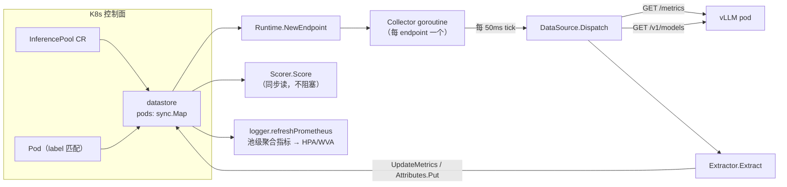

# 03 · Data Layer 与指标采集

> **源码基线**：[`main @ 90a28bc`](https://github.com/llm-d/llm-d-router/tree/90a28bc66f1d96f84f8f18f11dcd6ed15f34e830)
> 本篇回答 [00 篇](00-总览与架构.md#2-统一示例贯穿-0007-篇) 的第 3 个问题：**EPP 凭什么知道 D3 队列短？这个数字多久前采的？**

## 0. 一句话定位

**Data Layer 是 EPP 的感官系统：每个 endpoint 一个 goroutine，默认每 50ms 抓一次 `/metrics`，把数字塞进共享 datastore，供 scorer 同步读取。**

它是整个 EPP 决策质量的上限——**打分算法再精妙，也不可能比它的输入更准确**。



关键的架构决策：**采集与打分完全解耦**。scorer 从不发起网络请求，它读的是后台 goroutine 攒下来的快照。代价是数据有延迟（最多 50ms + scrape 耗时），收益是打分路径无 I/O、可预测。

## 1. 三段生命周期

上游文档把 Data Layer 描述为 `Source → Extract → Attribute`。但**「Attribute」不是第三个接口**，它是存储层。实际只有两类插件接口：

```go
// pkg/epp/framework/interface/datalayer/plugin.go:29-84（节选）
type DataSource interface {
	plugin.Plugin
}

type Extractor[T any] interface {
	plugin.Plugin
	Extract(ctx context.Context, in T) error
}

type PollingDispatcher interface {
	plugin.Plugin
	Dispatch(ctx context.Context, ep Endpoint) error
	AppendExtractor(ext plugin.Plugin) error
	Interval() time.Duration
}

type NotificationSource interface {
	DataSource
	GVK() schema.GroupVersionKind
	Notify(ctx context.Context, event NotificationEvent) (*NotificationEvent, error)
}

type EndpointSource interface {
	DataSource
	NotifyEndpoint(ctx context.Context, event EndpointEvent) (*EndpointEvent, error)
}
```

`DataSource` 是个**空接口**（只要求有 `TypedName`）——真正的能力靠断言到 `PollingDispatcher`（轮询型）或 `NotificationSource` / `EndpointSource`（事件驱动型）来获得。

### 1.1 两种 source

| 类型 | 触发 | 例子 |
|------|------|------|
| **Polling** | Collector 的定时 tick | `metrics-data-source`（抓 `/metrics`）、`models-data-source`（抓 `/v1/models`）、`dcgm-data-source` |
| **Notification / Endpoint** | K8s 对象变更、endpoint 上下线 | `k8s-notification-source`、`endpoint-notification-source` |

### 1.2 存储：Metrics 结构体 + AttributeMap

数据落到两个地方：

| 层 | 类型 | 定义 | 存什么 |
|---|------|------|--------|
| 结构化快照 | `Metrics` struct | `interface/datalayer/metrics.go:26-43` | 队列深度、KV 利用率、运行请求数、LoRA 状态、cache 配置 |
| 扩展属性 | `AttributeMap` | `interface/datalayer/attributemap.go:51-56` | 任意插件自定义的数据（`/v1/models` 结果、拓扑、DCGM 等） |

```go
// pkg/epp/framework/interface/datalayer/attributemap.go:51-56（节选）
type AttributeMap interface {
	Put(fwkplugin.DataKey, Cloneable)
	Get(fwkplugin.DataKey) (Cloneable, bool)
	Keys() []fwkplugin.DataKey
	Clone() AttributeMap
}
```

`Cloneable` 约束（`attributemap.go:26-28`）要求值能深拷贝，因为 `fwksched.Endpoint` 在传给调度插件前会克隆一份，避免插件互相污染。

**但这个隔离目前不完整**：

```go
// pkg/epp/framework/interface/datalayer/attributemap.go:72
	a.data.Store(key, value) // TODO: Clone into map to ensure isolation
```

写入时**没有**克隆，只在读出（`Clone()`）时克隆。意味着一个插件持有 `Cloneable` 的引用并在写入后修改它，能影响到 datastore 里的值。自定义 extractor 时要注意：**Put 进去的对象之后别再改。**

泛型读取辅助函数（`attributemap.go:119-135`）：

```go
func ReadAttribute[T Cloneable](attributeMap AttributeMap, key fwkplugin.DataKey) (T, bool)
```

## 2. 采集调度：一个 goroutine、一个基准 tick

### 2.1 Collector 主循环

```go
// pkg/epp/datalayer/collector.go:115-141
func (c *Collector) run(ctx context.Context, ticker Ticker, ep fwkdl.Endpoint, dispatchers []fwkdl.PollingDispatcher) {
	defer func() {
		close(c.done)
		ticker.Stop()
	}()
	logger := log.FromContext(ctx).WithValues("endpoint", ep.GetMetadata().GetIPAddress())

	for {
		select {
		case <-ctx.Done():
			return
		case <-ticker.Channel():
			for _, disp := range dispatchers {
				if ctx.Err() != nil {
					return
				}
				dispCtx, cancel := context.WithTimeout(ctx, defaultCollectionTimeout)
				if err := disp.Dispatch(dispCtx, ep); err != nil {
					tn := disp.TypedName()
					metrics.RecordDataLayerPollError(tn.Type)
					logger.V(logging.DEBUG).Info("dispatch failed", "source", tn, "err", err)
				}
				cancel()
			}
		}
	}
}
```

三个要点：

1. **每个 endpoint 一个 Collector goroutine**，所有 polling source 共享这个 goroutine 的 tick。100 个 pod = 100 个 goroutine，不是 100×source 数。
2. **source 之间串行执行**。`/metrics` 抓完才抓 `/v1/models`。所以单个 source 变慢会拖累同 endpoint 的其他 source。
3. **Dispatch 失败只记指标 + DEBUG 日志**，这个 tick 跳过，不影响下一个 tick。指标是 `llm_d_epp_datalayer_poll_errors_total{...}`。

Collector 相关的结构与管理：

| 组件 | 位置 |
|------|------|
| `Collector` struct | `datalayer/collector.go:67-71` |
| `Start()` | `collector.go:80-101` |
| per-endpoint 管理（`collectorManager`） | `datalayer/manager.go:198-229` |
| 创建 / 销毁 | `datalayer/runtime.go:440-474`（`NewEndpoint` / `ReleaseEndpoint`） |

### 2.2 基准 tick 与 interval 折算

`--refresh-metrics-interval` 默认 **50ms**（`server/options.go:153`、`options.go:204`），下限也是 50ms（`MinRefreshMetricsInterval`，低于会被 clamp，`options.go:414-417`）。

每个 polling source 可以自己声明一个 `interval`（比如 `/v1/models` 没必要 50ms 抓一次，配 `"5s"`）。框架把它折算成基准 tick 的整数倍：

```go
// pkg/epp/datalayer/interval_dispatcher.go:58-73
// periodTicks converts a configured scrape interval into a positive number of
// base ticks. interval <= 0 means every base tick (backward-compatible default).
// Non-exact multiples are rounded to the nearest base-tick multiple (minimum 1).
func periodTicks(interval, base time.Duration) (int, error) {
	if base <= 0 {
		return 0, fmt.Errorf("base tick must be positive, got %s", base)
	}
	if interval <= 0 {
		return 1, nil
	}
	ticks := int(math.Round(float64(interval) / float64(base)))
	if ticks < 1 {
		ticks = 1
	}
	return ticks, nil
}
```

然后包一层计数器，够数才真的 Dispatch：

```go
// pkg/epp/datalayer/interval_dispatcher.go:49-56
func (d *intervalDispatcher) Dispatch(ctx context.Context, ep fwkdl.Endpoint) error {
	d.remaining--
	if d.remaining > 0 {
		return nil
	}
	d.remaining = d.period
	return d.PollingDispatcher.Dispatch(ctx, ep)
}
```

**反直觉之处**：基准 tick 会被**自动下调**到最小的 source interval：

```go
// pkg/epp/datalayer/runtime.go:104-117（节选）
// Lower the base tick to the smallest source interval ...
for _, srcCfg := range cfg.Sources {
	if disp, ok := srcCfg.Plugin.(fwkdl.PollingDispatcher); ok {
		if iv := disp.Interval(); iv > 0 && iv < r.pollingInterval {
			r.pollingInterval = iv
		}
	}
	if r.pollingInterval < defaultRefreshInterval {
		r.pollingInterval = defaultRefreshInterval
	}
}
```

所以给某个 source 配 `interval: 20ms` 并不会让它 20ms 抓一次（低于 50ms 下限），但**会把全局基准 tick 拉到 50ms 并影响折算精度**。折算用的是 `math.Round`——配 `interval: 70ms` 会变成 `round(70/50)=1` 个 tick，即 **50ms**，而不是你期望的 70ms 或 100ms。配 interval 时按 50ms 的整数倍写最省心。

### 2.3 Wiring：source 与 extractor 怎么绑起来

```go
// pkg/epp/datalayer/runtime.go:141-174（节选）
if disp, ok := src.(fwkdl.PollingDispatcher); ok {
	period, err := periodTicks(disp.Interval(), r.pollingInterval)
	// ...
	src = newIntervalDispatcher(disp, period)
}
if err := r.registerSource(src, gvk); err != nil { /* ... */ }
if disp, ok := src.(fwkdl.PollingDispatcher); ok {
	for _, ext := range srcCfg.Extractors {
		if err := disp.AppendExtractor(ext); err != nil { /* ... */ }
	}
}
```

配置里的对应关系：

```yaml
dataLayer:
  sources:
    - pluginRef: metrics-data-source
      extractors:
        - pluginRef: core-metrics-extractor
    - pluginRef: models-data-source
      extractors:
        - pluginRef: models-data-extractor
```

一个 source 可挂多个 extractor：source 负责「抓到原始数据」，extractor 负责「解析成结构化字段」。轮询型的执行链在 `source/http/datasource.go:252-271`：

```
HTTPDataSource.Dispatch
  → Poll(endpoint)                       抓原始数据
  → 对每个 bound Extractor 调 Extract(PollInput{T})
  → Extractor 写 ep.UpdateMetrics(...) 或 ep.GetAttributes().Put(...)
```

## 3. 到底抓了哪些指标

### 3.1 两个 HTTP 端点

| source | 路径（默认） | 抓什么 |
|--------|-------------|--------|
| `metrics-data-source` | `/metrics` | Prometheus 文本格式的引擎指标 |
| `models-data-source` | `/v1/models` | 已加载的 model 与 LoRA adapter 列表 |

抓取的 host 来自 `EndpointMetadata.MetricsHost`（pod IP + target port，`datastore.go:343`）。

### 3.2 引擎适配：靠 pod label，不靠探测

这是个重要的设计选择。EPP **不去猜**后端是 vLLM 还是 SGLang，而是读 pod label `llm-d.ai/engine-type`（legacy: `inference.networking.k8s.io/engine-type`），查一张映射表：

```go
// pkg/epp/framework/plugins/datalayer/extractor/metrics/factories.go:89-108
// Default engine configurations for vLLM, SGLang, trtllm-serve, triton-tensorrt-llm, and triton.
var defaultEngineConfigs = []engineConfigParams{
	{
		Name:                "vllm",
		QueuedRequestsSpec:  "vllm:num_requests_waiting",
		RunningRequestsSpec: "vllm:num_requests_running",
		KVUsageSpec:         "vllm:kv_cache_usage_perc",
		LoRASpec:            "vllm:lora_requests_info",
		CacheInfoSpec:       "vllm:cache_config_info",
	},
	{
		Name:                "sglang",
		QueuedRequestsSpec:  "sglang:num_queue_reqs",
		RunningRequestsSpec: "sglang:num_running_reqs",
		KVUsageSpec:         "sglang:token_usage",
		LoRASpec:            "",
		CacheInfoSpec:       "",
		CacheBlockSizeSpec:  "sglang:page_size",
		CacheNumBlocksSpec:  "sglang:num_pages",
	},
	// trtllm-serve、triton-tensorrt-llm、triton 见 factories.go:109-146
}
```

映射表注册在 `mapping_registry.go:28-34`，label 读取在 `extractor.go:230-246`。**没打 label 的 pod fallback 到 `"default"` mapping，默认就是 vllm**（`factories.go:149-150, 244-250`）。

#### vLLM ↔ SGLang 的指标名差异

| 语义 | vLLM | SGLang |
|------|------|--------|
| 等待队列 | `vllm:num_requests_waiting` | `sglang:num_queue_reqs` |
| 运行中请求 | `vllm:num_requests_running` | `sglang:num_running_reqs` |
| KV 利用率 | `vllm:kv_cache_usage_perc` | **`sglang:token_usage`** |
| LoRA 状态 | `vllm:lora_requests_info`（label 里带 adapter 列表） | **无** |
| block size | `vllm:cache_config_info`（info-style gauge，读 label） | `sglang:page_size`（独立 gauge） |
| block 数 | 同上 | `sglang:num_pages` |

**两个直接后果**：

1. **SGLang 后端用不了 `lora-affinity-scorer`**（没有对应指标）。
2. **KV 利用率的语义不同**。vLLM 的 `kv_cache_usage_perc` 是 block 占用率，SGLang 的 `token_usage` 是 token 占用率。数值上接近但不等价，混合部署 vLLM + SGLang 池时，`kv-cache-utilization-scorer` 是在比较两个不同定义的量。

想核对本地实际抓到什么，直接打后端：

```bash
kubectl exec -it <vllm-pod> -- curl -s localhost:8200/metrics | grep -E 'num_requests_waiting|kv_cache_usage|cache_config_info'
```

### 3.3 写入字段

| Prometheus 指标（vLLM） | `Metrics` 字段 | 谁消费 |
|------------------------|---------------|--------|
| `vllm:num_requests_waiting` | `WaitingQueueSize` | `queue-scorer`、`load-aware-scorer`、`utilization-detector`、池级聚合 |
| `vllm:num_requests_running` | `RunningRequestsSize` | `running-requests-size-scorer` |
| `vllm:kv_cache_usage_perc` | `KVCacheUsagePercent` | `kv-cache-utilization-scorer`、`utilization-detector` |
| `vllm:lora_requests_info` | `ActiveModels` / `WaitingModels` / `MaxActiveModels` | `lora-affinity-scorer` |
| `vllm:cache_config_info` | `CacheBlockSize` / `CacheNumBlocks` / `CachePrefixMatchUnit` | `approx-prefix-cache-producer` 的 autoTune（04 篇 §4） |

LoRA 的 label 名常量在 `extractor.go:47-49`：`running_lora_adapters`、`waiting_lora_adapters`、`max_lora`。

`core-metrics-extractor` 的 `Produces()` 声明（`extractor.go:97-110`）就是这些 key——scorer 靠 `Consumes()` 引用它们（02 篇 §8）。

### 3.4 部分失败仍然更新

```go
// pkg/epp/framework/plugins/datalayer/extractor/metrics/extractor.go:209-221（节选）
// updated=true 时才刷新 UpdateTime
clone.UpdateTime = time.Now()
```

`Extract`（`extractor.go:114-227`）逐项解析，某项失败只 join 到 error 里，**已成功的字段照常写入**并刷新 `UpdateTime`。

**这有个重要含义**：`UpdateTime` 新鲜 ≠ 所有字段都新鲜。如果 `vllm:kv_cache_usage_perc` 这一项一直解析失败（比如引擎版本改了指标名），而队列指标正常，那么 `UpdateTime` 会一直被刷新、endpoint 永远不算 stale，但 `KVCacheUsagePercent` 停留在旧值（或 0）。

排障线索：`llm_d_epp_datalayer_extract_errors_total`（`llm_d_router_metrics.go:550-557`）在涨但 `ready_endpoints` 正常，就是这个情况。

### 3.5 LoRA 的特殊处理

```go
// pkg/epp/framework/plugins/datalayer/extractor/metrics/loraspec.go:52-56（节选）
// vLLM 仅在 adapter 加载后才 emit 该 metric family；
// family 缺失时返回 nil 而不记 extract error（避免每 tick 报错，见 #926）
```

合理但要知道：**没有 LoRA 的部署里，这个 spec 永远静默返回 nil**，不会污染错误指标。

### 3.6 `/v1/models`

| 组件 | 位置 | 说明 |
|------|------|------|
| source | `source/models/datasource.go:18, 27-28` | 默认路径 `/v1/models` |
| extractor | `extractor/models/extractor.go:54-57` | 写入 attribute key `ModelsAttributeKey` |
| 数据类型 | `attribute/models/data_types.go:31, 37-43` | `ModelData{ID, Parent, ...}`，`Parent` 是 LoRA 的 base model |

**与 Prometheus 的 LoRA 指标互补**：`/v1/models` 给「有哪些 model 可服务」（静态），`vllm:lora_requests_info` 给「哪些 adapter 现在活跃」（动态）。

## 4. datastore

### 4.1 结构

```go
// pkg/epp/datastore/datastore.go:129-147
type datastore struct {
	// parentCtx controls the lifecycle of the background metrics goroutines that spawn up by the datastore.
	parentCtx context.Context
	// mu is used to synchronize access to pool, objectives, and rewrites.
	mu   sync.RWMutex
	pool *datalayer.EndpointPool
	// key: InferenceObjective name, value: *InferenceObjective
	objectives map[string]*v1alpha2.InferenceObjective
	// modelRewrites store for InferenceModelRewrite objects.
	modelRewrites *modelRewriteStore
	// key: types.NamespacedName, value: fwkdl.Endpoint
	pods *sync.Map
	epf  datalayer.EndpointFactory
	// needsResync forces the next PoolSet to run podResyncAll even when the pool is unchanged.
	// ...
	needsResync bool
}
```

### 4.2 并发策略：分层，不是一把大锁

| 数据 | 机制 | 为什么 |
|------|------|--------|
| pool / objectives / rewrites | `sync.RWMutex` | 低频写（CR 变更），高频读 |
| pods map | `sync.Map` | 读多写少，key 集合稳定 |
| endpoint 的 metadata / metrics | `atomic.Pointer`（`endpoint.go:46-47`） | **50ms 一次的高频整体替换**，用指针交换避免加锁 |
| attributes | `Attributes.data sync.Map`（`attributemap.go:60-61`） | 多 extractor 并发写不同 key |

`atomic.Pointer` 这个选择是关键：extractor 每次更新是**克隆整个 `Metrics` 结构、改完再原子换指针**，而不是逐字段加锁修改。所以 scorer 读到的永远是**某一时刻的一致快照**，不会出现「队列深度是新的、KV 利用率是旧的」这种撕裂。

### 4.3 scorer 怎么读

四种读法：

```go
// ① 结构化 metrics（最常用）
m := endpoint.GetMetrics()
if m != nil { _ = m.WaitingQueueSize }
// 例：queuedepth/queue.go:90、loadaware/load_aware.go:88

// ② 扩展 attributes
v, ok := fwkdl.ReadAttribute[SomeType](endpoint.GetAttributes(), someKey)
// 例：scorer/topologyaffinity/scorer.go:117

// ③ per-request attributes（DataProducer 写的）
v, ok := fwksched.ReadRequestAttribute[T](request, key)

// ④ 候选列表（Director 用，不是 scorer）
pods := datastore.PodList(predicate)   // candidates.go:69-79
```

**`GetMetrics()` 可能返回 nil**（endpoint 刚创建、还没抓到第一次）。所有 scorer 都必须处理这个分支，这是自定义插件最常见的 panic 来源。

## 5. Endpoint 的发现与生命周期

### 5.1 两个 reconciler

| Reconciler | watch | 做什么 |
|-----------|-------|--------|
| `InferencePoolReconciler`（`controller/inferencepool_reconciler.go:44-73`） | InferencePool CR | 解析出 selector + targetPorts → `Datastore.PoolSet` → 触发 `podResyncAll` |
| `PodReconciler`（`controller/pod_reconciler.go:43-104`） | Pod | label 匹配 + Ready → `PodUpdateOrAddIfNotExist`；否则 `PodDelete` |

Pod 的事件过滤在 `pod_reconciler.go:69-86`（`PoolLabelsMatch`）。**只有同时满足「label 匹配 pool selector」和「Ready」的 pod 才进 datastore。**

这解释了 01 篇那个 503：`Locate` 返回空集通常不是 EPP 的问题，而是 pod 没 Ready 或 label 不匹配。

### 5.2 一个 pod 可能是多个 endpoint

Data parallel 场景下，一个 pod 上跑多个 rank，每个 rank 一个端口。EPP 把它们当**独立 endpoint**：

```
pod llama-8b-abc + targetPorts [8000, 8001, 8002, 8003]
  → endpoint  llama-8b-abc-rank-0  (10.0.1.7:8000)
  → endpoint  llama-8b-abc-rank-1  (10.0.1.7:8001)
  → ...
```

命名规则 `pod-name-rank-{idx}`（`datastore.go:521-525`）。

再叠一层 annotation 过滤：`llm-d.ai/active-ports` 声明当前哪些端口在服务（`datastore.go:55-63, 495-516`），用于滚动启动时逐个 rank 上线。

### 5.3 上下线时 Collector 的增删

```
上线（datastore.go:427-449）:
  upsertEndpoint
    → epf.NewEndpoint(parentCtx, meta)     新建 ModelServer + 启动 Collector goroutine
    → pods.Store(id, ep)

下线（datastore.go:394-402, 464-488）:
  PodDelete / podResyncAll cleanup
    → pods.Delete
    → epf.ReleaseEndpoint(ep)
        → collector.Stop()
        → crossReplicaPub.delete（如启用跨副本同步）
        → dispatch EndpointEvent{Delete}    ← 04 篇的 KV subscriber 靠这个清索引
```

**竞态处理**：`NewEndpoint` 可能返回 nil（collector 已存在或启动失败），此时返回 `errRegistrationDropped`，reconciler 需要 requeue（`datastore.go:47-50, 421-426`）。

## 6. DataProducer：per-request 的另一半

Data Layer 管「每个 endpoint 的后台状态」，DataProducer 管「每个请求的即时数据」。两者容易混：

| | Data Layer Source | DataProducer |
|---|------------------|--------------|
| 何时跑 | 后台 goroutine，周期性 | **请求路径上**，Director 第 ⑨ 步 |
| 数据作用域 | 每 endpoint，跨请求 | 每请求（也可以写 per-endpoint 的请求级数据） |
| 失败后果 | 记指标，跳过这个 tick | **静默降级**，请求继续（01 篇 §3.1） |
| 接口 | `DataSource` / `Extractor` | `DataProducer` |

```go
// pkg/epp/framework/interface/requestcontrol/plugins.go:102-107
type DataProducer interface {
	plugin.ProducerPlugin
	Produce(ctx context.Context, request *fwksched.InferenceRequest, pods []fwksched.Endpoint) error
}
```

Director 按数据依赖 DAG 的顺序调用（排序在 `runner.go:830-831`）。

### 6.1 六个默认 producer 各产出什么

| type | 文件 | 产出 |
|------|------|------|
| `token-producer` | `dataproducer/tokenizer/tokenizer.go` | `request.Body.TokenizedRequest`：prompt token IDs、多模态特征 |
| `approx-prefix-cache-producer` | `dataproducer/approximateprefix/plugin.go:229-254` | 每 endpoint 的 `PrefixCacheMatchInfo`（匹配 block 数 / 总 block 数） |
| `precise-prefix-cache-producer` | `dataproducer/preciseprefixcache/producer.go` | 同上，但数据来自真实 KV 事件（04 篇） |
| `inflight-load-producer` | `dataproducer/inflightload/producer.go:379-396` | 每 endpoint 的 `UncachedRequestTokens`，追踪 EPP 侧的在途负载 |
| `predicted-latency-producer` | `dataproducer/predictedlatency/dataproducer_hooks.go:40-108` | SLO 上下文、前缀分数、在途负载快照，可选写 `LatencyPredictionInfo` |
| `session-id-producer` | `dataproducer/sessionid/producer.go:107-116` | 从 header / cookie 提取的 session ID |
| `mm-embeddings-cache-producer` | `dataproducer/multimodal/producer.go:268-294` | 多模态 embedding 的 `EncoderCacheMatchInfo` |

### 6.2 `inflight-load-producer` 补了 Data Layer 的一个缺口

Data Layer 采到的是**引擎侧的**队列深度，最多滞后 50ms + scrape 时间。高 QPS 下这个滞后是致命的：50ms 内 EPP 可能已经往同一个 pod 灌了几十个请求，而指标还是旧的——**羊群效应**。

`inflight-load-producer` 在 EPP 内部记账「我已经派了多少请求给这个 pod、还没收到响应」，把这个即时数字提供给 scorer/filter。它还通过 `RegisterDependencies` 绑定 `endpoint-notification-source` 来追踪 endpoint 生命周期（`inflightload/producer.go:297-299`），pod 下线时清掉计数。

**这是 EPP 对抗自身反馈延迟的主要手段**，`utilization-filter` 和 `concurrency-detector` 都依赖它。

## 7. EPP 自己暴露的指标

注册入口 `pkg/epp/metrics/metrics.go:412-494`。新前缀是 **`llm_d_epp_*`**（`llm_d_router_metrics.go:27-28`），旧的 `inference_objective_*` / `inference_extension_*` 仍注册但标记 Deprecated。

### 7.1 请求路径

| 指标 | 类型 | 定义 |
|------|------|------|
| `llm_d_epp_request_total` / `_error_total` | Counter | `llm_d_router_metrics.go:40-56` |
| `llm_d_epp_request_duration_seconds` | Histogram | `:58-66` |
| `llm_d_epp_request_input_tokens` / `_output_tokens` / `_cached_tokens` | Histogram | `:88-116` |
| `llm_d_epp_request_running` | Gauge | `:118-125` |
| **`llm_d_epp_request_ttft_seconds`** | Histogram | `:139-150` |
| `llm_d_epp_request_ntpot_seconds` | Histogram | `:127-137` |
| `llm_d_epp_request_streaming_tpot_seconds` / `_itl_seconds` | Histogram | `:152-175` |
| `llm_d_epp_request_processing_duration_seconds` | Histogram | `:291-301` |

`request_cached_tokens` 是评估前缀缓存效果的直接指标——04 篇调优时看这个。

### 7.2 池级聚合（HPA / WVA 消费这一组）

由 `datalayer/logger` 周期刷新（`--refresh-prometheus-metrics-interval`，默认 5s）：

| 指标 | 含义 | 定义 | 刷新 |
|------|------|------|------|
| `llm_d_epp_average_kv_cache_utilization` | 池平均 KV 利用率 | `llm_d_router_metrics.go:180-187` | `logger/logger.go:123` |
| `llm_d_epp_average_queue_size` | 池平均排队深度 | `:189-196` | `logger.go:124` |
| `llm_d_epp_average_running_requests` | 池平均运行请求 | `:198-205` | `logger.go:125` |
| `llm_d_epp_std_dev_*`（三个） | 对应的标准差 | `:207-232` | `logger.go:126-128` |
| **`llm_d_epp_ready_endpoints`** | **有新鲜指标的 endpoint 数** | `:234-241` | `logger.go:115` |
| `llm_d_epp_per_endpoint_queue_size` | 每 pod 排队深度 | `:561+` | 实时 |

**标准差那三个指标很有用**：平均值正常但标准差很大 = 负载不均，说明 scorer 权重需要调（Affinity 压过了 Distribution）。

### 7.3 `ready_endpoints` 是最重要的健康指标

池级聚合**排除 stale endpoint**：

```
只有 time.Since(UpdateTime) <= --metrics-staleness-threshold（默认 2s）
的 endpoint 参与聚合（logger.go:79-85, 112）
```

所以 `llm_d_epp_ready_endpoints` < 实际 pod 数就意味着有 pod 的指标采不上来。**这是 05 篇 Flow Control 全面停摆的前兆**——因为 `utilization-detector` 对 stale endpoint 按「完全饱和」计。

WVA 侧的对照：WVA 消费的正是 §7.2 这些池级指标，它自己的 analyzer 也有一套 staleness 判断，见 [WVA 02 篇](../../autoscaling/llm-d-autoscaling/02-核心代码分析-指标采集与Analyzer.md)。**两层 staleness 阈值需要一起看**：EPP 认为 2s 过期，WVA 的窗口通常是分钟级，中间这段时间 WVA 可能在用 EPP 已经不信的数据。

### 7.4 调度与插件

| 指标 | 定义 |
|------|------|
| `llm_d_epp_scheduler_e2e_duration_seconds` | `llm_d_router_metrics.go:246-256` |
| `llm_d_epp_scheduler_attempts_total` | `:258-266` |
| **`llm_d_epp_plugin_duration_seconds`** | `:267-275` |
| **`llm_d_epp_plugin_data_scope_violations_total`** | `:279-287` |

`plugin_duration_seconds` 按 `{extension_point, type, name}` 分标签，是定位「哪个插件慢」的唯一手段。`data_scope_violations_total` 就是 01 篇 §7 那个静默失败模式的唯一信号。

### 7.5 Data Layer 自身

| 指标 | 定义 | 含义 |
|------|------|------|
| `llm_d_epp_datalayer_poll_errors_total` | `:540-547` | 抓不到（网络/端口/pod 挂了） |
| `llm_d_epp_datalayer_extract_errors_total` | `:550-557` | 抓到了但解析不了（**指标名不匹配，engine-type label 配错**） |

**这两个的区分极有价值**：poll 错 = 连接问题；extract 错 = 版本/配置问题。后者最常见的原因就是 `llm-d.ai/engine-type` 打错或没打（SGLang pod 被当成 vLLM，指标名全对不上）。

## 8. 设计细节与坑

### 8.1 Staleness 的三种不同处理

同一个「指标过期」，三个消费者的反应完全不同：

| 消费者 | 对 stale endpoint 的处理 | 后果 |
|--------|------------------------|------|
| 池级聚合（`logger.go:79-85`） | **排除** | 平均值只反映健康 pod，`ready_endpoints` 下降 |
| `utilization-detector`（Flow Control） | **按完全饱和计（1.0）** | **fail-closed**，全池 stale → dispatch 完全停止 |
| `load-aware-scorer` | **不过滤** | `WaitingQueueSize` 读到 0 → 得 0.5 分 |

第二个的代码：

```go
// pkg/epp/framework/plugins/flowcontrol/saturationdetector/utilization/detector.go:142-150
		if podMetrics == nil || time.Since(podMetrics.UpdateTime) > d.config.MetricsStalenessThreshold {
			// Fail closed: an endpoint whose metrics are missing or stale scores as fully saturated. A
			// fleet-wide metrics collection failure therefore halts dispatch entirely rather than
			// admitting blind; the gauge and the rate-limited log below exist so operators can tell that
			// stall apart from genuine overload (which typically scores above 1.0).
			totalScore += 1.0
			staleCount++
			continue
		}
```

注意这个 detector 有**自己独立的** staleness 阈值配置（`utilization/config.go` 默认 **200ms**，比 EPP 全局的 2s 严格得多）。

第三个是最危险的，因为它**静默**：

```go
// pkg/epp/framework/plugins/scheduling/scorer/loadaware/load_aware.go:77-80（节选）
// Pod with empty waiting requests queue is scored with 0.5
// In the future, pods with additional capacity will get score higher than 0.5
```

`WaitingQueueSize == 0` 有两种来源——真的空闲，或者从没成功抓过指标。`load-aware-scorer` 分不出来，两种都给 0.5。**这就是 02 篇建议生产用 `queue-scorer` + `kv-cache-utilization-scorer` 而不是 `load-aware-scorer` 的原因。**

### 8.2 Pod 刚启动的窗口期

```
NewEndpoint 创建空 Metrics（endpoint.go:56-57），UpdateTime 是零值
  ↓ 第一次成功 extract 才设 UpdateTime（extractor.go:210-211）
在此之前：
  - utilization-detector：视为 stale → saturation 1.0
  - load-aware-scorer：queue=0 → 0.5 分
  - 池级聚合：不计入 ready_endpoints
```

所以**新 pod 上线的头几百毫秒，Flow Control 会认为它是满载的**。这对扩容场景有实际影响：刚扩出来的 pod 在指标就绪前不会分到流量，扩容的收益有个几百毫秒的延迟。如果开了 Flow Control 且用了很严的 `--metrics-staleness-threshold`，这个窗口会更长。

### 8.3 抓取失败的降级链

| 层级 | 行为 | 位置 |
|------|------|------|
| Poll 失败 | 记 `poll_errors_total`，跳过这个 tick，**保留旧值** | `collector.go:132-135` |
| 单字段 extract 失败 | 记 `extract_errors_total`，**不**冒泡到 Dispatch 返回值 | `http/datasource.go:248-250, 286-288` |
| LoRA family 缺失 | 静默跳过，不算 error | `loraspec.go:52-56` |
| 部分字段成功 | 仍 `UpdateMetrics` 并刷新 `UpdateTime` | `extractor.go:209-221` |

**「保留旧值」这一条是最容易误判的**：pod 挂了之后，它的 `Metrics` 不会被清零，而是冻结在最后一次成功的值上，直到超过 staleness 阈值才被视为不可用。在 2s 的默认阈值内，EPP 可能还在往一个已经挂掉的 pod 上打分。真正兜底的是 K8s 的 Ready 探针 → `PodDelete` → endpoint 移除。

### 8.4 其他值得记的注释

```go
// pkg/epp/datastore/datastore.go:285-286
// TODO: add a flag for callers to specify the staleness threshold for metrics.
```

目前 staleness 阈值是全局的，无法按调用方区分。

```go
// pkg/epp/metrics/metrics.go:1027-1034（节选）
// Pruning is not synchronized with recording: ... queue gauge ... can leave
// the queue size/bytes gauges negative
```

**Flow Control 的队列 gauge 可能出现负数**。看到负值不要以为是采集 bug，是已知的竞态。

```yaml
# test/perf/config/router-configs/endpoint-attribute-parity.yaml:186-194（节选）
# Why the whole vllm engineConfig is restated: the merge is per engine, not
# per field — declaring vllm to attach customMetrics suppresses the vllm built-in alone
```

**自定义 engine mapping 时的大坑**：合并粒度是「按 engine 整体」而不是「按字段」。想给 vllm 加一个 customMetric，必须把整个 vllm 配置重写一遍，否则内置的那几条会全部丢失。

### 8.5 `statesync` 与跨副本同步

`pkg/epp/statesync/peerstore.go` 提供 `MemoryPeerStore` 做 peer 发现，配合 `datalayer/cross_replica_publisher.go`（默认 200ms tick）在多个 EPP 副本间同步 attribute。

**注意它不同步近似前缀索引**。上游 `docs/operations.md` 明确不推荐「Active-Active EPP + 近似前缀缓存」组合——两个 EPP 各有一份「我把哪些前缀发给了谁」的 LRU，互不知晓，前缀命中率会腰斩。要 HA 又要前缀感知，就得用精确索引（04 篇）配 Redis 后端，或者用 leader election 单活。

## 9. 用示例串一遍

请求 A 到达时，D3 的 `WaitingQueueSize=3` 这个数字的来历：

```
T-∞    InferencePool CR 被 apply
       → InferencePoolReconciler → PoolSet(selector=app=llama-8b, targetPorts=[8200])
       → podResyncAll

T-∞    Pod D3 变 Ready、label 匹配
       → PodReconciler → PodUpdateOrAddIfNotExist
       → datastore.upsertEndpoint
       → Runtime.NewEndpoint
           ├─ new ModelServer{Metrics: 空, Attributes: 空}
           └─ 启动 Collector goroutine，ticker = 50ms

每 50ms  Collector tick
           → metrics-data-source.Dispatch
               GET http://10.0.1.7:8200/metrics
               → core-metrics-extractor.Extract
                   查 pod label llm-d.ai/engine-type=vllm → vllm mapping
                   解析 vllm:num_requests_waiting = 3
                   → clone Metrics，WaitingQueueSize=3，UpdateTime=now
                   → atomic.Pointer 换指针
每 5s    logger.refreshPrometheus
           → 过滤 stale（UpdateTime 在 2s 内）
           → llm_d_epp_average_queue_size 等池级指标更新 → WVA 读走

T=0    请求 A 到达
       Director 第 ⑨ 步：DataProducer
           token-producer → 分词
           approx-prefix-cache-producer → 查 LRU
       Director 第 ⑪ 步：Scheduler
           queue-scorer 读 endpoint.GetMetrics().WaitingQueueSize
           ← 读到的就是最近一次 tick（最多 50ms 前）写入的 3
```

**这个数字最坏情况下有多旧**：50ms（tick 间隔）+ scrape RTT + extract 耗时。默认配置下通常 < 60ms。但如果同一个 Collector 上挂了慢 source（比如 `token-producer` 的 vLLM tokenize 后端超时），串行执行会把这个延迟推高——§2.1 第 2 点提到的问题。

## 10. 速查

### 关键 flag

| Flag | 默认 | 影响 |
|------|------|------|
| `--refresh-metrics-interval` | `50ms` | 基准 tick，下限也是 50ms |
| `--metrics-staleness-threshold` | `2s` | 池级聚合的过期线 |
| `--refresh-prometheus-metrics-interval` | `5s` | 池级指标刷新周期 |

Flow Control 的 `utilization-detector` 有**自己独立**的 staleness 配置（默认 200ms），别和上面的 2s 搞混。

### 排障决策树

```
前缀命中率低 / 负载不均
  ├─ llm_d_epp_ready_endpoints < pod 数？
  │    ├─ datalayer_poll_errors_total 在涨 → 网络/端口/pod 挂了
  │    │    → kubectl exec 手动 curl :8200/metrics 验证
  │    └─ datalayer_extract_errors_total 在涨 → 指标名不匹配
  │         → 检查 llm-d.ai/engine-type label（SGLang 忘打 = 按 vLLM 名字解析 = 全失败）
  ├─ std_dev_queue_size 很大 → 负载不均 → 调 scorer 权重（Affinity vs Distribution）
  └─ request_cached_tokens 很低 → 前缀路由没生效 → 04 篇
```

```bash
# 手动核对后端指标名
kubectl exec -it <pod> -- curl -s localhost:8200/metrics | grep -E 'num_requests_waiting|kv_cache_usage|num_queue_reqs|token_usage'

# 确认 EPP 认为几个 endpoint 是健康的
kubectl exec deploy/epp -- curl -s localhost:9090/metrics | grep -E 'ready_endpoints|datalayer_.*errors'

# 哪个插件慢
kubectl exec deploy/epp -- curl -s localhost:9090/metrics | grep plugin_duration_seconds
```

### 关键文件

```
pkg/epp/framework/interface/datalayer/plugin.go:29-84         source/extractor 接口
pkg/epp/datalayer/collector.go:115-141                        采集主循环
pkg/epp/datalayer/interval_dispatcher.go:58-73                interval → tick 折算
pkg/epp/datalayer/runtime.go:104-174                          基准 tick 下调 + wiring
extractor/metrics/factories.go:89-146                         各引擎的指标名映射（必读）
extractor/metrics/extractor.go:97-227                         解析与写入
pkg/epp/datastore/datastore.go:129-147                        datastore 结构
pkg/epp/metrics/llm_d_router_metrics.go                       所有对外指标定义
```

### 三条必记

1. **`UpdateTime` 新鲜 ≠ 每个字段都新鲜**（部分 extract 失败仍刷新时间戳）
2. **抓取失败保留旧值**，不清零；真正兜底靠 K8s Ready → PodDelete
3. **同一个 stale，三个消费者三种反应**：聚合排除、Flow Control fail-closed、`load-aware-scorer` 给 0.5

---

**上一篇**：[02 · 调度框架与插件体系](02-核心代码分析-调度框架与插件体系.md) ｜ **下一篇**：[04 · KV-Cache 索引与前缀缓存路由](04-核心代码分析-KVCache索引与前缀缓存路由.md)
