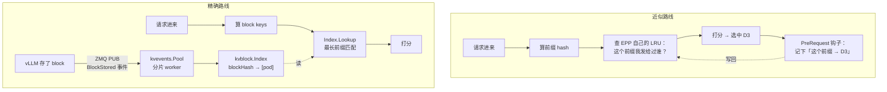

# 04 · KV-Cache 索引与前缀缓存路由

> **源码基线**：[`main @ 90a28bc`](https://github.com/llm-d/llm-d-router/tree/90a28bc66f1d96f84f8f18f11dcd6ed15f34e830)
> `pkg/kvcache`（3621 行）与 `pkg/kvevents`（2642 行）**是最近才从 `llm-d/llm-d-kv-cache` 仓库迁进来的**（上游 PR #1886）。`v0.9.0` tag 里还没有它们——这是本系列钉在 `main` 的直接原因。
> 本篇回答 [00 篇](00-总览与架构.md#2-统一示例贯穿-0007-篇) 的第 4 个问题：**请求 B 进来时，EPP 怎么知道 D3 上已经有那 12 个 token 的 KV？**

## 0. 两条路线，一个目标

目标只有一个：**让共享前缀的请求落到同一个 pod，把 prefill 阶段的计算省掉。**

llm-d 提供两条实现路线，理解它们的区别是本篇的核心：

| | 近似（approximate） | 精确（precise） |
|---|-------------------|----------------|
| 数据来源 | **EPP 自己的路由历史**：「我把哪些前缀发给过谁」 | **vLLM 真实的 KV 事件**：引擎实际存了/淘汰了哪些 block |
| 插件 | `approx-prefix-cache-producer` | `precise-prefix-cache-producer` |
| 传输 | 无（纯内存 LRU） | **ZMQ**（`pkg/kvevents`） |
| 索引 | 每 pod 一个 LRU | 全局 `kvblock.Index`（内存 / Redis） |
| 准确性 | 猜。EPP 不知道引擎有没有真的淘汰 | 近实时反映引擎状态 |
| 多 EPP 副本 | **不共享**，命中率腰斩 | 可用 Redis 后端共享 |
| 部署成本 | 零，默认就是它 | 需要 vLLM 开 KV 事件、配 ZMQ 端口 |

**默认是近似的**。02 篇 §4.2 提到：只配 `prefix-cache-scorer` 不配 producer，框架会自动补一个**近似** producer。想用精确必须显式配。

上游把这两条路线做成了两个 well-lit path：`optimized-baseline`（近似）与 `precise-prefix-cache-routing`（精确）。



近似路线是个**自反馈闭环**（EPP 相信自己的历史决策），精确路线是个**开环观测**（EPP 相信引擎上报的事实）。

## 1. 写路径：KV 事件怎么进来

### 1.1 传输层：ZMQ

vLLM 在每个 pod 上开一个 **ZMQ PUB** socket，EPP 侧用 **SUB** 订阅。

| 模式 | EPP 的动作 | 地址 |
|------|-----------|------|
| Pod discovery（默认） | **Dial**（主动连） | `tcp://<PodIP>:<SocketPort+RankIndex>` |
| 本地 / global | **Bind**（等连入） | 配置里的 `zmqEndpoint` |

```go
// pkg/kvevents/zmq_subscriber.go:96-150（节选）
func (z *zmqSubscriber) runSubscriber(ctx context.Context) {
	sub := zmq4.NewSub(ctx)
	// Bind for local endpoints, connect for remote ones.
	if !z.remote {
		if err := sub.Listen(z.endpoint); err != nil { /* ... */ }
	} else {
		if err := sub.Dial(z.endpoint); err != nil { /* ... */ }
	}
	if err := sub.SetOption(zmq4.OptionSubscribe, z.topicFilter); err != nil { /* ... */ }
	// ...
}
```

**注意 `SocketPort + RankIndex`**：DP 场景下一个 pod 有多个 rank，每个 rank 一个 ZMQ 端口，与 03 篇 §5.2 的 endpoint 拆分一一对应。

默认配置（`kvevents.DefaultConfig()`）：`TopicFilter: "kv@"`、`Concurrency: 4`、`DiscoverPods: true`、`SocketPort: 5557`。

### 1.2 帧格式：三帧

```go
// pkg/kvevents/zmq_subscriber.go:79-87
// parseEventFrame validates and extracts a live or replayed event frame.
func parseEventFrame(frames [][]byte) (string, uint64, []byte, bool) {
	if len(frames) != 3 || len(frames[1]) < 8 {
		return "", 0, nil, false
	}
	return string(frames[0]), binary.BigEndian.Uint64(frames[1]), frames[2], true
}
```

| 帧 | 内容 | 用途 |
|---|------|------|
| 0 | topic：`kv@<pod-id>@<model-name>` | 订阅过滤（默认前缀 `kv@`）、解析出 pod 与 model |
| 1 | sequence：uint64 大端 | **gap 检测与 replay**（§7） |
| 2 | payload：msgpack 编码的 `EventBatch` | 事件本体 |

topic 解析：

```go
// pkg/kvevents/engineadapter/common.go:43-52
// parseTopic extracts pod ID and model name from the topic format "kv@<pod-id>@<model-name>".
func parseTopic(topic string) (string, string) {
	topicParts := strings.Split(topic, "@")
	if len(topicParts) == 3 {
		return topicParts[1], topicParts[2]
	}
	return topic, ""
}
```

### 1.3 三种事件

```go
// pkg/kvevents/events.go:27-143（节选）
const (
	EventTypeBlockStored      EventType = "BlockStored"
	EventTypeBlockRemoved     EventType = "BlockRemoved"
	EventTypeAllBlocksCleared EventType = "AllBlocksCleared"
)

type BlockStoredEvent struct {
	BlockHashes []uint64
	Tokens      []uint32
	ParentHash  uint64
	BlockSize   int
	DeviceTier  string
	// ...
	GroupIdx                     *int
	KVCacheSpecKind              KVCacheSpecKind
	KVCacheSpecSlidingWindowSize *int
}

type BlockRemovedEvent struct {
	BlockHashes []uint64
	DeviceTier  string
	GroupIdx    *int
}

type AllBlocksClearedEvent struct {
	DeviceTier string
}
```

`DeviceTier` 是分层的关键：同一个 block 可能同时在 GPU 和 CPU 上，不同 tier 的价值不同（§5.2 打分会用到）。这对应 vLLM 的多级 offloading，也是 [Mooncake 的分层存储](../../kvcache/mooncake/03-分层存储与持久化.md) 在网关侧的可见性。

`KVCacheSpecKind` 用来跳过不可前缀索引的 attention 类型（§8.3）。

### 1.4 事件归属：`SourceEndpoint` 覆盖 topic 里的 pod-id

这是个容易忽略但很重要的细节（上游 PR #2233 修的）。

topic 里带着 vLLM 自报的 pod-id，但 EPP 的打分是按 **HTTP 推理 endpoint（`ip:port`）** 过滤候选的。两者不一致就查不到。所以 subscriber 创建时会传入真实的 endpoint 地址：

```go
// pkg/epp/framework/plugins/requestcontrol/dataproducer/preciseprefixcache/extractor.go:68-95（节选）
func (p *Producer) ensureSubscriber(ctx context.Context, meta *fwkdl.EndpointMetadata) error {
	port := p.kvEventsConfig.PodDiscoveryConfig.SocketPort + meta.GetRankIndex()
	zmqEndpoint := "tcp://" + net.JoinHostPort(meta.Address, strconv.Itoa(port))
	// ...
	sourceEndpoint := fmt.Sprintf("%s:%s", meta.Address, meta.Port)
	if err := p.subscribersManager.EnsureSubscriber(p.subscriberCtx, endpointKey,
		sourceEndpoint, zmqEndpoint, replayEndpoint, p.kvEventsConfig.TopicFilter, true); err != nil {
		// ...
	}
}
```

处理时优先用它：

```go
// pkg/kvevents/pool.go:397-399
	if msg.SourceEndpoint != "" {
		podID = msg.SourceEndpoint
	}
```

**排障价值**：如果精确前缀索引「有事件进来但从不命中」，检查这个映射——索引里存的 pod 标识必须和 `Locate` 出来的候选 endpoint 标识完全一致。

### 1.5 EndpointExtractor 驱动订阅生命周期

订阅不是静态配的，而是跟着 endpoint 的上下线动态增删——靠 03 篇 §5.3 提到的 `EndpointEvent`。pod 上线 → `ensureSubscriber`；pod 下线 → 停订阅 + `Index.Clear(podIdentifier)`。

## 2. 事件处理池

### 2.1 结构

```go
// pkg/kvevents/pool.go:160-186（节选）
type Pool struct {
	queues         []workqueue.TypedRateLimitingInterface[*RawMessage]
	concurrency    int
	index          kvblock.Index
	tokenProcessor kvblock.TokenProcessor
	adapter        EngineAdapter
	groupCatalog   *kvblock.GroupCatalog
	dedup          *eventDedupFilter
	tracer         trace.Tracer
	wg             sync.WaitGroup
	queueDepth     atomic.Int64
}
```

### 2.2 分片：保证同 pod 事件有序

```go
// pkg/kvevents/pool.go:300-319
// AddTask is called by the subscriber to add a message to the processing queue.
// It hashes the sharding key to select a queue, ensuring messages for the
// same source endpoint always go to the same worker (ordered queue).
func (p *Pool) AddTask(task *RawMessage) {
	key := task.SourceEndpoint
	if key == "" {
		key = p.adapter.ShardingKey(task)
	}
	// Use an FNV-1a hash to deterministically select a queue.
	h := fnv.New32a()
	_, err := h.Write([]byte(key))
	if err != nil {
		return
	}

	//nolint:gosec // if concurrency overflows then the world is in trouble anyway
	queueIndex := h.Sum32() % uint32(p.concurrency)
	p.queues[queueIndex].Add(task)
	p.addQueueDepth(1)
}
```

**为什么必须按 pod 分片**：`BlockStored` 事件的处理依赖 `ParentHash` 去查上一个 block 的映射（§4.4）。如果同一个 pod 的两个连续事件被不同 worker 并行处理，后一个可能在前一个写入索引之前就去查 parent，导致链断裂。**分片把「同 pod 有序」和「跨 pod 并行」两个需求同时满足了。**

### 2.3 队列没有上限

用的是 k8s 的 `workqueue.TypedRateLimitingQueue`，**没有容量上限、没有背压**。事件持续入队直到内存吃紧。

```go
// pkg/kvevents/pool.go:281-297（节选）
func (p *Pool) Shutdown(ctx context.Context) {
	for _, queue := range p.queues {
		queue.ShutDown()
	}
	p.wg.Wait()
	// Tasks still queued at shutdown are dropped with the queues
	p.queueDepth.Store(0)
}
```

关停时**未处理的任务直接丢弃**。这是可接受的——索引本身是可重建的缓存（§7 的 replay 机制），丢一批事件只影响命中率不影响正确性。

深度可观测（`metrics.PoolQueueDepth` gauge）。**如果这个 gauge 持续增长，说明事件产生速率超过了处理能力**（4 个 worker 不够），需要调 `Concurrency`。

### 2.4 worker 主循环

```go
// pkg/kvevents/pool.go:326-353（节选）
func (p *Pool) worker(ctx context.Context, workerIndex int) {
	defer p.wg.Done()
	queue := p.queues[workerIndex]
	for {
		task, shutdown := queue.Get()
		if shutdown { return }
		func(task *RawMessage) {
			defer queue.Done(task)
			p.processRawMessage(ctx, task)
			queue.Forget(task)
		}(task)
		p.addQueueDepth(-1)
		// ...
	}
}
```

## 3. 索引结构

### 3.1 接口

```go
// pkg/kvcache/kvblock/index.go:100-147（节选）
// Index defines the interface for a backend that manages KV-block indexing.
// ...
// The hit may not necessarily be on all keys, but of the longest prefix match.
type Index interface {
	// Lookup receives a list of keys and a set of pod identifiers,
	// and retrieves the filtered pods associated with those keys.
	// If the podIdentifierSet is empty, all pods are returned.
	Lookup(ctx context.Context, requestKeys []BlockHash, podIdentifierSet sets.Set[string]) (map[BlockHash][]PodEntry, error)

	// Add stores requestKey -> pod entries and (optionally) engineKey -> requestKey
	// mappings. If engineKeys is nil, only requestKey -> pod mappings are created
	// (used for speculative entries where engine keys are not yet known).
	//
	// When engineKeys is non-nil, the backend infers the mapping from the ratio
	// of len(engineKeys) to len(requestKeys). ... Examples with 256 tokens:
	//   1:1   (engine=64, canonical=64)  -> 4 eng, 4 req  -> E0->R0, E1->R1, ...
	//   many:1 (engine=16, canonical=64) -> 16 eng, 4 req -> E0..E3->R0, E4..E7->R1, ...
	//   1:many (engine=128, canonical=64) -> 2 eng, 4 req -> E0->[R0,R1], E1->[R2,R3]
	Add(ctx context.Context, engineKeys, requestKeys []BlockHash, entries []PodEntry) error

	Evict(ctx context.Context, key BlockHash, keyType KeyType, entries []PodEntry) error
	GetRequestKey(ctx context.Context, engineKey BlockHash) (BlockHash, error)
	Clear(ctx context.Context, podIdentifier string) error
}
```

**两套 key 是这个设计最容易困惑的地方**，先讲清楚：

| key | 谁算的 | 用途 |
|-----|-------|------|
| **engineKey** | vLLM 自己（事件里的 `BlockHashes`） | 只作为不透明的映射键。`BlockRemoved` 事件只带 engineKey，需要反查 requestKey 才能淘汰 |
| **requestKey** | **EPP 自己**（`TokenProcessor` 从 token 重算） | 索引的真正主键。读路径也用它查 |

为什么要两套：**EPP 的 block 划分粒度可以和 vLLM 不一样**（比如 vLLM 用 16，EPP 用 64）。`Add` 的注释里那三个例子（1:1 / many:1 / 1:many）就是在处理这个粒度差异，比例从 `len(engineKeys)/len(requestKeys)` 推断出来。

### 3.2 值：PodEntry

```go
// pkg/kvcache/kvblock/index.go:173-185（节选）
type PodEntry struct {
	PodIdentifier string
	DeviceTier    string
	Speculative   bool     // 预测性写入，非引擎确认（§8.1）
	HasGroup      bool
	GroupIdx      GroupID
}
```

### 3.3 三种可插拔后端

```go
// pkg/kvcache/kvblock/index.go:57-85（节选）
func NewIndex(ctx context.Context, cfg *IndexConfig) (Index, error) {
	switch {
	case cfg.CostAwareMemoryConfig != nil:
		idx, err = NewCostAwareMemoryIndex(cfg.CostAwareMemoryConfig)
	case cfg.RedisConfig != nil:
		idx, err = NewRedisIndex(cfg.RedisConfig)
	case cfg.InMemoryConfig != nil:
		idx, err = NewInMemoryIndex(cfg.InMemoryConfig)
	default:
		return nil, fmt.Errorf("no valid index configuration provided")
	}
}
```

**注意是 switch 不是叠加**——按优先级取第一个非 nil 的配置，只用一个后端。

| 后端 | 淘汰策略 | 默认容量 | 适用 |
|------|---------|---------|------|
| `InMemoryIndex` | 双层 LRU（key 级 + 每 key 的 pod LRU） | 1e8 keys，每 key 10 pods | 单 EPP，默认 |
| `CostAwareMemoryIndex` | Ristretto（按 cost 淘汰） | 2GiB | 内存需要硬上限时 |
| `RedisIndex` | Redis 侧 TTL / 驱逐 | — | **多 EPP 副本共享**（HA 的唯一正解，见 03 篇 §8.5） |

### 3.4 内存索引与最长前缀早停

```go
// pkg/kvcache/kvblock/in_memory.go:78-89（节选）
type InMemoryIndex struct {
	mu                  sync.Mutex
	data                *lru.Cache[BlockHash, *PodCache]     // requestKey → pods
	engineToRequestKeys *lru.Cache[BlockHash, []BlockHash]   // engineKey → requestKeys
	podCacheSize        int
}
```

Lookup 只找**连续前缀**，一断就停：

```go
// pkg/kvcache/kvblock/in_memory.go:122-127（节选）
	for idx, requestKey := range requestKeys {
		if pods, found := m.data.Get(requestKey); found {
			if pods == nil || pods.cache.Len() == 0 {
				return podsPerKey, nil // early stop since prefix-chain breaks here
			}
			// ...
```

**这是对的语义**：KV 缓存的复用必须是从头开始的连续前缀。第 5 个 block 命中但第 3 个没命中，第 5 个是用不上的——因为 attention 需要完整的前缀 KV。

## 4. Token → Block Key

这一节回答「hash 到底怎么算，怎么保证和 vLLM 对得上」。

### 4.1 分词不在这里做

`pkg/kvcache` 拿到的是 token IDs，不是字符串。分词由 **`token-producer`**（02 篇 §5.5）完成，产出 `TokenizedRequest`，近似和精确两条路线都消费它。

### 4.2 Block size 从哪来

**这是两条路线最大的实现差异之一**：

| | 精确 | 近似 |
|---|------|------|
| 来源 | 配置 `TokenProcessorConfig.BlockSizeTokens`（默认 16） | 配置默认 16，`autoTune=true` 时读 endpoint 指标 |
| 读 `vllm:cache_config_info`？ | **不读** | autoTune 时读（`CachePrefixMatchUnit` 或 `CacheBlockSize`） |
| 下限 | 无 | **强制 ≥ 64** |

近似路线的 autoTune 与 floor：

```go
// pkg/epp/framework/plugins/requestcontrol/dataproducer/approximateprefix/plugin.go:345-360
func (p *dataProducer) GetBlockSize(endpoints []fwksched.Endpoint) int {
	blockSize := p.config.BlockSizeTokens
	if p.config.AutoTune && len(endpoints) > 0 {
		if endpoint := endpoints[0]; endpoint.GetMetrics() != nil {
			m := endpoint.GetMetrics()
			if pmu := m.CachePrefixMatchUnit; pmu > 0 {
				blockSize = pmu
			} else if bs := m.CacheBlockSize; bs > 0 {
				blockSize = bs
			}
		}
	}
	if blockSize < minBlockSizeTokens {
		return minBlockSizeTokens  // 64
	}
	return blockSize
}
```

为什么近似路线要强制 64 下限：

```go
// pkg/epp/framework/plugins/requestcontrol/dataproducer/approximateprefix/plugin.go:44-51
// minBlockSizeTokens is the floor applied to the block size returned by
// GetBlockSize. The routing-side indexer keeps one LRU entry per (pod, block),
// so very small block sizes cause gigabyte-scale memory growth at scale. 64
// tokens is coarse enough to bound memory while still preserving useful
// prefix-match signal.
```

**这是内存与精度的直接取舍**：近似索引是「每 pod × 每 block」一个 LRU 条目，block 越小条目越多。64 token 的粒度意味着**不足 64 token 的共享前缀检测不到**。

回到统一示例：请求 A/B 共享 12 个 token 的系统提示——**在近似路线下这个前缀根本形不成一个完整 block，检测不到**。要让 12 token 的共享前缀生效，得用精确路线（block size 16，且要考虑 §4.5 的 partial block 处理）。这是个实际的、容易被忽略的限制：**短系统提示的共享靠近似路线是抓不住的。**

### 4.3 Hash 算法与「不必等于 vLLM」

```go
// pkg/kvcache/kvblock/token_processor.go:36-72（节选）
// Accepted TokenProcessorConfig.HashAlgorithm values.
const (
	// HashAlgorithmCBORFNV hashes each block with FNV-64a over the canonical
	// CBOR encoding of [parent, tokens, extra]. This is the default.
	HashAlgorithmCBORFNV = "cbor-fnv"
	// HashAlgorithmXXH64 hashes each block with a single XXH64 digest over
	// the parent hash (8 bytes little-endian), the raw token-ID bytes, and
	// each extra-feature string prefixed with its 8-byte little-endian length.
	HashAlgorithmXXH64 = "xxh64"
)

type TokenProcessorConfig struct {
	// BlockSizeTokens is the number of tokens per block.
	BlockSizeTokens int `json:"blockSizeTokens"`
	// HashSeed is used to prefix initial hash chunks, similarly to vLLM's NONE_HASH.
	// This should be aligned with vLLM's `PYTHONHASHSEED` environment variable.
	HashSeed string `json:"hashSeed"`
	// HashAlgorithm selects the block hashing chain: ... Block keys are
	// internal to the index and need not match vLLM's hashes, but they must
	// be consistent across the index's whole lifetime: like HashSeed, the
	// algorithm must not change while a persisted or shared index (e.g. the
	// Redis backend) holds keys, or while engines still hold blocks whose
	// stored engine-to-request mappings were built under the old keys —
	// parent-chain resolution would then mix algorithms and produce request-key
	// lookups that can never match.
	HashAlgorithm string `json:"hashAlgorithm"`
	// ...
}
```

**「need not match vLLM's hashes」这句话是理解整个设计的钥匙。**

直觉上会以为 EPP 必须复刻 vLLM 的 hash 算法才能对上。实际不需要，因为：

- **写路径**：事件带着 `Tokens` 和 `ParentHash`，EPP 用**自己的** TokenProcessor 从 token 重算 requestKey
- **读路径**：从请求的 token 用**同一个** TokenProcessor 算 requestKey

两边用同一套算法，自然对得上。vLLM 的 engineKey 只是个不透明的映射键（§3.1）。

**真正的一致性要求**是：同一个索引的生命周期内，`HashSeed` 和 `HashAlgorithm` 不能变。用 Redis 后端时更严——**所有共享索引的 EPP 副本必须配同一个值**，否则一半副本写的 key 另一半永远查不到。滚动升级改这两个参数需要同时清索引。

`HashSeed` 对齐 vLLM 的 `PYTHONHASHSEED` 是为了首块的 parent hash（`getInitHash(modelName)`）。

### 4.4 链式 hash

```go
// pkg/kvcache/kvblock/token_processor.go:230-251（节选）
func (db *chunkedTokenDatabase) prefixHashes(
	parentHash uint64, tokenChunks [][]uint32, extraFeatures []*BlockExtraFeatures,
	digest *xxhash.Digest,
) []uint64 {
	prefix := parentHash
	hashes := make([]uint64, len(tokenChunks))
	for i, chunk := range tokenChunks {
		// ...
		if digest != nil {
			prefix = hashXXH64(digest, prefix, chunk, extras)
		} else {
			prefix = db.hash(prefix, chunk, extras)
		}
		hashes[i] = prefix
	}
	return hashes
}
```

每个 block 的 hash 包含**上一个 block 的 hash**。这个链式结构保证了「hash 相同 ⇒ 从头到这里的整个前缀相同」，正是最长前缀匹配需要的性质。和 vLLM / SGLang 内部的前缀树是同一个思想（见 [SGLang RadixCache](../../inference-engine/sglang/06-RadixCache深度剖析.md)），只是这里用链式 hash 而不是树。

写路径解析 parent 的那一步：

```go
// pkg/kvevents/pool.go:602-618（节选）
	parentRequestKey := kvblock.EmptyBlockHash
	if ev.ParentHash != 0 {
		parentEngineKey := kvblock.BlockHash(ev.ParentHash)
		key, err := p.index.GetRequestKey(ctx, parentEngineKey)
		// ...
		parentRequestKey = key
	}
```

**这就是 §2.2 必须按 pod 分片的原因**：`GetRequestKey` 查的是上一个事件刚写进去的映射。

### 4.5 精确路线丢弃 partial block

```go
// pkg/kvcache/kvblock/token_processor.go:258-271（节选）
func (db *chunkedTokenDatabase) chunkTokens(tokens []uint32) [][]uint32 {
	for i := 0; i < len(tokens); i += bs {
		end := i + bs
		if end > len(tokens) {
			break // no partial blocks
		}
		chunks = append(chunks, tokens[i:end])
	}
	return chunks
}
```

**与近似路线相反**：近似**包含**尾部不足 blockSize 的块，精确**丢弃**。

原因是精确路线要和引擎对齐——vLLM 只会为完整 block 生成 KV 并发事件，为 partial block 算 key 会产生永远查不到的键。

**实际影响**：prompt 长度 100 token、block size 16 → 精确路线只索引前 96 个 token（6 个 block），最后 4 个 token 不参与。

### 4.6 `cache_salt` 的处理

`cache_salt` 是 vLLM 用来隔离不同租户前缀缓存的机制。EPP 把它折进第一个 block 的 extra keys：

```go
// pkg/epp/framework/plugins/requestcontrol/dataproducer/preciseprefixcache/blockkeys.go:133-149（节选）
// foldCacheSalt appends the cache salt to the first block's extra keys...
func foldCacheSalt(extraFeatures []*kvblock.BlockExtraFeatures, salt string, numBlocks int) []*kvblock.BlockExtraFeatures {
	if salt == "" || numBlocks == 0 { return extraFeatures }
	// ...
	extraFeatures[0].MMHashes = append(extraFeatures[0].MMHashes, kvblock.MMHash{Hash: salt})
	return extraFeatures
}
```

折进首块就够了——链式 hash 会把它传播到后续所有 block。

## 5. 读路径：从索引到分数

### 5.1 Indexer API

`pkg/kvcache/indexer.go` 暴露三个方法：

| 方法 | 作用 |
|------|------|
| `ComputeBlockKeysFromTokens(ctx, tokens, model, extraFeatures)` | tokens → block keys |
| `MatchBlockKeys(ctx, keys, podFilter)` | Lookup + 最长前缀 → `map[string]PodMatch` |
| `ScoreTokens(ctx, tokens, model, podIDs, extraFeatures)` | 前两步 + 转成分数 |

```go
// pkg/kvcache/indexer.go:129-192（节选）
func (k *Indexer) ScoreTokens(...) (map[string]float64, error) {
	blockKeys, err := k.tokenProcessor.TokensToKVBlockKeys(...)
	matches, keysFound, err := k.matchBlockKeys(ctx, blockKeys, sets.New(podIdentifiers...))
	podScores := make(map[string]float64, len(matches))
	for pod, m := range matches {
		podScores[pod] = m.WeightedScore
	}
	return podScores, nil
}
```

### 5.2 PodMatch：tier 加权

```go
// pkg/kvcache/prefix_match.go:46-58（节选）
type PodMatch struct {
	WeightedScore float64          // 每 block 取最高 tier 的权重后累加
	MatchedBlocks int              // 连续命中 block 数（不含 tier 权重）
	BlocksByTier  map[string]int
}
```

**tier 加权的意义**：同一个 block 在 GPU 上和在 CPU offload 里价值不同。GPU 上是零成本复用，CPU 上还要搬一次（这就是 [Mooncake TransferEngine](../../kvcache/mooncake/01-TransferEngine传输引擎.md) 干的事）。所以 CPU tier 的 block 权重 < 1.0，`WeightedScore` 因此可能小于 `MatchedBlocks`。

### 5.3 Producer 与 Scorer 的绑定

这是配置里最容易搞错的一环。**Producer 产出数据、Scorer 消费数据，通过 DataKey 绑定，而 DataKey 里带着 producer 的实例名。**

Producer 侧：

```go
// pkg/epp/framework/plugins/requestcontrol/dataproducer/preciseprefixcache/producer.go:269-273（节选）
func (p *Producer) Produces() map[plugin.DataKey]any {
	return map[plugin.DataKey]any{p.dk: attrprefix.PrefixCacheMatchInfo{}}
}
// p.dk = attrprefix.PrefixCacheMatchInfoDataKey.WithNonEmptyProducerName(name)
```

Scorer 侧：

```go
// pkg/epp/framework/plugins/scheduling/scorer/prefix/plugin.go:97-106（节选）
func New(_ context.Context, name string, producerName string) (*Plugin, error) {
	return &Plugin{
		prefixMatchDataKey: attrprefix.PrefixCacheMatchInfoDataKey.WithNonEmptyProducerName(producerName),
	}, nil
}
```

所以配置必须这么写：

```yaml
plugins:
  - name: precise                              # ← 实例名
    type: precise-prefix-cache-producer
    parameters:
      tokenProcessorConfig:
        blockSizeTokens: 16
        hashSeed: ""                           # 与 vLLM 的 PYTHONHASHSEED 对齐
      kvEventsConfig:
        discoverPods: true
        podDiscoveryConfig:
          socketPort: 5557
          replaySocketPort: 5558               # 不设则无 replay 恢复能力（§7）
      speculativeIndexing: true
      speculativeTTL: "2s"
  - type: prefix-cache-scorer
    parameters:
      prefixMatchInfoProducerName: precise     # ← 必须指向上面的实例名
```

**漏掉 `prefixMatchInfoProducerName` 会怎样**：scorer 用默认（空）producer name 构造 DataKey，查不到精确 producer 写的数据。而 02 篇 §4.2 说过框架会自动补一个**近似** producer——于是你以为在用精确路线，实际跑的是近似的，**没有任何报错**。这是本篇最重要的一个坑。

### 5.4 打分公式

```go
// pkg/epp/framework/plugins/scheduling/scorer/prefix/plugin.go:151-167（节选）
matchRatioScore := float64(matchBlocks) / float64(totalBlocks)
// score = matchLengthWeight*matchLengthScore + (1-matchLengthWeight)*matchRatioScore
scores[endpoint] += p.matchLengthWeight*matchLengthScore + (1.0-p.matchLengthWeight)*matchRatioScore
```

两个分量：

| 分量 | 含义 | 何时更合适 |
|------|------|-----------|
| **match ratio** = `matchBlocks/totalBlocks` | 命中比例 | 默认（`matchLengthWeight=0`） |
| **match length** | 命中的绝对长度（按 `matchLengthScaleTokens` 归一化） | 长短 prompt 混合时 |

**为什么需要 length 分量**：ratio 对短 prompt 有偏。一个 2-block 的 prompt 命中 1 个 block 得 0.5 分，一个 100-block 的 prompt 命中 40 个也只得 0.4 分——但后者省下的计算多 40 倍。混合负载下建议给 `matchLengthWeight` 一个非零值。

### 5.5 精确路线的 `matchBlocks` 语义陷阱

```go
// pkg/epp/framework/plugins/requestcontrol/dataproducer/preciseprefixcache/producer.go:357-367（节选）
matchLen := int(match.WeightedScore)
info := attrprefix.NewPrefixCacheMatchInfo(matchLen, totalBlocks, p.blockSizeTokens).
	WithCachedBlockCount(match.MatchedBlocks).
	WithCachedBlocksByTier(match.BlocksByTier)
```

注意 `matchLen` 是 **`int(WeightedScore)`**，也就是 tier 加权分**截断成整数**，不是真实的 block 数：

```go
// pkg/epp/framework/plugins/datalayer/attribute/prefix/data_types.go:36-48（节选）
// matched prefix length in blocks. For the precise prefix cache this is the
// device-tier-weighted longest-prefix score (e.g. RAM-tier blocks count as
// less than 1.0), suitable for relative endpoint ranking.
```

**两个后果**：

1. 排序是对的（这是它的设计目的），但**别把这个数当 block 数报给别人**。真实 block 数用 `CachedBlockCount()`。
2. `int()` 截断意味着「3 个 CPU tier block，每个权重 0.3」= `int(0.9)` = **0**，完全丢失信号。低 tier 命中在这里会被抹掉。

## 6. 近似 vs 精确：完整对照

| 维度 | `approx-prefix-cache-producer` | `precise-prefix-cache-producer` |
|------|-------------------------------|--------------------------------|
| 索引来源 | EPP 的路由历史 | vLLM/SGLang 真实 KV 事件 |
| Hash 算法 | `prefixhash`：XXH64 链式（含 model + cacheSalt） | `ChunkedTokenDatabase`：CBOR-FNV（默认）或 XXH64 |
| Block size | 默认 16，autoTune 读指标，**强制 ≥64** | 配置值默认 16，**无下限** |
| Partial block | **包含**尾部残块 | **丢弃** |
| 内存 | 每 pod 一个 LRU（容量约等于 GPU block 数） | 全局 Index（内存 / Ristretto / Redis） |
| 失效机制 | LRU 淘汰 + 定期清理 inactive pod | 引擎的 `BlockRemoved` / `AllBlocksCleared` + dedup |
| 多 EPP 副本 | **不共享**（HA 下命中率腰斩） | Redis 后端可共享 |
| 依赖引擎配置 | 无 | vLLM 需开 KV 事件发布 + ZMQ 端口 |
| 12-token 共享前缀 | **检测不到**（<64 token 下限） | 检测得到（若 ≥1 个完整 block） |

引擎兼容性差异（这张表在上游 README 里，很关键）：

```
// pkg/epp/framework/plugins/requestcontrol/dataproducer/preciseprefixcache/README.md:66-72
| Engine | `extra_keys` in KV-events | `cache_salt` |
| vLLM   | emitted                   | in block-0 extra_keys; salted prefixes isolated |
| SGLang | not emitted               | baked into engine hashes but not surfaced;
                                      salted requests are precise-cache misses |
```

**SGLang 用 `cache_salt` 的请求在精确索引里必然 miss**。如果你的 SGLang 部署依赖 cache_salt 做租户隔离，精确前缀路由对这部分流量无效。

### 选型建议

| 场景 | 选 |
|------|---|
| 快速上手、单 EPP、长系统提示（≥64 token） | **近似**（默认，零配置） |
| 多 EPP 副本 / HA | **精确 + Redis**（近似在 HA 下无效） |
| 短共享前缀（<64 token） | **精确** |
| KV offload 到 CPU/磁盘，想让路由感知 tier | **精确**（近似不知道 tier） |
| SGLang + cache_salt | 两个都不理想，评估收益后再决定 |

## 7. 可靠性：Replay 机制

ZMQ PUB/SUB 是不可靠的——EPP 重启、网络抖动、订阅建立前的事件都会丢。索引一旦和引擎实际状态脱节，就会把请求路由到没有对应 KV 的 pod（性能损失，不影响正确性，但收益归零）。

llm-d 的解法是 **sequence 号 + replay**（上游 #1887、#2410）。

### 7.1 四种触发条件

```go
// pkg/kvevents/zmq_subscriber.go:183-244（节选）
if z.hasLastLiveSeq && seq < z.lastLiveSeq {
	// 序列回退 = 引擎重启了
	z.pool.resetForSource(topic, z.sourceEndpoint)
	z.lastSeq = 0; z.hasLastSeq = false
	z.requestReplay(ctx, 0)
}
if z.hasLastSeq && seq > z.lastSeq+1 {
	// 有 gap = 丢了事件
	if !z.canAttemptReplay() { continue }          // 30s cooldown
	if !z.requestReplay(ctx, z.lastSeq+1) { continue }
}
if !z.hasLastSeq && seq > 0 {
	// 中途加入（EPP 重启或新订阅）
	if !z.requestReplay(ctx, 0) { continue }
}
z.addTask(ctx, topic, seq, payload)
```

| 触发 | 从哪开始 replay |
|------|----------------|
| 首次连接、无 `lastSeq` | 0（全量） |
| 序列 gap（`seq > lastSeq+1`） | `lastSeq+1`（增量） |
| 序列回退（引擎重启） | 先 `resetForSource` 清索引，再从 0 |
| 中途加入（`seq > 0` 但无 `lastSeq`） | 0（全量） |

### 7.2 协议：DEALER ↔ ROUTER

```go
// pkg/kvevents/zmq_subscriber.go:297-430（节选）
func (z *zmqSubscriber) requestReplay(ctx context.Context, startSeq uint64) bool {
	replayCtx, cancel := context.WithTimeout(ctx, replayTimeout)
	dealer := zmq4.NewDealer(attemptCtx, zmq4.WithTimeout(replayAttemptIdleTimeout))
	if err := dealer.Dial(z.replayEndpoint); err != nil { /* invalidateReplay */ }
	// SendMulti(empty, seqBytes); Recv until complete frame (3 frames, empty payload)
}
```

- EPP 用 **DEALER** 连引擎的 **ROUTER**（独立端口 `replaySocketPort`）
- 发 `[empty, seqBytes(8B BE)]` 请求从某个 seq 开始重放
- 收到**空 payload 的终止帧**为止
- 超时 2 分钟，最多 8 个并发 replay，无进展 3 次后放弃
- 失败 → `invalidateReplay`：**清索引** + 进 30s cooldown

### 7.3 未配置 replay 端口就没有恢复能力

```go
// pkg/kvevents/pool.go:128-130
	// ReplaySocketPort is the port where vLLM pods expose their ZMQ ROUTER
	// socket for replay requests. Disabled when not set (0 or negative).
	ReplaySocketPort int `json:"replaySocketPort,omitempty"`
```

**这是精确路线部署的一个隐性要求**：不配 `replaySocketPort`（而且 vLLM 侧要真的开了这个 ROUTER socket），EPP 重启后索引就是空的，只能靠新事件慢慢重建。重建期间前缀命中率接近 0，而且**没有任何指标直接告诉你「我现在索引不全」**——只能从 `request_cached_tokens` 掉下来推断。

## 8. 设计细节与坑

### 8.1 Speculative Indexing：先记账再确认

```go
// pkg/epp/framework/plugins/requestcontrol/dataproducer/preciseprefixcache/producer.go:56-63（节选）
// SpeculativeIndexing seeds predicted cache entries for the selected
// endpoint(s) immediately after a routing decision...
SpeculativeIndexing bool   `json:"speculativeIndexing"`
SpeculativeTTL      string `json:"speculativeTTL"`   // 默认 2s
```

```go
// pkg/epp/framework/plugins/requestcontrol/dataproducer/preciseprefixcache/prerequest.go:114-169（节选）
func (p *Producer) PreRequest(...) error {
	speculativePod := kvblock.PodEntry{
		PodIdentifier: fmt.Sprintf("%s:%s", targetMeta.Address, targetMeta.Port),
		Speculative:   true,
	}
	index.Add(ctx, nil, promptKeys, []kvblock.PodEntry{speculativePod})
	// P/D disagg: seed prefill endpoint too
}
```

**解决的问题**：从「EPP 决定发给 D3」到「vLLM 真的存好 block 并发出事件」之间有几十到几百毫秒的空窗。这期间进来的同前缀请求查不到 D3，会被路由到别处，然后**同一个前缀在多个 pod 上各算一遍**。

**代价**：这些条目是预测，不是事实。请求可能失败、可能被引擎立刻淘汰。TTL（默认 2s）内它们会误导路由。真实事件到达后靠 dedup + Evict 收敛。

注意 `index.Add(ctx, nil, promptKeys, ...)` 的第一个参数是 `nil`——就是 §3.1 注释里说的「speculative 条目没有 engine key」。

### 8.2 BlockRemoved 的引用计数

```go
// pkg/kvevents/pool.go:723-726（节选）
	// Reference-count duplicate removes: vLLM chunk-mode offloading can
	// re-announce a shared constituent hash across overlapping chunks...
	hashesToEvict := p.dedup.filterRemove(removeScope, ev.BlockHashes)
```

vLLM 的 chunk-mode offloading 会为重叠的 chunk 重复上报同一个 hash 的移除。直接照做会把还在用的 block 从索引里删掉。dedup filter 做引用计数，归零才真淘汰。

顺便一个已知缺口：

```go
// pkg/kvevents/event_dedup_filter.go:28-40（节选）
// TODO(#370): once DataParallelRank is propagated onto EventBatch and into
// PodEntry, source the rank from the event in pool.go...
const noDataParallelRank = -1
```

**DP rank 目前没有传播到索引里**。DP 场景下同一个 pod 的不同 rank 有各自的 KV cache，但索引里区分不了——可能把请求路由到有前缀的 pod 但错的 rank。

### 8.3 不可前缀索引的 attention 类型

```go
// pkg/kvevents/pool.go:54-60
func isPrefixIndexableSpecKind(kind KVCacheSpecKind) bool {
	switch kind {
	case KVCacheSpecKindFullAttention, KVCacheSpecKindMlaAttention, KVCacheSpecKindSinkFull:
		return true
	default:
		return false
	}
}
```

**Sliding window attention、Mamba 等混合架构（HMA）跳过索引**。原因：这些架构的 KV 状态不是「前缀决定的」——滑动窗口只保留最近 N 个 token，前缀相同不代表状态可复用。

**实际影响**：部署 Mistral（sliding window）或 Jamba（Mamba 混合）这类模型时，**精确前缀缓存路由完全不生效**，事件被静默跳过。配了一堆参数却没有效果，这是首要排查项。

### 8.4 AllBlocksCleared 的 tier 局限

```go
// pkg/kvevents/pool.go:765-775（节选）
	// AllBlocksCleared is pod-wide... Index.Clear cannot scope by tier, so if an engine
	// ever starts setting DeviceTier (a tier-scoped reset), this would over-wipe the other tiers.
	if ev.DeviceTier != "" {
		debugLogger.Info("AllBlocksCleared carried a device tier; clearing all tiers anyway...")
	}
```

诚实的注释：`Index.Clear` 只能整 pod 清，不能按 tier 清。当前 vLLM 不设 tier 所以没问题，未来若设了会**过度清除**。

`AllBlocksCleared` 的典型触发场景是 **RLHF 权重同步后的前缀缓存重置**（`index.go:142-145` 注释提到）。做 RL rollout 的话（上游有 `guides/rl/` 这条 well-lit path）会频繁遇到。

### 8.5 ZMQ 库的 race 规避

```go
// pkg/kvevents/zmq_subscriber.go:122-125（节选）
	// Disable zmq4's automatic reconnect to avoid a data race in the library...
	// Reconnection is already handled by the outer retry loop in Start().
```

关掉了 zmq4 的自动重连，自己在外层重试。**如果你在日志里看到订阅频繁重建，这是预期行为**，不是配置问题。

## 9. 用示例串一遍

请求 A 和 B 在**精确路线**下（block size 16，A/B 共享 12 token 系统提示 + 各自的问题）：

```
准备阶段（pod D3 启动后）
  EndpointExtractor 收到 EndpointEvent{Add}
    → ensureSubscriber: Dial tcp://10.0.1.7:5557（SUB）
                        replay 端口 10.0.1.7:5558（DEALER）
    → 无 lastSeq，首个事件 seq>0 → requestReplay(0) 拉全量历史

T=0  请求 A 到达
     DataProducer:
       token-producer → tokens = [t1..t12（系统提示）, t13..t40（A 的问题）]
       precise-prefix-cache-producer:
         chunkTokens(40 tokens, bs=16) → 2 个完整 block（32 token），后 8 个丢弃
         prefixHashes → [R1, R2]
         Index.Lookup([R1,R2], {D1..D4}) → 空（首次）
         → PrefixCacheMatchInfo{matchBlocks:0, totalBlocks:2} 写到每个 endpoint
     Scorer: prefix-cache-scorer → 全 0
     Picker: 按 queue + kv 分选中 D3
     PreRequest:
       speculativeIndexing=true → Index.Add(nil, [R1,R2], [{D3, Speculative:true}])
                                  TTL 2s

T=0.15s  vLLM D3 算完 prefill，存了 block
         ZMQ PUB → topic="kv@d3-pod@llama-8b", seq=1041
                   payload = BlockStored{BlockHashes:[E1,E2], Tokens:[...], ParentHash:0}
         zmqSubscriber 收到，seq 连续 → AddTask
         Pool.AddTask: key = SourceEndpoint = "10.0.1.7:8000"
                       FNV-1a % 4 → queue 2
         worker 2 处理:
           ParentHash=0 → parentRequestKey = EmptyBlockHash
           用 Tokens 重算 → requestKeys = [R1, R2]   ← 与读路径同一算法，必然对上
           Index.Add([E1,E2], [R1,R2], [{D3, tier:"GPU"}])
             同时建 E1→R1、E2→R2 映射（供将来 BlockRemoved 反查）

T=1.0s  请求 B 到达
     precise producer:
       tokens = [t1..t12（同前缀）, t41..t60（B 的问题）]
       chunkTokens(32 tokens, bs=16) → 2 个 block
       第 1 个 block = t1..t16 —— 包含共享的 12 token + B 特有的 4 个
         → hash 与 A 的 R1 不同！
       Index.Lookup([R1', R2']) → 空
```

**注意最后这个结果**：**12 token 的共享前缀跨不过 16 token 的 block 边界，精确路线也检测不到。**

这是本篇最需要理解的机制性限制：**前缀缓存的粒度是 block，不是 token。** 共享前缀必须至少填满一个完整 block（且 block 边界对齐）才能被检测到。12 < 16，A 和 B 的第一个 block 就已经不同了。

要让示例真的命中，系统提示得长于 block size。改成 20 token 的系统提示 + block size 16：

```
A: [s1..s16 | s17..s20, a1..a12 | ...]   第 1 个 block = s1..s16
B: [s1..s16 | s17..s20, b1..b9  | ...]   第 1 个 block = s1..s16   ← 相同！
     ↓
Index.Lookup([R1, ...]) → R1 命中 {D3}
  → PrefixCacheMatchInfo{matchBlocks:1, totalBlocks:2}
  → prefix-cache-scorer: 1/2 = 0.5，× weight 3 = 1.5 分给 D3
  → 大概率选中 D3，省下 16 个 token 的 prefill
```

**实践含义**：想让前缀缓存路由有效，系统提示（或共享的 few-shot 示例）应该显著长于 block size。近似路线的 64 token 下限意味着这个要求更高。真实的 agentic / 长系统提示场景（几百到几千 token）天然满足，短提示场景收益有限——上游把 `agentic-serving` 单列一条 well-lit path 就是这个道理。

## 10. 速查

### 关键文件

```
pkg/kvevents/zmq_subscriber.go:79-244        帧解析 + replay 触发状态机
pkg/kvevents/events.go:27-143                三种事件的结构
pkg/kvevents/pool.go:300-319                 分片（为什么按 pod）
pkg/kvevents/pool.go:602-618                 ParentHash → requestKey
pkg/kvcache/kvblock/index.go:100-147         Index 接口（两套 key 的注释必读）
pkg/kvcache/kvblock/token_processor.go:36-72 hash 算法与一致性约束
pkg/kvcache/kvblock/token_processor.go:230-271 链式 hash + partial block 丢弃
pkg/kvcache/prefix_match.go:46-58            PodMatch（tier 加权）
.../dataproducer/preciseprefixcache/         精确 producer
.../dataproducer/approximateprefix/plugin.go:44-51, 345-360  近似的 64 下限
.../scorer/prefix/plugin.go:97-167           打分公式与 DataKey 绑定
```

### 坑清单

| 坑 | 症状 | 修法 |
|----|------|------|
| **漏 `prefixMatchInfoProducerName`** | 以为用精确，实际跑近似，**无报错** | scorer 参数必须指向 producer 实例名（§5.3） |
| 用 `precise-prefix-cache-scorer` | 启动日志有 DEPRECATION | 改成 producer + `prefix-cache-scorer` |
| 共享前缀短于 block size | 命中率 0 | 前缀必须填满完整 block（§9） |
| 近似路线 + 短前缀（<64 token） | 命中率 0 | 换精确路线 |
| **Sliding window / Mamba 模型** | 事件被静默跳过，配了没用 | 换模型或放弃前缀路由（§8.3） |
| 未配 `replaySocketPort` | EPP 重启后索引空，慢慢重建 | 配上，且确认 vLLM 侧开了 ROUTER socket |
| 多 EPP 副本 + 近似 | 命中率腰斩 | 精确 + Redis 后端 |
| `HashSeed`/`HashAlgorithm` 各副本不一致（Redis） | 一半副本的 key 另一半查不到 | 所有副本必配同值；改动要清索引 |
| SGLang + `cache_salt` | 这部分流量必然 miss | 已知限制 |
| `Pool.queueDepth` 持续增长 | 事件处理跟不上 | 调 `Concurrency`（默认 4） |
| DP 场景 | rank 未参与索引（#370） | 已知缺口 |

### 排障命令

```bash
# 前缀路由有没有生效：看 cached_tokens
kubectl exec deploy/epp -- curl -s localhost:9090/metrics | grep request_cached_tokens

# vLLM 侧有没有在发 KV 事件
kubectl exec -it <vllm-pod> -- ss -ltnp | grep 5557

# EPP 有没有收到事件（事件池深度）
kubectl exec deploy/epp -- curl -s localhost:9090/metrics | grep -i kv

# 打分明细（DEBUG 级）：确认 prefix-cache-scorer 有非零输出
kubectl logs deploy/epp | grep 'Calculated score' | grep prefix
```

### 三条必记

1. **EPP 的 block hash 不必等于 vLLM 的**——两边各算 requestKey，engineKey 只是映射键。真正的约束是同一索引生命周期内 seed 与算法不变。
2. **前缀缓存的粒度是 block 不是 token**——共享前缀跨不过 block 边界就等于没有。近似路线的下限是 64 token。
3. **配错了不报错**：漏 `prefixMatchInfoProducerName` 会静默退回近似路线。上线后用 `request_cached_tokens` 验证，别只看配置。

---

**上一篇**：[03 · Data Layer 与指标采集](03-核心代码分析-DataLayer与指标采集.md) ｜ **下一篇**：[05 · Flow Control 流控与准入](05-核心代码分析-FlowControl流控与准入.md)
