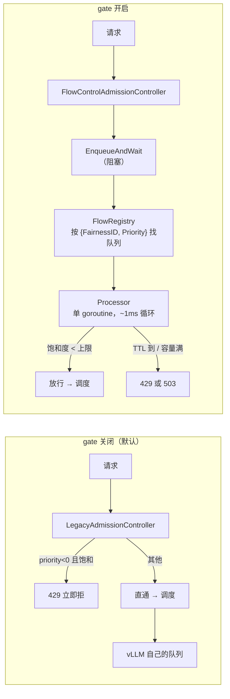
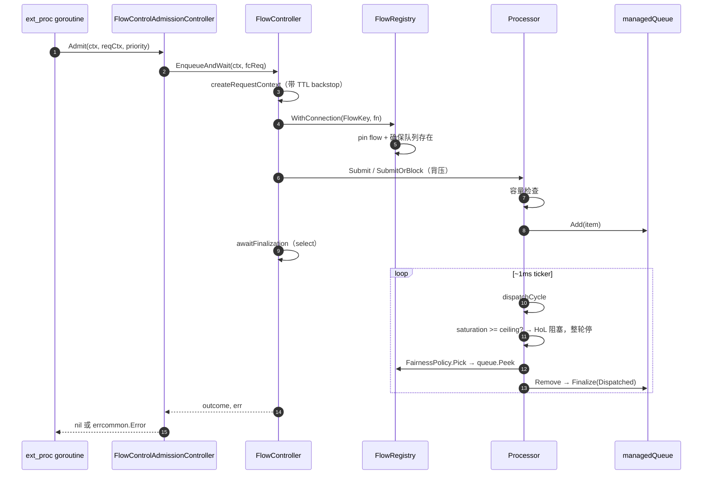

# 05 · Flow Control 流控与准入

> **源码基线**：[`main @ 90a28bc`](https://github.com/llm-d/llm-d-router/tree/90a28bc66f1d96f84f8f18f11dcd6ed15f34e830)
> `pkg/epp/flowcontrol`（6182 行 / 31 文件）。**默认关闭**，需 `featureGates: ["flowControl"]`。
> 本篇回答 [00 篇](00-总览与架构.md#2-统一示例贯穿-0007-篇) 的第 5 个问题：**如果 D1..D4 全忙，请求 A 是被拒绝、还是在 EPP 里排队？**

## 0. 一句话定位

**Flow Control 把「队列」从模型服务器搬到 EPP，换取跨租户的公平性与优先级控制。**

关掉它：请求要么直通，要么立刻被拒。忙不忙由 vLLM 自己的队列决定。
开启它：请求在 EPP 里**阻塞等待**，按优先级和公平策略排队分发。



**为什么值得把队列搬到网关**：vLLM 的队列是 FIFO 的、不知道租户、不知道优先级。想让「付费用户优先于免费用户」「批处理让位于交互式」，必须在能看到全局的地方排队——那就是网关。

**代价**：请求在 EPP 内存里排队，EPP 的内存与 goroutine 随排队量增长；而且引入了一个 fail-closed 的依赖（§6.4）。

## 1. 架构：actor 模型，不是分片 worker 池

先纠正一个容易有的先验：**这里没有 `ShardedQueue`，也没有 worker 池。** 队列是「每个 `FlowKey` 一个」，调度由**单个 goroutine 串行**完成。

| 组件 | 职责 | 文件 |
|------|------|------|
| `AdmissionController` | Director 的准入入口（接口） | `pkg/epp/requestcontrol/admission.go` |
| `FlowController` | 同步入口 `EnqueueAndWait`，管请求生命周期 | `flowcontrol/controller/controller.go` |
| **`Processor`** | **单 goroutine**：入队、dispatch 循环、TTL sweep | `flowcontrol/controller/internal/processor.go` |
| `FlowRegistry` | Flow / priority band / 队列的生命周期与容量统计 | `flowcontrol/registry/registry.go` |
| `managedQueue` | 装饰 `SafeQueue`，维护 band 与全局统计 | `flowcontrol/registry/managedqueue.go` |
| `PriorityQueue` | `container/heap`，按 `OrderingPolicy.Less` 排序 | `flowcontrol/queue/priorityqueue.go` |
| `RequestEvictor` | 可选：驱逐**已派发**的请求 | `flowcontrol/eviction/` |
| 策略插件 | Fairness / Ordering / Saturation / UsageLimit / Eviction | `framework/plugins/flowcontrol/` |

### 1.1 单 writer 的价值

```
Processor.Run goroutine 是唯一的写者
  → 容量检查与 dispatch 天然原子（不需要跨这两步加锁）
  → 不会出现「检查时有空位、写入时已满」
```

代价是 dispatch 吞吐受单 goroutine 限制。Registry 的热路径（读统计、找队列）用 `sync.Map` + 原子计数保持无锁。

### 1.2 请求流转



### 1.3 双向终结

一个请求可能从两个方向被终结，这是并发设计的核心难点：

| 方向 | 谁终结 | 场景 |
|------|-------|------|
| Controller 侧 | `awaitFinalization` | TTL 到、客户端断开、EPP 关停 |
| Processor 侧 | dispatch / capacity reject / shutdown | 正常派发、队列满、关停 |

```go
// pkg/epp/flowcontrol/controller/controller.go:422-449（节选）
func (fc *FlowController) awaitFinalization(reqCtx context.Context, item *internal.FlowItem) error {
	select {
	case <-reqCtx.Done():
		cause := context.Cause(reqCtx)
		item.Finalize(cause)
		return item.FinalState().Err
	case <-fc.parentCtx.Done():
		return finalizeOnControllerShutdown(item)
	case finalState := <-item.Done():
		return finalState.Err
	}
}
```

`Finalize` 是幂等的，两侧竞争时只有一个生效。**「zombie item」**（已被外部终结但还在队列里）由后台 sweep 清理：

```go
// pkg/epp/flowcontrol/controller/internal/processor.go:298-301（节选）
// Optimistic external finalization check; ultimate guarantee is runCleanupSweep
```

## 2. 准入入口

### 2.1 两个实现

```go
// pkg/epp/requestcontrol/admission.go:37-57（节选）
// AdmissionController defines the interface for making admission control decisions.
type AdmissionController interface {
	Admit(
		ctx context.Context,
		reqCtx *handlers.RequestContext,
		priority int,
	) error
}
```

| 实现 | 何时用 | 位置 |
|------|-------|------|
| `LegacyAdmissionController` | gate **关闭**（默认） | `admission.go:89-129` |
| `FlowControlAdmissionController` | gate 开启 | `admission.go:133-194` |

接线在 `runner.go:958-1008`（`initAdmissionControl`）。

**Legacy 的逻辑极简**（`admission.go:65-84`）：`priority < 0`（sheddable）且 `Saturation >= 1.0` → 立即 429；其他全部直通。**注意它仍然用 `SaturationDetector`**——这就是 02 篇说的「gate 关闭时 `saturationDetector` 配置仍生效」。

### 2.2 Flow Control 的 Admit

```go
// pkg/epp/requestcontrol/admission.go:157-194（节选）
func (fcac *FlowControlAdmissionController) Admit(...) error {
	fcReq := &flowControlRequest{
		fairnessID: reqCtx.SchedulingRequest.FairnessID,
		priority:   priority,
		// ...
	}
	start := time.Now()
	outcome, err := fcac.flowController.EnqueueAndWait(ctx, fcReq)
	if outcome == types.QueueOutcomeDispatched {
		reqCtx.FlowControlQueueDuration = time.Since(start)
		reqCtx.FlowControlAdmitted = true
	}
	return translateFlowControlError(err, poolEmpty)
}
```

`EnqueueAndWait`（`controller.go:235-305`）四步：

1. `createRequestContext` —— 建带 TTL backstop 的 context
2. `WithConnection` —— 向 Registry 租一个 Flow（防止排队期间队列被 GC）
3. `tryDistribution` → `processor.Submit` / `SubmitOrBlock`
4. `awaitFinalization` —— 阻塞

### 2.3 为什么是同步阻塞

```go
// pkg/epp/flowcontrol/controller/controller.go:223-234（节选）
// EnqueueAndWait fits ext_proc: request goroutine blocks until definitive outcome.
// Direct backpressure if queues full.
```

这个选择完全由 ext-proc 的形态决定：EPP 是被 Envoy 同步调用的，一个请求对应一个 goroutine。让这个 goroutine 阻塞，**背压天然地传递给 Envoy**（Envoy 的 ext-proc 流卡住 → 上游感知到慢）。如果改成异步回调，还得自己实现一套背压。

代价直接：**排队的请求数 = 阻塞的 goroutine 数**。默认 band 容量 5000 请求 × 多个租户，是实打实的 goroutine 与内存。

## 3. 错误码映射

这是 Flow Control 最需要精确理解的部分。

```go
// pkg/epp/requestcontrol/admission.go:243-280（节选）
// Error codes encode availability: ResourceExhausted (429) means capacity exists but is contended (backpressure),
// ServiceUnavailable (503) means no serving capacity exists right now. A queue-wait TTL expiry is therefore 429
// when the pool has endpoints and 503 when it does not; poolEmpty is the live probe deciding that split, invoked
// only when the TTL case is reached.
func translateFlowControlError(err error, poolEmpty func() bool) error {
	// ...
	switch {
	case errors.Is(err, types.ErrFlowControllerNotRunning):
		return errcommon.Error{Code: errcommon.ServiceUnavailable, ...}      // 503
	case errors.Is(err, types.ErrNoEndpoints):
		if errors.Is(err, types.ErrEvicted) {
			return errcommon.Error{Code: errcommon.ServiceUnavailable, ...}  // 503
		}
		return errcommon.Error{Code: errcommon.ServiceUnavailable, ...}      // 503
	case errors.Is(err, types.ErrQueueAtCapacity):
		return errcommon.Error{Code: errcommon.ResourceExhausted, ...}       // 429
	case errors.Is(err, types.ErrTTLExpired):
		if poolEmpty() {
			return errcommon.Error{Code: errcommon.ServiceUnavailable, ...}  // 503
		}
		return errcommon.Error{Code: errcommon.ResourceExhausted, ...}       // 429
	case errors.Is(err, types.ErrContextCancelled):
		return errcommon.Error{Code: errcommon.ServiceUnavailable, ...}      // 503
	default:
		return errcommon.Error{Code: errcommon.Internal, ...}                // 500
	}
}
```

汇总（与 01 篇 §3.1 的分界线一致）：

| 情况 | Sentinel | HTTP | drop reason header |
|------|----------|------|-------------------|
| 队列满（池里有 endpoint） | `ErrQueueAtCapacity` | **429** | `Saturated` |
| **TTL 过期，池里有 endpoint** | `ErrTTLExpired` | **429** | `TTLExpired` |
| **TTL 过期，池是空的** | `ErrTTLExpired` + poolEmpty | **503** | `NoEndpoints` |
| 池空（scale-to-zero） | `ErrNoEndpoints` | 503 | `NoEndpoints` |
| 客户端断开 | `ErrContextCancelled` | 503 | `ContextCancelled` |
| EPP 关停中 | `ErrFlowControllerNotRunning` | 503 | `ShuttingDown` |

**「同一个 TTL 过期，两个不同状态码」是有意为之**：等超时了但池子有 pod = 忙不过来（客户端应该重试 / 退避）；等超时了池子还是空的 = 服务不可用（客户端应该换个地方或告警）。`poolEmpty` 是**过期那一刻的实时探测**，不是排队开始时的快照。

## 4. 队列模型

### 4.1 FlowKey：二维分组

```go
// pkg/epp/framework/interface/flowcontrol/flow.go:24-45（节选）
type FlowKey struct {
	ID       string  // FairnessID：租户 / agent 身份 / program
	Priority int     // priority band
}
```

| 概念 | 定义 | 数量 |
|------|------|------|
| **Flow** | 一个 `{FairnessID, Priority}` 组合 → 一个 `managedQueue` | 租户数 × band 数 |
| **Priority Band** | 同一 `Priority` 的所有 Flow | 通常 2~5 个 |

`FairnessID` 从哪来（01 篇 Director 第 ⑤ 步）：

```
① header（metadata.FlowFairnessIDKey）
② agent-identity 插件产出的身份
③ metadata.DefaultFairnessID（兜底）
```

**所以不配 `agent-identity` 也不传 header 的话，所有请求都在同一个 Flow 里**——公平性策略退化成纯排序策略。想要多租户公平必须先让 `FairnessID` 有区分度。

### 4.2 Priority Band

```go
// pkg/epp/flowcontrol/registry/config.go:122-125（节选）
// PriorityBandConfig defines the configuration template for a single priority band.
// A "Band" is defined as the collection (or range) of all flows having the same priority level.
```

运行时结构：

```go
// pkg/epp/flowcontrol/registry/registry_helpers.go:30-66（节选）
type priorityBand struct {
	fairnessPolicy flowcontrol.FairnessPolicy
	policyState    any
	config         PriorityBandConfig
	stats          occupancyStats
	queues         map[string]*managedQueue  // key = FairnessID
	activeQueues   sync.Map                  // 非空队列索引，O(active) 迭代
}
```

`activeQueues` 是个性能优化：dispatch 每 ~1ms 跑一次，如果每次都遍历所有租户的队列（大部分是空的），开销随租户数线性增长。只迭代非空队列把复杂度降到 O(active flows)。

### 4.3 整体结构

```
FlowRegistry
├── priorityBands: sync.Map[int → *priorityBand]
│     └── queues[FairnessID] → managedQueue → PriorityQueue (container/heap)
├── flowStates: sync.Map[FlowKey → *flowState]     租约与 GC
└── totals: occupancyStats                          全局计数
```

### 4.4 容量：两个维度

```go
// pkg/epp/flowcontrol/controller/internal/processor.go:365-388（节选）
// 同时检查请求数 Len 与字节数 ByteSize，band 级 + 可选 global 级
```

配置在 `registry/config.go:71-81, 144-154`。默认 band 容量：`maxRequests=5000`、`maxBytes=1GB`（`config.go:44-49`）。负优先级（sheddable）band 可配更小的 `DefaultNegativePriorityBand`（`config.go:92-97`）。

**为什么要字节维度**：请求数不反映内存占用。5000 个 100-token 请求和 5000 个 100k-token 请求，内存差三个数量级。`maxBytes` 是真正防 OOM 的那道闸。

### 4.5 容量满时：拒绝，不驱逐

这一点与上游 README 的描述有出入，值得单独说。

```
// pkg/epp/flowcontrol/README.md:19-20
// orchestrating displacement (eviction of lower-priority queued items...)
```

README 描述了「displacement」——高优先级请求挤掉低优先级的**排队中**请求。**但当前代码里没有实现**：容量满时直接 `ErrQueueAtCapacity`（`processor.go:329-349`），不做队内挤占。

代码里真实存在的两类驱逐是 §7 讲的那两种（TTL 驱逐、in-flight 驱逐），都不是 README 说的 displacement。**读上游文档时要注意区分愿景与实现。**

## 5. 公平性策略

### 5.1 接口

```go
// pkg/epp/framework/interface/flowcontrol/plugins.go:50-81（节选）
type FairnessPolicy interface {
	// NewState: 每个 Priority Band 一份可变状态（Flyweight 模式）
	NewState(ctx context.Context) any
	// Pick: 在本 band 的活跃 flow 中选下一个被 dispatch 的队列
	Pick(ctx context.Context, flowGroup PriorityBandAccessor) (flow FlowQueueAccessor, err error)
}
```

`NewState` 的设计：策略插件本身是无状态单例（一个实例服务所有 band），per-band 的可变状态由框架持有。这样同一个策略类型可以在多个 band 上独立工作。

### 5.2 global-strict（默认）

```go
// pkg/epp/framework/plugins/flowcontrol/fairness/globalstrict/global_strict.go:67-119
// Pick executes the global strict strategy by iterating over every active flow in the band
// and inspecting the head of each queue to find the single highest-priority item.
//
// Requirements:
// All flows in the band MUST use compatible OrderingPolicy types (i.e., identical score types).
// If incompatible policies are detected, an error is returned.
func (p *globalStrict) Pick(
	_ context.Context,
	flowGroup flowcontrol.PriorityBandAccessor,
) (flowcontrol.FlowQueueAccessor, error) {
	// ...
	flowGroup.IterateQueues(func(queue flowcontrol.FlowQueueAccessor) (keepIterating bool) {
		if queue == nil || queue.Len() == 0 {
			return true
		}
		item := queue.Peek()
		// ...
		if bestQueue == nil {
			bestQueue = queue
			bestItem = item
			return true
		}
		if queue.OrderingPolicy().TypedName().Type != bestQueue.OrderingPolicy().TypedName().Type {
			iterationErr = fmt.Errorf("%w: expected %q, got %q", flowcontrol.ErrIncompatiblePriorityType,
				bestQueue.OrderingPolicy().TypedName().Type, queue.OrderingPolicy().TypedName().Type)
			return false
		}
		if bestQueue.OrderingPolicy().Less(item, bestItem) {
			bestQueue = queue
			bestItem = item
		}
		return true
	})
	// ...
	return bestQueue, nil
}
```

算法：**遍历所有非空队列，比较各队队头，用 `OrderingPolicy.Less` 选出全局最优项所在的队列。**

它是**无状态**的（`NewState` 返回 nil，`global_strict.go:61-65`）。

**这个「公平性策略」其实不保证租户公平。** 名字里的 "fairness" 指的是「它是 fairness 扩展点的一个实现」。实际语义是「全局最优」：配 FCFS 时它就是全局 FIFO，完全忽略租户边界。**一个高流量租户会自然 dominate 低流量租户**——因为它的队头总是更早入队的。

想要真的租户公平，用下面两个。

### 5.3 round-robin

- **有状态**：`roundRobinCursor{lastSelected *FlowKey}`（`roundrobin.go:64-74`）
- 对 `FlowKeys()` 排序后，从上次选中的下一个开始轮询，跳过空队列（`roundrobin.go:102-127`）
- **保证无饿死**，但完全不看 item 的优先级/deadline

### 5.4 program-aware

- 按 **program ID**（通常来自 `FairnessID` header）维护 `ProgramMetrics`
- **LAS（Least Attained Service）** 类策略：综合 service time、head wait 打分选队列（`program-aware/plugin.go:194-216`）
- 额外挂 `PreRequest` / `ResponseBodyProcessor` 钩子更新 metrics；可选后台 TTL sweep 清理 idle program
- 能 dump Jain 公平性指数

### 5.5 三者对照

| 策略 | 选型依据 | 状态 | 租户公平 | 适用 |
|------|---------|------|---------|------|
| `global-strict-fairness-policy` | 全局最优队头 | 无 | **否**，大租户 dominate | 单租户 / 只要优先级 |
| `round-robin-fairness-policy` | 轮询非空队列 | 有 | 均分 dispatch 机会 | 多租户，负载相近 |
| `program-aware-fairness` | LAS 等服务量指标 | 有 | 按已获服务量补偿 | 多租户，负载悬殊 |

## 6. 排序与饱和检测

### 6.1 OrderingPolicy

```go
// pkg/epp/framework/interface/flowcontrol/plugins.go:102-107（节选）
// Less reports whether item 'a' should be dispatched before item 'b'.
// Invariant: returning true means 'a' has higher priority than 'b'.
```

heap 的根就是 `Less` 意义下最优的项（`priorityqueue.go:77-81`）。

| 策略 | 比较依据 | 位置 |
|------|---------|------|
| `fcfs-ordering-policy`（默认） | `EnqueueTime` 早者优先 | `ordering/fcfs/fcfs.go:71-84` |
| `edf-ordering-policy` | `EnqueueTime + EffectiveTTL` 的 deadline 早者优先，平局退 FCFS | `ordering/edf/edf.go:89-109` |
| `slo-deadline-ordering-policy` | `ReceivedTimestamp + TTFT-SLO header(ms)`；无/无效 header → 远未来 | `ordering/slodeadline/slo_deadline.go:110-138` |

```go
// pkg/epp/framework/plugins/flowcontrol/ordering/edf/edf.go:89-109（节选）
func (p *EDFPolicy) Less(a, b flowcontrol.QueueItemAccessor) bool {
	deadlineA := calculateDeadline(a)  // EnqueueTime + EffectiveTTL
	deadlineB := calculateDeadline(b)
	if !deadlineA.Equal(deadlineB) {
		return deadlineA.Before(deadlineB)
	}
	return a.EnqueueTime().Before(b.EnqueueTime())
}
```

**`slo-deadline-ordering-policy` 的坑**：没带 SLO header 的请求被赋一个「远未来」的 deadline，也就是**排到所有带 header 的请求后面**。混合流量下，不带 header 的那部分会被系统性地饿死。要么全都带，要么别用这个策略。

**跨策略约束**：`global-strict` 要求同 band 内所有 flow 用**相同类型**的 OrderingPolicy（§5.2 那个 `ErrIncompatiblePriorityType`）。混配会在 dispatch 时报错。

### 6.2 SaturationDetector

```go
// pkg/epp/framework/interface/flowcontrol/plugins.go:110-127（节选）
type SaturationDetector interface {
	// Saturation returns aggregate saturation [0.0, 1.0+]
	// >= 1.0: fully saturated; > 1.0: overload depth
	Saturation(ctx context.Context, endpoints []datalayer.Endpoint) float64
}
```

**值域可以超过 1.0**——超出部分表达「过载有多深」，给 `priority-holdback-policy` 之类的策略当输入。

### 6.3 utilization-detector（默认）

```go
// pkg/epp/framework/plugins/flowcontrol/saturationdetector/utilization/detector.go:119-165
// Saturation calculates the saturation level of the pool.
//
// It returns an aggregate saturation signal where:
//
//	Saturation = Average(PodSaturationScore)
//
// For each pod, the score is determined by the most constrained resource (Compute or Memory):
//
//	PodScore = Max(WaitingQueue / QueueThreshold, KVCacheUsage / KVCacheThreshold)
func (d *Detector) Saturation(_ context.Context, candidates []datalayer.Endpoint) float64 {
	if len(candidates) == 0 {
		// No candidates means no stale endpoints. ...
		metrics.RecordFlowControlStaleEndpoints(d.typedName.Name, 0)
		return 1.0
	}

	var totalScore float64
	staleCount := 0
	for _, e := range candidates {
		podMetrics := e.GetMetrics()

		if podMetrics == nil || time.Since(podMetrics.UpdateTime) > d.config.MetricsStalenessThreshold {
			// Fail closed: an endpoint whose metrics are missing or stale scores as fully saturated. A
			// fleet-wide metrics collection failure therefore halts dispatch entirely rather than
			// admitting blind; the gauge and the rate-limited log below exist so operators can tell that
			// stall apart from genuine overload (which typically scores above 1.0).
			totalScore += 1.0
			staleCount++
			continue
		}

		qRatio := float64(podMetrics.WaitingQueueSize) / float64(d.config.QueueDepthThreshold)
		kvRatio := podMetrics.KVCacheUsagePercent / d.config.KVCacheUtilThreshold

		// Roofline Analysis: The pod is saturated if either resource is exhausted.
		totalScore += max(qRatio, kvRatio)
	}

	metrics.RecordFlowControlStaleEndpoints(d.typedName.Name, staleCount)
	if staleCount > 0 {
		d.maybeLogStaleEndpoints(staleCount, len(candidates))
	}

	return totalScore / float64(len(candidates))
}
```

**Roofline 分析**（`max(qRatio, kvRatio)`）是这里的核心思想：一个 pod 的瓶颈是**最紧的那个资源**。队列不长但 KV 快满了，同样是饱和。

默认阈值（`utilization/config.go:29-38`）：

| 参数 | 默认 |
|------|------|
| `queueDepthThreshold` | 5 |
| `kvCacheUtilThreshold` | 0.8 |
| `metricsStalenessThreshold` | **200ms** |
| `headroom` | 0 |

**注意这个 200ms 与 03 篇的全局 `--metrics-staleness-threshold`（2s）是两个独立配置**，前者严格 10 倍。这是刻意的：Flow Control 的决策比池级聚合指标更敏感。

### 6.4 fail-closed 是最大的运维风险

那段注释值得反复读：stale endpoint 按 **1.0（完全饱和）** 计。推论：

> **全池指标采集失败 → saturation = 1.0 → dispatch 完全停止 → 所有请求排队至 TTL 过期 → 全部 429/503。**

而后端 vLLM 可能完全空闲。

设计者是清醒的：注释说这比「盲目放行」好，并且提供了区分手段——

| 现象 | 含义 |
|------|------|
| `saturation ≈ 1.0` + `stale_endpoints > 0` | **采集故障**（假饱和） |
| `saturation > 1.0` + `stale_endpoints = 0` | 真过载 |

**所以 `llm_d_epp_flow_control_stale_endpoints` 是开启 Flow Control 后必须配告警的指标。** 日志有 30s 限流（`detector.go:45-48, 167-182`），别指望靠日志刷屏发现。

一个具体的触发链：03 篇 §8.4 那个「自定义 engine mapping 合并粒度是按 engine 而非按字段」的坑 → 内置 vLLM 指标全丢 → 所有 endpoint 无指标 → stale → Flow Control 停摆。**一个配置错误能让整个池子对外 429。**

### 6.5 concurrency-detector

| 模式 | 计算 |
|------|------|
| `requests` | `TotalInflight / TotalCapacity` |
| `tokens` / `hybrid` | per-endpoint `max(reqRatio, tokRatio)` 再平均（`concurrency/detector.go:122-172`） |

读 03 篇 §6.2 的 `InFlightLoad` attribute。**没有 staleness 概念**（同步计数，EPP 自己记账），因此**不会 fail-closed**。

这是个重要的选择依据：**担心 fail-closed 风险的话，用 `concurrency-detector` 替代 `utilization-detector`**。代价是它只知道 EPP 派出去多少，不知道引擎内部实际多忙。

### 6.6 门控：HoL 阻塞

```go
// pkg/epp/flowcontrol/controller/internal/processor.go:489-506（节选）
	priorities := p.registry.AllOrderedPriorityLevels()
	ceilings := p.ceilingsBuffer(len(priorities))
	p.usageLimitPolicy.ComputeLimit(ctx, saturation, priorities, ceilings)

	for i, priority := range priorities {
		// --- Viability Check (Saturation/HoL Blocking) ---
		// Check before selecting an item: if we are already saturated for this priority, stop immediately.
		usageLimit := ceilings[i]
		if saturation >= usageLimit {
			p.logger.V(logutil.DEBUG).Info("Priority band is saturated; enforcing HoL blocking.",
				"priority", priority, "saturation", saturation, "usageLimit", usageLimit)
			if p.reclamation != nil {
				p.maybeReclaim(ctx, saturation, priorities, ceilings, i)
			}
			// Stop the dispatch cycle entirely to respect strict policy decision and prevent priority inversion where
			// lower-priority work might exacerbate the saturation affecting high-priority work.
			return false
		}
		// ...
```

**关键在最后那句注释**：高优先级 band 饱和时，**整个 dispatch cycle 停止**，低优先级 band 不能「趁机」放行。

这是刻意的**优先级反转防护**：如果让低优先级请求继续派发，它们会消耗后端资源，加剧高优先级请求面临的饱和——低优先级反而先被服务了。

代价是「head-of-line blocking」：高优先级 band 里有一个请求过不去，全池 dispatch 停摆。**没有滞回（hysteresis）机制**——`headroom` 参数只影响 scheduling 层的 `utilization-filter`（`detector.go:185-212`），不影响这里的门控。所以 saturation 在阈值附近抖动时，dispatch 会跟着抖。

P/D 场景下取各 stage saturation 的最大值作为 effective（`processor.go:462-484`）。

## 7. 用量限制与驱逐

### 7.1 UsageLimitPolicy

决定每个 priority band 的饱和度上限（ceiling）。

```go
// pkg/epp/framework/plugins/flowcontrol/usagelimits/usagelimitpolicy.go:59-65
func NewConstPolicy(usageLimitName string, threshold float64) flowcontrol.UsageLimitPolicy {
	return NewPolicyFunc(usageLimitName, func(_ context.Context, _ float64, _ []int, ceilings []float64) {
		for i := range ceilings {
			ceilings[i] = threshold
		}
	})
}
```

| 策略 | 行为 |
|------|------|
| `static-usage-limit-policy`（默认） | 所有 band 一个固定值（默认 **1.0**，即不额外 gate） |
| `priority-holdback-policy` | 随 saturation 升高**压低**低优先级 band 的 ceiling |
| `soft-reflective-ceiling-policy` | 软性上限（Alpha） |

**`priority-holdback-policy` 是实现「过载时先保高优先级」的关键**。默认的 static 策略下，所有 band 的 ceiling 都是 1.0，只有 §6.6 的全局 HoL 阻塞在起作用——即「全饱和了就都停」，没有分级降级。想要「饱和到 0.7 就开始限制低优先级」，需要换成 holdback。

### 7.2 两类驱逐

| 类型 | 对象 | 触发 | 需要开关 |
|------|------|------|---------|
| **Queue TTL 驱逐** | 排队中的请求 | 后台 sweep 发现超 TTL | 无（总是启用） |
| **In-flight 驱逐** | **已派发**的请求 | HoL 阻塞时 `maybeReclaim` | `EnableEviction` |

Queue TTL 驱逐在 `processor.go:663-689`。

In-flight 驱逐（revocation）是个更激进的能力：**已经发给 vLLM 的请求被撤回**。这就是 01 篇 §2.1 那个 `evictCh` 的用途——ext-proc 主循环收到驱逐信号，终止这个请求的处理。

默认的驱逐策略：

```go
// pkg/epp/framework/plugins/flowcontrol/eviction/filtering/sheddable.go:52-54
func (f *SheddableFilter) Accept(item *flowcontrol.EvictionItem) bool {
	return item.Priority < 0
}
```

**只有 sheddable（priority < 0）的请求会被撤回**，正常优先级的不会。

```go
// pkg/epp/framework/plugins/flowcontrol/eviction/ordering/priority_time.go:52-56
func (p *PriorityThenTimeOrdering) Less(a, b *flowcontrol.EvictionItem) bool {
	if a.Priority != b.Priority {
		return a.Priority < b.Priority
	}
	return a.DispatchTime.After(b.DispatchTime)
}
```

**「同优先级选最新派发的」是个漂亮的设计**：最新派发的请求算的 token 最少，撤回它浪费的 KV 计算最少。撤回一个跑了 30 秒的请求要比撤回一个刚开始的浪费得多。

### 7.3 Sheddable 的定义

```go
// pkg/epp/util/request/sheddable.go:19-22
func IsSheddable(priority int) bool {
	return priority < 0
}
```

`priority` 来自 `InferenceObjective` CRD（01 篇 Director 第 ② 步），没有 CRD 时默认 0。**所以默认没有任何请求是 sheddable 的**——想要「批处理任务可被丢弃」，必须给它配一个负 priority 的 `InferenceObjective`。

## 8. 可观测性

指标定义在 `pkg/epp/metrics/llm_d_router_metrics.go:326-520`，记录函数在 `metrics.go:866-1024`。

| 指标 | 类型 | 用途 |
|------|------|------|
| **`llm_d_epp_flow_control_pool_saturation{inference_pool,stage}`** | Gauge | **首要**。是否 ≥1；stage 区分 prefill/decode |
| **`llm_d_epp_flow_control_stale_endpoints{detector}`** | Gauge | **区分假饱和与真过载**（§6.4） |
| `llm_d_epp_flow_control_requests_total{outcome,priority,inference_pool}` | Counter | outcome: Dispatched / RejectedCapacity / EvictedTTL … |
| `llm_d_epp_flow_control_capacity_utilization_requests/bytes` | Gauge | EPP 队列占用率 |
| `llm_d_epp_flow_control_global_capacity_utilization_*` | Gauge | 全局容量 |
| `llm_d_epp_flow_control_queue_size` / `_bytes` | Gauge | 排队深度（**高 cardinality**，带 fairness_id） |
| `llm_d_epp_flow_control_request_enqueue_duration_seconds` | Histogram | 入队路径耗时（反映背压） |
| `llm_d_epp_flow_control_dispatch_cycle_duration_seconds` | Histogram | dispatch 循环性能 |
| `llm_d_epp_flow_control_revocations_*` | Counter/Gauge | in-flight 驱逐 |

**排障优先级**：

```
1. pool_saturation ≥ 1？
     ├─ stale_endpoints > 0  → 采集故障（假饱和）→ 查 03 篇 §9 的决策树
     └─ stale_endpoints = 0  → 真过载 → 扩容 / 调阈值
2. requests_total 按 outcome 看分布
     RejectedCapacity 多 → EPP 队列容量不够
     EvictedTTL 多      → TTL 太短 或 后端真的处理不完
3. capacity_utilization_* → EPP 队列是否打满
4. request_enqueue_duration → 是否 SubmitOrBlock 背压严重
```

**cardinality 注意**：`queue_size` 带 `fairness_id` 标签。租户多时（比如按 API key 分）会爆 Prometheus。FairnessID 被 GC 时会 `DeleteFlowControlFlowSeries` 清理时间序列（`registry.go:487-493`），但活跃租户多本身就是问题。

**已知竞态**（03 篇 §8.4 也提过）：

```go
// pkg/epp/metrics/metrics.go:1027-1034（节选）
// Pruning is not synchronized with recording: ... queue gauge ... can leave
// the queue size/bytes gauges negative
```

**队列 gauge 可能是负数**，别当采集 bug 报。

## 9. TTL 与两种 regime

### 9.1 双 TTL

```go
// pkg/epp/flowcontrol/controller/config.go:27-33（节选）
// defaultRequestTTL = 60s
```

| 配置 | 用于 |
|------|------|
| `DefaultRequestTTL`（60s） | 池里**有** endpoint 时（真正的饱和排队） |
| `NoEndpointRequestTTL` | 池里**没有** endpoint 时（scale-from-zero 的等候室） |

分开的原因：scale-from-zero 场景下，请求要等 WVA/HPA 扩出 pod 再等 pod 就绪，可能需要几十秒到几分钟——比「后端忙」的合理等待时间长得多。这里和 [WVA 的 scale-from-zero](../../autoscaling/llm-d-autoscaling/03-核心代码分析-Optimizer与Limiter.md) 是配套的：**Flow Control 提供等候室，WVA 负责把 pod 拉起来**（WVA 直接改 replicas 的那个唯一例外场景就是它）。

### 9.2 Regime 切换会重置计费起点

```go
// pkg/epp/flowcontrol/controller/internal/processor.go:707-710（节选）
// Elapsed time charged from later of enqueue and most recent regime change
```

从「无 endpoint」切到「有 endpoint」时，TTL 重新开始计。合理——刚有 pod 可用就把等了很久的请求判超时，不如给它一次机会。

### 9.3 Context backstop

```go
// pkg/epp/flowcontrol/controller/controller.go:467-484（节选）
// max(satTTL, noEndpointTTL) + 2*sweepInterval
```

请求 context 的 deadline 比 TTL 多留 2 个 sweep 周期，避免「deadline 和 sweep 在同一 tick 触发」的竞态导致双重终结路径打架。

### 9.4 per-request TTL 还没实现

```go
// pkg/epp/requestcontrol/admission.go:217-221（节选）
// TODO(#1090): plumb more specific TTL scopes...
```

per-request TTL 恒为 0，全部走 controller 默认。**意味着无法给不同租户/优先级配不同的排队超时**，一个 60s 打天下。这在混合负载下是个实际限制：交互式请求等 60s 早就没意义了，批处理等 60s 又太短。

## 10. Fallback 到 priority 0

control plane 通过 `SubmitDesiredPriorities` 推送 band 拓扑（`registry.go:201-220`）。**没有被 provision 的 priority 会 fallback 到 0**（`controller.go:322-350`）。

```go
// pkg/epp/flowcontrol/controller/controller.go:307-314（节选）
// item.OriginalRequest().FlowKey() reports fallback priority, not requested one
```

**这个 fallback 有个观测陷阱**：`InferenceObjective` 配了 `priority: -1`（想让它 sheddable），但 `-1` 这个 band 没被 provision → 实际进了 priority 0 队列 → **既不 sheddable 也不低优先级**。而指标里显示的是 fallback 后的 0，看不出你的意图没生效。

## 11. 开启前必须知道的

### 11.1 gate 关闭时配了 `flowControl:` 段

```go
// pkg/epp/config/loader/configloader.go:219-227（节选）
	if featureGates[flowcontrol.FeatureGate] {
		flowControlConfig, err = buildFlowControlConfig(...)
	} else if flowControlSettingsConfigured(rawConfig.FlowControl) {
		logger.Info("WARNING: the flowControl config section is set but the flowControl feature gate is disabled; its settings (other than saturationDetector) are ignored")
	}
```

| 配置项 | gate 关闭时 |
|--------|-----------|
| `saturationDetector` | **仍生效**（Legacy admission + scheduling filter 都用） |
| `maxBytes` / `maxRequests` / `priorityBands` | 忽略 |
| `defaultRequestTTL` | 忽略 |
| 公平性 / 排序 / 用量限制策略 | 忽略 |

只有一行 **Info 级** WARNING，很容易在启动日志里划过去。

### 11.2 行为变化清单

| | gate 关闭 | gate 开启 |
|---|----------|----------|
| 请求在哪排队 | vLLM 内部 | **EPP 内存** |
| 过载时的表现 | 后端队列变长，延迟升高 | EPP 排队，超 TTL 后 429 |
| 优先级 | 只有「sheddable 立即拒」 | 分 band dispatch |
| 租户公平 | 无 | 有（取决于策略与 FairnessID） |
| 指标采集故障 | 影响打分质量 | **可能全面停摆**（fail-closed） |

### 11.3 五个开启后的风险

1. **内存与 goroutine**：默认 band 5000 请求 × 租户数。`maxBytes`（1GB 默认）是真正的闸。
2. **fail-closed 停摆**：§6.4。必须监控 `stale_endpoints`。想避免可换 `concurrency-detector`。
3. **60s 固定 TTL** 与客户端 deadline 不匹配（§9.4）。客户端已经超时放弃了，请求还在 EPP 队列里占位。
4. **`global-strict` 不保证租户公平**（§5.2）。多租户要显式换策略 + 让 FairnessID 有区分度。
5. **In-flight 驱逐需要显式开** `EnableEviction` + ext-proc 接线，不开只有队列侧的拒绝与 TTL。

### 11.4 一个可用的起点配置

```yaml
featureGates: ["flowControl"]
plugins:
  - type: utilization-detector
    parameters:
      queueDepthThreshold: 8
      kvCacheUtilThreshold: 0.85
      metricsStalenessThreshold: "500ms"   # 默认 200ms 偏严，容易假饱和
  - type: fcfs-ordering-policy
  - type: round-robin-fairness-policy      # 多租户不要用默认的 global-strict
  - type: static-usage-limit-policy
flowControl:
  saturationDetector: utilization-detector
  defaultRequestTTL: "30s"                 # 按客户端超时设，别用 60s 默认
  priorityBands:
    - priority: 10
      maxRequests: 2000
      maxBytes: "512Mi"
    - priority: 0
      maxRequests: 2000
      maxBytes: "512Mi"
    - priority: -1                         # 必须显式 provision，否则 fallback 到 0（§10）
      maxRequests: 500
      maxBytes: "128Mi"
```

三个刻意的偏离默认值之处：staleness 放宽到 500ms（降低假饱和概率）、TTL 收紧到 30s（贴近真实客户端超时）、显式 provision 负 band（否则 sheddable 不生效）。

## 12. 用示例串一遍

D1..D4 全忙（每个队列 12 个请求、KV 78%），请求 A（`FairnessID=tenant-a`、`priority=0`）到达，gate 开启：

```
Director 第 ⑥ 步 → FlowControlAdmissionController.Admit(priority=0)
  → EnqueueAndWait
     ① createRequestContext：deadline = now + 30s(TTL) + 2×sweepInterval
     ② WithConnection(FlowKey{ID:"tenant-a", Priority:0})
        → Registry 确保 priorityBands[0].queues["tenant-a"] 存在，pin 住
     ③ Submit(item)
        Processor 检查容量：band 0 当前 1200/2000 请求、300Mi/512Mi → 有空位
        → managedQueue.Add(item) → PriorityQueue heap 插入（FCFS 按 EnqueueTime）
     ④ awaitFinalization：select 阻塞

Processor dispatch 循环（每 ~1ms）:
  saturation = utilization-detector.Saturation([D1..D4])
    D1: max(12/8, 0.78/0.85) = max(1.50, 0.92) = 1.50
    D2..D4 类似 → 平均 ≈ 1.48
  ceilings = static-usage-limit-policy → 全 1.0
  priority 10（空）→ 10 的 ceiling 1.0，saturation 1.48 ≥ 1.0
    → HoL 阻塞，整轮 return false
    → 日志：'Priority band is saturated; enforcing HoL blocking.'
  A 继续在队列里等

T+8s  后端消化，队列降到 5，KV 到 0.60
  saturation = max(5/8, 0.60/0.85) = max(0.625, 0.706) = 0.706 < 1.0
  → 进入 priority 10 的 band（空，跳过）
  → priority 0：round-robin-fairness-policy.Pick
       活跃队列 [tenant-a, tenant-b]，cursor 上次是 tenant-b → 选 tenant-a
    → queue.Peek() = A（FCFS 最早）
    → Remove → item.Finalize(Dispatched)
  → awaitFinalization 的 select 命中 item.Done()
  → Admit 返回 nil，reqCtx.FlowControlQueueDuration = 8s
                    reqCtx.FlowControlAdmitted = true
  → Director 继续第 ⑦ 步 Locate → ... → 选中 D2
```

**如果 30s 内 saturation 一直 ≥ 1.0**：sweep 发现超 TTL → `Finalize(ErrTTLExpired)` → `translateFlowControlError` 探测 `poolEmpty()`：

- 池里有 pod（本例）→ **429** + `RequestDroppedReasonTTLExpired`
- 池空了（比如同时缩容到 0）→ **503** + `RequestDroppedReasonNoEndpoints`

**如果这 8 秒里指标采集挂了**：所有 endpoint stale → saturation = 1.0（fail-closed）→ dispatch 永不放行 → A 等到 TTL 过期拿 429，**尽管后端此时可能已经空闲**。这时 `stale_endpoints = 4` 是唯一的线索。

## 13. 速查

### 关键文件

```
pkg/epp/requestcontrol/admission.go:37-57, 243-280        接口 + 错误码映射（必读）
pkg/epp/flowcontrol/controller/controller.go:235-305      EnqueueAndWait
pkg/epp/flowcontrol/controller/controller.go:422-449      awaitFinalization
pkg/epp/flowcontrol/controller/internal/processor.go:489-506  HoL 阻塞（必读）
pkg/epp/flowcontrol/registry/registry_helpers.go:30-66    priorityBand 结构
.../fairness/globalstrict/global_strict.go:67-119         默认公平策略
.../saturationdetector/utilization/detector.go:119-165    默认饱和检测（必读）
.../eviction/ordering/priority_time.go:52-56              驱逐排序
pkg/epp/flowcontrol/README.md                             上游设计文档（注意区分愿景与实现）
```

### 默认值

| 项 | 默认 |
|---|------|
| feature gate | **关闭** |
| `defaultRequestTTL` | 60s |
| band `maxRequests` / `maxBytes` | 5000 / 1GB |
| dispatch 循环 | ~1ms |
| 公平策略 | `global-strict-fairness-policy`（**不保证租户公平**） |
| 排序策略 | `fcfs-ordering-policy` |
| 饱和检测 | `utilization-detector`（queue 5、KV 0.8、staleness **200ms**、fail-closed） |
| 用量限制 | `static-usage-limit-policy`（ceiling 1.0，即无分级降级） |
| in-flight 驱逐 | 关闭 |
| sheddable | `priority < 0`，默认 priority=0 → **没有请求是 sheddable 的** |

### 五条必记

1. **fail-closed**：指标采集故障 → 全池假饱和 → dispatch 停摆。监控 `stale_endpoints`。
2. **HoL 阻塞是全局的**：高优先级 band 过不去，低优先级也停。防优先级反转，代价是抖动。
3. **`global-strict` 不是租户公平**，多租户要换 `round-robin` 或 `program-aware`，且 FairnessID 要有区分度。
4. **README 的 displacement 没实现**，容量满是拒绝不是挤占。
5. **负 priority band 必须显式 provision**，否则 fallback 到 0，sheddable 静默失效。

---

**上一篇**：[04 · KV-Cache 索引与前缀缓存路由](04-核心代码分析-KVCache索引与前缀缓存路由.md) ｜ **下一篇**：[06 · P/D 分离与 Sidecar](06-核心代码分析-PD分离与Sidecar.md)
