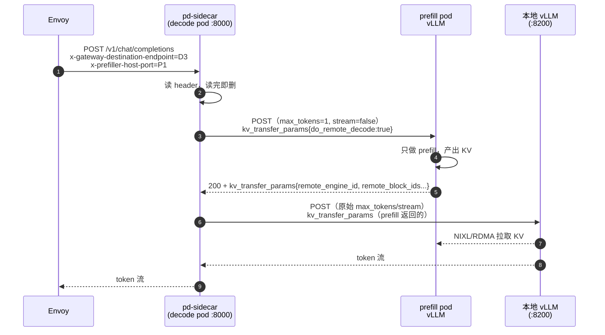

# 06 · P/D 分离与 Sidecar

> **源码基线**：[`main @ 90a28bc`](https://github.com/llm-d/llm-d-router/tree/90a28bc66f1d96f84f8f18f11dcd6ed15f34e830)
> `pkg/sidecar`（6870 行）**就是原 `llm-d-routing-sidecar` 仓库**的代码，那个仓库已归档。`pkg/coordinator`（4982 行）是取代它的实验性方案。
> 本篇回答 [00 篇](00-总览与架构.md#2-统一示例贯穿-0007-篇) 的第 6 个问题：**开了 P/D 分离后，请求 A 怎么先经过 P1 再回到 D3？**

## 0. 一句话定位

**sidecar 是跑在 decode pod 里的一个 HTTP 反向代理，它把 EPP 写在 header 里的「prefill 去哪」变成真实的两阶段调用。**

关键的架构事实（01 篇 §5.2 已经埋了伏笔）：

> **Envoy 全程只知道 decode pod 一个地址。** prefill 是 sidecar 自己发起的、Envoy 看不见的调用。



**为什么 P/D 要分离**：prefill 是计算密集（compute-bound，一次算完整个 prompt），decode 是内存带宽密集（memory-bound，每次算一个 token）。放在同一张卡上，prefill 会打断正在 decode 的请求造成 ITL 抖动。分开跑，各自用最适合的硬件与批处理策略。这个动机与 [vLLM 的 P/D 分离](../../inference-engine/vllm/05-多机推理与PD分离.md) 和 [SGLang 的 PD 部署](../../inference-engine/sglang/05-部署场景-单机-多机-PD分离.md) 是一致的——**llm-d 补的是「谁来编排这两次调用」这一环。**

## 1. Sidecar 的形态

### 1.1 入口与端口

```go
// cmd/pd-sidecar/main.go:30-48（节选）
func main() {
	// Initialize options with defaults
	opts := proxy.NewOptions()

	// Add options flags (including logging flags)
	opts.AddFlags(pflag.CommandLine)
	pflag.Parse()

	logger := opts.NewLogger()
	log.SetLogger(logger)

	ctx := ctrl.SetupSignalHandler()
	log.IntoContext(ctx, logger)

	// Complete options (handles migration from deprecated flags, populates Config)
	if err := opts.Complete(); err != nil {
		logger.Error(err, "Failed to complete configuration")
		return
	}
	// Validate → NewProxy → Start
}
```

端口布局（这是 P/D 部署最容易配错的地方）：

| 谁 | 端口 | 说明 |
|---|------|------|
| **sidecar** | **8000**（`--port`） | **Envoy 打的是这个**；InferencePool 的 targetPort 也指这个 |
| 本地 vLLM | 8200（`--model-server-port`） | 只有 sidecar 访问，不对外 |
| metrics | `--metrics-port`（默认 0 = 关） | sidecar 自己的指标 |
| DP rank r | sidecar `8000+r` → vLLM `8200+r` | `data_parallel.go:54-86` |

```go
// pkg/sidecar/proxy/proxy_helpers.go:33-38（节选）
	ln, err := net.Listen("tcp", ":"+s.config.Port)
```

```go
// pkg/sidecar/proxy/options.go:393-399（节选）
	opts.DecoderURL, err = url.Parse(scheme + "://localhost:" + opts.modelServerPort)
```

**注意 `localhost`**：sidecar 与 vLLM 在同一个 pod、共享 network namespace，所以走 loopback，零网络开销。

参考 `deploy/components/vllm-decode/deployment.yaml`：sidecar `--port=8000`，vLLM `--port=8200`。**prefill pod 不需要 sidecar**——它只是被动接受 sidecar 的调用。

### 1.2 路由表

```
POST /v1/chat/completions      ┐
POST /v1/completions           ├→ disaggregatedPrefillHandler
POST /v1/messages              │   （proxy.go:619-637）
POST /v1/responses             │
POST /inference/v1/generate    ┘
其他所有路径                    → 直接透传给本地 decoder
```

**只有这五条路径走 P/D 编排**，`/health`、`/metrics`、`/v1/models` 等一律透传。

### 1.3 关键 CLI flag

| Flag | 默认 | 定义（`pkg/sidecar/proxy/options.go`） |
|------|------|--------------------------------------|
| `--port` | `"8000"` | `:91, 262` |
| `--model-server-port` | `"8200"`（Complete 后） | `:92, 263-264` |
| **`--kv-connector`** | **`nixlv2`** | `:216, 268` |
| `--ec-connector` | `""`（空 = 跳过 encode） | `:270-271` |
| `--data-parallel-size` | `1` | `:217, 267` |
| `--decode-chunk-size` | `0`（0 = 禁用） | `:226, 283` |
| `--mooncake-bootstrap-port` | `8998` | `:94, 223, 272` |
| `--p2p-connector-port` | `7777` | `:95, 224, 274` |
| `--enable-p2p-pull` | `false` | `:276` |
| `--enable-ssrf-protection` | `false` | `:280` |
| `--inference-pool` | env `INFERENCE_POOL` | `:85, 247, 338` |
| `--enable-prefiller-sampling` | env 或 `false` | `:86, 219, 281` |
| `--prefill-max-retries` | `0` | `:221, 341` |
| `--prefill-retry-backoff` | `200ms` | `:222, 342` |
| `--max-idle-conns-per-host` | `1024` | `:220, 340` |
| `--secure-proxy` | `true` | `:218, 278` |
| MoRI-IO 系列 `--moriio-*` | 见 `:228-334` | Wide-EP / WRITE 模式 |

`--vllm-port` 已弃用，用 `--model-server-port`。

**`--prefill-max-retries` 默认 0 值得注意**：prefill 失败**默认不重试**，直接把错误返回给客户端。生产环境通常该设 1~2 次，配合 200ms backoff。

## 2. P/D 主流程

`disaggregatedPrefillHandler`（`chat_completions.go:61+`）是 sidecar 的核心。它的结构是一个**四路分支**：

```go
// pkg/sidecar/proxy/chat_completions.go:94-116（节选）
		prefillHostPorts := r.Header.Values(routing.PrefillEndpointHeader)
		r.Header.Del(routing.PrefillEndpointHeader)

		if len(prefillHostPorts) == 1 {
			prefillHostPorts = strings.Split(prefillHostPorts[0], ",")
		}

		numHosts := len(prefillHostPorts)
		var prefillHostPort string
		if numHosts > 0 {
			if s.config.EnablePrefillerSampling {
				prefillHostPort = strings.TrimSpace(prefillHostPorts[s.prefillSamplerFn(numHosts)])
			} else {
				prefillHostPort = strings.TrimSpace(prefillHostPorts[0])
			}
		}

		if len(prefillHostPort) == 0 {
			logger.V(logging.DEBUG).Info("skip disaggregated prefill", "api", apiType.String())
			// ...
		}
```

`r.Header.Del` 那一行很重要：**header 读完立即删除，不会转发给 vLLM**。这既是卫生习惯，也避免 vLLM 收到不认识的 header。

`--enable-prefiller-sampling` 的场景：EPP 可以返回多个 prefill 候选（`max-score-picker` 的 `maxNumOfEndpoints > 1`），sidecar 在其中随机采样，把负载摊平。不开则总用第一个。

四路分支：

```go
// pkg/sidecar/proxy/chat_completions.go:188-228（节选）
		if len(allowedEncoders) > 0 && s.handleECConnector != nil {
			logger.V(logging.DEBUG).Info("encoder headers detected, using EC connector", ...)
			s.handleECConnector(w, r, prefillHostPort, allowedEncoders)
			return
		}

		if len(encoderHostPorts) > 0 && len(allowedEncoders) == 0 {
			logger.Info("SSRF protection: all encoder targets filtered out, falling back to P/D or decoder-only")
		}

		if len(prefillHostPort) > 0 {
			logger.V(logging.DEBUG).Info("using P/D protocol")
			s.handlePDConnector(w, r, prefillHostPort, kvCacheSource, apiType)
			return
		}

		logger.V(logging.DEBUG).Info("no prefiller or encoder, using decoder only")
		if !s.forwardDataParallel || !s.dataParallelHandler(w, r) {
			if kvCacheSource != "" {
				s.decodeWithP2PSource(w, r, kvCacheSource)
				return
			}
			if s.config.DecodeChunkSize > 0 && r.URL.Path == ChatCompletionsPath {
				s.runChunkedDecode(w, r)
				return
			}
			s.decoderProxy.ServeHTTP(w, r)
		}
	}
}
```

| 分支 | 条件 | 走向 |
|------|------|------|
| ① E/P/D | 有 encoder header 且配了 `--ec-connector` | `handleECConnector` → 之后再 P/D |
| ② P/D | 有 `x-prefiller-host-port` | `handlePDConnector` |
| ③ P2P source | 有 `x-kv-cache-source-host-port` | `decodeWithP2PSource` |
| ④ 纯 decode | 都没有 | chunked decode 或直接透传 |

**分支 ④ 就是 P/D decider 判定「这个请求不值得分离」的结果**（02 篇 §5.4 的 `prefix-based-pd-decider`）——EPP 不写 prefill header，sidecar 就退化成一个透明代理。

## 3. NIXLv2：默认的 KV 传输路径

> 注意：仓库里**没有** `connector_nixl.go`（旧名）。NIXL 的实现文件是 **`connector_nixlv2.go`**，CLI 值是 `nixlv2`。

### 3.1 Prefill 请求的改写

```go
// pkg/sidecar/proxy/connector_nixlv2.go:128-181（节选）
	if s.config.MoRIIOWriteMode {
		completionRequest[requestFieldKVTransferParams] = map[string]any{
			requestFieldDoRemoteDecode:  true,
			requestFieldDoRemotePrefill: false,
			// ... remote_host, remote_notify_port, transfer_id ...
		}
	} else {
		completionRequest[requestFieldKVTransferParams] = map[string]any{
			requestFieldDoRemoteDecode:  true,
			requestFieldDoRemotePrefill: false,
			// ...
		}
	}
	for _, field := range tokenLimitFields {
		tokenMap[field] = 1
	}
```

sidecar 对 prefill 请求做三处改写：

| 改什么 | 改成什么 | 为什么 |
|--------|---------|--------|
| `max_tokens`（及同类字段） | **1** | prefill pod 只需要算 KV，不需要生成。生成 1 个 token 是为了走通完整的 vLLM 流程 |
| `stream` | **false** | sidecar 需要同步等 `kv_transfer_params` |
| `kv_transfer_params` | `{do_remote_decode: true, do_remote_prefill: false}` | 告诉 vLLM「你是 prefiller，KV 要给远端 decode 用」 |

**`do_remote_decode: true` / `do_remote_prefill: false` 这一对布尔是 vLLM 侧 NixlConnector 的语义开关**，decode 侧则相反。

### 3.2 Decode 请求

```
从 prefill 响应取 kv_transfer_params（含 remote_engine_id、remote_block_ids、remote_host、remote_port）
  → 写入 decode 请求的 kv_transfer_params
  → 恢复原始 stream 与 max_tokens
  → dispatchDecode → 本地 vLLM
  → vLLM 通过 NIXL 主动 pull prefill 的 KV
```

实现在 `connector_nixlv2.go:297-437`。

### 3.3 两种传输方向：READ vs WRITE

| 模式 | 谁发起传输 | 配置 |
|------|-----------|------|
| **READ**（默认） | decode 侧主动 pull | 无 |
| **WRITE**（MoRI-IO） | prefill 侧主动 push | `--moriio-write-mode` + `POD_IP` |

WRITE 模式下 sidecar 要在 prefill 请求里**预先填好 decode 的地址**（`remote_host`、`remote_notify_port`），因为 prefill 完成后要主动推过去。这也是为什么 WRITE 模式需要 `POD_IP` 环境变量（`options.go:419-423` 校验，缺了启动失败）。

WRITE 的收益是少一个 RTT（不用等 decode 来拉），代价是 prefill 侧要知道 decode 地址、耦合更紧。

### 3.4 错误处理

| 情况 | 行为 | 位置 |
|------|------|------|
| prefill 返回非 2xx | 日志 `"prefill request failed"`，返回错误 | `connector_nixlv2.go:251` |
| prefill 5xx | 按 `--prefill-max-retries` 重试（默认 **0 次**） | `connector_nixlv2.go:209-242` |
| 响应缺 `kv_transfer_params` | 日志 `"warning: missing 'kv_transfer_params' field in prefiller response"` | `connector_nixlv2.go:283` |

**最后一条是排障重点**：这个 warning 说明 vLLM 侧没有正确启用 KV connector（比如启动参数缺 `--kv-transfer-config`）。请求可能还是成功的——但 decode 会自己重算整个 prefill，**P/D 分离等于白配了，只多了一跳网络**。

## 4. 六种 Connector 对照

| Connector | `--kv-connector` | 传输机制 | 握手 / 元数据 | prefill 与 decode | 文件 |
|-----------|-----------------|---------|--------------|------------------|------|
| **NIXLv2** | `nixlv2`（默认） | NIXL（RDMA / GPU-direct） | prefill 响应里的 `kv_transfer_params` | 串行 | `connector_nixlv2.go` |
| **Shared Storage** | `shared-storage` | 共享文件系统（NFS/PVC） | 无 transfer params；prefill 写文件、decode 读 | 串行 | `connector_shared_storage.go` |
| **SGLang** | `sglang` | SGLang 原生 disagg bootstrap | body 注入 `bootstrap_host/port/room` | **并发** | `connector_sglang.go:180-192` |
| **Mooncake** | `mooncake` | Mooncake RDMA | HTTP bootstrap 查 engine_id | **并发** | `connector_mooncake.go` |
| **Offloading / P2P** | `offloading` | vLLM OffloadingConnector 的 P2P tier | `remote_decoder` / `remote_prefiller` 嵌套键 + `kv_request_id` | 串行 | `connector_p2p.go` |
| **NIXL + P2P pull** | `nixlv2` + `--enable-p2p-pull` | MultiConnector：NIXL 做 P/D，P2P 拉缓存前缀 | EPP 设 `x-kv-cache-source-host-port` | 串行 | `connector_p2p.go:228-253` |

**「串行 vs 并发」这一列是关键差异**：

- **串行**：先 prefill，拿到结果再 decode。安全，但多一个 RTT。
- **并发**：同时发两个请求，靠 bootstrap 机制让它们自己会合。快，但要求引擎侧支持「decode 等 KV 到达」。

### 4.1 Mooncake：bootstrap 查 engine ID

这一节可以和 [Mooncake TransferEngine 笔记](../../kvcache/mooncake/01-TransferEngine传输引擎.md) 交叉阅读。

```go
// pkg/sidecar/proxy/connector_mooncake.go:62-137（节选）
	bootstrapAddr := "http://" + net.JoinHostPort(extractHost(prefillPodHostPort), strconv.Itoa(s.config.MooncakeBootstrapPort))
	engineMap, err := s.getMooncakeEngineMap(r.Context(), prefillPodHostPort, bootstrapAddr)
	// ...
	prefillData[requestFieldKVTransferParams] = map[string]any{
		requestFieldDoRemotePrefill: false,
		requestFieldDoRemoteDecode:  true,
		requestFieldTransferID:      transferID,
	}
	decodeData[requestFieldKVTransferParams] = map[string]any{
		requestFieldDoRemotePrefill:     true,
		requestFieldRemoteBootstrapAddr: bootstrapAddr,
		requestFieldRemoteEngineID:      engineID,
	}
	s.handleMooncakeConcurrentRequests(w, r, prefillBody, decodeBody, prefillPodHostPort, dpRank)
```

流程：

```
① GET http://<prefill-host>:8998/query   →  {dp_rank: engine_id, ...}
   （getMooncakeEngineMap，connector_mooncake.go:140-187，带 LRU 缓存）
② 生成共享的 transfer_id
③ prefill 请求：kv_transfer_params{do_remote_decode:true, transfer_id}
④ decode 请求：kv_transfer_params{do_remote_prefill:true, remote_bootstrap_addr, remote_engine_id}
⑤ 两个请求并发发出，靠 transfer_id 在 Mooncake 侧会合
```

**`engine_id` 是 Mooncake TransferEngine 的实例标识**——decode 侧需要它才能向正确的 engine 发起 RDMA。bootstrap 端口（8998）是 Mooncake 为此专门开的 HTTP 服务。

LRU 缓存的作用：同一个 prefill host 的 engine map 不会每个请求都查一次。**但这也意味着 prefill pod 重启后 engine_id 变了，缓存可能是脏的**——表现为 Mooncake 传输失败。

失败时返回 **502 Bad Gateway**（`connector_mooncake.go:66-70`）。

### 4.2 P2P / Offloading：为什么必须串行

```go
// pkg/sidecar/proxy/connector_p2p.go:69-120（节选）
	prefillKVParams := map[string]any{
		requestFieldRemoteDecoder: map[string]any{
			requestFieldKVRequestID: kvRequestID,
		},
	}
	decodeData[requestFieldKVTransferParams] = map[string]any{
		requestFieldRemotePrefiller: map[string]any{
			requestFieldKVRequestID: kvRequestID,
			requestFieldRemoteHost:  extractHost(prefillPodHostPort),
			requestFieldRemotePort:  prefillP2PPort,
		},
	}
	s.handleP2PSequentialRequests(w, r, prefillBody, decodeBody, prefillPodHostPort)
```

`handleP2PSequentialRequests` —— **刻意串行**。原因在 `connector_p2p.go:123-132` 的注释里：如果 decode 请求先到，它去 pull KV 时 prefill 还没算完，pull 会超时，vLLM 就**本地重算整个 prefix**，分离白做。

`p2pPortFor`（`connector_p2p.go:288-326`）从 endpoint 端口推导 DP rank 对应的 P2P 端口，与 wide-EP 部署配套（上游 `docs/disaggregation.md:630-680`）。

### 4.3 NIXL + P2P pull：两个 connector 叠加

`--enable-p2p-pull` 让 sidecar 用 vLLM 的 **MultiConnector**：

- NIXL 负责 P/D 之间的 KV 传输
- Offloading P2P 负责从**第三个 pod**拉取已缓存的前缀

第三个地址由 EPP 通过 `x-kv-cache-source-host-port` 提供（`chat_completions.go:143-162`）。这是 04 篇的精确前缀索引与 06 篇的 KV 传输的会合点：**EPP 从索引里知道「这个前缀在 D7 上」，就让 D3 直接去 D7 拉，而不是让 P1 重算。**

约束：`--enable-p2p-pull` 只能配 `nixlv2`，配其他 connector 启动失败（`options.go:663-665`）。

### 4.4 Header 格式错误会被静默忽略

```go
// pkg/sidecar/proxy/chat_completions.go:146-158（节选）
```

`x-kv-cache-source-host-port` 格式不对、或当前 connector 不支持 P2P，**静默忽略**这个 header，走正常 P/D。没有报错、没有 warning。这是 07 篇排障清单上的一条。

## 5. E/P/D：Encode 分离

多模态请求的 encode（图像/音频过 vision encoder）也可以拆出来。

### 5.1 两种 EC connector

| `--ec-connector` | 模式 | 行为 | 文件 |
|-----------------|------|------|------|
| `ec-example` | **Primer** | 对每个多模态 item 并发 POST encode pod，**丢弃响应**，只为预热 encoder cache | `connector_ec_shared_storage.go:40-71` |
| `ec-nixl` | **Collect** | fan-out encode，按 mm hash 合并各响应的 `ec_transfer_params`，写入 prefill body | `connector_ec_nixl.go:83-129` |

**Primer 模式很有意思**：它不传输任何 embedding，只是「让 encode pod 先算一遍，把结果留在自己的缓存里」，然后 prefill pod 去那个缓存里取。这依赖 encode pod 与 prefill pod 之间有共享的 encoder cache（shared storage）。

### 5.2 fan-out 逻辑

公共代码在 `connector_ec_common.go`：

```
识别多模态 item：image_url / video_url / audio_url / input_audio
  （connector_ec_common.go:22-28, 55-94）
  → 每个 item 构造一个单 token 的 encode 请求（buildEncoderRequest:100-118）
  → 并发发给各 encode pod
  → 合并结果
```

完成后接着走 P/D：

```go
// pkg/sidecar/proxy/connector_ec_common.go:284-289（节选）
	if len(prefillEndPoint) > 0 {
		s.handlePDConnector(w, pdRequest, prefillEndPoint, "", APITypeChatCompletions)
		return
	}
```

所以完整的 E/P/D 是**三段串行**：encode（可能多个并发）→ prefill → decode。

### 5.3 EPP 侧怎么配

需要 `disagg-profile-handler` 配三个 profile（`deploy/config/sim-e-p-d-epp-config.yaml` 是完整示例）：

```yaml
- type: disagg-profile-handler
  parameters:
    profiles:
      encode: encode
      prefill: prefill
      decode: decode
    deciders:
      encode: always-disagg-multimodal-decider
      prefill: prefix-based-pd-decider
```

`always-disagg-multimodal-decider` 的逻辑：**只有多模态请求才需要 encode 阶段**，纯文本请求跳过。

## 6. 两个实验特性

### 6.1 Chunked decode

`--decode-chunk-size N > 0` 时，把一次 decode 切成多段，每段最多生成 N 个 token。

**动机**：长输出请求（几千 token）会长时间占用一个 decode slot。切成多段后，段之间可以让其他请求插进来，改善整体 ITL 公平性。

实现在 `pkg/sidecar/proxy/decode.go`，触发条件 `decode.go:64-67`（且必须是 `/v1/chat/completions`）。

核心技巧是从第二段开始改写请求：

```go
// pkg/sidecar/proxy/decode.go:154-160
		if chunkIndex > 0 {
			delete(chunkReq, requestFieldKVTransferParams)
			chunkReq[requestFieldContinueFinalMessage] = true
			chunkReq[requestFieldAddGenerationPrompt] = false
		}
```

三处改写各有用意：

| 改动 | 为什么 |
|------|--------|
| 删 `kv_transfer_params` | 只有第一段需要从 prefill 拉 KV，后续段的 KV 已在本地 |
| `continue_final_message: true` | 告诉 chat template：最后一条 assistant 消息是**未完成的**，接着写 |
| `add_generation_prompt: false` | 不要再插一遍 `<|assistant|>` 之类的生成引导符 |

**这两个 flag 配错会导致输出里出现重复的角色标记或断裂**——它们是 chat template 的语义开关，不是可选项。

拼接：

```
每段强制 stream=false 调本地 vLLM，收集文本（decode.go:148-152）
非首段：把上一段的输出 append 到 messages 作为 assistant 消息（appendChunkToRequest:420-430）

非流式：textAccum 累加 → 写回 choices[0].message.content，usage 汇总（decode.go:216-304）
流式：  每段经 emitSSEChunk 转成 SSE delta → 最后发 cumulative usage + [DONE]（decode.go:208-268, 367-397）
```

死循环保护：

```go
// pkg/sidecar/proxy/decode.go:229（日志）
"chunked decode: empty chunk with no tokens, stopping to avoid infinite loop"
```

**这个日志出现说明模型返回了空段**——通常是 chat template 与 `continue_final_message` 不兼容。

### 6.2 Data parallel

`data_parallel.go` 处理两件事：

| 场景 | 机制 | 位置 |
|------|------|------|
| **多端口监听** | `DataParallelSize=N` → clone Server 在 `port+1..N-1` 监听，各自代理到 `localhost:8200+rank` | `data_parallel.go:40-88` |
| **deprecated header 路由** | `x-data-parallel-host-port` → 转到对应 rank 的 proxy | `data_parallel.go:21-37` |

DP rank 的选择方式因 connector 而异：

| Connector | 选 rank 的方式 |
|-----------|--------------|
| NIXL / MoRI-IO | `blake2s(requestID) mod dpSize`（`dp_rank.go:26-44`） |
| Mooncake | 从 bootstrap 返回的 engine map 里随机选（`connector_mooncake.go:72-76`） |

**用 requestID hash 而不是随机**：同一个请求在重试时会落到同一个 rank，KV 可能还在。

Wide-EP（跨节点专家并行）靠 MoRI-IO 的 `--moriio-remote-hosts`、`--moriio-dp-size-local` 等（`options.go:317-334`、`connector_nixlv2.go:148-161`）。

## 7. Coordinator：sidecar 的替代方案

`pkg/coordinator`（4982 行）是个**实验性的架构重构**。

### 7.1 架构差异

| 维度 | Sidecar | Coordinator |
|------|---------|-------------|
| 部署位置 | 每个 decode pod 一个容器 | **独立 Deployment** |
| EPP 调度次数 | **一次**，一次选齐所有 phase 的 pod | **每 phase 一次** |
| pod 地址传递 | header（`x-prefiller-host-port` 等） | 不传。每次经 Gateway+EPP 现场选 |
| 跨 phase 状态 | sidecar 进程内存 | `RequestContext` 对象 |
| 分词 | 各 worker 各自做 | **`render` step 集中做一次** |
| 配置 | CLI flag | **YAML pipeline**（不是 CRD） |
| 数据通路 | sidecar 在通路上 | Coordinator 在通路上 |

### 7.2 Pipeline 配置

`config/coordinator/coordinator.yaml` + `pkg/coordinator/config/config.go:58-68`：

```yaml
pipeline:
  kv_connector: kv-shared-storage
  ec_connector: ec-shared-storage
  steps:
    - type: replace-media-urls
    - type: render
    - type: encode
    - type: prefill
    - type: decode
```

构建在 `pkg/coordinator/pipeline/builder/builder.go:60-79`：按顺序 `pipeline.Build(stepCfg.Type, ...)`。

**这是 sidecar 方案做不到的事**：任意组合和排序 step。`replace-media-urls`（把 URL 换成预下载好的引用）、`render`（应用 chat template + 分词）都是可插拔的前置步骤。

### 7.3 Late binding 的实现

00 篇提到 Coordinator 的核心卖点是「每个阶段的 pod 只在该阶段即将运行时才选」。代码里是这么做的：

```go
// pkg/coordinator/steps/prefill.go:101-103
	headers := reqCtx.ForwardedHeaders()
	headers[reqcommon.RequestIDHeaderKey] = reqCtx.RequestID
	headers[gateway.EPPProfileHeader] = gateway.PhasePrefill
```

```go
// pkg/coordinator/gateway/paths.go:26-33（节选）
	EPPProfileHeader  = "EPP-Profile"
	PhaseEncode  = "encode"
	PhasePrefill = "prefill"
	PhaseDecode  = "decode"
```

机制：**每个 step 执行时才向 Gateway 发一次 HTTP 请求，带上 `EPP-Profile: prefill` 这个 header。EPP 侧用 `header-profile-handler` 读它，只跑对应的 scheduling profile。**

pipeline 是顺序执行的（`pipeline.go:127-145`），prefill step 在 encode step 之后才发请求——**所以 prefill pod 是在 encode 已经完成之后才被选的**，能用上 encode 完成后的最新负载信息。`encode.go:132`、`decode_proxy.go:74` 同理。

对比 sidecar 方案：EPP 一次性选齐 prefill + decode，选 prefill 时用的是**请求刚到那一刻**的指标。如果 encode 花了 2 秒，这 2 秒里 prefill 池的负载可能已经完全变了。

### 7.4 EPP 侧配置差异

| 方案 | ProfileHandler |
|------|---------------|
| Sidecar | `disagg-profile-handler` |
| **Coordinator** | **`header-profile-handler`** |

上游 `docs/coordinator_architecture.md:294-310` 有对照。**两者互斥**（02 篇 §5.4：全局只能有一个 ProfileHandler）。

### 7.5 校验

| 错误 | 表现 | 位置 |
|------|------|------|
| `use_openai_format: false` 但没有 `render` step | 启动失败：`pipeline.use_openai_format=false requires a "render" step` | `builder.go:34-43` |
| pipeline 构建失败 | `"failed to build pipeline"` | `cmd/coordinator/main.go:107-108` |

### 7.6 该用哪个

| 场景 | 选 |
|------|---|
| 标准 P/D 生产部署 | **Sidecar**（成熟、有 well-lit path） |
| E/P/D 多模态、阶段多且耗时长 | Coordinator（late binding 收益大） |
| 需要自定义 pipeline step | Coordinator |
| 不想给每个 decode pod 加一个容器 | Coordinator |

Coordinator 目前是实验特性，生产用要评估风险。

## 8. 用示例串一遍

请求 A（假设 prompt 长、`prefix-based-pd-decider` 判定该分离），NIXLv2 connector：

```
EPP（01 篇）:
  Scheduler:
    Pick → {"decode"}   decode-filter → [D1..D4] → 选 D3
    Pick → {"prefill"}  ← prefix-based-pd-decider：未命中 token 40 > 16，要分离
                        prefill-filter → [P1,P2] → 选 P1
    Pick → {}
    ProcessResults → PrimaryProfileName="decode"
  prepareRequest:
    TargetEndpoint = "10.0.1.7:8000"          ← D3 的 sidecar 端口，不是 vLLM 端口
    PreRequest（disagg-profile-handler）:
      Headers["x-prefiller-host-port"] = "10.0.2.3:8100"   ← P1 的 vLLM 端口
  → Envoy: envoy.lb/x-gateway-destination-endpoint = 10.0.1.7:8000

Envoy → D3:8000（sidecar）

sidecar disaggregatedPrefillHandler:
  读 x-prefiller-host-port = "10.0.2.3:8100"，随即 Header.Del
  无 encoder header，有 prefill → handlePDConnector → handleNIXLV2

  ① 生成 request_id
     prefill body = 原 body 的副本，改：
       max_tokens = 1
       stream = false
       kv_transfer_params = {do_remote_decode: true, do_remote_prefill: false}
     POST http://10.0.2.3:8100/v1/chat/completions   （同步等待）

  ② P1 的 vLLM 算完 prefill，产出 KV，返回：
     {..., "kv_transfer_params": {"remote_engine_id": "...",
                                  "remote_block_ids": [...],
                                  "remote_host": "10.0.2.3", "remote_port": ...}}
     （同时它发出 BlockStored 的 KV 事件 → 04 篇的索引）

  ③ decode body = 原 body，改：
       kv_transfer_params = P1 返回的那一份
       max_tokens / stream 保持原值
     POST http://localhost:8200/v1/chat/completions

  ④ D3 的 vLLM 读 kv_transfer_params → 通过 NIXL 从 10.0.2.3 pull KV
     → 跳过 prefill，直接进 decode
     → SSE token 流

  ⑤ sidecar 把流原样转给 Envoy → 客户端
```

**这条链路上有四个地方会静默降级**（每一处都会让 P/D 分离白做，但请求仍然成功）：

| # | 现象 | 后果 |
|---|------|------|
| 1 | prefill 响应缺 `kv_transfer_params` | D3 自己重算 prefill，多一跳网络 |
| 2 | NIXL pull 超时 | 同上 |
| 3 | `x-kv-cache-source-host-port` 格式错 | P2P pull 不生效 |
| 4 | EPP 的 decider 判定不分离 | 走分支 ④，纯 decode（**这个是预期行为**） |

**验证 P/D 真的生效的方法**：对比 prefill pod 与 decode pod 的 `vllm:num_requests_running`。如果 prefill pod 一直是 0，说明 EPP 没在选它；如果两边都在跑但 decode 的 TTFT 没改善，就是上面 1/2 的问题。

## 9. 速查

### 关键文件

```
cmd/pd-sidecar/main.go:30-77                    入口
pkg/sidecar/proxy/options.go:262-342, 602-671   全部 flag 与校验
pkg/sidecar/proxy/chat_completions.go:94-228    四路分支（必读）
pkg/sidecar/proxy/connector_nixlv2.go:128-181   NIXL prefill 改写（必读）
pkg/sidecar/proxy/connector_mooncake.go:62-187  Mooncake bootstrap
pkg/sidecar/proxy/connector_p2p.go:69-132       P2P 串行的原因
pkg/sidecar/proxy/connector_ec_common.go        E/P/D fan-out
pkg/sidecar/proxy/decode.go:154-160             chunked decode 的三处改写
pkg/sidecar/proxy/data_parallel.go:21-88        DP
pkg/coordinator/steps/prefill.go:101-103        late binding
config/coordinator/coordinator.yaml             pipeline 配置
docs/disaggregation.md                          上游 P/D 文档
```

### 端口速记

```
Envoy → 8000（sidecar）→ localhost:8200（本地 vLLM）
                       → prefill-pod:8100（远端 vLLM）
Mooncake bootstrap: 8998
P2P connector:      7777
DP rank r:          sidecar 8000+r → vLLM 8200+r
```

### 启动期硬失败清单

| 错误 | 位置 |
|------|------|
| `--kv-connector` 值无效 | `options.go:602-604` |
| `--ec-connector` 值无效 | `options.go:607-610` |
| `--enable-p2p-pull` 但 connector 不是 `nixlv2` | `options.go:663-665` |
| `--enable-ssrf-protection` 但未设 `--inference-pool` | `options.go:667-671` |
| `--moriio-write-mode` 但无 `POD_IP` | `options.go:419-423` |
| `--moriio-parallel-dispatch` 但未开 write mode | `options.go:426-428` |
| Wide-EP 的 hosts 数与 dp-size 不匹配 | `options.go:507-533` |
| Coordinator: `use_openai_format=false` 无 `render` step | `builder.go:34-43` |

### 静默降级清单（配了没生效，无报错）

| 现象 | 症状 | 检查 |
|------|------|------|
| vLLM 未启用 KV connector | 日志 `warning: missing 'kv_transfer_params'` | vLLM 的 `--kv-transfer-config` |
| `x-kv-cache-source-host-port` 格式错 | 无任何日志 | `chat_completions.go:146-158` |
| encoder 全被 SSRF 过滤 | 日志 `SSRF protection: all encoder targets filtered out` | `--inference-pool` 的 allowlist |
| Mooncake engine map 缓存脏 | 502 Bad Gateway | 重启 sidecar 或 prefill pod |
| chunked decode 输出重复/断裂 | 输出里有多余角色标记 | chat template 与 `continue_final_message` 兼容性 |

### 三条必记

1. **Envoy 只知道 decode 地址**，prefill 是 sidecar 自己发起的隐藏调用。sidecar 的端口（8000）才是 InferencePool 的 targetPort。
2. **prefill 请求被改成 `max_tokens=1, stream=false`**——它只负责产 KV，不产 token。
3. **P/D 失效通常是静默的**：请求成功、只是慢。用 prefill pod 的 `num_requests_running` 和 decode 的 TTFT 验证，别只看配置。

---

**上一篇**：[05 · Flow Control 流控与准入](05-核心代码分析-FlowControl流控与准入.md) ｜ **下一篇**：[07 · 部署配方与排障](07-部署配方与排障.md)
