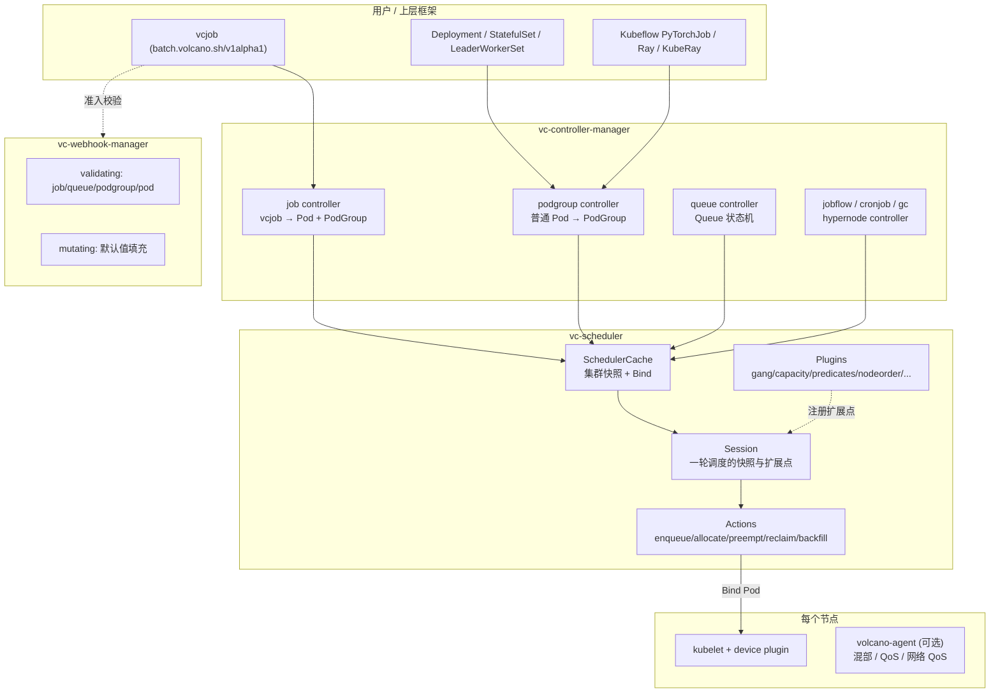
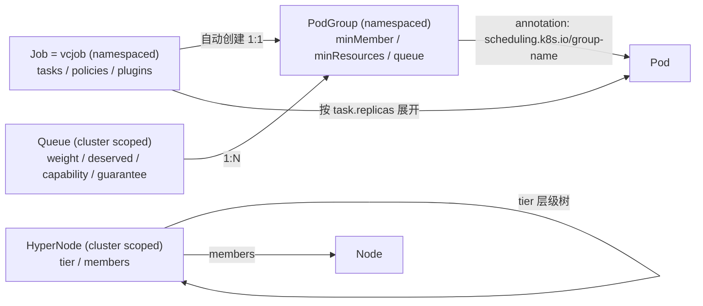
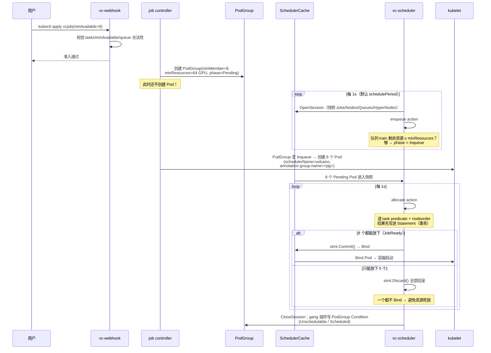

# Volcano 总览与架构

> 本篇是 Volcano 系列的入口。目标是回答三个问题：**为什么大模型训练/推理需要 Volcano**、**Volcano 由哪些组件构成**、**一个任务从提交到 Pod 落到 GPU 上，中间经过了什么**。
>
> **源码基线：`volcano.sh/volcano` v1.15.1**（最新稳定 release，含 SubJob / HyperNode / 网络拓扑感知调度 / gangpreempt 等特性）。
>
> 全系列所有代码引用均以该 tag 为准，可直接对照：
>
> ```bash
> git clone https://github.com/volcano-sh/volcano.git && cd volcano
> git checkout v1.15.1
> ```
>
> 为什么钉版本而不用 master：master 在持续变动（例如 `preempt` 的驱逐指标、调度器配置日志格式在 v1.15.1 之后才引入），钉住 tag 才能保证文档里的函数名、行为与你 checkout 出来的代码逐字一致。版本差异见 [附录：版本说明](#附录版本说明)。

---

## 1. 从一个真实痛点讲起

### 1.1 统一示例（后续各篇沿用）

整个系列沿用同一个场景，方便建立贯穿全局的直觉：

一个共享 GPU 集群，8 台机器，每台 8 卡 A100（共 64 卡），按业务划分成两个队列：

| 队列 | 用途 | 配额 |
|------|------|------|
| `train` | 离线训练 | 应得 40 卡 |
| `serve` | 在线推理 | 应得 24 卡 |

上面跑三类负载：

- **作业 T**（训练）：一个 8 机 64 卡的预训练任务，1 个 `master` + 7 个 `worker`，**必须 8 个 Pod 同时起来**才有意义（要做 all-reduce / 建 NCCL 通信域）。
- **作业 S**（推理）：一个 vLLM 服务，TP=4，2 个副本（每副本 4 卡），要求 4 卡尽量在**同一台机器**（NVLink 内通信）。
- **作业 D**（调试）：一个 Jupyter 开发 Pod，要 0.3 张卡（显存 8G），能和别人共享一张 GPU。

### 1.2 K8s 默认调度器为什么不够

`kube-scheduler` 的核心假设是：**Pod 之间彼此独立，一个一个调度**。这个假设在微服务世界成立，在大模型世界基本全部失效：

| 问题 | 默认调度器行为 | 后果（放到示例上） |
|------|--------------|------------------|
| **无 Gang（成组）语义** | 逐个 Pod 调度，能起几个起几个 | 作业 T 起了 5 个 Pod，剩 3 个没资源，5 个 Pod 占着 40 卡空转等同伴 → 资源死锁 |
| **无队列/配额** | 只有 namespace ResourceQuota（硬上限，不可借用） | `serve` 空闲时 `train` 借不到卡；`train` 撑满时 `serve` 上线要不到卡 |
| **无作业级公平** | Pod 级优先级，先到先得 | 一个 1000 Pod 的大作业把队列灌满，小作业永远排在后面 |
| **无拓扑感知** | 不理解 NVLink / 交换机层级 | 作业 S 的 4 个 TP rank 被打散到 4 台机器，跨机 PCIe/TCP 通信，吞吐掉几倍 |
| **无 GPU 共享** | `nvidia.com/gpu` 只能整卡整数分配 | 作业 D 要 0.3 卡，实际独占一整张 A100 |
| **无排队** | Pod 创建即进入调度，失败反复重试 | 大量 Pending Pod 冲击 apiserver 与调度器 |

**Volcano 就是把「批量计算/AI 作业」这套语义补齐的 Kubernetes 调度系统。**

### 1.3 一句话定义

> Volcano = **一套批量计算 CRD（Job/PodGroup/Queue/HyperNode）** + **一个可插拔的批调度器（vc-scheduler）** + **一组把 CRD 展开成 Pod 的控制器**。

它不替换 kubelet、不替换 CRI，只替换/并存 `kube-scheduler`（通过 `pod.spec.schedulerName: volcano` 接管），并复用 K8s 原生的 predicates/priorities 代码（`k8s.io/kubernetes/pkg/scheduler/framework`）。

---

## 2. 组件架构



### 2.1 各组件职责（对应源码目录）

| 组件 | 二进制 | 源码入口 | 职责 |
|------|--------|---------|------|
| 调度器 | `vc-scheduler` | `cmd/scheduler/`、`pkg/scheduler/` | 核心。周期性打开 Session，按 Action 顺序执行调度决策并 Bind |
| 控制器管理器 | `vc-controller-manager` | `cmd/controller-manager/`、`pkg/controllers/` | 把 CRD 变成 Pod，维护 Job/PodGroup/Queue 生命周期 |
| Webhook | `vc-webhook-manager` | `cmd/webhook-manager/`、`pkg/webhooks/` | 准入校验与默认值注入 |
| 节点代理 | `volcano-agent` | `cmd/agent/`、`cmd/network-qos/` | 在线离线混部：CPU/内存/网络 QoS 抑制、超卖上报（可选组件） |
| CLI | `vcctl` | `cmd/cli/` | 查询/操作 job、queue、podgroup |

`pkg/controllers/` 下的控制器一览：

```
pkg/controllers/
├── job/               # vcjob → Pod + PodGroup（最核心）
├── podgroup/          # 普通 Pod（Deployment/StatefulSet/LWS）→ PodGroup
├── queue/             # Queue 状态机（Open/Closing/Closed）+ 状态统计
├── jobflow/           # 多个 vcjob 的 DAG 编排
├── jobtemplate/       # vcjob 模板
├── cronjob/           # 定时 vcjob
├── hypernode/         # 网络拓扑 HyperNode 自动发现
├── garbagecollector/  # 完成作业的 TTL 回收
├── colocationconfig/  # 混部配置
└── sharding/          # 多调度器分片
```

---

## 3. CRD 数据模型

这是理解 Volcano 的关键：**Volcano 的调度对象不是 Pod，而是 PodGroup**。



### 3.1 Queue —— 资源配额与队列（`scheduling.volcano.sh/v1beta1`）

定义在 `staging/src/volcano.sh/apis/pkg/apis/scheduling/v1beta1/types.go` 的 `QueueSpec`：

| 字段 | 语义 | 谁消费 |
|------|------|--------|
| `weight` | 权重，按比例切分集群资源 | `proportion` 插件 |
| `deserved` | **应得量**，可被其他队列借用、也可被抢回 | `capacity` 插件 |
| `capability` | **硬上限**，任何情况下不可突破 | `proportion` / `capacity` |
| `guarantee.resource` | **保底预留**，不会被别人借走 | `proportion` / `capacity` |
| `reclaimable` | 本队列超出应得的部分是否允许被别人抢回 | `reclaim` action |
| `parent` | 父队列，支持**层级队列** | `capacity` (hierarchy) |
| `priority` | 队列优先级，越高越先调度、越晚被回收 | `QueueOrderFn` |
| `dequeueStrategy` | `fifo`（队头卡住就不再出队）/ `traverse`（跳过队头继续尝试，默认） | `enqueue` / `allocate` |
| `affinity.nodeGroupAffinity` | 队列绑定到某些节点组（如 A100 池） | `nodegroup` 插件 |

> 记住这条关系：`guarantee ≤ deserved ≤ capability`。`deserved` 是「借出/抢回」的分界线，`capability` 是天花板。

### 3.2 PodGroup —— 真正的调度单元

`PodGroupSpec` 关键字段：

| 字段 | 语义 |
|------|------|
| `minMember` | **Gang 的核心**：至少多少个 Pod 能同时运行，作业才算 Ready |
| `minTaskMember` | 每个 task（角色）各自的最小数量，例如 `{master: 1, worker: 7}` |
| `minResources` | 入队门槛：队列剩余资源不足这个量，PodGroup 连 `Inqueue` 都进不去（不创建 Pod，避免无效 Pending） |
| `queue` | 归属队列，默认 `default` |
| `priorityClassName` | 作业优先级，参与 `JobOrderFn` 和抢占 |
| `networkTopology` | 网络拓扑约束：`mode: hard/soft` + `highestTierAllowed` / `highestTierName` |
| `subGroupPolicy` | 新一代分组能力：把 PodGroup 内 Pod 再切成子组，支持**子组级 Gang** 与**子组级拓扑亲和** |

`PodGroup` 的相位（`PodGroupPhase`）：

```
Pending ──enqueue action──> Inqueue ──allocate 成功、minMember 就绪──> Running ──> Completed
   ↑                                                                     │
   └──────────────────── Unknown（部分运行、部分调不动） ────────────────┘
```

> **`Inqueue` 是 Volcano 独有的状态**，它的意义是「队列已经为这个作业预留出了 `minResources`，controller 可以放心创建 Pod 了」。这是防止「Pod 洪水」的关键设计。

### 3.3 SubGroupPolicy —— 为什么大模型场景需要它

`subGroupPolicy` 是比 `minTaskMember` 更强的分组语义（源码注释明确说它是「长期演进方向」）：

| 字段 | 语义 |
|------|------|
| `subGroupSize` | 每个子组的 Pod 数（例如 TP=4 → 4） |
| `minSubGroups` | 至少多少个子组资源满足才触发调度（**子组级 Gang**） |
| `networkTopology` | 每个子组内的 Pod 必须落在同一个拓扑域（HyperNode） |
| `labelSelector` / `matchLabelKeys` | 怎么把 Pod 划进子组 |

映射到示例中的作业 S（vLLM，TP=4，2 副本）：`subGroupSize=4` + `networkTopology.mode=hard,highestTierName=node` 就表达了「每 4 个 rank 必须同机」，`minSubGroups=1` 表达「至少一个副本能起来就先起」。

### 3.4 Job（vcjob）—— 用户友好的作业描述

`staging/src/volcano.sh/apis/pkg/apis/batch/v1alpha1/job.go`：

```yaml
apiVersion: batch.volcano.sh/v1alpha1
kind: Job
spec:
  minAvailable: 8              # → PodGroup.spec.minMember
  queue: train                 # → PodGroup.spec.queue
  schedulerName: volcano
  plugins:                     # Job 级插件：注入 svc/ssh/env/框架变量
    pytorch: ["--master=master", "--worker=worker", "--port=23456"]
    svc: []
  tasks:
  - name: master
    replicas: 1
    minAvailable: 1            # → PodGroup.spec.minTaskMember["master"]
    template: {...}            # 标准 PodTemplateSpec
  - name: worker
    replicas: 7
    template: {...}
  policies:                    # 事件-动作策略：失败重启整个作业等
  - event: PodFailed
    action: RestartJob
```

三层「最小可用」的关系（后面 `gang` 插件会反复用到）：

- `job.spec.minAvailable` → `PodGroup.minMember` → `JobInfo.MinAvailable`
- `task.minAvailable` → `PodGroup.minTaskMember` → `JobInfo.TaskMinAvailable`
- 两者**同时**满足，作业才 Ready

### 3.5 HyperNode —— 把网络拓扑变成一棵树

`staging/src/volcano.sh/apis/pkg/apis/topology/v1alpha1/hypernode_types.go`：

```yaml
apiVersion: topology.volcano.sh/v1alpha1
kind: HyperNode
metadata:
  name: s0                 # tier 1：一个 leaf switch / rack
spec:
  tier: 1
  tierName: rack
  members:
  - type: Node
    selector:
      exactMatch: {name: node-0}
  - type: Node
    selector:
      regexMatch: {pattern: "^node-[0-3]$"}   # 也支持 labelMatch
---
apiVersion: topology.volcano.sh/v1alpha1
kind: HyperNode
metadata:
  name: s2                 # tier 2：spine，成员是 HyperNode
spec:
  tier: 2
  members:
  - type: HyperNode
    selector: {exactMatch: {name: s0}}
  - type: HyperNode
    selector: {exactMatch: {name: s1}}
```

`MemberType` 只有 `Node` 和 `HyperNode` 两种，`MemberSelector` 三选一：`exactMatch` / `regexMatch` / `labelMatch`（labelMatch 仅对 Node 生效）。

**tier 越小 = 通信性能越好**。调度器会优先把一个作业塞进 tier 最低的 HyperNode。Session 打开时还会虚构一个 `<cluster-top-hypernode>`（`framework.ClusterTopHyperNode`），tier = 现存最大 tier + 1，把「全集群」也表示成一个 HyperNode，从而让「有拓扑约束」和「无拓扑约束」的代码路径统一（见 01 篇）。

---

## 4. 一个训练作业的一生

以示例中的作业 T（8 机 64 卡）为例：



**这张图里有三个 Volcano 最重要的设计**，后续篇章会逐个展开：

1. **两级准入**：`enqueue`（作业级，够 `minResources` 才建 Pod）+ `allocate`（Pod 级，逐个选节点）。
2. **事务式调度**：`Statement` 累积 Allocate/Pipeline/Evict 操作，`JobReady` 才 `Commit`，否则 `Discard` —— 这是 Gang 调度的落地机制。
3. **快照式调度**：一轮 Session 内所有决策基于同一份快照，插件的所有 `Fn` 都注册在 Session 上，Session 关闭时统一回写状态。

---

## 5. 推理场景怎么用（不用 vcjob 也能用）

大模型推理一般用 Deployment / StatefulSet / LeaderWorkerSet，不用 vcjob。Volcano 通过 `podgroup controller` 支持这类负载：

`pkg/controllers/podgroup/pg_controller_handler.go` 的逻辑：

1. 监听 Pod，若 `pod.spec.schedulerName` 命中 Volcano 管理的 schedulerName 列表；
2. 若 Pod 已有 `scheduling.k8s.io/group-name` annotation（如 LeaderWorkerSet 自己建了 PodGroup），**跳过**；
3. 否则调 `createOrUpdateNormalPodPG(pod)`，按 `helpers.GeneratePodgroupName(pod)`（基于 ownerReference）为这一组 Pod 创建 PodGroup；
4. 再 patch Pod 的 annotation 把它挂到 PodGroup 上（`updatePodAnnotations`）。

可以在上层 workload 的 **Pod template annotation** 上写这些 key（`staging/.../scheduling/v1beta1/labels.go`）：

| annotation | 作用 |
|-----------|------|
| `scheduling.volcano.sh/queue-name` | 指定队列 |
| `scheduling.volcano.sh/group-min-member` | 指定 PodGroup 的 `minMember`（推理多机 TP 时有用） |
| `scheduling.volcano.sh/group-min-resources` | 指定 `minResources` |
| `scheduling.volcano.sh/group-name` | 手动指定 PodGroup 名（自建 PodGroup 时用） |
| `volcano.sh/preemptable` | 该 Pod 是否可被抢占（离线任务标 true） |
| `volcano.sh/sla-waiting-time` | SLA 插件的最长等待时间 |
| `volcano.sh/numa-topology-policy` | NUMA 亲和策略 |
| `volcano.sh/qos-level` | 混部 QoS 等级（volcano-agent 消费） |

所以「训练用 vcjob、推理用 Deployment + annotation」是最常见的组合，两者共享同一套队列配额与抢占体系 —— 这正是 Volcano 在 MaaS 平台里最大的价值：**训练和推理在同一个 GPU 池里按队列共享，闲时互借，忙时抢回**。

---

## 6. 系列导航

| 篇 | 主题 | 核心问题 |
|----|------|---------|
| 00（本篇） | 总览与架构 | Volcano 是什么、组件与 CRD 模型、作业的一生 |
| [01](01-核心原理-Session与Action-Plugin框架.md) | Session / Action / Plugin 框架 | 一轮调度到底发生了什么，扩展点怎么串起来 |
| [02](02-核心代码分析-Actions.md) | Actions 源码分析 | enqueue / allocate / preempt / reclaim / backfill 怎么写的 |
| [03](03-核心代码分析-关键插件.md) | 关键插件源码分析 | gang / capacity / proportion / deviceshare / 拓扑感知 |
| [04](04-面向大模型训练与推理的能力地图.md) | 大模型能力地图 | 训练要哪些特性、推理要哪些特性、怎么配 |
| [05](05-实战Demo.md) | 实战 Demo | 从装 Volcano 到跑通训练 + 推理 + GPU 共享 |

---

## 附录：版本说明

### A.1 为什么钉 v1.15.1

本系列所有源码引用（函数名、字段名、代码片段、行为描述）均以 **`v1.15.1`** 为准 —— 这是编写时的最新**稳定** release（`v1.16.0-alpha.x` 属于预发布）。

```bash
git clone https://github.com/volcano-sh/volcano.git && cd volcano
git checkout v1.15.1
git describe --tags        # v1.15.1
```

用 tag 而不是 master 的原因很实际：master 每天都在动，文档里贴的代码片段过几周就对不上，读者照着 grep 找不到就会怀疑文档写错了。钉住 tag，**文档里的每一段代码都能在你 checkout 出来的仓库里逐字找到**。

### A.2 v1.15.1 已包含的关键特性

写这套文档时特意确认过，以下较新能力在 v1.15.1 中**都已存在**，不需要用 master：

| 特性 | 位置 |
|------|------|
| `gangpreempt` / `gangreclaim` 成组抢占 | `pkg/scheduler/actions/gangpreempt/`、`gangreclaim/` |
| SubJob / `subGroupPolicy`（子组级 gang 与拓扑） | `api.SubJobInfo`、`allocateForSubJob` |
| HyperNode 网络拓扑感知 + 梯度搜索 | `ClusterTopHyperNode`、`HyperNodeGradientForJobFn` |
| 统一驱逐扩展点 | `ssn.AddUnifiedEvictableFn` |
| 37 个 Session 扩展点 | `pkg/scheduler/framework/session_plugins.go` |
| capacity 的层级队列 + DRA 配额 | `pkg/scheduler/plugins/capacity/` |
| deviceshare vGPU / 昇腾 vNPU | `pkg/scheduler/plugins/deviceshare/` |

验证方式：

```bash
git ls-tree --name-only v1.15.1 pkg/scheduler/actions/
git grep -l "ClusterTopHyperNode" v1.15.1 -- 'pkg/scheduler/**/*.go'
git show v1.15.1:pkg/scheduler/framework/session_plugins.go | grep -cE '^func \(ssn \*Session\) Add\w+'   # 37
```

### A.3 与 master / v1.16 的已知差异

如果你 checkout 的是 master 或 v1.16+，文档里有两处细节会不一样（不影响原理理解）：

| 位置 | v1.15.1（文档基线） | master / v1.16+ |
|------|-------------------|-----------------|
| 调度器配置加载日志（05 篇 §0.2） | `loadSchedulerConf` 的 defer 打印 `Finished loading scheduler config. Final state: actions=... plugins=...` | 抽成 `logLoadedSchedulerConf`，打印 `Successfully loaded Scheduler conf as follows:` 并逐行输出完整 YAML |
| `preempt` 提交段（02 篇 §3.3） | `JobPipelined` → `stmt.Commit()`；随后 `if assigned { preemptors.Push(...) }` | 新增 `stmt.HasEvictions()` 判断与 `metrics.RegisterEvictionTransaction(...)` 驱逐事务指标 |

其余新增内容（`usage` 插件的负载预估重写、`gang` 的 `shouldSkipUnschedulableForReleasing`、`capacity`/`proportion` 的 `AddJobEnqueuedFn` inqueue 指标、`killJob` 对 `RestartPodAction` 保留 PodGroup 等）都是**增量特性**，不改变本系列描述的核心机制。

### A.4 升级时怎么复查

换版本后想快速确认文档还适用，跑一遍：

```bash
cd /path/to/volcano
git diff --stat v1.15.1..<新tag> -- \
  pkg/scheduler/scheduler.go pkg/scheduler/util.go \
  pkg/scheduler/framework/ pkg/scheduler/actions/ \
  pkg/scheduler/plugins/{gang,capacity,proportion,deviceshare,network-topology-aware}/ \
  pkg/scheduler/api/job_info.go pkg/controllers/job/ pkg/controllers/podgroup/
```

这几条路径覆盖了本系列引用的全部代码，diff 干净就说明文档可以直接用。
