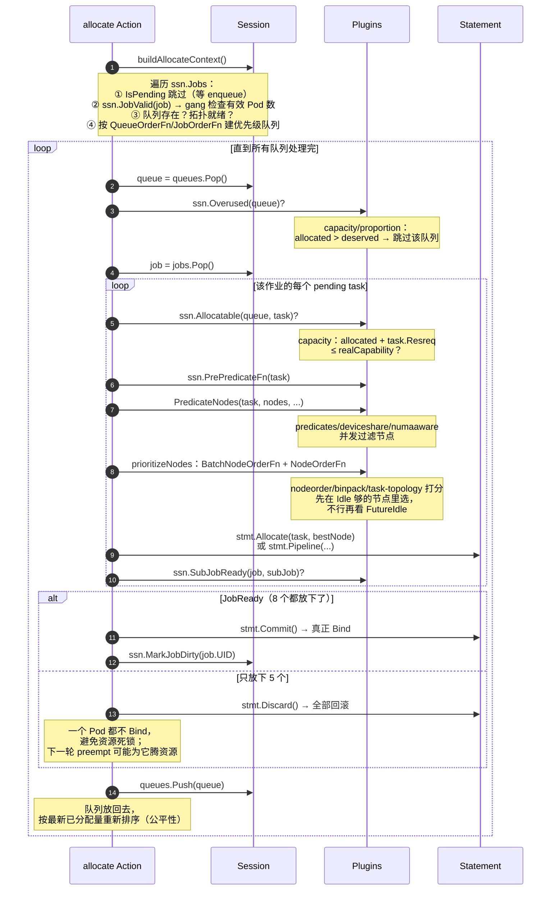

# 核心原理：Session / Action / Plugin 三层调度框架

> 本篇回答：**vc-scheduler 每一秒到底做了什么**。这是 Volcano 全部能力的骨架，后面所有插件与特性都挂在这个骨架上。
>
> 涉及源码：`pkg/scheduler/scheduler.go`、`pkg/scheduler/framework/{framework,session,session_plugins,statement,interface}.go`、`pkg/scheduler/util.go`、`pkg/scheduler/conf/scheduler_conf.go`

---

## 1. 一句话概括

```text
                每 schedulePeriod（默认 1s）一次
  ┌──────────────────────────────────────────────────────────────┐
  │  OpenSession（拍快照 + 各 Plugin 注册扩展点函数）             │
  │      ↓                                                       │
  │  for action in [enqueue, allocate, preempt, reclaim, ...]     │
  │      action.Execute(ssn)  ← 只调 ssn.XxxFn()，不写死策略      │
  │      ↓                                                       │
  │  CloseSession（各 Plugin 回写状态 + 快照落盘到 Cache）        │
  └──────────────────────────────────────────────────────────────┘
```

三层职责划分得非常干净：

| 概念 | 是什么 | 类比 |
|------|--------|------|
| **Session** | 一轮调度的**快照 + 扩展点注册表**，生命周期只有这一轮 | 数据库的事务上下文 |
| **Action** | 调度**流程**（做什么、什么顺序） | 算法骨架（模板方法） |
| **Plugin** | 调度**策略**（怎么排序、能不能放、谁可被抢） | 策略实现（钩子） |

> **设计哲学：Action 定义 what & when，Plugin 定义 how。** Action 代码里几乎没有具体策略，全是 `ssn.QueueOrderFn`、`ssn.JobReady(job)`、`ssn.Allocatable(queue, task)` 这样的间接调用。

---

## 2. 调度主循环 runOnce

`pkg/scheduler/scheduler.go`：

```go
go wait.Until(pc.runOnce, pc.schedulePeriod, stopCh)

func (pc *Scheduler) runOnce() {
    pc.mutex.Lock()
    actions := pc.actions                 // 来自 ConfigMap，支持热加载
    plugins := pc.plugins                 // []conf.Tier
    configurations := pc.configurations
    pc.mutex.Unlock()

    // 记录启用了哪些 action，插件/action 会据此改变行为
    conf.EnabledActionMap = make(map[string]bool)
    for _, action := range actions {
        conf.EnabledActionMap[action.Name()] = true
    }

    ssn := framework.OpenSession(pc.cache, plugins, configurations)
    ssn.SetSchGateManager(pc.schGateManager)
    defer func() {
        framework.CloseSession(ssn)
        metrics.UpdateE2eDuration(metrics.Duration(scheduleStartTime))
    }()

    for _, action := range actions {
        action.Execute(ssn)               // 按配置顺序串行执行
    }
}
```

三个要点：

1. **配置热加载**：`watchSchedulerConf` 监听挂载的 ConfigMap 文件，改调度策略**不需要重启调度器**。
2. **`conf.EnabledActionMap`** 用于跨模块判断。例如 `allocate` 会检查：若没配 `enqueue`，就把 Pending 的 PodGroup 直接视为 Inqueue，避免作业永久卡住。
3. **Action 串行**：前一个 Action 写进快照的结果会被后一个 Action 看到（`allocate` 留下的 Pipelined 状态会影响 `preempt` 的判断）。

---

## 3. 配置模型：actions + tiers

默认配置在 `pkg/scheduler/util.go`：

```go
var DefaultSchedulerConf = `
actions: "enqueue, allocate, backfill"
tiers:
- plugins:
  - name: priority
  - name: gang
  - name: conformance
- plugins:
  - name: overcommit
  - name: drf
  - name: predicates
  - name: proportion
  - name: nodeorder
`
```

GPU 集群常用配置（后续 05 篇会实际用到）：

```yaml
actions: "enqueue, allocate, preempt, reclaim, backfill"
tiers:
- plugins:
  - name: priority
  - name: gang
    enablePreemptable: false     # 细粒度关掉单个扩展点
  - name: conformance
- plugins:
  - name: overcommit
  - name: drf
    enablePreemptable: false
  - name: predicates
  - name: capacity               # 用 capacity 取代 proportion（推荐）
    enableHierarchy: true
  - name: nodeorder
  - name: binpack
  - name: deviceshare
    arguments:
      deviceshare.VGPUEnable: true
```

### 3.1 tier 的短路语义（容易被忽略的重点）

`tiers` 不只是插件列表，它有明确的**分层短路**语义。以抢占为例（`session_plugins.go` 中 `Preemptable`）：

```go
for _, tier := range ssn.Tiers {
    for _, plugin := range tier.Plugins {
        candidates, abstain := pf(preemptor, preemptees)
        if abstain == 0 { continue }                 // 该插件弃权，不表态
        if len(candidates) == 0 { victims = nil; break }
        if victims == nil {
            victims = candidates
        } else {
            victims = 求 victims 与 candidates 的交集
        }
    }
    // 本 tier 只要有插件表态（victims != nil），就不再看下一个 tier
    if victims != nil { return victims }
}
```

含义：**同一 tier 内的插件是「AND」关系（取交集），tier 之间是「优先级 fallback」关系（上层 tier 表态了就不再问下层）**。所以配置里把 `priority`、`gang`、`conformance` 放第一层，是让「作业优先级/成组约束/系统 Pod 保护」这类**硬约束**优先决定抢占对象。

不同扩展点的聚合语义并不相同，这点必须逐个看源码：

| 扩展点 | 聚合方式 |
|--------|---------|
| `PredicateFn` | 遍历所有 tier 所有插件，**任一失败即失败**（AND，无短路 tier 语义） |
| `Allocatable` | 遍历所有插件，**任一 false 即 false**（AND） |
| `JobReady` | 遍历所有插件，**任一 false 即 false**（AND） |
| `JobOrderFn` / `QueueOrderFn` | 按 tier 顺序找**第一个给出非 0 比较结果**的插件，否则回退到默认（创建时间、UID） |
| `Preemptable` / `Reclaimable` | tier 内取交集，tier 间 fallback |
| `JobEnqueueable` / `JobPipelined` | 投票制：`Reject(<0)` 一票否决，`Permit(>0)` 则本 tier 通过不再看下层，全弃权默认放行 |

`PluginOption`（`pkg/scheduler/conf/scheduler_conf.go`）里那一长串 `enableXxx` 字段，就是逐扩展点的开关，默认 `nil` 视为启用（`isEnabled`）。

---

## 4. Session：一轮调度的世界

`OpenSession` 只有短短几十行，但它是理解 Volcano 的枢纽（`framework/framework.go`）：

```go
func OpenSession(cache cache.Cache, tiers []conf.Tier, configurations []conf.Configuration) *Session {
    ssn := openSession(cache)                       // ① 从 Cache 拿快照
    ssn.Tiers = tiers
    ssn.Configurations = configurations
    ssn.NodeMap = GenerateNodeMapAndSlice(ssn.Nodes) // ② 转成 k8s framework 认识的 NodeInfo
    ssn.PodLister = NewPodLister(ssn)

    for _, tier := range tiers {
        for _, plugin := range tier.Plugins {
            if pb, found := GetPluginBuilder(plugin.Name); found {
                plugin := pb(plugin.Arguments)       // ③ 构造插件实例（每轮都新建！）
                ssn.plugins[plugin.Name()] = plugin
                plugin.OnSessionOpen(ssn)            // ④ 插件把自己的 Fn 注册到 Session
            }
        }
    }
    ssn.InitCycleState()                             // ⑤ 为每个待调度 Pod 初始化 CycleState
    return ssn
}

func CloseSession(ssn *Session) {
    for _, plugin := range ssn.plugins {
        plugin.OnSessionClose(ssn)                   // 回写状态：PodGroup Condition、metrics、队列指标
    }
    closeSession(ssn)                                // 快照回写 Cache
}
```

**插件实例每轮重建**，所以插件里的字段天然就是「本轮缓存」，不用担心跨轮脏数据（例如 `capacity` 插件每轮重算队列的 deserved / allocated）。

### 4.1 Session 里有什么（`framework/session.go`）

```go
type Session struct {
    UID types.UID

    TotalResource    *api.Resource
    PodGroupOldState *api.PodGroupOldState        // 快照开始时的 PodGroup 状态，用于 diff 回写
    DirtyJobs        sets.Set[api.JobID]          // 本轮被改动、需要 flush 的作业

    Jobs           map[api.JobID]*api.JobInfo     // ★ PodGroup 视角的作业
    Nodes          map[string]*api.NodeInfo       // ★ 节点（含 Idle/Used/Releasing/Pipelined 资源账本）
    RevocableNodes map[string]*api.NodeInfo       // 可回收节点（混部/竞价实例）
    Queues         map[api.QueueID]*api.QueueInfo // ★ 队列
    NodeMap        map[string]fwk.NodeInfo        // 给 predicates/nodeorder 复用 k8s 插件用

    // —— 网络拓扑 ——
    HyperNodes           api.HyperNodeInfoMap     // HyperNode 树
    HyperNodesSetByTier  map[int]sets.Set[string] // tier → hyperNode 集合（低 tier = 高性能）
    RealNodesList        map[string][]*api.NodeInfo // hyperNode → 其下真实节点
    HyperNodesReadyToSchedule bool

    Tiers          []conf.Tier
    Configurations []conf.Configuration

    // —— 扩展点注册表（每种一个 map：插件名 → 函数）——
    jobOrderFns       map[string]api.CompareFn
    queueOrderFns     map[string]api.CompareFn
    predicateFns      map[string]api.PredicateFn
    nodeOrderFns      map[string]api.NodeOrderFn
    batchNodeOrderFns map[string]api.BatchNodeOrderFn
    preemptableFns    map[string]api.EvictableFn
    reclaimableFns    map[string]api.EvictableFn
    allocatableFns    map[string]api.AllocatableFn
    jobReadyFns       map[string]api.ValidateFn
    jobEnqueueableFns map[string]api.VoteFn
    // ... 共 30+ 个
    cycleStatesMap sync.Map                       // taskID → k8s CycleState（跨扩展点传状态）
}
```

一个细节很有价值：**`ClusterTopHyperNode`**。

```go
// framework/session.go
const ClusterTopHyperNode = "<cluster-top-hypernode>"
```

Session 打开时会虚构一个「集群顶层 HyperNode」，tier = 现存最大 tier + 1，包含全集群所有节点。这样一来，「没有拓扑约束的普通作业」也可以走同一套「在某个 HyperNode 内分配」的代码，`allocate` 里不需要两套逻辑分支：

```go
// actions/allocate/allocate.go
stmt := alloc.allocateForJob(job, jobWorksheet, ssn.HyperNodes[framework.ClusterTopHyperNode])
```

---

## 5. Plugin：怎么写、怎么被调用

插件接口极简（`framework/interface.go`）：

```go
type Plugin interface {
    Name() string
    OnSessionOpen(ssn *Session)
    OnSessionClose(ssn *Session)
}
```

注册在 `pkg/scheduler/plugins/factory.go` 的 `init()` 里：

```go
framework.RegisterPluginBuilder(gang.PluginName, gang.New)
framework.RegisterPluginBuilder(capacity.PluginName, capacity.New)
framework.RegisterPluginBuilder(deviceshare.PluginName, deviceshare.New)
framework.RegisterPluginBuilder(networktopologyaware.PluginName, networktopologyaware.New)
// ... 共 20+ 个内置插件
```

内置插件全景（截至 master）：

| 类别 | 插件 |
|------|------|
| 作业/成组 | `gang`、`priority`、`sla`、`cdp`、`pdb`、`conformance` |
| 队列配额 | `capacity`（推荐）、`proportion`、`drf`、`resourcequota`、`overcommit` |
| 节点过滤/打分 | `predicates`、`nodeorder`、`binpack`、`resource-strategy-fit`、`nodegroup`、`usage`、`tdm` |
| 拓扑/设备 | `network-topology-aware`、`task-topology`、`numaaware`、`deviceshare` |
| 运维 | `rescheduling`、`extender`（外部 HTTP 扩展） |

一个插件的典型写法（`gang`）：

```go
func (gp *gangPlugin) OnSessionOpen(ssn *framework.Session) {
    ssn.AddJobValidFn(gp.Name(), validJobFn)        // 作业是否合法（有效 Pod 数够不够 minAvailable）
    ssn.AddJobReadyFn(gp.Name(), func(obj any) bool { ... })  // 作业是否 Ready（能否 Commit）
    ssn.AddJobPipelinedFn(gp.Name(), pipelinedFn)
    ssn.AddJobOrderFn(gp.Name(), jobOrderFn)        // 已 Ready 的作业排后面
    ssn.AddPreemptableFn(gp.Name(), preemptableFn)  // 抢占时不能把别人打到 minAvailable 以下
    ssn.AddReclaimableFn(gp.Name(), preemptableFn)
    ssn.AddJobStarvingFns(gp.Name(), jobStarvingFn) // 作业是否"饥饿"（值得为它抢占）
}
```

### 5.1 扩展点全景（按调度阶段归类）

`session_plugins.go` 中共有 37 个 `AddXxxFn`。按调度阶段整理：

| 阶段 | 扩展点 | 语义 |
|------|--------|------|
| **入队** | `JobEnqueueableFn` / `JobEnqueuedFn` | 作业能否从 Pending → Inqueue |
| **作业校验** | `JobValidFn` | 作业本身是否可调度（gang 有效 Pod 数） |
| **排序** | `QueueOrderFn`、`JobOrderFn`、`TaskOrderFn`、`SubJobOrderFn`、`ClusterOrderFn`、`VictimQueueOrderFn` | 队列/作业/任务/牺牲者的优先级 |
| **配额门禁** | `OverusedFn`（队列是否超用）、`AllocatableFn`（这个 task 放进去会不会超配额）、`PreemptiveFn`（本队列能否去抢别人） | 队列级准入 |
| **节点过滤** | `PrePredicateFn`、`PredicateFn` | 硬约束（资源、亲和、设备、拓扑） |
| **节点打分** | `NodeOrderFn`、`BatchNodeOrderFn`、`NodeMapFn`/`NodeReduceFn`、`BestNodeFn` | 选最优节点 |
| **拓扑打分** | `HyperNodeOrderFn`、`HyperNodeGradientForJobFn`、`HyperNodeGradientForSubJobFn` | 选最优拓扑域 |
| **成组判定** | `JobReadyFn`、`JobPipelinedFn`、`SubJobReadyFn`、`SubJobPipelinedFn`、`JobStarvingFn` | 事务能否 Commit |
| **驱逐** | `PreemptableFn`（同队列内抢占）、`ReclaimableFn`（跨队列回收）、`UnifiedEvictableFn`、`VictimTasksFn` | 谁可以被踢 |
| **模拟** | `SimulateAddTaskFn`、`SimulateRemoveTaskFn`、`SimulatePredicateFn`、`SimulateAllocatableFn` | 抢占时的 what-if 推演 |
| **其他** | `TargetJobFn`、`ReservedNodesFn` | 资源预留（`reserve`/`shuffle` 类场景） |

---

## 6. Statement：Gang 调度的落地机制

Gang（成组）调度的本质需求是：**要么全放下，要么一个都不放**。Volcano 用一个「事务」对象实现：`framework/statement.go`。

```go
type Statement struct {
    operations []operation   // {name: Evict|Pipeline|Allocate, task, reason}
    ssn        *Session
}
```

三种操作 + 两种终态：

| 方法 | 作用 | 立即生效？ |
|------|------|-----------|
| `stmt.Allocate(task, node)` | 节点 Idle 够，直接分配 | 只改**快照**（`node.AddTask`、`job.UpdateTaskStatus(Allocated)`），不发 Bind |
| `stmt.Pipeline(task, host, evicted)` | 节点 Idle 不够但 `FutureIdle` 够（有 Pod 正在释放），**排队等资源** | 只改快照，状态 `Pipelined` |
| `stmt.Evict(reclaimee, reason)` | 标记驱逐（抢占用），状态 `Releasing` | 只改快照，不发 Delete |
| `stmt.Commit()` | 真正执行：`cache.AddBindTask` / `cache.Evict` | ✅ 落到 apiserver |
| `stmt.Discard()` | **逆序回滚**所有操作（`unevict`/`unPipeline`/`unallocate`） | 快照恢复原状 |

`allocate` action 里的用法就是 Gang 的核心（`actions/allocate/allocate.go`）：

```go
stmt := alloc.allocateResourcesForTasks(subJob, tasks, framework.ClusterTopHyperNode)
if stmt != nil && ssn.JobReady(job) {   // ★ 只有整个作业 Ready 才提交
    stmt.Commit()
    ssn.MarkJobDirty(job.UID)
}
// 否则 stmt 内部已 Discard —— 一个 Pod 都不会被 Bind
```

以及 `allocateResourcesForTasks` 末尾的三态判断：

```go
if ssn.SubJobReady(job, subJob) {
    return stmt                  // 够了，返回事务等 Commit
} else if ssn.SubJobPipelined(job, subJob) {
    return stmt                  // 资源在释放中，先占位（Pipelined）
}
stmt.Discard()                   // 都不满足 → 全部回滚
return nil
```

> **`Pipelined` 是 Volcano 一个很妙的状态**：某些 Pod 正在被驱逐（`Releasing`），资源还没真正空出来，此时新作业可以「预定」这部分资源（`node.FutureIdle() = Idle + Releasing - Pipelined`），从而让「抢占 → 被抢占者退出 → 抢占者上位」这个过程不被其他作业插队抢走。

### 6.1 Task 状态机

`pkg/scheduler/api/types.go`：

```text
Pending ──stmt.Allocate──> Allocated ──Commit──> Binding ──> Bound ──> Running
   │                                                                     │
   ├──stmt.Pipeline──> Pipelined ─(等资源释放)─> Allocated                │
   │                                                                     │
   └<─── Discard 回滚 ────┘                     Releasing <──stmt.Evict──┘
                                                    │
                                              Succeeded / Failed / Unknown
```

`api.AllocatedStatus()` 把 `Allocated/Binding/Bound/Running` 都算作「已占资源」，这是资源账本正确性的基础。

---

## 7. 一轮 allocate 的完整时序（把前面串起来）

用 00 篇示例中的作业 T（8 机 64 卡，`minMember=8`）走一遍：



图里第 ⑦ 步的**双梯度节点选择**是个实用细节（`prioritizeNodes`）：

```go
// 第一梯度：task.InitResreq ≤ node.Idle       （立刻可用）
// 第二梯度：task.InitResreq ≤ node.FutureIdle （等释放后可用）
// 先在第一梯度打分选最优；第一梯度为空才看第二梯度
```

这保证了「有现成空闲资源就别去等别人释放」。

---

## 8. 小结与常见误区

| 误区 | 事实 |
|------|------|
| 「Volcano 是给 Pod 打分的调度器」 | 它的调度单元是 **PodGroup**，Pod 级打分只是最后一步 |
| 「插件是常驻对象」 | 插件实例**每轮 Session 重建**，`OnSessionOpen` 里做的计算就是本轮缓存 |
| 「tiers 就是插件列表」 | tier 有短路语义，抢占/排序类扩展点是「上层 tier 说了算」 |
| 「调度决策立即生效」 | 决策先写进 `Statement` 和 Session 快照，`Commit()` 才落到 apiserver |
| 「gang 不满足会 Bind 一部分」 | `Discard()` 会逆序回滚，一个都不 Bind |
| 「改调度策略要重启」 | ConfigMap 热加载（`watchSchedulerConf`） |

下一篇进入 [02 Actions 源码分析](02-核心代码分析-Actions.md)，逐个拆 `enqueue / allocate / preempt / reclaim / backfill`。
