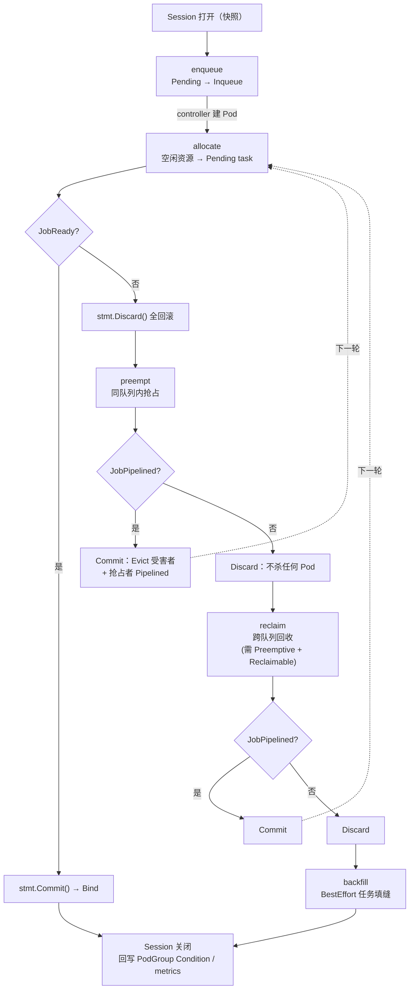

# 核心代码分析（一）：Actions

> 本篇逐个拆解 Volcano 的 8 个内置 Action。Action 是调度**流程**，看懂它们，就知道「一轮调度里资源是怎么被分出去、又怎么被抢回来的」。
>
> 源码目录：`pkg/scheduler/actions/`
>
> 源码基线：**v1.15.1**

```go
// pkg/scheduler/actions/factory.go
func init() {
    framework.RegisterAction(reclaim.New())
    framework.RegisterAction(allocate.New())
    framework.RegisterAction(backfill.New())
    framework.RegisterAction(preempt.New())
    framework.RegisterAction(gangpreempt.New())
    framework.RegisterAction(gangreclaim.New())
    framework.RegisterAction(enqueue.New())
    framework.RegisterAction(shuffle.New())
}
```

| Action | 一句话 | 谁的资源被动了 |
|--------|--------|--------------|
| `enqueue` | 作业级准入：Pending → Inqueue，控制器才敢建 Pod | 无（只改 PodGroup phase） |
| `allocate` | 主力：把空闲资源分给 Pending task | 空闲资源 |
| `preempt` | **队列内**高优作业抢低优作业 | 同队列内其他作业 |
| `reclaim` | **跨队列**把「借出去、超出 deserved」的资源抢回来 | 其他队列的作业 |
| `gangpreempt` / `gangreclaim` | 成组版抢占/回收：一次腾出「一整个 gang 需要的量」 | 同上，但按 bundle 决策 |
| `backfill` | 把 BestEffort（无资源请求）任务塞进缝隙 | 空闲资源 |
| `shuffle` | 按插件给的 victim 规则批量驱逐（配合 `rescheduling`） | 运行中的 Pod |

推荐顺序：`enqueue, allocate, preempt, reclaim, backfill`（先分配、分不动才抢）。

---

## 1. enqueue：作业级准入，防止 Pod 洪水

`actions/enqueue/enqueue.go`，全文只 100 行，是最容易读的 Action：

```go
func (enqueue *Action) Execute(ssn *framework.Session) {
    queues := util.NewPriorityQueue(ssn.QueueOrderFn)
    jobsMap := map[api.QueueID]*util.PriorityQueue{}

    for _, job := range ssn.Jobs {
        if job.ScheduleStartTimestamp.IsZero() {           // 记录首次进入调度的时间（sla 插件要用）
            ssn.Jobs[job.UID].ScheduleStartTimestamp = metav1.Time{Time: time.Now()}
        }
        queue, found := ssn.Queues[job.Queue]
        if !found { continue }
        queues.Push(queue)                                 // 去重后压入队列优先级队列

        if job.IsPending() {                               // 只关心 Pending 的 PodGroup
            jobsMap[job.Queue] = ... ; jobsMap[job.Queue].Push(job)
        }
    }

    for !queues.Empty() {
        queue := queues.Pop().(*api.QueueInfo)
        jobs := jobsMap[queue.UID]
        if jobs == nil || jobs.Empty() { continue }
        job := jobs.Pop().(*api.JobInfo)

        // ★ 核心判断
        if job.PodGroup.Spec.MinResources == nil || ssn.JobEnqueueable(job) {
            ssn.JobEnqueued(job)
            job.PodGroup.Status.Phase = scheduling.PodGroupInqueue
            ssn.Jobs[job.UID] = job
        }

        queues.Push(queue)   // 队列放回去，实现「队列间轮转」
    }
}
```

三个要点：

1. **`minResources == nil` 直接放行**。所以不写 `minResources` 的 PodGroup 相当于没有入队门禁 —— 大模型训练作业**务必配 `minResources`**（vcjob 的 webhook 会按 tasks 自动算，也可以手写）。
2. **门禁逻辑本身在插件里**：`ssn.JobEnqueueable(job)` 是投票制，主要由 `capacity`/`proportion`/`overcommit`/`sla` 投票。语义是「队列的剩余（deserved - allocated - inqueue）能否装下 `minResources`」。
3. **队列 pop 后又 push 回去**，配合 `QueueOrderFn` 每次重新比较，实现队列之间的公平轮转，而不是一个队列一次性吃完。

对示例中作业 T 的意义：如果 `train` 队列此刻只剩 40 卡，而作业 T 需要 64 卡，那 PodGroup 停在 `Pending`，**job controller 根本不会创建那 8 个 Pod**。集群里不会出现 8 个占位又跑不起来的 Pending Pod，也不会有 5 个 Pod 起来了空转等同伴。

---

## 2. allocate：主力流程

`actions/allocate/allocate.go`。这是最复杂的 Action（近 1000 行），拆成三层看就清楚了：

```text
Execute
 └─ buildAllocateContext()          ① 筛作业 + 建三层优先级队列
 └─ allocateResources(actx)         ② 队列 → 作业 循环
      ├─ allocateForJob()           ③a 有硬拓扑/子组策略的作业：按 HyperNode 梯度搜索
      │    └─ allocateForSubJob()
      │         └─ allocateResourcesForTasks()
      └─ allocateResourcesForTasks()③b 普通作业：直接在 <cluster-top-hypernode> 内分配
```

### 2.1 ① buildAllocateContext：谁有资格参与本轮分配

```go
for _, job := range ssn.Jobs {
    if job.IsPending() {
        if conf.EnabledActionMap["enqueue"] {
            continue                                  // 配了 enqueue → 老实等入队
        } else {
            job.PodGroup.Status.Phase = scheduling.PodGroupInqueue  // 没配 enqueue → 直接放行
        }
    }
    if vr := ssn.JobValid(job); vr != nil && !vr.Pass { continue }   // gang：有效 Pod 数不够，跳过
    if _, found := ssn.Queues[job.Queue]; !found { continue }        // 队列不存在
    if !ssn.HyperNodesReadyToSchedule && job.ContainsNetworkTopology() {
        continue                                                     // 拓扑信息没就绪，有拓扑约束的作业先等
    }

    worksheet := alloc.organizeJobWorksheet(job)   // 按 SubJob 组织待调度 task
    if worksheet.Empty() { continue }

    actx.jobsByQueue[job.Queue].Push(job)          // JobOrderFn 排序
    actx.queues.Push(ssn.Queues[job.Queue])        // QueueOrderFn 排序
}
```

`organizeJobWorksheet` 里两个值得注意的过滤（都在 `subJob.TaskStatusIndex[api.Pending]` 上做）：

```go
if task.SchGated && !api.HasOnlyVolcanoSchedulingGate(task.Pod) { continue }  // 有外部调度门控，跳过
if task.Resreq.IsEmpty() { continue }   // BestEffort task 不在 allocate 里处理，交给 backfill
```

它还实现了**子组级 Gang 的最小集合选择**：先按 `SubJobOrderFn` 排序，然后挑出「刚好凑够 `MinSubJobs[GID]` 个」的子组标记为 `requireSubJobs`，让这些子组在优先级队列里排最前面。对应 00 篇里 vLLM 多副本场景：优先把「至少 1 个完整副本」凑齐，而不是把资源摊薄给每个副本。

### 2.2 ② allocateResources：队列-作业双层循环

```go
for !queues.Empty() {
    queue := queues.Pop().(*api.QueueInfo)

    if ssn.Overused(queue) {                    // capacity/proportion：allocated 超过 deserved
        klog.V(3).Infof("Queue <%s> is overused, ignore it.", queue.Name)
        continue                                 // ★ 注意：这里是 continue，本轮不再给这个队列分配
    }

    jobs := actx.jobsByQueue[queue.UID]
    job := jobs.Pop().(*api.JobInfo)

    if job.ContainsHardTopology() || job.ContainsSubJobPolicy() {
        stmt := alloc.allocateForJob(job, actx.jobWorksheet[job.UID], ssn.HyperNodes[framework.ClusterTopHyperNode])
        if stmt != nil && ssn.JobReady(job) {    // ★ Gang 判定
            stmt.Commit()
            ssn.MarkJobDirty(job.UID)
            if !jobWorksheet.Empty() { jobs.Push(job) }   // minAvailable < replicas：还有剩余 task，放回去再来一轮
        }
    } else {
        // 普通路径
        stmt = alloc.allocateResourcesForTasks(subJob, tasks, framework.ClusterTopHyperNode)
        if stmt != nil && ssn.JobReady(job) { stmt.Commit(); ... }
    }

    queues.Push(queue)   // ★ 队列放回，按最新 allocated 重新排序 → 队列间公平
}
```

> **`minAvailable < replicas` 的弹性语义**：作业 `minAvailable=4`、`replicas=8` 时，前 4 个 Pod 满足 gang 就 Commit，剩下 4 个 task 通过 `jobs.Push(job)` 在后续轮次继续尝试。这就是 Volcano 的「弹性作业」基础 —— 大模型训练用 elastic training（如 DeepSpeed 弹性、torch elastic）时非常有用。

### 2.3 ③ allocateResourcesForTasks：单个 task 怎么落到节点

这是「实际选节点」的地方，顺序非常值得记：

```go
for !tasks.Empty() {
    task := tasks.Pop().(*api.TaskInfo)

    // (1) 队列配额门禁：加上这个 task 会不会超过队列上限
    if !ssn.Allocatable(queue, task) { continue }

    // (2) 调度门控（scheduling gates）处理：通过配额检查后异步摘掉 volcano 的 gate
    if task.SchGated && api.HasQueueAllocationGateAnnotation(task.Pod) {
        ssn.SchGateManager().Enqueue(task)
    }
    if task.SchGated { continue }

    // (3) 同角色 task 的失败缓存：同一个 role 的 spec 一样，一个失败其余必然失败
    if job.TaskHasFitErrors(subJob.UID, task) { ... ; continue }

    // (4) PrePredicate（k8s PreFilter 的封装）
    if err := ssn.PrePredicateFn(task); err != nil {
        job.NodesFitErrors[task.UID] = fitErrors
        if job.NeedContinueAllocating(subJob.UID) { continue }
        break                                    // ★ 已经不可能满足 gang，提前停止（省 CPU）
    }

    // (5) 优先试 NominatedNodeName（上一轮抢占为它预留的节点）
    if nominated := task.Pod.Status.NominatedNodeName; len(nominated) > 0 && inLeafSet {
        predicateNodes, fitErrors = ph.PredicateNodes(task, []*api.NodeInfo{nominatedNodeInfo}, ...)
    }
    // (6) 否则全量过滤
    if len(predicateNodes) == 0 {
        predicateNodes, fitErrors = ph.PredicateNodes(task, nodes, alloc.predicate, ...)
    }

    // (7) 打分选最优节点（双梯度）
    bestNode, _ := alloc.prioritizeNodes(ssn, task, predicateNodes)

    // (8) 写入事务
    if err := alloc.allocateResourcesForTask(stmt, task, bestNode, job); err != nil { continue }

    if ssn.SubJobReady(job, subJob) { break }    // 够了就停，不浪费
}

if ssn.SubJobReady(job, subJob)      { return stmt }   // 可 Commit
else if ssn.SubJobPipelined(job, subJob) { return stmt }// 资源正在释放，先占位
stmt.Discard(); return nil                              // 全部回滚
```

`allocateResourcesForTask` 决定用 Allocate 还是 Pipeline：

```go
if task.InitResreq.LessEqual(node.Idle, api.Zero) {
    stmt.Allocate(task, node)                  // 有现成资源
} else if task.InitResreq.LessEqual(node.FutureIdle(), api.Zero) {
    stmt.Pipeline(task, node.Name, false)      // 等别人释放（Releasing）
}
```

而 `predicate` 里先做了一次快速资源判断，再交给插件链：

```go
func (alloc *Action) predicate(task *api.TaskInfo, node *api.NodeInfo) error {
    if ok, resources := task.InitResreq.LessEqualWithResourcesName(node.FutureIdle(), api.Zero); !ok {
        return api.NewFitErrWithStatus(task, node, &api.Status{
            Code: api.Unschedulable, Reason: api.WrapInsufficientResourceReason(resources)})
    }
    return alloc.session.PredicateForAllocateAction(task, node)
}
```

> 这就是为什么 Pod 事件里能看到 `node(s) didn't have enough resource: nvidia.com/gpu` 这种带具体资源名的原因（`WrapInsufficientResourceReason`）。

### 2.4 拓扑感知路径：HyperNode 梯度搜索

`allocateForJob` / `allocateForSubJob` 的算法本质是**「从最优拓扑域往外扩，找第一个能装下的域」**：

```go
hyperNodeGradients := ssn.HyperNodeGradientForJobFn(job, hyperNodeToAllocate, api.PurposeAllocate)
for gradient, hyperNodes := range hyperNodeGradients {       // 梯度：tier 从低到高
    for _, hyperNode := range hyperNodes {                   // 同梯度内的候选域
        job.ResetFitErr()
        jobWorksheetCopy := jobWorksheet.Clone()             // ★ 克隆，互不影响
        ... 在这个 hyperNode 内尝试分配所有 subJob ...
        if ssn.JobReady(job) || ssn.JobPipelined(job) {
            stmtBackup[hyperNode.Name] = framework.SaveOperations(stmtList...)  // 备份成功方案
        }
        for _, stmt := range stmtList { stmt.Discard() }      // ★ dry-run：每个域试完都回滚
    }
    if len(subJobsAllocationScores) == 0 { continue }         // 本梯度无解 → 试下一梯度（放宽拓扑）

    bestHyperNode, _ := alloc.selectBestHyperNodeForJob(subJobsAllocationScores, job)
    finalStmt.RecoverOperations(stmtBackup[bestHyperNode])    // 恢复最优方案
    return finalStmt
}
```

三个精妙之处：

1. **dry-run + 回滚 + 恢复**：每个候选拓扑域都完整试算一遍（`Discard`），最后只把得分最高的方案 `RecoverOperations` 出来。这是「拓扑最优」和「事务安全」的结合。
2. **梯度而不是单点**：`HyperNodeGradientForJobFn` 由 `network-topology-aware` 插件提供，把候选域按 tier 分组。`mode: hard` 时超过 `highestTierAllowed` 的梯度不会出现在列表里，直接调度失败；`mode: soft` 时允许逐级放宽。
3. **soft 模式的 LCA 计算**：`GetLCAHyperNode(subJob.AllocatedHyperNode, bestHyperNode)` 求最近公共祖先，用于记录「这个作业实际横跨到哪一层」。

此外 `allocateFromNomination` 是一条快路径：如果 `gangpreempt`/`gangreclaim` 已经为某个 subJob 钉好了 `NominatedHyperNode` + 每个 task 的 `NominatedNodeName`，就跳过梯度搜索直接落位；任何一项校验失败就 `invalidateSubJobNomination` 清空提名，回退到常规路径。

---

## 3. preempt：队列内抢占

`actions/preempt/preempt.go`。

### 3.1 谁有资格当抢占者

```go
for _, job := range ssn.Jobs {
    if job.IsPending() { continue }
    if vr := ssn.JobValid(job); vr != nil && !vr.Pass { continue }
    if !ssn.JobStarving(job) { continue }            // ★ 只有"饥饿"作业才抢
    if job.ContainsNetworkTopology() { continue }    // 目前带网络拓扑约束的作业不走 preempt
    ...
}
```

`ssn.JobStarving` 由 `gang` 插件实现为 `job.IsStarving()`，语义是「已获得的 Pod 数还不到 `minAvailable`，还需要更多资源」。**注意 gang 插件的注释特别说明：抢占场景只看 job 级 `minAvailable`，不看 `taskMinAvailable`。**

### 3.2 谁可以被抢（filter）

```go
_, err := pmpt.preempt(ssn, stmt, preemptor, func(task *api.TaskInfo) bool {
    if !api.PreemptableStatus(task.Status) { return false }
    if preemptor.BestEffort && !task.BestEffort { return false }  // BestEffort 不能抢非 BestEffort
    if !task.Preemptable { return false }                        // volcano.sh/preemptable 注解 / PriorityClass
    job := ssn.Jobs[task.Job]
    return job.Queue == preemptorJob.Queue && preemptor.Job != task.Job   // ★ 同队列、不同作业
}, ph)
```

### 3.3 选牺牲者与提交

`normalPreempt` 的核心：

```go
nodeScores := util.PrioritizeNodes(preemptor, predicateNodes, ...)   // 先按打分排序节点
selectedNodes := util.SortNodes(nodeScores)

for _, node := range selectedNodes {
    preemptees := 该节点上所有通过 filter 的 task
    victims := ssn.Preemptable(preemptor, preemptees)     // ★ 插件投票（gang/priority/conformance/...）
    if err := util.ValidateVictims(preemptor, node, victims); err != nil { continue }

    nodeStmt := framework.NewStatement(ssn)               // 每个节点一个独立子事务
    victimsQueue := ssn.BuildVictimsPriorityQueue(victims, preemptor)  // 优先踢优先级最低的
    ... 逐个 nodeStmt.Evict(victim)，直到腾出的资源够 preemptor ...
    ... 成功则 Pipeline(preemptor) 并把 nodeStmt 合并进外层 stmt，失败则 nodeStmt.Discard() ...
}
```

外层的提交条件是 **`JobPipelined`** 而不是 `JobReady`：

```go
// Commit changes only if job is pipelined, otherwise try next job.
if ssn.JobPipelined(preemptorJob) {
    stmt.Commit()                           // 真正下发 Evict + 记录 Pipelined
} else {
    stmt.Discard()                          // 抢了也凑不齐 gang → 白抢，回滚（不杀任何 Pod）
    continue
}

if assigned {
    preemptors.Push(preemptorJob)           // 还能继续抢，放回队列下轮再来
}
```

> **这是 Gang + 抢占结合的关键**：Volcano 不会「杀了一批 Pod 却发现还是起不来」。只有当驱逐后整个作业能够 `Pipelined`（预定到足够资源）时，驱逐才真正下发。

`gang` 插件提供的 `preemptableFn` 保证了不会把别人打死：

```go
jobOccupiedMap[job.UID] = job.ReadyTaskNum()
if jobOccupiedMap[job.UID] > job.MinAvailable {
    jobOccupiedMap[job.UID]--
    victims = append(victims, preemptee)       // 只抢"超出 minAvailable"的那部分
} else {
    // 会把对方打到 minAvailable 以下 → 不允许
}
```

---

## 4. reclaim：跨队列回收

`actions/reclaim/reclaim.go`。和 `preempt` 结构几乎一样，差别全在「谁抢谁」：

| 维度 | preempt | reclaim |
|------|---------|---------|
| 范围 | 同队列内、不同作业 | **不同队列**之间 |
| 前置检查 | `JobStarving` | `JobStarving` + `ssn.Overused(queue)` 为 false + **`ssn.Preemptive(queue, tasks)`** |
| 受害者条件 | `task.Preemptable` | `task.Preemptable` + 对方队列 `Reclaimable()` 为 true |
| 投票扩展点 | `ssn.Preemptable` | `ssn.Reclaimable` |

关键代码：

```go
if !ssn.Preemptive(queue, []*api.TaskInfo{task}) {     // 本队列有资格去抢别人吗？
    continue                                            // capacity/proportion：allocated < deserved 才有资格
}
...
for _, taskOnNode := range n.Tasks {
    if taskOnNode.Status != api.Running || !taskOnNode.Preemptable { continue }
    if j.Queue != job.Queue {
        q := ssn.Queues[j.Queue]
        if !q.Reclaimable() { continue }               // 对方队列 spec.reclaimable=false → 免疫
        reclaimees = append(reclaimees, taskOnNode.Clone())
    }
}
victims := ssn.Reclaimable(task, reclaimees)
```

还有一个防「过度回收」的细节：

```go
// The reclaimed resources should be added to the remaining available resources
// of the nodes to avoid over-reclaiming.
availableResources := n.FutureIdle()
for !victimsQueue.Empty() {
    if resreq.LessEqual(availableResources, api.Zero) { break }   // 够了就停手
    ...
}
```

映射到示例：`train` 队列在夜间借用了 `serve` 的 24 卡（超出自己 40 卡的 deserved）。白天流量上来，`serve` 有作业饥饿且 `allocated < deserved`，于是 `reclaim` 把借出的卡抢回来 —— 前提是 `train` 队列 `reclaimable: true`，且被抢的训练 Pod 打上了 `volcano.sh/preemptable: "true"`。

---

## 5. gangpreempt / gangreclaim：成组抢占

这是较新的两个 Action，解决传统 `preempt` 的一个固有问题：**逐 task 抢占对大 gang 作业不友好**（抢一个 Pod 的资源腾出来了，第二个又抢不到，反复空转）。

它们的思路是按 **bundle（成组包）** 决策：

- 以 subJob / 拓扑域为单位，一次性推演「要腾出多少、踢哪些」；
- 参数 `maxDomains` 限制搜索的拓扑域数量，`allowWholeBundle` 控制是否允许「整包驱逐」；
- 决策结果落成 `NominatedHyperNode` + `NominatedNodeName`，下一轮由 `allocate` 的 `allocateFromNomination` 快路径接手落位。

`gang` 插件为它们注册了专门的扩展点（`gang.go`）：

```go
// Currently handles GangReclaim and GangPreempt only.
ssn.AddUnifiedEvictableFn(gp.Name(), func(_ *api.EvictionContext, candidates []*api.TaskInfo) ([]*api.TaskInfo, int) {
    // Gang-aware eviction uses the bundle model (safe/whole split) to manage
    // MinAvailable constraints, so the plugin permits all candidates here.
    return candidates, util.Permit
})
```

`api.EvictionKindGangPreempt` / `api.EvictionKindGangReclaim` 就是区分这两类驱逐的枚举。大规模 LLM 训练集群（作业动辄几十上百 Pod）建议关注这两个 action。

---

## 6. backfill：把缝隙填满

`actions/backfill/backfill.go`。它只处理 **BestEffort** 任务（没写 `resources.requests` 的 Pod）：

```go
func (backfill *Action) pickUpPendingTasks(ssn *framework.Session) []*api.TaskInfo {
    for _, job := range ssn.Jobs {
        if job.IsPending() { continue }
        if vr := ssn.JobValid(job); vr != nil && !vr.Pass { continue }
        for _, task := range job.TaskStatusIndex[api.Pending] {
            if !task.BestEffort { continue }       // ★ 只要 BestEffort
            if task.SchGated { continue }
            tasks[job.UID].Push(task)
        }
        ...
    }
}
```

因为 BestEffort 任务不占资源账本，`allocate` 里被显式跳过（`task.Resreq.IsEmpty()`），所以需要一个独立 Action 兜底。

> 大模型场景里，`backfill` 的常见用途是给「监控 sidecar、日志收集、调试 shell」这类无 request 的 Pod 找地方；真正的训练/推理负载都应该显式声明 GPU request，不会走这条路。

---

## 7. shuffle：批量重调度

`actions/shuffle/shuffle.go` 极短：

```go
tasks := 所有 Running 的 task
victims := ssn.VictimTasks(tasks)      // 由插件（rescheduling）决定谁该被驱逐
for victim := range victims {
    ssn.Evict(victim, "shuffle")        // 注意：直接 Evict，不走 Statement
}
```

它本身没有策略，策略全在 `rescheduling` 插件里（碎片整理、节点负载再均衡等）。**生产环境慎用**：直接驱逐 Running Pod 对训练作业是致命的，要么配合 checkpoint，要么只对推理副本开启。

---

## 8. 一张图串起所有 Action



**「被抢占者退出 → 抢占者上位」跨轮衔接**靠三样东西：

1. 受害者被标为 `Releasing`，节点 `FutureIdle = Idle + Releasing - Pipelined` 提高；
2. 抢占者被标为 `Pipelined` 并写入 `NominatedNodeName`，占住这块「未来资源」；
3. 下一轮 `allocate` 优先试 `NominatedNodeName`，资源真空出来后转成 `Allocated` 并 Bind。

下一篇 [03 关键插件源码分析](03-核心代码分析-关键插件.md)：`gang / capacity / proportion / deviceshare / network-topology-aware` 等策略实现。
