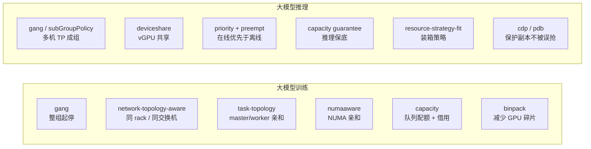

# 核心代码分析（二）：关键插件

> Action 提供流程，**Plugin 提供策略**。本篇挑出与大模型训练/推理最相关的插件，逐个看它注册了哪些扩展点、算法是什么。
>
> 源码目录：`pkg/scheduler/plugins/`

---

## 1. gang：成组调度的守门人

`plugins/gang/gang.go`。只有 300 行，却是 Volcano 区别于 kube-scheduler 的灵魂。

注册了 8 类扩展点：

| 扩展点 | 实现 | 作用 |
|--------|------|------|
| `JobValidFn` | `CheckTaskValid` + `CheckSubJobValid` + `ValidTaskNum >= MinAvailable` | 有效 Pod 数不够 → 本轮直接跳过 |
| `JobReadyFn` | `CheckTaskReady() && CheckSubJobReady() && IsReady()` | **决定 Statement 能否 Commit** |
| `JobPipelinedFn` | `CheckTaskPipelined() && CheckSubJobPipelined() && IsPipelined()` | 抢占后能否「预定」成功 |
| `SubJobReadyFn` / `SubJobPipelinedFn` | `subJob.IsReady()` / `IsPipelined()` | 子组级 gang |
| `JobOrderFn` / `SubJobOrderFn` | 已 Ready 的排后面 | 优先照顾还没凑齐的作业 |
| `PreemptableFn` / `ReclaimableFn` | 不能把别人打到 `MinAvailable` 以下 | 保护已运行作业 |
| `JobStarvingFn` | `job.IsStarving()` | 判断是否「值得为它抢占」 |

### 1.1 JobValidFn：三层校验

```go
validJobFn := func(obj interface{}) *api.ValidateResult {
    job := obj.(*api.JobInfo)

    if valid := job.CheckTaskValid(); !valid {        // 每个 task role 的有效 Pod 数 ≥ taskMinAvailable
        return &api.ValidateResult{Pass: false, Reason: v1beta1.NotEnoughPodsOfTaskReason, ...}
    }
    if valid := job.CheckSubJobValid(); !valid {      // 每个 subGroup 数量是否够
        return &api.ValidateResult{Pass: false, Reason: v1beta1.NotEnoughPodsOfTaskReason, ...}
    }
    vtn := job.ValidTaskNum()
    if vtn < job.MinAvailable {                      // 作业级：有效 Pod 数 ≥ minAvailable
        return &api.ValidateResult{Pass: false, Reason: v1beta1.NotEnoughPodsReason,
            Message: fmt.Sprintf("Not enough valid tasks for gang-scheduling, valid: %d, min: %d",
                vtn, job.MinAvailable)}
    }
    return nil
}
```

> 实践含义：若 vcjob 有 Pod 被删/被拒，导致存活 Pod 数 < `minAvailable`，这个作业会被**所有 Action 直接跳过**（`allocate`/`preempt`/`reclaim`/`backfill` 开头都有 `ssn.JobValid` 检查），并在 PodGroup 上留下 `NotEnoughPodsReason`。排障先看这里。

### 1.2 PreemptableFn：抢占护栏

```go
preemptableFn := func(preemptor *api.TaskInfo, preemptees []*api.TaskInfo) ([]*api.TaskInfo, int) {
    var victims []*api.TaskInfo
    jobOccupiedMap := map[api.JobID]int32{}

    for _, preemptee := range preemptees {
        job := ssn.Jobs[preemptee.Job]
        if _, found := jobOccupiedMap[job.UID]; !found {
            jobOccupiedMap[job.UID] = job.ReadyTaskNum()   // 该作业当前就绪 Pod 数
        }
        if jobOccupiedMap[job.UID] > job.MinAvailable {    // ★ 只抢"超额"部分
            jobOccupiedMap[job.UID]--
            victims = append(victims, preemptee)
        }
        // 否则：会把对方打到 minAvailable 以下 → 不允许
    }
    return victims, util.Permit
}
ssn.AddReclaimableFn(gp.Name(), preemptableFn)
ssn.AddPreemptableFn(gp.Name(), preemptableFn)
```

对 `minAvailable == replicas` 的刚性训练作业，等价于「跑起来就不可被抢」；对 `minAvailable < replicas` 的弹性作业，只有超出 `minAvailable` 的 Pod 会被抢走 —— **这是 Volcano 弹性训练与抢占共存的机制**。

### 1.3 OnSessionClose：把结论写回 PodGroup

```go
unreadyTaskCount = job.MinAvailable - schedulableTaskNum()
msg := fmt.Sprintf("%v/%v tasks in gang unschedulable: %v",
    unreadyTaskCount, len(job.Tasks), job.FitError())
jc := &scheduling.PodGroupCondition{
    Type: scheduling.PodGroupUnschedulableType, Status: v1.ConditionTrue,
    Reason: v1beta1.NotEnoughResourcesReason, Message: msg,
}
ssn.UpdatePodGroupCondition(job, jc)
metrics.RegisterJobRetries(job.Name)
```

排障必用：`kubectl describe podgroup <pg>`，Message 直接告诉你「还差几个 Pod、卡在哪个 predicate」。

---

## 2. capacity：现代队列配额（推荐）

`plugins/capacity/capacity.go`。用「**显式声明 deserved**」取代 proportion 的「按 weight 算比例」，语义更可预测。

### 2.1 队列属性模型

```go
type queueAttr struct {
    queueID   api.QueueID
    name      string
    share     float64
    ancestors []api.QueueID              // 层级队列：祖先链
    children  map[api.QueueID]*queueAttr

    deserved   *api.Resource             // 应得量（借出/抢回的分界线）
    allocated  *api.Resource             // 已分配（AllocatedStatus 的 task 之和）
    request    *api.Resource             // 总请求（allocated + pending）
    elastic    *api.Resource             // 弹性部分 = job.allocated - job.minAvailable
    inqueue    *api.Resource             // 已入队未运行的预留
    capability *api.Resource             // 用户配的硬上限
    realCapability *api.Resource         // ★ 实际可用上限
    guarantee  *api.Resource             // 保底预留
    dra        *draQuotaAttr             // DRA 配额
}
```

### 2.2 realCapability 的计算 —— 配额语义的关键

```go
// buildQueueAttrs
realCapability := api.ExceededPart(cp.totalResource, cp.totalGuarantee).Add(attr.guarantee)
if attr.capability == nil {
    attr.realCapability = realCapability
} else {
    realCapability.MinDimensionResource(attr.capability, api.Infinity)
    attr.realCapability = realCapability
}
```

公式化：

```text
realCapability = min( (集群总量 − 所有队列 guarantee 之和) + 本队列 guarantee ,  capability )
```

之后对 `deserved` 做两次夹逼：

```go
attr.deserved.MinDimensionResource(attr.realCapability, api.Infinity)  // deserved ≤ realCapability
attr.deserved = helpers.Max(attr.deserved, attr.guarantee)             // deserved ≥ guarantee
cp.updateShare(attr)
```

**`guarantee ≤ deserved ≤ realCapability ≤ capability` 是代码强制的**，配错了会被静默夹到合法区间 —— 这是排查「队列拿不到我配的量」的第一现场。

### 2.3 四道门禁的区别（最容易搞混的地方）

| 扩展点 | 判定式 | 语义 |
|--------|--------|------|
| `AllocatableFn`（allocate 逐 task） | `allocated + reserved + task.Resreq ≤ **realCapability**` | 硬上限，**允许超过 deserved**（借用别人的） |
| `OverusedFn`（allocate 整队列） | capacity **不注册**；proportion 注册为 `deserved ≤ allocated` | 队列级熔断 |
| `PreemptiveFn`（reclaim 抢占资格） | 本队列 `allocated + 请求 ≤ deserved` | 只有「没吃到应得量」的队列才有资格抢别人 |
| `JobEnqueueableFn`（enqueue 门禁） | `allocated + inqueue + minReq − elastic ≤ realCapability` | 入队门禁 |

```go
// queueAllocatableWithReserved
futureUsed := attr.allocated.Clone().Add(reserved).Add(candidate.Resreq)
allocatable, _ := futureUsed.LessEqualWithDimensionAndResourcesName(attr.realCapability, candidate.Resreq)
```

对照示例：`train` 队列 `deserved: 40 GPU`、`capability: 64 GPU`。夜里 `serve` 空闲，`train` 可以借到 64 卡（`AllocatableFn` 用 realCapability）；白天 `serve` 有作业饥饿且 `allocated(0) < deserved(24)`，`PreemptiveFn` 放行，`reclaim` 把超出 40 卡的部分抢回来。

### 2.4 层级队列

```go
func (cp *capacityPlugin) checkQueueAllocatableHierarchically(ssn *framework.Session,
    queue *api.QueueInfo, candidate *api.TaskInfo) bool {
    list := append(cp.queueOpts[queue.UID].ancestors, queue.UID)
    for i := len(list) - 1; i >= 0; i-- {        // 从叶子一路检查到 root
        if !cp.queueAllocatable(ssn.Queues[list[i]], candidate, ...) { return false }
    }
    return true
}
```

开启 `enableHierarchy: true` 后：

- 只有**叶子队列**能提交作业（`AllocatableFn` 中 `!cp.isLeafQueue(queue.UID)` 直接 false）；
- 一个 task 必须通过**自己 + 所有祖先**的配额检查；
- `QueueOrderFn` 里叶子队列优先于非叶子队列。

典型层级：`root → {团队A, 团队B}`，团队下再分 `train` / `serve`，实现「部门总量 + 子队列细分」。

### 2.5 DRA 配额

Queue 的 `capability` 支持 DRA 语法：

```yaml
capability:
  deviceclass/gpu.nvidia.com: "8"                 # 该 DeviceClass 的设备数上限
  memory.deviceclass/gpu.nvidia.com: "640Gi"      # 该 DeviceClass 内某维度上限
```

解析见 `parseDRAResourceList`（`deviceclass/` 前缀 → Count，`<dim>.deviceclass/<class>` → Capacity 维度），校验见 `checkDRAAllocatable`。开关：`capacity.DynamicResourceAllocationEnable`、`capacity.DRAConsumableCapacityEnable`。

---

## 3. proportion：按 weight 分配（经典）

`plugins/proportion/proportion.go`。核心是一个**迭代加权注水算法**：

```go
remaining := pp.totalResource.Clone()
meet := map[api.QueueID]struct{}{}          // 已"吃饱"的队列
for {
    totalWeight := 所有未 meet 队列的 weight 之和

    for _, attr := range pp.queueOpts {
        if _, found := meet[attr.queueID]; found { continue }

        oldDeserved := attr.deserved.Clone()
        attr.deserved.Add(remaining.Clone().Multi(float64(attr.weight) / float64(totalWeight)))

        attr.deserved.MinDimensionResource(attr.realCapability, api.Infinity) // 不超上限
        attr.deserved.MinDimensionResource(attr.request, api.Zero)            // ★ 不超实际需求
        attr.deserved = helpers.Max(attr.deserved, attr.guarantee)            // 不低于保底

        if attr.request.LessEqual(attr.deserved, api.Zero) {
            meet[attr.queueID] = struct{}{}     // 需求已满足 → 余量让给别人
        } else if equality.Semantic.DeepEqual(attr.deserved, oldDeserved) {
            meet[attr.queueID] = struct{}{}     // 卡在 capability 上 → 退出
        }
    }
    remaining = api.ExceededPart(remaining.Add(decreasedDeserved), increasedDeserved)
    if remaining.IsEmpty() || 没有变化 { break }
}
```

`MinDimensionResource(attr.request, api.Zero)` 是精髓：**没人要的资源不会白占配额**，会在下一轮迭代分给还有需求的队列 —— 这就是 proportion 的「按权重公平 + 自动借用」。

| | proportion | capacity |
|--|-----------|----------|
| 配额来源 | `weight` 相对比例，动态算 | `deserved` 显式声明 |
| `AllocatableFn` 上限 | `deserved` | `realCapability` |
| 可预测性 | 随集群规模/他人需求漂移 | 稳定 |
| 层级队列 | 靠 `drf` + `enableHierarchy` | 原生 `spec.parent` |
| 建议 | 遗留集群 | **新集群首选** |

> `UnmarshalSchedulerConf` 里有显式冲突检查：`proportion` 与「开了 hierarchy 的 drf」不能同时启用，否则调度器启动直接失败。

---

## 4. deviceshare：GPU 共享 / vGPU

`plugins/deviceshare/deviceshare.go`。推理与开发调试场景最常用的插件。

### 4.1 几种互斥模式

```go
func enablePredicate(dsp *deviceSharePlugin) {
    args.GetBool(&gpushare.GpuSharingEnable, GPUSharingPredicate)   // deviceshare.GPUSharingEnable
    args.GetBool(&gpushare.GpuNumberEnable, GPUNumberPredicate)     // deviceshare.GPUNumberEnable
    args.GetBool(&nodeLockEnable, NodeLockEnable)                   // deviceshare.NodeLockEnable
    args.GetBool(&vgpu.VGPUEnable, VGPUEnable)                      // deviceshare.VGPUEnable
    args.GetBool(&vnpu.AscendMindClusterVNPUEnable, AscendMindClusterVNPU)
    args.GetBool(&hami.AscendHAMiVNPUEnable, AscendHAMiVNPUEnable)

    if gpushare.GpuSharingEnable && gpushare.GpuNumberEnable {
        klog.Fatal("can not define true in both gpu sharing and gpu number")
    }
    if (gpushare.GpuSharingEnable || gpushare.GpuNumberEnable) && vgpu.VGPUEnable {
        klog.Fatal("gpu-share and vgpu can't be used together")     // ★ 互斥，配错直接启动失败
    }
    ...
    config.InitDevicesConfig(knownGeometriesCMName, knownGeometriesCMNamespace)
    registerDevices()
}
```

| 模式 | 开关 | 扩展资源名 | 语义 |
|------|------|-----------|------|
| GPU share（显存维度） | `deviceshare.GPUSharingEnable` | `volcano.sh/gpu-memory` | 按显存 MB 切分一张卡 |
| GPU number | `deviceshare.GPUNumberEnable` | `volcano.sh/gpu-number` | 按「卡数」分配（含独占多卡） |
| vGPU（HAMi 风格） | `deviceshare.VGPUEnable` | `volcano.sh/vgpu-number`、`volcano.sh/vgpu-memory`、`volcano.sh/vgpu-memory-percentage`、`volcano.sh/vgpu-cores` | 同时限制**显存 + 算力百分比**，带运行时隔离 |
| 昇腾 vNPU | `deviceshare.AscendMindClusterVNPUEnable` / `AscendHAMiVNPUEnable` | 由 device config 注册 | 910/310P 切分 |

资源名常量位置：`pkg/scheduler/api/devices/nvidia/gpushare/type.go`、`pkg/scheduler/api/devices/config/vgpu.go`。

### 4.2 设备抽象

所有设备类型实现同一个 `api.Devices` 接口，挂在 `NodeInfo.Others[deviceType]` 上：

```go
func initializeDevicesWithSession(ssn *framework.Session) {
    for _, nodeInfo := range ssn.Nodes {
        for _, val := range api.RegisteredDevices {
            if dev, ok := nodeInfo.Others[val].(api.Devices); ok {
                initializeDevice(dev, ssn, nodeInfo)
            }
        }
    }
}

func getDeviceScore(ctx context.Context, pod *v1.Pod, node *api.NodeInfo, schedulePolicy string) (int64, *fwk.Status) {
    s := float64(0)
    for deviceType, device := range node.Others {
        if device.(api.Devices).HasDeviceRequest(pod) {
            s += device.(api.Devices).ScoreNode(pod, schedulePolicy)  // binpack / spread
        }
    }
    return int64(math.Floor(s + 0.5)), nil
}
```

关键参数：

- `deviceshare.SchedulePolicy`：`binpack`（尽量把碎片填满同一张卡，省卡）或 `spread`（打散，降干扰）。推理服务通常用 `binpack` 提高卡利用率；对延迟敏感的用 `spread`。
- `deviceshare.NodeLockEnable`：给节点加锁，避免同一张卡在「调度决策已下、device plugin 还没确认」窗口期被并发分配。**多副本推理服务频繁扩缩容时建议开启。**
- `deviceshare.KnownGeometriesCMName` / `Namespace`：vGPU 的已知切分几何配置（默认 `volcano-vgpu-device-config` / `kube-system`）。

插件内还有跨 Session 的持久化状态：

```go
// persistedGPUs survives across scheduling sessions.
// nodeName → namespace/name → set of GPU indices allocated to that pod
persistedGPUs map[string]map[string]map[int]struct{}
```

因为「哪个 Pod 用了哪张卡的哪块显存」不能每轮重算（Pod 还没起来时 kubelet 侧还没上报），所以 deviceshare 是少数持有跨轮状态的插件，`OnSessionOpen` 时做 prune。

> ⚠️ 使用前提：节点上要装对应的 device plugin（`volcano-vgpu-device-plugin` 或 gpu-share device plugin），并且 Pod **用 `limits` 声明**这些扩展资源。

---

## 5. network-topology-aware：拓扑感知（大模型训练必看）

`plugins/network-topology-aware/network_topology_aware.go`。它把 HyperNode 树变成调度决策。

### 5.1 注册的扩展点

```go
ssn.AddHyperNodeOrderFn(nta.Name(), func(subJob *api.SubJobInfo, hyperNodes map[string][]*api.NodeInfo) (map[string]float64, error) {
    return nta.HyperNodeOrderFn(ssn, subJob, hyperNodes)
})
ssn.AddBatchNodeOrderFn(nta.Name(), ...)           // 普通 Pod 也做 hypernode 级 binpack
ssn.AddHyperNodeGradientForJobFn(nta.Name(), func(job *api.JobInfo, hyperNode *api.HyperNodeInfo, purpose api.SearchPurpose) [][]*api.HyperNodeInfo {
    if hardMode, highestAllowedTier := job.IsHardTopologyMode(); hardMode {
        return nta.hyperNodeGradientFn(ssn, hyperNode, highestAllowedTier, job.AllocatedHyperNode, job.GetMinResources(), purpose)
    }
    ...
})
ssn.AddHyperNodeGradientForSubJobFn(nta.Name(), ...)  // 子组粒度
```

`HyperNodeGradient*Fn` 返回 `[][]*api.HyperNodeInfo`：**外层是梯度（tier 从低到高），内层是同梯度候选域**。02 篇里 `allocateForJob` 就是按这个二维列表逐梯度尝试的：

```text
gradient 0: [rack-a, rack-b, rack-c]      ← tier 1，性能最好
gradient 1: [spine-1, spine-2]            ← tier 2，跨 rack
gradient 2: [<cluster-top-hypernode>]     ← 全集群（soft 模式才会到这一层）
```

`mode: hard` + `highestTierAllowed: 1` 时，超过 tier 1 的梯度不会生成 → 装不下就调度失败（宁可不跑，也不跨交换机）。`mode: soft` 时允许逐级放宽。

### 5.2 打分：拓扑亲和 + 域内 binpack

```go
func (nta *networkTopologyAwarePlugin) HyperNodeOrderFn(ssn *framework.Session, subJob *api.SubJobInfo,
    hyperNodes map[string][]*api.NodeInfo) (map[string]float64, error) {
    hyperNodeScores := nta.getSubJobHyperNodeBinPackingScore(subJob, hyperNodes)  // ① 域内资源装箱得分

    // ② 最高分并列时，用"该域已调度了本作业多少 task"打破平局
    if len(scoreToHyperNodes[maxScore]) > 1 {
        for _, hyperNode := range scoreToHyperNodes[maxScore] {
            hyperNodeScores[hyperNode] += nta.scoreWithTaskNum(hyperNode, subJob.Tasks, ssn.RealNodesList)
        }
    }
    return nta.scaleFinalScore(hyperNodeScores), nil
}
```

- **①「域内 binpack」**：优先选「装完这个作业后剩余资源最少」的域，避免把大域切碎，为后来的大作业留出完整域。权重可配：

```yaml
- name: network-topology-aware
  arguments:
    weight: 10
    hypernode.binpack.cpu: 5
    hypernode.binpack.memory: 1
    hypernode.binpack.resources: nvidia.com/gpu
    hypernode.binpack.resources.nvidia.com/gpu: 2
    hypernode.binpack.normal-pod.enable: true      # 无拓扑约束的普通 Pod 也做域级 binpack
    hypernode.binpack.normal-pod.fading: 0.8       # 跨 tier 的权重衰减
```

- **②「聚拢已有 task」**：让同一个作业的后续 Pod 往「已经放了同伴」的域里聚，这对 `minAvailable < replicas` 的分批调度非常重要。

资源统计做了缓存，避免重复求和：

```go
func (nta *networkTopologyAwarePlugin) initHyperNodeResourceCache(ssn *framework.Session) {
    for hyperNode := range ssn.HyperNodes {
        for node := range ssn.RealNodesSet[hyperNode] {
            cache[hyperNode].allocatable.Add(ssn.Nodes[node].Allocatable)
            cache[hyperNode].idle.Add(ssn.Nodes[node].Idle)
            cache[hyperNode].futureIdle.Add(ssn.Nodes[node].FutureIdle())
            ...
        }
    }
}
```

### 5.3 HyperNode 从哪来

两条路：

1. **手写 CRD**（`topology.volcano.sh/v1alpha1 HyperNode`），用 `exactMatch` / `regexMatch` / `labelMatch` 描述成员；
2. **自动发现**：`pkg/controllers/hypernode/` 里的 controller 支持从底层网络信息（如 UFM / RoCE 拓扑）自动建 HyperNode 树。

---

## 6. 其他常用插件速查

| 插件 | 关键扩展点 | 要点 |
|------|-----------|------|
| `priority` | `TaskOrderFn`、`JobOrderFn`、`PreemptableFn` | 依据 `PriorityClass` / `PodGroup.spec.priorityClassName` 排序；高优可抢低优 |
| `predicates` | `PrePredicateFn`、`PredicateFn` | 复用 k8s 原生 filter（NodeAffinity、PodTopologySpread、VolumeBinding、TaintToleration、NodePorts…），是节点过滤的主力 |
| `nodeorder` | `NodeOrderFn`、`BatchNodeOrderFn` | 复用 k8s 原生 score（`leastrequested`、`balancedresource`、`nodeaffinity`、`imagelocality`、`podaffinity` 等），各项权重可配 |
| `binpack` | `NodeOrderFn`（仅当 `binpack.weight != 0` 才注册） | 装箱，减少碎片。GPU 集群务必配 `binpack.resources: nvidia.com/gpu` 并给较大权重 |
| `resource-strategy-fit` | `NodeOrderFn` | 比 binpack 更细：可对不同资源分别指定 `LeastAllocated` / `MostAllocated` |
| `task-topology` | `TaskOrderFn`、`NodeOrderFn` | 作业内部 task 亲和/反亲和（如 ps 与 worker 同机/分机），TF 架构常用 |
| `numaaware` | `PredicateFn`、`BatchNodeOrderFn` | NUMA 亲和：CPU/内存/设备在同一 NUMA node，配合 `volcano.sh/numa-topology-policy` 注解与 `Numatopology` CRD |
| `nodegroup` | `PredicateFn`、`NodeOrderFn` | 队列绑定节点组（`volcano.sh/nodegroup-name` label + Queue `affinity`），把 A100 池独占给某队列 |
| `overcommit` | `JobEnqueueableFn` | 允许入队总量超过集群实际容量一个倍率（`overcommit-factor`），提升流水线利用率 |
| `sla` | `JobEnqueueableFn`、`JobOrderFn` | `volcano.sh/sla-waiting-time` 到点强制放行，防饿死 |
| `tdm` | `PredicateFn`、`PreemptableFn`、`VictimTasksFn` | 分时复用可回收节点（`volcano.sh/revocable-zone`），混部/竞价实例场景 |
| `cdp` | `PreemptableFn` | 冷却时间保护（`volcano.sh/cooldown-time`），刚起来的 Pod 一段时间内免抢 |
| `pdb` | `VictimTasksFn` | 尊重 PodDisruptionBudget |
| `usage` | `PredicateFn`、`NodeOrderFn` | 基于真实监控利用率（而非 request）打分/过滤，需 Prometheus |
| `rescheduling` | `VictimTasksFn` | 配合 `shuffle` action 做重调度 |
| `resourcequota` | `JobEnqueueableFn` | 尊重 namespace 级 ResourceQuota |
| `extender` | 多个 | HTTP 外部扩展，不改代码即可插入自定义策略 |
| `conformance` | `PreemptableFn` | 保护关键 Pod（如 `system-cluster-critical`、DaemonSet）不被抢 |
| `drf` | `JobOrderFn`、`QueueOrderFn`（`enableHierarchy` 时） | Dominant Resource Fairness，多维资源公平 |

---

## 7. 插件与场景的对应关系



下一篇 [04 面向大模型训练与推理的能力地图](04-面向大模型训练与推理的能力地图.md)：把这些插件组合成可落地的方案。

