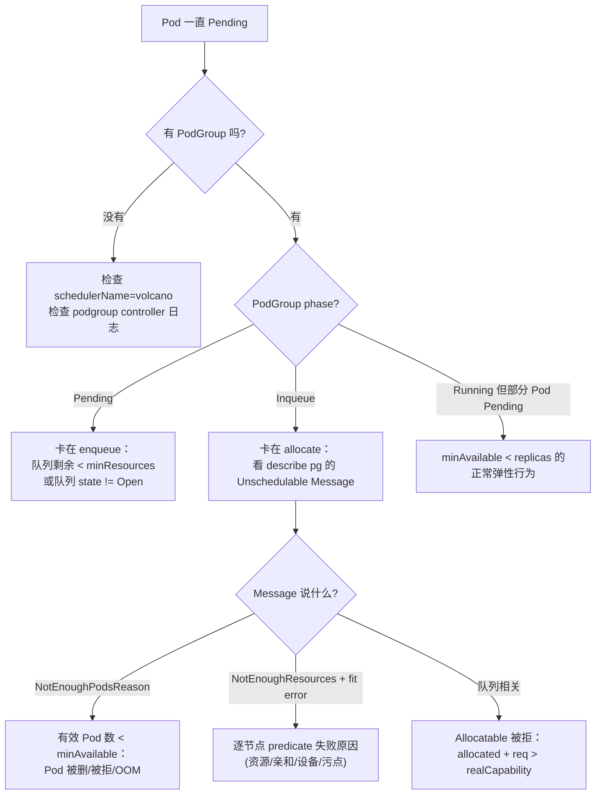

# 实战 Demo

> 从零跑通：安装 → 建队列 → 分布式训练（PyTorch）→ 推理服务（vLLM）→ GPU 共享 → 抢占与回收 → 排障。
>
> **源码 / 版本基线：v1.15.1**。所有 YAML 可直接使用，GPU 相关部分需要集群已装 NVIDIA device plugin。

---

## 0. 环境准备与安装

### 0.1 安装（两种方式二选一）

```bash
# 方式一：Helm（推荐，可开 feature gate）
helm repo add volcano-sh https://volcano-sh.github.io/helm-charts
helm repo update
helm install volcano volcano-sh/volcano -n volcano-system --create-namespace \
  --version 1.15.1

# 方式二：一键 YAML（★ 用 tag 而不是 master，保证与文档一致）
kubectl apply -f https://raw.githubusercontent.com/volcano-sh/volcano/v1.15.1/installer/volcano-development.yaml
```

验证：

```bash
kubectl get pods -n volcano-system
# 预期：volcano-scheduler-xxx、volcano-controllers-xxx、volcano-admission-xxx 均 Running

kubectl get crd | grep volcano
# jobs.batch.volcano.sh / podgroups.scheduling.volcano.sh / queues.scheduling.volcano.sh
# hypernodes.topology.volcano.sh / jobflows.flow.volcano.sh / numatopologies.nodeinfo.volcano.sh ...
```

### 0.2 调度器配置

配置在 ConfigMap `volcano-scheduler-configmap`（namespace `volcano-system`），**改完不用重启**（`watchSchedulerConf` 热加载）：

```bash
kubectl -n volcano-system edit cm volcano-scheduler-configmap
```

本篇 Demo 使用的配置：

```yaml
apiVersion: v1
kind: ConfigMap
metadata:
  name: volcano-scheduler-configmap
  namespace: volcano-system
data:
  volcano-scheduler.conf: |
    actions: "enqueue, allocate, preempt, reclaim, backfill"
    tiers:
    - plugins:
      - name: priority
      - name: gang
        enablePreemptable: false
      - name: conformance
      - name: cdp
    - plugins:
      - name: overcommit
      - name: predicates
      - name: capacity
      - name: nodeorder
      - name: binpack
        arguments:
          binpack.weight: 10
          binpack.resources: nvidia.com/gpu
          binpack.resources.nvidia.com/gpu: 5
      - name: network-topology-aware
        arguments:
          weight: 20
```

确认是否生效：

```bash
kubectl -n volcano-system logs deploy/volcano-scheduler | grep "Finished loading scheduler config"
# Finished loading scheduler config. Final state: actions=[enqueue allocate preempt reclaim backfill],
#   plugins=[priority gang conformance cdp overcommit predicates capacity nodeorder binpack network-topology-aware]
```

这行日志（`loadSchedulerConf` 的 defer，需 `--v=2`）会打印**实际生效**的 action 与 plugin 列表，是确认「我改的配置到底有没有被读到」最可靠的方法。

> 版本差异：v1.16 起改为 `logLoadedSchedulerConf`，日志变成 `Successfully loaded Scheduler conf as follows:` 并逐行打印完整 YAML。若你用的是更高版本，grep 关键字换成 `Successfully loaded Scheduler conf`。

---

## 1. 建队列：训推共享一个 GPU 池

沿用系列示例：8 台机 × 8 卡 = 64 卡。

```yaml
# queues.yaml
apiVersion: scheduling.volcano.sh/v1beta1
kind: Queue
metadata:
  name: serve
spec:
  reclaimable: false                       # 自己拿到的不许被别人抢
  priority: 100
  deserved:
    nvidia.com/gpu: "24"
  guarantee:
    resource:
      nvidia.com/gpu: "16"                 # 16 卡永久为推理预留
  capability:
    nvidia.com/gpu: "64"
---
apiVersion: scheduling.volcano.sh/v1beta1
kind: Queue
metadata:
  name: train
spec:
  reclaimable: true                        # 超出 deserved 的部分可被回收
  priority: 10
  deserved:
    nvidia.com/gpu: "40"
  capability:
    nvidia.com/gpu: "64"
```

```bash
kubectl apply -f queues.yaml
kubectl get queue
# NAME     AGE
# default  ...
# serve    ...
# train    ...

kubectl get queue train -o jsonpath='{.status}' | jq
# {"state":"Open","allocated":{...},"running":0,"inqueue":0,...}
```

> 排障提示：如果队列拿到的资源和你配的不一致，先算一遍
> `realCapability = min(集群总量 − Σguarantee + 本队列guarantee, capability)`，
> 再看 `deserved` 是否被夹到 `[guarantee, realCapability]` 区间内（03 篇 §2.2）。
> 也可以直接看指标：`volcano_queue_deserved_*`、`volcano_queue_allocated_*`、`volcano_queue_real_capacity_*`。

---

## 2. Demo A：分布式 PyTorch 训练（Gang + 框架插件）

### 2.1 最小可跑版本

```yaml
# train-pytorch.yaml
apiVersion: batch.volcano.sh/v1alpha1
kind: Job
metadata:
  name: pytorch-dist
spec:
  minAvailable: 4                # ★ Gang：4 个 Pod 必须同时就绪
  schedulerName: volcano
  queue: train
  maxRetry: 3
  ttlSecondsAfterFinished: 3600
  plugins:
    pytorch: ["--master=master", "--worker=worker", "--port=23456"]
    svc: []                      # headless service，让 worker 能解析 master
  policies:
  - event: PodFailed
    action: RestartJob           # AllReduce 语义：挂一个就整体重启
  - event: PodEvicted
    action: RestartJob
  tasks:
  - name: master
    replicas: 1
    minAvailable: 1
    template:
      metadata:
        annotations:
          volcano.sh/preemptable: "true"
          volcano.sh/cooldown-time: "300s"
      spec:
        restartPolicy: OnFailure
        containers:
        - name: trainer
          image: pytorch/pytorch:2.3.0-cuda12.1-cudnn8-runtime
          command: ["python", "-c"]
          args:
          - |
            import os, torch, torch.distributed as dist
            print("RANK", os.environ["RANK"], "WORLD_SIZE", os.environ["WORLD_SIZE"],
                  "MASTER", os.environ["MASTER_ADDR"], os.environ["MASTER_PORT"], flush=True)
            dist.init_process_group("nccl")
            t = torch.ones(1).cuda() * int(os.environ["RANK"])
            dist.all_reduce(t)
            print("all_reduce result:", t.item(), flush=True)
            dist.destroy_process_group()
          resources:
            limits:
              nvidia.com/gpu: 1
  - name: worker
    replicas: 3
    minAvailable: 3
    template:
      metadata:
        annotations:
          volcano.sh/preemptable: "true"
      spec:
        restartPolicy: OnFailure
        containers:
        - name: trainer
          image: pytorch/pytorch:2.3.0-cuda12.1-cudnn8-runtime
          command: ["python", "-c"]
          args:
          - |
            import os, torch, torch.distributed as dist
            dist.init_process_group("nccl")
            t = torch.ones(1).cuda() * int(os.environ["RANK"])
            dist.all_reduce(t)
            print("rank", os.environ["RANK"], "ok:", t.item(), flush=True)
            dist.destroy_process_group()
          resources:
            limits:
              nvidia.com/gpu: 1
```

```bash
kubectl apply -f train-pytorch.yaml
```

### 2.2 观察 Gang 与 Inqueue

```bash
# 1) vcjob 状态
kubectl get vcjob pytorch-dist -w
# NAME           STATUS     MINAVAILABLE   RUNNINGS   AGE
# pytorch-dist   Pending    4                         3s
# pytorch-dist   Running    4              4          20s

# 2) PodGroup —— 看 phase 流转（Pending → Inqueue → Running）
kubectl get pg -w
kubectl describe pg pytorch-dist-<uid>

# 3) 关键：注入的环境变量
kubectl exec pytorch-dist-worker-0 -- env | grep -E 'MASTER_ADDR|MASTER_PORT|WORLD_SIZE|RANK'
# MASTER_ADDR=pytorch-dist-master-0.pytorch-dist
# MASTER_PORT=23456
# WORLD_SIZE=4
# RANK=1
```

**故意制造资源不足**，验证 Gang 语义：把 `replicas` 调到超过集群剩余卡数再 apply，然后：

```bash
kubectl get pods            # 观察：要么 0 个 Running，要么全部 Running，不会出现"部分 Running"
kubectl describe pg pytorch-dist-<uid>
# Conditions:
#   Type            Reason               Message
#   Unschedulable   NotEnoughResources   3/8 tasks in gang unschedulable: ...
```

这条 Message 由 `gang` 插件在 `OnSessionClose` 写入（03 篇 §1.3）。

### 2.3 加上网络拓扑约束

前置：先建 HyperNode 描述物理拓扑。

```yaml
# hypernodes.yaml
apiVersion: topology.volcano.sh/v1alpha1
kind: HyperNode
metadata: {name: rack-0}
spec:
  tier: 1
  tierName: rack
  members:
  - type: Node
    selector:
      regexMatch: {pattern: "^gpu-node-[0-3]$"}
---
apiVersion: topology.volcano.sh/v1alpha1
kind: HyperNode
metadata: {name: rack-1}
spec:
  tier: 1
  tierName: rack
  members:
  - type: Node
    selector:
      regexMatch: {pattern: "^gpu-node-[4-7]$"}
---
apiVersion: topology.volcano.sh/v1alpha1
kind: HyperNode
metadata: {name: spine-0}
spec:
  tier: 2
  tierName: spine
  members:
  - type: HyperNode
    selector: {exactMatch: {name: rack-0}}
  - type: HyperNode
    selector: {exactMatch: {name: rack-1}}
```

```bash
kubectl apply -f hypernodes.yaml
kubectl get hypernode
# NAME      TIER   TIERNAME   NODECOUNT   AGE
# rack-0    1      rack       4           ...
# rack-1    1      rack       4           ...
# spine-0   2      spine      8           ...
```

作业侧：

```yaml
spec:
  minAvailable: 8
  networkTopology:
    mode: hard                 # 硬约束：装不下就 Pending，不跨 spine
    highestTierAllowed: 1      # 只允许 tier ≤ 1（同 rack）
  tasks:
  - name: worker
    replicas: 16
    partitionPolicy:           # ★ 每 4 个 Pod 一组，组内必须同机
      totalPartitions: 4
      partitionSize: 4
      minPartitions: 2         # 至少 2 组资源满足才开始调度
      networkTopology:
        mode: hard
        highestTierName: node
```

验证调度落点：

```bash
kubectl get pods -o wide | awk '{print $1, $7}'      # 看是否都落在同一 rack 的节点上
kubectl get pg <pg> -o jsonpath='{.spec.networkTopology}{"\n"}{.spec.subGroupPolicy}' | jq
```

> `mode: hard` 装不下时，`describe pg` 里会看到带 hyperNode 信息的 fit error（`fitErrors.SetHyperNode(hyperNode)`，见 02 篇 §2.3）。

---

## 3. Demo B：vLLM 推理服务（Deployment + 队列）

### 3.1 单卡副本：最简接入

```yaml
# serve-vllm.yaml
apiVersion: apps/v1
kind: Deployment
metadata:
  name: vllm-qwen
spec:
  replicas: 2
  selector:
    matchLabels: {app: vllm-qwen}
  template:
    metadata:
      labels: {app: vllm-qwen}
      annotations:
        scheduling.volcano.sh/queue-name: serve        # ★ 进 serve 队列
    spec:
      schedulerName: volcano                           # ★ 交给 Volcano 调度
      priorityClassName: high-priority                 # 便于抢占离线任务
      containers:
      - name: vllm
        image: vllm/vllm-openai:latest
        args:
        - --model=Qwen/Qwen2.5-7B-Instruct
        - --max-model-len=8192
        - --gpu-memory-utilization=0.9
        ports:
        - containerPort: 8000
        resources:
          limits:
            nvidia.com/gpu: 1
        readinessProbe:
          httpGet: {path: /health, port: 8000}
          initialDelaySeconds: 60
---
apiVersion: v1
kind: Service
metadata:
  name: vllm-qwen
spec:
  selector: {app: vllm-qwen}
  ports:
  - port: 8000
    targetPort: 8000
```

配套 PriorityClass：

```yaml
apiVersion: scheduling.k8s.io/v1
kind: PriorityClass
metadata: {name: high-priority}
value: 100000
globalDefault: false
description: "online inference"
---
apiVersion: scheduling.k8s.io/v1
kind: PriorityClass
metadata: {name: low-priority}
value: 100
globalDefault: false
description: "offline training"
```

验证 PodGroup 是自动生成的：

```bash
kubectl apply -f serve-vllm.yaml
kubectl get pg
# NAME                            STATUS    MINMEMBER   RUNNINGS   AGE   QUEUE
# podgroup-<replicaset-uid>       Running   1           2          10s   serve

kubectl get pod -l app=vllm-qwen -o jsonpath='{.items[0].metadata.annotations}' | jq
# 可以看到 scheduling.k8s.io/group-name 被 podgroup controller 回填
```

这条链路对应 `pkg/controllers/podgroup/pg_controller_handler.go` 的 `createOrUpdateNormalPodPG` + `updatePodAnnotations`（00 篇 §5）。

### 3.2 多机 TP：4 卡一副本、Gang + 同机

TP=4 且单机 8 卡够用时，用 nodeAffinity/topologySpread 即可；**跨机 TP** 才需要 Gang + 拓扑。用自建 PodGroup 表达最清晰：

```yaml
# 自建 PodGroup：一个副本 = 4 个 Pod，必须全起且同 rack
apiVersion: scheduling.volcano.sh/v1beta1
kind: PodGroup
metadata:
  name: vllm-tp4-r0
spec:
  minMember: 4
  queue: serve
  priorityClassName: high-priority
  minResources:
    nvidia.com/gpu: "4"                 # ★ 入队门禁，缺 4 卡就不建 Pod
  networkTopology:
    mode: hard
    highestTierName: rack
---
apiVersion: apps/v1
kind: StatefulSet
metadata: {name: vllm-tp4-r0}
spec:
  replicas: 4
  serviceName: vllm-tp4-r0
  selector: {matchLabels: {app: vllm-tp4, replica: "0"}}
  template:
    metadata:
      labels: {app: vllm-tp4, replica: "0"}
      annotations:
        scheduling.k8s.io/group-name: vllm-tp4-r0     # ★ 手动挂到上面的 PodGroup
    spec:
      schedulerName: volcano
      containers:
      - name: vllm
        image: vllm/vllm-openai:latest
        # 实际部署请用 ray/torchrun 或 LeaderWorkerSet 组织 TP rank
        resources:
          limits: {nvidia.com/gpu: 1}
```

> 生产上更推荐 **LeaderWorkerSet**：它自己会创建 PodGroup，Volcano 的 `pg_controller` 会识别并跳过（`if pgName := pod.Annotations[...]; pgName != "" { return }`），职责清晰。

---

## 4. Demo C：GPU 共享（vGPU）

### 4.1 前置

```bash
# 安装 volcano vgpu device plugin（节点侧）
kubectl apply -f https://raw.githubusercontent.com/Project-HAMi/volcano-vgpu-device-plugin/main/volcano-vgpu-device-plugin.yml

# 节点上会出现虚拟资源
kubectl describe node <gpu-node> | grep -A5 Allocatable
#   volcano.sh/vgpu-number:  80        # 8 卡 × 每卡默认 10 份
#   volcano.sh/vgpu-memory:  ...
```

调度器打开 deviceshare：

```yaml
      - name: deviceshare
        arguments:
          deviceshare.VGPUEnable: true
          deviceshare.NodeLockEnable: true
          deviceshare.SchedulePolicy: binpack
```

### 4.2 共享一张卡的两个开发 Pod

```yaml
apiVersion: v1
kind: Pod
metadata:
  name: dev-jupyter-a
  annotations:
    scheduling.volcano.sh/queue-name: default
spec:
  schedulerName: volcano
  containers:
  - name: dev
    image: pytorch/pytorch:2.3.0-cuda12.1-cudnn8-runtime
    command: ["sleep", "infinity"]
    resources:
      limits:
        volcano.sh/vgpu-number: 1        # 1 张虚拟卡
        volcano.sh/vgpu-memory: 8000     # 限制 8000 MB 显存
        volcano.sh/vgpu-cores: 30        # 限制 30% 算力
```

验证隔离生效：

```bash
kubectl exec dev-jupyter-a -- nvidia-smi
# 预期看到的显存总量是 8000MiB 左右（而不是整卡 80GB）

kubectl get pod dev-jupyter-a -o jsonpath='{.metadata.annotations}' | jq
# volcano.sh/vgpu-ids-new / volcano.sh/vgpu-node / volcano.sh/bind-phase 等由调度器写入
```

把 `dev-jupyter-a` 复制成 `dev-jupyter-b` 再 apply，用 `binpack` 策略两个 Pod 会落到**同一张物理卡**（`volcano.sh/gpu-index` 相同），从而把一张 A100 切给多个调试用户。

> 注意 03 篇 §4.1 的互斥规则：`vgpu` 与 `gpu-share`（`volcano.sh/gpu-memory`）不能同时启用，配错调度器会 `klog.Fatal` 起不来。

---

## 5. Demo D：抢占与跨队列回收

### 5.1 场景复现

```text
时刻 T0：serve 队列空闲，train 提交一个 64 卡训练作业 → 借用到 64 卡（超出 deserved 40）
时刻 T1：serve 提交 3 个 8 卡推理副本（共 24 卡）
预期：reclaim 把 train 超出 40 卡的部分（24 卡）抢回来给 serve
```

准备：训练作业必须**可被抢占**，且 `train` 队列 `reclaimable: true`（第 1 节已配）。

```yaml
# 离线训练：低优 + 可抢占 + 弹性
apiVersion: batch.volcano.sh/v1alpha1
kind: Job
metadata: {name: offline-train}
spec:
  minAvailable: 40                      # ★ 弹性：40 是底线，超出的可被抢
  schedulerName: volcano
  queue: train
  priorityClassName: low-priority
  tasks:
  - name: worker
    replicas: 64
    template:
      metadata:
        annotations:
          volcano.sh/preemptable: "true"      # ★ 不加这个，reclaim 找不到受害者
          volcano.sh/cooldown-time: "120s"    # 起来 2 分钟内免抢（cdp 插件）
      spec:
        restartPolicy: OnFailure
        containers:
        - name: t
          image: pytorch/pytorch:2.3.0-cuda12.1-cudnn8-runtime
          command: ["sleep", "infinity"]
          resources:
            limits: {nvidia.com/gpu: 1}
```

### 5.2 观察回收过程

```bash
# 观察 train 队列已分配量从 64 降回 40
watch -n2 'kubectl get queue train -o jsonpath="{.status.allocated}"; echo; \
            kubectl get queue serve -o jsonpath="{.status.allocated}"'

# 观察驱逐事件
kubectl get events --sort-by=.lastTimestamp | grep -i -E 'evict|preempt'

# 调度器日志（最直观）
kubectl -n volcano-system logs deploy/volcano-scheduler | grep -E 'Reclaim|reclaimees|Victims|Preempt'
```

日志里能对上 02 篇 §4 的判定链：

```text
Considering reclaim for N tasks of job <default/serve-xxx>
Queue <serve> cannot reclaim for task <...>, skip        ← PreemptiveFn 未通过（已吃到 deserved）
No reclaimees on Node <...>                              ← 该节点上没有可抢的（对方队列 reclaimable=false）
Victims from proportion/capacity plugins are [...]       ← ReclaimableFn 投票结果
Committing operations ...                                ← JobPipelined 通过，真正驱逐
Discarding operations ...                                ← 抢了也凑不齐 gang，一个都不杀
```

### 5.3 验证「不会白杀 Pod」

把 `serve` 的请求量调成「即使全抢也不够」（例如要 100 卡），再观察：

```bash
kubectl -n volcano-system logs deploy/volcano-scheduler | grep Discarding
kubectl get pods -l volcano.sh/job-name=offline-train | wc -l    # Pod 数量不变
```

这就是 `stmt.Discard()` 的价值（01 篇 §6）：**驱逐只在「驱逐后确实能起来」时才提交**。

---

## 6. 排障手册

### 6.1 分层定位法



### 6.2 常用命令

```bash
# 作业与组
kubectl get vcjob -A
kubectl get pg -A -o custom-columns=NS:.metadata.namespace,NAME:.metadata.name,\
QUEUE:.spec.queue,MIN:.spec.minMember,PHASE:.status.phase,RUN:.status.running
kubectl describe pg <pg>                       # ★ 90% 的问题看这里

# 队列
kubectl get queue -o custom-columns=NAME:.metadata.name,STATE:.status.state,\
ALLOC:.status.allocated,PENDING:.status.pending,INQUEUE:.status.inqueue

# 调度器
kubectl -n volcano-system logs deploy/volcano-scheduler --tail=200
kubectl -n volcano-system logs deploy/volcano-scheduler | grep "Finished loading scheduler config"

# 提升日志级别定位单个 Pod（v=5 会打印每个节点的过滤/打分细节）
kubectl -n volcano-system set env deploy/volcano-scheduler -c volcano-scheduler --list
# 或改 deployment 的 --v=5 参数
```

### 6.3 关键 Prometheus 指标

| 指标 | 含义 |
|------|------|
| `volcano_e2e_scheduling_latency_milliseconds` | 一轮 Session 端到端耗时（调优基线） |
| `volcano_action_duration_seconds` | 各 Action 耗时（哪个 action 慢） |
| `volcano_plugin_duration_seconds` | 各插件 `OnSessionOpen/Close` 耗时 |
| `volcano_queue_deserved_*` / `_allocated_*` / `_real_capacity_*` | 队列配额账本（对账神器） |
| `volcano_queue_overused` | 队列是否超用 |
| `volcano_unschedule_job_count` / `volcano_unschedule_task_count` | 调不动的作业/任务数 |
| `volcano_job_retry_counts` | 作业重试次数（gang 反复失败会涨） |
| `volcano_task_preemption_victims` / eviction transaction | 抢占规模 |

监控栈可直接用仓库里的 `installer/volcano-monitoring.yaml`。

### 6.4 高频问题速查

| 现象 | 原因 | 处理 |
|------|------|------|
| PodGroup 一直 Pending，无任何事件 | `minResources` > 队列剩余；或队列 `state != Open` | 看 `queue.status`，调 `deserved`/`capability` |
| 明明有空闲卡却不调度 | 队列 `Overused`（proportion：`allocated ≥ deserved`） | 提高 `deserved`，或换 `capacity` 插件 |
| 作业永远起不来但资源够 | `ValidTaskNum < minAvailable`（Pod 被删或被 webhook 拒） | `describe pg` 看 `NotEnoughPodsReason` |
| 抢占不生效 | 受害者没打 `volcano.sh/preemptable`，或对方队列 `reclaimable: false`，或在 `cooldown-time` 内 | 补注解/改队列 |
| 带 `networkTopology` 的作业不被抢占 | 设计如此（`preempt.Execute` 显式跳过） | 评估 `gangpreempt` action |
| 改了 ConfigMap 没生效 | 配置有语法错，回退到上一份 | 看日志 `Scheduler config ... is invalid` |
| 调度器起不来 | 插件互斥（proportion + hierarchy drf / vgpu + gpu-share） | 看 `klog.Fatal` 日志 |
| GPU 共享无隔离效果 | 没装 vgpu device plugin，或资源写在 `requests` 而非 `limits` | 补齐 |

---

## 7. 一页速查表

```text
# 训练（vcjob）
minAvailable            → Gang 底线；== replicas 则刚性不可抢
tasks[*].minAvailable   → 角色级底线
plugins.pytorch/svc/ssh → 自动注入 RANK/WORLD_SIZE、DNS、免密
networkTopology         → hard=宁可不跑；soft=逐级放宽
partitionPolicy         → TP 组同机（→ PodGroup.subGroupPolicy）
policies                → PodFailed → RestartJob

# 推理（Deployment/LWS）
schedulerName: volcano
annotations:
  scheduling.volcano.sh/queue-name       → 进哪个队列
  scheduling.volcano.sh/group-min-member → Gang 大小
  scheduling.volcano.sh/group-min-resources → 入队门槛
  scheduling.k8s.io/group-name           → 挂到自建 PodGroup

# 队列（Queue）
guarantee ≤ deserved ≤ capability
reclaimable: false → 我的资源不许被抢
priority           → 越大越先调度、越晚被回收

# 抢占标记（Pod annotation）
volcano.sh/preemptable: "true"
volcano.sh/cooldown-time: "300s"

# GPU 共享（limits）
volcano.sh/vgpu-number / vgpu-memory / vgpu-cores
```

---

回到 [00 总览](00-Volcano总览与架构.md) ｜ 上一篇 [04 能力地图](04-面向大模型训练与推理的能力地图.md)

