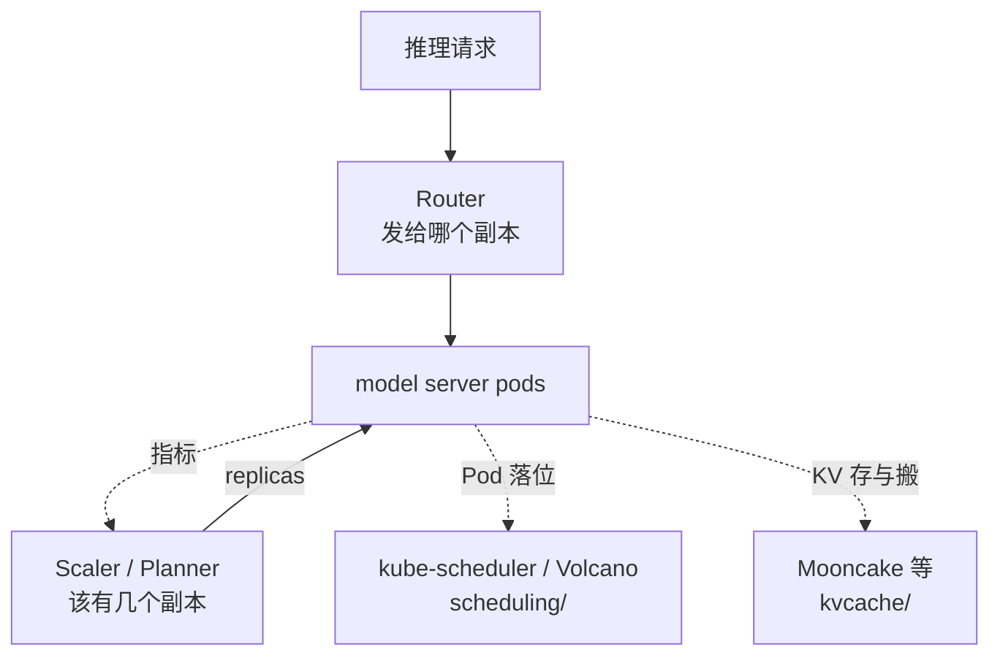

# 推理服务栈（Inference Serving Stack）

引擎之上的**集群协调层**学习资料。聚焦「怎么把一堆 vLLM / SGLang / TensorRT-LLM 副本，变成一个可路由、可扩缩、可做 P/D 分离的推理服务」。

这一层**不替代引擎**（不管单卡怎么算），也**不替代 kube-scheduler**（不管 Pod 落到哪台机器）。它回答的是中间那一段：请求发给谁、开几个副本、KV 在服务栈里怎么被看见和搬动。

## 为什么单独开一个分类

llm-d 和 NVIDIA Dynamo 都同时有 **Router** 和 **Scaler**。如果继续按问题域把它们拆开：

```
scheduling/llm-d/              ← Router
autoscaling/llm-d-autoscaling/ ← Scaler
scheduling/dynamo-router/      ← Dynamo Router
autoscaling/dynamo-planner/    ← Dynamo Planner
kvcache/dynamo-kvbm/           ← Dynamo KVBM
```

读任何一个项目都要跳三个目录，横向对照「llm-d Router vs Dynamo Router」还行，对照「同一个项目里 Router 怎么把指标喂给 Scaler」就会很别扭。WVA 曾经因此被放进 `scheduling/`，后来又搬到 `autoscaling/`——正是这个张力的症状。

反过来，如果只按项目堆在一起、不做问题域索引，又会丢掉已经建立的直觉：

> **Scaler 决定「该有几个副本」，Router 决定「这个请求发给哪个副本」，kube-scheduler / Volcano 决定「副本落到哪个节点」。**

所以本仓库改成一条明确的规则：

> **落盘按项目，检索按问题域。**
>
> - 正文放在 `serving/<项目>/`：一个服务栈读完是一条线。
> - [`scheduling/`](../scheduling/) 与 [`autoscaling/`](../autoscaling/) 只保留问题域索引，指向这里的对应章节。
> - 独立的 KV 基础设施（Mooncake）仍在 [`kvcache/`](../kvcache/)——它不是某个服务栈的内部组件。



## 目录

| 项目 | 目录 | 形态 | 说明 |
|------|------|------|------|
| llm-d | [`llm-d/`](llm-d/) | 两个仓库、两套已完成系列 | Router（EPP）+ WVA，按子目录保存 |
| NVIDIA Dynamo | [`dynamo/`](dynamo/) | **单仓多组件** | Router + Planner + KVBM + Frontend，一套系列往下写 |

llm-d 拆成 `router/` 与 `autoscaling/`，是因为它本来就是两个独立仓库、两套不同基线的笔记。Dynamo 是单仓，**不按组件再拆目录**，避免把一个运行时拆碎。

## 两套栈的能力对照（先建立地图）

| 能力 | llm-d | NVIDIA Dynamo | 本仓库对照入口 |
|------|-------|---------------|----------------|
| 请求入口 | Gateway API + Envoy ext-proc | Dynamo Frontend，或 Gateway API + EPP | [Router](llm-d/router/) · [Dynamo](dynamo/) |
| KV-aware 路由 | EPP + `kvblock.Index` / ZMQ 事件 | Dynamo Router（KV overlap + load） | 同上 |
| 扩缩容 | WVA → HPA/KEDA | Planner（SLA / TCO） | [WVA](llm-d/autoscaling/) · Dynamo Planner 章 |
| P/D 分离编排 | `pd-sidecar` / Coordinator | 原生 disagg + NIXL | [Router 06](llm-d/router/06-核心代码分析-PD分离与Sidecar.md) |
| KV 分层 / 卸载 | 主要交给引擎 + Mooncake | **KVBM**（GPU→CPU→SSD→远端） | [Mooncake](../kvcache/mooncake/) · Dynamo KVBM 章 |
| 拓扑感知落位 | 不在 llm-d 内 | Grove（**独立仓库**，分析时归 [`scheduling/`](../scheduling/)） | — |

> Grove（`ai-dynamo/grove`）是 K8s 上的拓扑感知 gang 调度，问题域与 kube-scheduler / Volcano 相同，**不放进 `serving/dynamo/`**。需要时在 `scheduling/` 单开系列。

## 与其他分类的关系

```
inference-engine/    ← 单个副本内部怎么算（算）
       │
kvcache/             ← 跨实例的 KV 怎么存、怎么搬（存 + 搬）
       │
serving/             ← 本分类：一堆副本怎么变成一个服务（路由 + 伸缩 + 编排）
       │
scheduling/          ← 这些 Pod 落到哪个节点、作业何时开始（调）
autoscaling/         ← 问题域索引；通用 HPA/KEDA 笔记将来落在那里
```
