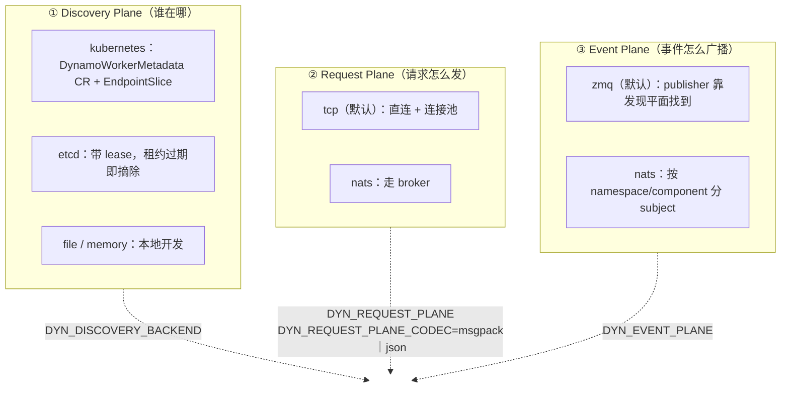

# 00 · NVIDIA Dynamo 总览与架构

> **源码基线**：[`main @ 946acce`](https://github.com/ai-dynamo/dynamo/tree/946accea5edfd778f5120a3096b082e54e5bce2b)（2026-09-07 提交，2026-09-08 拉取核对，workspace 版本 `1.5.0`）。
> 本地路径：`sources/dynamo`（`./scripts/sync-sources.sh dynamo`）
> 上游自带的仓库导览在 [`AGENTS.md`](https://github.com/ai-dynamo/dynamo/blob/main/AGENTS.md)，架构页在 `docs/fern/pages/developer-guide/knowledge-base/concepts/system-architecture/architecture.md`——本篇大量与之交叉验证。

## 0. 一句话定位

**Dynamo 是引擎之上的编排层：它不算 token，只决定「这一堆 GPU 怎么变成一个服务」。**

它的形态是**单仓多组件**：Frontend、Router、Planner、KVBM、Operator 住在同一个仓库里，共享同一套运行时。Rust 写核心（`lib/` 下 23 个目录，Cargo workspace 成员近 30 个，`resolver = "3"` / Edition 2024），Python 做扩展层（PyO3 / maturin 绑定）。1.x 起 **etcd 和 NATS 都不再是必需依赖**。

其中最具决定性的一条：

> **Dynamo 自带 Frontend，它既做 HTTP 又做 tokenize / detokenize——请求和响应都穿过它。**

两个推论后面会反复用到：Frontend 在**数据通路**上，工作量与 token 数成正比，所以它必须用 Rust 写；路由决策发生在 tokenize **之后**，所以 Router 拿得到精确的 token 序列，能做精确的 KV 前缀匹配。

一个容易误解的点：**Frontend 虽然通常以独立进程跑（`python3 -m dynamo.frontend`），但它本质是个库**——`make_engine()` + `run_input(runtime, "http", engine)` 两个调用就能把它嵌进任意进程。01 篇会展开这条装配线。

## 1. 项目边界：`ai-dynamo` 生态有几个仓库

Dynamo 不是一个仓库能装下的。上游 `AGENTS.md` 自己列了 sibling repos：

| 仓库 | 做什么 | 与本系列的关系 |
|------|--------|----------------|
| **`ai-dynamo/dynamo`** | Frontend / Router / Planner / KVBM / Operator | **本系列的分析对象** |
| [`ai-dynamo/nixl`](https://github.com/ai-dynamo/nixl) | 推理数据传输库（RDMA / NVLink 上搬 KV） | P/D 分离的底座，05 篇会讲它的调用面，但不进它的源码 |
| [`ai-dynamo/aiperf`](https://github.com/ai-dynamo/aiperf) | 压测与负载生成 | 部署篇提到 |
| [AISimulate](https://pypi.org/project/aisimulate/) | 离线预测服务行为、搜索部署配置 | **不在本仓库**（外部依赖 crate `aisimulate-core`），DGDR 零配置部署靠它 |
| [`ai-dynamo/modelexpress`](https://github.com/ai-dynamo/modelexpress) | GPU 间流式加载权重，加速冷启动 | 不在本系列 |
| [`ai-dynamo/grove`](https://github.com/ai-dynamo/grove) | K8s 拓扑感知 gang 调度（NVL72） | 属于[调度](../../scheduling/)问题域，不在本系列 |

一句话记：**本仓库管「协调」，NIXL 管「搬 KV 的字节」，Grove 管「Pod 落在哪个机架」。**

## 2. 代码地图

三块：Rust 在 `lib/`，Python 在 `components/src/dynamo/`，K8s 部署在 `deploy/`。

### Rust 侧（`lib/`）

| Crate | 是什么 | 哪篇讲 |
|-------|--------|--------|
| `llm` | **主力 crate**，Frontend、协议、发现、KV 路由集成都在里面——见下面的细分 | 全系列 |
| `runtime` | **DistributedRuntime**：服务发现、请求传输、pipeline、生命周期 | 01 |
| `kv-router` | KV 路由的**算法内核**：radix 索引、打分、调度队列。从 `lib/llm` 抽出成独立 crate（`#5677`），为的是让 GAIE 的 EPP 能只依赖算法、不背整个运行时 | 02 |
| `bindings` | PyO3 扩展，**故意排除在 workspace 之外**，由 maturin 单独构建 | 01 |
| `kvbm-engine` | KVBM 引擎层：offload 流水线、onboarding 编排 | 04 |
| `kvbm-logical` | KVBM 逻辑块层：块身份、序列 hash、放置决策 | 04 |
| `kvbm-physical` | KVBM 物理块层：内存布局、DMA 描述符、传输管理 | 04 |
| `kvbm-{config,consolidator,kernels,common}` | KVBM 其余四个：配置、块合并、CUDA kernel、共用类型 | 04 |
| `memory` | 内存抽象，KVBM 各层共用 | 04 |
| `kv-hashing` | 块 hash 算法，Router 与 KVBM 共用同一套语义 | 02 / 04 |
| `backend-common` | 三个 sidecar 共用的 worker 主循环、注册、指标发布 | 05 |
| `sidecar` | vllm / sglang / trtllm 三个 sidecar 实现 + common | 05 |
| `mocker` | 模拟引擎：不用 GPU 就能跑路由与调度逻辑 | 05 / 06 |
| `router-plugins` | 自定义路由策略的插件 catalog | 02 |
| `tokens` | **token 与块 hash 的底层原语**：`Token`、`BlockHash`、`SequenceHash`、`PositionalLineageHash`（128 位），几乎所有 KV 相关 crate 的根基 | 02 / 04 |
| `truthy` / `data-gen` / `bench` | env 真值解析 / 合成数据生成 / 内部基准（含 KV 索引器分片基准） | — |
| `rl` | 强化学习相关 | — |
| `gpu_memory_service` | **模型权重**的 GPU 内存服务（含 NIXL snapshot），与 KV 分层是两个子系统 | 04（澄清） |

`lib/llm/src` 的内部细分——**这才是真正要读的地方**：

| 目录 | 是什么 | 哪篇讲 |
|------|--------|--------|
| `kv_router/` | 路由的**运行时集成层**：把发现到的 worker 接到 `lib/kv-router` 的算法内核上，外加 publisher / prefill / encoder 编排 | 02 |
| `block_manager/` | KV 块管理，KVBM 的原址（正在往 `lib/kvbm-*` 拆） | 04 |
| `protocols/` | OpenAI 兼容协议与内部消息类型 | 01 |
| `http/` | Frontend 的 HTTP 服务 | 01 |
| `kv_dc_relay/` | 跨数据中心的 KV 中继与索引发布 | 04 |
| `discovery/` | 模型卡（MDC）与实例发现 | 01 |
| `preprocessor/` | chat template、tokenize / detokenize | 01 |
| `request_trace/` | 请求追踪 | 01 |
| `session_affinity/` | 会话亲和 | 02 |
| `entrypoint/` | 四种入口形态的装配 | 01 |
| `lora/` | LoRA 适配器 | — |

### Python 侧（`components/src/dynamo/`）

| 包 | 是什么 | 哪篇讲 |
|----|--------|--------|
| `planner/` | **SLA Planner** 主体：容量模型、扩缩决策、K8s connector | 03 |
| `profiler/` | 离线性能剖析，产出 Planner 要的「batch size → 延迟」曲线 | 03 |
| `global_planner/` | 跨集群 Planner | 03 |
| `vllm/` | vLLM 后端接入：handler、KV connector、P/D 交接 | 05 |
| `sglang/` | SGLang 后端接入 | 05 |
| `trtllm/` | TensorRT-LLM 后端接入 | 05 |
| `frontend/` | `python3 -m dynamo.frontend` 入口 | 01 |
| `router/`、`global_router/` | 独立路由进程的入口 | 02 |
| `common/` | 三个后端共用的配置解析与参数校验 | — |
| `mocker/`、`replay/`、`kv_state_agent/` | 测试与工具 | — |

> **Rust 和 Python 的分工**：Rust 拿数据通路和状态（HTTP、路由内核、KV 块），Python 拿策略与集成（后端胶水、Planner 决策、profiler）。判断一段逻辑该去哪找，就问它「在不在每个 token 的路径上」。

## 3. 架构的第一刀：三个独立的通信平面

这是理解 Dynamo 最重要的一张图。它**把「谁在哪」「请求怎么发」「事件怎么广播」拆成三个平面，各自可以独立换传输**：



三点值得记住：

1. **三个平面互相独立**。可以「TCP 发请求 + ZMQ 传 KV 事件 + K8s 做发现」，一个外部中间件都不装。这是 README 说 "etcd ❌ / NATS ❌ Not required" 的真正含义——不是砍掉了功能，而是把每个平面都做了一个无外部依赖的默认实现。

   顺带纠正一个常见误读：**请求平面的 TCP 不是 gRPC，是自研协议**。`RequestPlaneMode`（`lib/runtime/src/distributed.rs:838`）只有 `Tcp`（默认）和 `Nats` 两个值，帧格式是 `pipeline/network/codec/two_part.rs` 里的 **TwoPartCodec**（control message + payload 两段）。而且回程用的是 **call-home**：client 先在自己这边注册好 response stream，worker 反向拨回来推 token，01 篇细讲。
2. **codec 是端点自描述的**。`DYN_REQUEST_PLANE_CODEC` 选 msgpack 或 json，但目标端点会**广播自己用什么 codec**，所以同一个 client 可以同时和不同 codec 的端点说话——这是滚动升级时不用停机的关键。
3. **KV-aware 路由不强制要事件平面**。`--no-router-kv-events` 时 Router 用预测式维护 KV 状态（02 篇细讲）。也就是说三个平面里，只有发现平面是硬依赖。

### 3.1 配置全景在哪一个文件里

读这类多组件系统，最省时间的入口往往是「所有开关的清单」。Dynamo 把它集中在一处：

```
lib/runtime/src/config/environment_names.rs
```

它不是散落的 `std::env::var("...")`，而是**按子系统分模块的常量表**，用到的地方一律引用常量。所以只要读这一个文件，就能得到整个系统的可配置面：

| 模块 | 覆盖 |
|------|------|
| `logging` / `logging::otlp` | 日志与 OpenTelemetry 导出 |
| `runtime` | 线程数、优雅停机、`DYN_RUNTIME_INHIBITED_DURATION_SECS`（§4 的 worker 抑制） |
| `runtime::system` | `/health`、`/live` 探针与端口 |
| `runtime::canary` | 金丝雀健康检查 |
| `nats` / `etcd` | 两个可选外部件的连接与鉴权（含 TLS） |
| `kvbm` | KV 分层的容量与开关：`DYN_KVBM_CPU_CACHE_GB`、`DYN_KVBM_DISK_CACHE_GB`、`DYN_KVBM_OBJECT_*`（S3/Azure） |
| `event_plane` / `request_plane` | 三平面选型（`DYN_EVENT_PLANE`、`DYN_REQUEST_PLANE`、`DYN_REQUEST_PLANE_CODEC`） |

`DYN_EVENT_PLANE` → 实际传输的**唯一权威映射**在 `lib/runtime/src/distributed.rs:696` 附近（注释里就是这么自称的），默认 ZMQ。

## 4. 四级寻址抽象

`lib/runtime` 提供的 `DistributedRuntime` 把服务组织成四级：

| 层级 | Rust 类型（`lib/runtime/src/component.rs`） | 是什么 | 例子 |
|------|------|--------|------|
| `DistributedRuntime` | `distributed.rs` | 每个进程一个，持有连接、后台任务、取消令牌 | — |
| `Namespace` | `component.rs:468` | 隔离一个逻辑部署或模型组，**可嵌套**（有 `parent`） | `dynamo` |
| `Component` | `component.rs:176` | 一组承担同样角色的 worker | `backend`、`prefill` |
| `Endpoint` | `component.rs:359` | 一个网络服务 | `generate`、`clear_kv_blocks`、`load_metrics` |

客户端解析 `namespace.component.endpoint` 这样的路径，watch 成员变化，然后选一个实例。注意**这里有两套地址**，别混：

```
发现平面的 KV key（discovery/mod.rs:938）           {ns}/{component}/{endpoint}/{instance_id:x}
请求平面的 TCP 地址（component/endpoint.rs:341）    {host}:{port}/{connection_id:x}/{endpoint_name}
```

真正被路由选中的粒度是 **`Instance`**（`component.rs:107`），它比 Endpoint 多带了三样在后面几篇很关键的东西：`transport`（怎么连）、`device_type`（异构机型加权路由要用）、`request_plane_codec`（**端点自己声明用 msgpack 还是 json**——这就是滚动升级期间新旧 codec 能共存的原因）。

一个容易被忽略但很实用的机制：**local worker inhibition**。请求失败后，本地 runtime 会临时「抑制」那个 worker，给发现平面追上来的时间，默认 5 秒（`DYN_RUNTIME_INHIBITED_DURATION_SECS`，默认值 `component/client.rs:22`）。发现平面仍然是权威——它可以在计时器到期前就恢复或彻底移除该 worker。

## 5. 一条请求的九步（官方口径）

上游架构页给出的主路径（以 P/D 分离为例），先建立框架，01 / 02 / 05 篇再逐段进代码：

| 步 | 动作 | 在哪 |
|----|------|------|
| S1 | HTTP client 打到 Frontend（OpenAI 兼容，8000 端口） | `lib/llm/src/http/` |
| S2 | Frontend 预处理：套 chat template、tokenize、校验 | `lib/llm/src/preprocessor/` |
| S3 | **PrefillRouter** 用 KV-aware 路由或负载均衡选一个 prefill worker | `lib/llm/src/kv_router/prefill_router/` |
| S4 | prefill worker 算 prefill，产出 KV cache | 引擎侧 |
| S5 | prefill worker 返回 `disaggregated_params`（后端相关的传输元数据） | |
| S6 | PrefillRouter 把 prefill 结果注入 decode 请求，路由到 decode worker | |
| S7 | decode worker 与 prefill worker 协商，**经 NIXL 直接 GPU→GPU 搬 KV** | NIXL |
| S8 | decode worker 用搬过来的 KV 生成 token | 引擎侧 |
| S9 | token 流经 Frontend 做 detokenize，再吐给 client | `lib/llm/src/http/` |

注意 S7 这一句的分量：**每个 worker 的 KV 都在自己的显存里，没有共享存储瓶颈，传输是 worker 到 worker 直连的**，而且非阻塞——传输期间 GPU 的 forward pass 继续跑。「KV 归 worker 所有、点对点搬运」这个假设贯穿 04、05 两篇。

## 6. 统一示例（贯穿全系列）

沿用本仓库其余几套笔记的 **A/B 共享前缀请求**，角色命名保持一致：

```
Namespace: dynamo
  Frontend        F1                （HTTP :8000 + Router 内嵌）
  Component prefill  P1, P2         （Endpoint: generate）
  Component backend  D1, D2, D3     （decode，Endpoint: generate / clear_kv_blocks / load_metrics）

请求 A: "你是一个资深 Go 工程师。请解释 sync.Map 的适用场景。"
请求 B: "你是一个资深 Go 工程师。请解释 channel 的关闭语义。"
        ↑ A 与 B 共享前 12 个 token 的系统提示前缀
```

每篇负责回答这条链上的一段：

1. A 进来后，从 HTTP handler 到发给 worker，走了哪些函数？tokenize 在哪一步？（01 篇）
2. 为什么选中 D3？overlap 和 load 各占多少权重？（02 篇）
3. B 进来时，Router 凭什么知道 D3 上已有那 12 个 token 的 KV？没有 KV 事件时又怎么办？（02 篇）
4. 这个池子该开几个副本？TTFT / ITL 两个 SLA 怎么变成副本数？（03 篇）
5. D3 显存满了，那 12 个 token 的 KV 被挪到哪去了？（04 篇）
6. 开了 P/D 分离后，A 的 KV 怎么从 P1 搬到 D3？（05 篇）
7. 这一套在 K8s 上是哪些 CRD、reconcile 成什么？（06 篇）

---

> **下一篇** [01 · 请求的一生](01-请求的一生-主控制流.md)
> 与 [llm-d](../llm-d/)、[Mooncake](../../kvcache/mooncake/) 的横向对比集中在 [07 · 横向对比](07-横向对比-与llm-d和Mooncake.md)，本系列 00~06 只讲 Dynamo 自身。
> **回到** [Dynamo 系列首页](README.md) ｜ [推理服务栈](../README.md)
