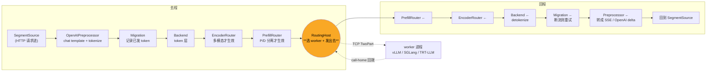

# 01 · 请求的一生：从 HTTP 到 worker 再回来

> **源码基线**：`main @ 946acce`。本篇跟踪 [00 篇统一示例](00-总览与架构.md#6-统一示例贯穿全系列)里的请求 A，从它打到 `:8000` 开始，到第一个 token 吐回客户端为止。
> 主要文件：`lib/llm/src/http/service/`、`lib/llm/src/entrypoint/`、`lib/llm/src/preprocessor.rs`、`lib/runtime/src/pipeline/`

## 0. 本篇要回答的问题

1. `python3 -m dynamo.frontend` 起来之后，进程里到底装了什么？
2. Frontend 怎么知道集群里有哪些模型、哪些 worker？
3. 一条 `/v1/chat/completions` 请求经过哪些环节？tokenize 在哪一步？
4. 「选哪个 worker」这个决策具体接在哪一环上？
5. 请求怎么发过去、token 怎么流回来？

## 1. Frontend 不是一个服务，是一条装配线

### 1.1 四种起法

先破除一个误解：**Frontend 是库，不是必须独立部署的服务**。

| 起法 | 命令 / 调用 | 位置 |
|------|------------|------|
| 独立进程（推荐） | `python3 -m dynamo.frontend` | `components/src/dynamo/frontend/__main__.py:4` → `main.py:502` |
| 嵌进任意进程 | `make_engine(...)` + `run_input(runtime, "http", engine)` | `lib/bindings/python/rust/llm/entrypoint.rs:736`、`lib/llm/src/entrypoint/input.rs:99` |
| 交互式命令行 | `-i` → `run_input(runtime, "text", engine)` | `main.py:483` |
| KServe gRPC | `--kserve-grpc-server` → `run_input(runtime, "grpc", engine)` | `main.py:485` |

四种起法共用同一套装配代码，区别只在最外层的 "input" 是 HTTP、stdin 还是 gRPC（`main.py:482~488` 那个三分支）。这个设计的好处在 06 篇会体现：GAIE 场景下 Frontend 要作为 **sidecar 塞进 decode pod**，靠的就是它能被嵌入。

### 1.2 装配顺序

```
main.py:394   创建 DistributedRuntime（发现平面 + 请求平面都在里面）
     ↓
entrypoint.rs:736   make_engine()  —— 按 EngineConfig 决定引擎类型
     ↓
input.rs:99   run_input(runtime, "http", engine)
     ↓
input/http.rs:73   HttpFrontend::run()
     ↓                      ├── 起 axum HTTP server
     ↓                      └── 起 ModelWatcher（后台任务 run_watcher，:307）
```

注意 Frontend 进程里**没有 vLLM**。它持有的是一个 `DistributedRuntime`，负责「发现 worker」和「把请求发出去」，推理本身在别的进程。

## 2. 模型是被「发现」出来的，不是配置出来的

这是 Dynamo 和很多网关的一个重要区别：**你不在 Frontend 上配置模型列表**。Frontend 起来时可能一个模型都不知道，worker 起来后自己把「模型卡」注册进发现平面，Frontend watch 到之后**动态地为这个模型现场组装一条 pipeline**。

```
worker 侧（components/src/dynamo/vllm/main.py:937 register_vllm_model）
   → register_model() 写入 Model Deployment Card（MDC）
       KV 后端：写进 bucket v1/mdc
       K8s 后端：写进 DynamoWorkerMetadata CR

Frontend 侧
   input/http.rs:336   run_watcher 建 ModelWatcher
   input/http.rs:355   watcher.list_and_watch(...)
   discovery/watcher.rs:411   ModelWatcher::watch()  收到新模型 → 现场建 pipeline
       watcher.rs:464   drt.namespace(ns)?.component(comp)?
       watcher.rs:468   component.endpoint(&mcid.endpoint)
       watcher.rs:470   endpoint.client()
```

**MDC（Model Deployment Card）是这条链上的关键载体**：它带着 tokenizer 配置、模型名、worker 类型（prefill / decode / encode / aggregated）、以及这个 worker 期望的 router 配置。最后一项值得留意——**worker 可以覆盖 Frontend 的 router-mode**（`router_args.py:327` 的 `WorkerRouterConfig`），这就是 05 篇里「prefill 池用 KV 路由、decode 池用 round-robin」那种 per-role 配置的实现方式。

## 3. HTTP 路由表

路由在 `lib/llm/src/http/service/service_v2.rs:1245~1530` 组装，分两组。

**系统路由**（可用 `DYN_HTTP_SVC_*` 改路径）：

| 方法 | 路径 | 定义 |
|------|------|------|
| GET | `/metrics` | `metrics.rs:2359` |
| GET | `/v1/models` | `openai.rs:4154` |
| GET | `/health` / `/live` | `health.rs:18` / `:33` |
| GET | `/openapi.json` | `openapi_docs.rs:396` |
| POST/GET | `/busy_threshold` | `busy_threshold.rs:133`（admin，可禁用） |

**推理路由**（`get_endpoints_router`，`service_v2.rs:1433`）—— 按模型声明的 `EndpointType` 动态挂载，不是全都开：

| EndpointType | 路径 | 定义 |
|---|---|---|
| Chat | POST `/v1/chat/completions` | `openai.rs:4004` |
| Completion | POST `/v1/completions` | `openai.rs:3990` |
| Embedding / Classify / Pooling | `/v1/embeddings`、`/v1/classify`、`/v1/pooling` | `openai.rs:4021` / `4035` / `4065` |
| Images / Videos / Audios | `/v1/images/generations`、`/v1/videos`、`/v1/audio/speech` | `openai.rs:4434` / `4729` / `5108` |
| Realtime | GET `/v1/realtime`（WebSocket） | `realtime.rs:73` |
| Responses | POST `/v1/responses` | `openai.rs:4280` |
| Anthropic | POST `/v1/messages` | `anthropic.rs:85`（需 `--enable-anthropic-api`） |

另有两个**实验性的引擎原生透传口**，需要环境变量开启：vLLM 的 `/inference/v1/generate`（`generate.rs:96`）和 SGLang 的 `/generate`（`sglang_generate.rs:45`）。它们绕过 OpenAI 协议层，直接说引擎的方言。

> Frontend 还支持第三方扩展路由，走 Python entry point group `dynamo.frontend.routes`（`main.py:53`）。

## 4. 核心：一条双向回环的 pipeline

这是本篇最该记住的一段代码。Dynamo 不是「handler 里一路调下去」，而是**把请求处理组装成一条有去有回的算子链**：

```510:531:lib/llm/src/entrypoint/input/common.rs
        let frontend = SegmentSource::<SingleIn<Req>, ManyOut<Annotated<Resp>>>::new();
        let preprocessor_op = preprocessor.into_operator();
        let token_backend = Backend::from_tokenizer(tokenizer).into_operator();
        let migration = Migration::from_mdc(card, migration_limit, migration_max_seq_len, metrics)
            .into_operator_for::<BackendOutput>();
        let prefill_op = self.prefill_router.into_operator();
        let encoder_op = self.encoder_router.into_operator();
        let backend = ServiceBackend::from_engine(self.backend_engine.clone());

        let engine = frontend
            .link(preprocessor_op.forward_edge())?
            .link(migration.forward_edge())?
            .link(token_backend.forward_edge())?
            .link(encoder_op.forward_edge())?
            .link(prefill_op.forward_edge())?
            .link(backend)?
            .link(prefill_op.backward_edge())?
            .link(encoder_op.backward_edge())?
            .link(token_backend.backward_edge())?
            .link(migration.backward_edge())?
            .link(preprocessor_op.backward_edge())?
            .link_terminal(frontend)?;
```

**【逻辑】** 每个 `Operator` 有两条边：`forward_edge()` 处理去程的请求，`backward_edge()` 处理回程的响应流。`link()` 把它们串成一条链，`link_terminal(frontend)` 把回程接回起点闭环。中间的 `ServiceBackend::from_engine(self.backend_engine)` 是链的折返点——**去程到这里出网，回程从这里回来**。

**【Rust】** `into_operator()` 把一个类型转成 pipeline 算子；`?` 在每个 `link` 后传播类型不匹配的错误——**这条链是编译期类型检查的**，接错顺序编译不过。

画出来是这样：



四个算子在**没启用对应特性时是 pass-through**（`EncoderRouter::disabled()` 见 `common.rs:312`、`PrefillRouter::disabled_with_selector()` 见 `common.rs:305`），所以聚合部署下这条链实际只有 preprocessor、migration、backend 三段有活干。

### 4.1 Preprocessor 做了什么

`lib/llm/src/preprocessor.rs:6906~7059`：

- 套 chat template、tokenize（`preprocess_request_with_options`）
- 处理 `tool_choice`、structural tag、guided decoding
- 捕获 request trace payload
- **强制把内部流程改成 `stream=true`**——即使客户端要的是非流式响应，内部也按流走，最后由 HTTP handler 把流 fold 成一个完整响应

最后一条是个值得记住的设计：**只有一条代码路径**，非流式只是流式的一个特例。少了一半的边界情况。

### 4.2 Migration 算子：容错藏在链里

`lib/llm/src/migration.rs` 把「请求迁移」做成了链上的一个普通算子，而不是外挂的重试逻辑。它包住下游，记录已经吐出去的 token；下游流断了就重建 stream 并 replay。

可迁移的错误类型（`migration.rs:67`）：`Disconnect`、`ResponseTimeout`、`EngineShutdown`、`StreamIncomplete`、`WorkerOverloaded`。

不可迁移的情况（`migration.rs:327`）：**guided decoding** 和 **n > 1**。前者因为约束解码的状态机没法在新 worker 上重建，后者因为多路采样的中间态无法迁移。另外显式 pin 了 worker、或处在 disagg 的特定阶段时也不迁移（`migration.rs:93`）。

## 5. 路由决策在最后一环

`backend_engine` 到底是什么？`common.rs:313~328` 给了答案：

```313:328:lib/llm/src/entrypoint/input/common.rs
    let routing_host = preprocessed_backend_engine(
        router,
        router_mode,
        chooser,
        &model_manager,
        &endpoint_id,
        affinity,
        session_affinity_mode,
        load_context,
    )?;
    if router_mode.is_kv_routing() && prefill_router.conditional_disagg_enabled() {
        prefill_router
            .set_decode_routing_host(routing_host.clone())
            .context("install conditional-disagg decode RoutingHost")?;
    }
    let backend_engine: ServiceEngine<_, _> = routing_host;
```

**`backend_engine` 就是 `RoutingHost`。** 所以「选哪个 worker」发生在 pipeline 的折返点上——**在 tokenize 之后**。这一点很关键：Router 拿到的是 token id 序列，不是原始字符串，所以它才能算前缀 hash、才能做 KV 命中估算（02 篇）。


注意上面第 11 行那个 `if`：conditional disagg 开启时，PrefillRouter 需要**提前预览 decode 侧的路由结果**才能决定要不要走分离，所以这里把 decode 的 RoutingHost 反向注入给了 PrefillRouter。05 篇细讲。

### 5.1 七种 router-mode

```190:202:lib/runtime/src/pipeline/network/egress/push_router.rs
#[derive(Default, Debug, Clone, Copy, PartialEq, Serialize, Deserialize)]
#[serde(rename_all = "snake_case")]
pub enum RouterMode {
    #[default]
    RoundRobin,
    Random,
    PowerOfTwoChoices,
    KV,
    Direct,
    LeastLoaded,
    /// Device-aware weighted routing for heterogeneous workers.
    DeviceAwareWeighted,
}
```

| 模式 | 行为 |
|------|------|
| `round-robin`（默认）/ `random` | 无状态轮询 / 随机 |
| `power-of-two-choices` | 随机取两个，选 occupancy 低的 |
| `least-loaded` | 最低负载 + occupancy 预订 |
| `device-aware-weighted` | 异构机型加权（用 `Instance.device_type`），可配 multimodal embedding cache 索引 |
| `kv` | **KV-aware**，02 篇主题 |
| `direct` | **不自己选**，由调用方指定目标实例 |

前五种走 `PushRouter::generate`。后两种不走——`push_router.rs:2032` 直接 `bail!("KV routing should not call generate on PushRouter")`，因为 KV 和 Direct 的选择逻辑在 `RoutingHost` 里。

`direct` 是给 GAIE 用的：Gateway 侧的 EPP 已经选好了 pod，Frontend 只需要老实转发。06 篇会讲这条旁路。

## 6. 请求怎么发出去：TCP + TwoPart + call-home

```838:843:lib/runtime/src/distributed.rs
pub enum RequestPlaneMode {
    /// Use NATS for request plane
    Nats,
    /// Use raw TCP for request plane with msgpack support
    #[default]
    Tcp,
}
```

默认 **raw TCP**，不是 gRPC。相关文件：

| 文件 | 职责 |
|------|------|
| `pipeline/network/manager.rs` | `NetworkManager`，统一 TCP / NATS ingress |
| `pipeline/network/codec/two_part.rs` | **TwoPartCodec** 帧格式（control message + payload） |
| `pipeline/network/tcp/{server,client}.rs` | 监听 / 连接 |
| `pipeline/network/egress/addressed_router.rs` | 发到指定地址 + 等 response stream |
| `pipeline/network/egress/push_router.rs` | 选 worker，再交给上面那个 |
| `pipeline/network/ingress/push_handler.rs` | worker 侧收到请求后执行 handler |

**发送与回传的流程**（`addressed_router.rs:597~716` `dispatch_and_finalize`）：

1. Router 侧**先在自己的 TCP response server 上注册** recv/send stream —— 这就是 **call-home**：不是「发出去等返回值」，而是「留个回电号码」。
2. `build_request_envelope` 打包 control message + payload，codec 按目标端点声明的选 JSON 或 msgpack。
3. `dispatch_buffer(address, buffer, ...)` 把请求帧发到 worker 的 TCP 地址。
4. worker **回拨** response stream，逐帧反序列化成 `ManyOut<U>` 返回。

为什么用 call-home 而不是在同一条连接上回？**因为响应是长流**。一条请求可能吐几千个 token、持续几十秒，把它和请求复用同一条连接会让连接池的生命周期管理变得很难。分开之后，请求连接是短的、可池化的，响应连接和请求的生命周期绑定。

worker 侧的对称动作在 `lib/runtime/src/component/endpoint.rs:128~216`：

```128:140:lib/runtime/src/component/endpoint.rs
pub async fn start_with_registration(self) -> Result<StartedEndpoint> {
    // ...
    let server = endpoint.drt().request_plane_server().await?;
    let transport = build_transport_type(&endpoint, &endpoint_id, connection_id).await?;
    server.register_endpoint(..., handler, connection_id, ...).await?;
    // discovery.register(DiscoverySpec::Endpoint { transport, ... })
}
```

**【逻辑】** 注意最后一步的顺序：**先在请求平面注册好 handler，再向发现平面注册自己**。反过来会有一个窗口期——别人已经发现你了，但你还不能处理请求。

## 7. 完整调用链速查

```
[HTTP 层]
  POST /v1/chat/completions
  openai.rs:1984  handler_chat_completions
    → openai.rs:2787  chat_completions
    → openai.rs:2871  get_chat_completions_engine_with_parsing   ← 按模型名取 pipeline
    → openai.rs:2916  engine.generate(request)

[Pipeline 去程]
  preprocessor.rs:6906   OpenAIPreprocessor::generate      chat template + tokenize
  migration.rs:134       Migration                          记录 token，供断流重试
  backend.rs             Backend                            token 层
  encoder_router.rs:57   EncoderRouter                      多模态才生效
  prefill_router/mod.rs:284  PrefillRouter::generate        P/D 分离才生效
  routing_host.rs        RoutingHost                        ★ 选 worker

[出网]
  push_router.rs:1710    generate_with_fault_detection_prepared_inner
  addressed_router.rs:597  dispatch_and_finalize
  addressed_router.rs:665  dispatch_buffer                  → TCP TwoPart 帧

[worker 侧]
  push_handler.rs        执行 handler
  worker_factory.py:1442 serve_endpoint 注册的 Python generate handler
  → vLLM AsyncLLM

[Pipeline 回程]
  worker TCP response stream → ManyOut<Annotated<LLMEngineOutput>>
  backend.rs:196         Backend 反向边                     detokenize
  preprocessor.rs:7037   transform_postprocessor_stream     转 OpenAI delta
  openai.rs:2950         SSE 输出
```

## 8. 必记要点

1. **Frontend 是库不是服务**，四种起法（HTTP / 嵌入 / text / gRPC）共用一套装配代码；GAIE sidecar 形态靠的就是这一点。
2. **模型是被发现的**。Frontend 启动时不知道有什么模型，worker 注册 MDC 之后 ModelWatcher 现场为它组装 pipeline。
3. **pipeline 是双向回环的算子链，编译期类型检查**。折返点是 `ServiceBackend`，也就是 `RoutingHost`。
4. **路由决策在 tokenize 之后**——这是 Dynamo 能做精确 KV 前缀匹配的前提，也是「Frontend 在数据通路上」换来的红利。
5. **非流式是流式的特例**，preprocessor 强制内部 `stream=true`，只有一条代码路径。
6. **请求平面是自研 TCP + TwoPart 帧，回程走 call-home 反向拨回**，不是 gRPC，不是同连接返回。
7. **worker 先注册 handler 再注册发现**，顺序反了会有不可服务窗口。
8. **容错是链上的一个算子**（Migration），不是外挂重试；guided decoding 和 n>1 不可迁移。

---

> **上一篇** [00 · 总览与架构](00-总览与架构.md) ｜ **下一篇** [02 · KV-aware Router](02-核心代码分析-KV感知路由.md)
