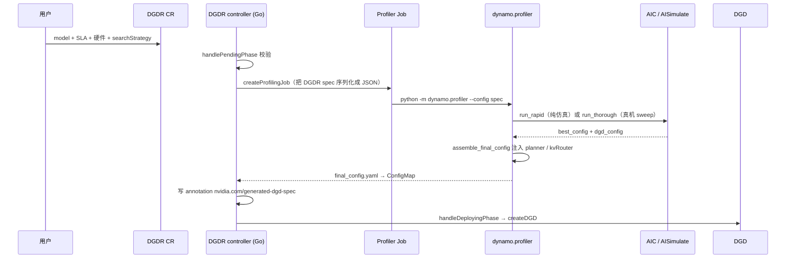

# 03 · SLA Planner：TTFT 和 ITL 怎么变成副本数

> **源码基线**：`main @ 946acce`。本篇回答一个问题：TTFT 和 ITL 这两个 SLA 数字，怎么一路变成「该开几个副本」。
> 主要文件：`components/src/dynamo/planner/`（Planner 主体）、`components/src/dynamo/profiler/`（性能曲线）、`components/src/dynamo/global_planner/`（跨集群）

## 0. 一句话概括

> **Planner 是正推的：先算「一个副本在 SLA 内能扛多少 rps」，再拿需求除以它。**

拆成两步：

| 步骤 | 做什么 | 在哪 |
|------|--------|------|
| ① 求单副本容量 | 在 batch size 上搜索，挑出满足 TTFT / ITL 且 rps 最大的那个配置 | §2 |
| ② 求副本数 | `ceil(需求 rps ÷ 单副本 rps)` | §2.3 |

这条路线成立的前提，是 Dynamo 手上有一条 **「batch size → 延迟」的性能曲线**。有了它，TTFT / ITL 才能**直接**当作搜索的约束条件，而不必先被翻译成某个经验阈值。代价也在这里：曲线得先搞到手（三种来源见 §3），换了硬件或并行配置就作废。拿不到可信曲线时，还有阈值驱动的 easy mode 兜底（§4.1）。

## 1. 运行形态与三层节拍

Planner 是 **DGD 里的一个普通 Python 组件**（不是 sidecar，也不是 K8s controller），入口 `python3 -m dynamo.planner`：

```33:52:components/src/dynamo/planner/__main__.py
async def start_planner(runtime: DistributedRuntime, config: PlannerConfig):
    planner = construct_planner(runtime=runtime, config=config)
    await planner._async_init()
    ...
    await asyncio.gather(
        generate_endpoint.serve_endpoint(...),
        planner.run(),
    )
```

**【逻辑】** 注意 `asyncio.gather` 里有两件事：它既跑扩缩容主循环，**也注册了一个 Dynamo endpoint**。所以 Planner 自己也是发现平面里的一个成员，可以被别人调用（Global Planner 就是这么和它对话的）。

主循环 `NativePlannerBase.run()`：

```1026:1038:components/src/dynamo/planner/core/base.py
    async def run(self) -> None:
        engine = self._ensure_engine()
        next_tick = engine.initial_tick(time.time())
        poll_interval = self.config.load_adjustment_interval_seconds / 10
        ...
        while True:
            now = time.time()
            if now < next_tick.at_s:
                await asyncio.sleep(min(next_tick.at_s - now, poll_interval))
                continue
```

**三层节拍**（这是理解 Planner 行为的关键）：

| 参数 | 默认 | 作用 |
|---|---|---|
| `scheduling.scale_interval_seconds` | **5s** | orchestrator 管道基础 tick |
| `load_adjustment_interval_seconds` | **5s** | 负载环：实时细调 + 在线 FPM 调参 |
| `throughput_adjustment_interval_seconds` | **180s** | 吞吐环：流量预测 + 容量下界 |

**两个环同时跑，快环细调、慢环托底**。§4 讲它们怎么合并。

## 2. 容量搜索：SLA 是约束，不是阈值

这是 Planner 最有意思的一段。要算「一个 prefill 副本每秒能处理几个请求」，它不是查表，而是**在 batch size 上做一次搜索**。

### 2.1 Prefill 侧（TTFT 约束）

```376:398:components/src/dynamo/planner/core/perf_model/engine_query.py
    def _find_prefill_capacity(
        self, request: EngineCapacityRequest
    ) -> Optional[EngineCapacity]:
        prefill_isl = _effective_prefill_isl(request)
        max_batch = self._prefill_max_batch(prefill_isl)
        if max_batch == 0:
            return None

        best: Optional[EngineCapacity] = None
        for batch_size in _capacity_batch_sizes(max_batch):
            ttft_s = self._prefill_time_for_tokens(
                _saturating_mul_u32(prefill_isl, batch_size)
            )
            if ttft_s is None:
                return None
            if ttft_s == 0:
                continue
            capacity = EngineCapacity(
                rps=batch_size / ttft_s,
                ttft_s=ttft_s,
                e2e_latency_s=ttft_s,
                eligible=(
                    _sla_ok(ttft_s, request.ttft_sla_s)
                    and _sla_ok(None, request.itl_sla_s)
                    and _sla_ok(ttft_s, request.e2e_latency_sla_s)
                ),
            )
            best = _select_capacity(best, capacity, request.optimization_target)
        return best
```

**【逻辑】** 逐个试 batch size：
- batch 越大，吞吐 `rps = batch / ttft` 越高
- batch 越大，`ttft` 也越长，迟早撞破 SLA

`eligible` 标记这个 batch 是否满足 SLA（`_sla_ok` 就是 `value ≤ sla`，`engine_query.py:814`），`_select_capacity` 按 `optimization_target` 挑选：默认 `THROUGHPUT` 取 rps 最大，`latency` 模式取延迟最小。

**注意 `_effective_prefill_isl`**：算的是**有效**输入长度，KV 命中的部分已经扣掉了。所以 Planner 的容量估计是**吃 Router 缓存命中红利的**——命中率上去了，同样的 SLA 下单副本能扛更多请求，需要的副本数就少。这是 Router 和 Planner 之间一个不太显眼但很实在的耦合。

### 2.2 Decode 侧（ITL 约束）

```406:428:components/src/dynamo/planner/core/perf_model/engine_query.py
        for batch_size in _capacity_batch_sizes(max_batch):
            forward_s = self._decode_time_for_batch(batch_size, context_length)
            if forward_s is None:
                return None
            itl_s = forward_s / accept_length
            if itl_s == 0:
                continue
            capacity = EngineCapacity(
                rps=batch_size / (request.osl * itl_s),
                itl_s=itl_s,
                eligible=(
                    _sla_ok(None, request.ttft_sla_s)
                    and _sla_ok(itl_s, request.itl_sla_s)
                    and _sla_ok(None, request.e2e_latency_sla_s)
                ),
            )
```

两个细节：

- **`itl_s = forward_s / accept_length`**：`accept_length` 是**投机解码的平均接受长度**。一次 forward 吐出 N 个被接受的 token，那么每 token 间隔就是 `forward / N`。**投机解码直接进入了容量模型**。冷启动默认 1.0（`state_machine.py:112`）。
- **`rps = batch / (osl · itl)`**：一个请求要吐 `osl` 个 token，占用 `osl · itl` 秒，所以 batch 个并发请求的吞吐是这个式子。

### 2.3 最后一步除法

```286:295:components/src/dynamo/planner/core/throughput_scaling.py
        result = max(
            math.ceil(demand_rps / engine_rps),
            resolve_min_endpoint(self._config, "prefill"),
        )
```

`demand_rps = predicted_num_req / traffic.duration_s`（`state_machine.py:266`）。decode 侧对称（`throughput_scaling.py:317`）。

**注意 SLA 破了不会拒绝服务**：`throughput_scaling.py:280` 那段只是 `logger.warning`，照样用这个容量算副本数。也就是说**当 SLA 在任何 batch size 下都达不成时，Planner 会尽力而为而不是罢工**——这是对的行为，但监控上要盯住这条 warning。

## 3. 性能曲线从哪来：三条路

`engine_rps` 全靠性能模型。模型的来源有一条优先级链（`monitoring/perf_metrics.py:6`）：

```39:53:components/src/dynamo/planner/monitoring/perf_metrics.py
async def fetch_pre_deployment_metrics(...):
    """...
    1. Call ``get_perf_metrics`` Dynamo endpoint
    2. Run AIConfigurator interpolation in-process (rapid mode)
    3. Convert ``profile_results_dir`` NPZ / JSON (thorough mode)
    """
```

| 来源 | 怎么得到 | 成本 | 精度 |
|---|---|---|---|
| **worker 自报** | worker 的 `get_perf_metrics` endpoint（01 篇里 `worker_factory.py:1442` 注册的那个） | 零 | 取决于 worker 自己的 benchmark |
| **AIC 插值（rapid）** | AISimulate / aiconfigurator 的解析性能模型在进程内算 | **零 GPU** | 仿真 |
| **离线 profile（thorough）** | `profiler/thorough.py` 在**真 GPU** 上 sweep ISL/OSL，产出 NPZ 曲线 | 高（要占集群） | 最准 |

底层估计器是 AISimulate 发布的 `aiconfigurator_core.sdk.RustForwardPassPerfModel`（`engine_query.py:22`）——**它不在本仓库里**，是外部依赖。

> 这里有个容易踩的坑：`profile_results_dir` 里的 NPZ 是**特定模型 + 特定硬件 + 特定并行配置**下测出来的。换 GPU 型号、改 TP/PP、换量化精度，曲线就作废了，Planner 会拿着过期曲线一本正经地算错。

在线运行时，Planner 还会用 **FPM（Forward Pass Metrics）** 做在线回归修正——那是 01 篇提到的 `lib/llm/src/fpm_publisher.rs` 从引擎 ZMQ 转发过来的实时前向耗时。

## 4. 四种模式与双环合并

### 4.1 `optimization_target`

`planner_config.py:396`：

| 模式 | 判据 |
|---|---|
| **`sla`** | AIC 性能模型 + TTFT/ITL 目标（本篇主线） |
| `throughput` | 静态阈值（easy mode）：prefill 看 `queued_prefill_tokens/context_length`，decode 看 KV 利用率 |
| `latency` | 同上，阈值更保守 |
| `load` | 用户自定义：`prefill_scale_up/down_queue_tokens`、`decode_scale_up/down_kv_rate` |

后三种统称 easy mode（`state_machine.py:75` 判据就是 `optimization_target != "sla"`）。它们都是**阈值驱动**的，不需要性能曲线——想快速上手、或者拿不到可信 profile 时用这一档。

### 4.2 两个环怎么合并

```
慢环（180s）throughput scaling：预测流量 → 容量搜索 → 得到副本数的【下界】
快环（5s）  load scaling：      FPM 实时信号 → 目标副本数或 ±1
                                 ↓
                最终 = max(load 决策, throughput 下界)
```

`load_scaling.py:96` 那句 `max(desired, throughput_lower_bound_*)` 就是托底逻辑。

**为什么要两个环**：慢环基于流量预测，反应慢但看得远，防的是「流量已经涨上来了但还没体现在瞬时指标上」；快环基于实时 FPM，反应快但容易被抖动带偏。用慢环给下界、快环做细调，快环就只能往上调不能把副本数压到慢环认为的安全线以下。

冷启动保护：
- `load_min_observations = 5`（`defaults.py:102`）——观测不够时 load 环返回 `insufficient_data`（`load_scaling.py:422`）
- 性能模型没就绪时慢环返回 `model_not_ready`（`throughput_scaling.py:275`）

## 5. P/D 联合扩缩：防止单侧超扩

P/D 分离下 prefill 和 decode 是两个池，各自算完就直接执行会出事——比如 prefill 扩了 8 个但 GPU 预算已经不够 decode 扩了，结果两边都不达标。

Planner 的做法（`throughput_scaling.py:113~178`）：

1. **两侧都得算成功**。任一侧 `model_not_ready`，**整个 tick 放弃**（`throughput_scaling.py:127`）——宁可不动，不做半边决策。
2. 各自 cap 单次变化幅度（`:136`）。
3. `_fit_disagg_throughput_ceiling()` + `_apply_disagg_scaling_budget()` 做 GPU 预算的**联合 clamp**（`state_machine.py:466~617`），数学在 `core/budget.py` 的 `proportional_clamp_pair` —— 预算不够时**按比例缩**两边，而不是先到先得。
4. 最后**一次性**产出 `ScalingDecision(num_prefill=…, num_decode=…)`。

快环同样走一遍这套 clamp（`load_scaling.py:127~276`），最后也只发一个合并的决策。


## 6. 决策怎么落到 K8s

```
ScalingDecision
  → base.py  _apply_scaling_targets()
  → connectors/kubernetes.py:910  KubernetesConnector.set_component_replicas()
  → connectors/clients/kubernetes_api.py:119  update_service_replicas()
        ├── 优先：patch DynamoGraphDeploymentScalingAdapter 的 Scale 子资源
        │        （CR 名 = <dgd>-<component 小写>）
        └── 404 兜底：直接 JSON-patch DGD.spec.components[].replicas
```

**优先走 Scale 子资源**这个设计值得注意：`DynamoGraphDeploymentScalingAdapter`（DGDSA）是个专门为扩缩容准备的 CRD，实现了 K8s 标准的 `scale` 子资源接口。这意味着 **HPA / KEDA 也能操作同一个对象**——Planner 和标准 K8s 自动扩缩容器走的是同一个入口，不会打架。

启用了 ScalingAdapter 的 component，operator 的 webhook 会**禁止用户直接改 replicas**（`shared_v1beta1.go:670`），把所有权收归到 Scale 接口上。


## 7. Local Planner vs Global Planner

| | `dynamo.planner` | `dynamo.global_planner` |
|---|---|---|
| 职责 | **决策**：算目标副本数 | **执行 + 仲裁**：收 ScaleRequest，做 GPU 预算裁决，patch K8s |
| 数量 | 每个 DGD / 池一个 | 集群级一个（可 `--managed-namespaces`） |
| 场景 | 单 DGD 自治 | 多 DGD 共享 GPU 预算 |

配置 `environment: "global-planner"` 时（`planner_config.py:630`），local planner 不再直接 patch K8s，而是把 `ScaleRequest` 发到 `<global_ns>.GlobalPlanner.scale_request` 这个 endpoint——**又一次用到了「Planner 自己也是发现平面成员」这件事**（§1）。

Global Planner 的跨池仲裁有个巧妙之处：在 `min_total_gpus` / `max_total_gpus` 约束下，它会把**一个池的缩容与另一个池待执行的扩容配对**，让 GPU 直接转手，避免中间态越界。

## 8. DGDR：零配置部署的完整链路

「给个模型名和 SLA，剩下的你搞定」——这是 1.0 的招牌特性。完整链路跨了 operator（Go）和 profiler（Python）：



关键位置：

| 环节 | 位置 |
|---|---|
| 状态机 `Pending → Profiling → Deploying → Ready` | `deploy/operator/internal/controller/dynamographdeploymentrequest_controller.go:495` |
| 建 profiling job | 同上 `:517` `handlePendingPhase` |
| 生成 DGD | 同上 `:803`、`:961`（读 annotation `nvidia.com/generated-dgd-spec`） |
| profiler 入口 | `components/src/dynamo/profiler/__main__.py` → `profile_sla.run_profile` |
| 策略分发 | `profile_sla.py:161`：`RAPID` → `rapid.run_rapid`（**零 GPU**）；否则 `thorough.run_thorough`（真机） |
| DGD 组装 | `profiler/utils/dgd_generation.py::assemble_final_config()` |

`rapid.py:390` 里还有三条分支值得知道：AIC 不支持这个模型时 `_run_naive_fallback`；`picking_mode == "autoscale"` 时走 Pareto 前沿 + 交给 Planner 运行时扩缩；否则 `build_default_tasks` + `_execute_tasks` 跑仿真任务集。

> **一个反直觉的实现细节**：v1beta1 controller 里的 `isOnlineProfiling()` **恒返回 true**（controller `:1249`）。真正决定「仿真还是真机」的是 **profiler 内部**按 `searchStrategy` 分发，不是 operator 分支。看 operator 代码时别被这个函数名误导。

## 9. 缩容到零

- `min_endpoint = 0` 时允许缩到零（`planner_config.py:444`）。
- 但**没有专门的预热控制器**。scale-from-zero 依赖 K8s 正常拉起 worker，然后 Planner 等 FPM 攒够 `load_min_observations = 5` 次观测才敢用负载环决策。
- README 宣传的「100ms 冷启动唤醒」不在 Planner 里——那是 [ModelExpress](https://github.com/ai-dynamo/modelexpress) 的权重流式加载，独立仓库。

所以缩容到零在 Dynamo 这边更像「允许你配 0」，而不是一条打磨过的一等公民路径——唤醒得靠别的组件。

## 10. 必记要点

1. **方法论是正推**：从单副本容量推副本数，前提是先有性能曲线。
2. **SLA 是容量搜索的约束**：在 batch size 上搜索，`rps = batch/ttft`（prefill）或 `batch/(osl·itl)`（decode），挑满足 SLA 且 rps 最大的。
3. **有效 ISL 已扣除 KV 命中**——Router 的缓存命中率会直接减少 Planner 要开的副本数。
4. **投机解码进了公式**：`itl = forward / accept_length`。
5. **SLA 达不成只 warning，不罢工**——监控要盯这条日志。
6. **性能曲线三种来源**（worker 自报 / AIC 仿真 / 真机 profile），换硬件或并行配置后旧曲线作废。
7. **双环**：慢环 180s 给下界，快环 5s 细调，取 max。
8. **P/D 联合扩缩靠 GPU 预算的比例 clamp**，任一侧算不出来就整 tick 放弃。
9. **落地优先走 DGDSA 的 Scale 子资源**，与 HPA/KEDA 共用入口，避免抢 replicas 字段。
10. **DGDR 的「仿真 vs 真机」由 profiler 内部按 `searchStrategy` 决定**，不是 operator 分支（`isOnlineProfiling()` 恒 true 是个陷阱）。
11. **easy mode（`throughput`/`latency`/`load`）是阈值方案**，不需要 profile，适合起步。

---

> **上一篇** [02 · KV-aware Router](02-核心代码分析-KV感知路由.md) ｜ **下一篇** [04 · KVBM](04-核心代码分析-KVBM分层KV管理.md)
> **横向对比**见 [07 · 与 llm-d / Mooncake 的横向对比](07-横向对比-与llm-d和Mooncake.md)
