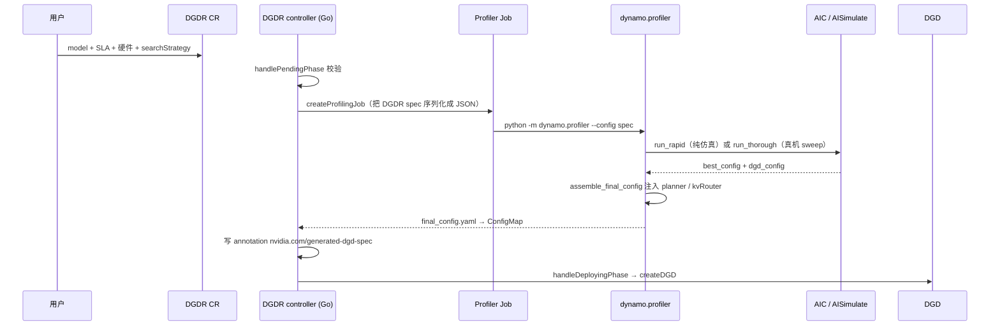

# 03 · SLA Planner：TTFT 和 ITL 怎么变成副本数

> **源码基线**：`main @ 946acce`。本篇回答一个问题：TTFT 和 ITL 这两个 SLA 数字，怎么一路变成「该开几个副本」，以及这个副本数怎么一路落到 Pod 上。
> 主要文件：`components/src/dynamo/planner/`（Planner 主体）、`components/src/dynamo/profiler/`（性能曲线）、`components/src/dynamo/global_planner/`（跨集群）、`deploy/operator/internal/controller/`（K8s 落地）

**Planner 包的目录结构**（下文提到文件名时按这张表定位，别在包根目录找）：

| 子目录 | 内容 |
|---|---|
| `config/` | `planner_config.py`（pydantic 配置模型）、`defaults.py`（`SLAPlannerDefaults` 默认值） |
| `core/` | `base.py`（主循环）、`state_machine.py`（决策状态机）、`throughput_scaling.py`（吞吐环）、`load_scaling.py`（负载环）、`budget.py`（GPU 预算 clamp）、`perf_model/`（性能模型） |
| `connectors/` | `kubernetes.py`、`global_planner.py`、`virtual.py` + `clients/kubernetes_api.py` |
| `monitoring/` | `perf_metrics.py`、`traffic_metrics.py`、`planner_metrics.py` |
| `plugins/` | orchestrator 管道与外部 planner 插件（gRPC + protobuf） |

## 0. 一句话概括

> **Planner 是正推的：先算「一个副本在 SLA 内能扛多少 rps」，再拿需求除以它。**

拆成两步：

| 步骤 | 做什么 | 在哪 |
|------|--------|------|
| ① 求单副本容量 | 在 batch size 上搜索，挑出满足 TTFT / ITL 且 rps 最大的那个配置 | §2 |
| ② 求副本数 | `ceil(需求 rps ÷ 单副本 rps)` | §2.3 |

这条路线成立的前提，是 Dynamo 手上有一条 **「batch size → 延迟」的性能曲线**。有了它，TTFT / ITL 才能**直接**当作搜索的约束条件，而不必先被翻译成某个经验阈值。代价也在这里：曲线得先搞到手（三种来源见 §3），换了硬件或并行配置就作废。拿不到可信曲线时，还有阈值驱动的 easy mode 兜底（§4.1）。

> ⚠️ **先记住两个默认值，否则会误以为「装上 Planner 就有 SLA 扩缩容」**：
> - `optimization_target` 默认是 **`throughput`**（`config/planner_config.py:396`），也就是 **easy mode 静态阈值**；本篇主线的 SLA 容量搜索要显式配 `optimization_target: sla` 才会启用（`core/state_machine.py:75` 的 `_is_easy` 一旦为真，连性能模型都不会构造，见 `:78`）。
> - `enable_throughput_scaling = True`、**`enable_load_scaling = False`**（`config/defaults.py:90~91`）——**默认只跑慢环**，§4.2 那套双环要显式打开负载环。

## 1. 运行形态与三层节拍

Planner 是 **DGD 里的一个普通 Python 组件**（不是 sidecar，也不是 K8s controller），入口 `python3 -m dynamo.planner`：

```33:52:components/src/dynamo/planner/__main__.py
async def start_planner(runtime: DistributedRuntime, config: PlannerConfig):
    planner = construct_planner(runtime=runtime, config=config)
    await planner._async_init()
    ...
    await asyncio.gather(
        generate_endpoint.serve_endpoint(...),
        planner.run(),
    )
```

**【逻辑】** 注意 `asyncio.gather` 里有两件事：它既跑扩缩容主循环，**也注册了一个 Dynamo endpoint**。所以 Planner 自己也是发现平面里的一个成员，可以被别人调用（Global Planner 就是这么和它对话的）。

主循环 `NativePlannerBase.run()`：

```1026:1038:components/src/dynamo/planner/core/base.py
    async def run(self) -> None:
        engine = self._ensure_engine()
        next_tick = engine.initial_tick(time.time())
        poll_interval = self.config.load_adjustment_interval_seconds / 10
        ...
        while True:
            now = time.time()
            if now < next_tick.at_s:
                await asyncio.sleep(min(next_tick.at_s - now, poll_interval))
                continue
```

**三层节拍**（这是理解 Planner 行为的关键）：

| 参数 | 默认 | 定义处 | 作用 |
|---|---|---|---|
| `scheduling.scale_interval_seconds` | **5.0s** | `config/planner_config.py:354` | orchestrator 管道基础 tick |
| `load_adjustment_interval_seconds` | **5s** | `config/defaults.py:94` | 负载环：实时细调 + 在线 FPM 调参 |
| `throughput_adjustment_interval_seconds` | **180s** | `config/defaults.py:29` | 吞吐环：流量预测 + 容量下界 |

`scale_interval_seconds` 不用手配——`planner_config.py:800` 那个 `model_validator` 会把它自动取成两个环间隔的 **gcd**（负载环关时就只取负载间隔），保证「基础 tick 能整除每个插件的执行间隔」。

**两个环可以同时跑，快环细调、慢环托底**（但注意 §0 的默认值：负载环默认是关的）。§4 讲它们怎么合并。

### 1.3 本篇的边界：算式 vs 流水线

副本数从「一个指标」到「一个 Pod」是一条七段链：**采集 → 预测建模 → 求副本数 → 合并约束 → 仲裁 → 下发 → 生效**。

**本篇只讲第 2~3 段**（预测建模、求副本数），也就是「这个数是多少」。控制环怎么驱动、五阶段插件管道、约束链的四道 clamp、下发的三道安全阀、DGDSA 怎么变成 Pod、以及排障链——全部在 **[07 · 弹性扩缩容实现逻辑](07-弹性扩缩容实现逻辑.md)**。

一句话分工：**本篇是算式，07 篇是流水线。** 「算出来了但没生效」去看 07。

**判断指标一共三类**，凑起来才是一次完整决策的输入：

| 类别 | 指标 | 来自 | 用在哪 |
|---|---|---|---|
| 实时负载 | **FPM**（下表展开） | 引擎上报，经 `lib/llm/src/fpm_publisher.rs` 从 ZMQ 转发 | 快环判据；同时在线拟合性能模型 |
| 流量预测 | `isl`、`osl`、`request_rate` | `core/load/predictors.py` 的 LoadPredictor | 慢环的 `demand_rps` |
| SLA 目标 | `ttft_ms`、`itl_ms`（可选 `e2e_latency_ms`） | DGDR / Planner 配置 | 两个环共用的约束 |

**FPM（`components/src/dynamo/common/forward_pass_metrics.py`）分两组对称的结构体**，这是理解快环的关键——它把「已经在跑的」和「还在排队的」分得很清：

| | `scheduled_requests`（本轮已调度） | `queued_requests`（还在等） |
|---|---|---|
| prefill | `num_prefill_requests`、`sum_prefill_tokens`（**本轮真正要算的**，已扣掉前缀命中）、`sum_prefill_kv_tokens`（只需读不需算的）、`var_prefill_length` | `num_prefill_requests`、`sum_prefill_tokens`（**原始 prompt 总量**，此时还不知道命中情况）、`var_prefill_length` |
| decode | `num_decode_requests`、`sum_decode_kv_tokens`、`var_decode_kv_tokens` | 同左（这里的 decode 请求是**被抢占**踢回等待队列的） |

两个细节值得记住：

- **`scheduled.sum_prefill_tokens` 已经扣掉前缀缓存命中**，`queued.sum_prefill_tokens` 没有——因为请求没被调度前根本不知道会命中多少。这就是为什么快环预测排队 TTFT 时还要额外乘一个 `kv_hit_rate` 折扣（§4.3）。
- **带 `var_*` 方差项**。同样的 token 总量，「一堆短请求」和「一个长请求 + 一堆短请求」的前向耗时不同，方差是回归模型区分这两种工况的特征。

预测策略共四种（`core/load/predictors.py:396` 的 `LOAD_PREDICTORS` 注册表）：`constant`（取最近一次）、**`arima`（默认，pmdarima auto ARIMA）**、`kalman`、`prophet`。默认值在 `config/defaults.py:77`——注意**不是** `constant`，慢环开箱就在做时间序列外推。

> ⚠️ **和早期资料对不上时看这里**：1.4 及更早的 FPM 是 `gpu_cache_usage_perc` / `num_requests_waiting` / `num_requests_running` 三个标量，负载环也确实是「高低水位阈值」。1.5 已经换成上面这套 scheduled/queued 结构体 + 回归模型，网上大量二手资料还停在旧版本。

> **一个反直觉但很重要的点**：`request_rate` 只喂给慢环，快环**完全不看 rps**。快环看的是「引擎现在积压成什么样、按这个积压算出来的延迟破没破 SLA」。这就是为什么快环能应对突发——突发流量还没体现在速率统计里，队列已经涨起来了。

**防振荡机制一共六道**，理解它们才能解释「为什么该扩没扩 / 该缩没缩」。本篇只负责其中两道（属于「算式」范畴），其余四道在 [07 篇 §9](07-弹性扩缩容实现逻辑.md#9-防振荡六道机制)：

| 机制 | 位置 | 归属 |
|---|---|---|
| 冷启动观测门槛（`load_min_observations = 5`） | `core/load_scaling.py:427` | **本篇** |
| consolidation 预演（缩容前预测「少一台会不会违约」） | `core/load_scaling.py:419` 起 | **本篇 §4.3** |
| 回归模型单调性校验 | `core/perf_model/base.py:205` | 本篇 §3.1 |
| 慢环下界托底 | `core/load_scaling.py:102`、`:203` | 本篇 §4.2 |
| 单次变化幅度 cap | `core/throughput_scaling.py:37` | 07 篇 §6.2 |
| DGD ready 门禁 | `connectors/kubernetes.py:919` | 07 篇 §7.4 |

注意这里**没有传统意义的 cooldown 计时器**。Dynamo 用的是「模型预演 + ready 门禁」这套，比固定冷却窗口更贴合负载，但也意味着**当 DGD 长期处于 not-ready（比如 GPU 不够 Pod 一直 Pending）时，扩缩容会整体停摆**——这是运维上要盯的第一号异常。

## 2. 容量搜索：SLA 是约束，不是阈值

这是 Planner 最有意思的一段。要算「一个 prefill 副本每秒能处理几个请求」，它不是查表，而是**在 batch size 上做一次搜索**。

### 2.1 Prefill 侧（TTFT 约束）

```371:399:components/src/dynamo/planner/core/perf_model/engine_query.py
    def _find_prefill_capacity(
        self, request: EngineCapacityRequest
    ) -> Optional[EngineCapacity]:
        prefill_isl = _effective_prefill_isl(request)
        max_batch = self._prefill_max_batch(prefill_isl)
        if max_batch == 0:
            return None

        best: Optional[EngineCapacity] = None
        for batch_size in _capacity_batch_sizes(max_batch):
            ttft_s = self._prefill_time_for_tokens(
                _saturating_mul_u32(prefill_isl, batch_size)
            )
            if ttft_s is None:
                return None
            if ttft_s == 0:
                continue
            capacity = EngineCapacity(
                rps=batch_size / ttft_s,
                ttft_s=ttft_s,
                e2e_latency_s=ttft_s,
                eligible=(
                    _sla_ok(ttft_s, request.ttft_sla_s)
                    and _sla_ok(None, request.itl_sla_s)
                    and _sla_ok(ttft_s, request.e2e_latency_sla_s)
                ),
            )
            best = _select_capacity(best, capacity, request.optimization_target)
        return best
```

**【逻辑】** 逐个试 batch size：
- batch 越大，吞吐 `rps = batch / ttft` 越高
- batch 越大，`ttft` 也越长，迟早撞破 SLA

`eligible` 标记这个 batch 是否满足 SLA（`_sla_ok` 就是 `value ≤ sla`，`engine_query.py:814`），`_select_capacity` 按 `optimization_target` 挑选：默认 `THROUGHPUT` 取 rps 最大，`latency` 模式取延迟最小。

**注意 `_effective_prefill_isl`**（`engine_query.py:753`）：算的是**有效**输入长度，KV 命中的部分已经扣掉了。所以 Planner 的容量估计是**吃 Router 缓存命中红利的**——命中率上去了，同样的 SLA 下单副本能扛更多请求，需要的副本数就少。这是 Router 和 Planner 之间一个不太显眼但很实在的耦合。

### 2.2 Decode 侧（ITL 约束）

```413:428:components/src/dynamo/planner/core/perf_model/engine_query.py
        for batch_size in _capacity_batch_sizes(max_batch):
            forward_s = self._decode_time_for_batch(batch_size, context_length)
            if forward_s is None:
                return None
            itl_s = forward_s / accept_length
            if itl_s == 0:
                continue
            capacity = EngineCapacity(
                rps=batch_size / (request.osl * itl_s),
                itl_s=itl_s,
                eligible=(
                    _sla_ok(None, request.ttft_sla_s)
                    and _sla_ok(itl_s, request.itl_sla_s)
                    and _sla_ok(None, request.e2e_latency_sla_s)
                ),
            )
```

两个细节：

- **`itl_s = forward_s / accept_length`**：`accept_length` 是**投机解码的平均接受长度**。一次 forward 吐出 N 个被接受的 token，那么每 token 间隔就是 `forward / N`。**投机解码直接进入了容量模型**。冷启动默认 1.0（`core/state_machine.py:115`），运行时由 worker 上报观测值滚动更新（`:200` `_observe_accept_length`）。
- **`rps = batch / (osl · itl)`**：一个请求要吐 `osl` 个 token，占用 `osl · itl` 秒，所以 batch 个并发请求的吞吐是这个式子。

### 2.3 最后一步除法

```287:290:components/src/dynamo/planner/core/throughput_scaling.py
        result = max(
            math.ceil(demand_rps / engine_rps),
            resolve_min_endpoint(self._config, "prefill"),
        )
```

`demand_rps = predicted_num_req / traffic.duration_s`（`core/state_machine.py:266`）。decode 侧对称（`core/throughput_scaling.py:322`）。

**注意 SLA 破了不会拒绝服务**：`throughput_scaling.py:280` 那段（`if not capacity.eligible or ttft_ms > self._config.ttft_ms`）只是 `logger.warning`，照样用这个容量算副本数。也就是说**当 SLA 在任何 batch size 下都达不成时，Planner 会尽力而为而不是罢工**——这是对的行为，但监控上要盯住这条 warning。

真正会「什么都不做」的是另一种情况：`engine_rps <= 0`（性能模型还没就绪），此时打 `"... perf model not ready, skipping throughput scaling"` 并把诊断原因置为 `model_not_ready`，返回 `None`（`throughput_scaling.py:275~278`）。

## 3. 性能曲线从哪来：三条路

`engine_rps` 全靠性能模型。模型的来源有一条优先级链（`monitoring/perf_metrics.py:39` `fetch_pre_deployment_metrics`）：

```49:53:components/src/dynamo/planner/monitoring/perf_metrics.py
    1. Try ``get_perf_metrics`` endpoint (PR 7779 self-benchmark).
    2. If ``aic_spec`` is set, run AIC interpolation in-process (rapid mode).
    3. Convert ``profile_results_dir`` data (NPZ or JSON) to synthetic FPMs
       (thorough mode).
    4. If all three fail: raise.
```

| 来源 | 怎么得到 | 成本 | 精度 |
|---|---|---|---|
| **worker 自报** | worker 的 `get_perf_metrics` endpoint（worker 自带的 self-benchmark） | 零 | 取决于 worker 自己的 benchmark |
| **AIC 插值（rapid）** | AISimulate / aiconfigurator 的解析性能模型在进程内算 | **零 GPU** | 仿真 |
| **离线 profile（thorough）** | `profiler/thorough.py` 在**真 GPU** 上 sweep ISL/OSL，产出 NPZ 曲线 | 高（要占集群） | 最准 |

**三条都失败会直接抛异常**，不是静默降级——这一点在排查「Planner 起来了但一直不动」时很有用。注意三条产出的都是 `list[ForwardPassMetrics]`，也就是**统一喂给同一套回归模型**（§3.1），离线曲线在这里被转成「合成 FPM」，而不是另走一条查表路径。

底层估计器是 AISimulate 发布的 `aiconfigurator_core.sdk.RustForwardPassPerfModel`（`engine_query.py:22`）——**它不在本仓库里**，是外部依赖。

> 这里有个容易踩的坑：`profile_results_dir` 里的 NPZ 是**特定模型 + 特定硬件 + 特定并行配置**下测出来的。换 GPU 型号、改 TP/PP、换量化精度，曲线就作废了，Planner 会拿着过期曲线一本正经地算错。

在线运行时，Planner 还会用 **FPM（Forward Pass Metrics）** 做在线回归修正——那是 01 篇提到的 `lib/llm/src/fpm_publisher.rs` 从引擎 ZMQ 转发过来的实时前向耗时。

### 3.1 在线回归模型的两个工程细节

`core/perf_model/base.py` 的 `_BaseRegressionModel` 用 sklearn `LinearRegression` 拟合 `wall_time = f(负载特征)`：

| 模型 | 维度 | 特征 | 定义处 |
|---|---|---|---|
| Prefill | 1 维 | `sum_prefill_tokens` | `perf_model/prefill.py:46` |
| Decode | 2 维 | `[num_decode_requests, sum_decode_kv_tokens]` | `perf_model/decode.py:51` |

两个细节决定了「模型什么时候算就绪、什么时候被丢弃」：

1. **分桶采样保留，不是 FIFO 窗口**（`base.py:84~95`、`:189`）。每个输入轴等宽分桶，样本超上限（`max_num_fpm_samples = 64`）时淘汰**样本最多的那个桶**里最旧的一条。桶数由 `fpm_sample_bucket_size = 16` 控制：1D 用 16 个桶，2D 用 `isqrt(16) = 4` 的 4×4 网格（配置校验要求它是完全平方数）。
   **为什么不用 FIFO**：一段持续的同质流量会把窗口填满，把「轻载」「重载」两端的历史样本全部挤掉，拟合出来的直线只在当前工况附近有效——而扩缩容恰恰要外推到「多一台 / 少一台」的工况上。分桶保证整个负载区间都留着样本。
2. **物理单调性校验**（`base.py:205~265`）。拟合出的系数如果为负（「负载越大越快」，物理上不可能），**整个模型被拒绝**并打日志 `Regression produced negative coefficients ..., model rejected — scaling will be skipped until more data arrives`。
   只有被标为 *relaxable* 的特征例外——decode 的 `num_decode_requests`（索引 0）因为与 `sum_decode_kv_tokens` 存在多重共线性，噪声下允许轻微为负，超出容差就 clamp 到 0；`sum_decode_kv_tokens`（索引 1）不允许。

> 这两条合起来解释了生产上最常见的一类现象：**流量很平稳时 Planner 反而「不动」**。平稳流量 → 样本集中在一两个桶 → 特征方差小 → 回归系数不稳甚至为负 → 模型被拒 → `model_not_ready` / `insufficient_data`。这不是 bug，是模型在拒绝外推。

## 4. 四种模式与双环合并

### 4.1 `optimization_target`

`config/planner_config.py:396`，**默认 `throughput`**：

| 模式 | 判据 | 要性能曲线吗 |
|---|---|---|
| **`sla`** | AIC 性能模型 + TTFT/ITL 目标（本篇主线） | **要** |
| `throughput`（**默认**） | 静态阈值（easy mode）：prefill 看 `queued_prefill_tokens / context_length`，decode / agg 看 KV 利用率 | 不要 |
| `latency` | 同上，阈值更保守 | 不要 |
| `load` | 用户自定义绝对阈值：`prefill_scale_up/down_queue_tokens`、`decode_scale_up/down_kv_rate` | 不要 |

后三种统称 easy mode（`core/state_machine.py:75` 判据就是 `optimization_target != "sla"`）。它们都是**阈值驱动**的，不需要性能曲线——想快速上手、或者拿不到可信 profile 时用这一档。

easy mode 的阈值是**写死的常量**（`core/load_scaling.py:24~35`），照抄一份免得去翻源码（比较符是 `>=` 扩 / `<=` 缩）：

| 组件 | 指标 | `throughput` 档 扩 / 缩 | `latency` 档 扩 / 缩 |
|---|---|---|---|
| prefill | `queued_prefill_tokens / context_length` | 1.0 / 0.1 | 0.1 / 0.0 |
| decode、agg | `(scheduled + queued) KV / max_kv_tokens` | 1.0 / 0.6 | 0.4 / 0.1 |

`load` 档不用这些常量，改用用户配的绝对 token 数 / KV 比例（`prefill_scale_up_queue_tokens` 等，默认 `None`，不配就报 `insufficient_data` 跳过）。

判定方向是**扩容用 OR、缩容用 AND**（`_prefill_easy_decision`）：

```python
# 任一引擎超上阈值就扩（保 SLA）
if any(v >= up_thresh for v in values):
    return num_workers + 1
# 所有引擎都低于下阈值才缩（防抖）
if num_workers > 1 and all(v <= down_thresh for v in values):
    return max(num_workers - 1, min_endpoint)
```

### 4.2 两个环怎么合并

```
慢环（180s）throughput scaling：预测流量 → 容量搜索 → 得到副本数的【下界】
快环（5s）  load scaling：      FPM 实时信号 → 目标副本数（±1）
                                 ↓
                最终 = max(load 决策, throughput 下界) → 再过 min_endpoint / GPU 预算
```

`core/load_scaling.py:102`（单组件路径）与 `:203~204`（disagg 路径）那两句 `max(desired, self._throughput_lower_bound_*)` 就是托底逻辑，且都被 `if self._config.enable_throughput_scaling` 包着。

**为什么要两个环**：慢环基于流量预测，反应慢但看得远，防的是「流量已经涨上来了但还没体现在瞬时指标上」；快环基于实时 FPM，反应快但容易被抖动带偏。用慢环给下界、快环做细调，快环就只能往上调不能把副本数压到慢环认为的安全线以下。

**一个容易看错的实现细节**：**两个环都开时，慢环不直接下发决策**。`_throughput_disagg` 走到 `if self._config.enable_load_scaling:` 分支后只做三件事——写 `_throughput_lower_bound_p/d`、打一行 `Throughput lower bounds set: ...`、`return None`（`core/throughput_scaling.py:153~163`）。真正产出 `ScalingDecision` 的只有快环。只有**关掉负载环**时，慢环才自己 `return ScalingDecision(num_prefill=…, num_decode=…)`。

冷启动保护：
- `load_min_observations = 5`（`config/defaults.py:102`）——回归模型观测不够时负载环打 `insufficient_data` 并返回 `None`（`core/load_scaling.py:427`、`:430`、`:439`）
- 性能模型没就绪时慢环返回 `model_not_ready`（`core/throughput_scaling.py:277`）

### 4.3 SLA 模式下的负载环到底看什么

easy mode 看静态阈值，但 `optimization_target: sla` 时的负载环**不是**「KV 利用率过高就扩」这类水位判断，而是**拿在线回归模型现场估一个 TTFT / ITL，再和 SLA 比**。

数据源是 **FPM（ForwardPassMetrics，结构见 §1.3）**，回归模型的特征取法（`core/perf_model/`）：

| 模型 | 维度 | 特征 |
|---|---|---|
| Prefill | 1 维 | `wall_time = f(sum_prefill_tokens)` |
| Decode | 2 维 | `wall_time = f(num_decode_requests, sum_decode_kv_tokens)` |

估 TTFT 时还要做两件事：**按 `max_num_batched_tokens` 切 chunk 逐块累加**（chunked prefill 的物理现实），以及**乘 `kv_hit_rate` 折扣**（排队里那部分 token 有一部分会命中前缀，不用算）。

**扩容判据**（`core/load_scaling.py:1027` `_scale_decision`）：

```python
if all(t > sla for t in estimates):     # 每一个引擎的估计延迟都破了 SLA
    return num_workers + 1              # 才 +1
```

注意是 **`all` 而不是 `any`**——有一台还撑得住就不扩，比 easy mode 的 OR 保守得多。

**缩容判据是这一段最精彩的地方：它是 consolidation-aware 的**（`_prefill_load_decision`，`core/load_scaling.py:419`）。不是「现在闲就缩」，而是**先模拟缩容后的样子再决定**：

```
consolidation = N / (N-1)                       # 少一个副本后，每台要多扛的倍数
T_own        = 预测(queue_scale=0)              # 新请求自己的前向耗时，与 N 无关
post_est     = 预测(queue_scale=consolidation)  # 缩容后的总 TTFT
queue_budget = (SLA_ttft − T_own) × sensitivity # 留给「排队」的时间预算
可以缩容 ⟺ (post_est − T_own) < queue_budget
```

三个设计点：

1. **把 `T_own` 从预算里剔掉**。一个请求自己那一次 forward 的时间不会因为副本变多而变短，把它算进「排队预算」会让缩容判据无谓地悲观。预算只应该管**排队引致**的那部分延迟。
2. **`sensitivity` 是安全余量**，来自 `load_scaling_down_sensitivity`，默认 **80**（即 0.8，`config/defaults.py:101`）。意思是「缩完之后延迟只允许吃到 SLA 的 80%」，留 20% 给预测误差。
3. **这是为了治 2→1 的振荡**。源码注释写得很直白：平坦的比例阈值会放行缩容，但幸存的那台立刻违约，然后又扩回去。先预测后决策才能断掉这个循环。

decode / agg 侧对称，另外多一道**硬性缓存可行性检查**（`_agg_decode_scaling`）：缩容后的 `(sched_kv + queued_kv + queued_prefill) × N/(N-1)` 如果 `≥ max_kv_tokens`，直接拒绝——因为性能模型没法建模「超出缓存后的块淘汰」，这属于模型外推区，只能用硬约束挡住。

被这道检查拒绝时诊断原因是 `scale_down_refused_consolidation`，**这是排查「为什么明明很闲却不缩容」的第一个关键字**。

## 5. P/D 联合扩缩：防止单侧超扩

P/D 分离下 prefill 和 decode 是两个池，各自算完就直接执行会出事——比如 prefill 扩了 8 个但 GPU 预算已经不够 decode 扩了，结果两边都不达标。

Planner 的做法（`core/throughput_scaling.py:113~178` `_throughput_disagg`）：

1. **两侧都得算成功**。任一侧 `model_not_ready`，**整个 tick 放弃**（`:127`）——宁可不动，不做半边决策。另一侧会被标成 `partner_not_ready` 以便区分「自己算不出来」和「被拖累」。
2. **各自 cap 单次变化幅度**（`:136~137`）→ 详见 [07 篇 §6.2](07-弹性扩缩容实现逻辑.md#62-单次变化幅度-cap)。
3. **先抬到 `min_endpoint` 再做预算 clamp**（`:140~141`）——运行时把 `min_endpoint` 调大必须立刻生效，不能被上一条的变化幅度上限压住。
4. `_fit_disagg_throughput_ceiling()`（`core/state_machine.py:496`）+ `_apply_disagg_scaling_budget()`（`:553`）做 GPU 预算的**联合 clamp**，数学在 `core/budget.py:93` 的 `proportional_clamp_pair` —— 预算不够时**按比例缩**两边，而不是先到先得。预算参数默认 `max_gpu_budget = 8`、`min_gpu_budget = -1`（禁用下限）。
5. 最后**一次性**产出 `ScalingDecision(num_prefill=…, num_decode=…)`（或按 §4.2 只写下界）。

快环同样走一遍这套 clamp（`core/load_scaling.py:127~276`），最后也只发一个合并的决策。

> GPU 预算之外还有一道**功耗预算**的 ceiling clamp，且冲突时赢过 GPU 下限——见 [07 篇 §6.4](07-弹性扩缩容实现逻辑.md#64-功耗预算的-ceiling-clamp)。

## 6. 决策怎么落到 K8s

这一段（Planner 下发路径 → DGDSA → DGD → Deployment/LWS → Pod，以及下发前的三道安全阀）属于「流水线」而非「算式」，完整内容在 **[07 篇 §7~§8](07-弹性扩缩容实现逻辑.md#7-下发三道安全阀)**。这里只留结论：

```
ScalingDecision
  → connectors/kubernetes.py:910  set_component_replicas()   ← DGD ready 门禁
  → connectors/clients/kubernetes_api.py:119                  ← 优先打 DGDSA 的 scale 子资源
  → operator reconcile                                        → Deployment / LWS → Pod
```

**优先走 DGDSA 的 scale 子资源**，因此 HPA / KEDA 与 Planner 共用同一入口、不抢 `replicas` 字段；启用 ScalingAdapter 后 webhook 会禁止直接改 DGD 的 replicas。

排障链（五段式）见 [07 篇 §10.3](07-弹性扩缩容实现逻辑.md#103-五段式排障链)。

## 7. Local Planner vs Global Planner

| | `dynamo.planner` | `dynamo.global_planner` |
|---|---|---|
| 职责 | **决策**：算目标副本数 | **执行 + 仲裁**：收 ScaleRequest，做 GPU 预算裁决，patch K8s |
| 数量 | 每个 DGD / 池一个 | 集群级一个（可 `--managed-namespaces` 限定授权的 namespace） |
| 场景 | 单 DGD 自治 | 多 DGD 共享 GPU 预算；或单端点多池的层级部署（配 `GlobalRouter`） |

配置 `environment: "global-planner"` 时（`config/planner_config.py:387`，另需配 `global_planner_namespace`，`:631`；校验在 `:921`、connector 选型在 `core/planner_factory.py:36`），local planner 不再直接 patch K8s，而是把 `ScaleRequest` 发到 `<global_ns>.GlobalPlanner.scale_request` 这个 endpoint（`global_planner/__main__.py:112` 注册，`:142` serve）——**又一次用到了「Planner 自己也是发现平面成员」这件事**（§1）。

Global Planner 侧的三件事（`global_planner/scale_handler.py` + `capacity_manager.py`）：

1. **授权**：可选校验 caller namespace 是否在 `--managed-namespaces` 里。
2. **总预算裁决**：`--min-total-gpus` / `--max-total-gpus`（`__main__.py:79~91`）跨 DGD 约束 GPU 总量。
3. **配对执行**：在总预算约束下，把**一个池的缩容与另一个池待执行的扩容配对**（`capacity_manager.py:33` 注释里的 "paired scale"），让 GPU 直接转手，避免「先扩后缩」的中间态越界或「先缩后扩」的容量空窗。

还支持 `--no-operation` 的 dry-run 模式，上线前先看它算出什么再放开。

## 8. DGDR：零配置部署的完整链路

「给个模型名和 SLA，剩下的你搞定」——这是 1.0 的招牌特性。完整链路跨了 operator（Go）和 profiler（Python）：



关键位置（`deploy/operator/internal/controller/dynamographdeploymentrequest_controller.go`）：

| 环节 | 位置 |
|---|---|
| 相位分发（`Reconcile` 里的 switch） | `:440` `Reconcile` → `:497` Pending / `:501` Deploying |
| 建 profiling job | `:517` `handlePendingPhase` → `:551` `createProfilingJob` |
| 生成 DGD | `:804` `handleDeployingPhase` → `:817`/`:828` → `:962` `createDGD`（读 annotation `nvidia.com/generated-dgd-spec`，常量在 `:81`） |
| profiler 入口 | `components/src/dynamo/profiler/__main__.py` → `profile_sla.run_profile` |
| 策略分发 | `profile_sla.py:161`：`RAPID` → `rapid.run_rapid`（**零 GPU**）；否则 `thorough.run_thorough`（真机） |
| DGD 组装 | `profiler/utils/dgd_generation.py::assemble_final_config()` |

`rapid.py:390` 里还有三条分支值得知道：AIC 不支持这个模型时 `_run_naive_fallback`；**`picking_mode == "autoscale"` 时走 Pareto 前沿 + 交给 Planner 运行时扩缩**（也就是 profiler 只给出「一条可行配置的前沿」，具体开几个副本留给运行时的 Planner 决定）；否则 `build_default_tasks` + `_execute_tasks` 跑仿真任务集。

> **一个反直觉的实现细节**：v1beta1 controller 里的 `isOnlineProfiling()` **恒返回 true**（controller `:1249` 附近的注释直说了这点）。真正决定「仿真还是真机」的是 **profiler 内部**按 `searchStrategy` 分发，不是 operator 分支。看 operator 代码时别被这个函数名误导。

## 9. 缩容到零

- **默认 `min_endpoint = 1`**（`config/defaults.py:41`），可另配 `prefill_min_endpoint` / `decode_min_endpoint` 分别覆盖（默认 `None`，即跟随 `min_endpoint`）。
- 配成 `min_endpoint = 0` 时允许缩到零（`config/planner_config.py:444`）。
- 但**没有专门的预热控制器**。scale-from-zero 依赖 K8s 正常拉起 worker，然后 Planner 等 FPM 攒够 `load_min_observations = 5` 次观测才敢用负载环决策。
- 而且注意 `_prefill_load_decision` / `_decode_load_decision` 开头那句 `if num_workers == 0: return insufficient_data`——**零副本状态下没有 FPM，负载环根本没有信号可用**，唤醒只能靠外部触发（Gateway 上的请求把它顶起来，或人工 / HPA 介入）。
- README 宣传的「100ms 冷启动唤醒」不在 Planner 里——那是 [ModelExpress](https://github.com/ai-dynamo/modelexpress) 的权重流式加载，独立仓库。

所以缩容到零在 Dynamo 这边更像「允许你配 0」，而不是一条打磨过的一等公民路径——唤醒得靠别的组件。

## 10. 必记要点

1. **两个默认值先记住**：`optimization_target` 默认 `throughput`（**easy mode 阈值**，不是 SLA 模型）；`enable_load_scaling` 默认 `False`（**默认只跑慢环**）。本篇主线要显式打开。
2. **方法论是正推**：从单副本容量推副本数，前提是先有性能曲线。
3. **SLA 是容量搜索的约束**：在 batch size 上搜索，`rps = batch/ttft`（prefill）或 `batch/(osl·itl)`（decode），挑满足 SLA 且 rps 最大的。
4. **有效 ISL 已扣除 KV 命中**——Router 的缓存命中率会直接减少 Planner 要开的副本数。
5. **投机解码进了公式**：`itl = forward / accept_length`。
6. **SLA 达不成只 warning，不罢工**；真正会「不动」的是 `model_not_ready` / `insufficient_data`——监控要分开盯这两类。
7. **性能曲线三种来源**（worker 自报 / AIC 仿真 / 真机 profile），换硬件或并行配置后旧曲线作废；在线回归靠**分桶采样**保住全负载区间的样本，靠**单调性校验**拒掉物理上不可能的拟合。
8. **双环**：慢环 180s 给下界，快环 5s 细调，取 max；**两个环都开时慢环只写下界不下发决策**。
9. **扩容激进、缩容谨慎**：easy mode 扩用 OR 缩用 AND；SLA 模式扩要 `all > SLA`，缩要过 consolidation 预演（`N/(N-1)` 重新预测 + `sensitivity` 余量 + decode 侧的硬缓存可行性检查）。
10. **P/D 联合扩缩靠 GPU 预算的比例 clamp**，任一侧算不出来就整 tick 放弃；之上还有单次幅度上限与功耗预算（[07 篇 §6](07-弹性扩缩容实现逻辑.md#6-约束链四道-clamp)）。
11. **落地优先走 DGDSA 的 Scale 子资源**，与 HPA/KEDA 共用入口，避免抢 replicas 字段；完整下发与生效链路见 [07 篇](07-弹性扩缩容实现逻辑.md)。
12. **DGDR 的「仿真 vs 真机」由 profiler 内部按 `searchStrategy` 决定**，不是 operator 分支（`isOnlineProfiling()` 恒 true 是个陷阱）。
13. **扩缩的单位是 component 的 replicas，不是 GPU**——TP=8 的部署一个副本就是一台整机，副本数要乘并行度才是 GPU 消耗。

---

> **上一篇** [02 · KV-aware Router](02-核心代码分析-KV感知路由.md) ｜ **下一篇** [04 · KVBM](04-核心代码分析-KVBM分层KV管理.md)
> **配套**：[07 · 弹性扩缩容实现逻辑](07-弹性扩缩容实现逻辑.md)（本篇是算式，07 篇是流水线）｜ [08 · 与 llm-d WVA 的方法对比](08-扩缩容方法对比-与llm-d-WVA.md)
