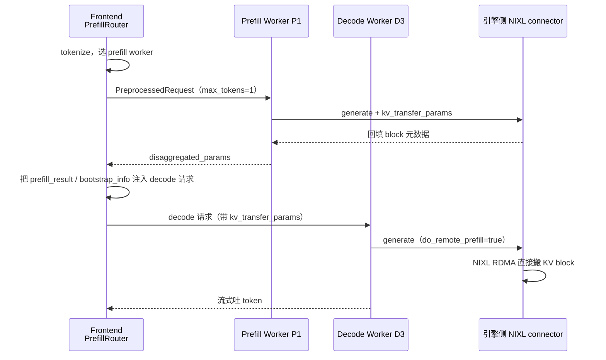

# 05 · P/D 分离与 NIXL：KV 怎么从 P1 搬到 D3

> **源码基线**：`main @ 946acce`。承接 [02 篇 §4](02-核心代码分析-KV感知路由.md#4-pd-分离下的路由要不要分离是每个请求现算的)（要不要分离）和 [04 篇](04-核心代码分析-KVBM分层KV管理.md)（KV 在哪一层），本篇讲**交接本身**。
> 主要文件：`lib/llm/src/kv_router/prefill_router/`、`components/src/dynamo/{vllm,sglang,trtllm}/`、`lib/sidecar/`、`lib/backend-common/`

## 0. 先看全景



三件事值得先记住：

1. **Frontend 是编排者，但不碰 KV 字节**。它只在两个 worker 之间传递「元数据信封」。真正搬 KV 的是两侧引擎里的 NIXL connector，走 GPU 到 GPU 的 RDMA，不经过 Frontend。
2. **prefill 请求的 `max_tokens = 1`**。prefill worker 的产出不是文本，是「KV 已经算好了，在这个位置」这条消息；那 1 个 token 只是副产品。
3. **元数据的形状因后端而异**，这是本篇的主要复杂度来源。

## 1. Frontend 侧：PrefillRouter

`lib/llm/src/kv_router/prefill_router/mod.rs`，`PrefillRouter::generate`（第 284~566 行）是 [01 篇](01-请求的一生-主控制流.md#4-核心一条双向回环的-pipeline) 那条 pipeline 上的一个 forward-only 算子，夹在 Migration 和 decode router 之间。

它做四件事：

| 行 | 动作 |
|---|---|
| `:302` | 存下原始 `max_tokens`（回程恢复给 decode 用） |
| `:392` | **`prefill_req.stop_conditions.max_tokens = Some(1)`** |
| `:428` | `select_and_dispatch_prefill()`——选 prefill worker 并发出去 |
| `:555`、`:565` | 还原 `max_tokens` 后 `next.generate(decode_req)`——把改造过的请求交给 decode router |

回来的结果分两种形态（`:530`、`:537`）：

```rust
PrefillOutcome::Bootstrap   // SGLang 风格：bootstrap_host / bootstrap_port / bootstrap_room
PrefillOutcome::Completed   // vLLM 风格：prefill_result.disaggregated_params
```

`extract_bootstrap_info()`（`:111`）负责从 JSON 里挖出 `bootstrap_host`、`bootstrap_port`、`bootstrap_room`、`handoff_id` 四个字段。

子模块分工：`query.rs`（咨询与预订 prefill worker）、`admission.rs`（队列准入）、`conditional_bypass.rs`（[02 篇 §4](02-核心代码分析-KV感知路由.md#4-pd-分离下的路由要不要分离是每个请求现算的) 的 conditional disagg 入口）、`activation.rs`（生命周期）。

## 2. 核心分歧：pull 还是 push

`components/src/dynamo/vllm/kv_connector_protocols.py` 开头的文档字符串把问题说得很清楚：

```6:13:components/src/dynamo/vllm/kv_connector_protocols.py
vLLM's KV connectors disagree on the shape of ``kv_transfer_params``:
NIXL is pull-based (decode reads block locations from the prefill
response), Mooncake is push-based (prefill pushes blocks under a
pre-allocated ``transfer_id``). This module isolates each protocol
behind :class:`KvConnectorProtocol` so the handler stays
connector-agnostic and new connectors are one class + one registry
entry.
```

抽象出来就两个方法：

```31:40:components/src/dynamo/vllm/kv_connector_protocols.py
    @abstractmethod
    def prefill_request_kv_transfer_params(self) -> Dict[str, Any]:
        """``kv_transfer_params`` for the prefill request to vLLM."""

    @abstractmethod
    def decode_request_kv_transfer_params(
        self, prefill_response: Any
    ) -> Optional[Dict[str, Any]]:
        """``kv_transfer_params`` for the decode worker, derived from the
        prefill response. Return ``None`` if the protocol doesn't produce
        one."""
```

### 2.1 NIXL：拉

```43:60:components/src/dynamo/vllm/kv_connector_protocols.py
class NixlConnectorProtocol(KvConnectorProtocol):
    """Pull-based: decode-side params come straight off the engine response."""

    def prefill_request_kv_transfer_params(self) -> Dict[str, Any]:
        return {
            "do_remote_decode": True,
            "do_remote_prefill": False,
            "remote_engine_id": None,
            "remote_block_ids": None,
            "remote_host": None,
            "remote_port": None,
        }

    def decode_request_kv_transfer_params(
        self, prefill_response: Any
    ) -> Optional[Dict[str, Any]]:
        return prefill_response.kv_transfer_params
```

**【逻辑】** prefill 侧发过去的是一堆 `None`——这是**留给引擎填的空位**。prefill 跑完，vLLM 的 NIXL connector 把真实的 `remote_engine_id` / `remote_block_ids` / `remote_host` / `remote_port` 填进去。decode 侧的参数就是**原样转发**这个填好的结构，decode 引擎拿着它主动 RDMA 拉。

**Frontend 完全不理解这些字段的含义**，它只是个信封搬运工。这个设计让新增 connector 的成本降到「一个类 + 一条注册表项」。

### 2.2 Mooncake：推

```88:107:components/src/dynamo/vllm/kv_connector_protocols.py
    def prefill_request_kv_transfer_params(self) -> Dict[str, Any]:
        return {
            "do_remote_decode": True,
            "do_remote_prefill": False,
            "transfer_id": self._transfer_id,
        }

    def decode_request_kv_transfer_params(
        self, prefill_response: Any
    ) -> Optional[Dict[str, Any]]:
        host, port = self._get_bootstrap_addr(self._vllm_config)
        return {
            "do_remote_decode": False,
            "do_remote_prefill": True,
            "transfer_id": self._transfer_id,
            # http:// is required: decode does `remote_bootstrap_addr + "/query"`.
            "remote_bootstrap_addr": f"http://{host}:{port}",
            "remote_engine_id": self._vllm_config.kv_transfer_config.engine_id,
        }
```

**【逻辑】** `transfer_id` 是**请求一开始就在 Dynamo 侧生成的 UUID**（`__init__` 里 `uuid.uuid4()`），两侧共用。prefill 按这个 id 推，decode 按同一个 id 认领。这是「先约定单号，再各自动作」——比 NIXL 的「先算完再告诉你在哪」少一个往返。

构造函数里那段 import 的注释也值得一读：它在**构造时**就解析 `get_mooncake_bootstrap_addr`，为的是让「vLLM 里没装 Mooncake」这类错误在**请求建立阶段**就炸，而不是等 prefill 都跑完了才发现没法交接。


## 3. 两侧 handler 里发生了什么

**Prefill 侧**（`components/src/dynamo/vllm/handlers.py:3936` `PrefillWorkerHandler._generate_token_mode`）：

```
:3973   _update_kv_transfer_params(sampling_params,
            kv_protocol.prefill_request_kv_transfer_params())     ← :3969 make_kv_connector_protocol
:3977   sampling_params.max_tokens = 1
:4005   engine_client.generate(...)
:4044   kv_protocol.decode_request_kv_transfer_params(res)         从响应导出 decode 侧参数
:4041   yield disaggregated_params
```

**Decode 侧**（`handlers.py:3556` `DecodeWorkerHandler._generate_token_mode`）：

```
:3565   disaggregated_params = prefill_result.get("disaggregated_params") or {}
:3566   kv_params = disaggregated_params.get("kv_transfer_params")
:3660   _update_kv_transfer_params(sampling_params, kv_params)
:3692   async with _deferred_abort_guard(...)   ← 见下
```

### 3.1 Deferred abort：一个非常实在的坑

`handlers.py:176` 的 `_DeferredAbort` 与 `:318` 的 `_deferred_abort_guard` 把 **abort 延迟到首 token 之后**。

原因：客户端断连时正常应该立刻 abort 请求释放资源。但 decode 模式下，此刻 NIXL 可能正在往这个 worker 的显存里 RDMA 写 KV。**abort 会把接收缓冲区撤掉，而对端的 RDMA 还在写**——轻则传输失败，重则写进已释放的显存。

所以要等到第一个 token 吐出来（意味着 KV 已经完整到位、传输结束）才允许 abort。

TRT-LLM 那边有对称的问题和对称的解法：prefill worker 关闭时要 **drain**，等 NIXL 传输完成才能退（`components/src/dynamo/trtllm/main.py:132`、`:57~89`）。**只要有 RDMA 在飞，生命周期管理就得让路**。

## 4. 三个后端的差异

| 维度 | vLLM | SGLang | TRT-LLM |
|---|---|---|---|
| worker 入口 | `WorkerFactory` + handlers | `init_llm.init_decode/init_prefill` | `workers/llm_worker.py` |
| 交接参数 | `KVTransferConfig` + `kv_connector_protocols` | `--disaggregation-mode` + bootstrap port | `DisaggregationMode` + `nixl_connect.Connector` |
| prefill 产出 | `disaggregated_params.kv_transfer_params` | `bootstrap_info`（host/port/room） | NIXL + 引擎内部 handoff |
| 传输语义 | NIXL pull / Mooncake push | bootstrap 协商后 NIXL | NIXL Connect |
| **sidecar 支持 P/D** | ✅ 含 EPD | ✅（但 role 由 SGLang 自报） | ❌ **不支持** |
| 多模态 E/P/D | encode worker + EC connector | `init_multimodal_*` | encode 走 NIXL，但 **decode 不做 MM KV 路由** |
| 关闭时 | decode deferred abort | 标准 graceful | prefill **drain** 等 NIXL |

有个容易踩的配置陷阱（`lib/sidecar/sglang/README.md:39`）：**SGLang 是 role 的唯一权威**，sidecar 模式下 Dynamo 的 `--disaggregation-mode` 对它无效，而且会拒绝 `--route-to-encoder`。配置写了不报错但不生效，这类问题最难查。

## 5. `lib/sidecar/*`：另一种 worker 形态

四个 crate：`common`（共享 gRPC 传输、endpoint 校验、连接池、错误映射）+ `vllm` / `sglang` / `trtllm` 三个具体实现。

### 5.1 它和 Python 侧是什么关系

| | Rust sidecar | Python `dynamo.{vllm,sglang,trtllm}` |
|---|---|---|
| 引擎在哪 | **独立进程**，通过引擎原生 gRPC 对话 | **进程内嵌**（`AsyncLLM` / `sgl.Engine` / TRT-LLM Python API） |
| 功能面 | 注册、路由、指标 | 完整 handler、多模态、RL、benchmark |
| 适用 | K8s 原生 sidecar 容器；没有 Python 引擎绑定的环境 | 功能最全 |

入口极简：

```6:8:lib/sidecar/vllm/src/main.rs
let (engine, config) = dynamo_vllm_sidecar::VllmSidecarEngine::from_args(None)?;
dynamo_backend_common::run(Arc::new(engine), config)
```

三个 sidecar 共用 `dynamo_backend_common::Worker::run_inner`（`lib/backend-common/src/worker.rs:582~670`）统一走：`DistributedRuntime::from_settings` → `engine.start(worker_id)` → `setup_publishing`（KV publisher / snapshot）→ `serve_with_orchestrator`（`local_model.attach()` + `endpoint.serve()`）。

Python 侧也能拉起同一个二进制（`components/src/dynamo/vllm/sidecar.py:12` 调 `_backend._run_vllm_sidecar(argv)`），所以「用 sidecar」不等于「放弃 Python 工具链」。

### 5.2 为什么要有它

git 历史（`git log --oneline -- lib/sidecar`）：

```
7e8e12e498 refactor(sidecars): extract shared gRPC infrastructure (#11844)
cbd4b9e5fc feat(trtllm): add TensorRT-LLM native gRPC sidecar backend (#11840)
dc8cead537 feat(sglang): add sidecar KV routing (#13579)
67203f32d2 feat(vllm): add sidecar KV-router launchers (#13735)
dbdaf5d699 feat(vllm): add Python sidecar launcher (#13923)
18ee7cc26a feat(vllm): add sidecar EPD support (#13966)
```

动机是**把「Dynamo 的注册/路由/指标」与「引擎进程」解耦**。内嵌模式下两者共命运：升级 Dynamo 要重启引擎，引擎崩了 Dynamo 侧的注册也一起没。sidecar 模式下引擎是独立进程，用 K8s 原生 sidecar 容器（`initContainers` + `restartPolicy: Always`）编排，两边可以各自重启。

## 6. Request Migration

[01 篇 §4.2](01-请求的一生-主控制流.md#42-migration-算子容错藏在链里) 已经讲过它是 pipeline 上的一个算子。这里补 P/D 相关的部分。

`lib/llm/src/migration.rs`：

| 位置 | 内容 |
|---|---|
| `:67` `is_migratable()` | 可迁移错误：Disconnect / ResponseTimeout / EngineShutdown / StreamIncomplete / WorkerOverloaded |
| `:93` `is_migratable_for_request()` | **尊重 explicit worker pin 和 disagg 阶段** |
| `:259` `RetryManager` | 跟踪已发 token、重建 stream、设 `migration_link` |
| `:327` | guided decoding、`n > 1` 不可迁移 |

`:93` 那条是 P/D 相关的关键：**处在 disagg 特定阶段的请求不能迁移**。KV 已经从 P1 搬到 D3 了，这时候把请求挪到 D2 意味着 KV 得重搬一遍，甚至源端的 prefill 结果已经释放。所以迁移只在「还没开始交接」或「已经完全交接完」的状态下允许。

测试在 `tests/fault_tolerance/migration/test_{vllm,sglang,trtllm}.py`，三个后端各一套。

## 7. 多模态 E/P/D

图片 / 视频输入多一段 encode，变成 encode → prefill → decode 三段：

| 层 | 位置 |
|---|---|
| 路由 | `lib/llm/src/kv_router/encoder_router.rs:57`——发现 Encode endpoint 后 round-robin |
| vLLM encode worker | `worker_factory.py:864` `EncodeWorkerHandler`，`WorkerType.Encode`，`needs=[[Prefill,Decode],[Aggregated]]` |
| prefill 挂 encode | `worker_factory.py:1692`——`--route-to-encoder` 时 prefill 的 `needs` 加上 Encode |
| sidecar EPD | `lib/sidecar/vllm/README.md:113`，启动脚本 `disagg_multimodal_epd.sh` |
| SGLang | `components/src/dynamo/sglang/init_multimodal.py` |

注意 encode 路由是 **round-robin，不是 KV-aware**——图像 embedding 的复用逻辑和文本前缀不同，走的是单独的 embedding cache（[01 篇](01-请求的一生-主控制流.md#51-七种-router-mode) 提到 `device-aware-weighted` 模式下的 multimodal cache indexer）。

`needs` 这个字段值得留意：它声明了「我这个 worker 需要什么角色配合才能工作」，是 worker 之间依赖关系的显式表达。encode worker 的 `needs=[[Prefill,Decode],[Aggregated]]` 意思是「要么给我一对 prefill+decode，要么给我一个 aggregated」。

## 8. `lib/mocker`：没有 GPU 也能验证调度

模拟引擎分三部分：

| 位置 | 是什么 |
|---|---|
| `lib/mocker/` | GPU-free 的调度器 + KV cache 行为模拟 |
| `lib/mocker/servers/{vllm,sglang}/` | 模拟引擎的原生 gRPC 协议（给 sidecar / CI 用） |
| `components/src/dynamo/mocker/` | `python3 -m dynamo.mocker`，注册成一个真的 worker |

它**会发 KV 事件**（`KvEventPublishers`），所以 02 篇讲的整套路由链路都能在无 GPU 环境下端到端测（`tests/router/test_router_e2e_with_mockers.py`）。P/D handoff 的形状也模拟了（`lib/mocker/servers/vllm/src/server_request.rs:341` 处理 `do_remote_prefill`）。

**但它不模拟 NIXL 的物理传输**。所以：能用它验证路由打分、准入、扩缩容决策；**不能**用它验证 RDMA 时序、传输失败恢复、引擎的 corner case。

## 9. 回到统一示例

请求 A 走 P/D 分离，prefill 池 P1/P2，decode 池 D1/D2/D3：

1. Frontend tokenize A → `PrefillRouter` 用 KV-aware 打分在 P1/P2 里选（**prefill 侧看 overlap**）
2. **conditional disagg 检查**（02 篇 §4）：A 的净新增 token 若 < 2048 且占比 < 0.7，直接跳过 remote prefill，退化成在 decode worker 上聚合跑完
3. 走分离的话：P1 收到 `max_tokens=1` 的请求，算完 prefill，回填 `kv_transfer_params`
4. Frontend 把它注入 decode 请求，交给 decode router 选 D3（**decode 侧默认只看负载，不看 overlap**，02 篇 §1.5）
5. D3 的 vLLM NIXL connector 拿着 `remote_block_ids` 等字段，从 P1 的显存 RDMA 拉 KV
6. D3 开始 decode，**首 token 之前不响应 abort**
7. token 流经 Frontend detokenize 回客户端

## 10. 必记要点

1. **Frontend 只搬元数据信封，不碰 KV 字节**；真正的 GPU→GPU RDMA 在两侧引擎的 connector 之间。
2. **prefill 请求 `max_tokens = 1`**，它的产出是「KV 在哪」而不是文本。
3. **pull（NIXL）vs push（Mooncake）是两种交接语义**：前者 prefill 填空位、decode 拿着地址来拉；后者先约定 `transfer_id`、prefill 直接推。
4. **Frontend 不理解这些字段**，新增 connector 只要一个类 + 一条注册表项。
5. **decode 侧 deferred abort、prefill 侧 shutdown drain**——只要有 RDMA 在飞，生命周期管理就得让路。这是 P/D 分离最容易出隐蔽 bug 的地方。
6. **TRT-LLM 的 sidecar 不支持 P/D**；**SGLang sidecar 下 role 由 SGLang 自报**，Dynamo 的 `--disaggregation-mode` 无效且不报错。
7. **sidecar 形态把 Dynamo 侧与引擎进程解耦**，两边可以各自重启，用 K8s 原生 sidecar 容器编排。
8. **disagg 交接过程中的请求不可迁移**（`migration.rs:93`）。
9. **encode 路由是 round-robin 不是 KV-aware**；worker 用 `needs` 显式声明角色依赖。
10. **mocker 能验证路由与调度，不能验证 NIXL 传输**。

---

> **上一篇** [04 · KVBM](04-核心代码分析-KVBM分层KV管理.md) ｜ **下一篇** [06 · 部署与 Operator](06-部署与Operator.md)
> **横向对比**见 [07 · 与 llm-d / Mooncake 的横向对比](07-横向对比-与llm-d和Mooncake.md)
