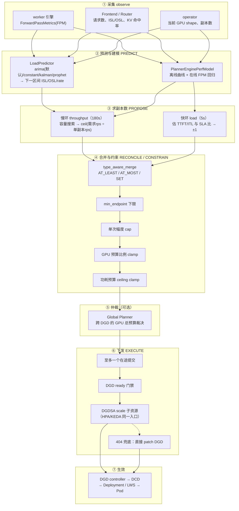

# 07 · 弹性扩缩容的实现逻辑：一个 tick 里到底发生了什么

> **源码基线**：`main @ 946acce`。[03 篇](03-核心代码分析-SLA-Planner.md) 回答「副本数怎么**算出来**」，本篇回答「这个数怎么被**驱动、约束、下发、生效**」——也就是弹性扩缩容作为一条控制链的完整实现。
> 主要文件：`components/src/dynamo/planner/core/base.py`（主循环）、`plugins/orchestrator/`（五阶段管道）、`plugins/merge/`（提案合并）、`plugins/registry/`（熔断）、`core/budget.py`（约束）、`connectors/`（下发）、`deploy/operator/internal/controller/`（生效）

## 0. 本篇与 03 篇的分工

两篇讲的是同一件事的两个侧面，别混：

| | [03 篇](03-核心代码分析-SLA-Planner.md) | **本篇** |
|---|---|---|
| 问题 | 副本数**是多少** | 这个数**怎么流动** |
| 核心内容 | 容量搜索、性能模型、双环判据、SLA 约束 | 控制环 tick、五阶段插件管道、提案合并、约束链、下发与生效 |
| 类比 | 「算式」 | 「流水线」 |

如果只想知道「TTFT 200ms 会开几个副本」，读 03；如果要排查「为什么算出来了却没生效」，读本篇。

## 1. 全景：一条七段链



**六个必须先建立的认知：**

| # | 认知 | 为什么重要 |
|---|---|---|
| 1 | **扩缩的对象是 DGD 里某个 component 的 `replicas`**，不是 Pod、也不是 GPU | 一个副本可能是「一台 8 卡机」（TP=8 的 recipe 就是 `replicas: 1` + `gpu: "8"`），副本数要乘并行度才是 GPU 消耗，见 [06 篇 §5](06-部署与Operator.md#5-recipes开箱配置) |
| 2 | **prefill 池和 decode 池是分开算、合并下发的** | 单侧超扩会把 GPU 预算吃光，§6.3 |
| 3 | **Planner 不是 K8s controller，是 DGD 里一个普通 Python 组件** | 它自己也在发现平面注册了 endpoint（[03 篇 §1](03-核心代码分析-SLA-Planner.md#1-运行形态与三层节拍)），Global Planner 靠这个和它对话 |
| 4 | **Planner 不直接改 Deployment**，只改 DGDSA / DGD | 与 HPA/KEDA 共用 scale 接口，§8 |
| 5 | **决策逻辑本身是插件**，内置算法也走同一套插件契约 | §3、§4——这决定了「怎么替换算法」 |
| 6 | **扩容比缩容激进，缩容比扩容谨慎** | 贯穿全链的不对称，§9 |

## 2. 控制环：一个 tick 的完整流程

主循环在 `core/base.py:1026` `run()`（[03 篇 §1](03-核心代码分析-SLA-Planner.md#1-运行形态与三层节拍) 已给过代码），每次到点调 `_run_one_tick`：

```python
async def _run_one_tick(self, engine, tick) -> ScheduledTick:
    """Execute one complete environment-to-scaling planner tick."""
    await self._refresh_and_update_capabilities()      # ① 刷新引擎能力（max_kv_tokens 等）
    tick_input = await self._observe_tick(engine, tick) # ② 采集 FPM + 流量
    self._publish_observation_metrics(tick_input)
    self._publish_inventory_and_gpu_hours(tick_input)
    ...
    async with self._config_lock:
        config_generation = self._config_generation     # ③ 快照配置代号
        effects = await engine.tick(tick, tick_input)   # ④ 跑管道，产出决策
    await self._submit_effects(effects, config_generation)  # ⑤ 下发
    ...
    return effects.next_tick                            # ⑥ 决定下次何时醒
```

四个实现细节值得留意：

1. **能力刷新在最前面**。`max_num_batched_tokens` / `max_kv_tokens` / `context_length` 这些引擎能力是容量计算的分母，滚动升级换了引擎参数必须先拿到新值，否则会拿旧分母算新负载。
2. **`config_generation` 快照**。决策是基于「某一代配置」算出来的；下发前会再比一次，若期间有人 PATCH 了运行时配置，这次决策**直接丢弃**（§7）。
3. **tick 间隔由决策自己返回**（`effects.next_tick`），不是固定 sleep。这让双环能在同一个循环里跑出不同节奏。
4. **GPU shape 拿不到就跳过整个 tick**。`GPUShapeUnavailableError` 会被 `run()` 捕获，退避 `_GPU_SHAPE_RETRY_*` 后重试——**operator 还没发布当前 GPU 形状时，Planner 宁可不动**。

## 3. 五阶段插件管道

这是 1.5 里扩缩容决策的实际组织方式，也是最容易被忽略的一层：**内置算法（慢环 / 快环）本身就是插件**，走的是和第三方插件完全相同的契约。

```
PREDICT → PROPOSE → RECONCILE → CONSTRAIN → EXECUTE
```

> **别被源码里的「4-stage」绕住**：`pipeline.py` 的模块 docstring 第一行写的是 `4-stage plugin pipeline driver`，`run_pipeline` 的 docstring 也说 "through the 4 stages"，但紧接着列的顺序有五项。这不矛盾——**只有前四个阶段会调用插件**，EXECUTE 不调插件、只产出一个决策名（见下）。所以「4 阶段」指的是「4 个插件阶段」。

`plugins/orchestrator/pipeline.py` 的模块 docstring 把语义写得很清楚：

| 阶段 | 执行方式 | 合并方式 | 职责 |
|---|---|---|---|
| **PREDICT** | 按 priority **升序串行链**（`chain_augment`） | first-writer-wins 部分合并 | 产出流量预测，挂到 `PipelineContext.predictions` 供下游用 |
| **PROPOSE** | `asyncio.gather` **并行扇出** | `type_aware_merge`（`set_allowed=True`） | 提出目标副本数 |
| **RECONCILE** | 并行扇出 | 同上 | 跨组件对齐（P/D 配比等） |
| **CONSTRAIN** | 并行扇出 | `type_aware_merge`（**`set_allowed=False`**） | 只允许收紧，不允许改写目标 |
| **EXECUTE** | **不调插件** | — | 只产出一个 `PipelineOutcome` 决策名 |

三处设计值得记住：

- **PREDICT 是串行链，其余是并行扇出**。预测天然有依赖（后一个预测器可能要用前一个的结果补全字段），所以按优先级串起来做部分合并；提案和约束之间没有依赖，并行更快。
- **CONSTRAIN 阶段 `set_allowed=False`**：约束类插件**只能提 AT_LEAST / AT_MOST，不能提 SET**。被丢弃的 SET 会记录到 `MergeOutcome.set_dropped` 并进审计。这条把「谁有权决定目标」和「谁只能收紧目标」在类型层面分开了——一个约束插件无法悄悄篡改扩缩目标。
- **EXECUTE 只是个决策名，不做 I/O**。管道返回 `execute_action ∈ {apply, skip_no_targets, skip_short_circuit, skip_tick_timeout}`，真正调 connector 的是 `NativePlannerBase`。orchestrator 的 docstring 明确写了它 *does not own* `PlannerConnector`——**算法层与执行层彻底解耦**。

还有两条防御式约定：

- **空目标不下发**。CONSTRAIN 产出空 `targets`（所有插件都 ACCEPT）时走 `execute_skipped_no_targets`，而不是「no-op 地 apply 一个空提案」。
- **只有最外层一个超时**。整个管道被一个 `asyncio.wait_for` 包住；**阶段级不再套 `wait_for`**，因为每个插件调用内部已有自己的 deadline。仓库里有一个基于 grep 的回归测试专门守这条约定（`tests/plugins/orchestrator/test_pipeline.py`），防止有人后来加回阶段级超时导致超时语义叠加。

## 4. 提案怎么合并：`type_aware_merge`

多个插件同时对同一个组件提出副本数，怎么裁决？算法在 `plugins/merge/type_aware.py`，是个**纯同步、确定性、无 I/O** 的函数。

三种提案类型（`plugins/types.py` 的 `OverrideType`）：

| 类型 | 语义 |
|---|---|
| `SET` | 「就设成这个数」——推荐值 |
| `AT_LEAST` | 「不能少于这个数」——下界 |
| `AT_MOST` | 「不能多于这个数」——上界 |

合并算法四步：

```
1. REJECT 短路 —— 任一插件返回 RejectResult 就整体短路（优先级高于 final）
2. final 优先   —— 任一 OverrideResult 带 final=True，取 priority 最小者的 targets 直接作为结果
3. 按 sub_component_type 分桶，桶内：
       floor          = max(所有 AT_LEAST)          默认 0
       ceiling        = min(所有 AT_MOST)           默认 +inf
       recommendation = priority 最小的 SET，否则取 baseline（当前副本数）
       result         = max(floor, min(ceiling, recommendation))
4. 取整成 int，构造 ScalingProposal
```

**`max(floor, min(ceiling, recommendation))` 这个夹取顺序是刻意的**：当 `floor > ceiling`（上下界打架）时，**floor 赢**。也就是说「至少要几个」比「最多能几个」优先——宁可超出上界也不低于下界。这与整条链「扩容激进、缩容谨慎」的取向一致。

另外 **`recommendation` 缺省取 baseline 而不是 0**：没有任何插件提 SET 时，结果是「维持现状再夹一遍上下界」，而不是「缩到零再抬上来」。这个默认值选错会造成灾难性缩容。

> 与 llm-d WVA 的多 analyzer 投票（any-up / all-down）做的是同一件事——融合多个信号源的意见——但语义完全不同。对比见 [08 篇 §7](08-扩缩容方法对比-与llm-d-WVA.md#7-多信号融合投票-vs-类型化合并)。

## 5. 插件容错：熔断器与 HOLD_LAST

插件可能是第三方 gRPC 服务，会慢会挂。两层保护：

### 5.1 熔断器

`plugins/registry/circuit_breaker.py` 是标准三态机，**per-plugin** 独立：

```
CLOSED
  │  连续 record_failure 达 failure_threshold 次
  ▼
OPEN ──── cooldown 到期 ────► HALF_OPEN
  ▲                              │
  │ record_failure（重置 cooldown）│ record_success
  └──────────────────────────────┘
                                 ▼
                               CLOSED
```

- 默认 `failure_threshold = 5`、`cooldown_seconds = 30.0`；README 建议**生产改成 10 / 60s**，避免瞬时网络抖动放大成熔断。
- 状态**纯内存**，registry 重启后全部回到 CLOSED。
- CLOSED → OPEN 时通过 `on_open` 回调 fan-out 给 `PluginScheduler`，用来**失效 HOLD_LAST 缓存**。

### 5.2 HOLD_LAST：不是每个 tick 都要问每个插件

每个插件有自己的 `execution_interval_seconds`，所以某个 tick 里它可能「不到点」。此时按 `hold_policy` 处理（`plugins/types.py:40`）：

| `hold_policy` | 不到点时的行为 |
|---|---|
| `ACCEPT_WHEN_IDLE`（默认） | 视为 ACCEPT（弃权），不影响结果 |
| `HOLD_LAST` | **继承上次的 `OverrideResult`**（缓存命中时）；缓存为空则退化成 ACCEPT |

这解释了 [03 篇 §4.2](03-核心代码分析-SLA-Planner.md#42-两个环怎么合并) 里「慢环 180s 一次，但它的下界在中间的每个 5s tick 都生效」是怎么实现的——**慢环的下界靠 HOLD_LAST 被继承下来**，而不是每个 tick 重算一遍容量搜索。

缓存会在三种情况下被清：插件熔断打开、插件重新注册、缓存过期。

### 5.3 插件崩了不影响整个 tick

单个插件调用失败只记一次 failure 并按弃权处理，管道继续。**这与 llm-d WVA 的做法一致但机制不同**：WVA 用 `recover()` 兜 panic + liveness 门防止「哑掉的 analyzer 永久否决缩容」；Dynamo 用熔断器 + 默认弃权语义。两者都在解同一个问题——**故障信号源不应该获得否决权**。

## 6. 约束链：四道 clamp

合并出目标后，还要过四道约束才算最终值。**顺序很重要**，后面的赢。

### 6.1 `min_endpoint` 下限

`resolve_min_endpoint(config, "prefill"|"decode")`，默认 `min_endpoint = 1`，可用 `prefill_min_endpoint` / `decode_min_endpoint` 分别覆盖。

注意在慢环里它被**放在幅度 cap 之后**（`core/throughput_scaling.py:140~141`）：

```python
num_p = self._cap_throughput_replicas(num_p, self._num_p_workers, "prefill")
num_d = self._cap_throughput_replicas(num_d, self._num_d_workers, "decode")
# A runtime endpoint increase must recover immediately even when the
# gap is larger than the throughput delta cap.
num_p = max(num_p, resolve_min_endpoint(self._config, "prefill"))
num_d = max(num_d, resolve_min_endpoint(self._config, "decode"))
```

源码注释解释了为什么：**运行时把 `min_endpoint` 调大必须立刻生效**，不能被单次幅度上限压住慢慢爬。

### 6.2 单次变化幅度 cap

`core/throughput_scaling.py:37`：

```python
limit = self._config.max_throughput_scaling_replicas       # 默认 8
bounded = min(max(desired, max(0, current - limit)), current + limit)
```

一次最多改 8 个副本。被截断会打 `Throughput target capped for ...` warning。

### 6.3 GPU 预算的比例 clamp

`_fit_disagg_throughput_ceiling()`（`core/state_machine.py:496`）+ `_apply_disagg_scaling_budget()`（`:553`），数学在 `core/budget.py:93` `proportional_clamp_pair`。

关键点：预算不够时**按比例缩两边，不是先到先得**。默认 `max_gpu_budget = 8`、`min_gpu_budget = -1`（下限禁用）。

配套的还有一条：**任一侧算不出来（`model_not_ready`）就整个 tick 放弃**（`core/throughput_scaling.py:127`），另一侧被标 `partner_not_ready`。宁可不动，也不做半边决策——P/D 比例失衡比不扩容更糟。

### 6.4 功耗预算的 ceiling clamp

这一道容易被忽略。`core/budget.py:559` 起：

```
projected_watts = Σ (副本数 × 该角色 watts_per_replica)
若 projected > total_gpu_power_limit → 下调副本数
```

三条语义（源码注释直接给出）：

1. **只有天花板，没有地板**——它只会**降低**副本数。
2. **应用在 GPU 预算 clamp 之后**，两者冲突时**功耗赢**，GPU 下限的违反只上报不强制执行。
3. **它约束的是「请求的功耗上限」的投影，不是实测硬件功耗**。Power Agent 可能把 cap 抬到 GPU 最小值、或者根本没生效，而且**不会把实际生效值回传**给 Planner。所以这是一个模型内的硬约束、模型外的估计值。

可观测指标：`dynamo_planner_power_budget_total_watts` / `_power_projected_watts` / `_power_budget_utilization`。

## 7. 下发：三道安全阀

`core/base.py` 的 `_submit_effects` 是全链最保守的一段，三个机制叠在一起：

### 7.1 至多一个在途提交

```python
pending = self._effect_submission_task
if pending is not None and not pending.done():
    logger.warning("Skipping planner effect submission while the previous "
                   "request is still awaiting acknowledgement")
    return
```

上一次提交还没被确认，这一次**直接丢弃**——不排队、不取消、不并发。

### 7.2 结果未知则永久挂起

如果上一次提交的 task 被取消或抛异常，进入 `_effect_submission_outcome_unknown` 状态：

```python
if self._effect_submission_outcome_unknown is not None:
    logger.error(
        "Holding planner effects because a previous submission outcome "
        "is unknown; runtime configuration remains available, but "
        "automatic submission requires a Planner restart after the "
        "deployment state is verified")
    return
```

**此后所有自动扩缩容都停止，直到人工确认部署状态并重启 Planner。** 这是个很强的选择：它假定「不知道上次改成了什么」比「不扩容」危险得多——因为在不知道当前状态的前提下继续下发，可能把副本数推到任意值。运行时配置接口（GET/PATCH）仍然可用，方便人工介入。

> **这是运维上必须监控的一条 ERROR 日志。** 一旦出现，扩缩容已经彻底停摆，且不会自愈。

### 7.3 配置代号校验

```python
if config_generation != self._config_generation:
    logger.info("Discarding planner effects computed at runtime config "
                "generation %d; current generation is %d", ...)
    return
```

决策期间有人 PATCH 了配置 → 这次决策基于过期配置 → 丢弃。创建 remote task 是「准入点」，PATCH 走同一把外层锁，保证检查与准入之间不会插入更新。

### 7.4 连接器侧：DGD ready 门禁

进到 `KubernetesConnector.set_component_replicas`（`connectors/kubernetes.py:910`）后还有一道：

```
:917  get_graph_deployment()      读回当前 DGD
:919  is_deployment_ready(...)    不 ready 就拒绝（raise_not_ready）或静默跳过
      逐组件比较 current vs desired，只对有变化的调 update
```

**上一轮扩容的 Pod 还没起来时，不叠加下一轮扩容。** Dynamo 没有传统的 cooldown 计时器，靠的就是这个 + §9 的缩容预演。

## 8. 生效：DGDSA 怎么把数字变成 Pod

```
DGDSA.spec.replicas 被改
  → DynamoGraphDeploymentScalingAdapterReconciler.Reconcile
     （deploy/operator/internal/controller/dynamographdeploymentscalingadapter_controller.go:60）
  → :108 读出目标 DGD 里该 component 当前 replicas
  → :114 不一致就 :116 写 component.Replicas = &adapter.Spec.Replicas，更新 DGD
  → :140 回写 adapter.Status.Replicas（scale 子资源的 status）
  → DGD controller 被 DGD 变更唤醒（:194 findAdaptersForDGD 建立双向 watch）
  → 展开成 DynamoComponentDeployment → Deployment / LeaderWorkerSet → Pod
```

Planner 侧的两条路径（`connectors/clients/kubernetes_api.py:119`）：

```
update_service_replicas()
  ├── 优先：patch_namespaced_custom_object_scale 打到 DGDSA 的 scale 子资源
  │        （CR 名 = `<dgd>-<component 小写>`，:132）
  └── 404 兜底：_update_dgd_replicas() 直接 JSON-patch DGD.spec.components[].replicas
```

**DGDSA 是一层刻意加的间接**，换来三件事：

1. **实现 K8s 标准 `scale` 子资源接口**，所以 `kubectl scale`、**HPA、KEDA 都能操作同一个对象**——Planner 和标准 K8s 扩缩容器走同一入口，不会互相覆盖。
2. **`scale` 子资源需要 `selector`**，`buildPodSelector`（`:152`）负责生成，HPA 靠它找 Pod 采指标。
3. 启用了 ScalingAdapter 的 component，operator webhook **禁止直接改 DGD 里的 replicas**（`internal/webhook/validation/shared_v1beta1.go:670`）：

```go
// Protect replica ownership when a scaling adapter is present in either state.
if (newComponent.ScalingAdapter != nil || oldComponent.ScalingAdapter != nil) && !canModifyReplicas &&
    k8sptr.Deref(newComponent.Replicas, int32(1)) != k8sptr.Deref(oldComponent.Replicas, int32(1)) {
    allErrs = append(allErrs, field.Forbidden(
        fldPath.Child("replicas"),
        "cannot be modified directly when scaling adapter is enabled; scale or update the related DynamoGraphDeploymentScalingAdapter instead"))
}
```

避免「人手 `kubectl edit` 改了 replicas，下个 tick 又被 Planner 改回去」的拉锯。

## 9. 防振荡：六道机制

Dynamo **没有** cooldown 计时器，也没有 llm-d WVA 那种静态死区。它用的是六道各管一段的机制：

| # | 机制 | 位置 | 管哪一段 |
|---|---|---|---|
| 1 | **冷启动观测门槛** | `load_min_observations = 5` | 数据不足不决策 |
| 2 | **回归模型单调性校验** | `core/perf_model/base.py:205~265` | 拟合不合物理就拒绝整个模型（[03 篇 §3.1](03-核心代码分析-SLA-Planner.md#31-在线回归模型的两个工程细节)） |
| 3 | **慢环下界托底** | `core/load_scaling.py:102`、`:203` | 快环不能压到慢环安全线以下 |
| 4 | **consolidation 预演** | `core/load_scaling.py:419` 起 | 缩容前先预测「少一台会不会立刻违约」（[03 篇 §4.3](03-核心代码分析-SLA-Planner.md#43-sla-模式下的负载环到底看什么)） |
| 5 | **单次幅度 cap** | `core/throughput_scaling.py:37` | 一次最多改 8 个 |
| 6 | **DGD ready 门禁** | `connectors/kubernetes.py:919` | 上一轮 Pod 没起来不叠加 |

**这套设计的取向：用「模型预测 + 状态门禁」替代「固定时间窗口」。** 好处是贴合负载而非拍脑袋定窗口；代价是**当 DGD 长期 not-ready（比如 GPU 不够 Pod 一直 Pending）时，扩缩容会整体停摆**——这是运维要盯的第一号异常。

顺便记住这条贯穿全链的不对称：

| 环节 | 扩容 | 缩容 |
|---|---|---|
| easy mode 阈值 | 任一引擎超标（OR） | 所有引擎都低于下阈值（AND） |
| SLA 模式判据 | 所有引擎都 > SLA（`all`） | 还要过 consolidation 预演 |
| 上下界打架 | floor 赢（`max(floor, min(ceiling, rec))`） | — |
| 功耗预算 | 只降不升 | — |

## 10. 可观测与排障

### 10.1 关键指标（前缀 `dynamo_planner_`）

| 类别 | 指标 |
|---|---|
| 当前状态 | `num_prefill_replicas`、`num_decode_replicas`、`gpu_hours` |
| 观测值 | `observed_ttft_ms`、`observed_itl_ms`、`observed_requests_per_second`、`observed_{input,output}_sequence_tokens` |
| 预测值 | `predicted_requests_per_second`、`predicted_{input,output}_sequence_tokens` |
| 决策结果 | `predicted_num_prefill_replicas`、`predicted_num_decode_replicas` |
| SLA 与估计 | `sla_target_{ttft,itl}_ms`、`estimated_{ttft,itl}_ms`（跨引擎取 max） |
| 单副本容量 | `engine_prefill_capacity_requests_per_second`、`engine_decode_capacity_requests_per_second` |
| **决策原因（Enum）** | `load_scaling_decision`、`throughput_scaling_decision` |
| 每引擎队列 | `engine_queued_prefill_tokens`、`engine_queued_decode_kv_tokens`、`engine_inflight_decode_kv_tokens`（带 `worker_id` / `dp_rank` label） |
| 功耗 | `power_budget_total_watts`、`power_projected_watts`、`power_budget_utilization` |

**两个 Enum 指标是排障主入口**——它直接给出「这个 tick 为什么没动」。

### 10.2 决策原因速查

| 取值 | 含义 | 该看哪 |
|---|---|---|
| `disabled` | 该环没启用 | `enable_load_scaling` / `enable_throughput_scaling` |
| `insufficient_data` | 观测不足 / 引擎能力缺失 / `num_workers == 0` | FPM 有没有上报；`load_min_observations` |
| `model_not_ready` | 性能模型算不出 `engine_rps` | 是否被单调性校验拒了（[03 篇 §3.1](03-核心代码分析-SLA-Planner.md#31-在线回归模型的两个工程细节)） |
| `partner_not_ready` | 自己算出来了，但对侧没算出来 | 看另一侧的原因 |
| `set_lower_bound` | 慢环只写了下界（两环都开时的正常态） | 不是错误，见 [03 篇 §4.2](03-核心代码分析-SLA-Planner.md#42-两个环怎么合并) |
| `gpu_budget_guard_hold` | 被 GPU 预算 clamp 住 | `max_gpu_budget` |
| `scale_down_capped_by_throughput` | 想缩但被慢环下界挡住 | 正常保护 |
| **`scale_down_refused_consolidation`** | **缩容预演不通过** | 「明明很闲却不缩容」的第一关键字，§9 机制 4 |
| `no_change` | 算完就是现在这个数 | — |

### 10.3 五段式排障链

扩缩容没生效时，按这条链自上而下定位：

```
① Planner 算没算出来   → 日志 `Prefill: X rps / Y = N` / 两个 decision Enum 指标
② 有没有被拦在下发前   → warning「previous request is still awaiting acknowledgement」
                          error「previous submission outcome is unknown」（§7.2，不自愈！）
                          warning「Deployment ... is not ready」（§7.4）
③ DGDSA 变了没         → kubectl get dgdsa <dgd>-<component> -o yaml | grep replicas
④ DGD 的 component 变了没 → kubectl get dgd <name> -o yaml
⑤ Deployment / Pod     → replicas 是否同步；Pod 是否 Pending（GPU 不够）
```

**五段里断在哪一段，问题域完全不同**：① 是模型/数据问题，② 是 Planner 自身状态机问题，③④ 是 operator 问题，⑤ 是集群容量问题。

## 11. 必记要点

1. **本篇讲流水线，03 篇讲算式**。「算出来了但没生效」属于本篇。
2. **一个 tick 六步**：刷能力 → 采集 → 快照配置代号 → 跑管道 → 下发 → 决定下次醒的时间；GPU shape 拿不到就整 tick 跳过。
3. **决策是五阶段插件管道**：PREDICT（串行链）→ PROPOSE / RECONCILE / CONSTRAIN（并行扇出）→ EXECUTE（只出决策名）。内置算法也是插件。
4. **CONSTRAIN 阶段禁 SET**：约束插件只能收紧、不能改写目标，类型层面隔离权限。
5. **合并语义 `max(floor, min(ceiling, recommendation))`**：上下界打架时 floor 赢；无 SET 时 recommendation 默认取 **baseline 而非 0**。
6. **插件容错 = 熔断器 + HOLD_LAST**；慢环的下界能在中间每个 tick 生效，靠的正是 HOLD_LAST 继承。
7. **约束链四道，顺序有意义**：min_endpoint（放在幅度 cap 之后，保证调大立刻生效）→ 幅度 cap → GPU 预算比例 clamp → **功耗预算 ceiling（只降不升，冲突时赢过 GPU 下限）**。
8. **下发三道安全阀**：至多一个在途；**结果未知则永久挂起且不自愈**（必须监控这条 ERROR）；配置代号不匹配则丢弃。
9. **落地走 DGDSA scale 子资源**，与 HPA/KEDA 共用入口，webhook 禁止直接改 DGD 的 replicas。
10. **防振荡六道机制，没有 cooldown 计时器**——用模型预测 + ready 门禁代替固定窗口；副作用是 DGD 长期 not-ready 时扩缩容整体停摆。
11. **排障先看两个 decision Enum 指标**，再走五段式链条。

---

> **上一篇** [06 · 部署与 Operator](06-部署与Operator.md) ｜ **下一篇** [08 · 扩缩容方法对比：与 llm-d WVA](08-扩缩容方法对比-与llm-d-WVA.md)
> **回到** [Dynamo 系列首页](README.md)
